# AI Assistant System

<cite>
**Referenced Files in This Document**
- [local-models.ts](file://server/local-models.ts)
- [local-skills.ts](file://server/local-skills.ts)
- [local-mcp.ts](file://server/local-mcp.ts)
- [assistant-chat.ts](file://server/assistant-chat.ts)
- [knowledge-search.ts](file://server/knowledge-search.ts)
- [deploy-api.ts](file://server/deploy-api.ts)
- [ArtisticAssistant.tsx](file://src/pages/ArtisticAssistant.tsx)
- [SkillsLibrary.tsx](file://src/pages/SkillsLibrary.tsx)
- [ArtisticAssistant.css](file://src/pages/ArtisticAssistant.css)
- [SkillsLibrary.css](file://src/pages/SkillsLibrary.css)
- [skill.md](file://skill.md)
- [package.json](file://package.json)
</cite>

## Update Summary
**Changes Made**
- Enhanced conversational interface architecture documentation with detailed UI data flow
- Expanded knowledge base integration coverage for multiple data sources
- Added comprehensive skill system design patterns documentation
- Updated architectural diagrams to reflect current system structure
- Enhanced troubleshooting guides with specific error scenarios

## Table of Contents
1. [Introduction](#introduction)
2. [Project Structure](#project-structure)
3. [Core Components](#core-components)
4. [Architecture Overview](#architecture-overview)
5. [Detailed Component Analysis](#detailed-component-analysis)
6. [Conversational Interface Architecture](#conversational-interface-architecture)
7. [Knowledge Base Integration](#knowledge-base-integration)
8. [Skill System Design Patterns](#skill-system-design-patterns)
9. [Dependency Analysis](#dependency-analysis)
10. [Performance Considerations](#performance-considerations)
11. [Troubleshooting Guide](#troubleshooting-guide)
12. [Conclusion](#conclusion)
13. [Appendices](#appendices)

## Introduction
This document explains the AI assistant system that powers conversational AI, integrates local AI models, external MCP (Model Context Protocol) servers, and a skills library. The system has been comprehensively updated to include detailed architectural documentation covering:

- **Conversational Interface Architecture**: Complete UI data flow within ArtisticAssistant system with message handling, context injection, and response generation
- **Knowledge Base Integration**: Multi-source knowledge retrieval from local files, Confluence, and HTTP bridge endpoints
- **Skill System Design Patterns**: Comprehensive skill discovery mechanisms, registration processes, and invocation workflows
- Local model discovery and lifecycle management
- Skills scanning and markdown-based capability definition
- MCP server configuration and discovery
- AI assistant UI including chat interface, message history, and user interaction patterns
- Skill development framework with markdown specifications
- Performance optimization, memory management, and resource allocation
- Integration with other system components for workflow automation

## Project Structure
The system is split into:
- Frontend React pages for UI and interactions with comprehensive state management
- Backend Express server exposing APIs for assistant chat, knowledge search, and resource discovery
- Utility modules for local model scanning, skills parsing, MCP configuration discovery, and knowledge retrieval

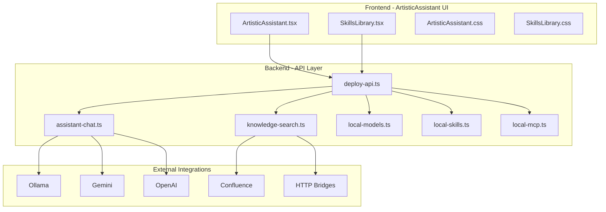

**Diagram sources**
- [deploy-api.ts:910-1163](file://server/deploy-api.ts#L910-L1163)
- [assistant-chat.ts:160-214](file://server/assistant-chat.ts#L160-L214)
- [knowledge-search.ts:260-332](file://server/knowledge-search.ts#L260-L332)
- [local-models.ts:124-177](file://server/local-models.ts#L124-L177)
- [local-skills.ts:205-236](file://server/local-skills.ts#L205-L236)
- [local-mcp.ts:71-105](file://server/local-mcp.ts#L71-L105)

**Section sources**
- [deploy-api.ts:910-1163](file://server/deploy-api.ts#L910-L1163)
- [ArtisticAssistant.tsx:57-349](file://src/pages/ArtisticAssistant.tsx#L57-L349)
- [SkillsLibrary.tsx:202-599](file://src/pages/SkillsLibrary.tsx#L202-L599)

## Core Components
- **Local Model Manager**: scans Ollama and LM Studio models, deduplicates, and exposes model lists with size information
- **Skills Manager**: discovers SKILL.md files across common agent skill directories, parses frontmatter and extracts intros
- **MCP Manager**: reads Cursor MCP configuration files and surfaces server entries with command/url/args preview
- **Assistant Chat**: orchestrates provider selection (Ollama/Gemini/OpenAI), builds system prompts, injects knowledge, and returns responses
- **Knowledge Search**: searches local directories, Confluence, and HTTP bridges for contextual snippets with comprehensive error handling
- **UI Pages**: assistant chat and skills library with filtering, previews, and copy actions with real-time state management
- **Conversational Interface**: sophisticated message handling with knowledge source attribution and interactive previews

**Section sources**
- [local-models.ts:124-177](file://server/local-models.ts#L124-L177)
- [local-skills.ts:205-236](file://server/local-skills.ts#L205-L236)
- [local-mcp.ts:71-105](file://server/local-mcp.ts#L71-L105)
- [assistant-chat.ts:160-214](file://server/assistant-chat.ts#L160-L214)
- [knowledge-search.ts:260-332](file://server/knowledge-search.ts#L260-L332)
- [ArtisticAssistant.tsx:57-349](file://src/pages/ArtisticAssistant.tsx#L57-L349)
- [SkillsLibrary.tsx:202-599](file://src/pages/SkillsLibrary.tsx#L202-L599)

## Architecture Overview
The backend exposes REST endpoints for:
- Scanning local resources (skills, MCP, models)
- Retrieving assistant options (providers and knowledge availability)
- Performing knowledge search
- Running assistant chat with provider-specific logic

The frontend pages consume these endpoints to render the UI and manage user interactions with sophisticated state management and real-time updates.

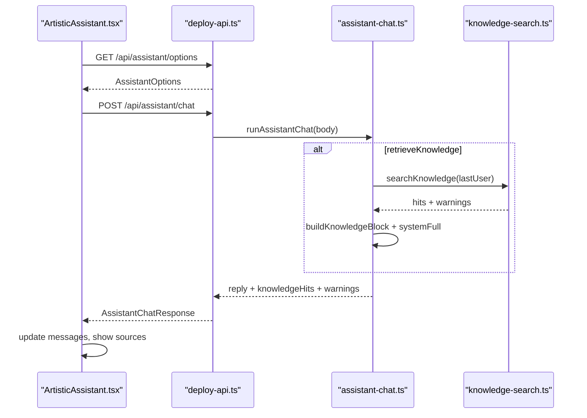

**Diagram sources**
- [deploy-api.ts:959-985](file://server/deploy-api.ts#L959-L985)
- [deploy-api.ts:1109-1163](file://server/deploy-api.ts#L1109-L1163)
- [assistant-chat.ts:160-202](file://server/assistant-chat.ts#L160-L202)
- [knowledge-search.ts:260-332](file://server/knowledge-search.ts#L260-L332)

## Detailed Component Analysis

### Local Model Management
- **Discovery Sources**:
  - Ollama via CLI list and manifest cache
  - LM Studio .gguf files under platform-specific cache directories
- **Deduplication and Normalization**:
  - Uses name or absolute path key to avoid duplicates
  - Sorts results by locale-aware name
  - Computes file sizes for LM Studio models
- **Output**:
  - List of models with source, name, optional size note, and path

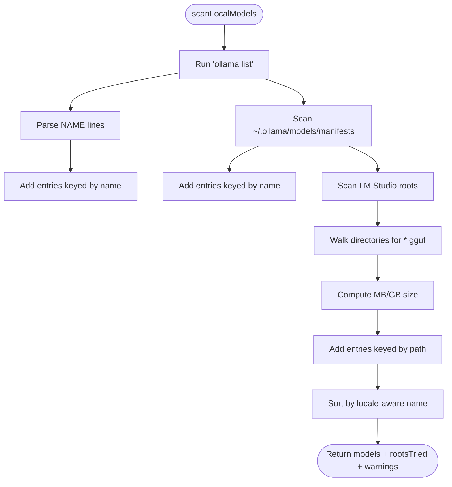

**Diagram sources**
- [local-models.ts:124-177](file://server/local-models.ts#L124-L177)

**Section sources**
- [local-models.ts:6-19](file://server/local-models.ts#L6-L19)
- [local-models.ts:21-37](file://server/local-models.ts#L21-L37)
- [local-models.ts:39-70](file://server/local-models.ts#L39-L70)
- [local-models.ts:72-113](file://server/local-models.ts#L72-L113)
- [local-models.ts:115-122](file://server/local-models.ts#L115-L122)
- [local-models.ts:124-177](file://server/local-models.ts#L124-L177)

### Skills Library and Markdown Specification
- **Discovery**:
  - Scans common agent skill directories (Claude, Cursor, Agents, Codex)
  - Walks up to a fixed depth, skipping common folders
  - Requires a SKILL.md file to be considered a skill
- **Parsing**:
  - Extracts frontmatter name/description
  - Falls back to first paragraph as intro, cleaning markdown noise
- **Output**:
  - Display name, description, and filesystem paths for UI cards

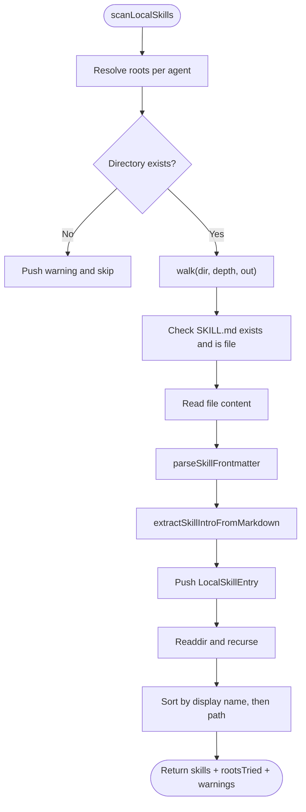

**Diagram sources**
- [local-skills.ts:205-236](file://server/local-skills.ts#L205-L236)

**Section sources**
- [local-skills.ts:5-13](file://server/local-skills.ts#L5-L13)
- [local-skills.ts:39-57](file://server/local-skills.ts#L39-L57)
- [local-skills.ts:75-122](file://server/local-skills.ts#L75-L122)
- [local-skills.ts:124-197](file://server/local-skills.ts#L124-L197)
- [local-skills.ts:205-236](file://server/local-skills.ts#L205-L236)
- [skill.md:1-89](file://skill.md#L1-L89)

### MCP Server Integration
- **Scans Two Locations**:
  - User-level Cursor MCP config
  - Project-level Cursor MCP config (skipped if identical to user-level)
- **Parsing**:
  - Parses JSON for mcpServers object and collects entries with command/url/args preview
- **Output**:
  - Server entries grouped by kind and sorted

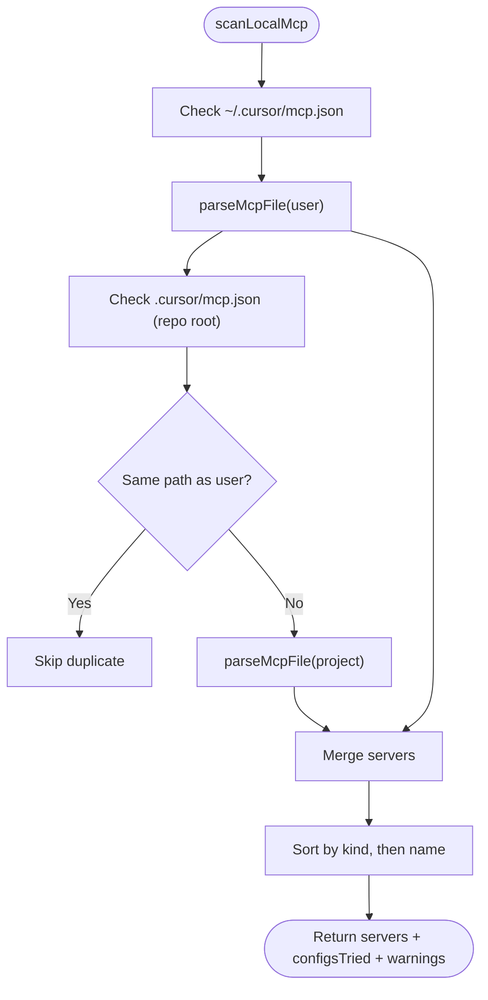

**Diagram sources**
- [local-mcp.ts:71-105](file://server/local-mcp.ts#L71-L105)

**Section sources**
- [local-mcp.ts:6-21](file://server/local-mcp.ts#L6-L21)
- [local-mcp.ts:32-69](file://server/local-mcp.ts#L32-L69)
- [local-mcp.ts:71-105](file://server/local-mcp.ts#L71-L105)

### Conversational Interface and Message Handling
- **Provider Routing**:
  - Ollama: posts to /api/chat with model and messages
  - Gemini: calls Generative Language API with systemInstruction and contents
  - OpenAI: calls chat/completions with Authorization header
- **Context Management**:
  - Builds a knowledge block from search results and injects into system prompt
  - Filters dialog to user/assistant roles
- **Response Generation**:
  - Returns reply, knowledgeHits, and warnings
  - Provides model options list for UI selection

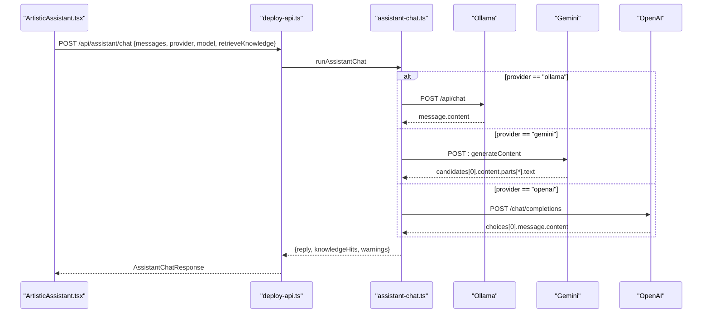

**Diagram sources**
- [deploy-api.ts:1109-1163](file://server/deploy-api.ts#L1109-L1163)
- [assistant-chat.ts:47-72](file://server/assistant-chat.ts#L47-L72)
- [assistant-chat.ts:117-158](file://server/assistant-chat.ts#L117-L158)
- [assistant-chat.ts:74-115](file://server/assistant-chat.ts#L74-L115)

**Section sources**
- [assistant-chat.ts:4-25](file://server/assistant-chat.ts#L4-L25)
- [assistant-chat.ts:27-45](file://server/assistant-chat.ts#L27-L45)
- [assistant-chat.ts:160-202](file://server/assistant-chat.ts#L160-L202)
- [assistant-chat.ts:204-214](file://server/assistant-chat.ts#L204-L214)

### Knowledge Search and Context Injection
- **Local Search**:
  - Walks configured directories up to a depth limit
  - Skips common folders and large files
  - Matches query terms against file content and extracts excerpts
- **Remote Bridges**:
  - Supports multiple HTTP endpoints (template-based)
  - Normalizes results into KnowledgeHit
- **Confluence Integration**:
  - Optional full-text search via CQL when configured
- **Limits and Warnings**:
  - Caps hits and files scanned
  - Emits warnings for misconfiguration and errors

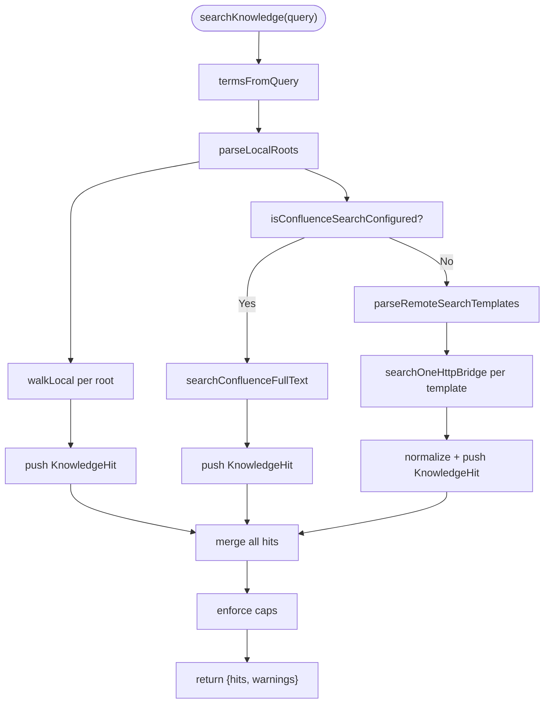

**Diagram sources**
- [knowledge-search.ts:260-332](file://server/knowledge-search.ts#L260-L332)

**Section sources**
- [knowledge-search.ts:29-37](file://server/knowledge-search.ts#L29-L37)
- [knowledge-search.ts:67-135](file://server/knowledge-search.ts#L67-L135)
- [knowledge-search.ts:137-157](file://server/knowledge-search.ts#L137-L157)
- [knowledge-search.ts:190-257](file://server/knowledge-search.ts#L190-L257)
- [knowledge-search.ts:318-332](file://server/knowledge-search.ts#L318-L332)

### AI Assistant UI Component
- **ArtisticAssistant Page**:
  - Loads assistant options and model choices with real-time state management
  - Composes messages, toggles knowledge retrieval, and sends requests
  - Renders message bubbles, shows knowledge sources, and handles errors
  - Provides interactive previews and knowledge source attribution
- **SkillsLibrary Page**:
  - Fetches skills, MCP, and models concurrently
  - Provides filtering by source/kind/source, search, and refresh
  - Copies file paths to clipboard with visual feedback

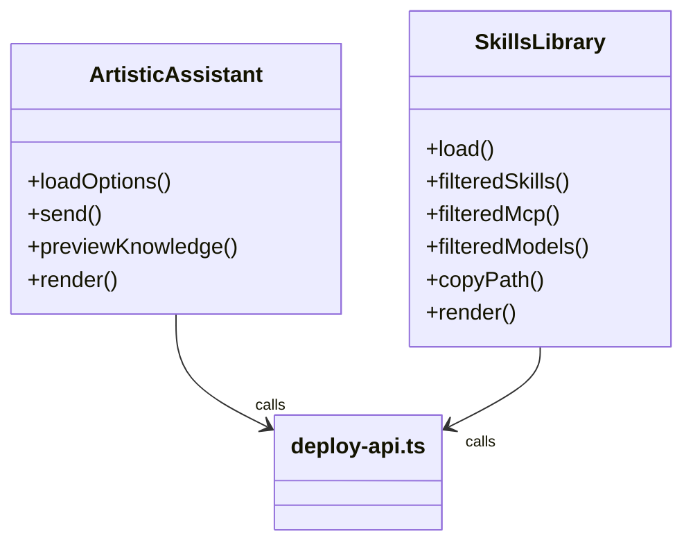

**Diagram sources**
- [ArtisticAssistant.tsx:57-349](file://src/pages/ArtisticAssistant.tsx#L57-L349)
- [SkillsLibrary.tsx:202-599](file://src/pages/SkillsLibrary.tsx#L202-L599)

**Section sources**
- [ArtisticAssistant.tsx:57-349](file://src/pages/ArtisticAssistant.tsx#L57-L349)
- [SkillsLibrary.tsx:202-599](file://src/pages/SkillsLibrary.tsx#L202-L599)
- [ArtisticAssistant.css:1-399](file://src/pages/ArtisticAssistant.css#L1-L399)
- [SkillsLibrary.css:1-593](file://src/pages/SkillsLibrary.css#L1-L593)

### Skill Development Framework
- **Placement**: Place a SKILL.md in one of the recognized directories:
  - Claude: ~/.claude/skills
  - Cursor: ~/.cursor/skills-cursor
  - Agents: ~/.agents/skills
  - Codex: ~/.codex/skills
- **Specification**: Use frontmatter with name and description
  - Use a descriptive body explaining mission, rules, and expected output structure
- **System Integration**: The system scans and surfaces the skill with display name, description, and path

**Section sources**
- [local-skills.ts:211-227](file://server/local-skills.ts#L211-L227)
- [skill.md:1-89](file://skill.md#L1-L89)

## Conversational Interface Architecture

### Data Flow Within ArtisticAssistant UI System
The ArtisticAssistant UI implements a sophisticated conversational interface with comprehensive state management and real-time updates:

- **State Management**: Centralized state for messages, model selection, knowledge retrieval toggle, and loading states
- **Message Composition**: Converts UI messages to API-compatible format with role filtering
- **Knowledge Integration**: Optional knowledge base search with preview functionality
- **Provider Selection**: Dynamic model choice with validation and default fallbacks
- **Response Handling**: Rich response processing with knowledge source attribution

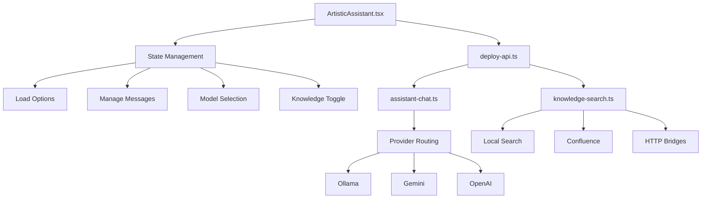

**Diagram sources**
- [ArtisticAssistant.tsx:70-174](file://src/pages/ArtisticAssistant.tsx#L70-L174)
- [assistant-chat.ts:160-202](file://server/assistant-chat.ts#L160-L202)
- [knowledge-search.ts:260-332](file://server/knowledge-search.ts#L260-L332)

### Message Handling and Context Management
- **Message Filtering**: Only user/assistant roles are passed to providers
- **Knowledge Injection**: Knowledge blocks are built and injected into system prompts
- **Context Preservation**: Maintains conversation history while applying knowledge context
- **Error Handling**: Comprehensive error propagation with user-friendly messages

**Section sources**
- [ArtisticAssistant.tsx:115-174](file://src/pages/ArtisticAssistant.tsx#L115-L174)
- [assistant-chat.ts:30-45](file://server/assistant-chat.ts#L30-L45)
- [assistant-chat.ts:160-202](file://server/assistant-chat.ts#L160-L202)

## Knowledge Base Integration

### Multi-Source Knowledge Retrieval
The system provides comprehensive knowledge base integration supporting multiple data sources:

- **Local File System**: Configurable directory scanning with intelligent filtering
- **Confluence Integration**: Full-text search via CQL when properly configured
- **HTTP Bridge Endpoints**: Flexible template-based HTTP search endpoints
- **Cross-Platform Support**: Unified KnowledgeHit interface across all sources

### Knowledge Hit Normalization
All knowledge sources are normalized into a unified format:

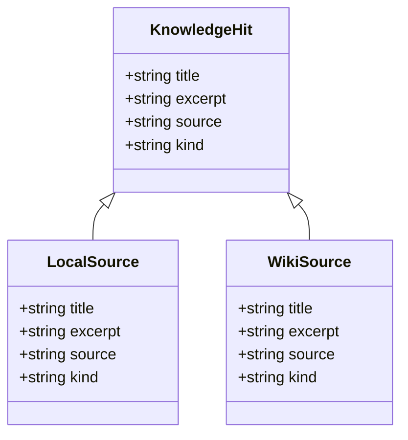

**Diagram sources**
- [knowledge-search.ts:17-27](file://server/knowledge-search.ts#L17-L27)

### Configuration and Templates
- **ASSISTANT_KB_LOCAL_DIRS**: Colon/semicolon/newline separated directory list
- **ASSISTANT_KB_SEARCH_URLS**: Multiple HTTP templates separated by semicolons
- **ASSISTANT_WIKI_SEARCH_URL_TEMPLATE**: Legacy single endpoint template
- **CONFLUENCE_BASE_URL & CONFLUENCE_API_TOKEN**: Confluence authentication

**Section sources**
- [knowledge-search.ts:29-37](file://server/knowledge-search.ts#L29-L37)
- [knowledge-search.ts:137-157](file://server/knowledge-search.ts#L137-L157)
- [knowledge-search.ts:155-157](file://server/knowledge-search.ts#L155-L157)

## Skill System Design Patterns

### Discovery Mechanisms
The skill system implements a robust discovery pattern:

- **Multi-Platform Support**: Recognizes skills from Claude, Cursor, Agents, and Codex ecosystems
- **Hierarchical Organization**: Skills organized in flat directory structure with SKILL.md files
- **Recursive Scanning**: Deep directory traversal with configurable depth limits
- **Intelligent Filtering**: Automatic exclusion of common development directories

### Registration and Invocation Workflows
Skills are processed through a standardized pipeline:

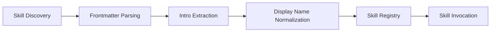

**Diagram sources**
- [local-skills.ts:124-197](file://server/local-skills.ts#L124-L197)
- [local-skills.ts:205-236](file://server/local-skills.ts#L205-L236)

### Markdown Specification Standards
Skills follow a standardized markdown format:

- **Frontmatter**: YAML with name and description fields
- **Body Content**: Structured guidance with clear sections
- **Examples**: Concrete implementation examples and constraints
- **Quality Gates**: Accessibility and consistency requirements

**Section sources**
- [local-skills.ts:39-57](file://server/local-skills.ts#L39-L57)
- [local-skills.ts:75-122](file://server/local-skills.ts#L75-L122)
- [skill.md:1-89](file://skill.md#L1-L89)

## Dependency Analysis
- **Backend Dependencies**:
  - assistant-chat depends on knowledge-search for context retrieval
  - knowledge-search depends on confluence-search for remote integration
  - local-* modules provide resource discovery for UI consumption
- **Frontend Dependencies**:
  - ArtisticAssistant consumes deploy-api endpoints for chat functionality
  - SkillsLibrary consumes deploy-api endpoints for resource discovery
- **External Integrations**:
  - Ollama HTTP API for local model inference
  - Gemini Generative Language API for cloud inference
  - OpenAI chat/completions for cloud inference
  - Confluence REST API for enterprise knowledge
  - HTTP bridges for custom knowledge sources

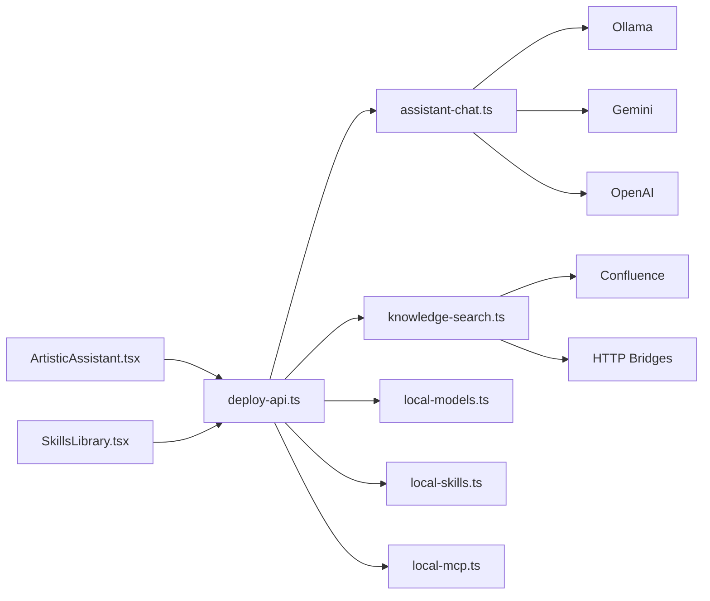

**Diagram sources**
- [deploy-api.ts:910-1163](file://server/deploy-api.ts#L910-L1163)
- [assistant-chat.ts:47-158](file://server/assistant-chat.ts#L47-L158)
- [knowledge-search.ts:137-157](file://server/knowledge-search.ts#L137-L157)

**Section sources**
- [deploy-api.ts:910-1163](file://server/deploy-api.ts#L910-L1163)
- [assistant-chat.ts:47-158](file://server/assistant-chat.ts#L47-L158)
- [knowledge-search.ts:137-157](file://server/knowledge-search.ts#L137-L157)

## Performance Considerations
- **Resource Scanning Limits**:
  - Depth caps during local directory walks and file size checks
  - Maximum files and hits caps to bound memory and network usage
- **Request Timeouts**:
  - HTTP calls to providers and bridges use timeouts to prevent hanging
  - Provider-specific timeouts for different service tiers
- **UI Responsiveness**:
  - Concurrent fetching of skills, MCP, and models
  - Debounced rendering and animations for smooth UX
- **Environment Configuration**:
  - Provider keys and model names loaded from environment variables
  - Caching of assistant options to minimize API calls
- **Memory Management**:
  - Knowledge hit limits to prevent memory exhaustion
  - Efficient string processing for large documents

## Troubleshooting Guide

### Assistant Chat Failures
- **Missing Provider Keys**: Leads to 503 responses with clear error messages
- **Large/Malformed Messages**: Results in 400 responses with validation errors
- **Provider-Specific Errors**: Bubbling up with detailed warnings and suggestions
- **Network Issues**: Timeouts and connection failures with retry logic

### Knowledge Search Warnings
- **Unconfigured Directories**: Directory existence warnings and suggestions
- **Invalid HTTP Templates**: Template parsing errors with validation hints
- **Confluence Misconfiguration**: Authentication and connectivity issues
- **Rate Limiting**: Service-specific rate limiting with retry guidance

### Local Resource Discovery
- **Nonexistent Directories**: Warning messages with path suggestions
- **Permission Issues**: File system access problems with resolution steps
- **Duplicate MCP Configurations**: Warning about duplicate project/user configs
- **Model Parsing Errors**: Invalid model formats with recovery suggestions

### UI Issues
- **Endpoint Failures**: Clear error messages with deployment status checks
- **State Synchronization**: Real-time state updates with loading indicators
- **Performance Degradation**: Memory usage monitoring and optimization suggestions

**Section sources**
- [deploy-api.ts:1132-1163](file://server/deploy-api.ts#L1132-L1163)
- [knowledge-search.ts:274-278](file://server/knowledge-search.ts#L274-L278)
- [local-mcp.ts:90-96](file://server/local-mcp.ts#L90-L96)
- [SkillsLibrary.tsx:439-448](file://src/pages/SkillsLibrary.tsx#L439-L448)

## Conclusion
The AI assistant system integrates local model discovery, skills parsing, MCP configuration, and knowledge search into a comprehensive conversational interface. The system has been enhanced with detailed architectural documentation covering:

- **Conversational Interface Architecture**: Sophisticated UI data flow with real-time state management
- **Knowledge Base Integration**: Multi-source knowledge retrieval with unified interface
- **Skill System Design Patterns**: Comprehensive skill discovery and invocation workflows

The backend provides robust endpoints with safety limits and clear error reporting, while the frontend offers intuitive UIs for chatting and managing local resources. By following the skill specification and environment configuration, teams can extend capabilities and automate workflows effectively.

## Appendices

### Environment Variables and Configuration
- **Assistant Options**:
  - GEMINI_API_KEY, GEMINI_MODEL
  - OPENAI_API_KEY, OPENAI_MODEL, OPENAI_BASE_URL
  - OLLAMA_HOST
- **Knowledge Search Configuration**:
  - ASSISTANT_KB_LOCAL_DIRS (colon/semicolon/newline separated)
  - ASSISTANT_KB_SEARCH_URLS (multiple HTTP templates)
  - ASSISTANT_WIKI_SEARCH_URL_TEMPLATE (legacy)
  - CONFLUENCE_BASE_URL, CONFLUENCE_API_TOKEN
- **Other Configuration**:
  - DEPLOY_API_PORT, SERVE_SPA_ROOT
  - AUTOMATION_* flags and schedules

**Section sources**
- [deploy-api.ts:959-985](file://server/deploy-api.ts#L959-L985)
- [knowledge-search.ts:29-37](file://server/knowledge-search.ts#L29-L37)
- [knowledge-search.ts:137-157](file://server/knowledge-search.ts#L137-L157)

### Example Skill Implementation
- **Directory Placement**: SKILL.md in ~/.cursor/skills-cursor/<your-skill>/
- **Frontmatter Specification**: name and description fields
- **Content Structure**: Mission, rules, and expected output structure
- **System Integration**: Automatic discovery and UI presentation

**Section sources**
- [local-skills.ts:211-227](file://server/local-skills.ts#L211-L227)
- [skill.md:1-89](file://skill.md#L1-L89)

### Package Scripts and Development Workflow
- **Development Commands**: Combined backend/frontend startup
- **Desktop Packaging**: Electron application bundling
- **PWA Assets**: Service worker and progressive web app support
- **Build Scripts**: Optimized production builds with caching

**Section sources**
- [package.json:9-30](file://package.json#L9-L30)
- [package.json:61-97](file://package.json#L61-L97)