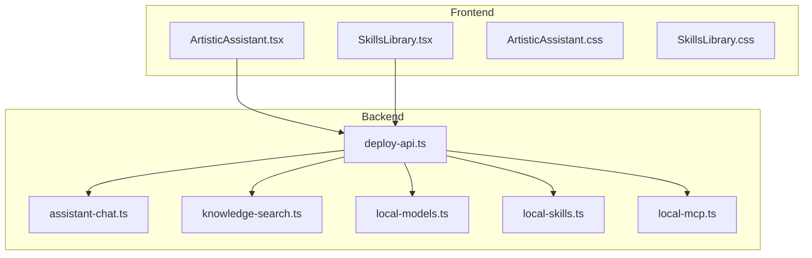
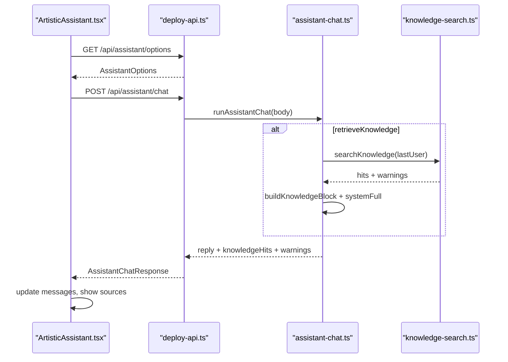
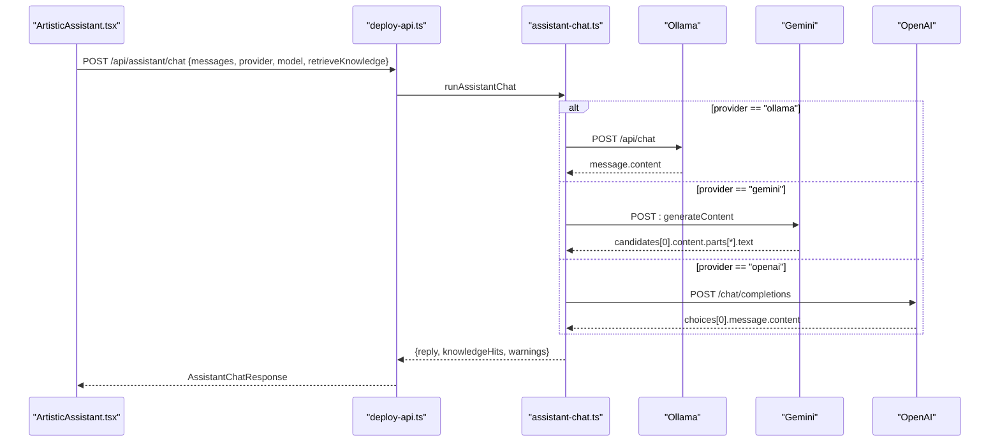
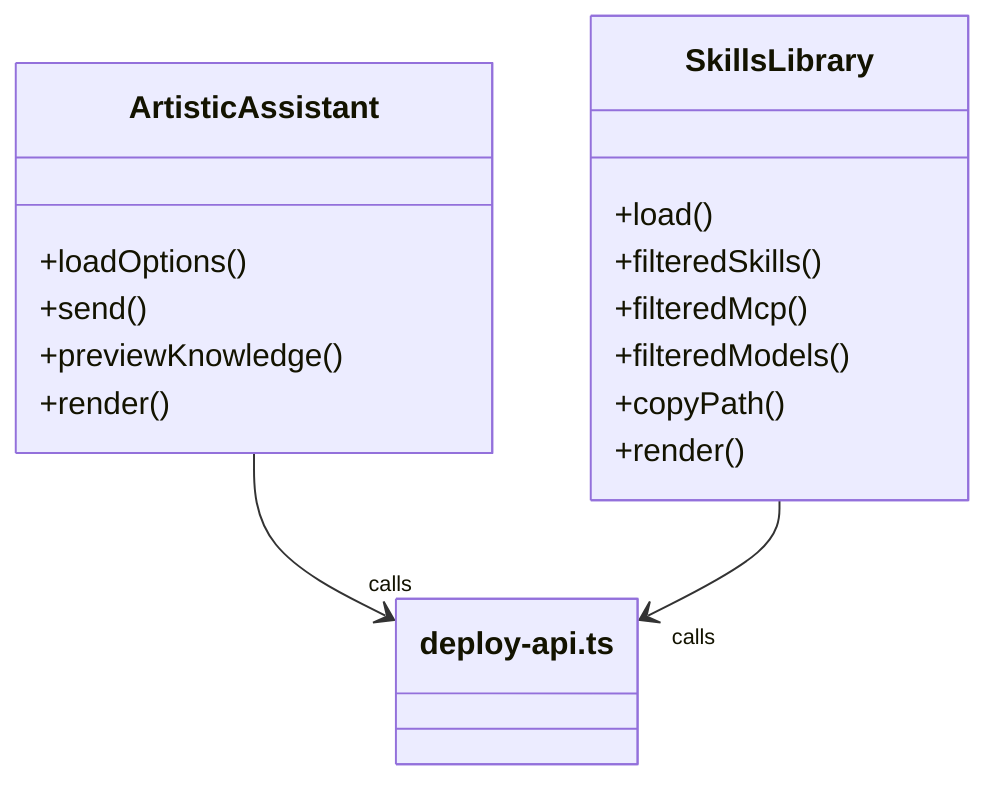
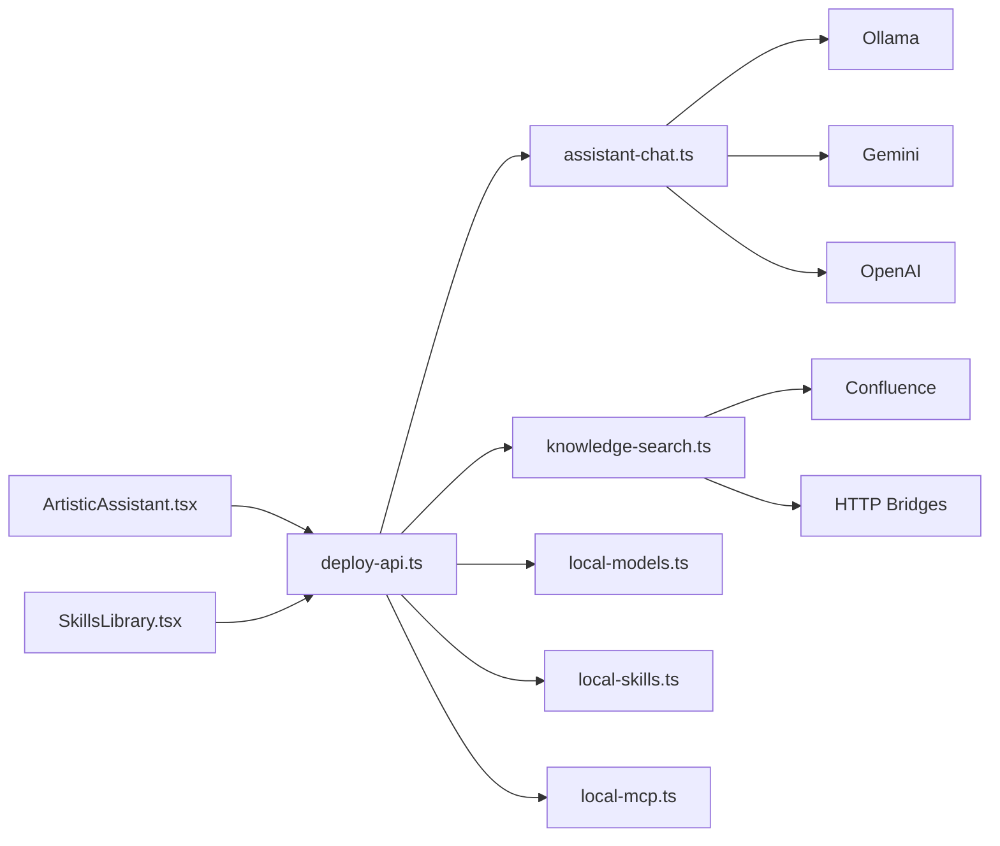

# AI Assistant System

<cite>
**Referenced Files in This Document**
- [local-models.ts](file://server/local-models.ts)
- [local-skills.ts](file://server/local-skills.ts)
- [local-mcp.ts](file://server/local-mcp.ts)
- [assistant-chat.ts](file://server/assistant-chat.ts)
- [knowledge-search.ts](file://server/knowledge-search.ts)
- [deploy-api.ts](file://server/deploy-api.ts)
- [ArtisticAssistant.tsx](file://src/pages/ArtisticAssistant.tsx)
- [SkillsLibrary.tsx](file://src/pages/SkillsLibrary.tsx)
- [ArtisticAssistant.css](file://src/pages/ArtisticAssistant.css)
- [SkillsLibrary.css](file://src/pages/SkillsLibrary.css)
- [skill.md](file://skill.md)
- [package.json](file://package.json)
</cite>

## Table of Contents
1. [Introduction](#introduction)
2. [Project Structure](#project-structure)
3. [Core Components](#core-components)
4. [Architecture Overview](#architecture-overview)
5. [Detailed Component Analysis](#detailed-component-analysis)
6. [Dependency Analysis](#dependency-analysis)
7. [Performance Considerations](#performance-considerations)
8. [Troubleshooting Guide](#troubleshooting-guide)
9. [Conclusion](#conclusion)
10. [Appendices](#appendices)

## Introduction
This document explains the AI assistant system that powers conversational AI, integrates local AI models, external MCP (Model Context Protocol) servers, and a skills library. It covers:
- Local model discovery and lifecycle management
- Skills scanning and markdown-based capability definition
- MCP server configuration and discovery
- Conversational interface with message handling, context injection, and response generation
- AI assistant UI including chat interface, message history, and user interaction patterns
- Skill development framework with markdown specifications
- Performance optimization, memory management, and resource allocation
- Integration with other system components for workflow automation

## Project Structure
The system is split into:
- Frontend React pages for UI and interactions
- Backend Express server exposing APIs for assistant chat, knowledge search, and resource discovery
- Utility modules for local model scanning, skills parsing, MCP configuration discovery, and knowledge retrieval

**Diagram sources**
- [deploy-api.ts:910-1163](file://server/deploy-api.ts#L910-L1163)
- [assistant-chat.ts:160-214](file://server/assistant-chat.ts#L160-L214)
- [knowledge-search.ts:260-332](file://server/knowledge-search.ts#L260-L332)
- [local-models.ts:124-177](file://server/local-models.ts#L124-L177)
- [local-skills.ts:205-236](file://server/local-skills.ts#L205-L236)
- [local-mcp.ts:71-105](file://server/local-mcp.ts#L71-L105)

**Section sources**
- [deploy-api.ts:910-1163](file://server/deploy-api.ts#L910-L1163)
- [ArtisticAssistant.tsx:57-349](file://src/pages/ArtisticAssistant.tsx#L57-L349)
- [SkillsLibrary.tsx:202-599](file://src/pages/SkillsLibrary.tsx#L202-L599)

## Core Components
- Local model manager: scans Ollama and LM Studio models, deduplicates, and exposes model lists
- Skills manager: discovers SKILL.md files across common agent skill directories, parses frontmatter and extracts intros
- MCP manager: reads Cursor MCP configuration files and surfaces server entries
- Assistant chat: orchestrates provider selection (Ollama/Gemini/OpenAI), builds system prompts, injects knowledge, and returns responses
- Knowledge search: searches local directories, Confluence, and HTTP bridges for contextual snippets
- UI pages: assistant chat and skills library with filtering, previews, and copy actions

**Section sources**
- [local-models.ts:124-177](file://server/local-models.ts#L124-L177)
- [local-skills.ts:205-236](file://server/local-skills.ts#L205-L236)
- [local-mcp.ts:71-105](file://server/local-mcp.ts#L71-L105)
- [assistant-chat.ts:160-214](file://server/assistant-chat.ts#L160-L214)
- [knowledge-search.ts:260-332](file://server/knowledge-search.ts#L260-L332)
- [ArtisticAssistant.tsx:57-349](file://src/pages/ArtisticAssistant.tsx#L57-L349)
- [SkillsLibrary.tsx:202-599](file://src/pages/SkillsLibrary.tsx#L202-L599)

## Architecture Overview
The backend exposes REST endpoints for:
- Scanning local resources (skills, MCP, models)
- Retrieving assistant options (providers and knowledge availability)
- Performing knowledge search
- Running assistant chat with provider-specific logic

The frontend pages consume these endpoints to render the UI and manage user interactions.

**Diagram sources**
- [deploy-api.ts:959-985](file://server/deploy-api.ts#L959-L985)
- [deploy-api.ts:1109-1163](file://server/deploy-api.ts#L1109-L1163)
- [assistant-chat.ts:160-202](file://server/assistant-chat.ts#L160-L202)
- [knowledge-search.ts:260-332](file://server/knowledge-search.ts#L260-L332)

## Detailed Component Analysis

### Local Model Management
- Discovery sources:
  - Ollama via CLI list and manifest cache
  - LM Studio .gguf files under platform-specific cache directories
- Deduplication and normalization:
  - Uses name or absolute path key to avoid duplicates
  - Sorts results by locale-aware name
- Output:
  - List of models with source, name, optional size note, and path

**Diagram sources**
- [local-models.ts:124-177](file://server/local-models.ts#L124-L177)

**Section sources**
- [local-models.ts:6-19](file://server/local-models.ts#L6-L19)
- [local-models.ts:21-37](file://server/local-models.ts#L21-L37)
- [local-models.ts:39-70](file://server/local-models.ts#L39-L70)
- [local-models.ts:72-113](file://server/local-models.ts#L72-L113)
- [local-models.ts:115-122](file://server/local-models.ts#L115-L122)
- [local-models.ts:124-177](file://server/local-models.ts#L124-L177)

### Skills Library and Markdown Specification
- Discovery:
  - Scans common agent skill directories (Claude, Cursor, Agents, Codex)
  - Walks up to a fixed depth, skipping common folders
  - Requires a SKILL.md file to be considered a skill
- Parsing:
  - Extracts frontmatter name/description
  - Falls back to first paragraph as intro, cleaning markdown noise
- Output:
  - Display name, description, and filesystem paths for UI cards

**Diagram sources**
- [local-skills.ts:205-236](file://server/local-skills.ts#L205-L236)

**Section sources**
- [local-skills.ts:5-13](file://server/local-skills.ts#L5-L13)
- [local-skills.ts:39-57](file://server/local-skills.ts#L39-L57)
- [local-skills.ts:75-122](file://server/local-skills.ts#L75-L122)
- [local-skills.ts:124-197](file://server/local-skills.ts#L124-L197)
- [local-skills.ts:205-236](file://server/local-skills.ts#L205-L236)
- [skill.md:1-89](file://skill.md#L1-L89)

### MCP Server Integration
- Scans two locations:
  - User-level Cursor MCP config
  - Project-level Cursor MCP config (skipped if identical to user-level)
- Parses JSON for mcpServers object and collects entries with command/url/args preview
- Outputs server entries grouped by kind and sorted

**Diagram sources**
- [local-mcp.ts:71-105](file://server/local-mcp.ts#L71-L105)

**Section sources**
- [local-mcp.ts:6-21](file://server/local-mcp.ts#L6-L21)
- [local-mcp.ts:32-69](file://server/local-mcp.ts#L32-L69)
- [local-mcp.ts:71-105](file://server/local-mcp.ts#L71-L105)

### Conversational Interface and Message Handling
- Provider routing:
  - Ollama: posts to /api/chat with model and messages
  - Gemini: calls Generative Language API with systemInstruction and contents
  - OpenAI: calls chat/completions with Authorization header
- Context management:
  - Builds a knowledge block from search results and injects into system prompt
  - Filters dialog to user/assistant roles
- Response generation:
  - Returns reply, knowledgeHits, and warnings
  - Provides model options list for UI selection

**Diagram sources**
- [deploy-api.ts:1109-1163](file://server/deploy-api.ts#L1109-L1163)
- [assistant-chat.ts:47-72](file://server/assistant-chat.ts#L47-L72)
- [assistant-chat.ts:117-158](file://server/assistant-chat.ts#L117-L158)
- [assistant-chat.ts:74-115](file://server/assistant-chat.ts#L74-L115)

**Section sources**
- [assistant-chat.ts:4-25](file://server/assistant-chat.ts#L4-L25)
- [assistant-chat.ts:27-45](file://server/assistant-chat.ts#L27-L45)
- [assistant-chat.ts:160-202](file://server/assistant-chat.ts#L160-L202)
- [assistant-chat.ts:204-214](file://server/assistant-chat.ts#L204-L214)

### Knowledge Search and Context Injection
- Local search:
  - Walks configured directories up to a depth limit
  - Skips common folders and large files
  - Matches query terms against file content and extracts excerpts
- Remote bridges:
  - Supports multiple HTTP endpoints (template-based)
  - Normalizes results into KnowledgeHit
- Confluence:
  - Optional full-text search via CQL when configured
- Limits and warnings:
  - Caps hits and files scanned
  - Emits warnings for misconfiguration and errors

**Diagram sources**
- [knowledge-search.ts:260-332](file://server/knowledge-search.ts#L260-L332)

**Section sources**
- [knowledge-search.ts:29-37](file://server/knowledge-search.ts#L29-L37)
- [knowledge-search.ts:67-135](file://server/knowledge-search.ts#L67-L135)
- [knowledge-search.ts:137-157](file://server/knowledge-search.ts#L137-L157)
- [knowledge-search.ts:190-257](file://server/knowledge-search.ts#L190-L257)
- [knowledge-search.ts:318-332](file://server/knowledge-search.ts#L318-L332)

### AI Assistant UI Component
- ArtisticAssistant page:
  - Loads assistant options and model choices
  - Composes messages, toggles knowledge retrieval, and sends requests
  - Renders message bubbles, shows knowledge sources, and handles errors
- SkillsLibrary page:
  - Fetches skills, MCP, and models concurrently
  - Provides filtering by source/kind/source, search, and refresh
  - Copies file paths to clipboard

**Diagram sources**
- [ArtisticAssistant.tsx:57-349](file://src/pages/ArtisticAssistant.tsx#L57-L349)
- [SkillsLibrary.tsx:202-599](file://src/pages/SkillsLibrary.tsx#L202-L599)

**Section sources**
- [ArtisticAssistant.tsx:57-349](file://src/pages/ArtisticAssistant.tsx#L57-L349)
- [SkillsLibrary.tsx:202-599](file://src/pages/SkillsLibrary.tsx#L202-L599)
- [ArtisticAssistant.css:1-399](file://src/pages/ArtisticAssistant.css#L1-L399)
- [SkillsLibrary.css:1-593](file://src/pages/SkillsLibrary.css#L1-L593)

### Skill Development Framework
- Place a SKILL.md in one of the recognized directories:
  - Claude: ~/.claude/skills
  - Cursor: ~/.cursor/skills-cursor
  - Agents: ~/.agents/skills
  - Codex: ~/.codex/skills
- Markdown specification:
  - Use frontmatter with name and description
  - Use a descriptive body explaining mission, rules, and expected output structure
- The system scans and surfaces the skill with display name, description, and path

**Section sources**
- [local-skills.ts:211-227](file://server/local-skills.ts#L211-L227)
- [skill.md:1-89](file://skill.md#L1-L89)

## Dependency Analysis
- Backend endpoints depend on:
  - assistant-chat for provider orchestration
  - knowledge-search for context retrieval
  - local-* modules for resource discovery
- Frontend pages depend on:
  - deploy-api endpoints for data and actions
- External integrations:
  - Ollama HTTP API
  - Gemini Generative Language API
  - OpenAI chat/completions
  - Confluence REST API (optional)
  - HTTP bridges for wiki search

**Diagram sources**
- [deploy-api.ts:910-1163](file://server/deploy-api.ts#L910-L1163)
- [assistant-chat.ts:47-158](file://server/assistant-chat.ts#L47-L158)
- [knowledge-search.ts:137-157](file://server/knowledge-search.ts#L137-L157)

**Section sources**
- [deploy-api.ts:910-1163](file://server/deploy-api.ts#L910-L1163)
- [assistant-chat.ts:47-158](file://server/assistant-chat.ts#L47-L158)
- [knowledge-search.ts:137-157](file://server/knowledge-search.ts#L137-L157)

## Performance Considerations
- Resource scanning limits:
  - Depth caps during local directory walks and file size checks
  - Maximum files and hits caps to bound memory and network usage
- Request timeouts:
  - HTTP calls to providers and bridges use timeouts to prevent hanging
- UI responsiveness:
  - Concurrent fetching of skills, MCP, and models
  - Debounced rendering and animations for smooth UX
- Environment-driven configuration:
  - Provider keys and model names are loaded from environment variables to avoid repeated IO

[No sources needed since this section provides general guidance]

## Troubleshooting Guide
- Assistant chat failures:
  - Missing provider keys lead to 503 responses
  - Large or malformed messages cause 400 responses
  - Provider-specific errors bubble up with warnings
- Knowledge search warnings:
  - Unconfigured directories or invalid HTTP templates produce warnings
  - Confluence misconfiguration emits hints
- Local resource discovery:
  - Nonexistent directories or unreadable files yield warnings
  - Duplicate MCP project/user configs are ignored with a warning
- UI issues:
  - If endpoints fail, the UI shows an error and suggests checking deploy-api status

**Section sources**
- [deploy-api.ts:1132-1163](file://server/deploy-api.ts#L1132-L1163)
- [knowledge-search.ts:274-278](file://server/knowledge-search.ts#L274-L278)
- [local-mcp.ts:90-96](file://server/local-mcp.ts#L90-L96)
- [SkillsLibrary.tsx:439-448](file://src/pages/SkillsLibrary.tsx#L439-L448)

## Conclusion
The AI assistant system integrates local model discovery, skills parsing, MCP configuration, and knowledge search into a cohesive conversational interface. The backend provides robust endpoints with safety limits and clear error reporting, while the frontend offers intuitive UIs for chatting and managing local resources. By following the skill specification and environment configuration, teams can extend capabilities and automate workflows effectively.

[No sources needed since this section summarizes without analyzing specific files]

## Appendices

### Environment Variables and Configuration
- Assistant options:
  - GEMINI_API_KEY, GEMINI_MODEL
  - OPENAI_API_KEY, OPENAI_MODEL, OPENAI_BASE_URL
  - OLLAMA_HOST
- Knowledge search:
  - ASSISTANT_KB_LOCAL_DIRS (colon/semicolon/newline separated)
  - ASSISTANT_KB_SEARCH_URLS (multiple HTTP templates)
  - ASSISTANT_WIKI_SEARCH_URL_TEMPLATE (legacy)
  - CONFLUENCE_BASE_URL, CONFLUENCE_API_TOKEN
- Other:
  - DEPLOY_API_PORT, SERVE_SPA_ROOT
  - AUTOMATION_* flags and schedules

**Section sources**
- [deploy-api.ts:959-985](file://server/deploy-api.ts#L959-L985)
- [knowledge-search.ts:29-37](file://server/knowledge-search.ts#L29-L37)
- [knowledge-search.ts:137-157](file://server/knowledge-search.ts#L137-L157)

### Example Skill Implementation
- Place a SKILL.md in ~/.cursor/skills-cursor/<your-skill>/
- Use frontmatter name/description and a structured body
- The system will surface it in the SkillsLibrary with display name and description

**Section sources**
- [local-skills.ts:211-227](file://server/local-skills.ts#L211-L227)
- [skill.md:1-89](file://skill.md#L1-L89)

### Package Scripts and Dev Workflow
- Scripts to run backend and frontend together
- Desktop packaging and PWA assets

**Section sources**
- [package.json:9-30](file://package.json#L9-L30)
- [package.json:61-97](file://package.json#L61-L97)