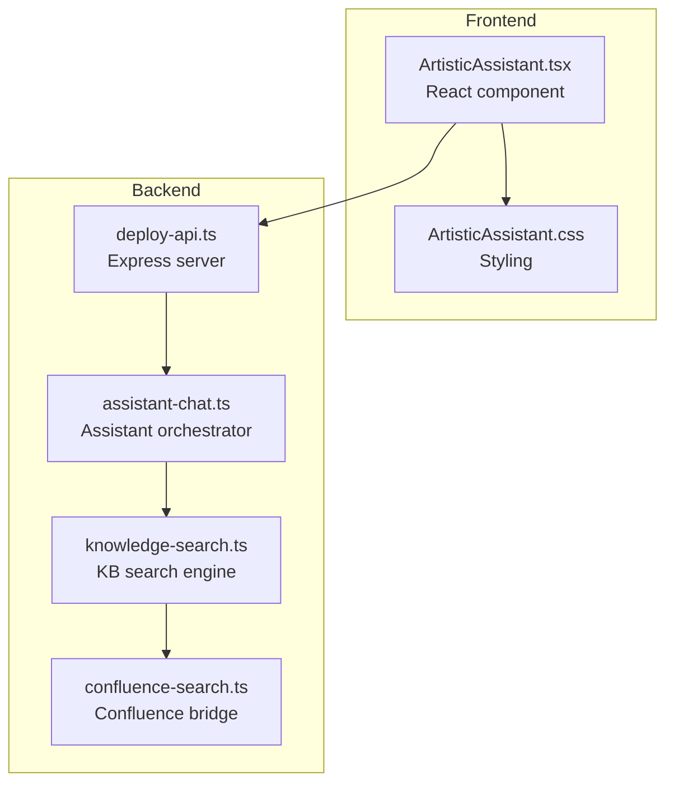
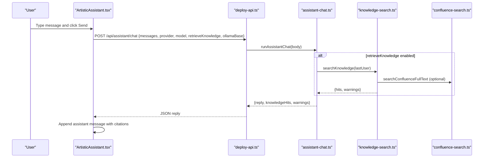
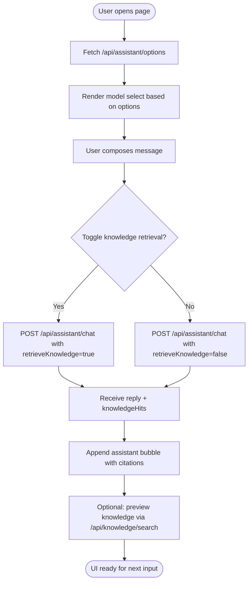
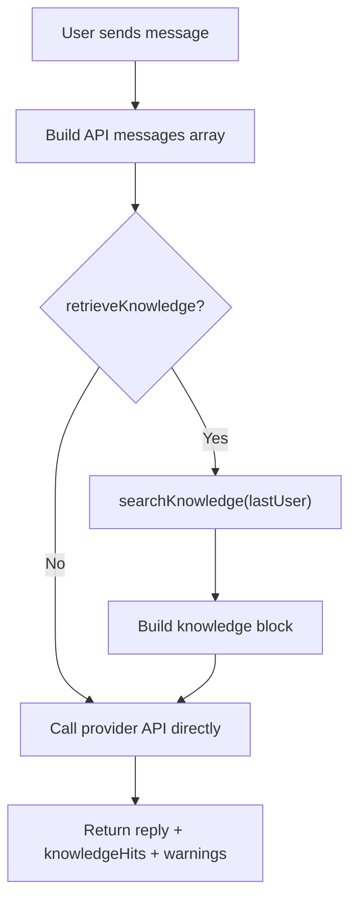
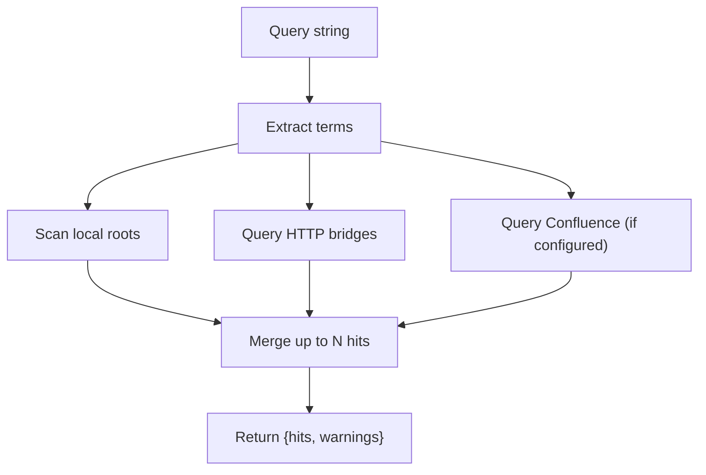
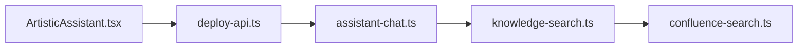

# Conversational Interface

<cite>
**Referenced Files in This Document**
- [ArtisticAssistant.tsx](file://src/pages/ArtisticAssistant.tsx)
- [ArtisticAssistant.css](file://src/pages/ArtisticAssistant.css)
- [assistant-chat.ts](file://server/assistant-chat.ts)
- [knowledge-search.ts](file://server/knowledge-search.ts)
- [confluence-search.ts](file://server/confluence-search.ts)
- [deploy-api.ts](file://server/deploy-api.ts)
- [assistant-workspace-config.ts](file://server/assistant-workspace-config.ts)
- [package.json](file://package.json)
</cite>

## Table of Contents
1. [Introduction](#introduction)
2. [Project Structure](#project-structure)
3. [Core Components](#core-components)
4. [Architecture Overview](#architecture-overview)
5. [Detailed Component Analysis](#detailed-component-analysis)
6. [Dependency Analysis](#dependency-analysis)
7. [Performance Considerations](#performance-considerations)
8. [Troubleshooting Guide](#troubleshooting-guide)
9. [Conclusion](#conclusion)
10. [Appendices](#appendices)

## Introduction
This document explains the conversational interface implementation centered on the Artistic Assistant page. It covers the chat UI component architecture, message handling, user interaction patterns, and the message lifecycle from user input to response display. It documents knowledge base integration (local directories, Confluence, and HTTP bridges), the assistant options configuration and model selection interface, knowledge retrieval controls, UI state management, loading and error handling, accessibility and responsive design, and backend API integration with timeouts and streaming considerations.

## Project Structure
The conversational UI is implemented as a React page component with a dedicated CSS stylesheet. The backend is an Express server that exposes REST endpoints for assistant options, chat, and knowledge search. Knowledge retrieval spans local filesystem scanning, Confluence full-text search, and configurable HTTP bridges.

**Diagram sources**
- [ArtisticAssistant.tsx:57-349](file://src/pages/ArtisticAssistant.tsx#L57-L349)
- [ArtisticAssistant.css:1-399](file://src/pages/ArtisticAssistant.css#L1-L399)
- [deploy-api.ts:958-1163](file://server/deploy-api.ts#L958-L1163)
- [assistant-chat.ts:160-214](file://server/assistant-chat.ts#L160-L214)
- [knowledge-search.ts:260-333](file://server/knowledge-search.ts#L260-L333)
- [confluence-search.ts:135-200](file://server/confluence-search.ts#L135-L200)

**Section sources**
- [ArtisticAssistant.tsx:57-349](file://src/pages/ArtisticAssistant.tsx#L57-L349)
- [ArtisticAssistant.css:1-399](file://src/pages/ArtisticAssistant.css#L1-L399)
- [deploy-api.ts:958-1163](file://server/deploy-api.ts#L958-L1163)

## Core Components
- ArtisticAssistant page component manages UI state, renders messages, handles user input, and integrates with backend APIs.
- Assistant options endpoint provides model availability and knowledge base configuration hints.
- Assistant chat endpoint orchestrates provider-specific LLM calls and optional knowledge retrieval.
- Knowledge search endpoint supports preview mode and injects contextual fragments into assistant replies.
- Confluence search module implements CQL-based full-text search for Atlassian Confluence.

**Section sources**
- [ArtisticAssistant.tsx:57-349](file://src/pages/ArtisticAssistant.tsx#L57-L349)
- [deploy-api.ts:958-1163](file://server/deploy-api.ts#L958-L1163)
- [assistant-chat.ts:160-214](file://server/assistant-chat.ts#L160-L214)
- [knowledge-search.ts:260-333](file://server/knowledge-search.ts#L260-L333)
- [confluence-search.ts:135-200](file://server/confluence-search.ts#L135-L200)

## Architecture Overview
The conversational flow connects the UI to backend endpoints, optionally retrieving knowledge, and invoking provider-specific LLM APIs.

**Diagram sources**
- [ArtisticAssistant.tsx:115-174](file://src/pages/ArtisticAssistant.tsx#L115-L174)
- [deploy-api.ts:1142-1163](file://server/deploy-api.ts#L1142-L1163)
- [assistant-chat.ts:160-214](file://server/assistant-chat.ts#L160-L214)
- [knowledge-search.ts:260-333](file://server/knowledge-search.ts#L260-L333)
- [confluence-search.ts:135-200](file://server/confluence-search.ts#L135-L200)

## Detailed Component Analysis

### Chat UI Component: ArtisticAssistant
Responsibilities:
- Load assistant options and model availability.
- Manage UI state: messages, draft, model choice, knowledge retrieval toggle, preview hits, loading, and errors.
- Render message bubbles, citations, and knowledge preview.
- Integrate with backend via fetch requests.

Key behaviors:
- Options loading and model selection parsing.
- Knowledge base hint generation from configuration.
- Sending messages: builds API payload, posts to assistant chat endpoint, and appends response with optional citations.
- Preview knowledge: posts to knowledge search endpoint and displays top hits.
- Accessibility: roles, live regions, focus-visible styles, reduced-motion support.

**Diagram sources**
- [ArtisticAssistant.tsx:57-349](file://src/pages/ArtisticAssistant.tsx#L57-L349)
- [deploy-api.ts:958-1163](file://server/deploy-api.ts#L958-L1163)
- [deploy-api.ts:1092-1106](file://server/deploy-api.ts#L1092-L1106)

**Section sources**
- [ArtisticAssistant.tsx:57-349](file://src/pages/ArtisticAssistant.tsx#L57-L349)
- [ArtisticAssistant.css:186-399](file://src/pages/ArtisticAssistant.css#L186-L399)

### Assistant Options and Model Selection
- Endpoint returns configuration flags for Gemini, OpenAI, and Ollama, plus knowledge base availability and counts.
- Frontend parses model choice from select value and selects default model accordingly.
- Select options reflect runtime availability and model names.

**Section sources**
- [deploy-api.ts:958-985](file://server/deploy-api.ts#L958-L985)
- [ArtisticAssistant.tsx:39-55](file://src/pages/ArtisticAssistant.tsx#L39-L55)
- [ArtisticAssistant.tsx:286-313](file://src/pages/ArtisticAssistant.tsx#L286-L313)

### Message Lifecycle and Knowledge Retrieval
- Knowledge retrieval is optional and triggered by a checkbox.
- When enabled, the last user message is used to search local files, Confluence, and HTTP bridges.
- Retrieved hits are injected into the system prompt via a knowledge block.
- Provider dispatch: Ollama, OpenAI, or Gemini; each has a 120-second timeout.

**Diagram sources**
- [ArtisticAssistant.tsx:115-174](file://src/pages/ArtisticAssistant.tsx#L115-L174)
- [assistant-chat.ts:160-214](file://server/assistant-chat.ts#L160-L214)
- [knowledge-search.ts:260-333](file://server/knowledge-search.ts#L260-L333)

**Section sources**
- [assistant-chat.ts:160-214](file://server/assistant-chat.ts#L160-L214)
- [knowledge-search.ts:260-333](file://server/knowledge-search.ts#L260-L333)

### Knowledge Base Integration
- Local directories: walk and match terms in supported text files; limit depth and file count.
- Confluence: CQL full-text search with HTML stripping and URL normalization.
- HTTP bridges: template-based GET endpoints with JSON or text responses; normalized into hits.

**Diagram sources**
- [knowledge-search.ts:260-333](file://server/knowledge-search.ts#L260-L333)
- [confluence-search.ts:135-200](file://server/confluence-search.ts#L135-L200)

**Section sources**
- [knowledge-search.ts:29-157](file://server/knowledge-search.ts#L29-L157)
- [knowledge-search.ts:190-246](file://server/knowledge-search.ts#L190-L246)
- [confluence-search.ts:135-200](file://server/confluence-search.ts#L135-L200)

### Backend API Endpoints
- GET /api/assistant/options: returns model availability and knowledge hints.
- POST /api/assistant/chat: orchestrates assistant chat with optional knowledge retrieval.
- POST /api/knowledge/search: preview-only knowledge search.

**Section sources**
- [deploy-api.ts:958-985](file://server/deploy-api.ts#L958-L985)
- [deploy-api.ts:1142-1163](file://server/deploy-api.ts#L1142-L1163)
- [deploy-api.ts:1092-1106](file://server/deploy-api.ts#L1092-L1106)

### UI State Management, Loading, and Errors
- States: optionsLoading, optionsErr, modelValue, retrieveKb, messages, draft, loading, chatErr, previewHits, previewLoading.
- Loading indicators: spinner bubble during assistant reply; disabled inputs during operations.
- Error surfaces: options error, chat error, and warnings appended to reply content.

**Section sources**
- [ArtisticAssistant.tsx:57-91](file://src/pages/ArtisticAssistant.tsx#L57-L91)
- [ArtisticAssistant.tsx:115-174](file://src/pages/ArtisticAssistant.tsx#L115-L174)
- [ArtisticAssistant.tsx:234-270](file://src/pages/ArtisticAssistant.tsx#L234-L270)
- [ArtisticAssistant.tsx:215-233](file://src/pages/ArtisticAssistant.tsx#L215-L233)

### Accessibility and Responsive Design
- Accessibility: role attributes, aria-live region, focus-visible outlines, reduced-motion media queries, high-contrast tokens, semantic HTML.
- Responsive: flexible layout, wrapping controls, readable typography scales, and touch-friendly targets.

**Section sources**
- [ArtisticAssistant.css:1-399](file://src/pages/ArtisticAssistant.css#L1-L399)
- [skill.md:26-46](file://skill.md#L26-L46)

## Dependency Analysis
Frontend-to-backend dependencies:
- ArtisticAssistant.tsx depends on deploy-api endpoints for assistant options, chat, and knowledge search.
- assistant-chat.ts orchestrates provider-specific calls and delegates knowledge retrieval to knowledge-search.ts.
- knowledge-search.ts integrates confluence-search.ts for Confluence and HTTP bridge templates.

**Diagram sources**
- [ArtisticAssistant.tsx:57-349](file://src/pages/ArtisticAssistant.tsx#L57-L349)
- [deploy-api.ts:958-1163](file://server/deploy-api.ts#L958-L1163)
- [assistant-chat.ts:160-214](file://server/assistant-chat.ts#L160-L214)
- [knowledge-search.ts:260-333](file://server/knowledge-search.ts#L260-L333)
- [confluence-search.ts:135-200](file://server/confluence-search.ts#L135-L200)

**Section sources**
- [package.json:31-43](file://package.json#L31-L43)
- [assistant-workspace-config.ts:80-105](file://server/assistant-workspace-config.ts#L80-L105)

## Performance Considerations
- Timeouts: provider calls enforce 120-second limits; knowledge search enforces 12–20 seconds per HTTP/Confluence call.
- Limits: maximum hits capped; file scanning limits depth and total files; excerpts trimmed to reasonable lengths.
- Streaming: Ollama chat endpoint is invoked without streaming; long responses may increase latency.
- Network: knowledge preview endpoint avoids invoking LLMs, reducing latency for “what sources apply.”

[No sources needed since this section provides general guidance]

## Troubleshooting Guide
Common issues and diagnostics:
- Assistant options fail to load: check backend health and environment variable presence for keys and hosts.
- Chat fails: verify provider credentials and model availability; inspect returned error and warnings.
- Knowledge preview empty: confirm knowledge base configuration (local dirs, Confluence, or HTTP templates).
- Confluence search errors: validate base URL normalization and credentials; check HTTP status and JSON responses.
- UI disabled states: ensure loading flags reset after errors; re-enable controls after retry.

**Section sources**
- [ArtisticAssistant.tsx:70-91](file://src/pages/ArtisticAssistant.tsx#L70-L91)
- [ArtisticAssistant.tsx:135-174](file://src/pages/ArtisticAssistant.tsx#L135-L174)
- [deploy-api.ts:1092-1106](file://server/deploy-api.ts#L1092-L1106)
- [confluence-search.ts:135-200](file://server/confluence-search.ts#L135-L200)

## Conclusion
The conversational interface combines a clean React UI with a robust backend that supports multiple providers and knowledge sources. The design emphasizes accessibility, responsiveness, and clear user feedback. Knowledge retrieval is optional and can be previewed independently, enabling informed user decisions about context injection.

[No sources needed since this section summarizes without analyzing specific files]

## Appendices

### API Definitions
- GET /api/assistant/options
  - Purpose: Probe assistant configuration and knowledge base hints.
  - Response fields: Flags for Gemini/OpenAI/Ollama availability, model names, knowledge configuration, and counts.
- POST /api/assistant/chat
  - Purpose: Perform a chat turn with optional knowledge retrieval.
  - Request body: messages, provider, model, retrieveKnowledge, ollamaBase.
  - Response fields: reply, knowledgeHits, warnings.
- POST /api/knowledge/search
  - Purpose: Preview knowledge hits for a query without invoking LLM.
  - Request body: query.
  - Response fields: hits, warnings.

**Section sources**
- [deploy-api.ts:958-985](file://server/deploy-api.ts#L958-L985)
- [deploy-api.ts:1142-1163](file://server/deploy-api.ts#L1142-L1163)
- [deploy-api.ts:1092-1106](file://server/deploy-api.ts#L1092-L1106)