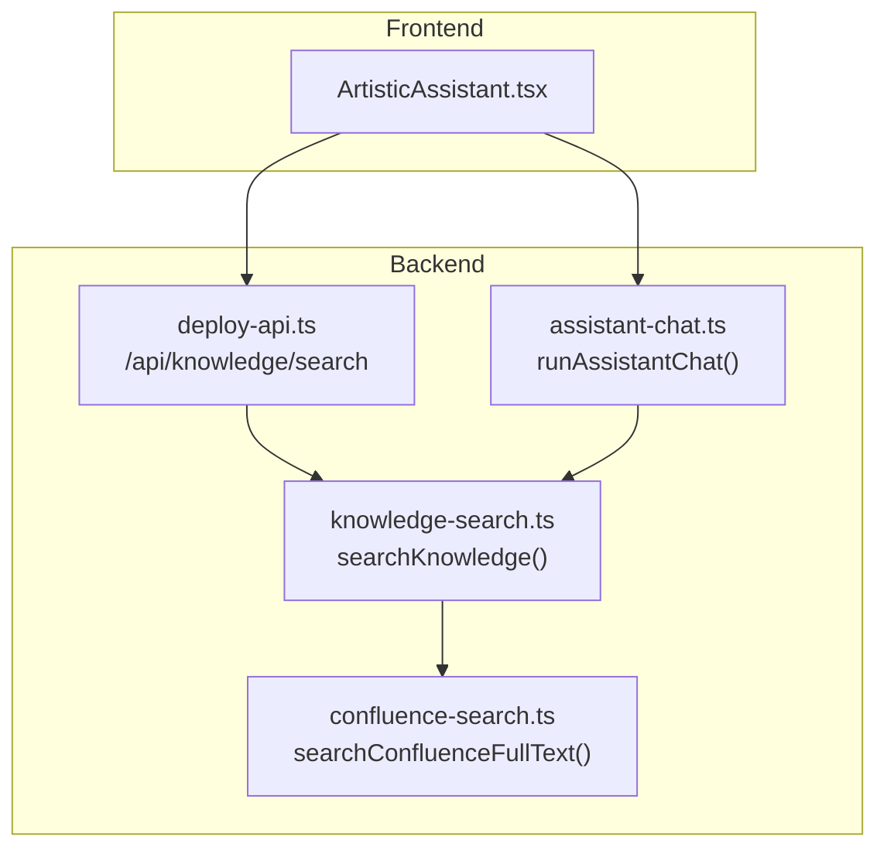
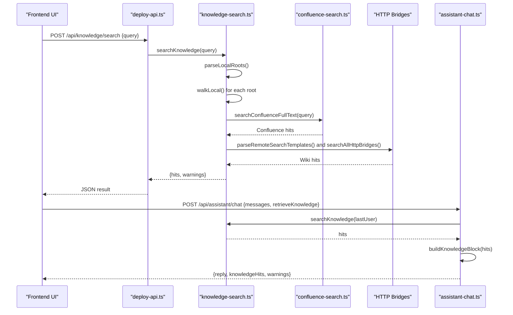
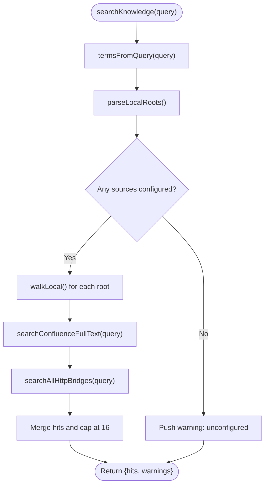
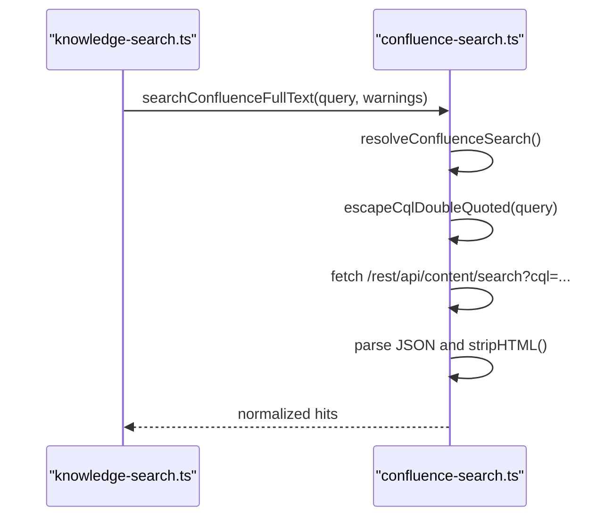
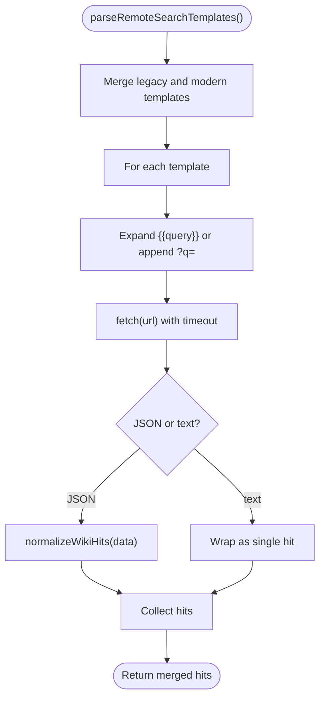
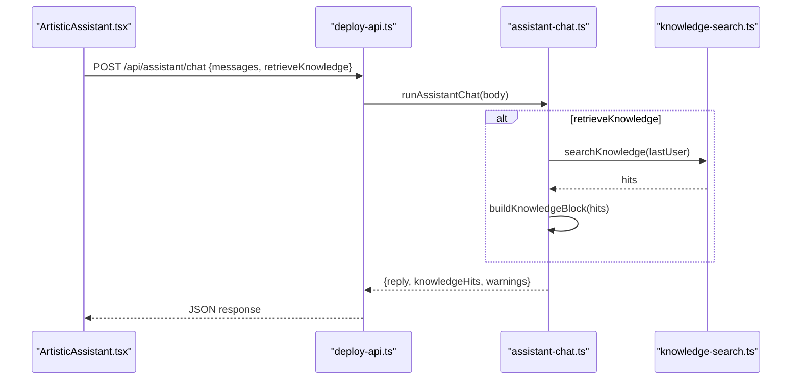
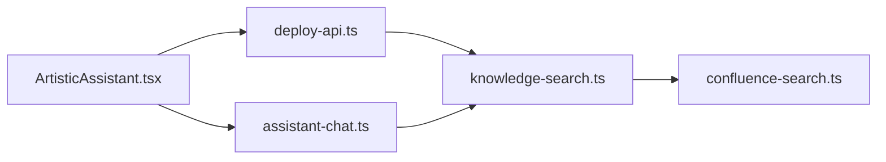

# Knowledge Base Integration

<cite>
**Referenced Files in This Document**
- [knowledge-search.ts](file://server/knowledge-search.ts)
- [confluence-search.ts](file://server/confluence-search.ts)
- [assistant-chat.ts](file://server/assistant-chat.ts)
- [deploy-api.ts](file://server/deploy-api.ts)
- [ArtisticAssistant.tsx](file://src/pages/ArtisticAssistant.tsx)
- [assistant-workspace-config.ts](file://server/assistant-workspace-config.ts)
</cite>

## Table of Contents
1. [Introduction](#introduction)
2. [Project Structure](#project-structure)
3. [Core Components](#core-components)
4. [Architecture Overview](#architecture-overview)
5. [Detailed Component Analysis](#detailed-component-analysis)
6. [Dependency Analysis](#dependency-analysis)
7. [Performance Considerations](#performance-considerations)
8. [Troubleshooting Guide](#troubleshooting-guide)
9. [Conclusion](#conclusion)

## Introduction
This document explains the knowledge base integration system that powers the assistant's ability to search and retrieve information from:
- Local directories (Markdown, MarkdownX, TXT, and Markdown files)
- Wiki systems (Atlassian Confluence via CQL)
- External HTTP endpoints (custom wiki search bridges)

It covers search algorithms, indexing strategies, retrieval mechanisms, configuration options, result processing, snippet extraction, relevance ranking, integration with chat responses, citation formatting, and performance optimization techniques.

## Project Structure
The knowledge base integration spans backend and frontend components:
- Backend search engine and integrations
- Confluence search adapter
- HTTP bridge search adapter
- Chat integration that injects knowledge into model prompts
- Frontend UI for preview and chat

**Diagram sources**
- [deploy-api.ts:1092-1106](file://server/deploy-api.ts#L1092-L1106)
- [knowledge-search.ts:260-332](file://server/knowledge-search.ts#L260-L332)
- [confluence-search.ts:135-203](file://server/confluence-search.ts#L135-L203)
- [assistant-chat.ts:160-202](file://server/assistant-chat.ts#L160-L202)
- [ArtisticAssistant.tsx:175-215](file://src/pages/ArtisticAssistant.tsx#L175-L215)

**Section sources**
- [deploy-api.ts:1092-1106](file://server/deploy-api.ts#L1092-L1106)
- [knowledge-search.ts:260-332](file://server/knowledge-search.ts#L260-L332)
- [confluence-search.ts:135-203](file://server/confluence-search.ts#L135-L203)
- [assistant-chat.ts:160-202](file://server/assistant-chat.ts#L160-L202)
- [ArtisticAssistant.tsx:175-215](file://src/pages/ArtisticAssistant.tsx#L175-L215)

## Core Components
- Knowledge search engine: parses configuration, walks local directories, queries Confluence, and invokes HTTP bridges.
- Confluence adapter: resolves credentials and performs CQL-based full-text search.
- HTTP bridge adapter: normalizes diverse wiki search API responses into a unified format.
- Chat integration: builds a knowledge block and injects it into the model prompt.
- Frontend UI: exposes knowledge search preview and chat with knowledge retrieval.

**Section sources**
- [knowledge-search.ts:260-332](file://server/knowledge-search.ts#L260-L332)
- [confluence-search.ts:135-203](file://server/confluence-search.ts#L135-L203)
- [assistant-chat.ts:30-36](file://server/assistant-chat.ts#L30-L36)
- [ArtisticAssistant.tsx:175-215](file://src/pages/ArtisticAssistant.tsx#L175-L215)

## Architecture Overview
The system orchestrates multiple knowledge sources and merges results into a unified set of hits. The flow is:

**Diagram sources**
- [deploy-api.ts:1092-1106](file://server/deploy-api.ts#L1092-L1106)
- [knowledge-search.ts:260-332](file://server/knowledge-search.ts#L260-L332)
- [confluence-search.ts:135-203](file://server/confluence-search.ts#L135-L203)
- [assistant-chat.ts:160-202](file://server/assistant-chat.ts#L160-L202)

## Detailed Component Analysis

### Knowledge Search Engine
Responsibilities:
- Parse configuration for local directories and HTTP search bridges
- Walk local directories up to a depth limit and file count limit
- Extract excerpts around matched terms
- Query Confluence via CQL
- Invoke multiple HTTP search bridges and normalize results
- Merge and cap results to a fixed maximum

Key behaviors:
- Terms extraction: splits query into tokens, filters short tokens, caps at 8
- Local file filtering: only text-like extensions (.md, .mdx, .txt, .markdown)
- Directory traversal: skips common folders, limits depth and files scanned
- Excerpt generation: finds the earliest match and slices around it
- Result cap: stops adding once a threshold is reached

**Diagram sources**
- [knowledge-search.ts:260-332](file://server/knowledge-search.ts#L260-L332)

**Section sources**
- [knowledge-search.ts:29-46](file://server/knowledge-search.ts#L29-L46)
- [knowledge-search.ts:67-135](file://server/knowledge-search.ts#L67-L135)
- [knowledge-search.ts:137-157](file://server/knowledge-search.ts#L137-L157)
- [knowledge-search.ts:168-188](file://server/knowledge-search.ts#L168-L188)
- [knowledge-search.ts:190-257](file://server/knowledge-search.ts#L190-L257)
- [knowledge-search.ts:260-332](file://server/knowledge-search.ts#L260-L332)

### Confluence Search Adapter
Responsibilities:
- Resolve configuration (base URL, credentials)
- Build CQL query for full-text search across pages and blog posts
- Fetch and parse JSON response
- Normalize HTML bodies to plain text for excerpts
- Build source URLs from web UI links

Key behaviors:
- Credential resolution: supports Basic auth via password or API token; falls back to Jira credentials
- URL normalization: ensures Confluence base ends with /wiki when applicable
- CQL escaping: escapes double quotes and truncates query length
- Timeout: enforces a generous timeout for HTTP requests

**Diagram sources**
- [confluence-search.ts:135-203](file://server/confluence-search.ts#L135-L203)

**Section sources**
- [confluence-search.ts:51-88](file://server/confluence-search.ts#L51-L88)
- [confluence-search.ts:135-203](file://server/confluence-search.ts#L135-L203)

### HTTP Bridge Search Adapter
Responsibilities:
- Parse multiple search URL templates (legacy and modern)
- Expand template with query (either placeholder or query param)
- Fetch and accept either JSON or plain text responses
- Normalize heterogeneous wiki APIs into a unified hit format

Key behaviors:
- Template parsing: deduplicates and merges legacy and modern templates
- URL expansion: supports placeholder or query parameter injection
- Response handling: JSON with hits/results/items arrays; plain text fallback
- Warning labeling: derives endpoint hostnames for user-friendly warnings

**Diagram sources**
- [knowledge-search.ts:137-157](file://server/knowledge-search.ts#L137-L157)
- [knowledge-search.ts:190-257](file://server/knowledge-search.ts#L190-L257)
- [knowledge-search.ts:168-188](file://server/knowledge-search.ts#L168-L188)

**Section sources**
- [knowledge-search.ts:137-157](file://server/knowledge-search.ts#L137-L157)
- [knowledge-search.ts:168-188](file://server/knowledge-search.ts#L168-L188)
- [knowledge-search.ts:190-257](file://server/knowledge-search.ts#L190-L257)

### Chat Integration and Knowledge Injection
Responsibilities:
- Optionally trigger knowledge search before chatting
- Build a structured knowledge block from hits
- Inject the block into the system instruction
- Return both the reply and the knowledge hits for UI display

Key behaviors:
- Knowledge block: titles, sources, excerpts grouped into a formatted block
- Prompt injection: appends knowledge block to the system instruction
- Provider routing: supports Ollama, OpenAI, and Gemini

**Diagram sources**
- [assistant-chat.ts:160-202](file://server/assistant-chat.ts#L160-L202)
- [knowledge-search.ts:260-332](file://server/knowledge-search.ts#L260-L332)
- [ArtisticAssistant.tsx:135-174](file://src/pages/ArtisticAssistant.tsx#L135-L174)

**Section sources**
- [assistant-chat.ts:30-36](file://server/assistant-chat.ts#L30-L36)
- [assistant-chat.ts:160-202](file://server/assistant-chat.ts#L160-L202)
- [ArtisticAssistant.tsx:135-174](file://src/pages/ArtisticAssistant.tsx#L135-L174)

### Frontend Integration and Citation Display
Responsibilities:
- Preview knowledge search results without invoking the model
- Send chat requests with optional knowledge retrieval
- Render knowledge hits with titles, sources, and excerpts
- Show warnings and hints about configuration

Key behaviors:
- Preview: calls /api/knowledge/search and displays top hits
- Chat: sends messages with retrieveKnowledge flag
- Rendering: shows knowledge hits under assistant replies with kind and source

**Section sources**
- [ArtisticAssistant.tsx:175-215](file://src/pages/ArtisticAssistant.tsx#L175-L215)
- [ArtisticAssistant.tsx:234-260](file://src/pages/ArtisticAssistant.tsx#L234-L260)

## Dependency Analysis
- knowledge-search.ts depends on confluence-search.ts for Confluence integration
- deploy-api.ts exposes endpoints for knowledge search and chat
- assistant-chat.ts orchestrates chat and knowledge injection
- ArtisticAssistant.tsx provides the UI for preview and chat

**Diagram sources**
- [deploy-api.ts:1092-1106](file://server/deploy-api.ts#L1092-L1106)
- [knowledge-search.ts:260-332](file://server/knowledge-search.ts#L260-L332)
- [confluence-search.ts:135-203](file://server/confluence-search.ts#L135-L203)
- [assistant-chat.ts:160-202](file://server/assistant-chat.ts#L160-L202)
- [ArtisticAssistant.tsx:175-215](file://src/pages/ArtisticAssistant.tsx#L175-L215)

**Section sources**
- [deploy-api.ts:1092-1106](file://server/deploy-api.ts#L1092-L1106)
- [knowledge-search.ts:260-332](file://server/knowledge-search.ts#L260-L332)
- [confluence-search.ts:135-203](file://server/confluence-search.ts#L135-L203)
- [assistant-chat.ts:160-202](file://server/assistant-chat.ts#L160-L202)
- [ArtisticAssistant.tsx:175-215](file://src/pages/ArtisticAssistant.tsx#L175-L215)

## Performance Considerations
- Local scanning limits:
  - Depth cap: traversal stops beyond a fixed depth
  - File cap: stops scanning after a fixed number of files
  - Result cap: stops collecting hits once a threshold is reached
- Memory and CPU:
  - Reads files synchronously; consider asynchronous reads for large directories
  - Excerpt generation scans for the earliest match; keep term counts bounded
- Network timeouts:
  - Confluence and HTTP bridges enforce timeouts to prevent hanging
- Caching:
  - No built-in caching in the search pipeline; consider caching frequent queries at the application layer or reverse proxy
- Indexing:
  - Current approach is a filesystem scan plus external HTTP/full-text search; for very large knowledge bases, consider pre-indexing and a dedicated search service

[No sources needed since this section provides general guidance]

## Troubleshooting Guide
Common issues and diagnostics:
- Unconfigured knowledge sources:
  - The system warns when no local directories, Confluence, or HTTP bridges are configured
- Local directory errors:
  - Nonexistent or unreadable directories produce warnings
- Confluence configuration:
  - Missing base URL, credentials, or invalid responses produce warnings
- HTTP bridge failures:
  - Invalid URLs, non-JSON responses, or network errors produce warnings
- Chat model configuration:
  - Missing API keys or invalid model selection causes chat failures

Operational checks:
- Verify environment variables for knowledge sources
- Confirm endpoint reachability for HTTP bridges
- Validate Confluence base URL and credentials
- Review warnings returned by the search and chat endpoints

**Section sources**
- [knowledge-search.ts:274-278](file://server/knowledge-search.ts#L274-L278)
- [knowledge-search.ts:196-206](file://server/knowledge-search.ts#L196-L206)
- [knowledge-search.ts:218-228](file://server/knowledge-search.ts#L218-L228)
- [confluence-search.ts:140-145](file://server/confluence-search.ts#L140-L145)
- [confluence-search.ts:167-178](file://server/confluence-search.ts#L167-L178)
- [assistant-chat.ts:1126-1149](file://server/assistant-chat.ts#L1126-L1149)

## Conclusion
The knowledge base integration system provides a flexible, modular approach to retrieving contextual information from local files, Confluence, and external wiki search endpoints. It offers configurable search terms, robust result normalization, and seamless integration with chat responses. For large-scale deployments, consider adding caching, asynchronous I/O, and a dedicated search index to improve performance and scalability.