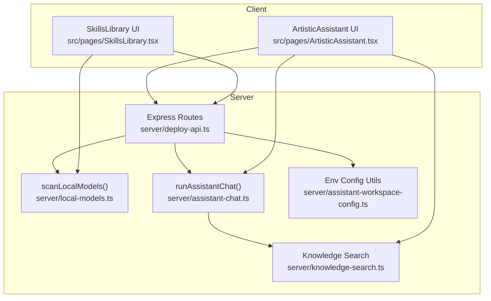
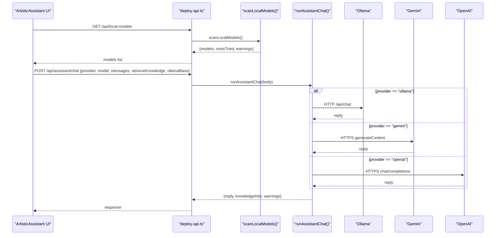
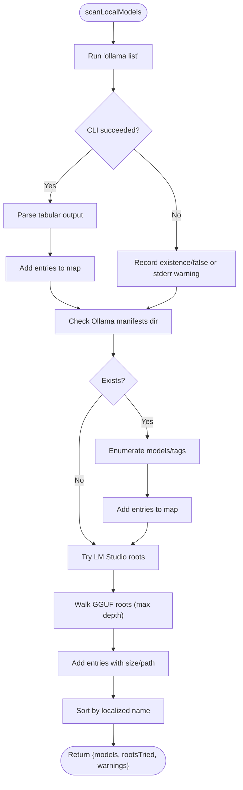
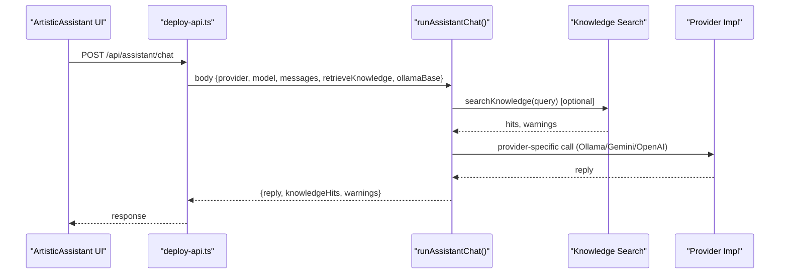
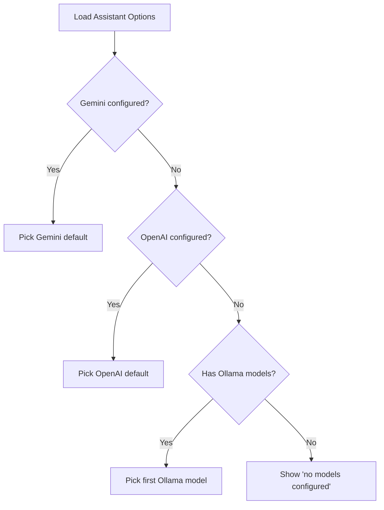
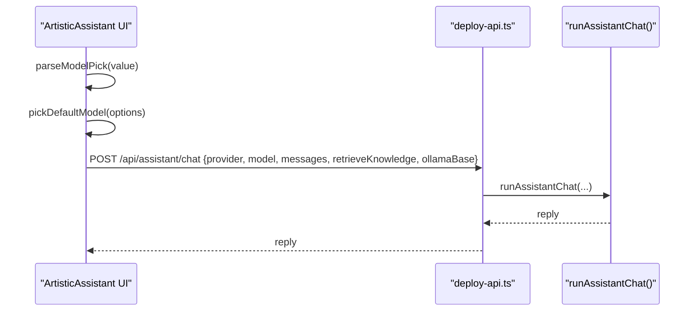
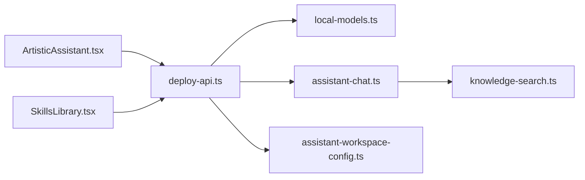

# Local Model Management

<cite>
**Referenced Files in This Document**
- [local-models.ts](file://server/local-models.ts)
- [assistant-chat.ts](file://server/assistant-chat.ts)
- [deploy-api.ts](file://server/deploy-api.ts)
- [ArtisticAssistant.tsx](file://src/pages/ArtisticAssistant.tsx)
- [SkillsLibrary.tsx](file://src/pages/SkillsLibrary.tsx)
- [assistant-workspace-config.ts](file://server/assistant-workspace-config.ts)
- [knowledge-search.ts](file://server/knowledge-search.ts)
</cite>

## Table of Contents
1. [Introduction](#introduction)
2. [Project Structure](#project-structure)
3. [Core Components](#core-components)
4. [Architecture Overview](#architecture-overview)
5. [Detailed Component Analysis](#detailed-component-analysis)
6. [Dependency Analysis](#dependency-analysis)
7. [Performance Considerations](#performance-considerations)
8. [Troubleshooting Guide](#troubleshooting-guide)
9. [Conclusion](#conclusion)

## Introduction
This document explains the local model management system used by the application to discover, configure, and run local AI models, with a focus on Ollama integration and model lifecycle management. It covers how the system detects local models (Ollama CLI, Ollama manifests, LM Studio GGUF), how runtime model selection works in the assistant UI, and how the backend routes chat requests to the appropriate provider (Ollama, Gemini, OpenAI). It also documents configuration options, fallback strategies, and performance considerations for local model execution.

## Project Structure
The local model management spans server-side discovery and routing, and client-side UI for model selection and chat.

**Diagram sources**
- [local-models.ts:124-177](file://server/local-models.ts#L124-L177)
- [assistant-chat.ts:160-213](file://server/assistant-chat.ts#L160-L213)
- [deploy-api.ts:942-956](file://server/deploy-api.ts#L942-L956)
- [ArtisticAssistant.tsx:70-91](file://src/pages/ArtisticAssistant.tsx#L70-L91)
- [SkillsLibrary.tsx:216-250](file://src/pages/SkillsLibrary.tsx#L216-L250)
- [assistant-workspace-config.ts:8-31](file://server/assistant-workspace-config.ts#L8-L31)
- [knowledge-search.ts:1-332](file://server/knowledge-search.ts#L1-L332)

**Section sources**
- [local-models.ts:1-178](file://server/local-models.ts#L1-L178)
- [assistant-chat.ts:1-214](file://server/assistant-chat.ts#L1-L214)
- [deploy-api.ts:942-956](file://server/deploy-api.ts#L942-L956)
- [ArtisticAssistant.tsx:1-349](file://src/pages/ArtisticAssistant.tsx#L1-L349)
- [SkillsLibrary.tsx:216-250](file://src/pages/SkillsLibrary.tsx#L216-L250)
- [assistant-workspace-config.ts:1-200](file://server/assistant-workspace-config.ts#L1-L200)
- [knowledge-search.ts:1-332](file://server/knowledge-search.ts#L1-L332)

## Core Components
- Local model discovery and scanning:
  - Scans Ollama CLI list output and manifest directories.
  - Walks LM Studio model roots to find GGUF files and compute sizes.
  - Returns deduplicated model entries with source, name, optional size/path.
- Provider abstraction for chat:
  - Supports Ollama, Gemini, and OpenAI.
  - Selects provider and model at runtime; resolves defaults from environment variables.
- Assistant chat pipeline:
  - Optional knowledge retrieval from local directories, Confluence, and HTTP bridges.
  - Builds a system prompt augmented with knowledge fragments.
  - Routes to provider-specific chat implementations with timeouts and error handling.
- UI integration:
  - ArtisticAssistant loads provider options and allows selecting a model.
  - SkillsLibrary displays discovered local models and supports filtering by source.

**Section sources**
- [local-models.ts:6-19](file://server/local-models.ts#L6-L19)
- [assistant-chat.ts:11-25](file://server/assistant-chat.ts#L11-L25)
- [assistant-chat.ts:160-213](file://server/assistant-chat.ts#L160-L213)
- [ArtisticAssistant.tsx:22-55](file://src/pages/ArtisticAssistant.tsx#L22-L55)
- [SkillsLibrary.tsx:413-428](file://src/pages/SkillsLibrary.tsx#L413-L428)

## Architecture Overview
The system integrates three primary flows:
- Discovery: The server scans for local models and exposes them via an API endpoint.
- Selection: The UI presents available models and captures user selection.
- Execution: The server routes chat requests to the selected provider with knowledge augmentation.

**Diagram sources**
- [deploy-api.ts:942-956](file://server/deploy-api.ts#L942-L956)
- [local-models.ts:124-177](file://server/local-models.ts#L124-L177)
- [assistant-chat.ts:160-213](file://server/assistant-chat.ts#L160-L213)
- [ArtisticAssistant.tsx:135-174](file://src/pages/ArtisticAssistant.tsx#L135-L174)

## Detailed Component Analysis

### Local Model Discovery and Scanning
- Detection mechanisms:
  - Ollama CLI: Executes a command and parses tabular output to extract model names and metadata.
  - Ollama manifests: Reads the local manifests directory under the user’s home to enumerate models and tags.
  - LM Studio GGUF: Walks platform-specific model roots to find GGUF files, computes human-readable sizes, and records paths.
- Deduplication and sorting:
  - Uses a composite key to avoid duplicates (LM Studio models keyed by path; others by normalized name).
  - Sorts models by localized name for consistent presentation.
- Results:
  - Returns models, attempted root paths, and warnings for diagnostics.

**Diagram sources**
- [local-models.ts:21-37](file://server/local-models.ts#L21-L37)
- [local-models.ts:39-70](file://server/local-models.ts#L39-L70)
- [local-models.ts:72-113](file://server/local-models.ts#L72-L113)
- [local-models.ts:124-177](file://server/local-models.ts#L124-L177)

**Section sources**
- [local-models.ts:21-37](file://server/local-models.ts#L21-L37)
- [local-models.ts:39-70](file://server/local-models.ts#L39-L70)
- [local-models.ts:72-113](file://server/local-models.ts#L72-L113)
- [local-models.ts:124-177](file://server/local-models.ts#L124-L177)

### Model Provider Abstraction and Chat Routing
- Providers supported:
  - Ollama: Sends a structured chat request to the local Ollama API.
  - Gemini: Calls Google Generative Language API with a system instruction and turns.
  - OpenAI: Calls OpenAI-compatible chat completions endpoint.
- Runtime selection:
  - The UI sends provider and model identifiers.
  - The server selects the provider and constructs messages accordingly.
- Defaults and environment fallbacks:
  - Ollama host defaults to a localhost address if not provided.
  - Provider-specific model defaults are resolved from environment variables.
- Knowledge augmentation:
  - Optional retrieval from local directories, Confluence, and HTTP bridges.
  - Knowledge fragments are embedded into a system-style prompt.

**Diagram sources**
- [assistant-chat.ts:160-213](file://server/assistant-chat.ts#L160-L213)
- [assistant-chat.ts:47-72](file://server/assistant-chat.ts#L47-L72)
- [assistant-chat.ts:74-115](file://server/assistant-chat.ts#L74-L115)
- [assistant-chat.ts:117-158](file://server/assistant-chat.ts#L117-L158)
- [knowledge-search.ts:109-157](file://server/knowledge-search.ts#L109-L157)

**Section sources**
- [assistant-chat.ts:11-25](file://server/assistant-chat.ts#L11-L25)
- [assistant-chat.ts:160-213](file://server/assistant-chat.ts#L160-L213)
- [assistant-chat.ts:175-189](file://server/assistant-chat.ts#L175-L189)
- [assistant-chat.ts:193-201](file://server/assistant-chat.ts#L193-L201)
- [knowledge-search.ts:1-332](file://server/knowledge-search.ts#L1-L332)

### Model Configuration Interface and Fallback Strategies
- Environment-driven configuration:
  - Provider credentials and model names are read from environment variables.
  - Ollama host can be overridden per request or via environment variable.
- UI-driven selection:
  - The UI loads provider availability and model lists, then lets users choose.
  - Default selection prefers configured providers; falls back to local Ollama models if present.
- Fallback behavior:
  - If knowledge retrieval fails, warnings are returned alongside the reply.
  - If a provider is unavailable, the UI disables sending until configuration is corrected.

**Diagram sources**
- [ArtisticAssistant.tsx:50-55](file://src/pages/ArtisticAssistant.tsx#L50-L55)
- [ArtisticAssistant.tsx:22-35](file://src/pages/ArtisticAssistant.tsx#L22-L35)

**Section sources**
- [assistant-workspace-config.ts:79-95](file://server/assistant-workspace-config.ts#L79-L95)
- [assistant-chat.ts:175-179](file://server/assistant-chat.ts#L175-L179)
- [ArtisticAssistant.tsx:50-55](file://src/pages/ArtisticAssistant.tsx#L50-L55)

### Model Switching Logic and UI Integration
- Parsing model choice:
  - The UI accepts a compact model identifier string and parses it into a structured choice.
  - Supports provider tokens and Ollama model names prefixed appropriately.
- Rendering model options:
  - The UI renders provider-specific options and local Ollama models.
  - Disables selection controls when no models are available.
- Sending chat:
  - Constructs the final model identifier for the chosen provider (e.g., Ollama model name vs. provider-specific model name).
  - Sends knowledge retrieval toggle and Ollama host override when applicable.

**Diagram sources**
- [ArtisticAssistant.tsx:39-48](file://src/pages/ArtisticAssistant.tsx#L39-L48)
- [ArtisticAssistant.tsx:50-55](file://src/pages/ArtisticAssistant.tsx#L50-L55)
- [ArtisticAssistant.tsx:135-174](file://src/pages/ArtisticAssistant.tsx#L135-L174)
- [assistant-chat.ts:160-213](file://server/assistant-chat.ts#L160-L213)

**Section sources**
- [ArtisticAssistant.tsx:39-48](file://src/pages/ArtisticAssistant.tsx#L39-L48)
- [ArtisticAssistant.tsx:50-55](file://src/pages/ArtisticAssistant.tsx#L50-L55)
- [ArtisticAssistant.tsx:135-174](file://src/pages/ArtisticAssistant.tsx#L135-L174)

### Skills Library Model View
- Loads local models and MCP configurations concurrently.
- Provides filtering by model source and refresh capability.
- Displays model cards with name and source, enabling quick discovery of local models.

**Section sources**
- [SkillsLibrary.tsx:216-250](file://src/pages/SkillsLibrary.tsx#L216-L250)
- [SkillsLibrary.tsx:413-428](file://src/pages/SkillsLibrary.tsx#L413-L428)
- [SkillsLibrary.tsx:546-569](file://src/pages/SkillsLibrary.tsx#L546-L569)

## Dependency Analysis
- Server endpoints depend on:
  - Local model scanner for model discovery.
  - Assistant chat router for provider dispatch.
  - Knowledge search for optional retrieval.
  - Environment configuration utilities for .env handling.
- Client UI depends on:
  - Server endpoints for model lists and chat execution.
  - Knowledge search endpoint for preview.

**Diagram sources**
- [deploy-api.ts:942-956](file://server/deploy-api.ts#L942-L956)
- [local-models.ts:124-177](file://server/local-models.ts#L124-L177)
- [assistant-chat.ts:160-213](file://server/assistant-chat.ts#L160-L213)
- [knowledge-search.ts:1-332](file://server/knowledge-search.ts#L1-L332)
- [assistant-workspace-config.ts:1-200](file://server/assistant-workspace-config.ts#L1-L200)
- [ArtisticAssistant.tsx:1-349](file://src/pages/ArtisticAssistant.tsx#L1-L349)
- [SkillsLibrary.tsx:216-250](file://src/pages/SkillsLibrary.tsx#L216-L250)

**Section sources**
- [deploy-api.ts:942-956](file://server/deploy-api.ts#L942-L956)
- [local-models.ts:124-177](file://server/local-models.ts#L124-L177)
- [assistant-chat.ts:160-213](file://server/assistant-chat.ts#L160-L213)
- [knowledge-search.ts:1-332](file://server/knowledge-search.ts#L1-L332)
- [assistant-workspace-config.ts:1-200](file://server/assistant-workspace-config.ts#L1-L200)
- [ArtisticAssistant.tsx:1-349](file://src/pages/ArtisticAssistant.tsx#L1-L349)
- [SkillsLibrary.tsx:216-250](file://src/pages/SkillsLibrary.tsx#L216-L250)

## Performance Considerations
- Local model discovery:
  - Limits recursion depth when walking GGUF directories to avoid deep traversal overhead.
  - Skips hidden entries and filters by file extension to reduce IO.
- Chat execution:
  - Applies a strict timeout for provider requests to prevent hanging.
  - Streams are disabled for simplicity; adjust if streaming support is desired.
- Knowledge retrieval:
  - Limits total hits and applies early exits to keep latency low.
  - Warns on missing directories and failed HTTP bridges to guide configuration.

[No sources needed since this section provides general guidance]

## Troubleshooting Guide
Common issues and resolutions:
- Ollama not detected:
  - Verify the CLI is installed and accessible in PATH.
  - Check stderr warnings returned during model scan for diagnostics.
- Empty model list:
  - Ensure Ollama models are pulled locally or LM Studio models are placed in recognized directories.
  - Confirm platform-specific roots are present and readable.
- Chat failures:
  - For Ollama, confirm the host setting matches the local service address.
  - For Gemini/OpenAI, verify credentials and model names are configured.
- Knowledge search errors:
  - Confirm local directories exist and are readable.
  - Validate Confluence or HTTP bridge templates and tokens.

Operational checks:
- Use the Skills Library “refresh” button to re-scan local models.
- In the Settings page, review and update environment variables for providers and knowledge search.

**Section sources**
- [local-models.ts:137-154](file://server/local-models.ts#L137-L154)
- [assistant-chat.ts:175-179](file://server/assistant-chat.ts#L175-L179)
- [assistant-chat.ts:47-72](file://server/assistant-chat.ts#L47-L72)
- [assistant-chat.ts:74-115](file://server/assistant-chat.ts#L74-L115)
- [assistant-chat.ts:117-158](file://server/assistant-chat.ts#L117-L158)
- [SkillsLibrary.tsx:425-428](file://src/pages/SkillsLibrary.tsx#L425-L428)
- [Settings.tsx:1-348](file://src/pages/Settings.tsx#L1-L348)

## Conclusion
The local model management system provides a robust, extensible foundation for discovering and running local AI models. It integrates Ollama, Gemini, and OpenAI with a unified chat interface, supports knowledge augmentation, and offers clear diagnostics and fallback behavior. By leveraging environment variables and UI-driven selection, users can easily switch between providers and models while maintaining predictable performance and reliability.