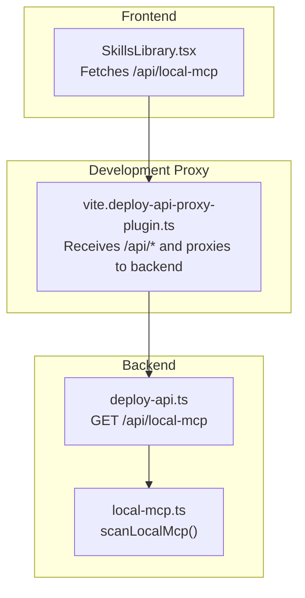
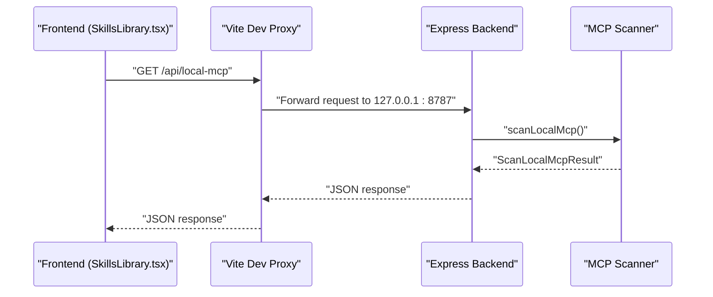
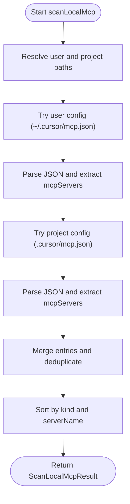
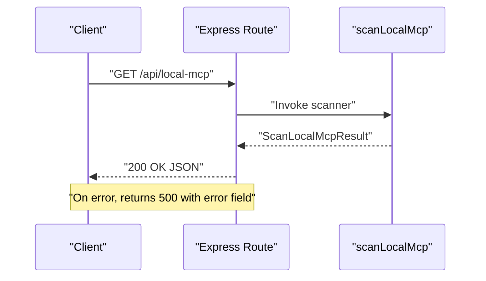
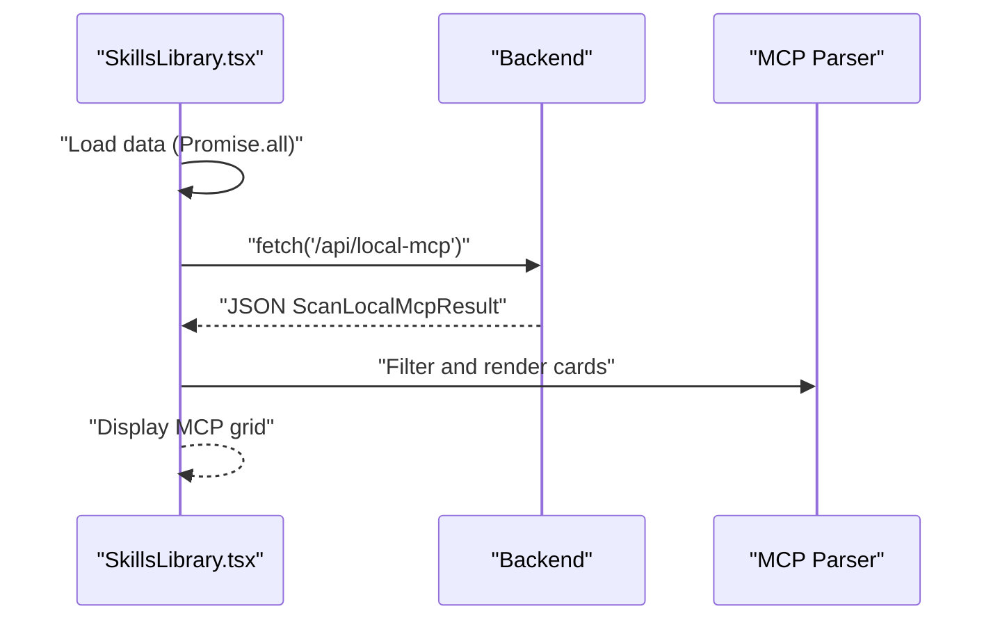
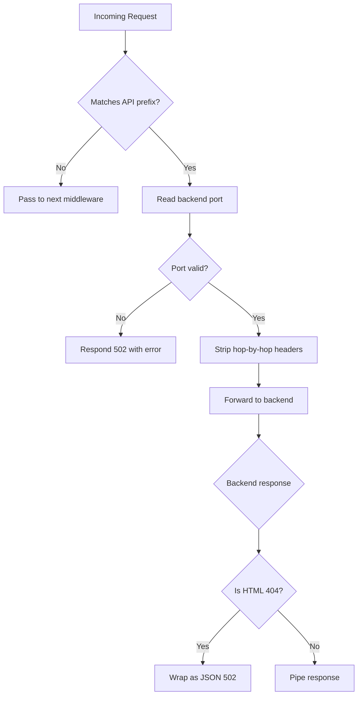
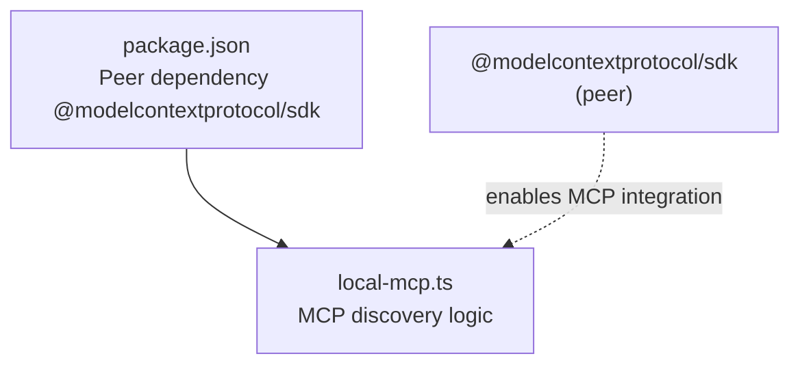

# MCP Server Integration

<cite>
**Referenced Files in This Document**
- [local-mcp.ts](file://server/local-mcp.ts)
- [deploy-api.ts](file://server/deploy-api.ts)
- [SkillsLibrary.tsx](file://src/pages/SkillsLibrary.tsx)
- [vite.deploy-api-proxy-plugin.ts](file://vite.deploy-api-proxy-plugin.ts)
- [package.json](file://package.json)
- [assistant-chat.ts](file://server/assistant-chat.ts)
- [local-models.ts](file://server/local-models.ts)
</cite>

## Table of Contents
1. [Introduction](#introduction)
2. [Project Structure](#project-structure)
3. [Core Components](#core-components)
4. [Architecture Overview](#architecture-overview)
5. [Detailed Component Analysis](#detailed-component-analysis)
6. [Dependency Analysis](#dependency-analysis)
7. [Performance Considerations](#performance-considerations)
8. [Troubleshooting Guide](#troubleshooting-guide)
9. [Conclusion](#conclusion)
10. [Appendices](#appendices)

## Introduction
This document explains how the Model Context Protocol (MCP) server integration is implemented in the project. It covers server discovery via local configuration files, protocol communication patterns, resource management, and how the assistant interacts with external AI services beyond local models. It also documents configuration options, setup steps, error handling, security considerations, and performance optimization strategies for MCP-based operations.

## Project Structure
The MCP integration spans backend scanning, API exposure, frontend discovery, and development-time proxying. The key elements are:
- Backend scanning of MCP server configurations from user and project directories
- An Express endpoint exposing discovered MCP servers
- Frontend UI that fetches and displays MCP server entries
- Development proxy plugin that forwards API requests to the backend

**Diagram sources**
- [SkillsLibrary.tsx:216-250](file://src/pages/SkillsLibrary.tsx#L216-L250)
- [vite.deploy-api-proxy-plugin.ts:10-19](file://vite.deploy-api-proxy-plugin.ts#L10-L19)
- [deploy-api.ts:926-940](file://server/deploy-api.ts#L926-L940)
- [local-mcp.ts:71-105](file://server/local-mcp.ts#L71-L105)

**Section sources**
- [SkillsLibrary.tsx:216-250](file://src/pages/SkillsLibrary.tsx#L216-L250)
- [vite.deploy-api-proxy-plugin.ts:10-19](file://vite.deploy-api-proxy-plugin.ts#L10-L19)
- [deploy-api.ts:926-940](file://server/deploy-api.ts#L926-L940)
- [local-mcp.ts:71-105](file://server/local-mcp.ts#L71-L105)

## Core Components
- MCP server discovery and parsing:
  - Scans user and project directories for MCP configuration files
  - Parses JSON and extracts MCP server entries
  - Returns a normalized list with metadata such as kind, server name, config path, optional command, arguments preview, and optional URL
- API endpoint:
  - Exposes a GET route that returns the discovery result
  - Wraps errors into a structured response
- Frontend integration:
  - Fetches MCP data alongside skills and local models
  - Provides filtering and display of MCP servers
- Development proxy:
  - Proxies API routes to the backend during development

Key data structures:
- LocalMcpServerEntry: normalized MCP server entry
- ScanLocalMcpResult: aggregated discovery result with servers, tried paths, and warnings

**Section sources**
- [local-mcp.ts:6-21](file://server/local-mcp.ts#L6-L21)
- [local-mcp.ts:32-69](file://server/local-mcp.ts#L32-L69)
- [local-mcp.ts:71-105](file://server/local-mcp.ts#L71-L105)
- [deploy-api.ts:926-940](file://server/deploy-api.ts#L926-L940)
- [SkillsLibrary.tsx:216-250](file://src/pages/SkillsLibrary.tsx#L216-L250)

## Architecture Overview
The MCP integration follows a layered pattern:
- Discovery layer: reads and parses MCP configuration files
- API layer: exposes discovery results via a REST endpoint
- UI layer: fetches and renders MCP entries
- Proxy layer: forwards frontend requests to the backend during development

**Diagram sources**
- [SkillsLibrary.tsx:216-250](file://src/pages/SkillsLibrary.tsx#L216-L250)
- [vite.deploy-api-proxy-plugin.ts:72-149](file://vite.deploy-api-proxy-plugin.ts#L72-L149)
- [deploy-api.ts:926-940](file://server/deploy-api.ts#L926-L940)
- [local-mcp.ts:71-105](file://server/local-mcp.ts#L71-L105)

## Detailed Component Analysis

### MCP Server Discovery and Parsing
The discovery logic:
- Resolves user and project configuration paths
- Reads and parses JSON files
- Extracts the mcpServers object and iterates over entries
- Normalizes entries with kind, serverName, configPath, optional command, args preview, and optional URL
- Sorts results by kind and server name

**Diagram sources**
- [local-mcp.ts:71-105](file://server/local-mcp.ts#L71-L105)
- [local-mcp.ts:32-69](file://server/local-mcp.ts#L32-L69)

**Section sources**
- [local-mcp.ts:71-105](file://server/local-mcp.ts#L71-L105)
- [local-mcp.ts:32-69](file://server/local-mcp.ts#L32-L69)

### API Endpoint for MCP Discovery
The backend endpoint:
- Registers a GET route for MCP discovery
- Calls the scanner and returns the result
- On error, returns a structured error response with status 500

**Diagram sources**
- [deploy-api.ts:926-940](file://server/deploy-api.ts#L926-L940)
- [local-mcp.ts:71-105](file://server/local-mcp.ts#L71-L105)

**Section sources**
- [deploy-api.ts:926-940](file://server/deploy-api.ts#L926-L940)

### Frontend Integration and Display
The frontend:
- Fetches MCP data along with skills and models
- Filters MCP entries by kind and search query
- Renders cards with server name, kind badge, and metadata
- Shows empty state guidance when no MCP servers are configured

**Diagram sources**
- [SkillsLibrary.tsx:216-250](file://src/pages/SkillsLibrary.tsx#L216-L250)
- [SkillsLibrary.tsx:267-277](file://src/pages/SkillsLibrary.tsx#L267-L277)
- [SkillsLibrary.tsx:499-523](file://src/pages/SkillsLibrary.tsx#L499-L523)

**Section sources**
- [SkillsLibrary.tsx:216-250](file://src/pages/SkillsLibrary.tsx#L216-L250)
- [SkillsLibrary.tsx:267-277](file://src/pages/SkillsLibrary.tsx#L267-L277)
- [SkillsLibrary.tsx:499-523](file://src/pages/SkillsLibrary.tsx#L499-L523)

### Development-Time Proxying
During development, Vite proxies API requests to the backend:
- Recognizes API prefixes including /api/local-mcp
- Reads the backend port dynamically from a file or environment
- Strips hop-by-hop headers and forwards requests
- Handles invalid ports and HTML 404 responses from the backend

**Diagram sources**
- [vite.deploy-api-proxy-plugin.ts:72-149](file://vite.deploy-api-proxy-plugin.ts#L72-L149)

**Section sources**
- [vite.deploy-api-proxy-plugin.ts:10-19](file://vite.deploy-api-proxy-plugin.ts#L10-L19)
- [vite.deploy-api-proxy-plugin.ts:43-55](file://vite.deploy-api-proxy-plugin.ts#L43-L55)
- [vite.deploy-api-proxy-plugin.ts:100-149](file://vite.deploy-api-proxy-plugin.ts#L100-L149)

### Relationship to Assistant and Local Models
While the assistant chat integrates with local models and external providers, MCP discovery is separate and complementary:
- Assistant chat supports Ollama, OpenAI, and Gemini
- Local models scanning complements MCP by discovering local model assets
- MCP discovery focuses on external AI services configured via MCP

**Section sources**
- [assistant-chat.ts:117-200](file://server/assistant-chat.ts#L117-L200)
- [local-models.ts:124-177](file://server/local-models.ts#L124-L177)

## Dependency Analysis
External dependencies relevant to MCP:
- The project declares a peer dependency on the Model Context Protocol SDK, indicating compatibility and enabling MCP-based integrations when installed

**Diagram sources**
- [package.json:1841-1848](file://package.json#L1841-L1848)
- [local-mcp.ts:1-106](file://server/local-mcp.ts#L1-L106)

**Section sources**
- [package.json:1841-1848](file://package.json#L1841-L1848)
- [local-mcp.ts:1-106](file://server/local-mcp.ts#L1-L106)

## Performance Considerations
- Discovery is file-based and lightweight; avoid frequent polling in production UI
- Filter and sort operations are client-side; keep lists reasonably sized
- During development, ensure the backend port is correct to prevent repeated proxy errors
- For large numbers of MCP servers, consider pagination or lazy loading in the UI

## Troubleshooting Guide
Common issues and resolutions:
- No MCP servers discovered
  - Ensure configuration files exist in the expected locations
  - Verify the mcpServers object is present and valid JSON
  - Check warnings returned by the endpoint for parsing errors
- Invalid backend port in development
  - Confirm the backend is running on the expected port
  - Clear stale port files and restart the backend
  - Adjust the port environment variable if necessary
- HTML 404 from backend
  - Indicates the backend is reachable but not serving the requested route
  - Verify the backend is started and listening on the correct port
- Proxy errors
  - Inspect the proxy error message for connection failures
  - Ensure the backend is ready before the frontend attempts requests

**Section sources**
- [SkillsLibrary.tsx:499-505](file://src/pages/SkillsLibrary.tsx#L499-L505)
- [vite.deploy-api-proxy-plugin.ts:92-98](file://vite.deploy-api-proxy-plugin.ts#L92-L98)
- [vite.deploy-api-proxy-plugin.ts:136-145](file://vite.deploy-api-proxy-plugin.ts#L136-L145)
- [deploy-api.ts:926-940](file://server/deploy-api.ts#L926-L940)

## Conclusion
The MCP server integration centers on a robust discovery mechanism that scans user and project configuration files, normalizes the results, and exposes them via a dedicated API endpoint. The frontend consumes this endpoint to present MCP servers, while the development proxy ensures seamless connectivity during development. The project’s peer dependency on the Model Context Protocol SDK indicates readiness for MCP-based operations when the SDK is installed.

## Appendices

### Setup Instructions for MCP Servers
- Place MCP server configurations in one or both of the following locations:
  - User-level: ~/.cursor/mcp.json
  - Project-level: .cursor/mcp.json (within the repository)
- Ensure the mcpServers object is present and contains valid entries with either a command or a URL
- Restart the backend to refresh the discovery cache
- Access the MCP list via the frontend “Local MCP” tab or the /api/local-mcp endpoint

**Section sources**
- [SkillsLibrary.tsx:499-505](file://src/pages/SkillsLibrary.tsx#L499-L505)
- [local-mcp.ts:71-105](file://server/local-mcp.ts#L71-L105)

### Configuration Options
- Backend port (development): controlled by the proxy and can be influenced by environment variables and port files
- MCP configuration files: JSON with an mcpServers object containing server entries

**Section sources**
- [vite.deploy-api-proxy-plugin.ts:43-55](file://vite.deploy-api-proxy-plugin.ts#L43-L55)
- [local-mcp.ts:23-25](file://server/local-mcp.ts#L23-L25)

### Security Considerations
- MCP configurations may include commands or URLs; validate and restrict access to trusted sources
- Avoid committing sensitive credentials to repositories; use environment-specific configuration
- When integrating with external services, prefer HTTPS endpoints and secure credential storage

### Error Handling for MCP Communications
- Backend returns structured error responses on failure
- Frontend surfaces errors and warnings from the discovery operation
- Development proxy wraps HTML 404 responses into JSON for clearer diagnostics

**Section sources**
- [deploy-api.ts:926-940](file://server/deploy-api.ts#L926-L940)
- [SkillsLibrary.tsx:234-241](file://src/pages/SkillsLibrary.tsx#L234-L241)
- [vite.deploy-api-proxy-plugin.ts:120-130](file://vite.deploy-api-proxy-plugin.ts#L120-L130)