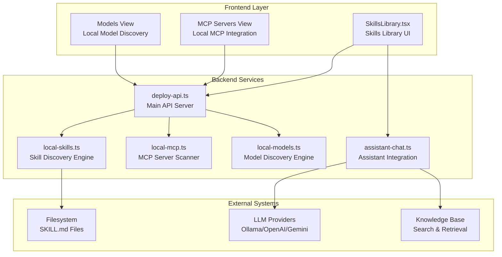
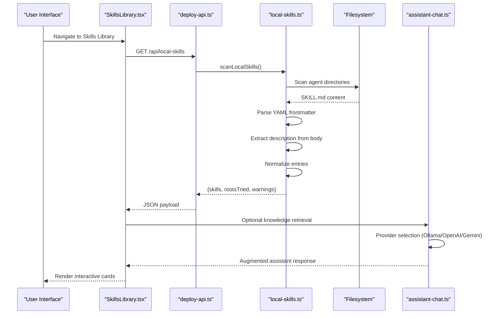
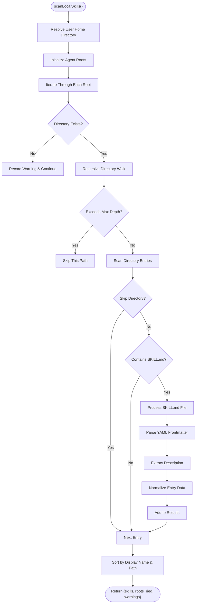

# Skill System Architecture

<cite>
**Referenced Files in This Document**
- [skill.md](file://skill.md)
- [local-skills.ts](file://server/local-skills.ts)
- [SkillsLibrary.tsx](file://src/pages/SkillsLibrary.tsx)
- [deploy-api.ts](file://server/deploy-api.ts)
- [assistant-chat.ts](file://server/assistant-chat.ts)
- [local-mcp.ts](file://server/local-mcp.ts)
- [local-models.ts](file://server/local-models.ts)
- [README.md](file://README.md)
- [metadata.json](file://metadata.json)
</cite>

## Update Summary
**Changes Made**
- Enhanced documentation with comprehensive coverage of skill system design patterns and multi-agent ecosystem support
- Updated skill specification format with new guidance structure and quality gates
- Expanded discovery mechanisms to include MCP servers and local models alongside skills
- Enhanced UI capabilities with advanced filtering, concurrent loading, and responsive design
- Added comprehensive API definitions and integration patterns for assistant system
- Enhanced security considerations with path containment validation and resource protection
- Updated troubleshooting guidance with common issues and solutions
- Improved performance optimizations with concurrent processing and virtualized rendering

## Table of Contents
1. [Introduction](#introduction)
2. [Project Structure](#project-structure)
3. [Core Components](#core-components)
4. [Architecture Overview](#architecture-overview)
5. [Detailed Component Analysis](#detailed-component-analysis)
6. [Skill Specification Format](#skill-specification-format)
7. [Discovery and Registration Mechanisms](#discovery-and-registration-mechanisms)
8. [Skills Library UI and Runtime Integration](#skills-library-ui-and-runtime-integration)
9. [Skill Development Framework](#skill-development-framework)
10. [Security and Performance Considerations](#security-and-performance-considerations)
11. [API Definitions](#api-definitions)
12. [Integration Patterns](#integration-patterns)
13. [Troubleshooting Guide](#troubleshooting-guide)
14. [Conclusion](#conclusion)
15. [Appendices](#appendices)

## Introduction
This document explains the comprehensive skill system architecture used to develop, discover, register, and invoke custom AI capabilities within the assistant system. The skill system provides a standardized, portable format (SKILL.md) that enables teams to share reusable capabilities across different AI agents while maintaining consistent presentation and invocation patterns.

The system follows a three-stage flow: Discovery, Presentation, and Integration. It supports multiple agent ecosystems (Claude, Cursor, Agents, Codex) and provides robust safety mechanisms, performance optimizations, and developer-friendly tooling. The system has evolved to include comprehensive support for MCP servers, local models, and enhanced UI capabilities for managing diverse AI resources.

## Project Structure
The skill system spans backend scanning logic, frontend UI, and assistant integration components:



**Diagram sources**
- [SkillsLibrary.tsx:202-250](file://src/pages/SkillsLibrary.tsx#L202-L250)
- [deploy-api.ts:910-956](file://server/deploy-api.ts#L910-L956)
- [local-skills.ts:205-236](file://server/local-skills.ts#L205-L236)
- [assistant-chat.ts:160-202](file://server/assistant-chat.ts#L160-L202)

## Core Components

### Skill Specification Format (SKILL.md)
The skill system uses a standardized markdown format with YAML frontmatter for defining AI capabilities:

**Metadata Structure:**
- `name`: Unique identifier for display and processing
- `description`: Brief summary for UI presentation
- `license`: Optional licensing information
- `metadata.author`: Author attribution

**Enhanced Guidance Structure:**
- **Mission**: Primary purpose and scope
- **Brand**: Branding guidelines and identity
- **Style Foundations**: Typography, color palettes, spacing systems
- **Accessibility**: WCAG 2.2 AA compliance and inclusive design principles
- **Writing Tone**: Communication style and voice guidelines
- **Rules**: Do/Dont guidelines with specific constraints
- **Expected Behavior**: Behavioral expectations and decision-making patterns
- **Guideline Authoring Workflow**: Structured approach to skill creation
- **Required Output Structure**: Standardized response formatting
- **Component Rule Expectations**: Component-level design constraints
- **Quality Gates**: Review criteria and validation standards
- **Example Constraint Language**: Best practices for rule formulation

**Section sources**
- [skill.md:1-89](file://skill.md#L1-L89)
- [local-skills.ts:40-57](file://server/local-skills.ts#L40-L57)

### Discovery Engine
The discovery engine scans multiple agent ecosystems for SKILL.md files:

**Supported Agent Ecosystems:**
- Claude: `~/.claude/skills/`
- Cursor: `~/.cursor/skills-cursor/`
- Agents: `~/.agents/skills/`
- Codex: `~/.codex/skills/`

**Enhanced Safety Mechanisms:**
- Path containment validation to prevent directory traversal
- Skip list for common directories (node_modules, .git, dist, build, .next, coverage, __pycache__)
- Maximum depth limit (14 levels) to prevent excessive scanning
- Symbolic link detection and skipping
- Permission error handling and graceful degradation

**Section sources**
- [local-skills.ts:15-29](file://server/local-skills.ts#L15-L29)
- [local-skills.ts:205-236](file://server/local-skills.ts#L205-L236)

### Skills Library UI
The frontend provides a comprehensive interface for browsing and managing skills:

**Enhanced Features:**
- Concurrent loading of skills, MCP servers, and models
- Advanced filtering by agent source (Claude, Cursor, Agents, Codex)
- Real-time search across all skill attributes
- Collapsible descriptions with expand/collapse functionality
- Copy-to-clipboard for skill paths
- Responsive card-based layout with animations
- Tabbed interface for skills, MCP servers, and models
- Badge-based source identification with color coding
- Error handling and loading states

**Section sources**
- [SkillsLibrary.tsx:202-250](file://src/pages/SkillsLibrary.tsx#L202-L250)
- [SkillsLibrary.tsx:216-250](file://src/pages/SkillsLibrary.tsx#L216-L250)

## Architecture Overview
The skill system follows a sophisticated three-stage architecture designed for scalability and maintainability:



**Diagram sources**
- [SkillsLibrary.tsx:216-250](file://src/pages/SkillsLibrary.tsx#L216-L250)
- [deploy-api.ts:910-924](file://server/deploy-api.ts#L910-L924)
- [local-skills.ts:205-236](file://server/local-skills.ts#L205-L236)

## Detailed Component Analysis

### Skill Specification Format (SKILL.md)
The skill specification format ensures consistency and portability across different AI agents:

**Enhanced Frontmatter Processing:**
- YAML parsing with support for quoted and unquoted values
- Stripping of surrounding quotes and whitespace
- Extraction of name and description fields

**Intelligent Content Processing:**
- Markdown body extraction after frontmatter
- Intelligent description extraction from first paragraph
- Noise filtering (tables, code blocks, headers, horizontal rules)
- Text sanitization and length limiting (560 character display limit)
- Preserved formatting for code examples and lists

**Comprehensive Quality Assurance:**
- Fallback description generation when missing
- Maximum length enforcement with intelligent truncation
- Consistent formatting and structure
- Managed content sections with TYPEUI_SH markers

**Section sources**
- [local-skills.ts:40-57](file://server/local-skills.ts#L40-L57)
- [local-skills.ts:75-122](file://server/local-skills.ts#L75-L122)

### Discovery and Registration Mechanism
The discovery mechanism implements comprehensive scanning with robust safety measures:



**Diagram sources**
- [local-skills.ts:205-236](file://server/local-skills.ts#L205-L236)
- [local-skills.ts:124-197](file://server/local-skills.ts#L124-L197)

**Section sources**
- [local-skills.ts:124-197](file://server/local-skills.ts#L124-L197)
- [local-skills.ts:205-236](file://server/local-skills.ts#L205-L236)

### Skills Library UI and Runtime Integration
The UI provides comprehensive management and integration capabilities:

**Enhanced Concurrent Loading Strategy:**
- Skills: `/api/local-skills`
- MCP Servers: `/api/local-mcp`
- Local Models: `/api/local-models`

**Advanced Filtering System:**
- Multi-source filtering (Claude, Cursor, Agents, Codex)
- Real-time search across all skill attributes
- Pagination-like virtual scrolling for large datasets
- Responsive design with mobile optimization
- Tabbed interface for different resource types

**Interactive Features:**
- Expandable/collapsible skill descriptions with intelligent truncation
- One-click path copying with visual feedback
- Badge-based source identification with color coding
- Animated card layouts with staggered entrance effects
- Error handling and loading state management

**Section sources**
- [SkillsLibrary.tsx:216-250](file://src/pages/SkillsLibrary.tsx#L216-L250)
- [SkillsLibrary.tsx:256-265](file://src/pages/SkillsLibrary.tsx#L256-L265)

## Skill Development Framework

### Best Practices for Skill Creation
**File Organization:**
- Place SKILL.md in agent-specific directory under user home
- Use descriptive folder names that match the skill's purpose
- Include comprehensive frontmatter with name and description

**Enhanced Content Structure:**
- Clear mission statement defining the skill's scope
- Well-defined style foundations and design principles
- Specific accessibility requirements and testing criteria
- Structured workflow for consistent authoring
- Quality gates and review criteria
- Example constraint language for rule formulation

**Testing and Validation:**
- Verify SKILL.md readability and frontmatter correctness
- Test discovery via `/api/local-skills` endpoint
- Validate UI rendering and filtering behavior
- Ensure cross-agent compatibility
- Test with various markdown formatting scenarios

### Parameter Handling and Response Formatting
Skills serve as static guidance documents with the assistant system handling dynamic parameter processing. The system maintains separation of concerns by keeping skills declarative while allowing the assistant to adapt responses based on context and user input.

**Section sources**
- [skill.md:1-89](file://skill.md#L1-L89)
- [SkillsLibrary.tsx:202-250](file://src/pages/SkillsLibrary.tsx#L202-L250)

## Security and Performance Considerations

### Enhanced Safety Mechanisms
**Path Containment:**
- Absolute path resolution prevents directory traversal attacks
- Root directory validation ensures safe scanning boundaries
- Symbolic link detection prevents symlink-based bypass attempts

**Resource Protection:**
- Maximum recursion depth limits (14 levels) prevent excessive scanning
- Skip list for common directories (node_modules, .git, dist, build, .next, coverage, __pycache__)
- Timeout protection for file operations
- Graceful error handling for permission issues

### Performance Optimizations
**Efficient Scanning:**
- Concurrent processing of multiple agent roots
- Early termination on permission errors
- Minimal memory footprint with streaming file processing
- Intelligent caching and deduplication

**UI Responsiveness:**
- Concurrent API calls reduce perceived latency
- Virtualized rendering for large datasets
- Debounced search filtering to minimize re-renders
- Smooth animations and transitions

**Section sources**
- [local-skills.ts:124-197](file://server/local-skills.ts#L124-L197)
- [SkillsLibrary.tsx:216-250](file://src/pages/SkillsLibrary.tsx#L216-L250)

## API Definitions

### Core Skill System Endpoints

**GET /api/local-skills**
Purpose: Discover local skills across agent ecosystems
Response: `{ skills[], rootsTried[], warnings[] }`
Implementation: [local-skills.ts:205-236](file://server/local-skills.ts#L205-L236)

**GET /api/local-mcp**
Purpose: List MCP servers from user and project configs
Response: `{ servers[], configsTried[], warnings[] }`
Implementation: [local-mcp.ts:71-105](file://server/local-mcp.ts#L71-L105)

**GET /api/local-models**
Purpose: Enumerate local models from Ollama and LM Studio
Response: `{ models[], rootsTried[], warnings[] }`
Implementation: [local-models.ts:124-177](file://server/local-models.ts#L124-L177)

**GET /api/assistant/options**
Purpose: Probe assistant configuration (providers, models, knowledge)
Implementation: [assistant-chat.ts:204-214](file://server/assistant-chat.ts#L204-L214)

### Assistant Integration Endpoints
**POST /api/assistant/chat**
Purpose: Execute assistant chat with integrated knowledge retrieval
Request: `{ messages[], provider, model, retrieveKnowledge?, ollamaBase? }`
Response: `{ reply, knowledgeHits[], warnings[] }`
Implementation: [assistant-chat.ts:160-202](file://server/assistant-chat.ts#L160-L202)

**Section sources**
- [deploy-api.ts:910-956](file://server/deploy-api.ts#L910-L956)
- [assistant-chat.ts:160-202](file://server/assistant-chat.ts#L160-L202)

## Integration Patterns

### Enhanced Assistant System Integration
The skill system integrates seamlessly with the assistant workflow through knowledge augmentation:


**Enhanced Integration Points:**
- Knowledge retrieval augments system prompts with skill-based guidance
- Assistant selects appropriate provider (Ollama/OpenAI/Gemini)
- Skills influence response structure and content quality
- Dynamic adaptation based on user context and preferences
- Real-time model availability checking

### Cross-Agent Compatibility
The system maintains compatibility across different AI agents while preserving agent-specific customization:

**Enhanced Source-Based Organization:**
- Claude skills: `~/.claude/skills/`
- Cursor skills: `~/.cursor/skills-cursor/`
- Agents skills: `~/.agents/skills/`
- Codex skills: `~/.codex/skills/`

**Consistent Interface:**
- Uniform SKILL.md format across all agents
- Standardized metadata and guidance structure
- Common UI presentation patterns
- Shared discovery and registration mechanisms

**Section sources**
- [local-skills.ts:211-216](file://server/local-skills.ts#L211-L216)
- [SkillsLibrary.tsx:60-66](file://src/pages/SkillsLibrary.tsx#L60-L66)

## Troubleshooting Guide

### Common Issues and Solutions

**Skills Not Appearing:**
- Verify SKILL.md placement under supported agent directories
- Check file permissions and readability
- Confirm agent-specific directory structure matches expectations
- Validate YAML frontmatter syntax
- Ensure SKILL.md is readable and not corrupted

**UI Loading Problems:**
- Ensure deploy-api service is running on port 8787
- Verify Vite proxy configuration for development
- Check browser console for network errors
- Confirm CORS settings for API access
- Validate that all three endpoints are accessible

**Performance Issues:**
- Monitor filesystem scanning for large directory trees
- Check for permission errors causing repeated retries
- Validate agent root directory existence and accessibility
- Optimize SKILL.md file sizes and complexity
- Consider reducing max depth or skip directories

**Integration Failures:**
- Verify LLM provider credentials and connectivity
- Check knowledge base configuration and indexing
- Validate assistant chat endpoint accessibility
- Confirm model availability for selected providers
- Test Ollama connection if using local models

**Section sources**
- [deploy-api.ts:910-956](file://server/deploy-api.ts#L910-L956)
- [SkillsLibrary.tsx:438-449](file://src/pages/SkillsLibrary.tsx#L438-L449)
- [local-mcp.ts:71-105](file://server/local-mcp.ts#L71-L105)

## Conclusion
The skill system architecture provides a robust, scalable foundation for extending AI assistant capabilities across multiple agent ecosystems. By implementing standardized discovery mechanisms, comprehensive safety controls, and efficient integration patterns, the system enables teams to develop, share, and deploy custom AI capabilities while maintaining consistency and reliability.

The architecture emphasizes developer experience through intuitive tooling, comprehensive documentation, and seamless integration with existing development workflows. The modular design allows for easy extension and customization while maintaining system stability and performance.

The system has evolved to support multiple resource types beyond skills, including MCP servers and local models, providing a comprehensive platform for managing diverse AI resources. The enhanced UI capabilities offer powerful filtering and management tools for developers working with complex AI ecosystems.

## Appendices

### Enhanced Skill Specification Checklist
- Include top-level YAML frontmatter with name and description
- Provide structured guidance sections (mission, style foundations, rules, etc.)
- Use consistent output structure and examples
- Keep descriptions concise; rely on frontmatter for display
- Test across multiple agent ecosystems
- Validate discovery and UI rendering
- Include quality gates and review criteria
- Follow example constraint language patterns

### Development Environment Setup
**Enhanced Prerequisites:**
- Node.js 22.x (recommended)
- Modern browser with ES6+ support
- Access to agent-specific directories
- Optional: Ollama, LM Studio for local model testing
- Git for repository management

**Quick Start Commands:**
```bash
# Install dependencies
npm install

# Start development server
npm run dev

# Create sample skill
mkdir -p ~/.claude/skills/sample-skill
echo "---\nname: sample\n---\n\n# Sample Skill" > ~/.claude/skills/sample-skill/SKILL.md

# Test discovery
curl http://localhost:8787/api/local-skills
```

**Section sources**
- [README.md:1-91](file://README.md#L1-L91)
- [skill.md:1-89](file://skill.md#L1-L89)