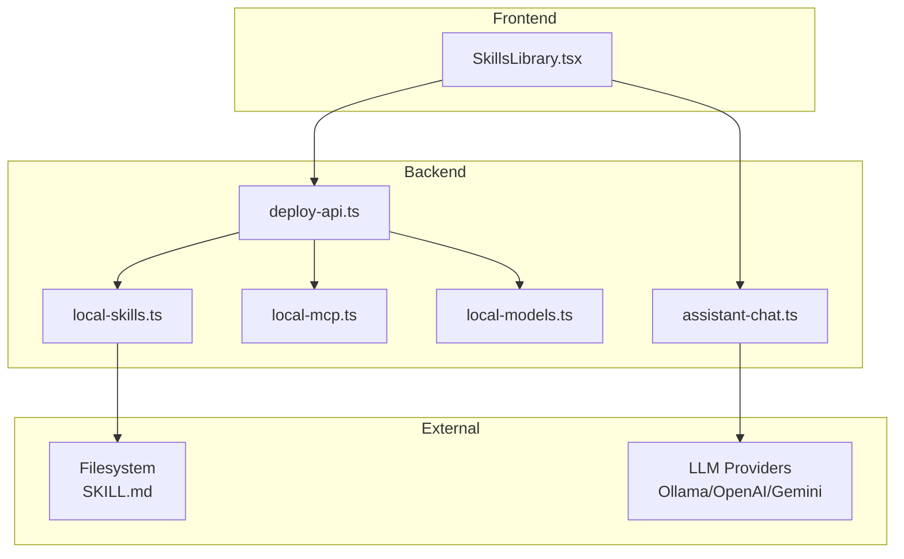
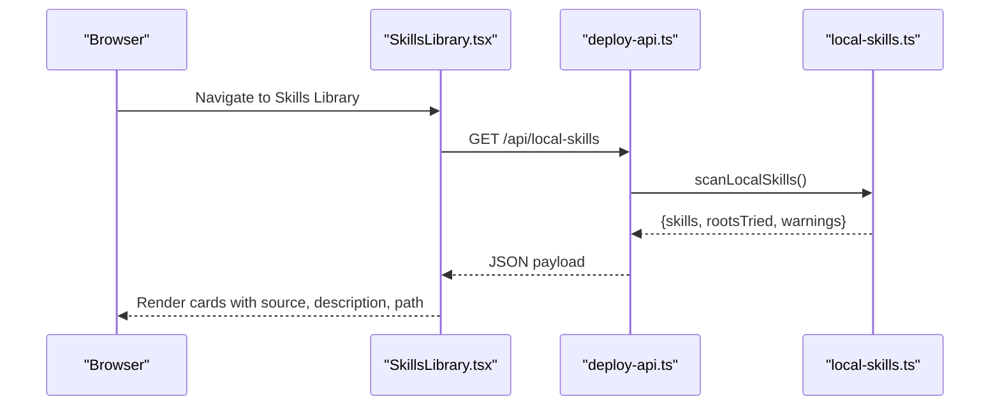
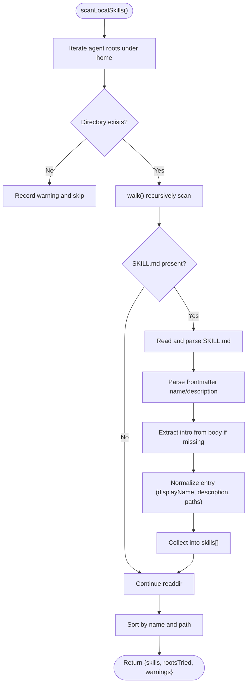
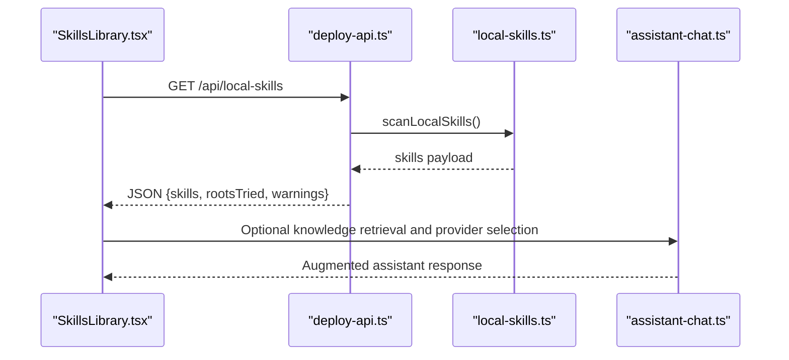
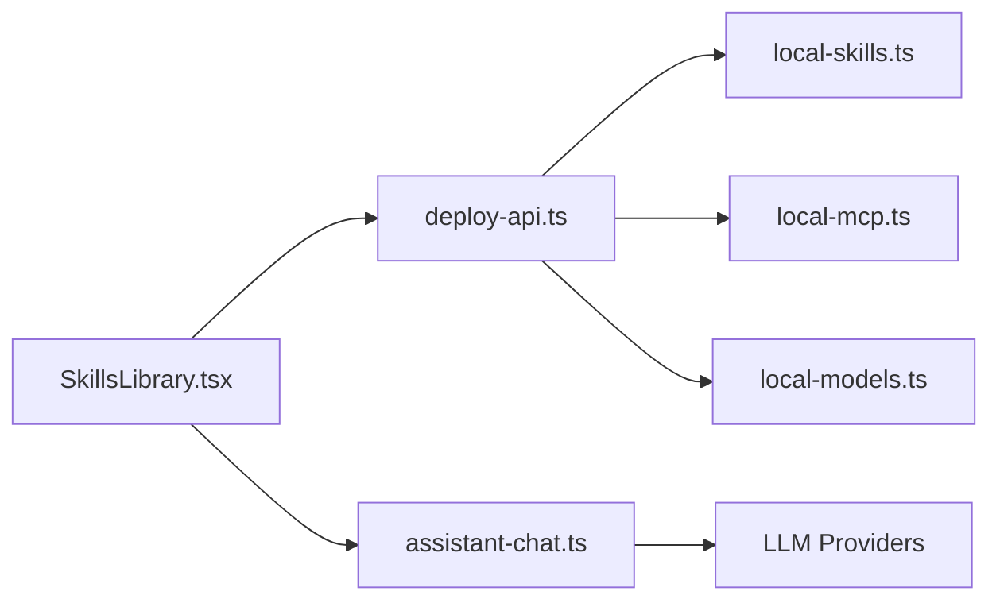

# Skill System Architecture

<cite>
**Referenced Files in This Document**
- [skill.md](file://skill.md)
- [local-skills.ts](file://server/local-skills.ts)
- [SkillsLibrary.tsx](file://src/pages/SkillsLibrary.tsx)
- [deploy-api.ts](file://server/deploy-api.ts)
- [assistant-chat.ts](file://server/assistant-chat.ts)
- [local-mcp.ts](file://server/local-mcp.ts)
- [local-models.ts](file://server/local-models.ts)
- [README.md](file://README.md)
- [metadata.json](file://metadata.json)
</cite>

## Table of Contents
1. [Introduction](#introduction)
2. [Project Structure](#project-structure)
3. [Core Components](#core-components)
4. [Architecture Overview](#architecture-overview)
5. [Detailed Component Analysis](#detailed-component-analysis)
6. [Dependency Analysis](#dependency-analysis)
7. [Performance Considerations](#performance-considerations)
8. [Troubleshooting Guide](#troubleshooting-guide)
9. [Conclusion](#conclusion)
10. [Appendices](#appendices)

## Introduction
This document explains the skill system architecture used to develop, discover, register, and invoke custom AI capabilities within the assistant system. It covers:
- The skill specification format using markdown files (SKILL.md) with metadata and structured guidance
- Discovery and scanning mechanisms across multiple agent ecosystems
- Registration and presentation in the Skills Library UI
- Runtime invocation patterns and integration with the assistant chat pipeline
- Examples of skill implementations, parameter handling, and response formatting
- Development framework, testing approaches, and best practices
- Isolation, security considerations, and performance implications

## Project Structure
The skill system spans backend scanning logic, frontend UI, and assistant integration:
- Backend scanning and API endpoints: server/local-skills.ts, server/deploy-api.ts
- Frontend library viewer: src/pages/SkillsLibrary.tsx
- Assistant integration: server/assistant-chat.ts
- Related integrations: server/local-mcp.ts, server/local-models.ts
- Example skill specification: skill.md
- Project metadata: metadata.json
- General project context: README.md

**Diagram sources**
- [SkillsLibrary.tsx:202-250](file://src/pages/SkillsLibrary.tsx#L202-L250)
- [deploy-api.ts:910-956](file://server/deploy-api.ts#L910-L956)
- [local-skills.ts:205-236](file://server/local-skills.ts#L205-L236)
- [assistant-chat.ts:160-202](file://server/assistant-chat.ts#L160-L202)
- [local-mcp.ts:71-105](file://server/local-mcp.ts#L71-L105)
- [local-models.ts:124-177](file://server/local-models.ts#L124-L177)

**Section sources**
- [README.md:1-91](file://README.md#L1-L91)
- [metadata.json:1-6](file://metadata.json#L1-L6)

## Core Components
- Skill specification format (SKILL.md):
  - Top-level YAML frontmatter supports name and description
  - Body contains structured guidance and rules
  - Example: [skill.md:1-89](file://skill.md#L1-L89)
- Local skill discovery:
  - Scans common agent skill directories under user home
  - Reads SKILL.md, parses frontmatter, extracts description from body if needed
  - Returns normalized entries for UI and API consumers
  - Implementation: [local-skills.ts:205-236](file://server/local-skills.ts#L205-L236)
- Skills Library UI:
  - Fetches local skills via /api/local-skills
  - Filters, sorts, and renders cards with source badges, descriptions, and copyable paths
  - Implementation: [SkillsLibrary.tsx:202-250](file://src/pages/SkillsLibrary.tsx#L202-L250)
- Assistant integration:
  - Knowledge retrieval augments system prompts
  - LLM providers are selected via assistant-chat.ts
  - Implementation: [assistant-chat.ts:160-202](file://server/assistant-chat.ts#L160-L202)
- Related integrations:
  - MCP scanning: [local-mcp.ts:71-105](file://server/local-mcp.ts#L71-L105)
  - Local models scanning: [local-models.ts:124-177](file://server/local-models.ts#L124-L177)

**Section sources**
- [skill.md:1-89](file://skill.md#L1-L89)
- [local-skills.ts:205-236](file://server/local-skills.ts#L205-L236)
- [SkillsLibrary.tsx:202-250](file://src/pages/SkillsLibrary.tsx#L202-L250)
- [assistant-chat.ts:160-202](file://server/assistant-chat.ts#L160-L202)
- [local-mcp.ts:71-105](file://server/local-mcp.ts#L71-L105)
- [local-models.ts:124-177](file://server/local-models.ts#L124-L177)

## Architecture Overview
The skill system follows a three-stage flow:
1. Discovery: scan filesystem for SKILL.md across agent-specific directories
2. Presentation: expose discovered skills via /api/local-skills and render in the Skills Library
3. Integration: use skills’ guidance and knowledge to inform assistant responses

**Diagram sources**
- [SkillsLibrary.tsx:216-250](file://src/pages/SkillsLibrary.tsx#L216-L250)
- [deploy-api.ts:910-924](file://server/deploy-api.ts#L910-L924)
- [local-skills.ts:205-236](file://server/local-skills.ts#L205-L236)

## Detailed Component Analysis

### Skill Specification Format (SKILL.md)
- Purpose: define a skill’s identity and guidance in a portable, human-readable format
- Metadata:
  - name: short identifier for display
  - description: brief summary; if absent, extracted from markdown body
  - Optional: license, author, etc.
- Guidance structure:
  - Mission, brand, style foundations, accessibility, writing tone, rules, expected behavior, workflow, output structure, component rule expectations, quality gates
- Example: [skill.md:1-89](file://skill.md#L1-L89)

Implementation highlights:
- Frontmatter parsing: [local-skills.ts:40-57](file://server/local-skills.ts#L40-L57)
- Body extraction for intro: [local-skills.ts:75-122](file://server/local-skills.ts#L75-L122)

**Section sources**
- [skill.md:1-89](file://skill.md#L1-L89)
- [local-skills.ts:40-57](file://server/local-skills.ts#L40-L57)
- [local-skills.ts:75-122](file://server/local-skills.ts#L75-L122)

### Discovery and Registration Mechanism
- Roots scanned per agent ecosystem:
  - Claude: ~/.claude/skills
  - Cursor: ~/.cursor/skills-cursor
  - Agents: ~/.agents/skills
  - Codex: ~/.codex/skills
- Walk depth limit and safe traversal:
  - Skips common directories (node_modules, .git, dist, etc.)
  - Validates absolute path containment to prevent escaping home
- Entry normalization:
  - displayName from frontmatter name or folder name
  - description from frontmatter or extracted from markdown body
  - skillMdPath and skillDir for later actions (copy path, etc.)
- Sorting and deduplication:
  - Sort by display name and path
- Warnings:
  - Logs missing roots and read errors

**Diagram sources**
- [local-skills.ts:205-236](file://server/local-skills.ts#L205-L236)
- [local-skills.ts:124-197](file://server/local-skills.ts#L124-L197)
- [local-skills.ts:40-57](file://server/local-skills.ts#L40-L57)
- [local-skills.ts:75-122](file://server/local-skills.ts#L75-L122)

**Section sources**
- [local-skills.ts:15-29](file://server/local-skills.ts#L15-L29)
- [local-skills.ts:124-197](file://server/local-skills.ts#L124-L197)
- [local-skills.ts:205-236](file://server/local-skills.ts#L205-L236)

### Skills Library UI and Runtime Invocation Patterns
- UI responsibilities:
  - Fetches /api/local-skills concurrently with MCP and models
  - Provides filtering by source, search terms, and pagination-like layout
  - Renders cards with source badges, collapsible descriptions, and copyable paths
- Runtime invocation patterns:
  - Skills are presented as guidance documents; the assistant consumes knowledge and applies skill-derived structure to responses
  - Knowledge retrieval augments system prompts; assistant selects provider (Ollama/OpenAI/Gemini)
- Integration points:
  - Skills discovery endpoint: [deploy-api.ts:910-924](file://server/deploy-api.ts#L910-L924)
  - Assistant chat pipeline: [assistant-chat.ts:160-202](file://server/assistant-chat.ts#L160-L202)

**Diagram sources**
- [SkillsLibrary.tsx:216-250](file://src/pages/SkillsLibrary.tsx#L216-L250)
- [deploy-api.ts:910-924](file://server/deploy-api.ts#L910-L924)
- [local-skills.ts:205-236](file://server/local-skills.ts#L205-L236)
- [assistant-chat.ts:160-202](file://server/assistant-chat.ts#L160-L202)

**Section sources**
- [SkillsLibrary.tsx:202-250](file://src/pages/SkillsLibrary.tsx#L202-L250)
- [deploy-api.ts:910-924](file://server/deploy-api.ts#L910-L924)
- [assistant-chat.ts:160-202](file://server/assistant-chat.ts#L160-L202)

### Skill Development Framework and Best Practices
- Skill creation:
  - Place SKILL.md in agent-specific directory under home
  - Include frontmatter name and description for reliable display
  - Use structured sections to guide consistent authoring
- Parameter handling:
  - Skills are static guidance documents; parameters are typically handled by the invoking assistant workflow
- Response formatting:
  - Use the documented output structure to produce consistent, reviewable guidance
- Testing approaches:
  - Verify SKILL.md readability and frontmatter correctness
  - Confirm discovery via /api/local-skills
  - Validate UI rendering and filtering behavior
- Reusability:
  - Keep guidance declarative and focused on rules and constraints
  - Provide examples and anti-patterns for clarity

**Section sources**
- [skill.md:1-89](file://skill.md#L1-L89)
- [local-skills.ts:40-57](file://server/local-skills.ts#L40-L57)
- [SkillsLibrary.tsx:202-250](file://src/pages/SkillsLibrary.tsx#L202-L250)

## Dependency Analysis
- Frontend depends on backend APIs for discovery and options
- Backend scanners encapsulate filesystem logic and return normalized data
- Assistant integration composes knowledge and provider selection independently of skills, but skills’ guidance informs the system prompt composition

**Diagram sources**
- [SkillsLibrary.tsx:202-250](file://src/pages/SkillsLibrary.tsx#L202-L250)
- [deploy-api.ts:910-956](file://server/deploy-api.ts#L910-L956)
- [local-skills.ts:205-236](file://server/local-skills.ts#L205-L236)
- [local-mcp.ts:71-105](file://server/local-mcp.ts#L71-L105)
- [local-models.ts:124-177](file://server/local-models.ts#L124-L177)
- [assistant-chat.ts:160-202](file://server/assistant-chat.ts#L160-L202)

**Section sources**
- [deploy-api.ts:910-956](file://server/deploy-api.ts#L910-L956)
- [SkillsLibrary.tsx:202-250](file://src/pages/SkillsLibrary.tsx#L202-L250)

## Performance Considerations
- Scanning depth and safety:
  - Depth capped at 14 to avoid deep traversal overhead
  - Symbolic links and non-directories are skipped
- IO and parsing:
  - Single read per SKILL.md; frontmatter and body extraction are linear in document size
- UI responsiveness:
  - Concurrent fetching of skills, MCP, and models reduces perceived latency
- Provider timeouts:
  - Assistant chat requests include abort controllers to bound wait times

**Section sources**
- [local-skills.ts:124-197](file://server/local-skills.ts#L124-L197)
- [SkillsLibrary.tsx:216-250](file://src/pages/SkillsLibrary.tsx#L216-L250)
- [assistant-chat.ts:52-72](file://server/assistant-chat.ts#L52-L72)

## Troubleshooting Guide
- Skills not appearing:
  - Verify SKILL.md placement under supported agent directories
  - Confirm /api/local-skills returns entries and check warnings for missing roots
- UI shows “unable to load data”:
  - Ensure deploy-api is running and Vite proxy targets port 8787
- MCP or models not detected:
  - Check JSON validity and presence of mcpServers
  - Validate Ollama availability and LM Studio model directories

**Section sources**
- [deploy-api.ts:910-956](file://server/deploy-api.ts#L910-L956)
- [SkillsLibrary.tsx:438-449](file://src/pages/SkillsLibrary.tsx#L438-L449)
- [local-mcp.ts:32-69](file://server/local-mcp.ts#L32-L69)
- [local-models.ts:137-154](file://server/local-models.ts#L137-L154)

## Conclusion
The skill system provides a standardized, portable format (SKILL.md) and robust discovery pipeline that integrates with the assistant workflow. By structuring skills with clear metadata and guidance, teams can share reusable capabilities across agents while maintaining consistent presentation and invocation patterns. The architecture emphasizes safety, performance, and developer ergonomics.

## Appendices

### API Definitions
- GET /api/local-skills
  - Purpose: Discover local skills across agent ecosystems
  - Response shape: { skills[], rootsTried[], warnings[] }
  - Reference: [deploy-api.ts:910-924](file://server/deploy-api.ts#L910-L924)
- GET /api/local-mcp
  - Purpose: List MCP servers from user and project configs
  - Response shape: { servers[], configsTried[], warnings[] }
  - Reference: [deploy-api.ts:926-940](file://server/deploy-api.ts#L926-L940)
- GET /api/local-models
  - Purpose: Enumerate local models from Ollama and LM Studio
  - Response shape: { models[], rootsTried[], warnings[] }
  - Reference: [deploy-api.ts:942-956](file://server/deploy-api.ts#L942-L956)
- GET /api/assistant/options
  - Purpose: Probe assistant configuration (providers, models, knowledge)
  - Reference: [deploy-api.ts:958-985](file://server/deploy-api.ts#L958-L985)

### Skill Specification Checklist
- Include top-level YAML frontmatter with name and description
- Provide structured guidance sections (mission, style foundations, rules, etc.)
- Use consistent output structure and examples
- Keep descriptions concise; rely on frontmatter for display

**Section sources**
- [skill.md:1-89](file://skill.md#L1-L89)
- [local-skills.ts:40-57](file://server/local-skills.ts#L40-L57)