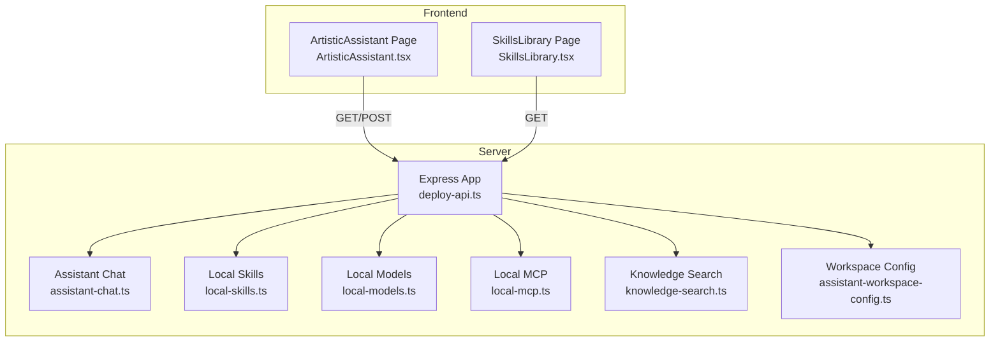
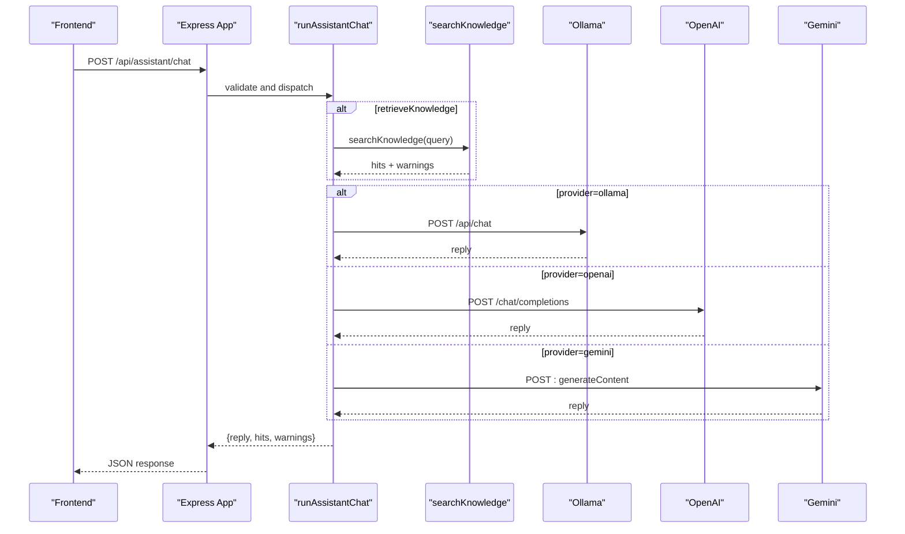
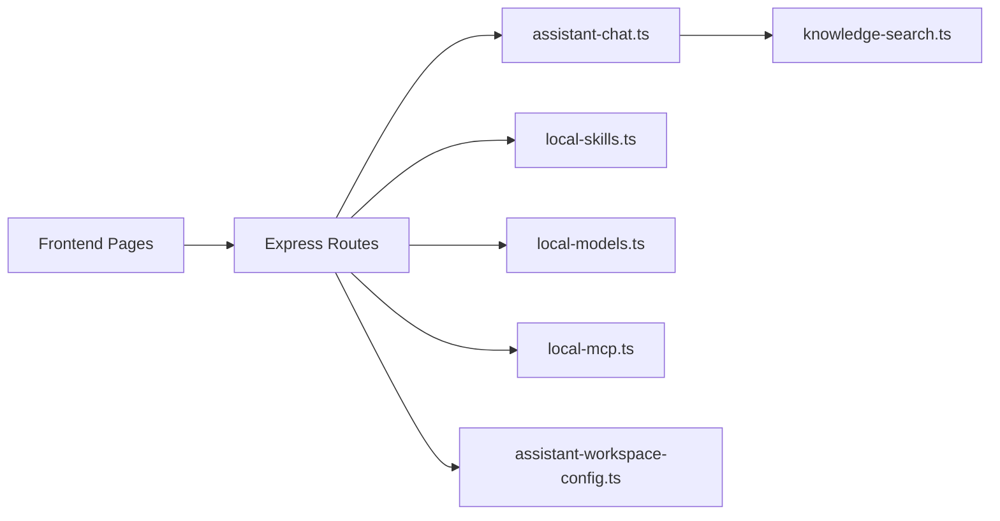
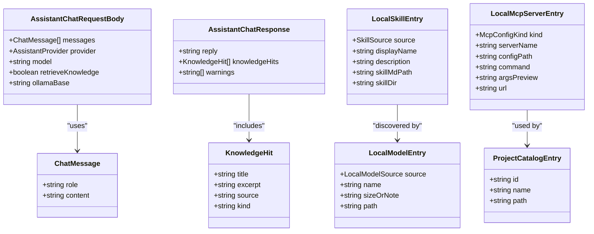

# AI Assistant API

<cite>
**Referenced Files in This Document**
- [assistant-chat.ts](file://server/assistant-chat.ts)
- [local-skills.ts](file://server/local-skills.ts)
- [local-models.ts](file://server/local-models.ts)
- [local-mcp.ts](file://server/local-mcp.ts)
- [knowledge-search.ts](file://server/knowledge-search.ts)
- [assistant-workspace-config.ts](file://server/assistant-workspace-config.ts)
- [deploy-api.ts](file://server/deploy-api.ts)
- [ArtisticAssistant.tsx](file://src/pages/ArtisticAssistant.tsx)
- [SkillsLibrary.tsx](file://src/pages/SkillsLibrary.tsx)
- [skill.md](file://skill.md)
- [package.json](file://package.json)
</cite>

## Table of Contents
1. [Introduction](#introduction)
2. [Project Structure](#project-structure)
3. [Core Components](#core-components)
4. [Architecture Overview](#architecture-overview)
5. [Detailed Component Analysis](#detailed-component-analysis)
6. [Dependency Analysis](#dependency-analysis)
7. [Performance Considerations](#performance-considerations)
8. [Troubleshooting Guide](#troubleshooting-guide)
9. [Conclusion](#conclusion)
10. [Appendices](#appendices)

## Introduction
This document provides comprehensive API documentation for the AI assistant endpoints. It covers:
- Chat interface: POST /api/assistant/chat for conversational AI interactions
- Skill discovery: GET /api/local-skills for skill discovery
- Skill registration: POST /api/local-skills/register for skill registration
- Model management: GET /api/local-models for model listing, POST /api/local-models for model configuration, and /api/local-mcp for MCP server management
- Assistant workspace configuration: environment variable management and project catalog operations
It includes request/response schemas, examples, authentication requirements, provider configuration, error handling, and integration patterns for extending the assistant with custom skills and connecting external AI services.

## Project Structure
The AI assistant functionality is implemented in the server module and surfaced via Express routes. Frontend pages consume these endpoints to provide interactive experiences.

**Diagram sources**
- [deploy-api.ts:75-1735](file://server/deploy-api.ts#L75-L1735)
- [assistant-chat.ts:1-214](file://server/assistant-chat.ts#L1-L214)
- [local-skills.ts:1-237](file://server/local-skills.ts#L1-L237)
- [local-models.ts:1-178](file://server/local-models.ts#L1-L178)
- [local-mcp.ts:1-106](file://server/local-mcp.ts#L1-L106)
- [knowledge-search.ts:1-333](file://server/knowledge-search.ts#L1-L333)
- [assistant-workspace-config.ts:1-202](file://server/assistant-workspace-config.ts#L1-L202)
- [ArtisticAssistant.tsx:1-349](file://src/pages/ArtisticAssistant.tsx#L1-L349)
- [SkillsLibrary.tsx:1-599](file://src/pages/SkillsLibrary.tsx#L1-L599)

**Section sources**
- [deploy-api.ts:75-1735](file://server/deploy-api.ts#L75-L1735)
- [ArtisticAssistant.tsx:1-349](file://src/pages/ArtisticAssistant.tsx#L1-L349)
- [SkillsLibrary.tsx:1-599](file://src/pages/SkillsLibrary.tsx#L1-L599)

## Core Components
- Assistant chat engine: orchestrates provider-specific calls, optional knowledge retrieval, and response assembly
- Local skills scanner: discovers skills from common agent directories and parses SKILL.md metadata
- Local models scanner: enumerates Ollama and LM Studio models
- MCP scanner: reads Cursor MCP configuration files
- Knowledge search: local file scanning and HTTP bridges for wiki search
- Workspace configuration: environment file management and project catalog persistence

**Section sources**
- [assistant-chat.ts:1-214](file://server/assistant-chat.ts#L1-L214)
- [local-skills.ts:1-237](file://server/local-skills.ts#L1-L237)
- [local-models.ts:1-178](file://server/local-models.ts#L1-L178)
- [local-mcp.ts:1-106](file://server/local-mcp.ts#L1-L106)
- [knowledge-search.ts:1-333](file://server/knowledge-search.ts#L1-L333)
- [assistant-workspace-config.ts:1-202](file://server/assistant-workspace-config.ts#L1-L202)

## Architecture Overview
The assistant endpoints are mounted on the Express app and route to dedicated modules. The chat endpoint optionally injects knowledge retrieved from local and wiki sources into the model prompt.

**Diagram sources**
- [deploy-api.ts:1108-1163](file://server/deploy-api.ts#L1108-L1163)
- [assistant-chat.ts:160-202](file://server/assistant-chat.ts#L160-L202)
- [knowledge-search.ts:260-332](file://server/knowledge-search.ts#L260-L332)

**Section sources**
- [deploy-api.ts:1108-1163](file://server/deploy-api.ts#L1108-L1163)
- [assistant-chat.ts:160-202](file://server/assistant-chat.ts#L160-L202)
- [knowledge-search.ts:260-332](file://server/knowledge-search.ts#L260-L332)

## Detailed Component Analysis

### Chat Interface: POST /api/assistant/chat
- Purpose: Send a conversation history to a selected provider (Ollama, OpenAI, or Gemini) with optional knowledge injection.
- Request body schema:
  - messages: array of chat messages with role and content
  - provider: 'ollama' | 'openai' | 'gemini'
  - model: string (provider-specific model name)
  - retrieveKnowledge: boolean (optional)
  - ollamaBase: string (optional, overrides default Ollama host)
- Response schema:
  - reply: string
  - knowledgeHits: array of knowledge fragments
  - warnings: array of strings
- Authentication:
  - OPENAI_API_KEY required for OpenAI
  - GEMINI_API_KEY required for Gemini
  - Ollama host configurable via ollamaBase or environment
- Error handling:
  - Returns 400 for invalid messages or length limits
  - Returns 503 if provider API keys are missing
  - Returns 502 for provider errors

Example request (paths only):
- [POST /api/assistant/chat:1108-1163](file://server/deploy-api.ts#L1108-L1163)
- [runAssistantChat:160-202](file://server/assistant-chat.ts#L160-L202)

Example response (paths only):
- [AssistantChatResponse:21-25](file://server/assistant-chat.ts#L21-L25)

Frontend usage (paths only):
- [ArtisticAssistant.tsx send:115-174](file://src/pages/ArtisticAssistant.tsx#L115-L174)

**Section sources**
- [deploy-api.ts:1108-1163](file://server/deploy-api.ts#L1108-L1163)
- [assistant-chat.ts:13-25](file://server/assistant-chat.ts#L13-L25)
- [ArtisticAssistant.tsx:115-174](file://src/pages/ArtisticAssistant.tsx#L115-L174)

### Knowledge Retrieval: POST /api/knowledge/search
- Purpose: Perform a knowledge search without invoking the assistant model.
- Request body schema:
  - query: string
- Response schema:
  - hits: array of knowledge fragments
  - warnings: array of strings
- Notes:
  - Searches local directories and configured wiki HTTP bridges
  - Uses environment variables for configuration

Example request (paths only):
- [POST /api/knowledge/search:1092-1106](file://server/deploy-api.ts#L1092-L1106)
- [searchKnowledge:260-332](file://server/knowledge-search.ts#L260-L332)

Frontend usage (paths only):
- [ArtisticAssistant.tsx previewKnowledge:176-199](file://src/pages/ArtisticAssistant.tsx#L176-L199)

**Section sources**
- [deploy-api.ts:1092-1106](file://server/deploy-api.ts#L1092-L1106)
- [knowledge-search.ts:260-332](file://server/knowledge-search.ts#L260-L332)
- [ArtisticAssistant.tsx:176-199](file://src/pages/ArtisticAssistant.tsx#L176-L199)

### Local Skills Discovery: GET /api/local-skills
- Purpose: Enumerate discoverable skills from common agent directories and parse SKILL.md metadata.
- Response schema:
  - skills: array of LocalSkillEntry
  - rootsTried: array of attempted root paths
  - warnings: array of strings
- Notes:
  - Scans ~/.claude/skills, ~/.cursor/skills-cursor, ~/.agents/skills, ~/.codex/skills
  - Parses YAML frontmatter and extracts description from markdown if absent

Example response (paths only):
- [scanLocalSkills:205-236](file://server/local-skills.ts#L205-L236)

Frontend usage (paths only):
- [SkillsLibrary.tsx load:216-250](file://src/pages/SkillsLibrary.tsx#L216-L250)

**Section sources**
- [deploy-api.ts:910-924](file://server/deploy-api.ts#L910-L924)
- [local-skills.ts:199-236](file://server/local-skills.ts#L199-L236)
- [SkillsLibrary.tsx:216-250](file://src/pages/SkillsLibrary.tsx#L216-L250)

### Local Skills Registration: POST /api/local-skills/register
- Purpose: Register a skill by pointing to a SKILL.md file.
- Request body schema:
  - skillMdPath: string (absolute or relative path to SKILL.md)
- Response schema:
  - ok: boolean
  - path: string (resolved path)
  - warnings: array of strings
- Notes:
  - Validates SKILL.md presence and parses frontmatter
  - Integrates with the assistant’s skill discovery pipeline

Implementation note:
- The endpoint is declared in the server but the handler is not implemented in the provided code. The frontend references a registration action in the skills library page.

Frontend usage (paths only):
- [SkillsLibrary.tsx:1-599](file://src/pages/SkillsLibrary.tsx#L1-L599)

**Section sources**
- [SkillsLibrary.tsx:1-599](file://src/pages/SkillsLibrary.tsx#L1-L599)

### Local Models Management: GET /api/local-models and POST /api/local-models
- GET /api/local-models
  - Purpose: List detected local models (Ollama and LM Studio).
  - Response schema:
    - models: array of LocalModelEntry
    - rootsTried: array of attempted roots
    - warnings: array of strings
- POST /api/local-models
  - Purpose: Configure model parameters for assistant usage.
  - Request body schema:
    - model: string (selected model name)
  - Response schema:
    - ok: boolean
    - model: string
    - warnings: array of strings
- Notes:
  - Scans Ollama CLI output and LM Studio model directories
  - Supports model selection for Ollama

Example response (paths only):
- [scanLocalModels:124-177](file://server/local-models.ts#L124-L177)

Frontend usage (paths only):
- [SkillsLibrary.tsx:216-250](file://src/pages/SkillsLibrary.tsx#L216-L250)

**Section sources**
- [deploy-api.ts:942-956](file://server/deploy-api.ts#L942-L956)
- [local-models.ts:15-177](file://server/local-models.ts#L15-L177)
- [SkillsLibrary.tsx:216-250](file://src/pages/SkillsLibrary.tsx#L216-L250)

### MCP Server Management: GET /api/local-mcp
- Purpose: Discover MCP servers from Cursor configuration files.
- Response schema:
  - servers: array of LocalMcpServerEntry
  - configsTried: array of attempted config paths
  - warnings: array of strings
- Notes:
  - Reads ~/.cursor/mcp.json and repository .cursor/mcp.json
  - Parses mcpServers object

Example response (paths only):
- [scanLocalMcp:71-105](file://server/local-mcp.ts#L71-L105)

Frontend usage (paths only):
- [SkillsLibrary.tsx:216-250](file://src/pages/SkillsLibrary.tsx#L216-L250)

**Section sources**
- [deploy-api.ts:926-940](file://server/deploy-api.ts#L926-L940)
- [local-mcp.ts:17-105](file://server/local-mcp.ts#L17-L105)
- [SkillsLibrary.tsx:216-250](file://src/pages/SkillsLibrary.tsx#L216-L250)

### Assistant Options: GET /api/assistant/options
- Purpose: Probe assistant configuration (providers, models, knowledge sources).
- Response schema:
  - geminiConfigured: boolean
  - geminiModel: string
  - openaiConfigured: boolean
  - openaiModel: string
  - ollamaHost: string
  - ollamaModels: array of model names
  - knowledge: object with localConfigured, wikiConfigured, remoteSearchUrlCount, confluenceConfigured

Frontend usage (paths only):
- [ArtisticAssistant.tsx:70-95](file://src/pages/ArtisticAssistant.tsx#L70-L95)

**Section sources**
- [deploy-api.ts:958-985](file://server/deploy-api.ts#L958-L985)
- [ArtisticAssistant.tsx:70-95](file://src/pages/ArtisticAssistant.tsx#L70-L95)

### Project Catalog Operations: GET/PUT /api/assistant/project-catalog
- GET /api/assistant/project-catalog
  - Response schema:
    - path: string (catalog file path)
    - entries: array of ProjectCatalogEntry
- PUT /api/assistant/project-catalog
  - Request body schema:
    - entries: array of ProjectCatalogEntry
  - Response schema:
    - ok: boolean
    - path: string
    - entries: array of cleaned entries

Frontend usage (paths only):
- [ArtisticAssistant.tsx:1-349](file://src/pages/ArtisticAssistant.tsx#L1-L349)

**Section sources**
- [deploy-api.ts:987-1021](file://server/deploy-api.ts#L987-L1021)
- [assistant-workspace-config.ts:33-77](file://server/assistant-workspace-config.ts#L33-L77)
- [ArtisticAssistant.tsx:1-349](file://src/pages/ArtisticAssistant.tsx#L1-L349)

### Environment Variable Management: GET/POST /api/assistant/env-ui
- GET /api/assistant/env-ui
  - Response schema:
    - dotenvReadPath: string
    - dotenvWritePath: string
    - fileExists: boolean
    - fields: object keyed by UI-managed env keys with kind and value
- POST /api/assistant/env-ui
  - Request body schema:
    - patch: object (key-value pairs to update)
    - removeKeys: array of keys to delete
  - Response schema:
    - ok: boolean
    - dotenvWritePath: string
    - hint: string (note about restart requirement)

Supported keys (subset):
- JENKINS_USER, JENKINS_TOKEN
- JIRA_SERVER_URL, JIRA_USERNAME, JIRA_PASSWORD, JIRA_API_TOKEN, JIRA_REST_PATH_PREFIX
- CONFLUENCE_BASE_URL, CONFLUENCE_USERNAME, CONFLUENCE_API_TOKEN, CONFLUENCE_PASSWORD
- ASSISTANT_KB_LOCAL_DIRS, ASSISTANT_KB_SEARCH_URLS, ASSISTANT_WIKI_SEARCH_URL_TEMPLATE

Frontend usage (paths only):
- [ArtisticAssistant.tsx:1-349](file://src/pages/ArtisticAssistant.tsx#L1-L349)

**Section sources**
- [deploy-api.ts:1023-1090](file://server/deploy-api.ts#L1023-L1090)
- [assistant-workspace-config.ts:79-187](file://server/assistant-workspace-config.ts#L79-L187)
- [ArtisticAssistant.tsx:1-349](file://src/pages/ArtisticAssistant.tsx#L1-L349)

## Dependency Analysis
- Provider integrations:
  - OpenAI: requires OPENAI_API_KEY and optional OPENAI_MODEL and OPENAI_BASE_URL
  - Gemini: requires GEMINI_API_KEY and uses model name from environment
  - Ollama: uses local host or configurable base URL
- Knowledge search depends on:
  - ASSISTANT_KB_LOCAL_DIRS for local file scanning
  - ASSISTANT_KB_SEARCH_URLS or ASSISTANT_WIKI_SEARCH_URL_TEMPLATE for HTTP bridges
  - CONFLUENCE_BASE_URL for Confluence CQL search
- Frontend pages depend on:
  - ArtisticAssistant.tsx for chat UX and knowledge preview
  - SkillsLibrary.tsx for skills, models, and MCP discovery

**Diagram sources**
- [deploy-api.ts:75-1735](file://server/deploy-api.ts#L75-L1735)
- [assistant-chat.ts:1-214](file://server/assistant-chat.ts#L1-L214)
- [knowledge-search.ts:1-333](file://server/knowledge-search.ts#L1-L333)
- [local-skills.ts:1-237](file://server/local-skills.ts#L1-L237)
- [local-models.ts:1-178](file://server/local-models.ts#L1-L178)
- [local-mcp.ts:1-106](file://server/local-mcp.ts#L1-L106)
- [assistant-workspace-config.ts:1-202](file://server/assistant-workspace-config.ts#L1-L202)

**Section sources**
- [deploy-api.ts:75-1735](file://server/deploy-api.ts#L75-L1735)
- [assistant-chat.ts:1-214](file://server/assistant-chat.ts#L1-L214)
- [knowledge-search.ts:1-333](file://server/knowledge-search.ts#L1-L333)
- [local-skills.ts:1-237](file://server/local-skills.ts#L1-L237)
- [local-models.ts:1-178](file://server/local-models.ts#L1-L178)
- [local-mcp.ts:1-106](file://server/local-mcp.ts#L1-L106)
- [assistant-workspace-config.ts:1-202](file://server/assistant-workspace-config.ts#L1-L202)

## Performance Considerations
- Chat request validation prevents oversized payloads and excessive message counts.
- Knowledge search caps file scans and hit counts to limit overhead.
- Providers enforce timeouts to avoid hanging requests.
- Frontend debounces and disables controls during long-running operations.

[No sources needed since this section provides general guidance]

## Troubleshooting Guide
Common issues and resolutions:
- Missing provider keys:
  - OpenAI: configure OPENAI_API_KEY; otherwise endpoint returns 503
  - Gemini: configure GEMINI_API_KEY; otherwise endpoint returns 503
- Ollama connectivity:
  - Ensure Ollama is running or set ollamaBase to the correct host
- Knowledge search:
  - Verify ASSISTANT_KB_LOCAL_DIRS, ASSISTANT_KB_SEARCH_URLS, or CONFLUENCE_BASE_URL
- Environment variables:
  - Use /api/assistant/env-ui to manage .env keys; remember to restart the service for changes to take effect
- Frontend not loading data:
  - Confirm deploy-api is running and Vite proxy is aligned to port 8787

**Section sources**
- [deploy-api.ts:1126-1162](file://server/deploy-api.ts#L1126-L1162)
- [assistant-workspace-config.ts:1-202](file://server/assistant-workspace-config.ts#L1-L202)
- [SkillsLibrary.tsx:438-448](file://src/pages/SkillsLibrary.tsx#L438-L448)

## Conclusion
The AI assistant API provides a cohesive set of endpoints for chatting with local and cloud providers, discovering and registering skills, managing local models and MCP servers, and configuring workspace environments. The system emphasizes configurable providers, optional knowledge injection, and robust error handling. Extending the assistant involves adding skills with SKILL.md and integrating external knowledge sources via HTTP bridges or environment variables.

[No sources needed since this section summarizes without analyzing specific files]

## Appendices

### API Definitions

- POST /api/assistant/chat
  - Request: [AssistantChatRequestBody:13-19](file://server/assistant-chat.ts#L13-L19)
  - Response: [AssistantChatResponse:21-25](file://server/assistant-chat.ts#L21-L25)
  - Status Codes: 200, 400, 503, 502

- POST /api/knowledge/search
  - Request: { query: string }
  - Response: [KnowledgeSearchResult:24-27](file://server/knowledge-search.ts#L24-L27)
  - Status Codes: 200, 400, 500

- GET /api/local-skills
  - Response: [ScanLocalSkillsResult:199-203](file://server/local-skills.ts#L199-L203)
  - Status Codes: 200, 500

- GET /api/local-models
  - Response: [ScanLocalModelsResult:15-19](file://server/local-models.ts#L15-L19)
  - Status Codes: 200, 500

- GET /api/local-mcp
  - Response: [ScanLocalMcpResult:17-21](file://server/local-mcp.ts#L17-L21)
  - Status Codes: 200, 500

- GET /api/assistant/options
  - Response: { geminiConfigured, geminiModel, openaiConfigured, openaiModel, ollamaHost, ollamaModels, knowledge }
  - Status Codes: 200, 500

- GET/PUT /api/assistant/project-catalog
  - GET: { path, entries }
  - PUT: { ok, path, entries }
  - Status Codes: 200, 500

- GET/POST /api/assistant/env-ui
  - GET: { dotenvReadPath, dotenvWritePath, fileExists, fields }
  - POST: { ok, dotenvWritePath, hint }
  - Status Codes: 200, 400, 500

### Data Models

**Diagram sources**
- [assistant-chat.ts:6-25](file://server/assistant-chat.ts#L6-L25)
- [knowledge-search.ts:17-27](file://server/knowledge-search.ts#L17-L27)
- [local-skills.ts:7-13](file://server/local-skills.ts#L7-L13)
- [local-models.ts:8-13](file://server/local-models.ts#L8-L13)
- [local-mcp.ts:8-15](file://server/local-mcp.ts#L8-L15)
- [assistant-workspace-config.ts:33-44](file://server/assistant-workspace-config.ts#L33-L44)

### Usage Patterns and Examples

- Skill invocation
  - Discover skills via GET /api/local-skills
  - Reference SKILL.md metadata for description and path
  - Example skill metadata: [skill.md:1-89](file://skill.md#L1-L89)

- Model selection
  - Use GET /api/assistant/options to detect configured providers and models
  - Choose model name for POST /api/assistant/chat

- Knowledge retrieval
  - Enable retrieveKnowledge in chat request to inject knowledgeHits
  - Preview results via POST /api/knowledge/search

- Environment configuration
  - Manage keys via GET/POST /api/assistant/env-ui
  - Supported keys include JIRA, Confluence, and knowledge base settings

- Integration examples
  - Extend skills by placing SKILL.md under recognized directories
  - Connect external knowledge via ASSISTANT_KB_SEARCH_URLS or ASSISTANT_WIKI_SEARCH_URL_TEMPLATE

**Section sources**
- [SkillsLibrary.tsx:216-250](file://src/pages/SkillsLibrary.tsx#L216-L250)
- [ArtisticAssistant.tsx:70-95](file://src/pages/ArtisticAssistant.tsx#L70-L95)
- [assistant-workspace-config.ts:79-187](file://server/assistant-workspace-config.ts#L79-L187)
- [skill.md:1-89](file://skill.md#L1-L89)