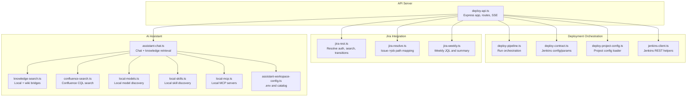
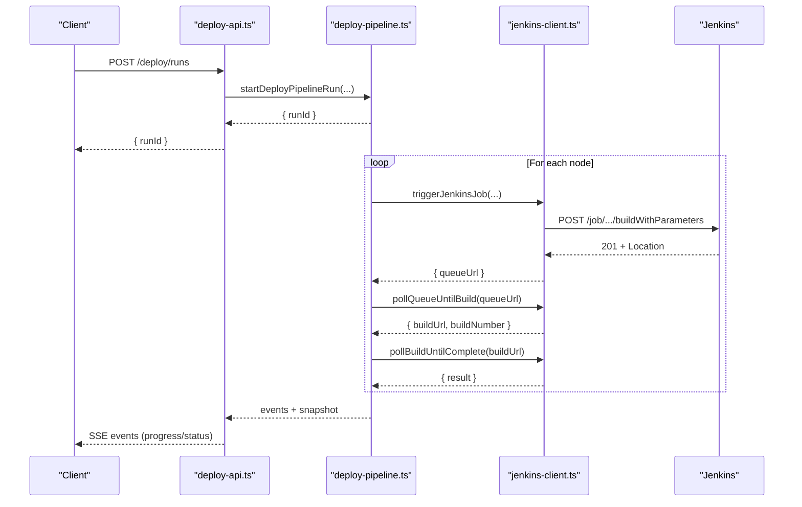
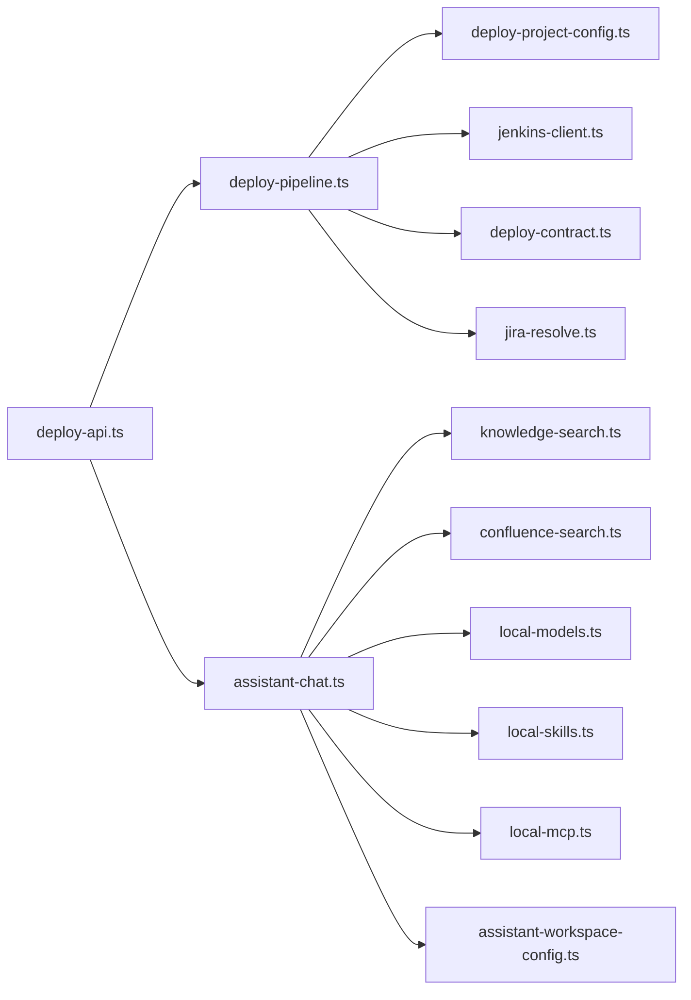

# API Reference

<cite>
**Referenced Files in This Document**
- [deploy-api.ts](file://server/deploy-api.ts)
- [deploy-contract.ts](file://server/deploy-contract.ts)
- [deploy-project-config.ts](file://server/deploy-project-config.ts)
- [deploy-pipeline.ts](file://server/deploy-pipeline.ts)
- [jenkins-client.ts](file://server/jenkins-client.ts)
- [jira-rest.ts](file://server/jira-rest.ts)
- [jira-resolve.ts](file://server/jira-resolve.ts)
- [jira-weekly.ts](file://server/jira-weekly.ts)
- [assistant-chat.ts](file://server/assistant-chat.ts)
- [assistant-workspace-config.ts](file://server/assistant-workspace-config.ts)
- [knowledge-search.ts](file://server/knowledge-search.ts)
- [confluence-search.ts](file://server/confluence-search.ts)
- [local-skills.ts](file://server/local-skills.ts)
- [local-models.ts](file://server/local-models.ts)
- [local-mcp.ts](file://server/local-mcp.ts)
- [deploy-projects.json](file://config/deploy-projects.json)
</cite>

## Table of Contents
1. [Introduction](#introduction)
2. [Project Structure](#project-structure)
3. [Core Components](#core-components)
4. [Architecture Overview](#architecture-overview)
5. [Detailed Component Analysis](#detailed-component-analysis)
6. [Dependency Analysis](#dependency-analysis)
7. [Performance Considerations](#performance-considerations)
8. [Troubleshooting Guide](#troubleshooting-guide)
9. [Conclusion](#conclusion)
10. [Appendices](#appendices)

## Introduction
This document describes the RESTful API surface exposed by the deployment and AI assistant subsystems. It covers:
- Deployment API endpoints for triggering and observing Jenkins jobs, resolving Jira-to-Jenkins mappings, and managing pipeline runs.
- Jira integration endpoints for searching issues, transitioning workflows, and generating weekly summaries.
- AI assistant endpoints for chat, knowledge retrieval, and model/skill discovery.
- Configuration endpoints for environment variables and project catalogs.
- Authentication, rate limiting, security, versioning, and backward compatibility policies.
- Client implementation guidelines and integration examples.
- Monitoring, logging, and debugging techniques.

## Project Structure
The API server is implemented as a Node.js Express service that orchestrates Jenkins triggers, interacts with Jira and Confluence, and exposes endpoints for deployment orchestration and AI assistance. Supporting modules handle contract validation, project configuration, knowledge search, and local model/skill discovery.

**Diagram sources**
- [deploy-api.ts:75-80](file://server/deploy-api.ts#L75-L80)
- [deploy-pipeline.ts:1-40](file://server/deploy-pipeline.ts#L1-L40)
- [deploy-contract.ts:1-40](file://server/deploy-contract.ts#L1-L40)
- [deploy-project-config.ts:1-40](file://server/deploy-project-config.ts#L1-L40)
- [jenkins-client.ts:1-40](file://server/jenkins-client.ts#L1-L40)
- [jira-rest.ts:1-40](file://server/jira-rest.ts#L1-L40)
- [jira-resolve.ts:1-40](file://server/jira-resolve.ts#L1-L40)
- [jira-weekly.ts:1-40](file://server/jira-weekly.ts#L1-L40)
- [assistant-chat.ts:1-40](file://server/assistant-chat.ts#L1-L40)
- [knowledge-search.ts:1-40](file://server/knowledge-search.ts#L1-L40)
- [confluence-search.ts:1-40](file://server/confluence-search.ts#L1-L40)
- [local-models.ts:1-40](file://server/local-models.ts#L1-L40)
- [local-skills.ts:1-40](file://server/local-skills.ts#L1-L40)
- [local-mcp.ts:1-40](file://server/local-mcp.ts#L1-L40)
- [assistant-workspace-config.ts:1-40](file://server/assistant-workspace-config.ts#L1-L40)

**Section sources**
- [deploy-api.ts:75-80](file://server/deploy-api.ts#L75-L80)

## Core Components
- Deployment orchestration: Pipeline creation, Jenkins job triggering, polling, and status reporting.
- Jira integration: Authentication resolution, search, workflow transitions, and weekly summaries.
- AI assistant: Chat with provider selection, knowledge retrieval, and local model/skill discovery.
- Configuration: Environment variable management and project catalog persistence.

**Section sources**
- [deploy-pipeline.ts:182-223](file://server/deploy-pipeline.ts#L182-L223)
- [jira-rest.ts:34-85](file://server/jira-rest.ts#L34-L85)
- [assistant-chat.ts:160-202](file://server/assistant-chat.ts#L160-L202)
- [assistant-workspace-config.ts:114-187](file://server/assistant-workspace-config.ts#L114-L187)

## Architecture Overview
The API server exposes REST endpoints backed by internal modules. Requests are validated, transformed, and executed against external systems (Jenkins, Jira, Confluence). Responses are returned as JSON; long-running operations stream progress via Server-Sent Events (SSE) endpoints.

**Diagram sources**
- [deploy-api.ts:75-80](file://server/deploy-api.ts#L75-L80)
- [deploy-pipeline.ts:186-418](file://server/deploy-pipeline.ts#L186-L418)
- [jenkins-client.ts:89-190](file://server/jenkins-client.ts#L89-L190)

## Detailed Component Analysis

### Deployment API Endpoints
These endpoints manage deployment runs and expose progress via SSE.

- Base URL: http://localhost:DEPLOY_API_PORT (default 8787)
- Content-Type: application/json unless otherwise noted

Endpoints:
- POST /deploy/runs
  - Purpose: Start a deployment pipeline run across one or more projects.
  - Request body:
    - projectIds: array of project identifiers
    - jiraId?: string (optional)
    - branch?: string (optional)
  - Response:
    - { ok: true, runId: string } or { ok: false, error: string, status: number }
  - Notes:
    - Validates projectIds presence.
    - Uses project configuration to resolve Jenkins job paths and parameters.
    - Emits SSE events for logs and node snapshots.

- GET /deploy/runs/:runId
  - Purpose: Retrieve a snapshot of a run’s current state and recent events.
  - Path parameters:
    - runId: string
  - Response:
    - { id, status, taskKey, jiraId?, branch?, nodes, events, eventCount, activeNodeId, createdAt }

- GET /deploy/projects
  - Purpose: List available deploy projects and default branches.
  - Response:
    - Array of { id, label, defaultBranch }

- GET /deploy/resolve-job-path
  - Purpose: Resolve a Jira issue to suggested Jenkins job path segments.
  - Query parameters:
    - issueKey: string
    - componentMapJson?: string (JSON-encoded map)
    - fallbackNodesCsv?: string
  - Response:
    - { nodes: string[], source: 'jira' | 'fallback', components?, message? }

- GET /jira/weekly-summary
  - Purpose: Generate a weekly summary markdown for issues touched in a given week.
  - Query parameters:
    - weekOffset?: number (default 0)
    - now?: string (ISO date)
  - Response:
    - { markdown: string }

- POST /jira/submit-test-transition
  - Purpose: Transition a Jira issue to a “ready for QA” state.
  - Request body:
    - issueKey: string
  - Response:
    - { ok: true, transitionId: string, transitionName?: string } or { ok: false, error: string, availableTransitions? }

- GET /jenkins/job-status
  - Purpose: Poll a Jenkins build URL until completion.
  - Query parameters:
    - buildUrl: string
    - timeoutMs?: number
    - intervalMs?: number
  - Response:
    - { building: boolean, result: string|null, duration: number, error?: string }

- GET /assistant/models
  - Purpose: List available Ollama models discovered locally.
  - Response:
    - Array of { name: string }

- GET /assistant/skills
  - Purpose: Enumerate local skills from supported editors.
  - Response:
    - { skills: LocalSkillEntry[], rootsTried, warnings }

- GET /assistant/mcp-servers
  - Purpose: Discover local MCP servers from Cursor configurations.
  - Response:
    - { servers, configsTried, warnings }

- POST /assistant/chat
  - Purpose: Chat with the assistant using selected provider and optional knowledge retrieval.
  - Request body:
    - messages: array of { role: 'user'|'assistant'|'system', content: string }
    - provider: 'ollama'|'gemini'|'openai'
    - model: string
    - retrieveKnowledge?: boolean
    - ollamaBase?: string (optional override)
  - Response:
    - { reply: string, knowledgeHits: KnowledgeHit[], warnings: string[] }

- GET /assistant/kb-bridges
  - Purpose: Count configured knowledge bridge endpoints.
  - Response:
    - { count: number }

- GET /assistant/env-ui-keys
  - Purpose: Get keys suitable for UI exposure (masked secrets).
  - Response:
    - Array of environment variable names

- PUT /assistant/env
  - Purpose: Merge updates and deletions into .env file.
  - Request body:
    - updates: Record<string,string>
    - removeKeys: string[]
  - Response:
    - { ok: true, savedPath: string } or error

- GET /assistant/project-catalog
  - Purpose: Load project catalog entries.
  - Response:
    - { entries: ProjectCatalogEntry[] }

- POST /assistant/project-catalog
  - Purpose: Save project catalog entries.
  - Request body:
    - entries: ProjectCatalogEntry[]
  - Response:
    - { ok: true }

- GET /health
  - Purpose: Health check endpoint.
  - Response:
    - { status: 'OK' }

Authentication:
- No authentication enforced by the API server itself.
- Jenkins and Jira integrations rely on environment variables configured per module.

Rate limiting:
- Not implemented in the API server. Consider upstream rate limits from Jenkins/Jira/Confluence.

Security:
- Secrets are masked in UI-visible lists.
- Prefer local .env usage and avoid exposing sensitive values in logs.

Versioning and backward compatibility:
- No explicit API version header or URL versioning observed.
- Backward compatibility maintained by validating configuration and parameters.

Examples:
- Start a run:
  - POST /deploy/runs
  - Body: { projectIds: ["proj-a"], jiraId: "PROJ-123", branch: "feature/new-ui" }
  - Response: { ok: true, runId: "<uuid>" }

- Get run snapshot:
  - GET /deploy/runs/<runId>
  - Response: { status, nodes, events, ... }

- Submit test transition:
  - POST /jira/submit-test-transition
  - Body: { issueKey: "PROJ-123" }
  - Response: { ok: true, transitionId: "21", transitionName: "Submit for QA" }

- Chat with assistant:
  - POST /assistant/chat
  - Body: { messages: [{ role: "user", content: "How do I deploy?" }], provider: "ollama", model: "llama3:latest", retrieveKnowledge: true }
  - Response: { reply, knowledgeHits, warnings }

**Section sources**
- [deploy-api.ts:75-80](file://server/deploy-api.ts#L75-L80)
- [deploy-pipeline.ts:186-223](file://server/deploy-pipeline.ts#L186-L223)
- [jenkins-client.ts:89-190](file://server/jenkins-client.ts#L89-L190)
- [jira-rest.ts:181-278](file://server/jira-rest.ts#L181-L278)
- [jira-resolve.ts:47-129](file://server/jira-resolve.ts#L47-L129)
- [jira-weekly.ts:38-70](file://server/jira-weekly.ts#L38-L70)
- [assistant-chat.ts:160-202](file://server/assistant-chat.ts#L160-L202)
- [assistant-workspace-config.ts:153-187](file://server/assistant-workspace-config.ts#L153-L187)
- [local-models.ts:205-214](file://server/local-models.ts#L205-L214)
- [local-skills.ts:199-236](file://server/local-skills.ts#L199-L236)
- [local-mcp.ts:71-105](file://server/local-mcp.ts#L71-L105)

### Jira Integration Endpoints
- GET /jira/search
  - Purpose: Search issues via JQL.
  - Query parameters:
    - jql: string
    - maxResults?: number
    - fields?: string[]
  - Response:
    - { issues: JiraSearchIssue[], total: number, error?: string, authError?: string }

- GET /jira/issue/:issueKey/transitions
  - Purpose: List available transitions for an issue.
  - Path parameters:
    - issueKey: string
  - Response:
    - { transitions: { id: string, name: string }[] }

- POST /jira/issue/:issueKey/transitions
  - Purpose: Perform a workflow transition.
  - Path parameters:
    - issueKey: string
  - Request body:
    - transition: { id: string }
  - Response:
    - { ok: true, transitionId: string } or { ok: false, error: string, availableTransitions? }

- GET /jira/weekly-summary
  - Purpose: Generate weekly summary markdown.
  - Query parameters:
    - weekOffset?: number
    - now?: string
  - Response:
    - { markdown: string }

Authentication:
- Basic auth derived from JIRA_SERVER_URL, JIRA_USERNAME, and JIRA_PASSWORD or JIRA_API_TOKEN.

**Section sources**
- [jira-rest.ts:181-278](file://server/jira-rest.ts#L181-L278)
- [jira-rest.ts:292-482](file://server/jira-rest.ts#L292-L482)
- [jira-weekly.ts:38-70](file://server/jira-weekly.ts#L38-L70)

### AI Assistant Endpoints
- POST /assistant/chat
  - Provider support: ollama, gemini, openai
  - Optional knowledge retrieval from local files, Confluence, and HTTP bridges
  - Response includes reply, knowledge hits, and warnings

- GET /assistant/models
  - Lists Ollama models discovered locally

- GET /assistant/skills
  - Scans local skills from editor-specific directories

- GET /assistant/mcp-servers
  - Discovers MCP servers from Cursor configuration files

- GET /assistant/kb-bridges
  - Returns the number of configured knowledge bridge endpoints

- GET /assistant/env-ui-keys
  - Returns environment keys suitable for UI display

- PUT /assistant/env
  - Merges updates and deletions into .env file

- GET /assistant/project-catalog
  - Loads project catalog entries

- POST /assistant/project-catalog
  - Saves project catalog entries

**Section sources**
- [assistant-chat.ts:160-202](file://server/assistant-chat.ts#L160-L202)
- [assistant-chat.ts:204-214](file://server/assistant-chat.ts#L204-L214)
- [local-models.ts:205-214](file://server/local-models.ts#L205-L214)
- [local-skills.ts:199-236](file://server/local-skills.ts#L199-L236)
- [local-mcp.ts:71-105](file://server/local-mcp.ts#L71-L105)
- [assistant-workspace-config.ts:153-187](file://server/assistant-workspace-config.ts#L153-L187)
- [assistant-workspace-config.ts:114-187](file://server/assistant-workspace-config.ts#L114-L187)

### Configuration Endpoints
- Environment management:
  - PUT /assistant/env
  - GET /assistant/env-ui-keys
- Project catalog:
  - GET /assistant/project-catalog
  - POST /assistant/project-catalog
- Knowledge bridge count:
  - GET /assistant/kb-bridges

**Section sources**
- [assistant-workspace-config.ts:153-187](file://server/assistant-workspace-config.ts#L153-L187)
- [assistant-workspace-config.ts:54-77](file://server/assistant-workspace-config.ts#L54-L77)
- [knowledge-search.ts:155-157](file://server/knowledge-search.ts#L155-L157)

## Dependency Analysis
- Deployment pipeline depends on:
  - Project configuration (deploy-project-config.ts)
  - Jenkins credentials and job triggering (deploy-contract.ts, jenkins-client.ts)
  - Jira resolution (jira-resolve.ts)
- Assistant chat depends on:
  - Knowledge search (knowledge-search.ts)
  - Confluence search (confluence-search.ts)
  - Local models and skills (local-models.ts, local-skills.ts)
  - MCP servers (local-mcp.ts)
  - Workspace configuration (.env and project catalog)

**Diagram sources**
- [deploy-api.ts:75-80](file://server/deploy-api.ts#L75-L80)
- [deploy-pipeline.ts:1-40](file://server/deploy-pipeline.ts#L1-L40)
- [deploy-project-config.ts:1-40](file://server/deploy-project-config.ts#L1-L40)
- [jenkins-client.ts:1-40](file://server/jenkins-client.ts#L1-L40)
- [deploy-contract.ts:1-40](file://server/deploy-contract.ts#L1-L40)
- [jira-resolve.ts:1-40](file://server/jira-resolve.ts#L1-L40)
- [assistant-chat.ts:1-40](file://server/assistant-chat.ts#L1-L40)
- [knowledge-search.ts:1-40](file://server/knowledge-search.ts#L1-L40)
- [confluence-search.ts:1-40](file://server/confluence-search.ts#L1-L40)
- [local-models.ts:1-40](file://server/local-models.ts#L1-L40)
- [local-skills.ts:1-40](file://server/local-skills.ts#L1-L40)
- [local-mcp.ts:1-40](file://server/local-mcp.ts#L1-L40)
- [assistant-workspace-config.ts:1-40](file://server/assistant-workspace-config.ts#L1-L40)

**Section sources**
- [deploy-pipeline.ts:225-418](file://server/deploy-pipeline.ts#L225-L418)
- [assistant-chat.ts:160-202](file://server/assistant-chat.ts#L160-L202)

## Performance Considerations
- Long-running operations:
  - Jenkins build polling uses configurable timeouts and intervals.
  - Knowledge search caps results and file scanning to limit overhead.
- Memory management:
  - Pipeline run snapshots cap event counts and prune older runs.
- Network timeouts:
  - Assistant providers and wiki bridges enforce request timeouts.

[No sources needed since this section provides general guidance]

## Troubleshooting Guide
Common issues and diagnostics:
- Jenkins authentication failures:
  - Verify JENKINS_USER and JENKINS_TOKEN; ensure Jenkins crumb is present.
  - Check build permissions and job existence.
- Jira authentication failures:
  - Confirm JIRA_SERVER_URL, JIRA_USERNAME, and JIRA_PASSWORD or JIRA_API_TOKEN.
  - For Jira Server vs Cloud, ensure correct REST path prefix.
- Knowledge search returns empty:
  - Ensure ASSISTANT_KB_LOCAL_DIRS or Confluence/Wiki endpoints are configured.
- Assistant provider errors:
  - Validate provider-specific environment variables (OPENAI_API_KEY, GEMINI_API_KEY, OLLAMA host).
- Environment updates:
  - Use PUT /assistant/env to merge changes safely; review warnings for parsing errors.

**Section sources**
- [jenkins-client.ts:71-87](file://server/jenkins-client.ts#L71-L87)
- [jira-rest.ts:106-148](file://server/jira-rest.ts#L106-L148)
- [knowledge-search.ts:260-332](file://server/knowledge-search.ts#L260-L332)
- [assistant-workspace-config.ts:153-187](file://server/assistant-workspace-config.ts#L153-L187)

## Conclusion
The API provides a cohesive deployment and AI assistant platform with clear separation of concerns. It integrates Jenkins, Jira, and knowledge sources while offering flexible configuration and observability via SSE and structured responses. Adopters should focus on environment configuration, provider credentials, and operational timeouts to achieve reliable automation and assistance.

[No sources needed since this section summarizes without analyzing specific files]

## Appendices

### API Endpoints Summary
- Deployment
  - POST /deploy/runs
  - GET /deploy/runs/:runId
  - GET /deploy/projects
  - GET /deploy/resolve-job-path
  - GET /jira/weekly-summary
  - POST /jira/submit-test-transition
  - GET /jenkins/job-status
- Assistant
  - POST /assistant/chat
  - GET /assistant/models
  - GET /assistant/skills
  - GET /assistant/mcp-servers
  - GET /assistant/kb-bridges
  - GET /assistant/env-ui-keys
  - PUT /assistant/env
  - GET /assistant/project-catalog
  - POST /assistant/project-catalog
- General
  - GET /health

**Section sources**
- [deploy-api.ts:75-80](file://server/deploy-api.ts#L75-L80)
- [deploy-pipeline.ts:186-223](file://server/deploy-pipeline.ts#L186-L223)
- [jira-rest.ts:181-278](file://server/jira-rest.ts#L181-L278)
- [jira-resolve.ts:47-129](file://server/jira-resolve.ts#L47-L129)
- [jira-weekly.ts:38-70](file://server/jira-weekly.ts#L38-L70)
- [jenkins-client.ts:89-190](file://server/jenkins-client.ts#L89-L190)
- [assistant-chat.ts:160-202](file://server/assistant-chat.ts#L160-L202)
- [assistant-workspace-config.ts:153-187](file://server/assistant-workspace-config.ts#L153-L187)

### Request/Response Examples
- Start a run
  - POST /deploy/runs
  - Request: { projectIds: ["proj-a"], jiraId: "PROJ-123", branch: "feature/new-ui" }
  - Response: { ok: true, runId: "<uuid>" }
- Submit test transition
  - POST /jira/submit-test-transition
  - Request: { issueKey: "PROJ-123" }
  - Response: { ok: true, transitionId: "21", transitionName: "Submit for QA" }
- Chat with assistant
  - POST /assistant/chat
  - Request: { messages: [{ role: "user", content: "How do I deploy?" }], provider: "ollama", model: "llama3:latest", retrieveKnowledge: true }
  - Response: { reply, knowledgeHits, warnings }

**Section sources**
- [deploy-pipeline.ts:186-223](file://server/deploy-pipeline.ts#L186-L223)
- [jira-rest.ts:357-482](file://server/jira-rest.ts#L357-L482)
- [assistant-chat.ts:160-202](file://server/assistant-chat.ts#L160-L202)

### Client Implementation Guidelines
- Use HTTPS in production and restrict network access to trusted environments.
- Implement retries with exponential backoff for transient failures.
- Respect provider rate limits and configure timeouts per endpoint.
- Store secrets in .env and avoid embedding in client code.

[No sources needed since this section provides general guidance]

### Integration Examples
- Automated deployment on Jira change:
  - Resolve job path from issue components.
  - Trigger pipeline run with jiraId and branch.
  - Poll run status via SSE.
- Weekly report generation:
  - Compute week range and JQL.
  - Search issues and render markdown summary.
- Assistant-driven onboarding:
  - List models and skills.
  - Chat with knowledge retrieval enabled.

**Section sources**
- [jira-resolve.ts:47-129](file://server/jira-resolve.ts#L47-L129)
- [jira-weekly.ts:38-70](file://server/jira-weekly.ts#L38-L70)
- [assistant-chat.ts:160-202](file://server/assistant-chat.ts#L160-L202)

### Monitoring, Logging, and Debugging
- SSE endpoints:
  - Subscribe to /deploy/runs/:runId for real-time progress.
- Logs:
  - Inspect run events payload for structured logs and warnings.
- Health:
  - GET /health for liveness checks.
- Environment:
  - Use PUT /assistant/env to apply configuration changes atomically.

**Section sources**
- [deploy-pipeline.ts:61-82](file://server/deploy-pipeline.ts#L61-L82)
- [deploy-api.ts:75-80](file://server/deploy-api.ts#L75-L80)
- [assistant-workspace-config.ts:153-187](file://server/assistant-workspace-config.ts#L153-L187)