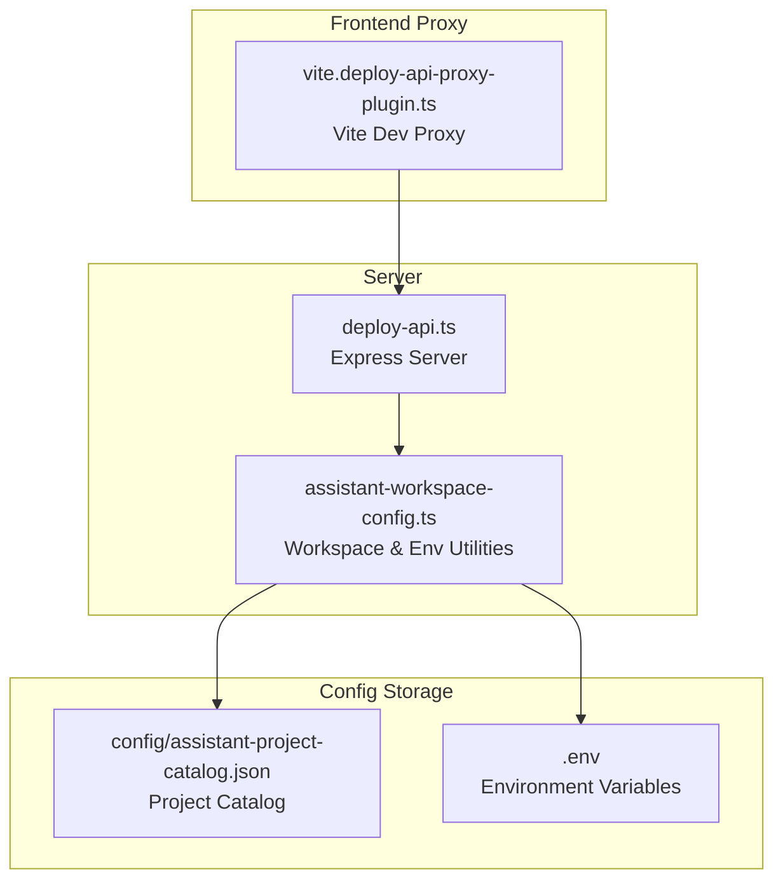
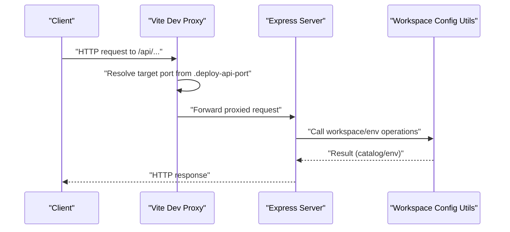
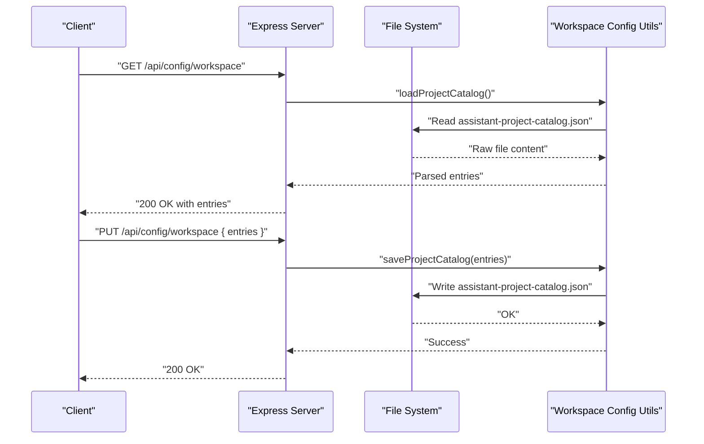
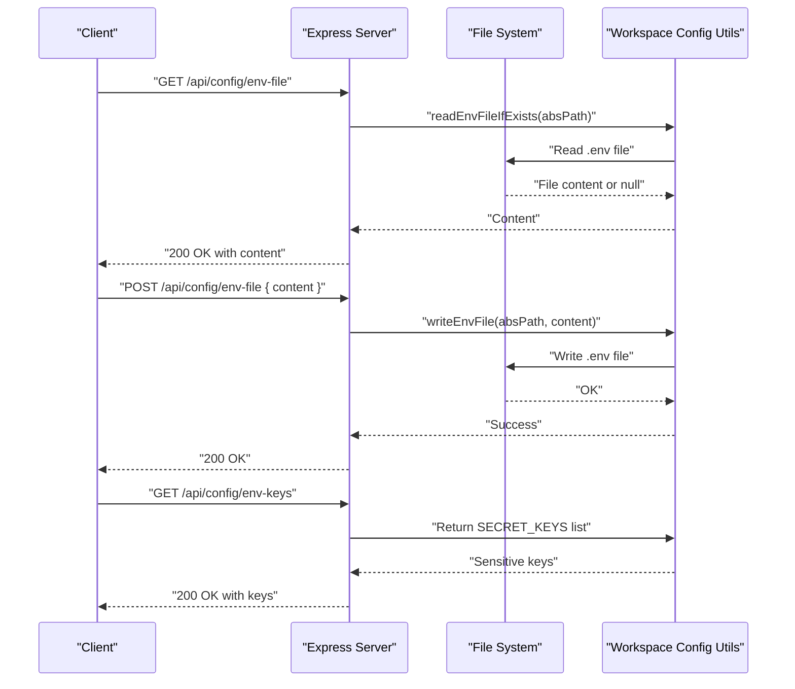
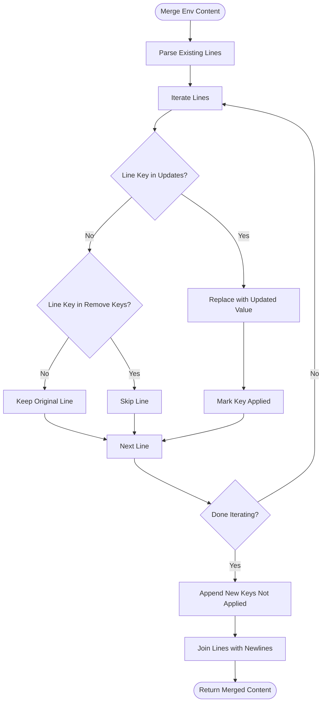
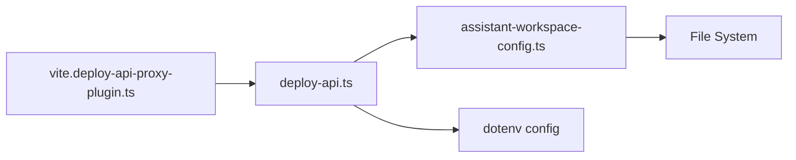

# Configuration API

<cite>
**Referenced Files in This Document**
- [assistant-workspace-config.ts](file://server/assistant-workspace-config.ts)
- [deploy-api.ts](file://server/deploy-api.ts)
- [package.json](file://package.json)
- [vite.deploy-api-proxy-plugin.ts](file://vite.deploy-api-proxy-plugin.ts)
</cite>

## Table of Contents
1. [Introduction](#introduction)
2. [Project Structure](#project-structure)
3. [Core Components](#core-components)
4. [Architecture Overview](#architecture-overview)
5. [Detailed Component Analysis](#detailed-component-analysis)
6. [Dependency Analysis](#dependency-analysis)
7. [Performance Considerations](#performance-considerations)
8. [Troubleshooting Guide](#troubleshooting-guide)
9. [Conclusion](#conclusion)
10. [Appendices](#appendices)

## Introduction
This document provides detailed API documentation for configuration management endpoints. It covers:
- Workspace configuration endpoints for managing project catalogs
- Environment variable management endpoints for reading and writing .env files
- Assistant environment management including secret key handling, UI key filtering, and configuration merging
- Request/response schemas and examples for project catalog entries, environment variable objects, and configuration validation results
- Security considerations for sensitive environment variables
- Integration patterns for automated configuration management and team collaboration workflows

## Project Structure
The configuration APIs are implemented within the server-side codebase. The primary implementation resides in:
- Workspace configuration utilities and environment file operations
- The Express-based API server that exposes endpoints and integrates with the workspace configuration utilities

**Diagram sources**
- [assistant-workspace-config.ts:33-77](file://server/assistant-workspace-config.ts#L33-L77)
- [deploy-api.ts:50-63](file://server/deploy-api.ts#L50-L63)
- [vite.deploy-api-proxy-plugin.ts:72-101](file://vite.deploy-api-proxy-plugin.ts#L72-L101)

**Section sources**
- [package.json:11-16](file://package.json#L11-L16)
- [vite.deploy-api-proxy-plugin.ts:57-101](file://vite.deploy-api-proxy-plugin.ts#L57-L101)

## Core Components
This section documents the core configuration management components and their roles in the API.

- Workspace configuration utilities
  - Project catalog entry model and file format
  - Load/save operations for project catalogs
  - Environment file resolution and persistence
- Environment parsing and merging
  - Parsing .env content into key-value pairs
  - Escaping values and formatting lines
  - Merging updates and deletions into existing .env content
- Assistant environment management
  - UI key filtering for environment variables
  - Secret key detection for sensitive values
  - Safe read/write operations for .env files

**Section sources**
- [assistant-workspace-config.ts:33-77](file://server/assistant-workspace-config.ts#L33-L77)
- [assistant-workspace-config.ts:80-109](file://server/assistant-workspace-config.ts#L80-L109)
- [assistant-workspace-config.ts:114-147](file://server/assistant-workspace-config.ts#L114-L147)
- [assistant-workspace-config.ts:153-187](file://server/assistant-workspace-config.ts#L153-L187)
- [assistant-workspace-config.ts:189-201](file://server/assistant-workspace-config.ts#L189-L201)

## Architecture Overview
The configuration API architecture integrates a Vite development proxy with an Express server. The proxy forwards requests under the API prefix to the server, which uses workspace configuration utilities to manage project catalogs and environment variables.

**Diagram sources**
- [vite.deploy-api-proxy-plugin.ts:57-101](file://vite.deploy-api-proxy-plugin.ts#L57-L101)
- [deploy-api.ts:75-78](file://server/deploy-api.ts#L75-L78)
- [assistant-workspace-config.ts:50-77](file://server/assistant-workspace-config.ts#L50-L77)

## Detailed Component Analysis

### Workspace Configuration Endpoints
These endpoints manage the project catalog stored in the assistant-project-catalog.json file.

- Endpoint: GET /api/config/workspace
  - Purpose: Retrieve the current project catalog entries
  - Response: Array of project catalog entries
  - Example response schema:
    - entries: array of objects with fields id, name, path
  - Notes:
    - Returns an empty array if the catalog file is missing or invalid
    - Filters entries to ensure required fields are present

- Endpoint: PUT /api/config/workspace
  - Purpose: Update the project catalog with new entries
  - Request body: Array of project catalog entries
  - Validation:
    - Each entry must include id, name, and path
    - Entries are validated before saving
  - Behavior:
    - Writes the validated entries to assistant-project-catalog.json
    - Creates parent directories if needed

- Endpoint: GET /api/config/env
  - Purpose: List environment variables loaded from .env
  - Response: Object mapping environment variable names to values
  - Notes:
    - Values are parsed from the resolved .env file
    - Comments and blank lines are ignored during parsing

**Diagram sources**
- [assistant-workspace-config.ts:54-77](file://server/assistant-workspace-config.ts#L54-L77)
- [deploy-api.ts:53-62](file://server/deploy-api.ts#L53-L62)

**Section sources**
- [assistant-workspace-config.ts:54-77](file://server/assistant-workspace-config.ts#L54-L77)
- [assistant-workspace-config.ts:50-52](file://server/assistant-workspace-config.ts#L50-L52)

### Environment Variable Management Endpoints
These endpoints manage .env files and environment variables.

- Endpoint: GET /api/config/env-file
  - Purpose: Read the current .env file content
  - Response: Text content of the .env file
  - Notes:
    - Returns null if the file does not exist
    - Uses the resolved .env path for reading

- Endpoint: POST /api/config/env-file
  - Purpose: Write or update .env file content
  - Request body: Plain text content representing the .env file
  - Behavior:
    - Writes content to the resolved .env path
    - Creates parent directories if needed

- Endpoint: GET /api/config/env-keys
  - Purpose: List sensitive environment variable keys
  - Response: Array of environment variable names considered sensitive
  - Notes:
    - Keys are defined in the UI key list and marked as secrets

**Diagram sources**
- [assistant-workspace-config.ts:189-201](file://server/assistant-workspace-config.ts#L189-L201)
- [assistant-workspace-config.ts:99-109](file://server/assistant-workspace-config.ts#L99-L109)

**Section sources**
- [assistant-workspace-config.ts:189-201](file://server/assistant-workspace-config.ts#L189-L201)
- [assistant-workspace-config.ts:99-109](file://server/assistant-workspace-config.ts#L99-L109)

### Assistant Environment Management
This section documents the assistant environment utilities used by the configuration endpoints.

- UI key filtering
  - Purpose: Hide or mask sensitive environment variables in the UI
  - Mechanism: Maintains a curated list of environment variable names for UI display
  - Usage: Returned by GET /api/config/env-keys

- Secret key handling
  - Purpose: Identify sensitive environment variables
  - Mechanism: Maintains a set of secret keys derived from the UI key list
  - Usage: Used to prevent accidental exposure of sensitive values

- Configuration merging operations
  - Purpose: Merge updates and deletions into existing .env content
  - Mechanism: Updates existing keys, removes specified keys, appends new keys
  - Behavior: Preserves comments and order of existing lines

**Diagram sources**
- [assistant-workspace-config.ts:153-187](file://server/assistant-workspace-config.ts#L153-L187)

**Section sources**
- [assistant-workspace-config.ts:80-109](file://server/assistant-workspace-config.ts#L80-L109)
- [assistant-workspace-config.ts:153-187](file://server/assistant-workspace-config.ts#L153-L187)

## Dependency Analysis
The configuration API depends on workspace configuration utilities for all file operations and environment parsing. The Express server initializes dotenv based on the resolved .env path and exposes endpoints that delegate to these utilities.

**Diagram sources**
- [deploy-api.ts:50-63](file://server/deploy-api.ts#L50-L63)
- [assistant-workspace-config.ts:50-63](file://server/assistant-workspace-config.ts#L50-L63)
- [vite.deploy-api-proxy-plugin.ts:72-101](file://vite.deploy-api-proxy-plugin.ts#L72-L101)

**Section sources**
- [deploy-api.ts:65-73](file://server/deploy-api.ts#L65-L73)
- [assistant-workspace-config.ts:8-31](file://server/assistant-workspace-config.ts#L8-L31)

## Performance Considerations
- File I/O operations
  - Project catalog and .env reads/writes are synchronous and occur on the server thread
  - For large catalogs or frequent updates, consider batching operations or caching
- Parsing efficiency
  - Environment parsing scans line-by-line; ensure .env files are reasonably sized
- Proxy overhead
  - The Vite proxy adds minimal overhead; ensure .deploy-api-port is correctly written

## Troubleshooting Guide
- Missing .env file
  - Symptom: Warning about missing .env and environment variables only from process environment
  - Resolution: Place a .env file at one of the resolved locations or set DEPLOY_API_DOTENV
- Invalid project catalog
  - Symptom: Empty catalog returned
  - Resolution: Ensure assistant-project-catalog.json exists and contains a valid version and entries array
- Permission errors when writing .env
  - Symptom: Write failures
  - Resolution: Verify write permissions for the resolved .env path and parent directories
- Proxy misconfiguration
  - Symptom: 502 Bad Gateway from proxy
  - Resolution: Confirm .deploy-api-port exists and contains a valid port number

**Section sources**
- [assistant-workspace-config.ts:65-73](file://server/assistant-workspace-config.ts#L65-L73)
- [assistant-workspace-config.ts:189-201](file://server/assistant-workspace-config.ts#L189-L201)
- [vite.deploy-api-proxy-plugin.ts:92-98](file://vite.deploy-api-proxy-plugin.ts#L92-L98)

## Conclusion
The configuration API provides robust endpoints for managing project catalogs and environment variables. It emphasizes safe file operations, secret key handling, and straightforward merging of configuration updates. Integrating with the Vite proxy enables seamless development workflows, while the assistant environment utilities ensure secure handling of sensitive credentials.

## Appendices

### Request/Response Schemas

- Project catalog entry
  - Fields:
    - id: string
    - name: string
    - path: string
  - Example:
    - {
        "id": "proj-1",
        "name": "My Project",
        "path": "~/projects/my-proj"
      }

- Project catalog file
  - Fields:
    - version: number (must be 1)
    - entries: array of project catalog entries
  - Example:
    - {
        "version": 1,
        "entries": [
          { "id": "proj-1", "name": "My Project", "path": "~/projects/my-proj" }
        ]
      }

- Environment variable object
  - Fields:
    - key: string
    - value: string
  - Example:
    - {
        "JENKINS_USER": "alice",
        "JENKINS_TOKEN": "<masked>"
      }

- Configuration validation result
  - Fields:
    - valid: boolean
    - errors: array of strings (optional)
  - Example:
    - {
        "valid": true
      }

### Example Scenarios

- Multi-project setup
  - Add multiple project catalog entries with distinct ids and paths
  - Use PUT /api/config/workspace to persist the catalog
  - Retrieve with GET /api/config/workspace to confirm

- Environment-specific settings
  - Use GET /api/config/env to inspect current environment variables
  - Use POST /api/config/env-file to apply environment-specific values
  - Use GET /api/config/env-keys to identify sensitive variables

- Secure credential management
  - Treat keys returned by GET /api/config/env-keys as secrets
  - Avoid logging or exposing these values in UI or logs
  - Use masked representations when displaying values

### Integration Patterns

- Automated configuration management
  - Periodically synchronize project catalogs from source control
  - Apply environment updates via POST /api/config/env-file in CI/CD pipelines
  - Validate configuration with GET /api/config/env after updates

- Team collaboration workflows
  - Share project catalog updates through version control
  - Use environment merging to safely update shared variables
  - Establish conventions for sensitive keys and masking in shared environments