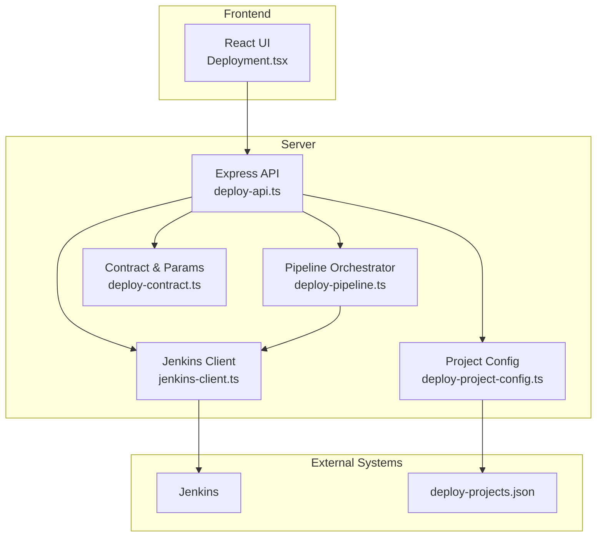
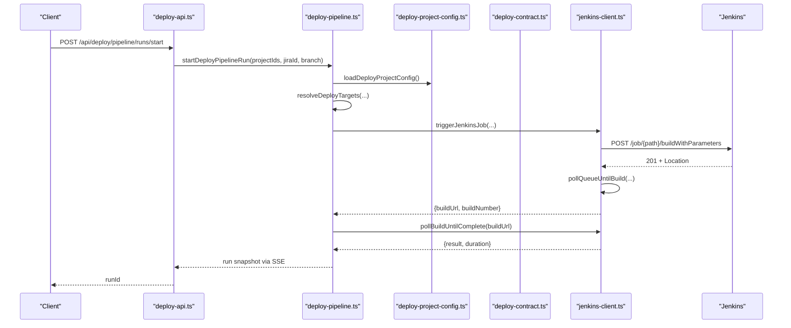
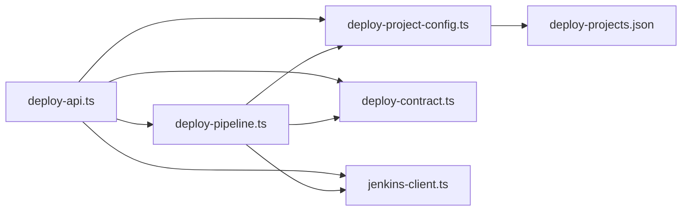

# Deployment API

<cite>
**Referenced Files in This Document**
- [deploy-api.ts](file://server/deploy-api.ts)
- [deploy-contract.ts](file://server/deploy-contract.ts)
- [deploy-pipeline.ts](file://server/deploy-pipeline.ts)
- [deploy-project-config.ts](file://server/deploy-project-config.ts)
- [jenkins-client.ts](file://server/jenkins-client.ts)
- [deploy-projects.json](file://config/deploy-projects.json)
- [Deployment.tsx](file://src/pages/Deployment.tsx)
- [package.json](file://package.json)
</cite>

## Table of Contents
1. [Introduction](#introduction)
2. [Project Structure](#project-structure)
3. [Core Components](#core-components)
4. [Architecture Overview](#architecture-overview)
5. [Detailed Component Analysis](#detailed-component-analysis)
6. [Dependency Analysis](#dependency-analysis)
7. [Performance Considerations](#performance-considerations)
8. [Troubleshooting Guide](#troubleshooting-guide)
9. [Conclusion](#conclusion)
10. [Appendices](#appendices)

## Introduction
This document provides comprehensive API documentation for deployment-related endpoints that orchestrate Jenkins builds and manage deployment pipelines. It covers:
- Orchestration endpoints for triggering builds, monitoring progress, and canceling runs
- Pipeline management endpoints for project configuration, parameter building, and build monitoring
- Request/response schemas with JSON examples
- Authentication requirements, rate limiting policies, and security considerations
- Examples of deployment contracts, project configurations, and Jenkins job parameters
- Common deployment scenarios including manual triggers, scheduled runs, and automated pipelines
- Troubleshooting guides and integration patterns with CI/CD workflows

## Project Structure
The deployment API is implemented as a standalone Express server that integrates with Jenkins and manages deployment pipelines. The frontend interacts with the API to orchestrate multi-project deployments and monitor progress via Server-Sent Events (SSE).

**Diagram sources**
- [deploy-api.ts:75-1735](file://server/deploy-api.ts#L75-L1735)
- [deploy-pipeline.ts:1-419](file://server/deploy-pipeline.ts#L1-L419)
- [deploy-project-config.ts:1-237](file://server/deploy-project-config.ts#L1-L237)
- [deploy-contract.ts:1-169](file://server/deploy-contract.ts#L1-L169)
- [jenkins-client.ts:1-191](file://server/jenkins-client.ts#L1-L191)
- [deploy-projects.json:1-78](file://config/deploy-projects.json#L1-L78)

**Section sources**
- [deploy-api.ts:75-1735](file://server/deploy-api.ts#L75-L1735)
- [deploy-pipeline.ts:1-419](file://server/deploy-pipeline.ts#L1-L419)
- [deploy-project-config.ts:1-237](file://server/deploy-project-config.ts#L1-L237)
- [deploy-contract.ts:1-169](file://server/deploy-contract.ts#L1-L169)
- [jenkins-client.ts:1-191](file://server/jenkins-client.ts#L1-L191)
- [deploy-projects.json:1-78](file://config/deploy-projects.json#L1-L78)

## Core Components
- Express server with middleware for JSON parsing and environment configuration
- Jenkins client for triggering jobs and polling build completion
- Pipeline orchestrator for multi-project deployments with DAG semantics
- Project configuration loader and validator for Jenkins job paths and branch resolution
- Contract builder for Jenkins parameters and credential validation

Key runtime behaviors:
- Jenkins credentials are validated from environment variables
- Project configurations are loaded from a JSON file with strict validation
- Pipeline runs are tracked in-memory with event snapshots and pruning
- Frontend consumes SSE endpoints for live updates during execution

**Section sources**
- [deploy-api.ts:65-94](file://server/deploy-api.ts#L65-L94)
- [jenkins-client.ts:1-191](file://server/jenkins-client.ts#L1-L191)
- [deploy-pipeline.ts:1-419](file://server/deploy-pipeline.ts#L1-L419)
- [deploy-project-config.ts:1-237](file://server/deploy-project-config.ts#L1-L237)
- [deploy-contract.ts:1-169](file://server/deploy-contract.ts#L1-L169)

## Architecture Overview
The deployment API exposes endpoints for:
- Health checks and configuration validation
- Direct Jenkins job triggering with parameterization
- Pipeline orchestration with multi-project DAG execution
- Real-time monitoring via SSE
- Task statistics and project listings

**Diagram sources**
- [deploy-api.ts:1441-1461](file://server/deploy-api.ts#L1441-L1461)
- [deploy-pipeline.ts:186-418](file://server/deploy-pipeline.ts#L186-L418)
- [deploy-project-config.ts:212-236](file://server/deploy-project-config.ts#L212-L236)
- [jenkins-client.ts:89-190](file://server/jenkins-client.ts#L89-L190)

## Detailed Component Analysis

### Orchestration Endpoints

#### POST /api/deploy/pipeline/runs/start
Starts a server-side orchestrated pipeline for multiple projects. The server resolves targets, triggers Jenkins jobs, and streams progress via SSE.

- Request body:
  - projectIds: array of project identifiers or a single projectId
  - jiraId: optional Jira ticket key to influence branch selection
  - branch: optional explicit branch override
- Response:
  - runId: unique identifier for the pipeline run

Example request:
- projectIds: ["saas-cc-web", "saas-cc-node"]
- jiraId: "ABC-123"
- branch: "feature/new-ui"

Example response:
- runId: "a1b2c3d4-e5f6-7890-abcd-ef1234567890"

Notes:
- The server validates projectIds and throws 400 if missing
- Jenkins credentials are validated; if missing, returns 503 with missing fields
- The run is tracked in memory with pruning of old runs

**Section sources**
- [deploy-api.ts:1441-1461](file://server/deploy-api.ts#L1441-L1461)
- [deploy-pipeline.ts:186-223](file://server/deploy-pipeline.ts#L186-L223)

#### GET /api/deploy/pipeline/runs/:runId
Returns a snapshot of the pipeline run, including nodes, events, and status.

- Path parameters:
  - runId: UUID of the pipeline run
- Response:
  - id, status, taskKey, jiraId, branch, nodes, events, eventCount, activeNodeId, createdAt

Example response:
- status: "running"
- nodes: [{ id, name, status, duration, queueUrl, buildUrl, buildNumber, branch }]
- events: [{ type, timestamp, payload }]

**Section sources**
- [deploy-api.ts:1463-1470](file://server/deploy-api.ts#L1463-L1470)
- [deploy-pipeline.ts:149-180](file://server/deploy-pipeline.ts#L149-L180)

#### GET /api/deploy/pipeline/runs/:runId/events
SSE endpoint streaming run events. Clients can resume from a specific index.

- Path parameters:
  - runId: UUID of the pipeline run
- Query parameters:
  - afterIndex: optional index to resume from
- Response:
  - Stream of events with types: log, nodes, completed, failed

Example event:
- { type: "log", timestamp: "12:34:56", payload: { message: "...", level: "info" } }
- { type: "nodes", timestamp: "12:34:57", payload: { nodes: [...] } }

**Section sources**
- [deploy-api.ts:1472-1503](file://server/deploy-api.ts#L1472-L1503)
- [deploy-pipeline.ts:29-82](file://server/deploy-pipeline.ts#L29-L82)

#### GET /api/deploy/pipeline/task-stats
Returns sorted task statistics by execution count for pipeline task keys.

- Query parameters:
  - limit: optional number of entries (default 30, max 100)
- Response:
  - entries: [{ taskKey, count, lastRunAt }]

**Section sources**
- [deploy-api.ts:1505-1514](file://server/deploy-api.ts#L1505-L1514)
- [deploy-pipeline.ts:123-137](file://server/deploy-pipeline.ts#L123-L137)

### Jenkins Integration Endpoints

#### POST /api/deploy/jenkins/trigger
Directly triggers Jenkins jobs for one or more projects with parameters.

- Request body:
  - projectIds or projectId
  - jiraId: optional
  - branch: optional
  - pollQueue: boolean (default false)
  - pollTimeoutMs: number (default 120000, max 600000)
- Response:
  - results: array of trigger results per target
  - projectIds: input projectIds

Example response:
- results: [{ queueUrl, buildUrl, buildNumber, message, error }]
- projectIds: ["saas-cc-web"]

**Section sources**
- [deploy-api.ts:1330-1404](file://server/deploy-api.ts#L1330-L1404)
- [jenkins-client.ts:89-142](file://server/jenkins-client.ts#L89-L142)

#### POST /api/deploy/jenkins/build-result
Polls a Jenkins build URL until completion and returns the final result.

- Request body:
  - buildUrl: Jenkins build URL
  - timeoutMs: optional (default 1800000, max 3600000)
- Response:
  - building: boolean
  - result: "SUCCESS" | "FAILURE" | "ABORTED" | "UNSTABLE" | null
  - duration: number
  - error: optional error message

**Section sources**
- [deploy-api.ts:1412-1438](file://server/deploy-api.ts#L1412-L1438)
- [jenkins-client.ts:148-190](file://server/jenkins-client.ts#L148-L190)

### Health and Configuration Endpoints

#### GET /api/deploy/health
Checks deployment API health, Jenkins configuration, project list, and Jira configuration.

- Response:
  - jenkinsConfigured: boolean
  - jenkinsMissing: string[]
  - deployConfigError: string
  - projects: [{ id, label, defaultBranch }]
  - jiraConfigured: boolean
  - automation: { t1Enabled, t1Schedules, t1CommandConfigured }

**Section sources**
- [deploy-api.ts:887-908](file://server/deploy-api.ts#L887-L908)

#### GET /api/deploy/jira/resolution/:issueKey
Resolves a Jira issue to a set of projects and branch rules.

- Path parameters:
  - issueKey: Jira ticket key
- Response:
  - nodes: string[]
  - source: "jira" | "fallback"
  - message: string

**Section sources**
- [deploy-api.ts:1285-1303](file://server/deploy-api.ts#L1285-L1303)

### Frontend Integration Patterns
The React UI uses these endpoints to:
- Load health and project lists
- Start pipeline runs and stream events via SSE
- Resume interrupted runs from session storage
- Apply templates and favorites for quick deployments

**Section sources**
- [Deployment.tsx:1-1068](file://src/pages/Deployment.tsx#L1-L1068)

## Dependency Analysis
The deployment API composes several modules with clear separation of concerns:

**Diagram sources**
- [deploy-api.ts:1-1735](file://server/deploy-api.ts#L1-L1735)
- [deploy-pipeline.ts:1-419](file://server/deploy-pipeline.ts#L1-L419)
- [deploy-project-config.ts:1-237](file://server/deploy-project-config.ts#L1-L237)
- [deploy-contract.ts:1-169](file://server/deploy-contract.ts#L1-L169)
- [jenkins-client.ts:1-191](file://server/jenkins-client.ts#L1-L191)
- [deploy-projects.json:1-78](file://config/deploy-projects.json#L1-L78)

**Section sources**
- [deploy-api.ts:1-1735](file://server/deploy-api.ts#L1-L1735)
- [deploy-pipeline.ts:1-419](file://server/deploy-pipeline.ts#L1-L419)
- [deploy-project-config.ts:1-237](file://server/deploy-project-config.ts#L1-L237)
- [deploy-contract.ts:1-169](file://server/deploy-contract.ts#L1-L169)
- [jenkins-client.ts:1-191](file://server/jenkins-client.ts#L1-L191)
- [deploy-projects.json:1-78](file://config/deploy-projects.json#L1-L78)

## Performance Considerations
- In-memory run tracking with pruning: The server maintains a bounded number of runs and prunes older terminal runs to control memory usage.
- Event batching: Events are batched and trimmed to a fixed maximum per run to prevent unbounded growth.
- SSE streaming: Clients receive incremental updates; the server closes connections when runs complete.
- Jenkins polling: Timeout and interval parameters are configurable to balance responsiveness and resource usage.

[No sources needed since this section provides general guidance]

## Troubleshooting Guide
Common issues and resolutions:
- Jenkins credentials missing or invalid:
  - Symptom: 503 with missing fields in /api/deploy/health
  - Resolution: Set JENKINS_URL, JENKINS_USER, JENKINS_TOKEN
- Project configuration errors:
  - Symptom: deployConfigError in /api/deploy/health
  - Resolution: Fix deploy-projects.json (valid jobPath, jenkinsBaseUrl, parameter names)
- Jenkins authentication or permission failure:
  - Symptom: Jenkins HTTP 403 with sanitized error message
  - Resolution: Verify Jenkins credentials, crumb access, and job build permissions
- Build timeout:
  - Symptom: pollBuildUntilComplete returns error after timeout
  - Resolution: Increase timeoutMs or investigate Jenkins job slowness
- Pipeline stuck in queued:
  - Symptom: Nodes remain queued without build URLs
  - Resolution: Check Jenkins queue and job availability; adjust pollQueue and pollTimeoutMs

**Section sources**
- [deploy-contract.ts:33-81](file://server/deploy-contract.ts#L33-L81)
- [jenkins-client.ts:71-87](file://server/jenkins-client.ts#L71-L87)
- [jenkins-client.ts:148-190](file://server/jenkins-client.ts#L148-L190)
- [deploy-pipeline.ts:331-342](file://server/deploy-pipeline.ts#L331-L342)

## Conclusion
The deployment API provides a robust foundation for orchestrating multi-project Jenkins deployments with real-time visibility. It enforces strong validation for credentials and configuration, offers flexible parameterization, and integrates seamlessly with a React-based UI for interactive deployment workflows.

[No sources needed since this section summarizes without analyzing specific files]

## Appendices

### Request/Response Schemas

- POST /api/deploy/pipeline/runs/start
  - Request body:
    - projectIds: string[]
    - jiraId?: string
    - branch?: string
  - Response:
    - runId: string

- GET /api/deploy/pipeline/runs/:runId
  - Response:
    - id: string
    - status: "running" | "completed" | "failed"
    - taskKey: string
    - jiraId?: string
    - branch?: string
    - nodes: DeployPipelineNodeState[]
    - events: DeployPipelineRunEvent[]
    - eventCount: number
    - activeNodeId: string | null
    - createdAt: string

- GET /api/deploy/pipeline/runs/:runId/events
  - Response (SSE):
    - data: DeployPipelineRunEvent

- GET /api/deploy/pipeline/task-stats
  - Response:
    - entries: Array<{ taskKey: string; count: number; lastRunAt: string }>

- POST /api/deploy/jenkins/trigger
  - Request body:
    - projectIds: string[] or projectId: string
    - jiraId?: string
    - branch?: string
    - pollQueue?: boolean
    - pollTimeoutMs?: number
  - Response:
    - results: Array<{ queueUrl?: string; buildUrl?: string; buildNumber?: number; message?: string; error?: string }>
    - projectIds: string[]

- POST /api/deploy/jenkins/build-result
  - Request body:
    - buildUrl: string
    - timeoutMs?: number
  - Response:
    - building: boolean
    - result: "SUCCESS" | "FAILURE" | "ABORTED" | "UNSTABLE" | null
    - duration: number
    - error?: string

- GET /api/deploy/health
  - Response:
    - jenkinsConfigured: boolean
    - jenkinsMissing?: string[]
    - deployConfigError?: string
    - projects: Array<{ id: string; label: string; defaultBranch: string }>
    - jiraConfigured: boolean
    - automation: { t1Enabled: boolean; t1Schedules: string; t1CommandConfigured: boolean }

- GET /api/deploy/jira/resolution/:issueKey
  - Response:
    - nodes: string[]
    - source: "jira" | "fallback"
    - message?: string

**Section sources**
- [deploy-api.ts:1441-1514](file://server/deploy-api.ts#L1441-L1514)
- [deploy-pipeline.ts:149-180](file://server/deploy-pipeline.ts#L149-L180)
- [jenkins-client.ts:89-190](file://server/jenkins-client.ts#L89-L190)
- [deploy-contract.ts:91-120](file://server/deploy-contract.ts#L91-L120)

### Authentication and Security
- Jenkins credentials are required and validated from environment variables:
  - JENKINS_URL, JENKINS_USER, JENKINS_TOKEN
- Jenkins client automatically handles CSRF crumbs and Basic auth headers
- The API runs on localhost by default and serves static assets when configured

**Section sources**
- [deploy-contract.ts:33-81](file://server/deploy-contract.ts#L33-L81)
- [jenkins-client.ts:27-29](file://server/jenkins-client.ts#L27-L29)
- [jenkins-client.ts:106-110](file://server/jenkins-client.ts#L106-L110)
- [deploy-api.ts:1664-1686](file://server/deploy-api.ts#L1664-L1686)

### Rate Limiting Policies
- No explicit rate limiting is implemented in the server code.
- Clients should throttle requests and reuse runId for SSE consumption to minimize overhead.

[No sources needed since this section provides general guidance]

### Example Deployment Contracts and Project Configurations
- Example project configuration (deploy-projects.json):
  - defaults: branch, jenkinsBaseUrl, jiraParamName, branchParamName
  - projects: id -> { label, jobPath, defaultBranch }
  - jiraBranchRules: patterns mapping Jira keys to branch overrides

- Example Jenkins parameter names:
  - JIRA_ID (default)
  - BRANCH_NAME (default)

**Section sources**
- [deploy-projects.json:1-78](file://config/deploy-projects.json#L1-L78)
- [deploy-contract.ts:91-120](file://server/deploy-contract.ts#L91-L120)

### Common Deployment Scenarios
- Manual trigger:
  - Use POST /api/deploy/pipeline/runs/start with projectIds and optional jiraId/branch
  - Monitor via GET /api/deploy/pipeline/runs/:runId/events
- Scheduled runs:
  - Configure AUTOMATION_T1_ENABLED and AUTOMATION_T1_SCHEDULES
  - Use POST /api/deploy/automation/runs/start with taskId "t_1"
- Automated pipelines:
  - Chain multiple projects with DAG semantics; each successful build triggers the next

**Section sources**
- [deploy-api.ts:831-885](file://server/deploy-api.ts#L831-L885)
- [deploy-api.ts:1516-1535](file://server/deploy-api.ts#L1516-L1535)
- [deploy-pipeline.ts:225-418](file://server/deploy-pipeline.ts#L225-L418)