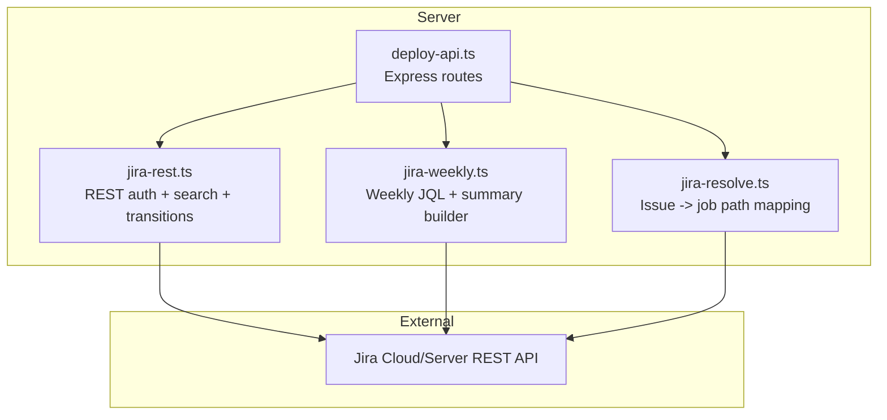
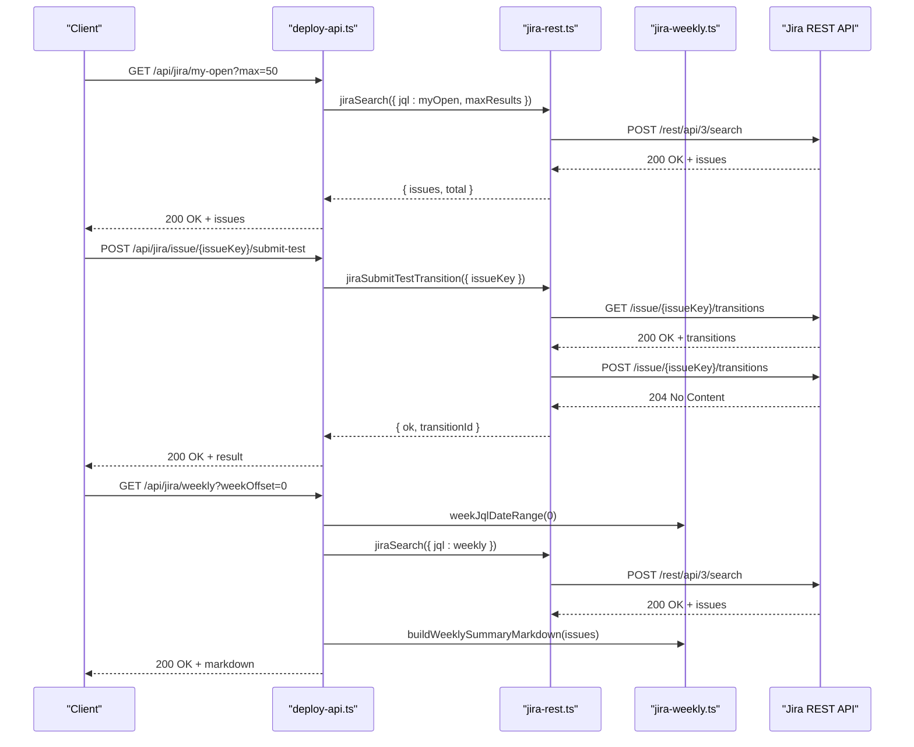
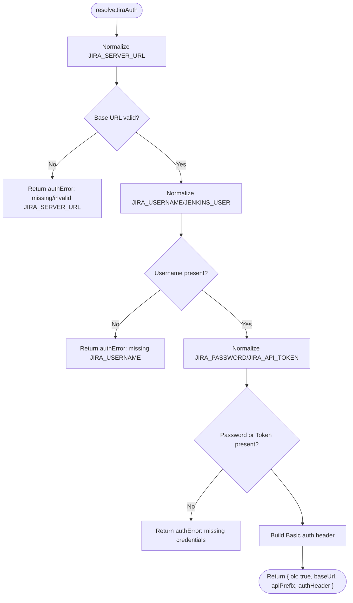
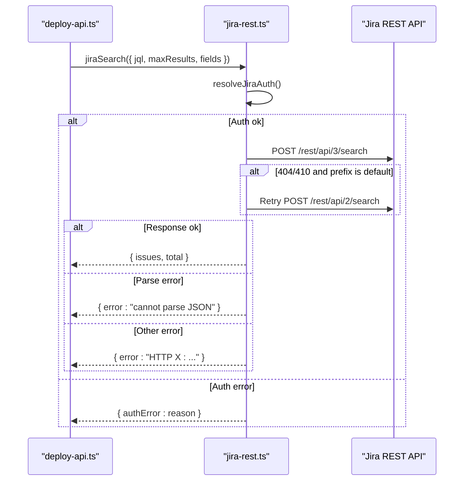
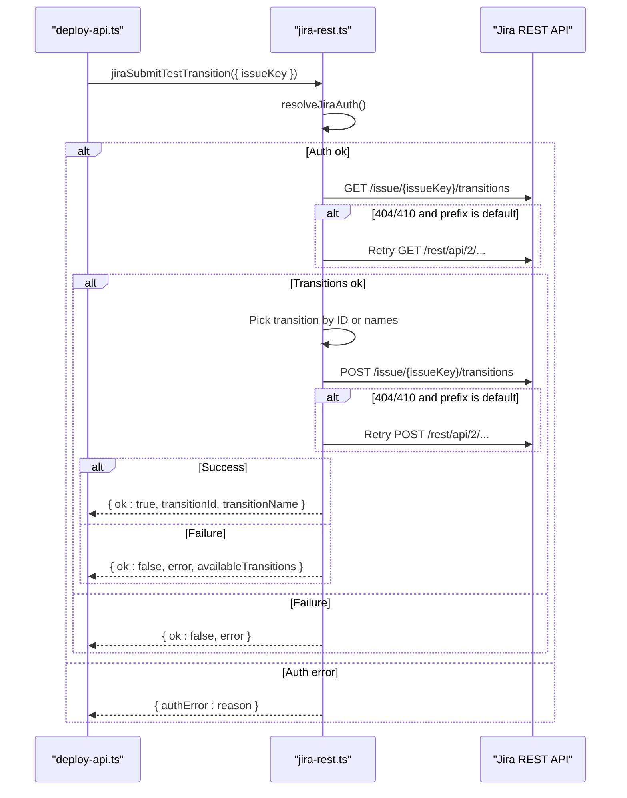
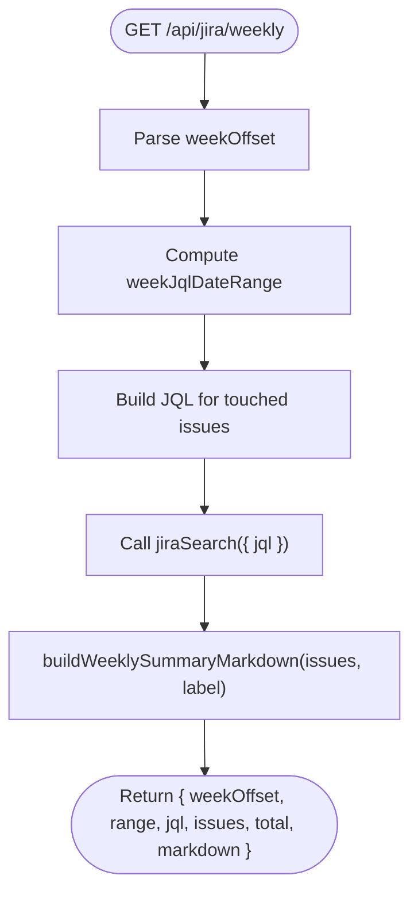
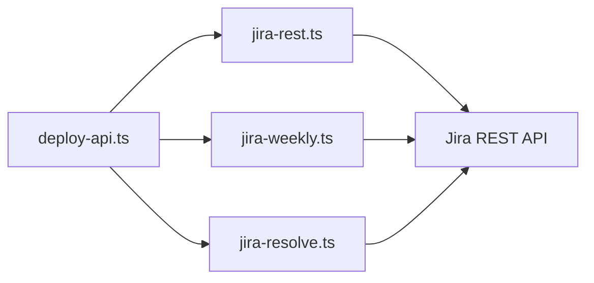

# Jira Integration API

<cite>
**Referenced Files in This Document**
- [deploy-api.ts](file://server/deploy-api.ts)
- [jira-rest.ts](file://server/jira-rest.ts)
- [jira-weekly.ts](file://server/jira-weekly.ts)
- [jira-resolve.ts](file://server/jira-resolve.ts)
- [jira-rest.test.ts](file://test/server/jira-rest.test.ts)
- [jira-weekly.test.ts](file://test/server/jira-weekly.test.ts)
- [deploy-projects.json](file://config/deploy-projects.json)
</cite>

## Table of Contents
1. [Introduction](#introduction)
2. [Project Structure](#project-structure)
3. [Core Components](#core-components)
4. [Architecture Overview](#architecture-overview)
5. [Detailed Component Analysis](#detailed-component-analysis)
6. [Dependency Analysis](#dependency-analysis)
7. [Performance Considerations](#performance-considerations)
8. [Troubleshooting Guide](#troubleshooting-guide)
9. [Conclusion](#conclusion)

## Introduction
This document describes the Jira integration endpoints exposed by the server. It covers:
- Issue search endpoint for finding issues via JQL
- Workflow transition endpoint for moving issues into testing
- Weekly reporting endpoints for generating personal issue summaries
- Authentication configuration using Jira credentials and API tokens
- Integration patterns for connecting deployment runs to Jira issues and automating transitions

The API is implemented as Express routes backed by reusable Jira utilities that handle authentication normalization, REST API calls, and error parsing.

## Project Structure
The Jira integration is implemented in the server module with dedicated files for REST search, weekly reporting, and issue resolution mapping.



**Diagram sources**
- [deploy-api.ts:1165-1283](file://server/deploy-api.ts#L1165-L1283)
- [jira-rest.ts:34-482](file://server/jira-rest.ts#L34-L482)
- [jira-weekly.ts:1-113](file://server/jira-weekly.ts#L1-L113)
- [jira-resolve.ts:1-130](file://server/jira-resolve.ts#L1-L130)

**Section sources**
- [deploy-api.ts:1165-1283](file://server/deploy-api.ts#L1165-L1283)

## Core Components
- Authentication resolver: Normalizes Jira server URL, username, and credentials; builds Basic auth header
- Search engine: Executes JQL queries against Jira REST API with robust error handling
- Transition executor: Reads available transitions and posts a selected transition
- Weekly reporter: Builds JQL for personal issues and generates Markdown summaries
- Resolution mapper: Maps Jira components to Jenkins job path segments

**Section sources**
- [jira-rest.ts:34-482](file://server/jira-rest.ts#L34-L482)
- [jira-weekly.ts:1-113](file://server/jira-weekly.ts#L1-L113)
- [jira-resolve.ts:1-130](file://server/jira-resolve.ts#L1-L130)

## Architecture Overview
The API exposes routes that delegate to internal utilities. The utilities encapsulate:
- Environment-driven authentication
- REST path selection (rest/api/3 vs rest/api/2)
- Request logging and error parsing
- JSON response validation



**Diagram sources**
- [deploy-api.ts:1181-1283](file://server/deploy-api.ts#L1181-L1283)
- [jira-rest.ts:181-278](file://server/jira-rest.ts#L181-L278)
- [jira-rest.ts:357-482](file://server/jira-rest.ts#L357-L482)
- [jira-weekly.ts:38-113](file://server/jira-weekly.ts#L38-L113)

## Detailed Component Analysis

### Authentication and Environment
- JIRA_SERVER_URL: Base URL for Jira (normalized to remove quotes/spaces)
- JIRA_USERNAME: Jira username (or JENKINS_USER if JIRA_USERNAME absent and credentials present)
- JIRA_PASSWORD or JIRA_API_TOKEN: Password or REST API token (both normalized)
- JIRA_REST_PATH_PREFIX: Optional REST path prefix (defaults to rest/api/3)
- JIRA_SUBMIT_TEST_TRANSITION_ID: Optional explicit transition ID
- JIRA_SUBMIT_TEST_TRANSITION_NAMES: Comma-separated transition names to match

Behavior:
- If JIRA_SERVER_URL is missing or empty after normalization, authentication fails
- If JIRA_USERNAME is missing, the system falls back to JENKINS_USER when credentials are present
- Basic auth header is constructed as "Basic base64(username:passwordOrToken)"
- REST path defaults to rest/api/3 and automatically retries with rest/api/2 on 404/410 when not explicitly set

**Section sources**
- [jira-rest.ts:34-85](file://server/jira-rest.ts#L34-L85)
- [jira-rest.ts:12-32](file://server/jira-rest.ts#L12-L32)
- [jira-rest.ts:150-152](file://server/jira-rest.ts#L150-L152)
- [jira-rest.ts:315-330](file://server/jira-rest.ts#L315-L330)

### Endpoint: GET /api/jira/my-open
Purpose: Retrieve the caller’s open issues (personal “My Issues” view).

- Query parameters:
  - max: integer, min 1, max 100, default 50
- Response fields:
  - issues: array of issue objects
  - total: integer count
- Status codes:
  - 200: success
  - 503: authentication not configured (authError present)
  - 502: Jira error (error present)
  - 500: server error

Response schema:
- issues: array of JiraSearchIssue
- total: number

JQL used:
- resolution = Unresolved AND assignee in (currentUser()) ORDER BY updated DESC

**Section sources**
- [deploy-api.ts:1181-1202](file://server/deploy-api.ts#L1181-L1202)
- [jira-weekly.ts:56-58](file://server/jira-weekly.ts#L56-L58)
- [jira-rest.ts:181-278](file://server/jira-rest.ts#L181-L278)

### Endpoint: POST /api/jira/issue/:issueKey/submit-test
Purpose: Move an issue into a “testing” state by executing a workflow transition.

- Path parameter:
  - issueKey: required, trimmed and uppercased
- Response fields:
  - ok: boolean
  - issueKey: uppercase issue key
  - transitionId: selected transition id
  - transitionName: selected transition name (optional)
- Status codes:
  - 200: success
  - 400: invalid transition or configuration (error + availableTransitions)
  - 503: authentication not configured (authError present)
  - 500: server error

Transition selection logic:
- If JIRA_SUBMIT_TEST_TRANSITION_ID is set, use it if present in available transitions
- Else, match against JIRA_SUBMIT_TEST_TRANSITION_NAMES (comma/Chinese comma separated)
- Fallback to partial substring match if exact name not found

**Section sources**
- [deploy-api.ts:1205-1234](file://server/deploy-api.ts#L1205-L1234)
- [jira-rest.ts:357-482](file://server/jira-rest.ts#L357-L482)
- [jira-rest.ts:319-350](file://server/jira-rest.ts#L319-L350)

### Endpoint: GET /api/jira/weekly
Purpose: Generate a weekly summary of issues touched by the caller during a week range.

- Query parameters:
  - weekOffset: integer offset for week range (default 0)
- Response fields:
  - weekOffset: input weekOffset
  - range: { from, toExclusive, labelZh }
  - jql: computed JQL string
  - issues: array of JiraSearchIssue
  - total: integer count
  - markdown: generated Markdown summary
- Status codes:
  - 200: success
  - 503: authentication not configured (authError present)
  - 502: Jira error (error present)
  - 500: server error

JQL used:
- assignee in (currentUser()) AND updated >= "<from>" AND updated < "<to>" ORDER BY updated DESC

**Section sources**
- [deploy-api.ts:1236-1283](file://server/deploy-api.ts#L1236-L1283)
- [jira-weekly.ts:38-65](file://server/jira-weekly.ts#L38-L65)
- [jira-weekly.ts:67-113](file://server/jira-weekly.ts#L67-L113)
- [jira-rest.ts:181-278](file://server/jira-rest.ts#L181-L278)

### Endpoint: GET /api/jira/status
Purpose: Report whether Jira integration is configured and the mode.

- Response fields:
  - configured: boolean
  - mode: "user_password" or "user_api_token"
  - serverUrl: Jira base URL (when configured)

**Section sources**
- [deploy-api.ts:1165-1179](file://server/deploy-api.ts#L1165-L1179)

### Endpoint: GET /api/deploy/jira/resolution/:issueKey
Purpose: Map a Jira issue to Jenkins job path segments using component mapping.

- Path parameter:
  - issueKey: required, trimmed and uppercased
- Environment variables:
  - JIRA_COMPONENT_JOB_MAP: JSON mapping of component names to job path arrays
  - JIRA_RESOLUTION_FALLBACK_NODES: CSV fallback nodes
- Response fields:
  - nodes: string[]
  - source: "jira" | "fallback"
  - components?: string[] (present when source=jira)
  - message?: string (present when fallback used)

**Section sources**
- [deploy-api.ts:1285-1303](file://server/deploy-api.ts#L1285-L1303)
- [jira-resolve.ts:47-130](file://server/jira-resolve.ts#L47-L130)

### Data Models

#### JiraSearchIssue
- key: string
- fields.summary?: string
- fields.updated?: string
- fields.status?.name?: string
- fields.issuetype?.name?: string
- fields.priority?.name?: string
- fields.project?.key?: string
- fields.project?.name?: string
- fields.resolution?: { name?: string } | null

#### JiraSearchResult
- issues: JiraSearchIssue[]
- total: number
- error?: string
- authError?: string

#### JiraTransitionOption
- id: string
- name: string

#### JiraSubmitTestResult
- ok: boolean
- transitionId: string
- transitionName?: string
- error?: string
- availableTransitions?: JiraTransitionOption[]

#### Weekly Summary Response
- weekOffset: number
- range: { from: string, toExclusive: string, labelZh: string }
- jql: string
- issues: JiraSearchIssue[]
- total: number
- markdown: string

**Section sources**
- [jira-rest.ts:87-104](file://server/jira-rest.ts#L87-L104)
- [jira-rest.ts:282-290](file://server/jira-rest.ts#L282-L290)
- [jira-weekly.ts:67-113](file://server/jira-weekly.ts#L67-L113)

## Architecture Overview

```mermaid
classDiagram
class JiraAuthConfig {
+ok : boolean
+baseUrl : string
+apiPrefix : string
+authHeader : string
}
class JiraSearchIssue {
+key : string
+fields.summary? : string
+fields.updated? : string
+fields.status.name? : string
+fields.issuetype.name? : string
+fields.priority.name? : string
+fields.project.key? : string
+fields.project.name? : string
+fields.resolution? : { name? : string } | null
}
class JiraSearchResult {
+issues : JiraSearchIssue[]
+total : number
+error? : string
+authError? : string
}
class JiraTransitionOption {
+id : string
+name : string
}
class JiraSubmitTestResult {
+ok : boolean
+transitionId : string
+transitionName? : string
+error? : string
+availableTransitions? : JiraTransitionOption[]
}
class JiraResolution {
+nodes : string[]
+source : "jira"|"fallback"
+components? : string[]
+message? : string
}
class JiraRest {
+resolveJiraAuth(env) : JiraAuthConfig
+jiraSearch(options) : JiraSearchResult
+jiraSubmitTestTransition(options) : JiraSubmitTestResult
}
class JiraWeekly {
+getLocalWeekRangeMonday(weekOffset, now)
+weekJqlDateRange(weekOffset, now)
+jqlMyOpenIssues()
+jqlMyIssuesTouchedInWeek(fromYmd, toYmdExclusive)
+buildWeeklySummaryMarkdown(issues, rangeLabelZh)
}
class JiraResolve {
+resolveIssueToJobPaths(options) : JiraResolution
}
JiraRest --> JiraSearchIssue : "returns"
JiraRest --> JiraSearchResult : "returns"
JiraRest --> JiraTransitionOption : "reads/writes"
JiraWeekly --> JiraSearchIssue : "consumes"
JiraResolve --> JiraResolution : "returns"
```

**Diagram sources**
- [jira-rest.ts:7-104](file://server/jira-rest.ts#L7-L104)
- [jira-rest.ts:282-290](file://server/jira-rest.ts#L282-L290)
- [jira-weekly.ts:1-113](file://server/jira-weekly.ts#L1-L113)
- [jira-resolve.ts:8-13](file://server/jira-resolve.ts#L8-L13)

## Detailed Component Analysis

### Authentication Flow


**Diagram sources**
- [jira-rest.ts:34-85](file://server/jira-rest.ts#L34-L85)
- [jira-rest.ts:12-32](file://server/jira-rest.ts#L12-L32)

**Section sources**
- [jira-rest.ts:34-85](file://server/jira-rest.ts#L34-L85)

### Search Flow


**Diagram sources**
- [jira-rest.ts:181-278](file://server/jira-rest.ts#L181-L278)

**Section sources**
- [jira-rest.ts:181-278](file://server/jira-rest.ts#L181-L278)

### Transition Flow


**Diagram sources**
- [jira-rest.ts:357-482](file://server/jira-rest.ts#L357-L482)

**Section sources**
- [jira-rest.ts:357-482](file://server/jira-rest.ts#L357-L482)

### Weekly Reporting Flow


**Diagram sources**
- [deploy-api.ts:1236-1283](file://server/deploy-api.ts#L1236-L1283)
- [jira-weekly.ts:38-65](file://server/jira-weekly.ts#L38-L65)
- [jira-weekly.ts:67-113](file://server/jira-weekly.ts#L67-L113)

**Section sources**
- [deploy-api.ts:1236-1283](file://server/deploy-api.ts#L1236-L1283)
- [jira-weekly.ts:38-113](file://server/jira-weekly.ts#L38-L113)

### Integration Patterns

#### Connecting Deployment Runs to Jira Issues
- Use the resolution endpoint to map an issue to Jenkins job paths:
  - Provide JIRA_COMPONENT_JOB_MAP as JSON mapping component names to job path arrays
  - Optionally provide JIRA_RESOLUTION_FALLBACK_NODES as CSV fallback nodes
- The result contains nodes (job path segments) and source ("jira" or "fallback")

**Section sources**
- [deploy-api.ts:1285-1303](file://server/deploy-api.ts#L1285-L1303)
- [jira-resolve.ts:47-130](file://server/jira-resolve.ts#L47-L130)

#### Automating Workflow Transitions
- Configure transition selection via environment:
  - JIRA_SUBMIT_TEST_TRANSITION_ID: explicit transition id
  - JIRA_SUBMIT_TEST_TRANSITION_NAMES: comma/Chinese comma separated names
- Call the submit-test endpoint to move an issue into testing

**Section sources**
- [jira-rest.ts:319-350](file://server/jira-rest.ts#L319-L350)
- [deploy-api.ts:1205-1234](file://server/deploy-api.ts#L1205-L1234)

## Dependency Analysis



**Diagram sources**
- [deploy-api.ts:1-64](file://server/deploy-api.ts#L1-L64)
- [jira-rest.ts:1-10](file://server/jira-rest.ts#L1-L10)
- [jira-weekly.ts](file://server/jira-weekly.ts#L1)
- [jira-resolve.ts](file://server/jira-resolve.ts#L1)

**Section sources**
- [deploy-api.ts:1-64](file://server/deploy-api.ts#L1-L64)

## Performance Considerations
- Max results are bounded (min 1, max 100) to prevent excessive payloads
- REST path fallback occurs transparently on 404/410 when default is rest/api/3
- Logging includes previews of request/response bodies to aid debugging without leaking secrets
- JSON parsing is validated and errors are surfaced with context

[No sources needed since this section provides general guidance]

## Troubleshooting Guide

Common errors and resolutions:
- Authentication failures
  - Symptom: 503 with authError or 401/403 responses
  - Causes: Missing/invalid JIRA_SERVER_URL, missing/invalid JIRA_USERNAME, missing/invalid JIRA_PASSWORD or JIRA_API_TOKEN
  - Resolution: Verify environment variables; ensure no trailing quotes/spaces; use Jira API token for SSO scenarios
- Network/path issues
  - Symptom: 404/410 on search/transitions
  - Causes: Wrong REST path prefix or Jira Server version mismatch
  - Resolution: Set JIRA_REST_PATH_PREFIX to rest/api/2 if using Jira Server; the system retries automatically when not explicitly set
- Invalid queries
  - Symptom: 502 with error containing Jira error messages
  - Causes: Malformed JQL or unsupported fields
  - Resolution: Validate JQL; refer to Jira documentation for supported fields and operators
- Transition selection failures
  - Symptom: 400 with error and availableTransitions
  - Causes: Transition ID not found or names not matched
  - Resolution: Set JIRA_SUBMIT_TEST_TRANSITION_ID or adjust JIRA_SUBMIT_TEST_TRANSITION_NAMES

Environment configuration tips:
- Normalize values: The system strips quotes, spaces, and trailing commas from JIRA_SERVER_URL, JIRA_USERNAME, JIRA_PASSWORD, and JIRA_API_TOKEN
- Fallback nodes: When resolution fails, JIRA_RESOLUTION_FALLBACK_NODES provides default job paths

**Section sources**
- [jira-rest.ts:106-148](file://server/jira-rest.ts#L106-L148)
- [jira-rest.ts:223-255](file://server/jira-rest.ts#L223-L255)
- [jira-rest.ts:368-442](file://server/jira-rest.ts#L368-L442)
- [jira-resolve.ts:88-95](file://server/jira-resolve.ts#L88-L95)

## Conclusion
The Jira integration API provides robust endpoints for searching issues, transitioning workflows, and generating weekly summaries. It handles authentication normalization, REST path fallback, and comprehensive error reporting. By configuring environment variables appropriately, teams can automate transitions and connect deployment runs to Jira issues seamlessly.