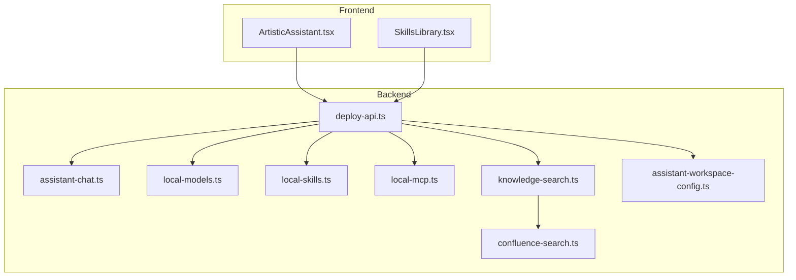
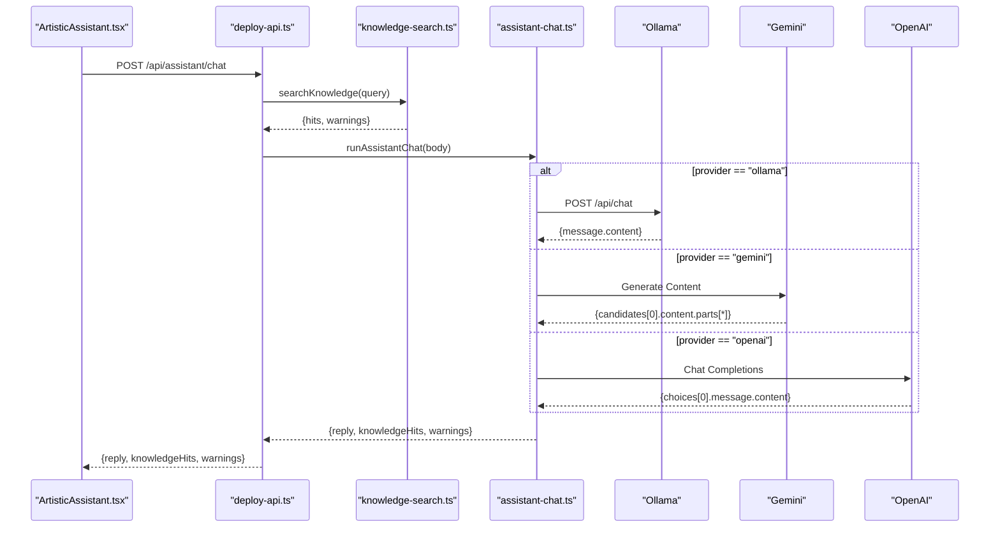
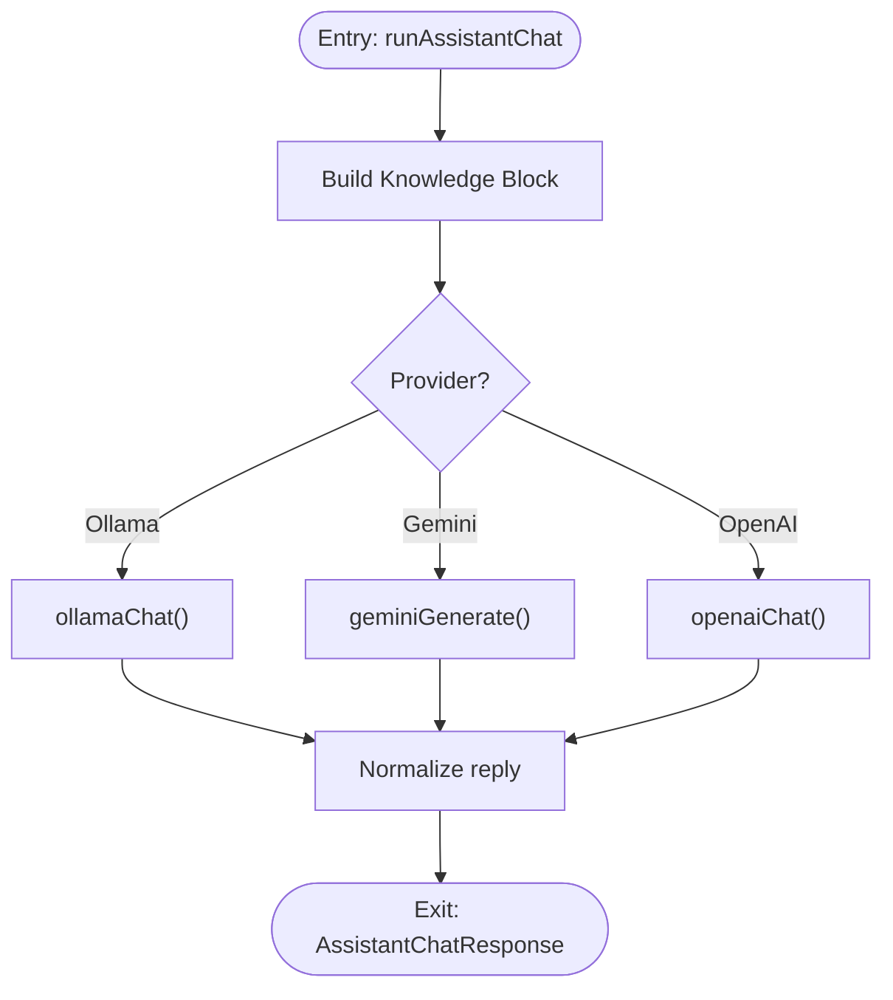
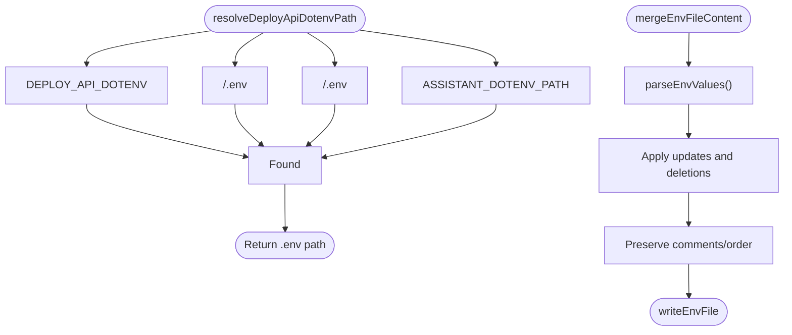
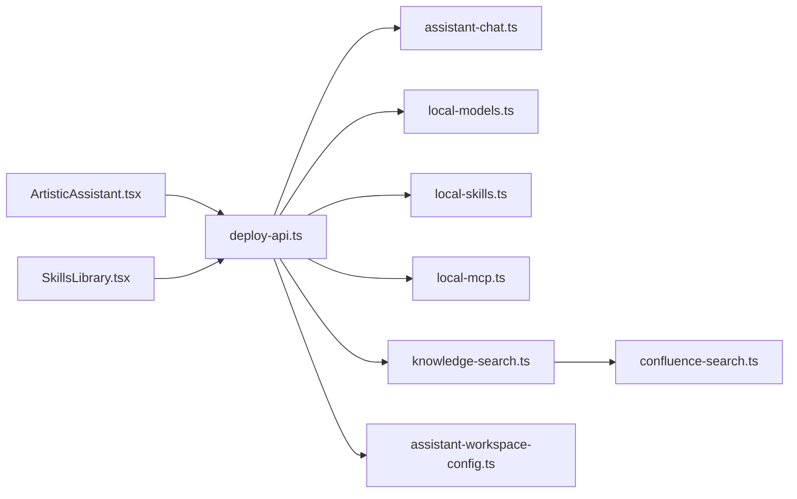

# AI Assistant and Local Model Services

<cite>
**Referenced Files in This Document**
- [assistant-chat.ts](file://server/assistant-chat.ts)
- [local-models.ts](file://server/local-models.ts)
- [local-skills.ts](file://server/local-skills.ts)
- [local-mcp.ts](file://server/local-mcp.ts)
- [knowledge-search.ts](file://server/knowledge-search.ts)
- [confluence-search.ts](file://server/confluence-search.ts)
- [assistant-workspace-config.ts](file://server/assistant-workspace-config.ts)
- [ArtisticAssistant.tsx](file://src/pages/ArtisticAssistant.tsx)
- [SkillsLibrary.tsx](file://src/pages/SkillsLibrary.tsx)
- [deploy-api.ts](file://server/deploy-api.ts)
- [package.json](file://package.json)
</cite>

## Table of Contents
1. [Introduction](#introduction)
2. [Project Structure](#project-structure)
3. [Core Components](#core-components)
4. [Architecture Overview](#architecture-overview)
5. [Detailed Component Analysis](#detailed-component-analysis)
6. [Dependency Analysis](#dependency-analysis)
7. [Performance Considerations](#performance-considerations)
8. [Troubleshooting Guide](#troubleshooting-guide)
9. [Conclusion](#conclusion)
10. [Appendices](#appendices)

## Introduction
This document describes the AI assistant services and local model management capabilities of the project. It covers:
- Assistant chat implementation with provider abstraction (Ollama, Gemini, OpenAI), conversation management, and response handling
- Local model scanning and registration for Ollama and LM Studio
- Local skills discovery and execution framework with markdown-based skill specifications
- MCP (Model Context Protocol) server integration for external AI model access
- Knowledge search system supporting local directories, Confluence, and generic HTTP bridges
- Assistant workspace configuration management and environment variable handling

The system is composed of a React frontend and a Node.js/Express backend. The frontend exposes two primary pages: the AI assistant chat and the local resources library (skills, MCP, models). The backend exposes REST APIs for assistant chat, knowledge search, local resource discovery, and workspace configuration.

## Project Structure
The project follows a frontend/backend split with a dedicated server-side module for assistant and knowledge services.



**Diagram sources**
- [deploy-api.ts:958-1150](file://server/deploy-api.ts#L958-L1150)
- [assistant-chat.ts:160-202](file://server/assistant-chat.ts#L160-L202)
- [local-models.ts:124-177](file://server/local-models.ts#L124-L177)
- [local-skills.ts:205-236](file://server/local-skills.ts#L205-L236)
- [local-mcp.ts:71-105](file://server/local-mcp.ts#L71-L105)
- [knowledge-search.ts:260-332](file://server/knowledge-search.ts#L260-L332)
- [confluence-search.ts:51-88](file://server/confluence-search.ts#L51-L88)
- [assistant-workspace-config.ts:8-31](file://server/assistant-workspace-config.ts#L8-L31)

**Section sources**
- [package.json:9-29](file://package.json#L9-L29)
- [deploy-api.ts:958-1150](file://server/deploy-api.ts#L958-L1150)

## Core Components
- Assistant chat service: Provider-agnostic chat orchestration, knowledge injection, and response normalization
- Local model scanner: Discovers Ollama and LM Studio models via CLI and filesystem
- Local skills scanner: Finds markdown-based skills across curated directories
- MCP scanner: Parses Cursor MCP configurations for external model servers
- Knowledge search: Multi-source retrieval (local, Confluence, HTTP bridges)
- Workspace configuration: Environment file resolution, parsing, merging, and secret handling

**Section sources**
- [assistant-chat.ts:160-202](file://server/assistant-chat.ts#L160-L202)
- [local-models.ts:124-177](file://server/local-models.ts#L124-L177)
- [local-skills.ts:205-236](file://server/local-skills.ts#L205-L236)
- [local-mcp.ts:71-105](file://server/local-mcp.ts#L71-L105)
- [knowledge-search.ts:260-332](file://server/knowledge-search.ts#L260-L332)
- [assistant-workspace-config.ts:8-31](file://server/assistant-workspace-config.ts#L8-L31)

## Architecture Overview
The assistant chat flow integrates knowledge retrieval, provider selection, and streaming-like response handling. The frontend sends requests to backend endpoints, which coordinate providers and knowledge sources.



**Diagram sources**
- [ArtisticAssistant.tsx:135-174](file://src/pages/ArtisticAssistant.tsx#L135-L174)
- [deploy-api.ts:1108-1150](file://server/deploy-api.ts#L1108-L1150)
- [knowledge-search.ts:260-332](file://server/knowledge-search.ts#L260-L332)
- [assistant-chat.ts:160-202](file://server/assistant-chat.ts#L160-L202)

## Detailed Component Analysis

### Assistant Chat Implementation
- Provider abstraction supports Ollama, Gemini, and OpenAI
- Conversation management normalizes roles and limits message sizes
- Knowledge injection builds a contextual block from retrieved hits
- Response handling validates provider keys and returns normalized replies



**Diagram sources**
- [assistant-chat.ts:160-202](file://server/assistant-chat.ts#L160-L202)
- [assistant-chat.ts:47-72](file://server/assistant-chat.ts#L47-L72)
- [assistant-chat.ts:74-115](file://server/assistant-chat.ts#L74-L115)
- [assistant-chat.ts:117-158](file://server/assistant-chat.ts#L117-L158)

**Section sources**
- [assistant-chat.ts:160-202](file://server/assistant-chat.ts#L160-L202)
- [assistant-chat.ts:47-72](file://server/assistant-chat.ts#L47-L72)
- [assistant-chat.ts:74-115](file://server/assistant-chat.ts#L74-L115)
- [assistant-chat.ts:117-158](file://server/assistant-chat.ts#L117-L158)

### Local Model Scanning and Registration (Ollama and LM Studio)
- Ollama discovery via CLI and manifest cache
- LM Studio discovery via GGUF files under platform-specific directories
- Deduplication by model name or absolute path
- Sorting and warning aggregation for diagnostics

```mermaid
flowchart TD
ScanStart([scanLocalModels]) --> TryOllamaCli["Spawn 'ollama list'"]
TryOllamaCli --> ParseCli["parseOllamaList()"]
TryOllamaCli --> Manifest["scanOllamaManifestModels()"]
ScanStart --> LmRoots["lmStudioModelRoots()"]
LmRoots --> WalkGguf["walkGguf() recurse .gguf"]
ParseCli --> Merge["Merge unique models"]
Manifest --> Merge
WalkGguf --> Merge
Merge --> Sort["Sort by name"]
Sort --> Return([Return {models, rootsTried, warnings}])
```

**Diagram sources**
- [local-models.ts:124-177](file://server/local-models.ts#L124-L177)
- [local-models.ts:21-37](file://server/local-models.ts#L21-L37)
- [local-models.ts:39-70](file://server/local-models.ts#L39-L70)
- [local-models.ts:115-122](file://server/local-models.ts#L115-L122)
- [local-models.ts:72-113](file://server/local-models.ts#L72-L113)

**Section sources**
- [local-models.ts:124-177](file://server/local-models.ts#L124-L177)

### Local Skills Discovery and Execution Framework
- Scans curated directories for SKILL.md files
- Parses YAML frontmatter and extracts readable descriptions
- Traverses filesystem up to a configurable depth, skipping common folders
- Aggregates warnings and sorts results

```mermaid
flowchart TD
ScanSkills([scanLocalSkills]) --> Roots["Resolve roots (~/.claude, ~/.cursor, ~/.agents, ~/.codex)"]
Roots --> Exists{"Directory exists?"}
Exists --> |No| Warn["Record warning"] --> NextRoot["Next root"]
Exists --> |Yes| Traverse["walk() traverse tree"]
Traverse --> Found{"SKILL.md present?"}
Found --> |Yes| Parse["parseSkillFrontmatter() + extractSkillIntroFromMarkdown()"]
Parse --> Add["Add LocalSkillEntry"]
Found --> |No| NextDir["Recurse deeper"]
Add --> NextDir
NextDir --> Done{"Max depth reached?"}
Done --> |No| Traverse
Done --> |Yes| Sort["Sort by displayName, path"]
Sort --> Return([Return {skills, rootsTried, warnings}])
```

**Diagram sources**
- [local-skills.ts:205-236](file://server/local-skills.ts#L205-L236)
- [local-skills.ts:124-197](file://server/local-skills.ts#L124-L197)
- [local-skills.ts:40-57](file://server/local-skills.ts#L40-L57)
- [local-skills.ts:75-122](file://server/local-skills.ts#L75-L122)

**Section sources**
- [local-skills.ts:205-236](file://server/local-skills.ts#L205-L236)
- [local-skills.ts:40-57](file://server/local-skills.ts#L40-L57)
- [local-skills.ts:75-122](file://server/local-skills.ts#L75-L122)

### MCP (Model Context Protocol) Server Integration
- Parses Cursor MCP configuration files for user and project scopes
- Extracts server entries with command/url/args preview
- Handles duplicate paths and aggregates warnings

```mermaid
flowchart TD
ScanMcp([scanLocalMcp]) --> UserCfg["Read ~/.cursor/mcp.json"]
ScanMcp --> ProjCfg["Read .cursor/mcp.json (repo root)"]
UserCfg --> ParseUser["parseMcpFile()"]
ProjCfg --> ParseProj["parseMcpFile()"]
ParseUser --> Merge["Collect servers"]
ParseProj --> Merge
Merge --> Sort["Sort by kind, name"]
Sort --> Return([Return {servers, configsTried, warnings}])
```

**Diagram sources**
- [local-mcp.ts:71-105](file://server/local-mcp.ts#L71-L105)
- [local-mcp.ts:32-69](file://server/local-mcp.ts#L32-L69)

**Section sources**
- [local-mcp.ts:71-105](file://server/local-mcp.ts#L71-L105)

### Knowledge Search System (Local and Confluence)
- Local search scans configured directories and files, filters by text terms, and excerpts content
- Confluence search uses CQL to query pages/blogposts with robust credential fallback
- HTTP bridge search supports multiple endpoints with template expansion
- Unified result normalization and capped hit counts

```mermaid
flowchart TD
StartKS([searchKnowledge]) --> Terms["termsFromQuery()"]
Terms --> Roots["parseLocalRoots()"]
Roots --> LocalWalk["walkLocal()"]
LocalWalk --> HitsLocal["Local hits"]
StartKS --> Confluence["isConfluenceSearchConfigured()"]
Confluence --> |Yes| CfSearch["searchConfluenceFullText()"]
Confluence --> |No| HttpBridge["parseRemoteSearchTemplates()"]
CfSearch --> Merge["Merge hits"]
HttpBridge --> HttpSearch["searchAllHttpBridges()"]
HttpSearch --> Merge
Merge --> Limit["Cap to 16 hits"]
Limit --> ReturnKS([Return {hits, warnings}])
```

**Diagram sources**
- [knowledge-search.ts:260-332](file://server/knowledge-search.ts#L260-L332)
- [knowledge-search.ts:67-135](file://server/knowledge-search.ts#L67-L135)
- [knowledge-search.ts:137-157](file://server/knowledge-search.ts#L137-L157)
- [knowledge-search.ts:190-257](file://server/knowledge-search.ts#L190-L257)
- [confluence-search.ts:135-203](file://server/confluence-search.ts#L135-L203)

**Section sources**
- [knowledge-search.ts:260-332](file://server/knowledge-search.ts#L260-L332)
- [confluence-search.ts:135-203](file://server/confluence-search.ts#L135-L203)

### Assistant Workspace Configuration Management and Environment Variables
- Resolves .env location with precedence across multiple paths
- Loads project catalog JSON for assistant project mapping
- Exposes UI-safe environment fields with secret detection
- Merges updates to .env while preserving comments and order



**Diagram sources**
- [assistant-workspace-config.ts:8-31](file://server/assistant-workspace-config.ts#L8-L31)
- [assistant-workspace-config.ts:114-135](file://server/assistant-workspace-config.ts#L114-L135)
- [assistant-workspace-config.ts:153-187](file://server/assistant-workspace-config.ts#L153-L187)

**Section sources**
- [assistant-workspace-config.ts:8-31](file://server/assistant-workspace-config.ts#L8-L31)
- [assistant-workspace-config.ts:114-135](file://server/assistant-workspace-config.ts#L114-L135)
- [assistant-workspace-config.ts:153-187](file://server/assistant-workspace-config.ts#L153-L187)

## Dependency Analysis
The backend orchestrates multiple modules and exposes REST endpoints for the frontend.



**Diagram sources**
- [deploy-api.ts:958-1150](file://server/deploy-api.ts#L958-L1150)
- [ArtisticAssistant.tsx:70-91](file://src/pages/ArtisticAssistant.tsx#L70-L91)
- [SkillsLibrary.tsx:216-250](file://src/pages/SkillsLibrary.tsx#L216-L250)

**Section sources**
- [deploy-api.ts:958-1150](file://server/deploy-api.ts#L958-L1150)

## Performance Considerations
- Request timeouts are enforced for external provider calls and knowledge bridges to prevent hanging
- Message length and count limits protect downstream providers
- File traversal caps and hit limits bound local search cost
- Confluence queries are constrained by page size and HTML stripping reduces noise
- Environment file merges preserve order and avoid unnecessary writes

[No sources needed since this section provides general guidance]

## Troubleshooting Guide
Common issues and remedies:
- Missing provider keys: Ensure environment variables for providers are set; the backend returns 503 when keys are absent
- Knowledge base not configured: Configure local directories, Confluence, or HTTP bridges; warnings guide setup
- Ollama connectivity: Verify host and model availability; the assistant lists available Ollama models
- Environment file conflicts: Use the workspace configuration endpoints to merge updates safely

**Section sources**
- [assistant-chat.ts:74-76](file://server/assistant-chat.ts#L74-L76)
- [assistant-chat.ts:1132-1149](file://server/assistant-chat.ts#L1132-L1149)
- [knowledge-search.ts:274-278](file://server/knowledge-search.ts#L274-L278)
- [assistant-workspace-config.ts:153-187](file://server/assistant-workspace-config.ts#L153-L187)

## Conclusion
The system provides a cohesive AI assistant experience with flexible provider support, robust knowledge retrieval across local and external sources, and comprehensive local resource discovery. The backend’s modular design and the frontend’s straightforward integration enable iterative enhancements and reliable operation in development and desktop environments.

[No sources needed since this section summarizes without analyzing specific files]

## Appendices

### API Surface for Assistant and Knowledge
- GET /api/assistant/options: Returns provider availability and knowledge configuration hints
- POST /api/assistant/chat: Streams or returns assistant reply with optional knowledge hits
- POST /api/knowledge/search: Searches knowledge base without invoking models
- GET /api/local-skills: Lists discovered skills
- GET /api/local-mcp: Lists MCP server configurations
- GET /api/local-models: Lists discovered local models
- GET /api/assistant/project-catalog: Reads project catalog entries
- PUT /api/assistant/project-catalog: Writes project catalog entries
- GET /api/assistant/env-ui: Reads UI-safe environment fields
- POST /api/assistant/env-ui: Merges environment updates

**Section sources**
- [deploy-api.ts:958-1150](file://server/deploy-api.ts#L958-L1150)
- [deploy-api.ts:1500-1735](file://server/deploy-api.ts#L1500-L1735)