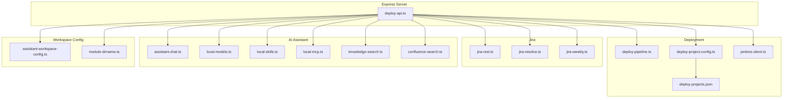
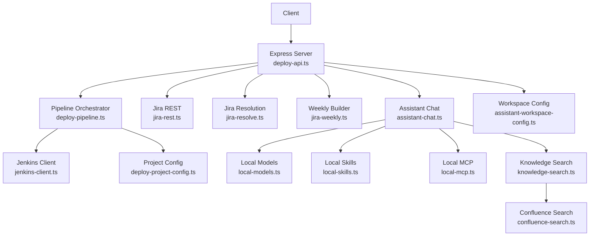
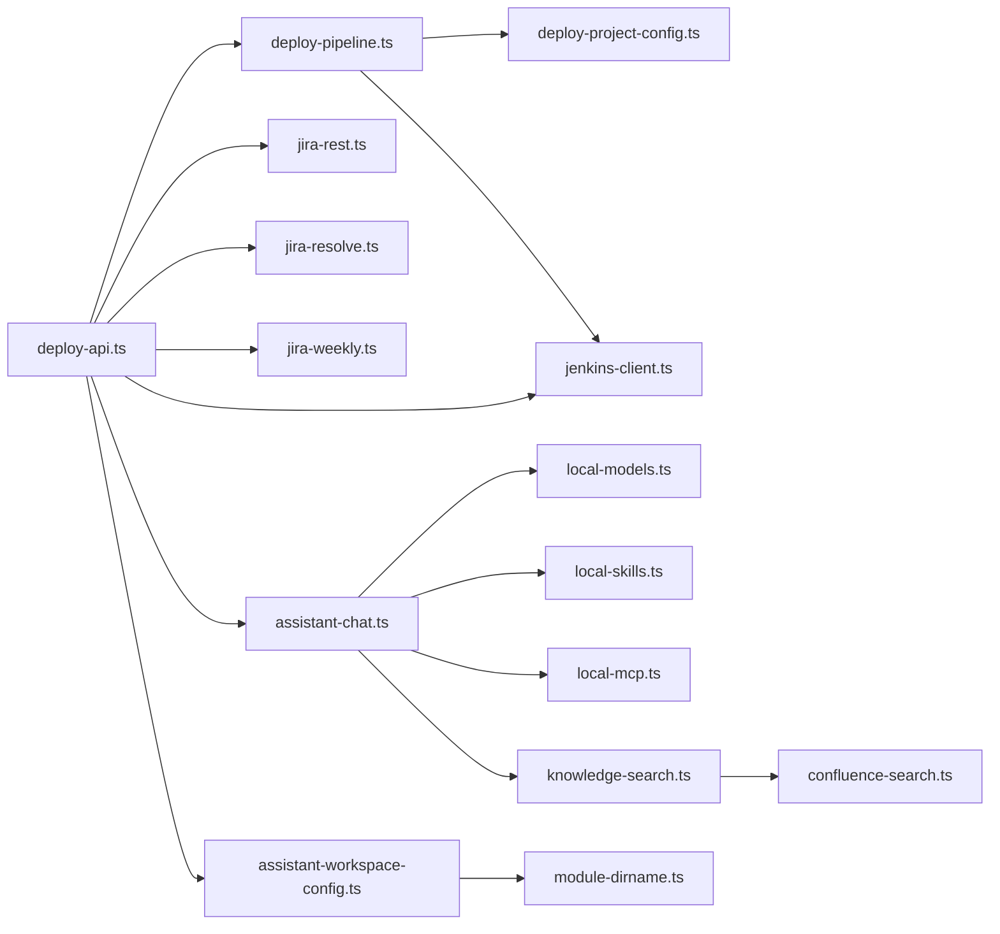

# API Endpoint Reference

<cite>
**Referenced Files in This Document**
- [server/deploy-api.ts](file://server/deploy-api.ts)
- [server/deploy-pipeline.ts](file://server/deploy-pipeline.ts)
- [server/deploy-project-config.ts](file://server/deploy-project-config.ts)
- [server/jenkins-client.ts](file://server/jenkins-client.ts)
- [server/jira-rest.ts](file://server/jira-rest.ts)
- [server/jira-resolve.ts](file://server/jira-resolve.ts)
- [server/jira-weekly.ts](file://server/jira-weekly.ts)
- [server/local-models.ts](file://server/local-models.ts)
- [server/local-skills.ts](file://server/local-skills.ts)
- [server/local-mcp.ts](file://server/local-mcp.ts)
- [server/assistant-chat.ts](file://server/assistant-chat.ts)
- [server/knowledge-search.ts](file://server/knowledge-search.ts)
- [server/confluence-search.ts](file://server/confluence-search.ts)
- [server/assistant-workspace-config.ts](file://server/assistant-workspace-config.ts)
- [server/module-dirname.ts](file://server/module-dirname.ts)
- [config/deploy-projects.json](file://config/deploy-projects.json)
</cite>

## Table of Contents
1. [Introduction](#introduction)
2. [Project Structure](#project-structure)
3. [Core Components](#core-components)
4. [Architecture Overview](#architecture-overview)
5. [Detailed Component Analysis](#detailed-component-analysis)
6. [Dependency Analysis](#dependency-analysis)
7. [Performance Considerations](#performance-considerations)
8. [Troubleshooting Guide](#troubleshooting-guide)
9. [Conclusion](#conclusion)
10. [Appendices](#appendices)

## Introduction
This document provides a comprehensive API reference for the backend service exposed by the deployment and automation subsystem. It covers:
- Deployment management endpoints for pipeline control, project configuration, and Jenkins integration
- Jira integration endpoints for issue tracking and reporting
- AI assistant endpoints for local model management, skill execution, and MCP server operations
- Development environment endpoints for startup orchestration and process management

Each endpoint group includes endpoint organization, request/response schemas, authentication requirements, error codes, and usage patterns. The goal is to enable developers and operators to integrate with the backend reliably and efficiently.

## Project Structure
The backend is implemented as a Node.js Express server with modularized concerns:
- Pipeline orchestration and runtime state
- Jenkins integration helpers
- Jira REST utilities and weekly summaries
- Local AI assets discovery (models, skills, MCP servers)
- Knowledge search and Confluence integration
- Assistant chat routing and model options
- Workspace configuration and environment management
- Project configuration for deployments

**Diagram sources**
- [server/deploy-api.ts:1-120](file://server/deploy-api.ts#L1-L120)
- [server/deploy-pipeline.ts:1-60](file://server/deploy-pipeline.ts#L1-L60)
- [server/deploy-project-config.ts:1-60](file://server/deploy-project-config.ts#L1-L60)
- [server/jenkins-client.ts:1-60](file://server/jenkins-client.ts#L1-L60)
- [server/jira-rest.ts:1-60](file://server/jira-rest.ts#L1-L60)
- [server/jira-resolve.ts:1-60](file://server/jira-resolve.ts#L1-L60)
- [server/jira-weekly.ts:1-60](file://server/jira-weekly.ts#L1-L60)
- [server/assistant-chat.ts:1-60](file://server/assistant-chat.ts#L1-L60)
- [server/local-models.ts:1-60](file://server/local-models.ts#L1-L60)
- [server/local-skills.ts:1-60](file://server/local-skills.ts#L1-L60)
- [server/local-mcp.ts:1-60](file://server/local-mcp.ts#L1-L60)
- [server/knowledge-search.ts:1-60](file://server/knowledge-search.ts#L1-L60)
- [server/confluence-search.ts:1-60](file://server/confluence-search.ts#L1-L60)
- [server/assistant-workspace-config.ts:1-60](file://server/assistant-workspace-config.ts#L1-L60)
- [server/module-dirname.ts:1-23](file://server/module-dirname.ts#L1-L23)
- [config/deploy-projects.json:1-40](file://config/deploy-projects.json#L1-L40)

**Section sources**
- [server/deploy-api.ts:1-120](file://server/deploy-api.ts#L1-L120)
- [server/deploy-pipeline.ts:1-60](file://server/deploy-pipeline.ts#L1-L60)
- [server/deploy-project-config.ts:1-60](file://server/deploy-project-config.ts#L1-L60)
- [server/jenkins-client.ts:1-60](file://server/jenkins-client.ts#L1-L60)
- [server/jira-rest.ts:1-60](file://server/jira-rest.ts#L1-L60)
- [server/jira-resolve.ts:1-60](file://server/jira-resolve.ts#L1-L60)
- [server/jira-weekly.ts:1-60](file://server/jira-weekly.ts#L1-L60)
- [server/assistant-chat.ts:1-60](file://server/assistant-chat.ts#L1-L60)
- [server/local-models.ts:1-60](file://server/local-models.ts#L1-L60)
- [server/local-skills.ts:1-60](file://server/local-skills.ts#L1-L60)
- [server/local-mcp.ts:1-60](file://server/local-mcp.ts#L1-L60)
- [server/knowledge-search.ts:1-60](file://server/knowledge-search.ts#L1-L60)
- [server/confluence-search.ts:1-60](file://server/confluence-search.ts#L1-L60)
- [server/assistant-workspace-config.ts:1-60](file://server/assistant-workspace-config.ts#L1-L60)
- [server/module-dirname.ts:1-23](file://server/module-dirname.ts#L1-L23)
- [config/deploy-projects.json:1-40](file://config/deploy-projects.json#L1-L40)

## Core Components
- Express server bootstrap and middleware registration
- Environment loading and workspace configuration utilities
- Startup orchestration for development environments
- Deployment pipeline orchestration and Jenkins triggers
- Jira REST clients and weekly report builders
- AI assistant chat providers and knowledge retrieval
- Local asset scanners for models, skills, and MCP servers
- Confluence search integration

**Section sources**
- [server/deploy-api.ts:65-95](file://server/deploy-api.ts#L65-L95)
- [server/assistant-workspace-config.ts:8-31](file://server/assistant-workspace-config.ts#L8-L31)
- [server/module-dirname.ts:10-22](file://server/module-dirname.ts#L10-L22)

## Architecture Overview
The backend exposes a cohesive set of REST endpoints organized by domain. Internally, each domain module encapsulates its own concerns and integrates with shared utilities for environment and configuration.

**Diagram sources**
- [server/deploy-api.ts:75-120](file://server/deploy-api.ts#L75-L120)
- [server/deploy-pipeline.ts:1-60](file://server/deploy-pipeline.ts#L1-L60)
- [server/jenkins-client.ts:1-60](file://server/jenkins-client.ts#L1-L60)
- [server/deploy-project-config.ts:1-60](file://server/deploy-project-config.ts#L1-L60)
- [server/jira-rest.ts:1-60](file://server/jira-rest.ts#L1-L60)
- [server/jira-resolve.ts:1-60](file://server/jira-resolve.ts#L1-L60)
- [server/jira-weekly.ts:1-60](file://server/jira-weekly.ts#L1-L60)
- [server/assistant-chat.ts:1-60](file://server/assistant-chat.ts#L1-L60)
- [server/local-models.ts:1-60](file://server/local-models.ts#L1-L60)
- [server/local-skills.ts:1-60](file://server/local-skills.ts#L1-L60)
- [server/local-mcp.ts:1-60](file://server/local-mcp.ts#L1-L60)
- [server/knowledge-search.ts:1-60](file://server/knowledge-search.ts#L1-L60)
- [server/confluence-search.ts:1-60](file://server/confluence-search.ts#L1-L60)
- [server/assistant-workspace-config.ts:1-60](file://server/assistant-workspace-config.ts#L1-L60)

## Detailed Component Analysis

### Deployment Management Endpoints
Endpoints for pipeline control, project configuration, and Jenkins integration.

- Base URL: http://localhost:DEPLOY_API_PORT
- Port default: 8787 (overridable via DEPLOY_API_PORT)

#### Pipeline Control
- POST /api/deploy/pipeline/start
  - Purpose: Start a deployment pipeline for one or more projects
  - Request body:
    - projectIds: array of project identifiers
    - jiraId?: optional Jira issue key
    - branch?: optional branch override
  - Response:
    - ok: boolean
    - runId: string (when ok=true)
    - error/status: string/number (when ok=false)
  - Notes:
    - Validates projectIds and resolves targets from project configuration
    - Triggers Jenkins jobs sequentially per project
    - Emits run events and snapshots
  - Example usage:
    - Start a pipeline for projects ["biz-core", "saas-cc-web"] with optional Jira and branch overrides

- GET /api/deploy/pipeline/{runId}
  - Purpose: Retrieve a pipeline run snapshot
  - Path params:
    - runId: pipeline run identifier
  - Response:
    - id, status, taskKey, jiraId, branch, nodes, events, eventCount, activeNodeId, createdAt
  - Notes:
    - Returns a capped snapshot of recent events

- GET /api/deploy/pipeline/stats
  - Purpose: Get sorted task statistics (usage counts and last run timestamps)
  - Response:
    - Array of { taskKey, count, lastRunAt }

- GET /api/deploy/projects
  - Purpose: List available deploy projects with default branches
  - Response:
    - Array of { id, label, defaultBranch }

- GET /api/deploy/project-config
  - Purpose: Load and validate current project configuration
  - Response:
    - defaults: { branch, jenkinsBaseUrl, jiraParamName, branchParamName }
    - projects: map of DeployProject
    - jiraBranchRules: array of JiraBranchRule

- GET /api/deploy/jenkins-auth
  - Purpose: Validate Jenkins credentials from environment
  - Response:
    - ok: boolean
    - config or error details

- POST /api/deploy/jenkins/trigger
  - Purpose: Trigger a Jenkins job with parameters
  - Request body:
    - jenkinsBaseUrl, user, token, jobSegments, parameters, pollQueue, pollTimeoutMs
  - Response:
    - queueUrl/buildUrl/buildNumber or error

- GET /api/deploy/jenkins/poll-build
  - Purpose: Poll a build until completion
  - Query params:
    - buildUrl, timeoutMs?, intervalMs?
  - Response:
    - building, result, duration or error

- GET /api/deploy/jira-to-jenkins
  - Purpose: Resolve Jira components to Jenkins job path segments
  - Query params:
    - issueKey, componentMapJson?, fallbackNodesCsv?
  - Response:
    - nodes: string[]
    - source: 'jira' | 'fallback'
    - components?: string[]
    - message?: string

- POST /api/deploy/jira/submit-test-transition
  - Purpose: Submit an issue to a testing transition
  - Request body:
    - issueKey
  - Response:
    - ok: boolean
    - transitionId, transitionName or error/availableTransitions

- POST /api/deploy/jira/search
  - Purpose: Search Jira issues via REST
  - Request body:
    - jql, maxResults?, fields?
  - Response:
    - issues: array of JiraSearchIssue
    - total: number
    - error?: string

- GET /api/deploy/jira/weekly-summary
  - Purpose: Build a weekly summary markdown for issues touched
  - Query params:
    - weekOffset?, now?
  - Response:
    - markdown string

- GET /api/deploy/jira/weekly-jql
  - Purpose: Compute date range JQL for a week
  - Query params:
    - weekOffset?, now?
  - Response:
    - { fromYmd, toYmdExclusive, labelZh }

- Authentication:
  - None required for most endpoints
  - Jenkins and Jira endpoints rely on environment variables for credentials

- Error codes:
  - 400: Validation errors (invalid project ids, invalid Jira key, invalid branch)
  - 503: Missing credentials/configuration (Jenkins)
  - Other HTTP statuses returned from external services

**Section sources**
- [server/deploy-api.ts:186-223](file://server/deploy-api.ts#L186-L223)
- [server/deploy-pipeline.ts:149-180](file://server/deploy-pipeline.ts#L149-L180)
- [server/deploy-pipeline.ts:182-223](file://server/deploy-pipeline.ts#L182-L223)
- [server/deploy-pipeline.ts:225-418](file://server/deploy-pipeline.ts#L225-L418)
- [server/deploy-project-config.ts:176-189](file://server/deploy-project-config.ts#L176-L189)
- [server/deploy-project-config.ts:212-236](file://server/deploy-project-config.ts#L212-L236)
- [server/jenkins-client.ts:89-142](file://server/jenkins-client.ts#L89-L142)
- [server/jenkins-client.ts:148-190](file://server/jenkins-client.ts#L148-L190)
- [server/jira-resolve.ts:47-129](file://server/jira-resolve.ts#L47-L129)
- [server/jira-rest.ts:181-278](file://server/jira-rest.ts#L181-L278)
- [server/jira-rest.ts:357-482](file://server/jira-rest.ts#L357-L482)
- [server/jira-weekly.ts:39-65](file://server/jira-weekly.ts#L39-L65)
- [server/jira-weekly.ts:67-112](file://server/jira-weekly.ts#L67-L112)

### Jira Integration Endpoints
- GET /api/jira/auth
  - Purpose: Validate Jira authentication configuration
  - Response:
    - ok: boolean
    - baseUrl/apiPrefix/authHeader or reason

- GET /api/jira/search
  - Purpose: Search Jira issues
  - Request body:
    - jql, maxResults?, fields?
  - Response:
    - issues, total, error?

- POST /api/jira/submit-test-transition
  - Purpose: Transition an issue to a testing state
  - Request body:
    - issueKey
  - Response:
    - ok: boolean
    - transitionId/transitionName or error/availableTransitions

- GET /api/jira/weekly-summary
  - Purpose: Generate weekly summary markdown
  - Query params:
    - weekOffset?, now?
  - Response:
    - markdown string

- GET /api/jira/weekly-jql
  - Purpose: Compute JQL date range for a week
  - Query params:
    - weekOffset?, now?
  - Response:
    - { fromYmd, toYmdExclusive, labelZh }

- Authentication:
  - Uses JIRA_SERVER_URL, JIRA_USERNAME, JIRA_PASSWORD or JIRA_API_TOKEN
  - Supports fallback to JENKINS_USER when appropriate

**Section sources**
- [server/jira-rest.ts:34-85](file://server/jira-rest.ts#L34-L85)
- [server/jira-rest.ts:181-278](file://server/jira-rest.ts#L181-L278)
- [server/jira-rest.ts:357-482](file://server/jira-rest.ts#L357-L482)
- [server/jira-weekly.ts:39-65](file://server/jira-weekly.ts#L39-L65)
- [server/jira-weekly.ts:67-112](file://server/jira-weekly.ts#L67-L112)

### AI Assistant Endpoints
- POST /api/assistant/chat
  - Purpose: Chat with an assistant provider (Ollama, OpenAI, Gemini)
  - Request body:
    - messages: array of { role, content }
    - provider: 'ollama' | 'gemini' | 'openai'
    - model: string
    - retrieveKnowledge?: boolean
    - ollamaBase?: string (optional)
  - Response:
    - reply: string
    - knowledgeHits: array of KnowledgeHit
    - warnings: string[]
  - Notes:
    - When retrieveKnowledge=true, searches knowledge base and injects results
    - Supports local Ollama, OpenAI, and Gemini backends

- GET /api/assistant/models
  - Purpose: List available Ollama model options
  - Response:
    - Array of { name }

- GET /api/assistant/skills
  - Purpose: Scan and list local skills
  - Response:
    - skills: array of LocalSkillEntry
    - rootsTried: array of { source, path, exists }
    - warnings: string[]

- GET /api/assistant/mcp
  - Purpose: Scan and list local MCP servers
  - Response:
    - servers: array of LocalMcpServerEntry
    - configsTried: array of { kind, path, exists }
    - warnings: string[]

- GET /api/assistant/knowledge-search
  - Purpose: Search knowledge base (local files, Confluence, HTTP bridges)
  - Query params:
    - q: query string
  - Response:
    - hits: array of KnowledgeHit
    - warnings: string[]

- GET /api/assistant/confluence-config
  - Purpose: Validate Confluence search configuration
  - Response:
    - ok: boolean
    - restRoot/siteBase/authHeader or reason

- Authentication:
  - None required for assistant endpoints
  - Providers require API keys via environment variables (OPENAI_API_KEY, GEMINI_API_KEY, etc.)

**Section sources**
- [server/assistant-chat.ts:13-25](file://server/assistant-chat.ts#L13-L25)
- [server/assistant-chat.ts:160-202](file://server/assistant-chat.ts#L160-L202)
- [server/assistant-chat.ts:204-214](file://server/assistant-chat.ts#L204-L214)
- [server/local-models.ts:124-177](file://server/local-models.ts#L124-L177)
- [server/local-skills.ts:205-236](file://server/local-skills.ts#L205-L236)
- [server/local-mcp.ts:71-105](file://server/local-mcp.ts#L71-L105)
- [server/knowledge-search.ts:260-332](file://server/knowledge-search.ts#L260-L332)
- [server/confluence-search.ts:51-88](file://server/confluence-search.ts#L51-L88)

### Development Environment Endpoints
- POST /api/startup/runs
  - Purpose: Start a development startup run
  - Request body:
    - ide: string (IDE command)
    - projects: array of { name, path, branch, installCmd, runCmd }
    - smartInstall: boolean
    - openDevInTerminal: boolean
  - Response:
    - Run created with initial events and status

- GET /api/startup/runs/{runId}
  - Purpose: Stream or fetch startup run logs/events
  - Path params:
    - runId: startup run identifier
  - Response:
    - Run snapshot with events

- POST /api/startup/runs/{runId}/stop
  - Purpose: Stop a running startup run
  - Path params:
    - runId: startup run identifier
  - Response:
    - Number of terminated processes

- GET /api/startup/automation-tasks
  - Purpose: Get automation task configuration
  - Response:
    - Task configuration derived from environment variables

- Authentication:
  - None required

**Section sources**
- [server/deploy-api.ts:455-588](file://server/deploy-api.ts#L455-L588)
- [server/deploy-api.ts:177-189](file://server/deploy-api.ts#L177-L189)
- [server/deploy-api.ts:790-800](file://server/deploy-api.ts#L790-L800)

### Workspace Configuration Endpoints
- GET /api/workspace/env-dotenv-path
  - Purpose: Resolve the active .env path used by the backend
  - Response:
    - Path string or null

- GET /api/workspace/env-dotenv-writable-path
  - Purpose: Resolve the writable .env path
  - Response:
    - Path string

- GET /api/workspace/project-catalog
  - Purpose: Load project catalog entries
  - Response:
    - Array of ProjectCatalogEntry

- POST /api/workspace/project-catalog
  - Purpose: Save project catalog entries
  - Request body:
    - entries: array of ProjectCatalogEntry
  - Response:
    - Success confirmation

- GET /api/workspace/env-keys
  - Purpose: List supported environment keys for UI
  - Response:
    - Array of keys

- POST /api/workspace/env-merge
  - Purpose: Merge updates into .env content
  - Request body:
    - updates: Record<string,string>
    - removeKeys: string[]
  - Response:
    - Updated .env content

- Authentication:
  - None required

**Section sources**
- [server/assistant-workspace-config.ts:8-31](file://server/assistant-workspace-config.ts#L8-L31)
- [server/assistant-workspace-config.ts:54-77](file://server/assistant-workspace-config.ts#L54-L77)
- [server/assistant-workspace-config.ts:114-135](file://server/assistant-workspace-config.ts#L114-L135)
- [server/assistant-workspace-config.ts:153-187](file://server/assistant-workspace-config.ts#L153-L187)

## Dependency Analysis
- Pipeline orchestration depends on:
  - Project configuration loader
  - Jenkins client for triggering and polling builds
- Jira endpoints depend on:
  - Authentication resolver
  - Optional Confluence fallback for wiki search
- Assistant endpoints depend on:
  - Local asset scanners
  - Knowledge search bridge to Confluence and HTTP templates
- Startup endpoints orchestrate child processes and stream logs

**Diagram sources**
- [server/deploy-pipeline.ts:1-60](file://server/deploy-pipeline.ts#L1-L60)
- [server/deploy-project-config.ts:1-60](file://server/deploy-project-config.ts#L1-L60)
- [server/jenkins-client.ts:1-60](file://server/jenkins-client.ts#L1-L60)
- [server/deploy-api.ts:1-120](file://server/deploy-api.ts#L1-L120)
- [server/jira-rest.ts:1-60](file://server/jira-rest.ts#L1-L60)
- [server/jira-resolve.ts:1-60](file://server/jira-resolve.ts#L1-L60)
- [server/jira-weekly.ts:1-60](file://server/jira-weekly.ts#L1-L60)
- [server/assistant-chat.ts:1-60](file://server/assistant-chat.ts#L1-L60)
- [server/local-models.ts:1-60](file://server/local-models.ts#L1-L60)
- [server/local-skills.ts:1-60](file://server/local-skills.ts#L1-L60)
- [server/local-mcp.ts:1-60](file://server/local-mcp.ts#L1-L60)
- [server/knowledge-search.ts:1-60](file://server/knowledge-search.ts#L1-L60)
- [server/confluence-search.ts:1-60](file://server/confluence-search.ts#L1-L60)
- [server/assistant-workspace-config.ts:1-60](file://server/assistant-workspace-config.ts#L1-L60)
- [server/module-dirname.ts:1-23](file://server/module-dirname.ts#L1-L23)

**Section sources**
- [server/deploy-pipeline.ts:1-60](file://server/deploy-pipeline.ts#L1-L60)
- [server/deploy-project-config.ts:1-60](file://server/deploy-project-config.ts#L1-L60)
- [server/jenkins-client.ts:1-60](file://server/jenkins-client.ts#L1-L60)
- [server/deploy-api.ts:1-120](file://server/deploy-api.ts#L1-L120)
- [server/jira-rest.ts:1-60](file://server/jira-rest.ts#L1-L60)
- [server/jira-resolve.ts:1-60](file://server/jira-resolve.ts#L1-L60)
- [server/jira-weekly.ts:1-60](file://server/jira-weekly.ts#L1-L60)
- [server/assistant-chat.ts:1-60](file://server/assistant-chat.ts#L1-L60)
- [server/local-models.ts:1-60](file://server/local-models.ts#L1-L60)
- [server/local-skills.ts:1-60](file://server/local-skills.ts#L1-L60)
- [server/local-mcp.ts:1-60](file://server/local-mcp.ts#L1-L60)
- [server/knowledge-search.ts:1-60](file://server/knowledge-search.ts#L1-L60)
- [server/confluence-search.ts:1-60](file://server/confluence-search.ts#L1-L60)
- [server/assistant-workspace-config.ts:1-60](file://server/assistant-workspace-config.ts#L1-L60)
- [server/module-dirname.ts:1-23](file://server/module-dirname.ts#L1-L23)

## Performance Considerations
- Pipeline event buffering: Events are capped per run to limit memory usage
- Build polling intervals: Tunable via pollBuildUntilComplete parameters
- Knowledge search limits: Cap hits and file scanning depth to control latency
- Confluence search timeouts: Controlled via abort controller to prevent long waits
- Startup run process tracking: Tracks child processes and supports graceful termination

[No sources needed since this section provides general guidance]

## Troubleshooting Guide
- Jenkins authentication failures:
  - Verify JENKINS_URL, JENKINS_USER/JENKINS_USERNAME, JENKINS_TOKEN
  - Ensure Jenkins CSRF crumb is accessible
- Jira authentication failures:
  - Verify JIRA_SERVER_URL, JIRA_USERNAME, JIRA_PASSWORD or JIRA_API_TOKEN
  - Confirm API path prefix (rest/api/3 vs rest/api/2) if needed
- Pipeline stuck in queued:
  - Check Jenkins queue and job permissions
  - Review pipeline run events for queue URL and build URL
- Knowledge search empty results:
  - Ensure ASSISTANT_KB_LOCAL_DIRS or Confluence/Wiki templates are configured
  - Validate file extensions and sizes for local scans
- Startup run hangs:
  - Use stop endpoint to terminate child processes
  - Inspect logs for stderr/stdout filtering and dense progress dashboards

**Section sources**
- [server/jenkins-client.ts:71-87](file://server/jenkins-client.ts#L71-L87)
- [server/jira-rest.ts:106-148](file://server/jira-rest.ts#L106-L148)
- [server/deploy-pipeline.ts:331-342](file://server/deploy-pipeline.ts#L331-L342)
- [server/knowledge-search.ts:274-278](file://server/knowledge-search.ts#L274-L278)
- [server/deploy-api.ts:177-189](file://server/deploy-api.ts#L177-L189)

## Conclusion
This API reference consolidates the backend’s deployment, Jira, AI assistant, and development environment capabilities. By leveraging the documented endpoints, providers, and configuration options, teams can automate deployments, integrate with Jira, augment conversations with local knowledge, and streamline developer workflows.

[No sources needed since this section summarizes without analyzing specific files]

## Appendices

### Endpoint Catalog
- Deployment
  - POST /api/deploy/pipeline/start
  - GET /api/deploy/pipeline/{runId}
  - GET /api/deploy/pipeline/stats
  - GET /api/deploy/projects
  - GET /api/deploy/project-config
  - GET /api/deploy/jenkins-auth
  - POST /api/deploy/jenkins/trigger
  - GET /api/deploy/jenkins/poll-build
  - GET /api/deploy/jira-to-jenkins
  - POST /api/deploy/jira/submit-test-transition
  - POST /api/deploy/jira/search
  - GET /api/deploy/jira/weekly-summary
  - GET /api/deploy/jira/weekly-jql
- AI Assistant
  - POST /api/assistant/chat
  - GET /api/assistant/models
  - GET /api/assistant/skills
  - GET /api/assistant/mcp
  - GET /api/assistant/knowledge-search
  - GET /api/assistant/confluence-config
- Development Environment
  - POST /api/startup/runs
  - GET /api/startup/runs/{runId}
  - POST /api/startup/runs/{runId}/stop
  - GET /api/startup/automation-tasks
- Workspace Configuration
  - GET /api/workspace/env-dotenv-path
  - GET /api/workspace/env-dotenv-writable-path
  - GET /api/workspace/project-catalog
  - POST /api/workspace/project-catalog
  - GET /api/workspace/env-keys
  - POST /api/workspace/env-merge

**Section sources**
- [server/deploy-api.ts:186-223](file://server/deploy-api.ts#L186-L223)
- [server/deploy-pipeline.ts:149-180](file://server/deploy-pipeline.ts#L149-L180)
- [server/deploy-pipeline.ts:182-223](file://server/deploy-pipeline.ts#L182-L223)
- [server/deploy-project-config.ts:176-189](file://server/deploy-project-config.ts#L176-L189)
- [server/jenkins-client.ts:89-142](file://server/jenkins-client.ts#L89-L142)
- [server/jira-resolve.ts:47-129](file://server/jira-resolve.ts#L47-L129)
- [server/jira-rest.ts:181-278](file://server/jira-rest.ts#L181-L278)
- [server/jira-weekly.ts:39-65](file://server/jira-weekly.ts#L39-L65)
- [server/assistant-chat.ts:13-25](file://server/assistant-chat.ts#L13-L25)
- [server/local-models.ts:124-177](file://server/local-models.ts#L124-L177)
- [server/local-skills.ts:205-236](file://server/local-skills.ts#L205-L236)
- [server/local-mcp.ts:71-105](file://server/local-mcp.ts#L71-L105)
- [server/knowledge-search.ts:260-332](file://server/knowledge-search.ts#L260-L332)
- [server/confluence-search.ts:51-88](file://server/confluence-search.ts#L51-L88)
- [server/deploy-api.ts:455-588](file://server/deploy-api.ts#L455-L588)
- [server/assistant-workspace-config.ts:54-77](file://server/assistant-workspace-config.ts#L54-L77)
- [server/assistant-workspace-config.ts:114-135](file://server/assistant-workspace-config.ts#L114-L135)
- [server/assistant-workspace-config.ts:153-187](file://server/assistant-workspace-config.ts#L153-L187)

### Request/Response Examples

- Start Pipeline
  - Request:
    - POST /api/deploy/pipeline/start
    - Body: { projectIds: ["biz-core"], jiraId: "PROJ-123", branch: "test" }
  - Response:
    - { ok: true, runId: "uuid" }

- Get Pipeline Snapshot
  - Request:
    - GET /api/deploy/pipeline/{runId}
  - Response:
    - { id, status, taskKey, nodes, events, eventCount, activeNodeId, createdAt }

- Assistant Chat
  - Request:
    - POST /api/assistant/chat
    - Body: { messages: [{ role: "user", content: "Hello" }], provider: "ollama", model: "llama3:latest", retrieveKnowledge: true }
  - Response:
    - { reply, knowledgeHits, warnings }

- Startup Run
  - Request:
    - POST /api/startup/runs
    - Body: { ide: "open", projects: [{ name:"proj", path:"~/repo/proj", branch:"main", installCmd:"yarn install", runCmd:"yarn dev" }], smartInstall:true, openDevInTerminal:false }
  - Response:
    - Run created with initial events

**Section sources**
- [server/deploy-pipeline.ts:182-223](file://server/deploy-pipeline.ts#L182-L223)
- [server/deploy-pipeline.ts:149-180](file://server/deploy-pipeline.ts#L149-L180)
- [server/assistant-chat.ts:160-202](file://server/assistant-chat.ts#L160-L202)
- [server/deploy-api.ts:455-588](file://server/deploy-api.ts#L455-L588)