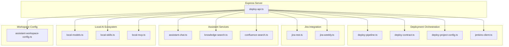
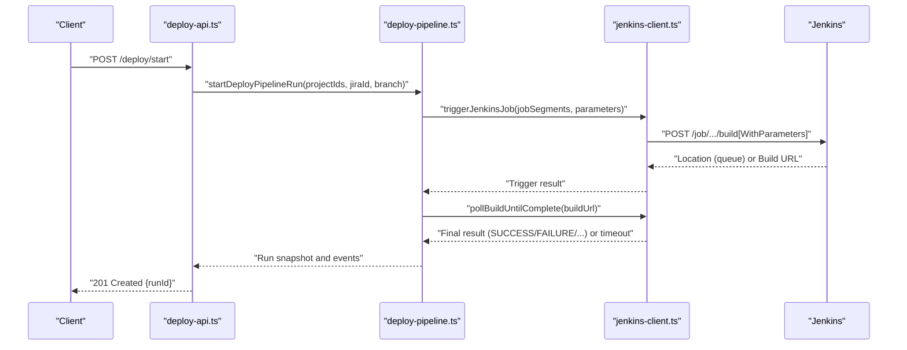
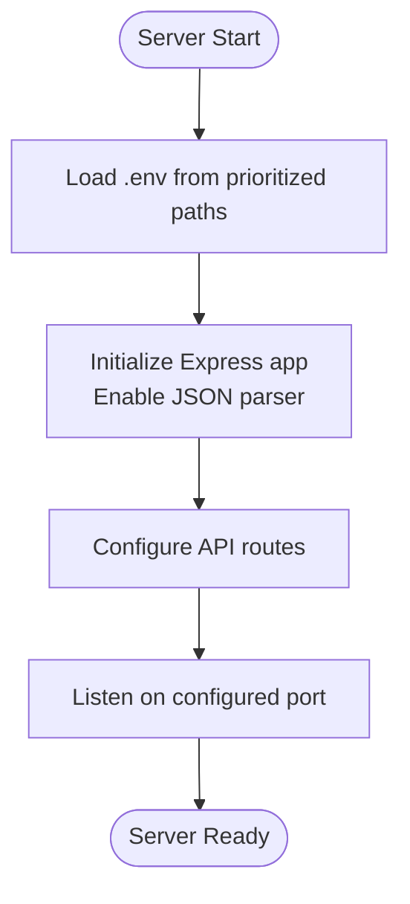
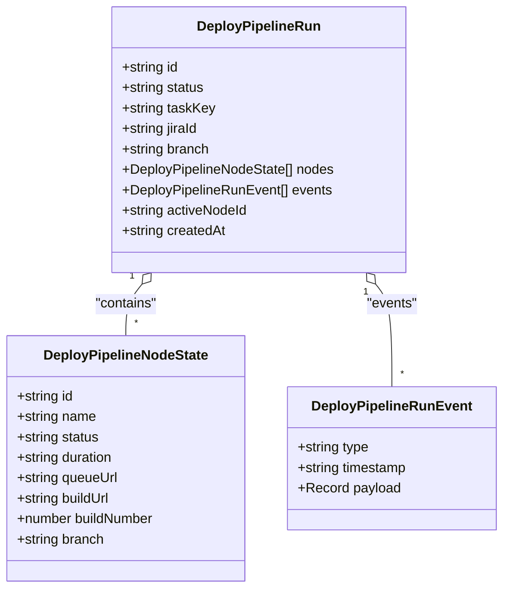
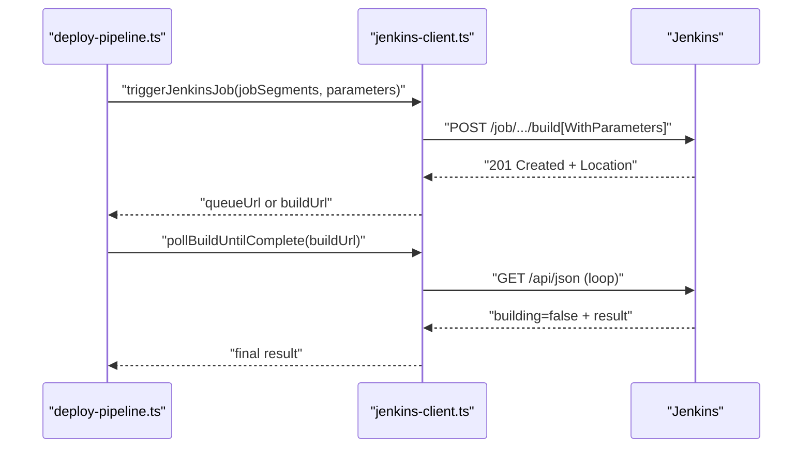
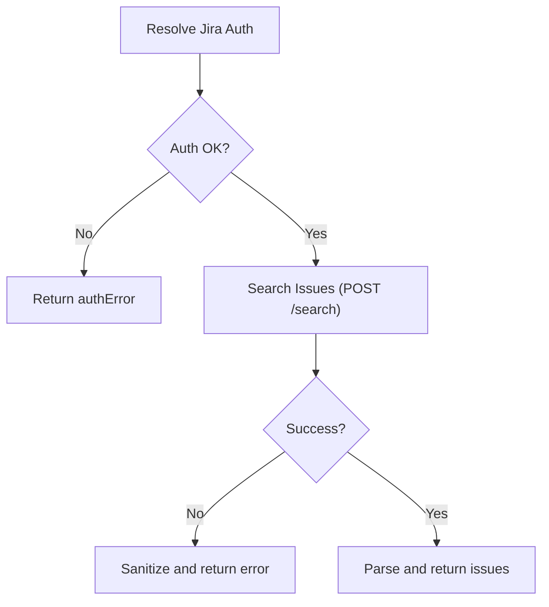
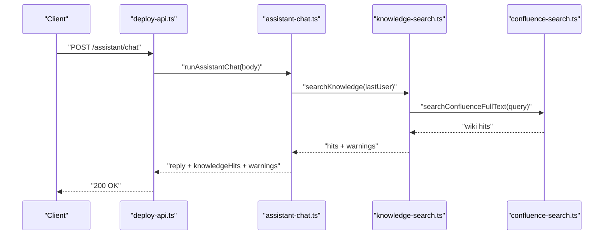
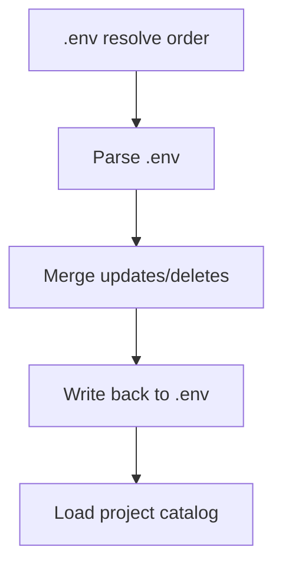
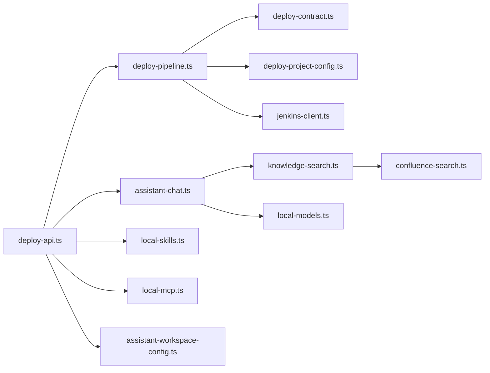

# Backend Services Architecture

<cite>
**Referenced Files in This Document**
- [deploy-api.ts](file://server/deploy-api.ts)
- [deploy-contract.ts](file://server/deploy-contract.ts)
- [deploy-pipeline.ts](file://server/deploy-pipeline.ts)
- [deploy-project-config.ts](file://server/deploy-project-config.ts)
- [jenkins-client.ts](file://server/jenkins-client.ts)
- [jira-rest.ts](file://server/jira-rest.ts)
- [jira-weekly.ts](file://server/jira-weekly.ts)
- [local-skills.ts](file://server/local-skills.ts)
- [local-mcp.ts](file://server/local-mcp.ts)
- [local-models.ts](file://server/local-models.ts)
- [assistant-chat.ts](file://server/assistant-chat.ts)
- [knowledge-search.ts](file://server/knowledge-search.ts)
- [confluence-search.ts](file://server/confluence-search.ts)
- [assistant-workspace-config.ts](file://server/assistant-workspace-config.ts)
- [deploy-projects.json](file://config/deploy-projects.json)
</cite>

## Table of Contents
1. [Introduction](#introduction)
2. [Project Structure](#project-structure)
3. [Core Components](#core-components)
4. [Architecture Overview](#architecture-overview)
5. [Detailed Component Analysis](#detailed-component-analysis)
6. [Dependency Analysis](#dependency-analysis)
7. [Performance Considerations](#performance-considerations)
8. [Troubleshooting Guide](#troubleshooting-guide)
9. [Conclusion](#conclusion)

## Introduction
This document describes the Express-based backend services architecture for deployment orchestration, AI assistant capabilities, and integration with external systems such as Jenkins, Jira, and local AI assets. It covers the RESTful API design, middleware and logging, error handling, input validation, response formatting, and integration patterns. It also documents the service layer organization, scheduling automation, and environment/workspace management.

## Project Structure
The backend is organized around a single Express server that exposes multiple API endpoints grouped by domain:
- Deployment orchestration: Jenkins triggers, pipeline runs, and project configuration
- Jira integration: authentication, search, and workflow transitions
- Assistant services: chat with local Ollama/Gemini/OpenAI, knowledge retrieval, and local model/skill discovery
- Local AI ecosystem: MCP server scanning, local model discovery, and skill cataloging
- Workspace and environment management: .env loading, project catalog, and secret handling

**Diagram sources**
- [deploy-api.ts](file://server/deploy-api.ts)
- [deploy-pipeline.ts](file://server/deploy-pipeline.ts)
- [deploy-contract.ts](file://server/deploy-contract.ts)
- [deploy-project-config.ts](file://server/deploy-project-config.ts)
- [jenkins-client.ts](file://server/jenkins-client.ts)
- [jira-rest.ts](file://server/jira-rest.ts)
- [jira-weekly.ts](file://server/jira-weekly.ts)
- [assistant-chat.ts](file://server/assistant-chat.ts)
- [knowledge-search.ts](file://server/knowledge-search.ts)
- [confluence-search.ts](file://server/confluence-search.ts)
- [local-models.ts](file://server/local-models.ts)
- [local-skills.ts](file://server/local-skills.ts)
- [local-mcp.ts](file://server/local-mcp.ts)
- [assistant-workspace-config.ts](file://server/assistant-workspace-config.ts)

**Section sources**
- [deploy-api.ts](file://server/deploy-api.ts)
- [deploy-pipeline.ts](file://server/deploy-pipeline.ts)
- [deploy-contract.ts](file://server/deploy-contract.ts)
- [deploy-project-config.ts](file://server/deploy-project-config.ts)
- [jenkins-client.ts](file://server/jenkins-client.ts)
- [jira-rest.ts](file://server/jira-rest.ts)
- [jira-weekly.ts](file://server/jira-weekly.ts)
- [assistant-chat.ts](file://server/assistant-chat.ts)
- [knowledge-search.ts](file://server/knowledge-search.ts)
- [confluence-search.ts](file://server/confluence-search.ts)
- [local-models.ts](file://server/local-models.ts)
- [local-skills.ts](file://server/local-skills.ts)
- [local-mcp.ts](file://server/local-mcp.ts)
- [assistant-workspace-config.ts](file://server/assistant-workspace-config.ts)

## Core Components
- Express server bootstrap and middleware:
  - JSON body parsing enabled globally
  - Port and workspace paths configurable via environment variables
  - Environment loaded from prioritized .env locations
- Automation and startup orchestration:
  - Scheduled and manual automation task runner with event streaming
  - Process lifecycle management and safe termination
- Deployment pipeline:
  - Multi-project orchestration with Jenkins triggers and polling
  - Parameterization, branch resolution, and DAG-like sequencing
- Jira integration:
  - Authentication normalization and credential resolution
  - Search and workflow transition helpers
- Assistant services:
  - Unified chat interface supporting Ollama, Gemini, and OpenAI
  - Knowledge retrieval across local files, Confluence, and HTTP bridges
- Local AI ecosystem:
  - MCP server discovery from Cursor configs
  - Local model discovery across Ollama and LM Studio
  - Skill catalog scanning from Claude/Cursor/Agents/Codex directories

**Section sources**
- [deploy-api.ts](file://server/deploy-api.ts)
- [deploy-pipeline.ts](file://server/deploy-pipeline.ts)
- [deploy-contract.ts](file://server/deploy-contract.ts)
- [deploy-project-config.ts](file://server/deploy-project-config.ts)
- [jenkins-client.ts](file://server/jenkins-client.ts)
- [jira-rest.ts](file://server/jira-rest.ts)
- [assistant-chat.ts](file://server/assistant-chat.ts)
- [knowledge-search.ts](file://server/knowledge-search.ts)
- [local-models.ts](file://server/local-models.ts)
- [local-skills.ts](file://server/local-skills.ts)
- [local-mcp.ts](file://server/local-mcp.ts)

## Architecture Overview
The backend is a cohesive Express service that centralizes:
- External integrations (Jenkins, Jira, Confluence)
- Local AI asset discovery and orchestration
- Knowledge retrieval and assistant chat
- Deployment pipeline orchestration and project configuration

**Diagram sources**
- [deploy-api.ts](file://server/deploy-api.ts)
- [deploy-pipeline.ts](file://server/deploy-pipeline.ts)
- [jenkins-client.ts](file://server/jenkins-client.ts)

## Detailed Component Analysis

### Express Server Setup and Middleware
- Initialization:
  - Loads environment from prioritized .env locations
  - Enables JSON body parsing
  - Exposes port and workspace paths via environment variables
- Logging and runtime:
  - Centralized logging helpers for automation and startup runs
  - Event streaming for long-running operations
- Startup and automation:
  - Scheduled automation task runner with cron-like daily schedules
  - Process spawning and safe termination with signal handling
  - Startup orchestration for multiple projects with optional terminal mode

**Diagram sources**
- [deploy-api.ts](file://server/deploy-api.ts)

**Section sources**
- [deploy-api.ts](file://server/deploy-api.ts)

### Deployment Pipeline Orchestration
- Responsibilities:
  - Validate and load project configuration
  - Resolve Jenkins targets per project and branch
  - Build parameters from Jira ID and branch
  - Trigger jobs and poll completion
  - Maintain run snapshots and event logs
- Data structures:
  - Pipeline run with nodes, statuses, and events
  - Target resolution with job segments and parameter names
- Error handling:
  - Graceful failure propagation and partial completion detection
  - Stats persistence and pruning of old runs

**Diagram sources**
- [deploy-pipeline.ts](file://server/deploy-pipeline.ts)

**Section sources**
- [deploy-pipeline.ts](file://server/deploy-pipeline.ts)
- [deploy-project-config.ts](file://server/deploy-project-config.ts)
- [deploy-contract.ts](file://server/deploy-contract.ts)
- [jenkins-client.ts](file://server/jenkins-client.ts)

### Jenkins Integration
- Helpers:
  - Build URL construction and parameterized builds
  - CSRF crumb fetching and inclusion
  - Queue polling and build completion polling
- Error sanitization:
  - Converts HTML responses to readable messages
  - Limits error message length and strips noise

**Diagram sources**
- [deploy-pipeline.ts](file://server/deploy-pipeline.ts)
- [jenkins-client.ts](file://server/jenkins-client.ts)

**Section sources**
- [jenkins-client.ts](file://server/jenkins-client.ts)
- [deploy-contract.ts](file://server/deploy-contract.ts)

### Jira Integration
- Authentication:
  - Normalizes server URL, API prefix, and credentials
  - Supports both password and API token
- Search:
  - Handles API v3 vs v2 fallback
  - Parses and sanitizes error responses
- Workflow transitions:
  - Reads available transitions and picks by name or ID
  - Posts transition with robust fallback

**Diagram sources**
- [jira-rest.ts](file://server/jira-rest.ts)

**Section sources**
- [jira-rest.ts](file://server/jira-rest.ts)
- [jira-weekly.ts](file://server/jira-weekly.ts)

### Assistant Services and Knowledge Retrieval
- Assistant chat:
  - Supports Ollama, Gemini, and OpenAI providers
  - Injects knowledge hits into system prompt
  - Enforces timeouts and validates responses
- Knowledge search:
  - Local files (MD/MDX/TXT) with term matching and excerpts
  - Confluence CQL full-text search
  - HTTP bridges with template expansion
- Local AI ecosystem:
  - MCP server discovery from Cursor configs
  - Local model discovery across Ollama and LM Studio
  - Skill catalog scanning from Claude/Cursor/Agents/Codex

**Diagram sources**
- [assistant-chat.ts](file://server/assistant-chat.ts)
- [knowledge-search.ts](file://server/knowledge-search.ts)
- [confluence-search.ts](file://server/confluence-search.ts)

**Section sources**
- [assistant-chat.ts](file://server/assistant-chat.ts)
- [knowledge-search.ts](file://server/knowledge-search.ts)
- [confluence-search.ts](file://server/confluence-search.ts)
- [local-models.ts](file://server/local-models.ts)
- [local-skills.ts](file://server/local-skills.ts)
- [local-mcp.ts](file://server/local-mcp.ts)

### Workspace and Environment Management
- .env resolution and merging:
  - Multiple prioritized locations
  - Safe parsing and escaping
  - Merge updates and deletions preserving comments
- Project catalog:
  - JSON catalog of projects with id/name/path
  - Load/save with versioning

**Diagram sources**
- [assistant-workspace-config.ts](file://server/assistant-workspace-config.ts)

**Section sources**
- [assistant-workspace-config.ts](file://server/assistant-workspace-config.ts)

## Dependency Analysis
- Internal dependencies:
  - deploy-api.ts orchestrates all services
  - deploy-pipeline.ts depends on deploy-contract.ts, deploy-project-config.ts, and jenkins-client.ts
  - assistant-chat.ts depends on knowledge-search.ts and local-models.ts
  - knowledge-search.ts integrates confluence-search.ts and supports HTTP bridges
  - local-* modules are independent but used by assistant services
- External dependencies:
  - Jenkins REST API with CSRF crumb support
  - Jira REST API with v3/v2 fallback
  - Confluence REST API for CQL search
  - Local tools: Ollama CLI, LM Studio model directories

**Diagram sources**
- [deploy-api.ts](file://server/deploy-api.ts)
- [deploy-pipeline.ts](file://server/deploy-pipeline.ts)
- [deploy-contract.ts](file://server/deploy-contract.ts)
- [deploy-project-config.ts](file://server/deploy-project-config.ts)
- [jenkins-client.ts](file://server/jenkins-client.ts)
- [assistant-chat.ts](file://server/assistant-chat.ts)
- [knowledge-search.ts](file://server/knowledge-search.ts)
- [confluence-search.ts](file://server/confluence-search.ts)
- [local-models.ts](file://server/local-models.ts)
- [local-skills.ts](file://server/local-skills.ts)
- [local-mcp.ts](file://server/local-mcp.ts)
- [assistant-workspace-config.ts](file://server/assistant-workspace-config.ts)

**Section sources**
- [deploy-api.ts](file://server/deploy-api.ts)
- [deploy-pipeline.ts](file://server/deploy-pipeline.ts)
- [assistant-chat.ts](file://server/assistant-chat.ts)
- [knowledge-search.ts](file://server/knowledge-search.ts)
- [confluence-search.ts](file://server/confluence-search.ts)
- [local-models.ts](file://server/local-models.ts)
- [local-skills.ts](file://server/local-skills.ts)
- [local-mcp.ts](file://server/local-mcp.ts)
- [assistant-workspace-config.ts](file://server/assistant-workspace-config.ts)

## Performance Considerations
- Asynchronous orchestration:
  - Pipelined Jenkins triggers with polling reduces immediate load spikes
  - Event snapshots limit memory footprint for long-running runs
- Streaming and filtering:
  - Dev output filtering and scrubbing reduce SSE payload sizes
  - Dense progress dashboards are collapsed to periodic heartbeats
- Resource limits:
  - Max events and runs in memory prevent unbounded growth
  - File size and depth caps in knowledge and skill scans avoid heavy I/O

[No sources needed since this section provides general guidance]

## Troubleshooting Guide
- Jenkins errors:
  - Verify credentials and CSRF crumb availability
  - Check queue polling and build completion timeouts
- Jira errors:
  - Confirm server URL normalization and API prefix fallback
  - Validate authentication and permissions
- Assistant and knowledge:
  - Ensure local directories and HTTP bridges are configured
  - Check Confluence base URL and credentials
- Environment and secrets:
  - Use workspace config utilities to merge and write .env safely
  - Avoid exposing secrets in logs by using secret-key detection

**Section sources**
- [jenkins-client.ts](file://server/jenkins-client.ts)
- [jira-rest.ts](file://server/jira-rest.ts)
- [knowledge-search.ts](file://server/knowledge-search.ts)
- [assistant-workspace-config.ts](file://server/assistant-workspace-config.ts)

## Conclusion
The backend provides a robust, modular Express service that integrates deployment orchestration, intelligent assistant capabilities, and local AI ecosystems. It emphasizes clear separation of concerns, strong input validation, resilient error handling, and practical observability through event streams and logging. The design supports scalable automation and seamless collaboration with Jenkins, Jira, and local AI assets.