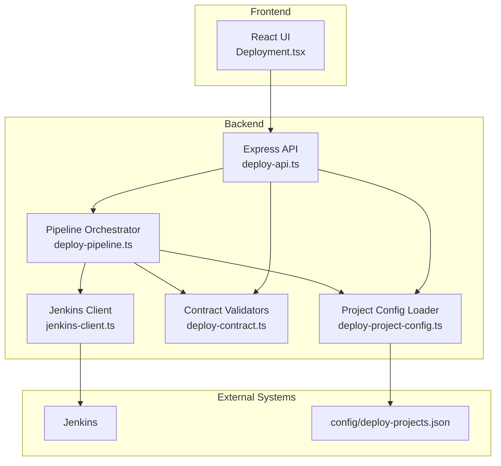
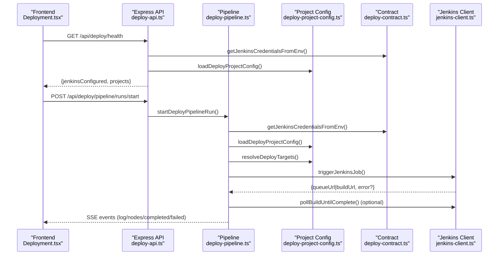
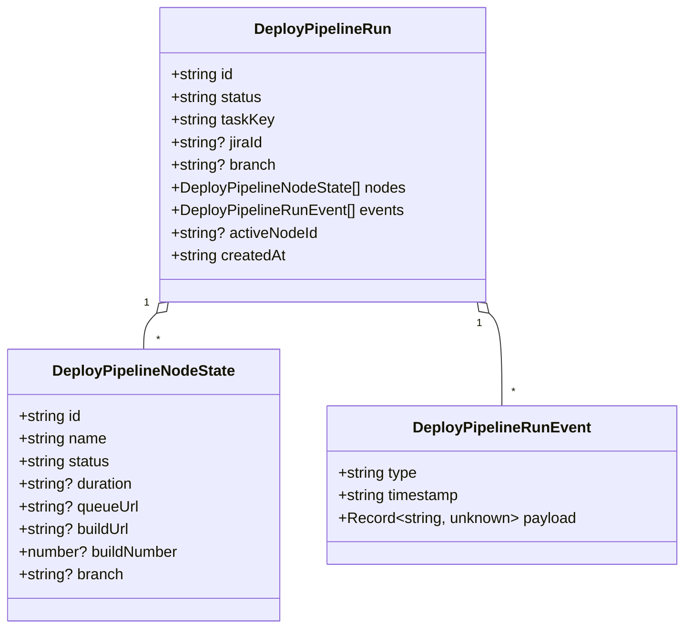
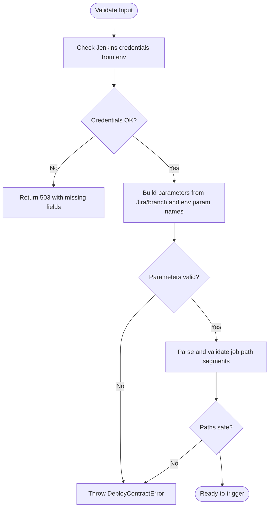
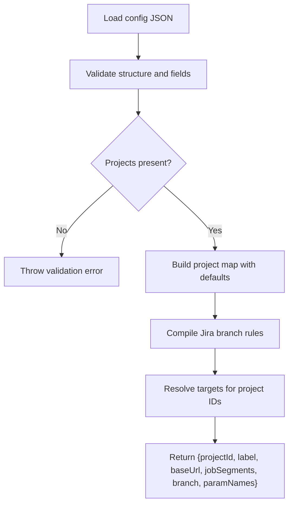
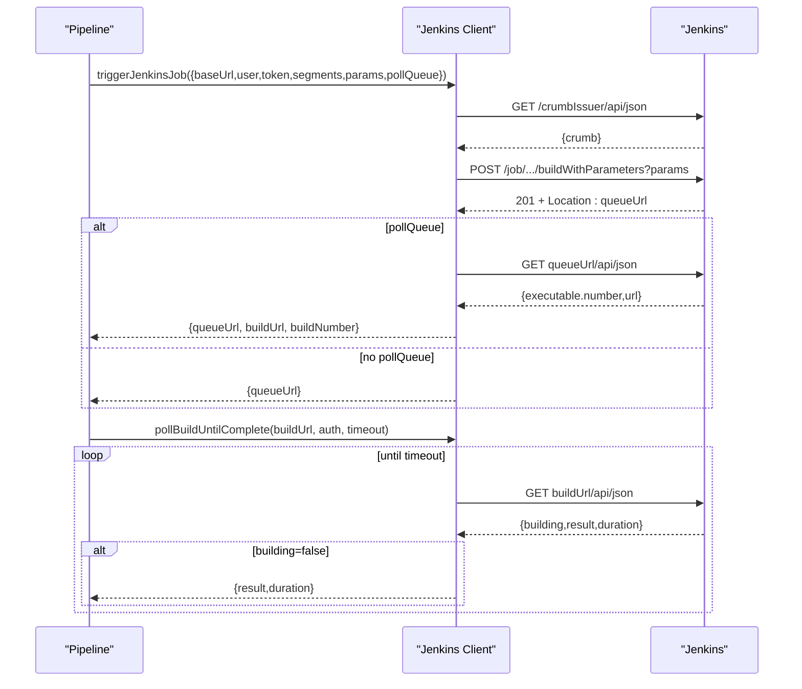
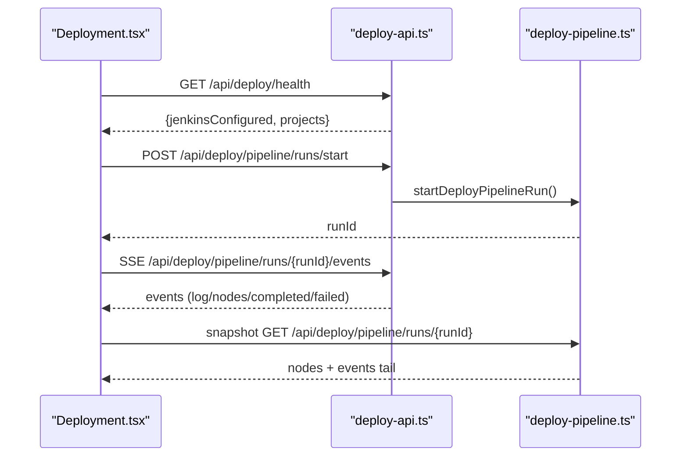
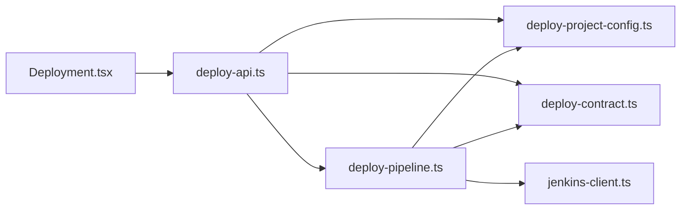

# Deployment Orchestration Services

<cite>
**Referenced Files in This Document**
- [deploy-pipeline.ts](file://server/deploy-pipeline.ts)
- [deploy-contract.ts](file://server/deploy-contract.ts)
- [deploy-project-config.ts](file://server/deploy-project-config.ts)
- [jenkins-client.ts](file://server/jenkins-client.ts)
- [deploy-api.ts](file://server/deploy-api.ts)
- [Deployment.tsx](file://src/pages/Deployment.tsx)
- [deploy-projects.json](file://config/deploy-projects.json)
- [2026-05-03-real-jenkins-deployment.md](file://docs/superpowers/plans/2026-05-03-real-jenkins-deployment.md)
- [2026-05-03-real-jenkins-deployment-design.md](file://docs/superpowers/specs/2026-05-03-real-jenkins-deployment-design.md)
- [jenkins-client.test.ts](file://test/server/jenkins-client.test.ts)
- [deploy-contract.test.ts](file://test/server/deploy-contract.test.ts)
- [deploy-project-config.test.ts](file://test/server/deploy-project-config.test.ts)
</cite>

## Table of Contents
1. [Introduction](#introduction)
2. [Project Structure](#project-structure)
3. [Core Components](#core-components)
4. [Architecture Overview](#architecture-overview)
5. [Detailed Component Analysis](#detailed-component-analysis)
6. [Dependency Analysis](#dependency-analysis)
7. [Performance Considerations](#performance-considerations)
8. [Troubleshooting Guide](#troubleshooting-guide)
9. [Conclusion](#conclusion)
10. [Appendices](#appendices)

## Introduction
This document describes the deployment orchestration system that coordinates multi-project deployments via Jenkins. It covers:
- Pipeline management: run tracking, status monitoring, and event handling
- Deployment contract system: parameter validation and job configuration
- Project configuration loading and target resolution
- Jenkins integration: job triggering, parameter passing, and real-time status updates
- Examples of pipeline execution, error handling, and monitoring
- The relationship among pipeline runs, deployment contracts, and project configurations

## Project Structure
The orchestration spans backend services, configuration, and a React UI:
- Backend orchestration and APIs live under server/
- Project configuration is loaded from config/deploy-projects.json
- Frontend deployment page is under src/pages/Deployment.tsx
- Design and implementation plans are documented under docs/superpowers/

**Diagram sources**
- [deploy-api.ts:887-1514](file://server/deploy-api.ts#L887-L1514)
- [deploy-pipeline.ts:1-419](file://server/deploy-pipeline.ts#L1-L419)
- [deploy-project-config.ts:1-237](file://server/deploy-project-config.ts#L1-L237)
- [deploy-contract.ts:1-169](file://server/deploy-contract.ts#L1-L169)
- [jenkins-client.ts:1-191](file://server/jenkins-client.ts#L1-L191)
- [deploy-projects.json:1-78](file://config/deploy-projects.json#L1-L78)

**Section sources**
- [deploy-api.ts:887-1514](file://server/deploy-api.ts#L887-L1514)
- [deploy-pipeline.ts:1-419](file://server/deploy-pipeline.ts#L1-L419)
- [deploy-project-config.ts:1-237](file://server/deploy-project-config.ts#L1-L237)
- [deploy-contract.ts:1-169](file://server/deploy-contract.ts#L1-L169)
- [jenkins-client.ts:1-191](file://server/jenkins-client.ts#L1-L191)
- [deploy-projects.json:1-78](file://config/deploy-projects.json#L1-L78)

## Core Components
- Pipeline orchestrator: manages run lifecycle, node states, events, and Jenkins triggers
- Contract validators: enforce Jenkins credentials, parameter names, and job path safety
- Project configuration loader: validates and resolves deployment targets per project
- Jenkins client: handles crumb acquisition, build triggers, queue polling, and build result polling
- API surface: health checks, trigger endpoints, and SSE event streams for monitoring
- Frontend deployment page: parses commands, renders health, and subscribes to pipeline events

**Section sources**
- [deploy-pipeline.ts:16-45](file://server/deploy-pipeline.ts#L16-L45)
- [deploy-contract.ts:10-81](file://server/deploy-contract.ts#L10-L81)
- [deploy-project-config.ts:32-57](file://server/deploy-project-config.ts#L32-L57)
- [jenkins-client.ts:5-191](file://server/jenkins-client.ts#L5-L191)
- [deploy-api.ts:887-1514](file://server/deploy-api.ts#L887-L1514)
- [Deployment.tsx:1-800](file://src/pages/Deployment.tsx#L1-L800)

## Architecture Overview
The system follows a server-side orchestration model:
- Frontend requests health and starts pipeline runs
- Backend validates configuration and Jenkins credentials
- Orchestrator resolves targets from project config and triggers Jenkins jobs
- Events are streamed via SSE for real-time monitoring
- Build completion is polled and propagated to subsequent nodes

**Diagram sources**
- [deploy-api.ts:887-1514](file://server/deploy-api.ts#L887-L1514)
- [deploy-pipeline.ts:225-418](file://server/deploy-pipeline.ts#L225-L418)
- [deploy-project-config.ts:212-236](file://server/deploy-project-config.ts#L212-L236)
- [deploy-contract.ts:59-81](file://server/deploy-contract.ts#L59-L81)
- [jenkins-client.ts:89-191](file://server/jenkins-client.ts#L89-L191)

## Detailed Component Analysis

### Pipeline Orchestration
The orchestrator maintains in-memory runs with bounded memory and persistent stats. It:
- Creates runs with node DAGs from project IDs
- Validates Jenkins credentials and project config
- Resolves targets per project and triggers Jenkins jobs
- Updates node states and pushes structured events
- Streams snapshots and events via SSE

**Diagram sources**
- [deploy-pipeline.ts:16-45](file://server/deploy-pipeline.ts#L16-L45)

**Section sources**
- [deploy-pipeline.ts:47-180](file://server/deploy-pipeline.ts#L47-L180)
- [deploy-pipeline.ts:186-223](file://server/deploy-pipeline.ts#L186-L223)
- [deploy-pipeline.ts:225-418](file://server/deploy-pipeline.ts#L225-L418)

### Deployment Contract System
The contract enforces:
- Jenkins configuration presence and completeness
- Parameter name validation (JIRA and branch)
- Job path safety and correctness
- Strict error propagation without simulation

**Diagram sources**
- [deploy-contract.ts:33-81](file://server/deploy-contract.ts#L33-L81)
- [deploy-contract.ts:91-120](file://server/deploy-contract.ts#L91-L120)
- [deploy-contract.ts:122-169](file://server/deploy-contract.ts#L122-L169)

**Section sources**
- [deploy-contract.ts:1-8](file://server/deploy-contract.ts#L1-L8)
- [deploy-contract.ts:33-81](file://server/deploy-contract.ts#L33-L81)
- [deploy-contract.ts:91-120](file://server/deploy-contract.ts#L91-L120)
- [deploy-contract.ts:122-169](file://server/deploy-contract.ts#L122-L169)

### Project Configuration Loading and Target Resolution
The configuration loader:
- Reads and validates the JSON config
- Enforces project IDs, job paths, and Jenkins base URLs
- Supports Jira-based branch rules and fallbacks
- Produces resolved targets with job segments, branch, and parameter names

**Diagram sources**
- [deploy-project-config.ts:96-174](file://server/deploy-project-config.ts#L96-L174)
- [deploy-project-config.ts:212-236](file://server/deploy-project-config.ts#L212-L236)
- [deploy-projects.json:1-78](file://config/deploy-projects.json#L1-L78)

**Section sources**
- [deploy-project-config.ts:96-174](file://server/deploy-project-config.ts#L96-L174)
- [deploy-project-config.ts:212-236](file://server/deploy-project-config.ts#L212-L236)
- [deploy-projects.json:1-78](file://config/deploy-projects.json#L1-L78)

### Jenkins Integration Workflow
The Jenkins client:
- Discovers crumb if available
- Triggers jobs via buildWithParameters when parameters exist
- Polls queue URL to obtain build URL and number
- Polls build URL until completion and returns result
- Sanitizes HTML errors and returns concise messages

**Diagram sources**
- [jenkins-client.ts:27-191](file://server/jenkins-client.ts#L27-L191)
- [deploy-pipeline.ts:276-305](file://server/deploy-pipeline.ts#L276-L305)
- [deploy-pipeline.ts:350-387](file://server/deploy-pipeline.ts#L350-L387)

**Section sources**
- [jenkins-client.ts:27-191](file://server/jenkins-client.ts#L27-L191)
- [deploy-pipeline.ts:276-305](file://server/deploy-pipeline.ts#L276-L305)
- [deploy-pipeline.ts:350-387](file://server/deploy-pipeline.ts#L350-L387)

### Frontend Monitoring and Execution
The frontend:
- Loads health to gate execution
- Parses commands and resolves Jira-based targets
- Starts pipeline runs and subscribes to SSE events
- Renders node statuses, queue/build URLs, and logs

**Diagram sources**
- [Deployment.tsx:316-338](file://src/pages/Deployment.tsx#L316-L338)
- [Deployment.tsx:505-532](file://src/pages/Deployment.tsx#L505-L532)
- [deploy-api.ts:1441-1503](file://server/deploy-api.ts#L1441-L1503)
- [deploy-pipeline.ts:149-180](file://server/deploy-pipeline.ts#L149-L180)

**Section sources**
- [Deployment.tsx:316-338](file://src/pages/Deployment.tsx#L316-L338)
- [Deployment.tsx:505-532](file://src/pages/Deployment.tsx#L505-L532)
- [deploy-api.ts:1441-1503](file://server/deploy-api.ts#L1441-L1503)
- [deploy-pipeline.ts:149-180](file://server/deploy-pipeline.ts#L149-L180)

## Dependency Analysis
- Pipeline depends on:
  - Contract validators for Jenkins credentials and parameter names
  - Project config loader for targets and branch resolution
  - Jenkins client for triggering and polling
- API routes depend on pipeline and contract/config loaders
- Frontend depends on API routes and SSE streams

**Diagram sources**
- [deploy-api.ts:6-27](file://server/deploy-api.ts#L6-L27)
- [deploy-pipeline.ts:8-10](file://server/deploy-pipeline.ts#L8-L10)
- [deploy-contract.ts:10-16](file://server/deploy-contract.ts#L10-L16)
- [deploy-project-config.ts:1-3](file://server/deploy-project-config.ts#L1-L3)
- [jenkins-client.ts:1-3](file://server/jenkins-client.ts#L1-L3)
- [Deployment.tsx:1-12](file://src/pages/Deployment.tsx#L1-L12)

**Section sources**
- [deploy-api.ts:6-27](file://server/deploy-api.ts#L6-L27)
- [deploy-pipeline.ts:8-10](file://server/deploy-pipeline.ts#L8-L10)
- [deploy-contract.ts:10-16](file://server/deploy-contract.ts#L10-L16)
- [deploy-project-config.ts:1-3](file://server/deploy-project-config.ts#L1-L3)
- [jenkins-client.ts:1-3](file://server/jenkins-client.ts#L1-L3)
- [Deployment.tsx:1-12](file://src/pages/Deployment.tsx#L1-L12)

## Performance Considerations
- Event buffering: capped per-run events and periodic pruning of old runs to control memory
- SSE streaming: efficient incremental delivery of events with backpressure-aware intervals
- Polling cadence: configurable timeouts and intervals for queue and build polling
- Stats persistence: lightweight JSON stats file for task frequency tracking

[No sources needed since this section provides general guidance]

## Troubleshooting Guide
Common issues and strategies:
- Jenkins not configured: Health endpoint returns missing fields; block execution until fixed
- Invalid Jira or branch parameters: Contract validator throws explicit errors
- Unsafe job path segments: Reject paths with parent traversal or control characters
- Authentication failures: Jenkins client sanitizes HTML errors and returns actionable messages
- Partial pipeline completion: When queue-only result occurs, pipeline marks nodes as queued and halts further nodes

**Section sources**
- [deploy-api.ts:887-908](file://server/deploy-api.ts#L887-L908)
- [deploy-contract.ts:83-117](file://server/deploy-contract.ts#L83-L117)
- [deploy-contract.ts:122-151](file://server/deploy-contract.ts#L122-L151)
- [jenkins-client.ts:71-87](file://server/jenkins-client.ts#L71-L87)
- [deploy-pipeline.ts:331-342](file://server/deploy-pipeline.ts#L331-L342)

## Conclusion
The deployment orchestration system provides a robust, server-side pipeline that:
- Validates contracts and configuration before triggering Jenkins
- Resolves targets per project and supports Jira-driven branch rules
- Streams real-time events via SSE for monitoring
- Handles partial completions and errors gracefully
- Keeps secrets and credentials off the client

[No sources needed since this section summarizes without analyzing specific files]

## Appendices

### API Reference Summary
- Health: GET /api/deploy/health
- Pipeline start: POST /api/deploy/pipeline/runs/start
- Pipeline events: GET /api/deploy/pipeline/runs/{runId}/events (SSE)
- Pipeline snapshot: GET /api/deploy/pipeline/runs/{runId}
- Task stats: GET /api/deploy/pipeline/task-stats
- Jenkins trigger: POST /api/deploy/jenkins/trigger
- Build result: POST /api/deploy/jenkins/build-result

**Section sources**
- [deploy-api.ts:887-1514](file://server/deploy-api.ts#L887-L1514)

### Example Execution Flow
- User selects projects and confirms
- Frontend calls pipeline start and subscribes to SSE
- Backend validates config and Jenkins credentials
- For each node, backend resolves target and triggers Jenkins
- Pipeline updates node states and emits events
- Frontend displays queue/build URLs and logs

**Section sources**
- [Deployment.tsx:505-532](file://src/pages/Deployment.tsx#L505-L532)
- [deploy-pipeline.ts:225-418](file://server/deploy-pipeline.ts#L225-L418)

### Test Coverage Highlights
- Jenkins client behavior: crumb fetch, buildWithParameters, queue polling, error sanitization
- Contract validation: credentials, parameter names, job path parsing
- Project config: validation, branch resolution, target mapping

**Section sources**
- [jenkins-client.test.ts:1-162](file://test/server/jenkins-client.test.ts#L1-L162)
- [deploy-contract.test.ts:1-66](file://test/server/deploy-contract.test.ts#L1-L66)
- [deploy-project-config.test.ts:1-117](file://test/server/deploy-project-config.test.ts#L1-L117)