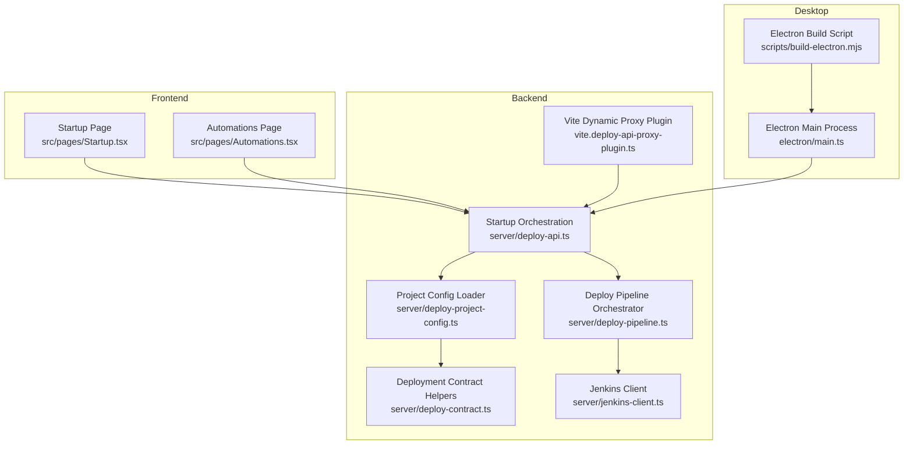
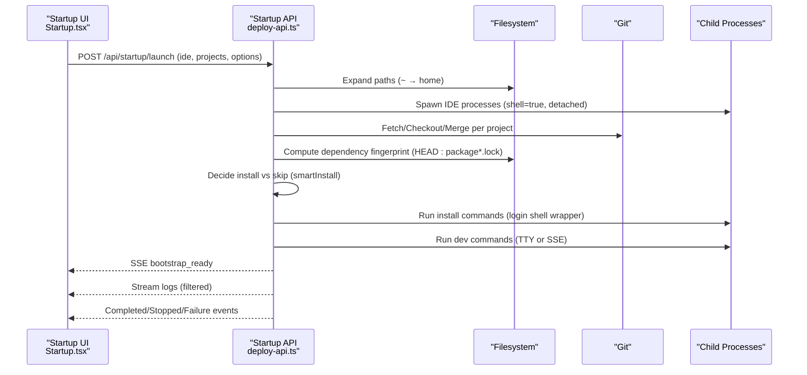
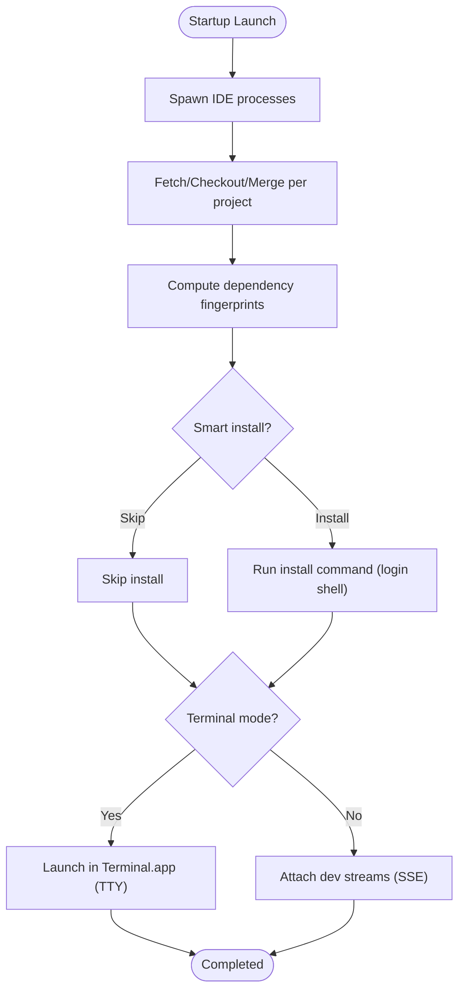
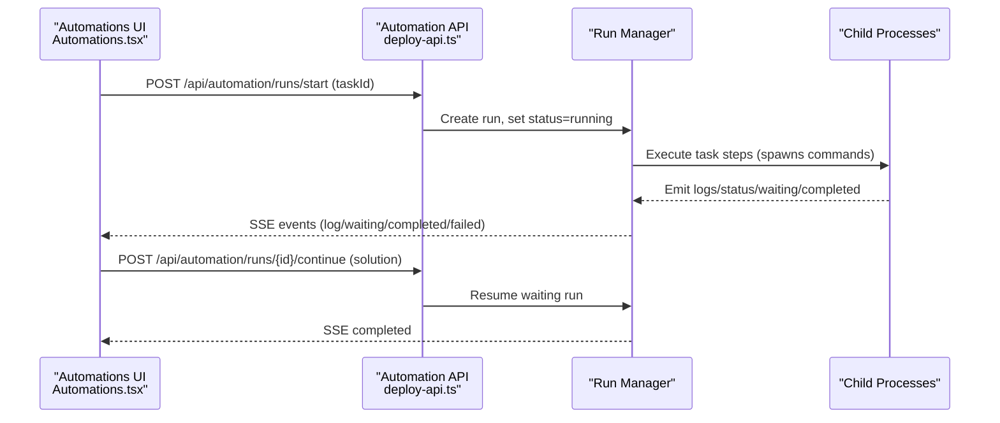
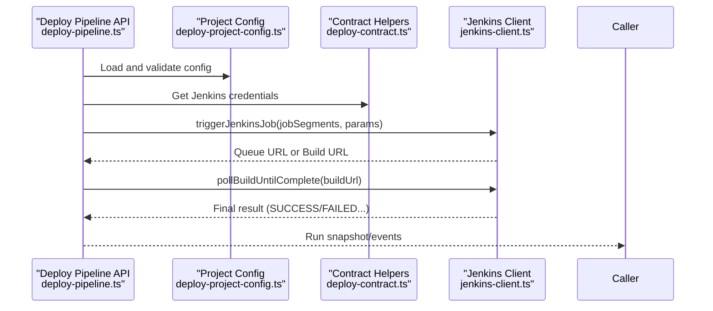
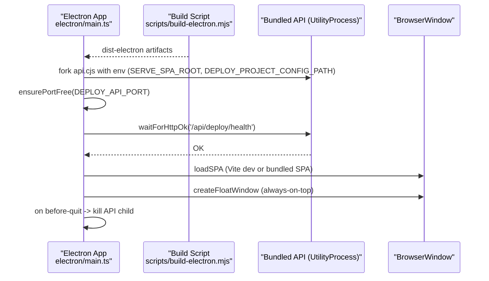
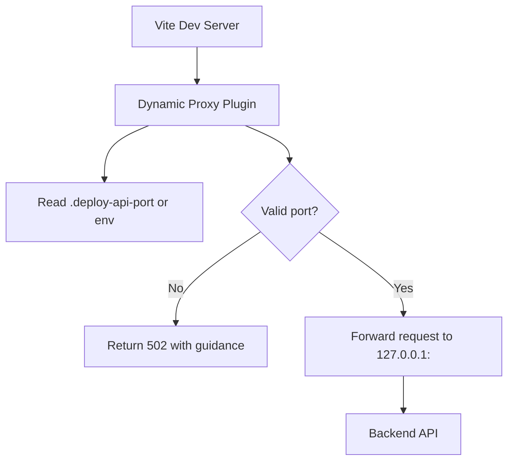
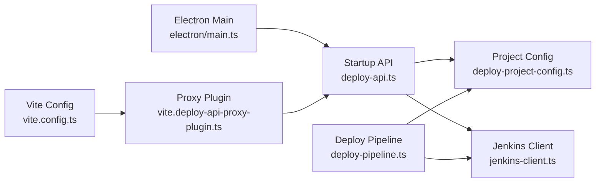

# Development Environment Management

<cite>
**Referenced Files in This Document**
- [package.json](file://package.json)
- [vite.config.ts](file://vite.config.ts)
- [vite.deploy-api-proxy-plugin.ts](file://vite.deploy-api-proxy-plugin.ts)
- [scripts/build-electron.mjs](file://scripts/build-electron.mjs)
- [electron/main.ts](file://electron/main.ts)
- [server/deploy-api.ts](file://server/deploy-api.ts)
- [server/deploy-pipeline.ts](file://server/deploy-pipeline.ts)
- [server/deploy-project-config.ts](file://server/deploy-project-config.ts)
- [server/deploy-contract.ts](file://server/deploy-contract.ts)
- [server/jenkins-client.ts](file://server/jenkins-client.ts)
- [src/pages/Startup.tsx](file://src/pages/Startup.tsx)
- [src/pages/Automations.tsx](file://src/pages/Automations.tsx)
- [config/deploy-projects.json](file://config/deploy-projects.json)
</cite>

## Table of Contents
1. [Introduction](#introduction)
2. [Project Structure](#project-structure)
3. [Core Components](#core-components)
4. [Architecture Overview](#architecture-overview)
5. [Detailed Component Analysis](#detailed-component-analysis)
6. [Dependency Analysis](#dependency-analysis)
7. [Performance Considerations](#performance-considerations)
8. [Troubleshooting Guide](#troubleshooting-guide)
9. [Conclusion](#conclusion)
10. [Appendices](#appendices)

## Introduction
This document describes the development environment management services of the project, focusing on:
- Startup orchestration: IDE launching, Git synchronization, dependency management, and development server launching
- Smart installation logic that optimizes dependency resolution based on file changes
- Development server launching with both terminal-based and streaming output modes
- Process management including child process spawning, signal handling, and graceful shutdown
- Examples of project configuration, automation task scheduling, and error recovery mechanisms
- Integration with development workflows and IDE integration patterns

## Project Structure
The development environment spans three layers:
- Frontend (React SPA) for user-driven orchestration and real-time logs
- Backend (Express) for startup orchestration, automation scheduling, and Jenkins integration
- Desktop (Electron) for packaging and launching the development stack

**Diagram sources**
- [src/pages/Startup.tsx](file://src/pages/Startup.tsx)
- [src/pages/Automations.tsx](file://src/pages/Automations.tsx)
- [server/deploy-api.ts](file://server/deploy-api.ts)
- [server/deploy-pipeline.ts](file://server/deploy-pipeline.ts)
- [server/deploy-project-config.ts](file://server/deploy-project-config.ts)
- [server/deploy-contract.ts](file://server/deploy-contract.ts)
- [server/jenkins-client.ts](file://server/jenkins-client.ts)
- [vite.deploy-api-proxy-plugin.ts](file://vite.deploy-api-proxy-plugin.ts)
- [electron/main.ts](file://electron/main.ts)
- [scripts/build-electron.mjs](file://scripts/build-electron.mjs)

**Section sources**
- [package.json](file://package.json)
- [vite.config.ts](file://vite.config.ts)
- [vite.deploy-api-proxy-plugin.ts](file://vite.deploy-api-proxy-plugin.ts)
- [scripts/build-electron.mjs](file://scripts/build-electron.mjs)
- [electron/main.ts](file://electron/main.ts)
- [server/deploy-api.ts](file://server/deploy-api.ts)
- [server/deploy-pipeline.ts](file://server/deploy-pipeline.ts)
- [server/deploy-project-config.ts](file://server/deploy-project-config.ts)
- [server/deploy-contract.ts](file://server/deploy-contract.ts)
- [server/jenkins-client.ts](file://server/jenkins-client.ts)
- [src/pages/Startup.tsx](file://src/pages/Startup.tsx)
- [src/pages/Automations.tsx](file://src/pages/Automations.tsx)
- [config/deploy-projects.json](file://config/deploy-projects.json)

## Core Components
- Startup orchestration service: coordinates IDE launching, Git synchronization, dependency installation, and development server launching with optional terminal mode
- Automation scheduler: manages scheduled runs, streaming logs, and manual intervention
- Jenkins integration: triggers jobs and polls builds with robust error handling
- Project configuration: validates and resolves deployment targets from a JSON configuration
- Electron packaging: bundles backend and frontend assets into a desktop app with child process lifecycle management
- Vite dynamic proxy: routes API requests to the backend with runtime port discovery

**Section sources**
- [server/deploy-api.ts](file://server/deploy-api.ts)
- [src/pages/Startup.tsx](file://src/pages/Startup.tsx)
- [src/pages/Automations.tsx](file://src/pages/Automations.tsx)
- [server/deploy-pipeline.ts](file://server/deploy-pipeline.ts)
- [server/jenkins-client.ts](file://server/jenkins-client.ts)
- [server/deploy-project-config.ts](file://server/deploy-project-config.ts)
- [server/deploy-contract.ts](file://server/deploy-contract.ts)
- [electron/main.ts](file://electron/main.ts)
- [vite.deploy-api-proxy-plugin.ts](file://vite.deploy-api-proxy-plugin.ts)

## Architecture Overview
The system orchestrates a development session in four stages:
1. IDE launching: spawns IDE processes per project
2. Git synchronization: fetches, checks out, and fast-forwards branches
3. Dependency management: resolves whether to install based on dependency file fingerprints and presence of node_modules
4. Development server launching: runs commands either in a real TTY (Terminal.app) or streams output via SSE

**Diagram sources**
- [src/pages/Startup.tsx](file://src/pages/Startup.tsx)
- [server/deploy-api.ts](file://server/deploy-api.ts)

**Section sources**
- [src/pages/Startup.tsx](file://src/pages/Startup.tsx)
- [server/deploy-api.ts](file://server/deploy-api.ts)

## Detailed Component Analysis

### Startup Orchestration Service
Responsibilities:
- IDE launching: opens IDEs for each project path
- Git synchronization: fetches remote branches, checks out, and attempts fast-forward merges
- Dependency management: computes fingerprints of dependency-related files and decides whether to install
- Development server launching: supports both Terminal.app TTY mode and streaming output mode
- Streaming logs: filters noisy progress dashboards and highlights meaningful messages

Key logic:
- IDE launching: spawns processes with shell and detached flags
- Git sync: runs fetch, checkout, and merge steps per project
- Smart install: compares fingerprints before/after sync; skips if node_modules exists and no changes
- Dev launching: chooses Terminal mode on macOS or attaches streams otherwise
- Log filtering: strips ANSI, collapses carriage-return progress, and highlights failures

**Diagram sources**
- [server/deploy-api.ts](file://server/deploy-api.ts)

**Section sources**
- [server/deploy-api.ts](file://server/deploy-api.ts)

### Automation Scheduler and Terminal UI
Responsibilities:
- Schedules automated tasks (e.g., nightly upgrades) based on configured schedules
- Streams logs via Server-Sent Events (SSE)
- Supports manual intervention when a run waits for input
- Provides a terminal overlay for live execution feedback

**Diagram sources**
- [src/pages/Automations.tsx](file://src/pages/Automations.tsx)
- [server/deploy-api.ts](file://server/deploy-api.ts)

**Section sources**
- [src/pages/Automations.tsx](file://src/pages/Automations.tsx)
- [server/deploy-api.ts](file://server/deploy-api.ts)

### Jenkins Integration and Pipeline Orchestrator
Responsibilities:
- Validates Jenkins credentials and parameters
- Triggers jobs and polls queue/build completion
- Orchestrates multi-project pipeline runs with DAG-like sequencing
- Persists run snapshots and statistics

**Diagram sources**
- [server/deploy-pipeline.ts](file://server/deploy-pipeline.ts)
- [server/deploy-project-config.ts](file://server/deploy-project-config.ts)
- [server/deploy-contract.ts](file://server/deploy-contract.ts)
- [server/jenkins-client.ts](file://server/jenkins-client.ts)

**Section sources**
- [server/deploy-pipeline.ts](file://server/deploy-pipeline.ts)
- [server/deploy-project-config.ts](file://server/deploy-project-config.ts)
- [server/deploy-contract.ts](file://server/deploy-contract.ts)
- [server/jenkins-client.ts](file://server/jenkins-client.ts)

### Electron Packaging and Desktop Lifecycle
Responsibilities:
- Builds main, preload, and bundled API into dist-electron
- Starts bundled API as a child process with proper environment
- Waits for health endpoints and loads SPA in BrowserWindow
- Graceful shutdown by terminating child processes

**Diagram sources**
- [electron/main.ts](file://electron/main.ts)
- [scripts/build-electron.mjs](file://scripts/build-electron.mjs)

**Section sources**
- [electron/main.ts](file://electron/main.ts)
- [scripts/build-electron.mjs](file://scripts/build-electron.mjs)

### Vite Dynamic Proxy and Development Workflow Integration
Responsibilities:
- Proxies /api/* routes to the backend with runtime port discovery
- Prevents stale proxy configurations by reading .deploy-api-port per request
- Sanitizes HTML responses from misrouted ports

**Diagram sources**
- [vite.deploy-api-proxy-plugin.ts](file://vite.deploy-api-proxy-plugin.ts)
- [vite.config.ts](file://vite.config.ts)

**Section sources**
- [vite.deploy-api-proxy-plugin.ts](file://vite.deploy-api-proxy-plugin.ts)
- [vite.config.ts](file://vite.config.ts)

## Dependency Analysis
- Startup orchestration depends on:
  - Project catalog and configuration for IDE/commands
  - Child process APIs for spawning and managing dev servers
  - Git commands for synchronization
- Automation scheduler depends on:
  - Scheduled timers and run state management
  - SSE transport for live logs
- Jenkins integration depends on:
  - Configuration validation and credential retrieval
  - HTTP polling and error sanitization
- Electron packaging depends on:
  - esbuild outputs and resource paths
  - UtilityProcess for backend child lifecycle

**Diagram sources**
- [server/deploy-api.ts](file://server/deploy-api.ts)
- [server/deploy-project-config.ts](file://server/deploy-project-config.ts)
- [server/jenkins-client.ts](file://server/jenkins-client.ts)
- [server/deploy-pipeline.ts](file://server/deploy-pipeline.ts)
- [electron/main.ts](file://electron/main.ts)
- [vite.config.ts](file://vite.config.ts)
- [vite.deploy-api-proxy-plugin.ts](file://vite.deploy-api-proxy-plugin.ts)

**Section sources**
- [server/deploy-api.ts](file://server/deploy-api.ts)
- [server/deploy-pipeline.ts](file://server/deploy-pipeline.ts)
- [server/deploy-project-config.ts](file://server/deploy-project-config.ts)
- [server/jenkins-client.ts](file://server/jenkins-client.ts)
- [electron/main.ts](file://electron/main.ts)
- [vite.config.ts](file://vite.config.ts)
- [vite.deploy-api-proxy-plugin.ts](file://vite.deploy-api-proxy-plugin.ts)

## Performance Considerations
- Streaming log filtering reduces noise and improves readability for long-running builds
- Smart install avoids redundant dependency resolution when no relevant files changed
- Terminal mode on macOS provides true TTY for interactive tools; streaming mode reduces overhead for non-interactive tasks
- Electron packaging excludes large bundled fonts to speed up asar/zip creation

[No sources needed since this section provides general guidance]

## Troubleshooting Guide
Common issues and recovery mechanisms:
- Port conflicts: The Electron main process checks and kills conflicting listeners before starting the backend
- Backend health: The Electron main process waits for a health endpoint; failures surface via dialogs and app quit
- Proxy misconfiguration: The Vite plugin reads .deploy-api-port dynamically; invalid ports return structured 502 errors
- Jenkins connectivity: Authentication and permission failures are sanitized into actionable messages
- Automation waits: Manual intervention endpoints allow resuming runs that require user input

**Section sources**
- [electron/main.ts](file://electron/main.ts)
- [vite.deploy-api-proxy-plugin.ts](file://vite.deploy-api-proxy-plugin.ts)
- [server/jenkins-client.ts](file://server/jenkins-client.ts)
- [src/pages/Automations.tsx](file://src/pages/Automations.tsx)

## Conclusion
The development environment management system integrates IDE launching, Git synchronization, intelligent dependency resolution, and flexible development server modes. It provides robust automation scheduling, Jenkins orchestration, and seamless desktop packaging with strong error handling and recovery mechanisms.

[No sources needed since this section summarizes without analyzing specific files]

## Appendices

### Example Project Configuration
- Project catalog and deployment targets are defined in a JSON configuration file
- Defaults include branch, Jenkins base URL, and parameter names
- Projects specify job paths and default branches
- Optional Jira branch rules map Jira IDs to specific branches

**Section sources**
- [config/deploy-projects.json](file://config/deploy-projects.json)
- [server/deploy-project-config.ts](file://server/deploy-project-config.ts)
- [server/deploy-contract.ts](file://server/deploy-contract.ts)

### Development Server Launch Modes
- Terminal mode (macOS): launches commands in a new Terminal window with true TTY
- Streaming mode: attaches child process stdout/stderr to SSE for real-time UI updates

**Section sources**
- [server/deploy-api.ts](file://server/deploy-api.ts)

### Process Management and Graceful Shutdown
- Child processes are tracked and terminated gracefully on stop or shutdown
- Electron main process ensures backend child is killed on app quit

**Section sources**
- [server/deploy-api.ts](file://server/deploy-api.ts)
- [electron/main.ts](file://electron/main.ts)