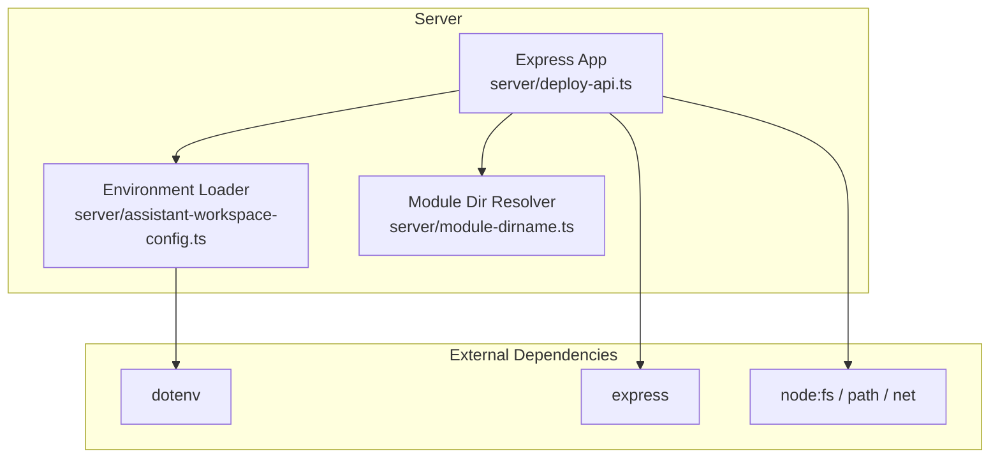
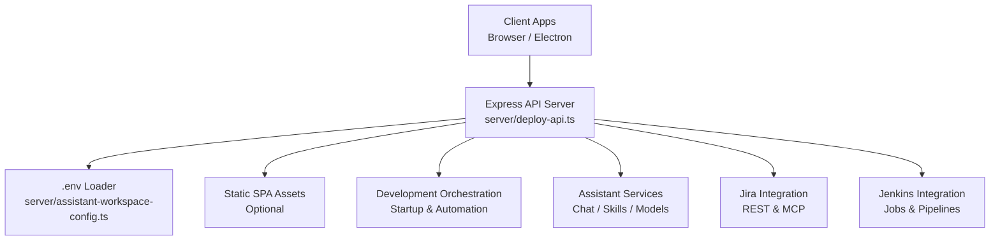
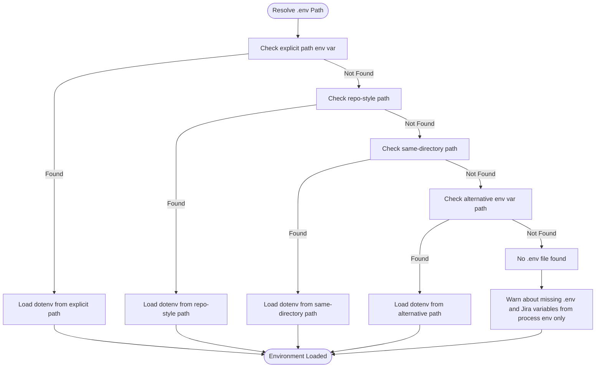
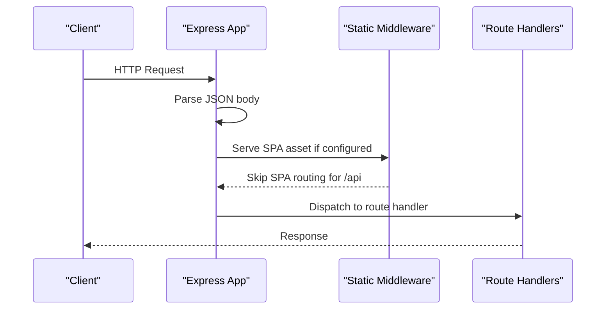
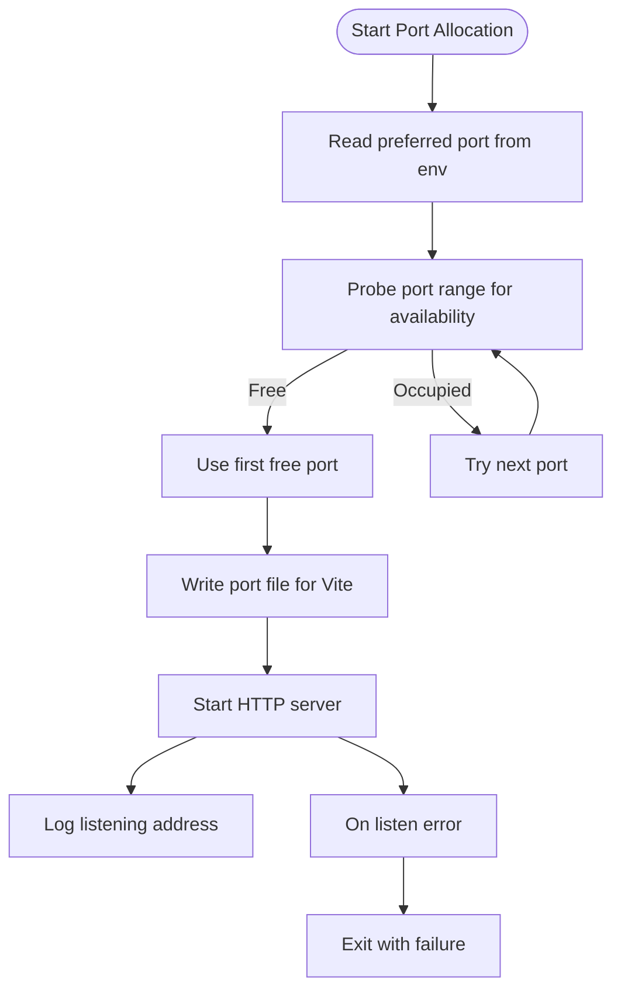
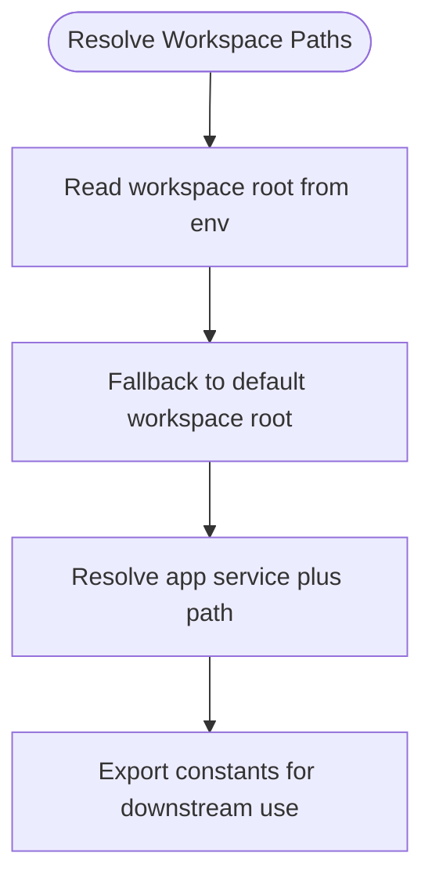
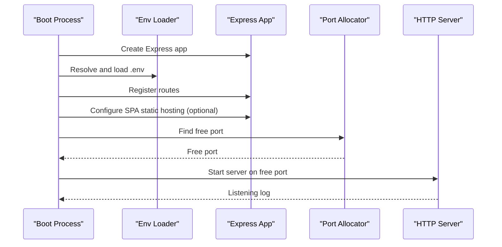
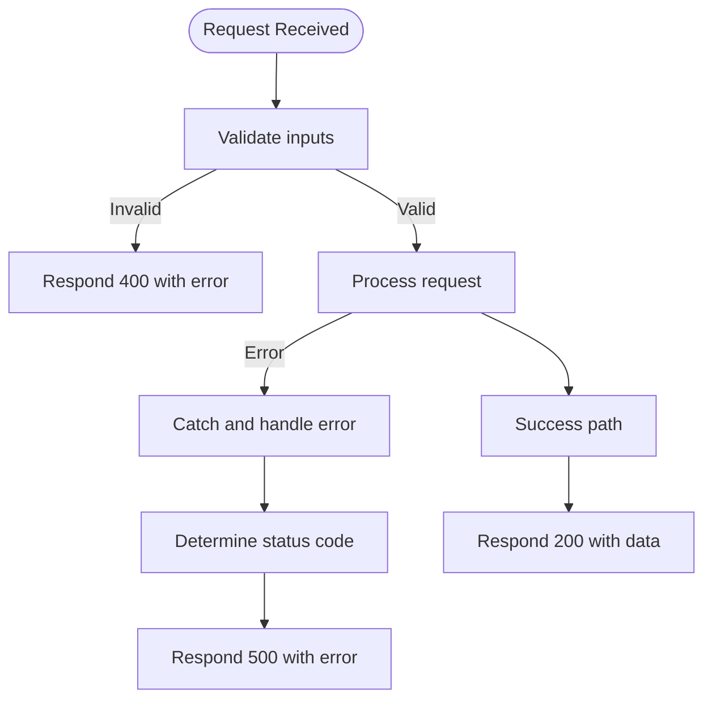
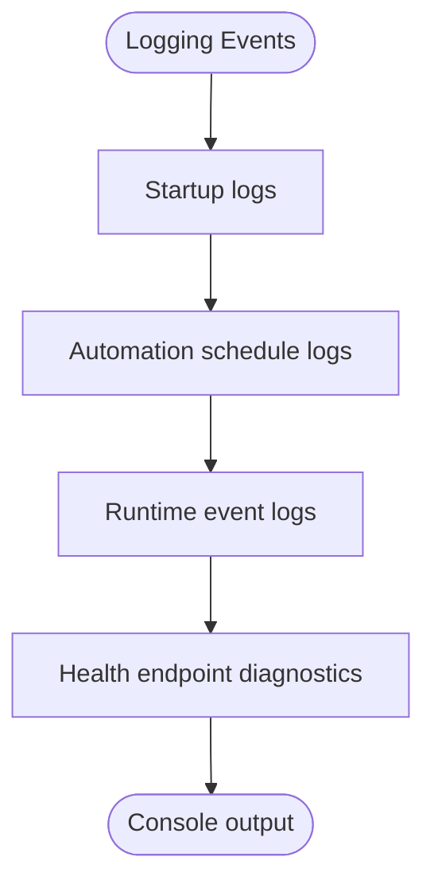
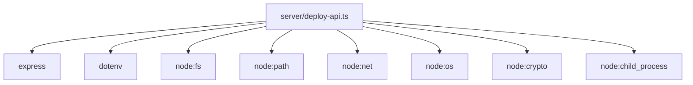

# Express Server Setup and Configuration

<cite>
**Referenced Files in This Document**
- [deploy-api.ts](file://server/deploy-api.ts)
- [assistant-workspace-config.ts](file://server/assistant-workspace-config.ts)
- [module-dirname.ts](file://server/module-dirname.ts)
- [package.json](file://package.json)
</cite>

## Table of Contents
1. [Introduction](#introduction)
2. [Project Structure](#project-structure)
3. [Core Components](#core-components)
4. [Architecture Overview](#architecture-overview)
5. [Detailed Component Analysis](#detailed-component-analysis)
6. [Dependency Analysis](#dependency-analysis)
7. [Performance Considerations](#performance-considerations)
8. [Troubleshooting Guide](#troubleshooting-guide)
9. [Conclusion](#conclusion)

## Introduction
This document explains the Express server setup and configuration used as the central API gateway for the project. It covers server initialization, middleware configuration, environment variable loading via dotenv, port allocation and availability checks, workspace root setup, and the server startup sequence. It also documents error handling patterns, logging configuration, and provides practical examples for different deployment scenarios.

## Project Structure
The server is implemented as a single Express application with modularized concerns:
- Central server entry initializes Express, loads environment variables, sets up middleware, registers routes, and starts the HTTP server.
- Environment variable resolution and .env file management are handled by a dedicated module.
- Utility module resolves the module directory for consistent path resolution across packaging modes.

**Diagram sources**
- [deploy-api.ts:1-800](file://server/deploy-api.ts#L1-L800)
- [assistant-workspace-config.ts:1-202](file://server/assistant-workspace-config.ts#L1-L202)
- [module-dirname.ts:1-23](file://server/module-dirname.ts#L1-L23)

**Section sources**
- [deploy-api.ts:65-80](file://server/deploy-api.ts#L65-L80)
- [assistant-workspace-config.ts:8-31](file://server/assistant-workspace-config.ts#L8-L31)
- [module-dirname.ts:10-22](file://server/module-dirname.ts#L10-L22)

## Core Components
- Express initialization and middleware:
  - Creates the Express app and enables JSON parsing for request bodies.
  - Provides optional static hosting for SPA assets when configured.
- Environment variable loading:
  - Attempts to locate and load a .env file using a prioritized resolution strategy.
  - Exposes helpers to read/write .env content and manage project catalog.
- Port allocation and server startup:
  - Probes for free ports near the configured preferred port.
  - Writes a port file for Vite proxy alignment and logs startup details.
- Route registration:
  - Registers health, assistant, Jira, Jenkins, deployment pipeline, automation, and startup orchestration endpoints.
- Logging and error handling:
  - Comprehensive console logging for startup, scheduling, and runtime events.
  - Graceful error propagation and structured responses across endpoints.

**Section sources**
- [deploy-api.ts:75-77](file://server/deploy-api.ts#L75-L77)
- [deploy-api.ts:1664-1686](file://server/deploy-api.ts#L1664-L1686)
- [deploy-api.ts:1691-1735](file://server/deploy-api.ts#L1691-L1735)
- [assistant-workspace-config.ts:8-31](file://server/assistant-workspace-config.ts#L8-L31)

## Architecture Overview
The server acts as a central API gateway coordinating:
- Local development orchestration (startup, process spawning, streaming logs).
- Assistant capabilities (chat, skills, models, knowledge search).
- Jira integration (authentication status, queries, transitions).
- Jenkins integration (job triggering, polling, pipeline orchestration).
- Environment variable management for secure configuration storage.

**Diagram sources**
- [deploy-api.ts:887-1735](file://server/deploy-api.ts#L887-L1735)
- [assistant-workspace-config.ts:8-31](file://server/assistant-workspace-config.ts#L8-L31)

## Detailed Component Analysis

### Environment Variable Loading and Resolution
The server attempts to load environment variables from multiple locations using a deterministic order:
1. Explicit path from an environment variable.
2. Repository-style location adjacent to the server module.
3. Same-directory location as the server module.
4. Alternative path from another environment variable.

If a .env file is found, it is loaded via the dotenv configuration. Otherwise, a warning is logged indicating that Jira and related variables will only come from the current process environment.

**Diagram sources**
- [assistant-workspace-config.ts:8-24](file://server/assistant-workspace-config.ts#L8-L24)
- [deploy-api.ts:65-73](file://server/deploy-api.ts#L65-L73)

**Section sources**
- [assistant-workspace-config.ts:8-31](file://server/assistant-workspace-config.ts#L8-L31)
- [deploy-api.ts:65-73](file://server/deploy-api.ts#L65-L73)

### Middleware Configuration
- JSON parsing middleware is enabled globally to parse incoming request bodies.
- Optional static hosting for SPA assets is enabled when a directory is configured via an environment variable. Requests under /api are excluded from SPA routing.

**Diagram sources**
- [deploy-api.ts:75-77](file://server/deploy-api.ts#L75-L77)
- [deploy-api.ts:1664-1686](file://server/deploy-api.ts#L1664-L1686)

**Section sources**
- [deploy-api.ts:75-77](file://server/deploy-api.ts#L75-L77)
- [deploy-api.ts:1664-1686](file://server/deploy-api.ts#L1664-L1686)

### Port Configuration and Availability Checking
- Preferred port is read from an environment variable with a default fallback.
- The server probes a range of ports near the preferred port to find an available one.
- Once a free port is found, it writes a port file for Vite proxy alignment and logs the actual listening address.
- On listen errors, the server logs and exits with a non-zero status.

**Diagram sources**
- [deploy-api.ts:78](file://server/deploy-api.ts#L78)
- [deploy-api.ts:1691-1735](file://server/deploy-api.ts#L1691-L1735)

**Section sources**
- [deploy-api.ts:78](file://server/deploy-api.ts#L78)
- [deploy-api.ts:1691-1735](file://server/deploy-api.ts#L1691-L1735)

### Workspace Root and Related Paths
- Workspace root and related paths are derived from environment variables with sensible defaults.
- These paths influence assistant and automation features, including project catalogs and CLI invocation contexts.

**Diagram sources**
- [deploy-api.ts:79-82](file://server/deploy-api.ts#L79-L82)

**Section sources**
- [deploy-api.ts:79-82](file://server/deploy-api.ts#L79-L82)

### Server Startup Sequence
- Initialize Express app and enable JSON parsing.
- Load environment variables from the resolved .env path.
- Register route handlers for health, assistant, Jira, Jenkins, deployment pipeline, automation, and startup orchestration.
- Optionally serve SPA assets statically.
- Allocate a free port and start the HTTP server.
- Schedule automation tasks and log startup details.

**Diagram sources**
- [deploy-api.ts:75-77](file://server/deploy-api.ts#L75-L77)
- [assistant-workspace-config.ts:8-31](file://server/assistant-workspace-config.ts#L8-L31)
- [deploy-api.ts:1664-1686](file://server/deploy-api.ts#L1664-L1686)
- [deploy-api.ts:1691-1735](file://server/deploy-api.ts#L1691-L1735)

**Section sources**
- [deploy-api.ts:75-77](file://server/deploy-api.ts#L75-L77)
- [assistant-workspace-config.ts:8-31](file://server/assistant-workspace-config.ts#L8-L31)
- [deploy-api.ts:1664-1686](file://server/deploy-api.ts#L1664-L1686)
- [deploy-api.ts:1691-1735](file://server/deploy-api.ts#L1691-L1735)

### Error Handling Patterns
- Route handlers return structured JSON responses with appropriate HTTP status codes.
- Global server listen error triggers a console error and process exit.
- Automation and startup tasks capture errors, mark run status as failed, and push failure events.
- Validation steps (e.g., presence of project IDs) return 4xx responses with error messages.

**Diagram sources**
- [deploy-api.ts:1330-1404](file://server/deploy-api.ts#L1330-L1404)
- [deploy-api.ts:1722-1725](file://server/deploy-api.ts#L1722-L1725)

**Section sources**
- [deploy-api.ts:1330-1404](file://server/deploy-api.ts#L1330-L1404)
- [deploy-api.ts:1722-1725](file://server/deploy-api.ts#L1722-L1725)

### Logging Configuration
- Console logging is used extensively during startup, automation scheduling, and runtime events.
- Health endpoints surface configuration status and diagnostics to aid debugging.

**Diagram sources**
- [deploy-api.ts:837-884](file://server/deploy-api.ts#L837-L884)
- [deploy-api.ts:887-908](file://server/deploy-api.ts#L887-L908)

**Section sources**
- [deploy-api.ts:837-884](file://server/deploy-api.ts#L837-L884)
- [deploy-api.ts:887-908](file://server/deploy-api.ts#L887-L908)

### Environment Variable Usage Examples
Below are practical examples of environment variables used across deployment scenarios:

- Basic server configuration
  - DEPLOY_API_PORT: Preferred port for the server (default fallback applies if unset).
  - SERVE_SPA_ROOT: Directory containing SPA assets to serve statically.

- Workspace and automation
  - AUTOMATION_WORKSPACE_ROOT: Root path for automation workspaces.
  - APP_SERVICE_PLUS_PATH: Path to a specific application service directory.
  - AUTOMATION_T1_ENABLED: Enable/disable automation task scheduling.
  - AUTOMATION_T1_SCHEDULES: Comma-separated HH:mm schedule slots.
  - AUTOMATION_T1_CLI_CWD: Working directory for automation CLI commands.
  - AUTOMATION_T1_CLI_BIN: Path to the automation CLI binary.
  - AUTOMATION_T1_CLI_ENTRY: Path to the automation CLI entry script.
  - AUTOMATION_T1_COMMAND: Full automation command to execute.
  - AUTOMATION_T1_ENV: Environment identifier for automation runs.
  - AUTOMATION_T1_EXTRA_ARGS: Extra arguments passed to automation commands.

- Assistant and knowledge
  - GEMINI_API_KEY / GEMINI_MODEL: Gemini configuration for assistant chat.
  - OPENAI_API_KEY / OPENAI_MODEL: OpenAI configuration for assistant chat.
  - OLLAMA_HOST: Host for local LLM inference.
  - ASSISTANT_KB_LOCAL_DIRS: Local knowledge base directories.
  - ASSISTANT_KB_SEARCH_URLS: Remote knowledge base search URLs.
  - ASSISTANT_WIKI_SEARCH_URL_TEMPLATE: Template for wiki search URLs.

- Jira integration
  - JIRA_SERVER_URL: Base URL for Jira.
  - JIRA_USERNAME: Username for Jira authentication.
  - JIRA_PASSWORD: Password for Jira authentication.
  - JIRA_API_TOKEN: API token for Jira authentication.
  - JIRA_REST_PATH_PREFIX: REST API path prefix for Jira.

- Jenkins integration
  - JENKINS_USER: Jenkins username.
  - JENKINS_TOKEN: Jenkins API token.

- Environment file management
  - DEPLOY_API_DOTENV: Explicit path to the .env file to load.
  - ASSISTANT_DOTENV_PATH: Alternative path to the .env file to load.

These variables are referenced throughout the server code and are resolved during startup and runtime.

**Section sources**
- [deploy-api.ts:78](file://server/deploy-api.ts#L78)
- [deploy-api.ts:84-93](file://server/deploy-api.ts#L84-L93)
- [deploy-api.ts:959-984](file://server/deploy-api.ts#L959-L984)
- [deploy-api.ts:1126-1162](file://server/deploy-api.ts#L1126-L1162)
- [deploy-api.ts:1166-1179](file://server/deploy-api.ts#L1166-L1179)
- [deploy-api.ts:1347-1355](file://server/deploy-api.ts#L1347-L1355)
- [assistant-workspace-config.ts:80-95](file://server/assistant-workspace-config.ts#L80-L95)
- [assistant-workspace-config.ts:18-22](file://server/assistant-workspace-config.ts#L18-L22)

## Dependency Analysis
The server depends on:
- Express for HTTP routing and middleware.
- Dotenv for environment variable loading.
- Node.js built-ins for filesystem, path, networking, and process control.

**Diagram sources**
- [deploy-api.ts:1-49](file://server/deploy-api.ts#L1-L49)
- [package.json:35-42](file://package.json#L35-L42)

**Section sources**
- [deploy-api.ts:1-49](file://server/deploy-api.ts#L1-L49)
- [package.json:35-42](file://package.json#L35-L42)

## Performance Considerations
- Port probing avoids blocking and minimizes startup delays by selecting the first available port quickly.
- SPA static serving is optional and only active when a directory is configured, reducing overhead when not needed.
- Streaming endpoints (SSE) for automation and startup events are designed to push incremental updates efficiently.

## Troubleshooting Guide
Common issues and resolutions:
- Port already in use:
  - The server automatically selects a free port near the preferred one and writes a port file for Vite alignment. Check the console logs for the actual port and verify the port file exists.
- Missing .env file:
  - If no .env is found, the server warns that Jira and related variables will only be taken from the current process environment. Ensure the .env file exists at one of the resolved paths or set the explicit path variable.
- SPA static hosting not working:
  - Verify the configured directory exists and is readable. The server logs a warning if the directory is missing.
- Automation scheduling not starting:
  - Confirm that automation is enabled and a command is configured. Review the console logs for scheduling messages and ensure the schedule format is valid.

**Section sources**
- [deploy-api.ts:1714-1721](file://server/deploy-api.ts#L1714-L1721)
- [deploy-api.ts:65-73](file://server/deploy-api.ts#L65-L73)
- [deploy-api.ts:1683-1685](file://server/deploy-api.ts#L1683-L1685)
- [deploy-api.ts:837-884](file://server/deploy-api.ts#L837-L884)

## Conclusion
The Express server is configured as a robust central API gateway with careful environment variable management, flexible port allocation, and comprehensive logging. Its modular design supports development orchestration, assistant services, and integrations with Jira and Jenkins, while maintaining clear separation of concerns and resilient error handling.