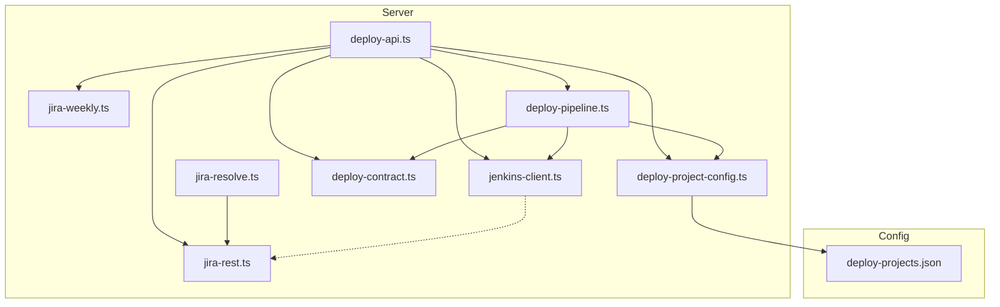
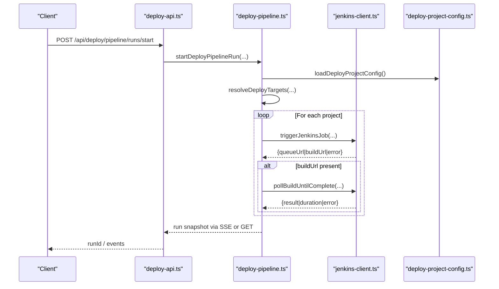
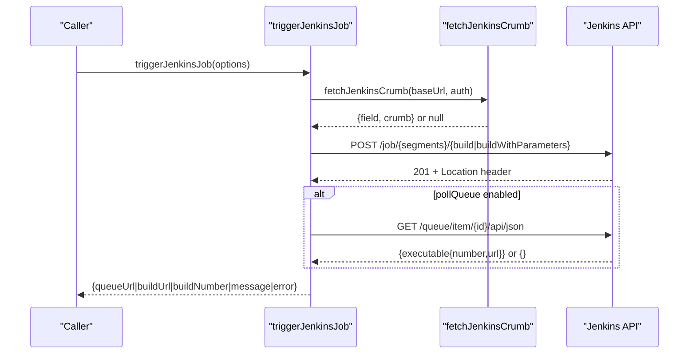
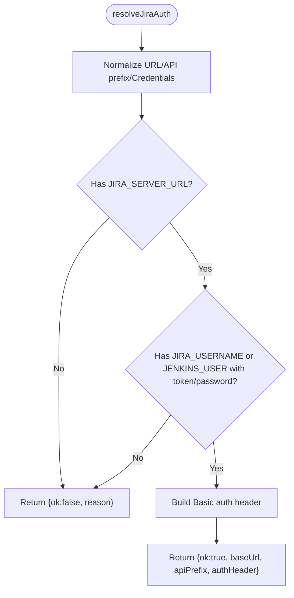
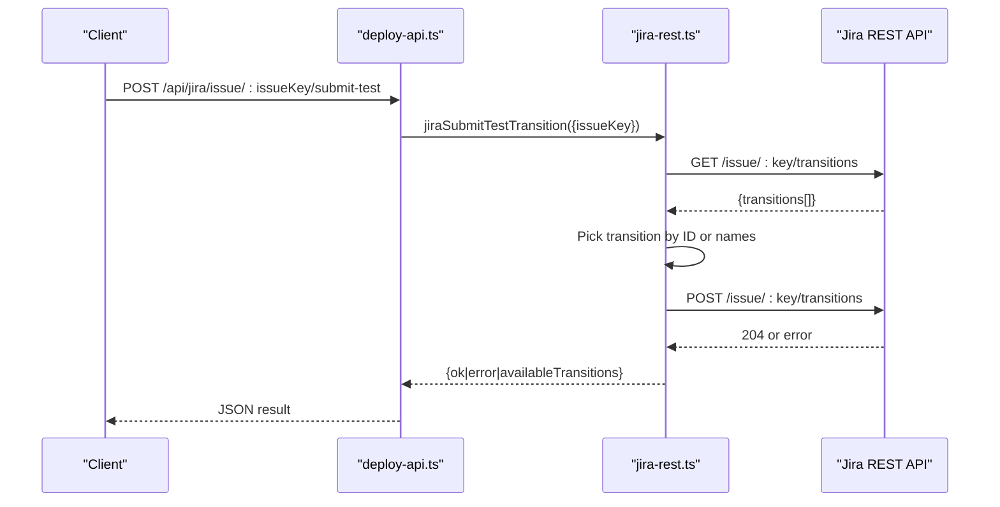
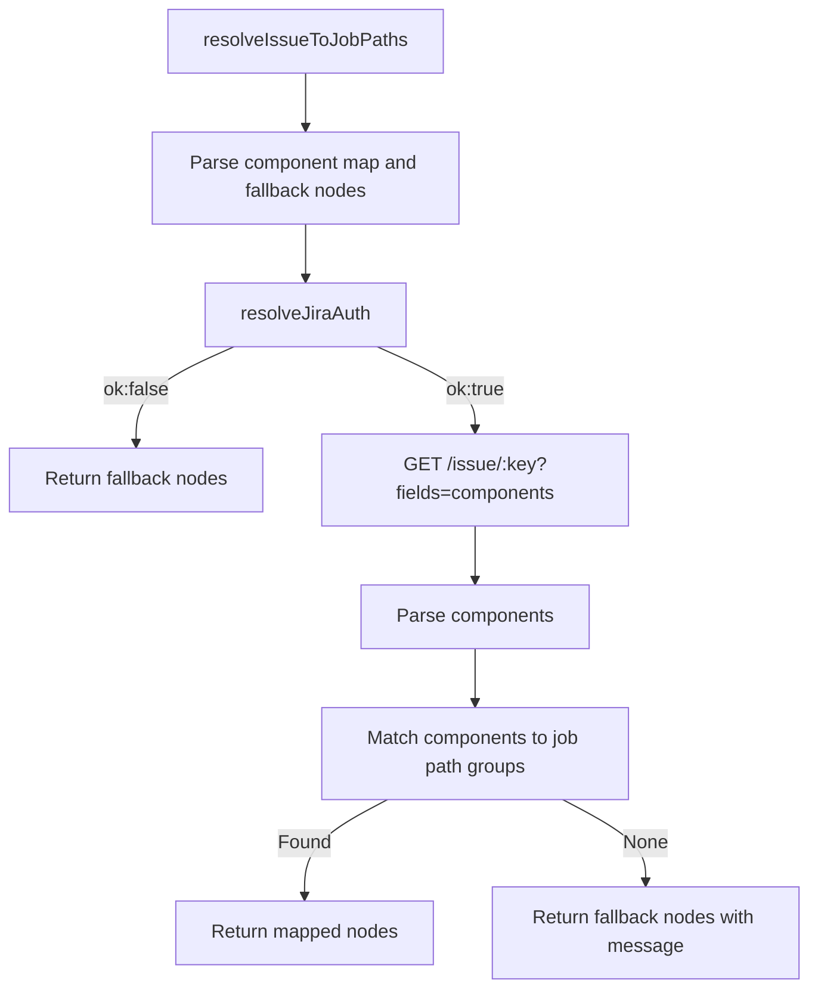
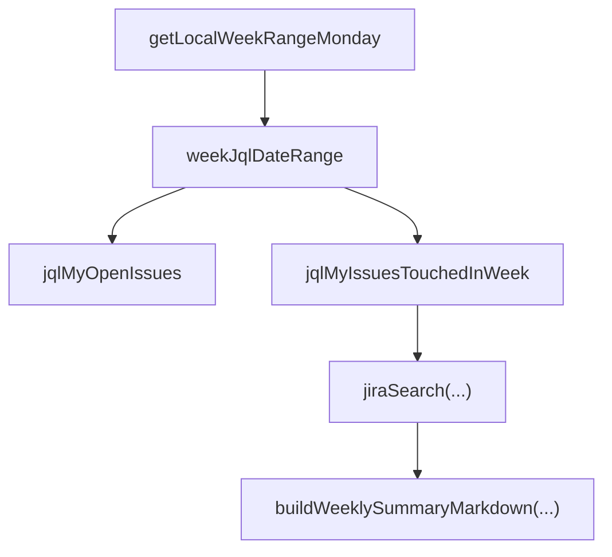
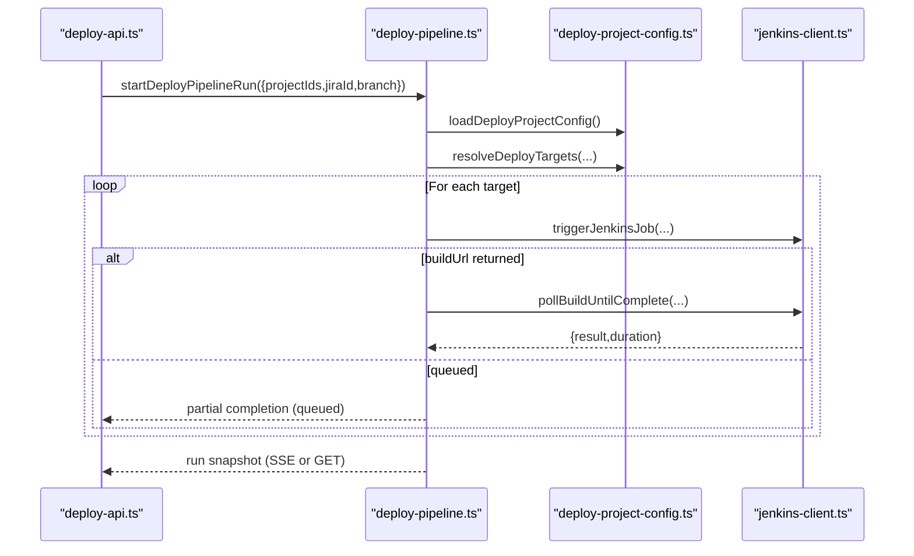
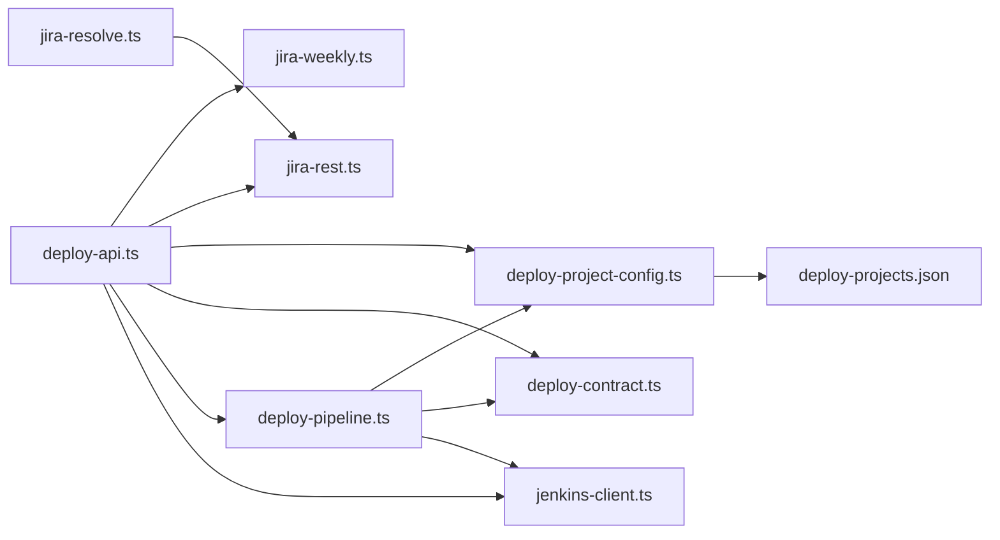

# Jenkins Integration Services

<cite>
**Referenced Files in This Document**
- [jenkins-client.ts](file://server/jenkins-client.ts)
- [jira-rest.ts](file://server/jira-rest.ts)
- [jira-resolve.ts](file://server/jira-resolve.ts)
- [jira-weekly.ts](file://server/jira-weekly.ts)
- [deploy-pipeline.ts](file://server/deploy-pipeline.ts)
- [deploy-contract.ts](file://server/deploy-contract.ts)
- [deploy-project-config.ts](file://server/deploy-project-config.ts)
- [deploy-api.ts](file://server/deploy-api.ts)
- [deploy-projects.json](file://config/deploy-projects.json)
- [jenkins-client.test.ts](file://test/server/jenkins-client.test.ts)
- [jira-rest.test.ts](file://test/server/jira-rest.test.ts)
- [jira-weekly.test.ts](file://test/server/jira-weekly.test.ts)
</cite>

## Table of Contents
1. [Introduction](#introduction)
2. [Project Structure](#project-structure)
3. [Core Components](#core-components)
4. [Architecture Overview](#architecture-overview)
5. [Detailed Component Analysis](#detailed-component-analysis)
6. [Dependency Analysis](#dependency-analysis)
7. [Performance Considerations](#performance-considerations)
8. [Troubleshooting Guide](#troubleshooting-guide)
9. [Conclusion](#conclusion)
10. [Appendices](#appendices)

## Introduction
This document describes the Jenkins integration services implemented in the backend server. It covers:
- Jenkins client capabilities: job triggering, queue polling, and build result polling with robust error handling
- Jira integration services: REST authentication, issue search, workflow transitions, and weekly report generation
- Jira resolution mapping to Jenkins job paths and automated workflow integration
- JQL query construction for issue tracking and weekly summary generation
- Examples of Jenkins job configuration, authentication setup, and error handling for network failures
- Integration patterns between deployment pipelines and Jira workflows

## Project Structure
The integration services are organized under the server directory with clear separation of concerns:
- Jenkins client helpers for triggering jobs and polling builds
- Jira REST utilities for authentication, search, transitions, and weekly summaries
- Resolution mapping from Jira components to Jenkins job path segments
- Deployment pipeline orchestration that coordinates Jenkins triggers and waits for completion
- API endpoints exposing these capabilities via HTTP routes

**Diagram sources**
- [deploy-api.ts:1285-1735](file://server/deploy-api.ts#L1285-L1735)
- [jenkins-client.ts:1-191](file://server/jenkins-client.ts#L1-L191)
- [jira-rest.ts:1-483](file://server/jira-rest.ts#L1-L483)
- [jira-resolve.ts:1-130](file://server/jira-resolve.ts#L1-L130)
- [jira-weekly.ts:1-113](file://server/jira-weekly.ts#L1-L113)
- [deploy-pipeline.ts:1-419](file://server/deploy-pipeline.ts#L1-L419)
- [deploy-contract.ts:1-169](file://server/deploy-contract.ts#L1-L169)
- [deploy-project-config.ts:1-237](file://server/deploy-project-config.ts#L1-L237)
- [deploy-projects.json:1-78](file://config/deploy-projects.json#L1-L78)

**Section sources**
- [deploy-api.ts:1285-1735](file://server/deploy-api.ts#L1285-L1735)
- [jenkins-client.ts:1-191](file://server/jenkins-client.ts#L1-L191)
- [jira-rest.ts:1-483](file://server/jira-rest.ts#L1-L483)
- [jira-resolve.ts:1-130](file://server/jira-resolve.ts#L1-L130)
- [jira-weekly.ts:1-113](file://server/jira-weekly.ts#L1-L113)
- [deploy-pipeline.ts:1-419](file://server/deploy-pipeline.ts#L1-L419)
- [deploy-contract.ts:1-169](file://server/deploy-contract.ts#L1-L169)
- [deploy-project-config.ts:1-237](file://server/deploy-project-config.ts#L1-L237)
- [deploy-projects.json:1-78](file://config/deploy-projects.json#L1-L78)

## Core Components
- Jenkins client: Provides job triggering with Jenkins Crumb support, optional queue polling, and build result polling with timeouts and sanitized error reporting
- Jira REST: Handles authentication normalization, search requests with robust error parsing, and workflow transition submission with flexible matching
- Jira resolution mapping: Maps Jira components to Jenkins job path segments and falls back to configured defaults when needed
- Weekly report generator: Builds natural week ranges, constructs JQL queries, and produces Markdown summaries
- Deployment pipeline: Orchestrates multi-project deployments, triggers Jenkins jobs, waits for completion, and streams progress via SSE

**Section sources**
- [jenkins-client.ts:89-191](file://server/jenkins-client.ts#L89-L191)
- [jira-rest.ts:34-278](file://server/jira-rest.ts#L34-L278)
- [jira-resolve.ts:47-129](file://server/jira-resolve.ts#L47-L129)
- [jira-weekly.ts:3-113](file://server/jira-weekly.ts#L3-L113)
- [deploy-pipeline.ts:182-419](file://server/deploy-pipeline.ts#L182-L419)

## Architecture Overview
The system exposes HTTP endpoints that delegate to internal modules:
- Jenkins endpoints trigger jobs and poll build results
- Jira endpoints handle authentication checks, issue search, workflow transitions, and weekly summaries
- Pipeline endpoints start orchestrated runs and stream progress via Server-Sent Events

**Diagram sources**
- [deploy-api.ts:1441-1514](file://server/deploy-api.ts#L1441-L1514)
- [deploy-pipeline.ts:225-419](file://server/deploy-pipeline.ts#L225-L419)
- [jenkins-client.ts:89-191](file://server/jenkins-client.ts#L89-L191)
- [deploy-project-config.ts:212-236](file://server/deploy-project-config.ts#L212-L236)

## Detailed Component Analysis

### Jenkins Client
Implements job triggering and build polling:
- Authentication header construction and Jenkins Crumb fetching
- Job URL composition from nested job path segments
- Optional queue polling to capture build URL and number
- Build polling with configurable timeout and interval, resilient to transient network issues
- Sanitized error reporting for HTML-based authentication failures

**Diagram sources**
- [jenkins-client.ts:27-142](file://server/jenkins-client.ts#L27-L142)

**Section sources**
- [jenkins-client.ts:27-142](file://server/jenkins-client.ts#L27-L142)
- [jenkins-client.test.ts:38-161](file://test/server/jenkins-client.test.ts#L38-L161)

### Jira REST Authentication and Search
Provides unified authentication resolution and robust search:
- Normalizes environment variables for server URL, API prefix, username, and credentials
- Supports Basic authentication with either password or API token
- Performs search with automatic fallback between API versions when appropriate
- Parses and sanitizes error responses, including HTML-based auth failures

**Diagram sources**
- [jira-rest.ts:34-85](file://server/jira-rest.ts#L34-L85)

**Section sources**
- [jira-rest.ts:34-278](file://server/jira-rest.ts#L34-L278)
- [jira-rest.test.ts:5-29](file://test/server/jira-rest.test.ts#L5-L29)

### Jira Workflow Transition Submission
Supports submitting issues for testing by selecting an appropriate transition:
- Reads available transitions and selects by ID or by name matching rules
- Attempts API v3 first, falls back to v2 when appropriate
- Returns structured results with available transitions for diagnostics

**Diagram sources**
- [deploy-api.ts:1204-1234](file://server/deploy-api.ts#L1204-L1234)
- [jira-rest.ts:292-482](file://server/jira-rest.ts#L292-L482)

**Section sources**
- [jira-rest.ts:292-482](file://server/jira-rest.ts#L292-L482)
- [deploy-api.ts:1204-1234](file://server/deploy-api.ts#L1204-L1234)

### Jira Resolution Mapping to Jenkins Jobs
Maps Jira components to Jenkins job path segments:
- Parses component-to-job-path mappings from environment configuration
- Falls back to configured default nodes when no mapping exists
- Queries Jira issue for components and resolves job paths accordingly

**Diagram sources**
- [jira-resolve.ts:47-129](file://server/jira-resolve.ts#L47-L129)

**Section sources**
- [jira-resolve.ts:47-129](file://server/jira-resolve.ts#L47-L129)

### Weekly Report Generation
Generates a weekly summary of Jira issues:
- Computes natural week boundaries aligned to Monday
- Constructs JQL for “my open” and “touched this week” views
- Produces Markdown summary grouped by status

**Diagram sources**
- [jira-weekly.ts:3-113](file://server/jira-weekly.ts#L3-L113)

**Section sources**
- [jira-weekly.ts:3-113](file://server/jira-weekly.ts#L3-L113)
- [jira-weekly.test.ts:12-59](file://test/server/jira-weekly.test.ts#L12-L59)

### Deployment Pipeline Orchestration
Orchestrates multi-project deployments:
- Loads project configuration and resolves targets per project
- Builds Jenkins parameters and triggers jobs
- Polls build completion and propagates results
- Streams logs and node snapshots via SSE

**Diagram sources**
- [deploy-api.ts:1441-1514](file://server/deploy-api.ts#L1441-L1514)
- [deploy-pipeline.ts:225-419](file://server/deploy-pipeline.ts#L225-L419)
- [deploy-project-config.ts:212-236](file://server/deploy-project-config.ts#L212-L236)
- [jenkins-client.ts:148-191](file://server/jenkins-client.ts#L148-L191)

**Section sources**
- [deploy-pipeline.ts:182-419](file://server/deploy-pipeline.ts#L182-L419)
- [deploy-api.ts:1441-1514](file://server/deploy-api.ts#L1441-L1514)

## Dependency Analysis
Key dependencies and relationships:
- deploy-api.ts composes all integration modules and exposes HTTP endpoints
- deploy-pipeline.ts depends on jenkins-client.ts, deploy-contract.ts, and deploy-project-config.ts
- jira-resolve.ts depends on jira-rest.ts for authentication and Jira API access
- jira-weekly.ts depends on jira-rest.ts types and search utilities
- deploy-projects.json defines project mappings and defaults consumed by deploy-project-config.ts

**Diagram sources**
- [deploy-api.ts:1285-1735](file://server/deploy-api.ts#L1285-L1735)
- [deploy-pipeline.ts:1-419](file://server/deploy-pipeline.ts#L1-L419)
- [jira-resolve.ts:1-130](file://server/jira-resolve.ts#L1-L130)
- [jira-rest.ts:1-483](file://server/jira-rest.ts#L1-L483)
- [jira-weekly.ts:1-113](file://server/jira-weekly.ts#L1-L113)
- [deploy-project-config.ts:1-237](file://server/deploy-project-config.ts#L1-L237)
- [deploy-projects.json:1-78](file://config/deploy-projects.json#L1-L78)

**Section sources**
- [deploy-api.ts:1285-1735](file://server/deploy-api.ts#L1285-L1735)
- [deploy-pipeline.ts:1-419](file://server/deploy-pipeline.ts#L1-L419)
- [jira-resolve.ts:1-130](file://server/jira-resolve.ts#L1-L130)
- [jira-rest.ts:1-483](file://server/jira-rest.ts#L1-L483)
- [jira-weekly.ts:1-113](file://server/jira-weekly.ts#L1-L113)
- [deploy-project-config.ts:1-237](file://server/deploy-project-config.ts#L1-L237)
- [deploy-projects.json:1-78](file://config/deploy-projects.json#L1-L78)

## Performance Considerations
- Jenkins polling intervals and timeouts are configurable to balance responsiveness and resource usage
- Jira search limits results to a bounded range to avoid heavy payloads
- Pipeline memory pruning caps in-memory run history to prevent unbounded growth
- SSE streaming batches events and truncates long logs for efficient client consumption

[No sources needed since this section provides general guidance]

## Troubleshooting Guide
Common issues and resolutions:
- Jenkins authentication failures: The client sanitizes HTML-based login pages into actionable messages indicating credential or permission problems
- Jenkins queue polling timeouts: The client distinguishes between queued and started builds; partial completion halts subsequent nodes
- Jira authentication failures: The resolver detects HTML-based auth pages and suggests checking username, token, or permissions
- Jira API version mismatches: The search and transitions logic attempts API v2 when v3 fails with specific status codes and no user override is set
- Parameter validation: Jenkins parameter names and branch names are validated to prevent injection and malformed requests

**Section sources**
- [jenkins-client.ts:71-87](file://server/jenkins-client.ts#L71-L87)
- [jenkins-client.ts:148-191](file://server/jenkins-client.ts#L148-L191)
- [jira-rest.ts:106-148](file://server/jira-rest.ts#L106-L148)
- [jira-rest.ts:223-255](file://server/jira-rest.ts#L223-L255)
- [deploy-contract.ts:83-120](file://server/deploy-contract.ts#L83-L120)

## Conclusion
The integration services provide a cohesive framework for orchestrating Jenkins deployments and interacting with Jira workflows. They emphasize robust authentication, resilient polling, and clear error reporting, enabling reliable automation across teams and environments.

[No sources needed since this section summarizes without analyzing specific files]

## Appendices

### Jenkins Job Configuration and Authentication Setup
- Jenkins credentials are loaded from environment variables and validated before use
- Job path segments are derived from project configuration and validated for safety
- Parameters for JIRA ID and branch are constructed according to configured parameter names

**Section sources**
- [deploy-contract.ts:33-120](file://server/deploy-contract.ts#L33-L120)
- [deploy-project-config.ts:176-236](file://server/deploy-project-config.ts#L176-L236)
- [deploy-projects.json:1-78](file://config/deploy-projects.json#L1-L78)

### Example API Workflows
- Trigger Jenkins jobs for one or more projects and optionally wait for completion
- Poll a build URL until completion with a configurable timeout
- Start a deployment pipeline run and stream progress via Server-Sent Events
- Query Jira for personal open issues and weekly touched issues, and generate a Markdown summary
- Submit an issue for testing by selecting an appropriate transition

**Section sources**
- [deploy-api.ts:1330-1438](file://server/deploy-api.ts#L1330-L1438)
- [deploy-api.ts:1441-1514](file://server/deploy-api.ts#L1441-L1514)
- [deploy-api.ts:1181-1284](file://server/deploy-api.ts#L1181-L1284)
- [deploy-api.ts:1204-1234](file://server/deploy-api.ts#L1204-L1234)