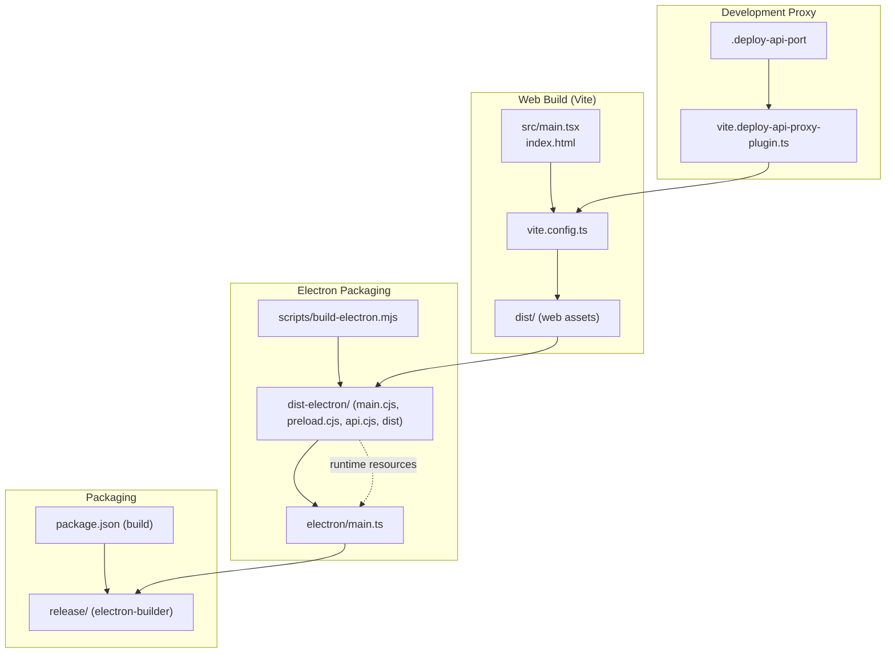
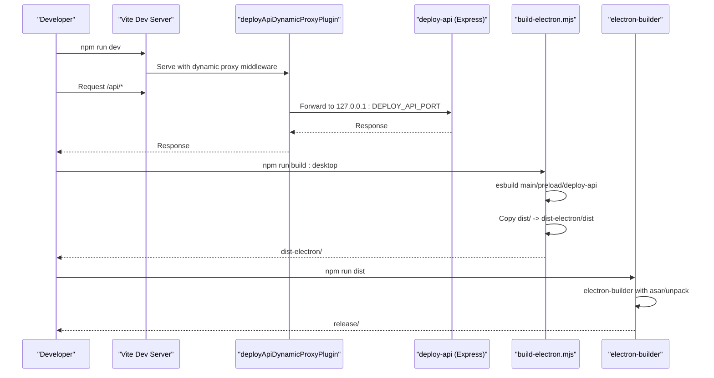
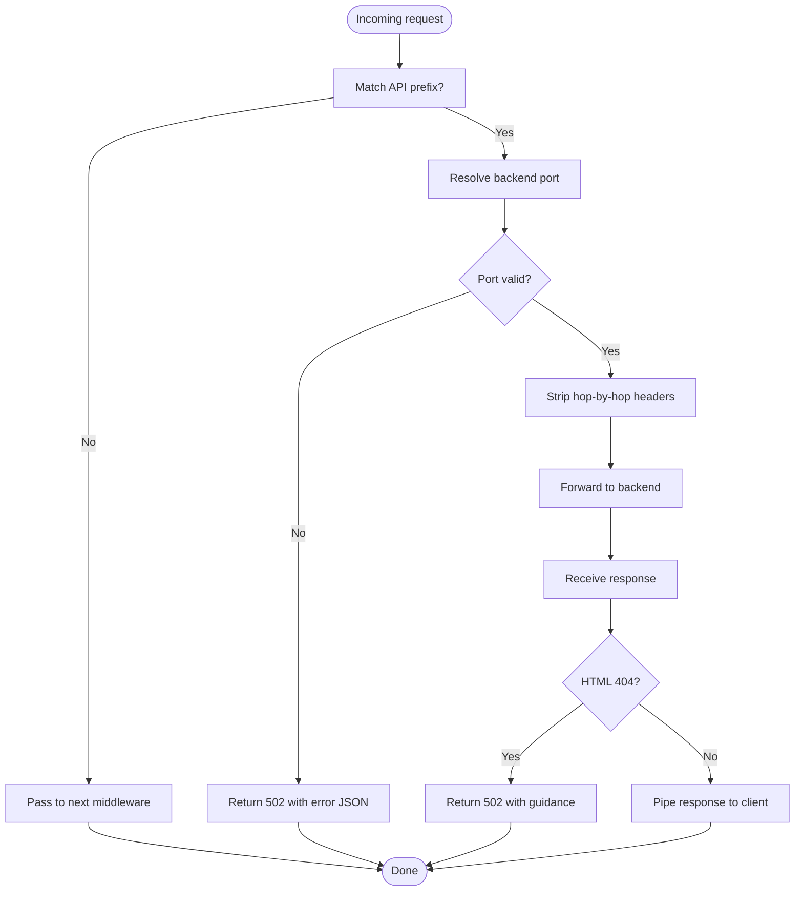
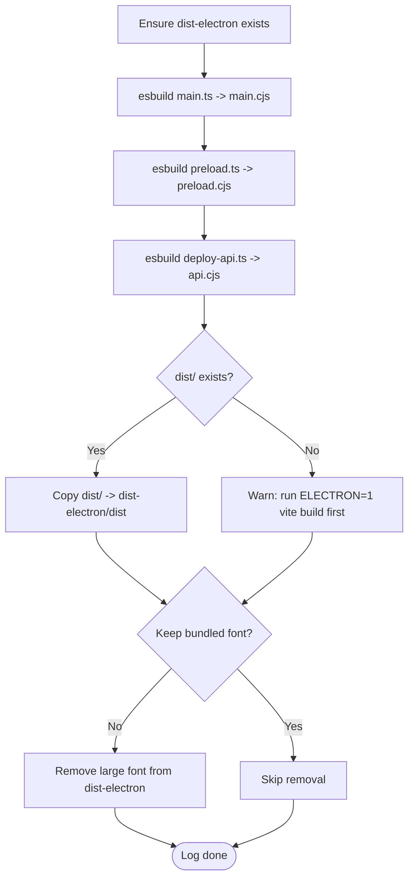
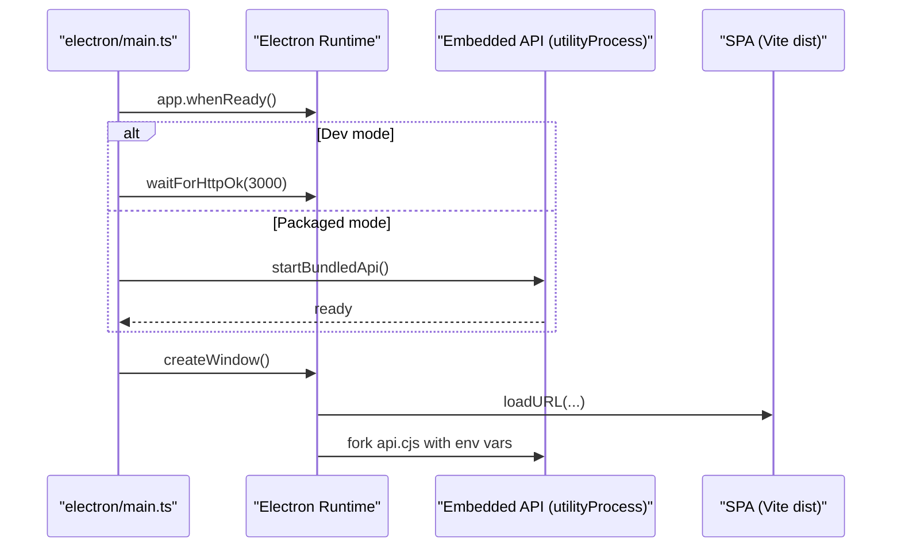
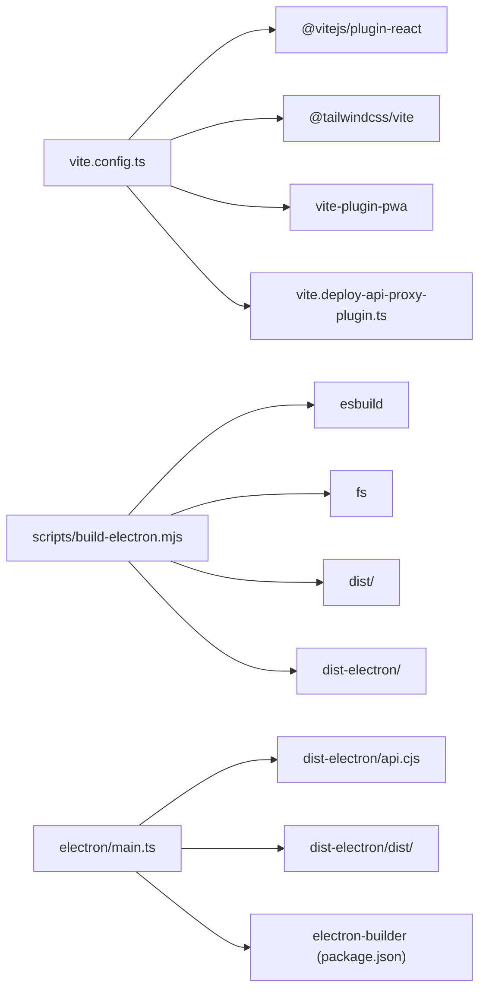

# Build Process

<cite>
**Referenced Files in This Document**
- [package.json](file://package.json)
- [vite.config.ts](file://vite.config.ts)
- [scripts/build-electron.mjs](file://scripts/build-electron.mjs)
- [vite.deploy-api-proxy-plugin.ts](file://vite.deploy-api-proxy-plugin.ts)
- [electron/main.ts](file://electron/main.ts)
- [electron/preload.ts](file://electron/preload.ts)
- [index.html](file://index.html)
- [tsconfig.json](file://tsconfig.json)
- [dev-dist/sw.js](file://dev-dist/sw.js)
- [dev-dist/registerSW.js](file://dev-dist/registerSW.js)
</cite>

## Table of Contents
1. [Introduction](#introduction)
2. [Project Structure](#project-structure)
3. [Core Components](#core-components)
4. [Architecture Overview](#architecture-overview)
5. [Detailed Component Analysis](#detailed-component-analysis)
6. [Dependency Analysis](#dependency-analysis)
7. [Performance Considerations](#performance-considerations)
8. [Troubleshooting Guide](#troubleshooting-guide)
9. [Conclusion](#conclusion)
10. [Appendices](#appendices)

## Introduction
This document explains the complete build process for the project, covering:
- The web build pipeline using Vite, including asset bundling, code splitting, and optimization strategies
- The Electron build orchestrated by a dedicated script, including resource copying, asset bundling, and platform-specific optimizations
- The build scripts defined in package.json for development, client builds, desktop builds, and packaging
- The Vite configuration including PWA support, dynamic proxying, and development server behavior
- Build artifacts and output directories
- Optimization techniques, bundle analysis guidance, and performance considerations
- Common build issues and troubleshooting steps

## Project Structure
The build system spans three primary areas:
- Web application built with Vite and React
- Electron packaging and runtime, using esbuild for main/preload/deploy-api
- Development-time proxying of API routes to a local backend

**Diagram sources**
- [vite.config.ts:1-111](file://vite.config.ts#L1-L111)
- [scripts/build-electron.mjs:1-76](file://scripts/build-electron.mjs#L1-L76)
- [electron/main.ts:1-434](file://electron/main.ts#L1-L434)
- [package.json:61-97](file://package.json#L61-L97)
- [vite.deploy-api-proxy-plugin.ts:1-166](file://vite.deploy-api-proxy-plugin.ts#L1-L166)

**Section sources**
- [package.json:9-30](file://package.json#L9-L30)
- [vite.config.ts:8-111](file://vite.config.ts#L8-L111)
- [scripts/build-electron.mjs:1-76](file://scripts/build-electron.mjs#L1-L76)
- [electron/main.ts:17-21](file://electron/main.ts#L17-L21)

## Core Components
- Vite configuration controls PWA, proxying, aliases, and dev server behavior
- Electron build script compiles main/preload/deploy-api with esbuild and copies web assets
- Dynamic proxy plugin forwards API routes to the backend service
- Package scripts orchestrate dev, client, desktop, and packaging workflows
- Runtime Electron loads bundled assets and starts the embedded API

**Section sources**
- [vite.config.ts:21-78](file://vite.config.ts#L21-L78)
- [scripts/build-electron.mjs:26-47](file://scripts/build-electron.mjs#L26-L47)
- [vite.deploy-api-proxy-plugin.ts:151-166](file://vite.deploy-api-proxy-plugin.ts#L151-L166)
- [package.json:9-30](file://package.json#L9-L30)
- [electron/main.ts:180-257](file://electron/main.ts#L180-L257)

## Architecture Overview
The build pipeline integrates web and desktop concerns:
- Web build produces static assets in dist/
- Electron build script bundles Node-side code and copies dist into dist-electron
- During development, Vite proxies API routes to a locally running backend
- Electron loads the SPA and embedded API depending on mode

**Diagram sources**
- [vite.deploy-api-proxy-plugin.ts:161-163](file://vite.deploy-api-proxy-plugin.ts#L161-L163)
- [scripts/build-electron.mjs:49-55](file://scripts/build-electron.mjs#L49-L55)
- [package.json:26-28](file://package.json#L26-L28)
- [electron/main.ts:17-21](file://electron/main.ts#L17-L21)

## Detailed Component Analysis

### Vite Web Build and Configuration
- PWA support is enabled conditionally for web builds; Service Worker and Workbox are excluded for Electron clients
- Dynamic proxy plugin forwards API routes to the backend service whose port is resolved per-request from a file or environment
- Aliases and dev server settings tailor the development experience
- Base path differs for Electron client builds to support asar loading

Key behaviors:
- PWA manifest and assets configured; increased maximum file size for caching
- Runtime caching strategy varies by environment (network-first vs. network-only for /api)
- Development server supports HMR controlled by an environment variable
- Electron client sets base to "./" to resolve assets inside asar

**Section sources**
- [vite.config.ts:21-78](file://vite.config.ts#L21-L78)
- [vite.config.ts:103-108](file://vite.config.ts#L103-L108)
- [vite.config.ts:80-94](file://vite.config.ts#L80-L94)
- [vite.config.ts:15-17](file://vite.config.ts#L15-L17)

#### Dynamic API Proxy Middleware
- Intercepts requests prefixed with known API paths
- Resolves target port from environment, process environment, or a port file
- Strips hop-by-hop headers and forwards requests with timeouts
- Returns structured errors when the backend is unreachable or returns HTML on 404

**Diagram sources**
- [vite.deploy-api-proxy-plugin.ts:72-148](file://vite.deploy-api-proxy-plugin.ts#L72-L148)

**Section sources**
- [vite.deploy-api-proxy-plugin.ts:10-19](file://vite.deploy-api-proxy-plugin.ts#L10-L19)
- [vite.deploy-api-proxy-plugin.ts:43-55](file://vite.deploy-api-proxy-plugin.ts#L43-L55)
- [vite.deploy-api-proxy-plugin.ts:136-145](file://vite.deploy-api-proxy-plugin.ts#L136-L145)

### Electron Build Script
- Uses esbuild to compile:
  - Main process: main.ts to main.cjs with minification
  - Preload: preload.ts to preload.cjs
  - Embedded API: deploy-api.ts to api.cjs with minification
- Copies Vite’s dist/ into dist-electron/dist if present
- Removes a large bundled font to speed up asar/zip unless explicitly kept
- Logs warnings and completion status

**Diagram sources**
- [scripts/build-electron.mjs:14-75](file://scripts/build-electron.mjs#L14-L75)

**Section sources**
- [scripts/build-electron.mjs:26-47](file://scripts/build-electron.mjs#L26-L47)
- [scripts/build-electron.mjs:49-55](file://scripts/build-electron.mjs#L49-L55)
- [scripts/build-electron.mjs:57-73](file://scripts/build-electron.mjs#L57-L73)

### Electron Runtime and Resource Loading
- Determines whether to connect to Vite dev server or the embedded API based on an environment flag
- Starts the embedded API as a separate process and waits for health checks
- Loads SPA from http://127.0.0.1:3000 (dev) or from bundled SPA root (production)
- Uses asar unpacking to ensure the API binary can be executed from packaged app

**Diagram sources**
- [electron/main.ts:389-406](file://electron/main.ts#L389-L406)
- [electron/main.ts:180-257](file://electron/main.ts#L180-L257)
- [electron/main.ts:259-297](file://electron/main.ts#L259-L297)

**Section sources**
- [electron/main.ts:17-21](file://electron/main.ts#L17-L21)
- [electron/main.ts:105-110](file://electron/main.ts#L105-L110)
- [electron/main.ts:180-257](file://electron/main.ts#L180-L257)
- [electron/main.ts:259-297](file://electron/main.ts#L259-L297)

### Build Scripts in package.json
- Development: runs Vite dev server and backend concurrently; desktop variant adds Electron dev mode
- Client builds: standalone web build and Electron client build
- Desktop build: combines client and Electron packaging
- Packaging: uses electron-builder to produce a zip archive

Key scripts:
- dev, dev:api, dev:vite, dev:vite-only
- predev:desktop, dev:desktop
- prestart, build:web, build:client, build:electron, build:desktop, build
- start, preview, clean
- dist, dist:dir
- test, lint

**Section sources**
- [package.json:9-30](file://package.json#L9-L30)
- [package.json:61-97](file://package.json#L61-L97)

### Build Configuration in vite.config.ts
Highlights:
- Conditional PWA plugin activation for non-Electron builds
- Dynamic proxy plugin enabled in serve mode unless explicitly disabled
- Environment-driven API key exposure
- Alias @ pointing to project root
- Development server HMR controlled by environment variable
- Base path set to "./" for Electron client builds

**Section sources**
- [vite.config.ts:8-17](file://vite.config.ts#L8-L17)
- [vite.config.ts:21-78](file://vite.config.ts#L21-L78)
- [vite.config.ts:95-102](file://vite.config.ts#L95-L102)
- [vite.config.ts:103-108](file://vite.config.ts#L103-L108)
- [vite.config.ts:80-94](file://vite.config.ts#L80-L94)

### Build Artifacts and Output Directories
- dist/: generated by Vite for web builds
- dist-electron/: generated by the Electron build script; includes main.cjs, preload.cjs, api.cjs, and copied dist
- release/: produced by electron-builder packaging
- dev-dist/: contains development Service Worker and registration script

**Section sources**
- [scripts/build-electron.mjs:49-55](file://scripts/build-electron.mjs#L49-L55)
- [package.json:66-71](file://package.json#L66-L71)
- [dev-dist/sw.js:1-93](file://dev-dist/sw.js#L1-L93)
- [dev-dist/registerSW.js:1-1](file://dev-dist/registerSW.js#L1-L1)

## Dependency Analysis
- Vite configuration depends on:
  - React plugin
  - TailwindCSS plugin
  - PWA plugin (disabled for Electron client)
  - Dynamic proxy plugin (enabled in serve mode)
- Electron build script depends on:
  - esbuild for Node targets
  - filesystem operations to copy and prune assets
- Electron main process depends on:
  - Embedded API binary
  - Bundled SPA assets
  - Platform-specific resource paths

**Diagram sources**
- [vite.config.ts:1-7](file://vite.config.ts#L1-L7)
- [scripts/build-electron.mjs:5-47](file://scripts/build-electron.mjs#L5-L47)
- [electron/main.ts:105-110](file://electron/main.ts#L105-L110)
- [package.json:61-97](file://package.json#L61-L97)

**Section sources**
- [vite.config.ts:1-7](file://vite.config.ts#L1-L7)
- [scripts/build-electron.mjs:5-47](file://scripts/build-electron.mjs#L5-L47)
- [electron/main.ts:105-110](file://electron/main.ts#L105-L110)
- [package.json:61-97](file://package.json#L61-L97)

## Performance Considerations
- PWA caching:
  - Increased maximum file size for precaching to accommodate large fonts
  - Runtime caching excludes /api in development to avoid caching HTML error pages
- Electron client optimizations:
  - Excludes PWA assets to reduce bundle size and improve asar/zip performance
  - Removes large bundled font by default to accelerate packaging
- Build tooling:
  - esbuild minifies Node binaries for main and API
  - Vite HMR can be disabled to reduce flickering during agent edits
- Resource paths:
  - Electron client uses relative base to support asar resolution

Recommendations:
- Keep PWA disabled for Electron builds
- Consider keeping the large font only when necessary; otherwise remove it
- Monitor cache sizes and adjust maximum file size if adding large assets
- Use environment flags to toggle HMR and debug features in development

**Section sources**
- [vite.config.ts:55-77](file://vite.config.ts#L55-L77)
- [scripts/build-electron.mjs:57-73](file://scripts/build-electron.mjs#L57-L73)
- [vite.config.ts:103-108](file://vite.config.ts#L103-L108)

## Troubleshooting Guide
Common issues and remedies:
- Missing dist/ for Electron build:
  - Ensure to run the Electron client build before packaging
  - The script warns if dist/ does not exist
- Large font slowing down packaging:
  - The script removes the large font by default; set an environment variable to keep it if needed
- API proxy errors:
  - Verify the backend port file or environment variable
  - Confirm the backend is listening on the expected port
  - The proxy returns structured errors when the backend returns HTML on 404
- Electron dev connection failures:
  - Ensure Vite dev server is reachable on the expected port
  - Confirm the Electron dev mode flag is set appropriately
- Packaging failures:
  - Check electron-builder configuration and output directory
  - Validate extraResources and asar settings

**Section sources**
- [scripts/build-electron.mjs:53-55](file://scripts/build-electron.mjs#L53-L55)
- [scripts/build-electron.mjs:57-73](file://scripts/build-electron.mjs#L57-L73)
- [vite.deploy-api-proxy-plugin.ts:92-98](file://vite.deploy-api-proxy-plugin.ts#L92-L98)
- [vite.deploy-api-proxy-plugin.ts:120-129](file://vite.deploy-api-proxy-plugin.ts#L120-L129)
- [electron/main.ts:391-395](file://electron/main.ts#L391-L395)
- [package.json:61-97](file://package.json#L61-L97)

## Conclusion
The build system cleanly separates web and desktop concerns:
- Vite handles modern web bundling, optional PWA, and development-time proxying
- A dedicated Electron build script compiles Node-side code and packages assets
- Runtime logic in Electron chooses between dev server and embedded API
- Scripts and configuration provide flexible workflows for development, packaging, and distribution

## Appendices

### Appendix A: PWA Assets and Service Worker (Development)
- Development Service Worker and registration script are included for local testing
- These are not part of production builds for Electron clients

**Section sources**
- [dev-dist/sw.js:1-93](file://dev-dist/sw.js#L1-L93)
- [dev-dist/registerSW.js:1-1](file://dev-dist/registerSW.js#L1-L1)

### Appendix B: TypeScript Configuration Reference
- Path aliases and module resolution tailored for Vite and bundler
- JSX and DOM library settings aligned with the web stack

**Section sources**
- [tsconfig.json:1-28](file://tsconfig.json#L1-L28)