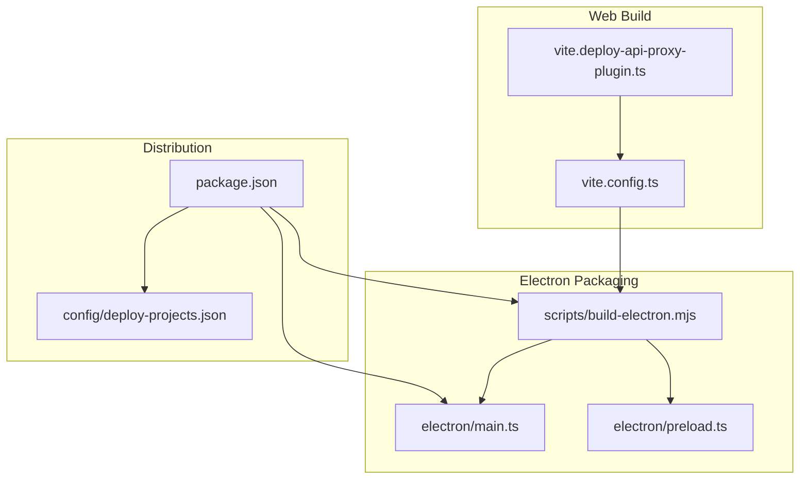
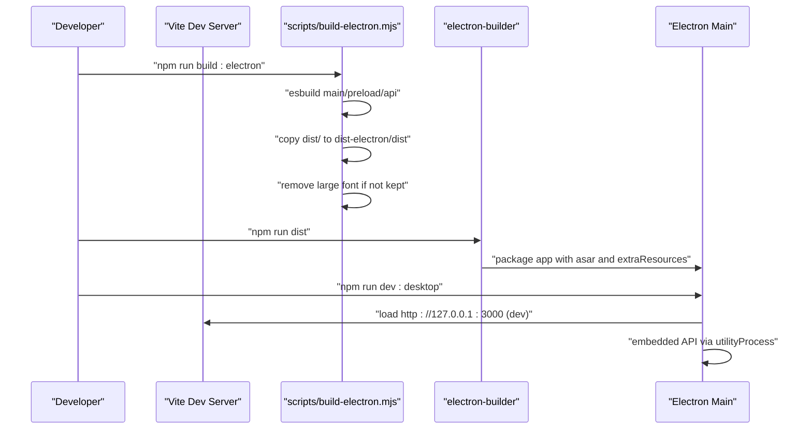
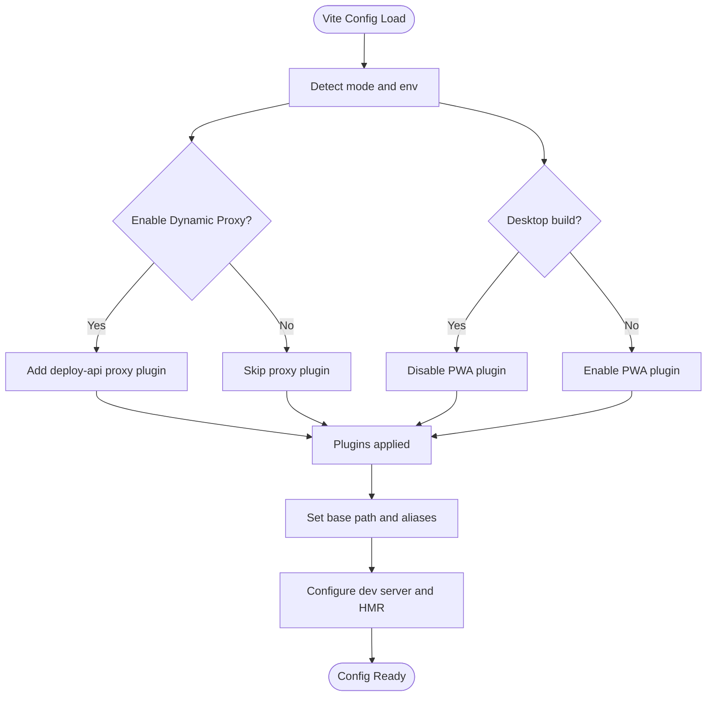
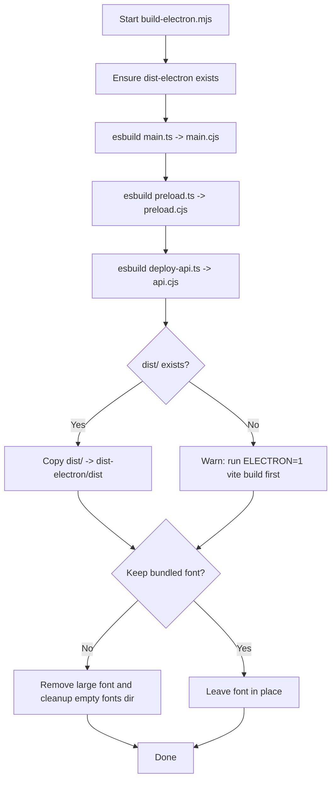
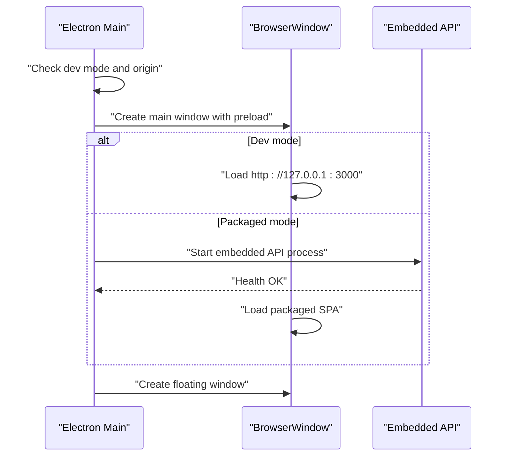
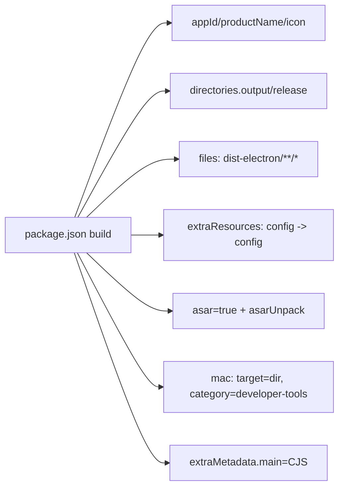
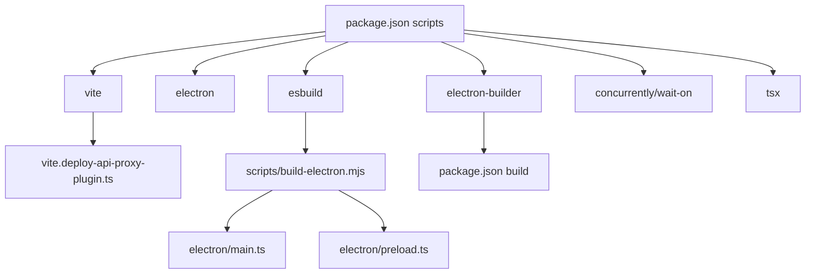

# Build and Deployment

<cite>
**Referenced Files in This Document**
- [package.json](file://package.json)
- [vite.config.ts](file://vite.config.ts)
- [scripts/build-electron.mjs](file://scripts/build-electron.mjs)
- [electron/main.ts](file://electron/main.ts)
- [electron/preload.ts](file://electron/preload.ts)
- [vite.deploy-api-proxy-plugin.ts](file://vite.deploy-api-proxy-plugin.ts)
- [config/deploy-projects.json](file://config/deploy-projects.json)
- [docs/superpowers/plans/2026-05-03-real-jenkins-deployment.md](file://docs/superpowers/plans/2026-05-03-real-jenkins-deployment.md)
- [docs/superpowers/specs/2026-05-03-real-jenkins-deployment-design.md](file://docs/superpowers/specs/2026-05-03-real-jenkins-deployment-design.md)
</cite>

## Table of Contents
1. [Introduction](#introduction)
2. [Project Structure](#project-structure)
3. [Core Components](#core-components)
4. [Architecture Overview](#architecture-overview)
5. [Detailed Component Analysis](#detailed-component-analysis)
6. [Dependency Analysis](#dependency-analysis)
7. [Performance Considerations](#performance-considerations)
8. [Troubleshooting Guide](#troubleshooting-guide)
9. [Conclusion](#conclusion)
10. [Appendices](#appendices)

## Introduction
This document explains the complete build and deployment process for the desktop application. It covers the multi-stage build pipeline that combines a modern web build with Vite, an Electron packaging step, and distribution preparation using electron-builder. It also documents the scripts in package.json, the Electron build process implemented in a dedicated build script, distribution configuration, and the planned CI/CD integration for automated deployment to Jenkins. Finally, it outlines optimization strategies, platform packaging details, and troubleshooting guidance.

## Project Structure
The build and deployment pipeline spans several areas:
- Web build and development server powered by Vite
- Electron packaging script that compiles main/preload processes and bundles the web assets
- Electron main process that launches the UI and embedded backend
- Distribution configuration for electron-builder
- CI/CD planning for real Jenkins deployments

**Diagram sources**
- [vite.config.ts:1-111](file://vite.config.ts#L1-L111)
- [vite.deploy-api-proxy-plugin.ts:1-166](file://vite.deploy-api-proxy-plugin.ts#L1-L166)
- [scripts/build-electron.mjs:1-76](file://scripts/build-electron.mjs#L1-L76)
- [electron/main.ts:1-434](file://electron/main.ts#L1-L434)
- [electron/preload.ts:1-21](file://electron/preload.ts#L1-L21)
- [package.json:1-99](file://package.json#L1-L99)
- [config/deploy-projects.json:1-78](file://config/deploy-projects.json#L1-L78)

**Section sources**
- [package.json:1-99](file://package.json#L1-L99)
- [vite.config.ts:1-111](file://vite.config.ts#L1-L111)
- [scripts/build-electron.mjs:1-76](file://scripts/build-electron.mjs#L1-L76)
- [electron/main.ts:1-434](file://electron/main.ts#L1-L434)
- [electron/preload.ts:1-21](file://electron/preload.ts#L1-L21)
- [vite.deploy-api-proxy-plugin.ts:1-166](file://vite.deploy-api-proxy-plugin.ts#L1-L166)
- [config/deploy-projects.json:1-78](file://config/deploy-projects.json#L1-L78)

## Core Components
- Web build with Vite
  - React and Tailwind plugins, dynamic proxy for /api routes, PWA plugin for web builds, and environment-driven toggles for development and desktop modes.
- Electron packaging
  - esbuild-based compilation of main, preload, and the embedded API service into dist-electron with asset bundling and font optimization.
- Electron runtime
  - Main process manages windows, IPC, embedded backend lifecycle, and loading behavior for dev vs packaged modes.
- Distribution with electron-builder
  - Application metadata, asar packaging, extra resources, and platform-specific targets and categories.
- CI/CD planning
  - Jenkins integration plan and design for real deployment triggers and status reporting.

**Section sources**
- [vite.config.ts:1-111](file://vite.config.ts#L1-L111)
- [scripts/build-electron.mjs:1-76](file://scripts/build-electron.mjs#L1-L76)
- [electron/main.ts:1-434](file://electron/main.ts#L1-L434)
- [package.json:61-97](file://package.json#L61-L97)
- [docs/superpowers/plans/2026-05-03-real-jenkins-deployment.md:1-51](file://docs/superpowers/plans/2026-05-03-real-jenkins-deployment.md#L1-L51)
- [docs/superpowers/specs/2026-05-03-real-jenkins-deployment-design.md:1-32](file://docs/superpowers/specs/2026-05-03-real-jenkins-deployment-design.md#L1-L32)

## Architecture Overview
The build pipeline integrates Vite for web assets, an Electron packaging step, and electron-builder for distribution. The Electron main process loads either a dev server or the packaged SPA and runs an embedded backend service.

**Diagram sources**
- [scripts/build-electron.mjs:17-76](file://scripts/build-electron.mjs#L17-L76)
- [package.json:15-29](file://package.json#L15-L29)
- [electron/main.ts:16-257](file://electron/main.ts#L16-L257)

## Detailed Component Analysis

### Web Build with Vite
- Plugins and configuration
  - React and Tailwind CSS plugins are enabled.
  - A dynamic proxy plugin forwards /api/* requests to the embedded backend, reading the current port from a file or environment.
  - PWA plugin is included for web builds; desktop builds exclude PWA to reduce bundle size and improve asar performance.
- Environment-driven behavior
  - Development mode toggles proxy and HMR.
  - Desktop mode sets base path to "./" for asar-relative asset loading.
- Service Worker and caching
  - PWA Workbox configuration increases maximum file size and adjusts runtime caching for development vs production.
  - Development disables offline caching for /api to avoid caching HTML error pages.

**Diagram sources**
- [vite.config.ts:8-110](file://vite.config.ts#L8-L110)
- [vite.deploy-api-proxy-plugin.ts:10-166](file://vite.deploy-api-proxy-plugin.ts#L10-L166)

**Section sources**
- [vite.config.ts:1-111](file://vite.config.ts#L1-L111)
- [vite.deploy-api-proxy-plugin.ts:1-166](file://vite.deploy-api-proxy-plugin.ts#L1-L166)

### Electron Packaging Script
- Purpose
  - Compile main, preload, and the embedded API service using esbuild into dist-electron.
  - Copy the Vite-built web assets into dist-electron/dist.
  - Remove a large bundled font by default to speed up asar/zip packaging.
- Build steps
  - Create output directory if missing.
  - esbuild main.ts to dist-electron/main.cjs (minified).
  - esbuild preload.ts to dist-electron/preload.cjs (not minified).
  - esbuild server/deploy-api.ts to dist-electron/api.cjs (minified).
  - Copy dist/ to dist-electron/dist if present.
  - Optionally remove the large font file and empty fonts directory.
- Environment control
  - ELECTRON_KEEP_BUNDLED_FONT=1 preserves the font in the package.

**Diagram sources**
- [scripts/build-electron.mjs:14-76](file://scripts/build-electron.mjs#L14-L76)

**Section sources**
- [scripts/build-electron.mjs:1-76](file://scripts/build-electron.mjs#L1-L76)

### Electron Main Process
- Window management
  - Creates main and floating windows with appropriate preferences and IPC handlers.
  - Loads either the dev server (when dev flag is set) or the packaged SPA.
- Embedded backend lifecycle
  - Ensures the backend port is free, starts the embedded API via a utility process, and waits for health checks.
  - Reads configuration from resources and supports a user-specific .env file.
- Platform specifics
  - Floating window behavior differs slightly on macOS for always-on-top and visibility.
- IPC bridge
  - Exposes a small API surface to the renderer via contextBridge for opening windows and resizing/moving the floating window.

**Diagram sources**
- [electron/main.ts:23-297](file://electron/main.ts#L23-L297)
- [electron/preload.ts:1-21](file://electron/preload.ts#L1-L21)

**Section sources**
- [electron/main.ts:1-434](file://electron/main.ts#L1-L434)
- [electron/preload.ts:1-21](file://electron/preload.ts#L1-L21)

### Distribution with electron-builder
- Application metadata
  - App ID, product name, icon, output directory, and main entry for packaged mode.
- Packaging
  - Uses asar with selective unpacking for performance.
  - Copies config directory as extra resources.
- Platform configuration
  - macOS target currently set to directory output with developer category.
  - Extra metadata sets the packaged main entry to CommonJS.
- Scripts
  - Provides commands to build desktop assets and run electron-builder for zip or directory outputs.

**Diagram sources**
- [package.json:61-97](file://package.json#L61-L97)

**Section sources**
- [package.json:61-97](file://package.json#L61-L97)

### CI/CD and Automated Deployment
- Planning
  - The project includes a plan and design document for integrating real Jenkins deployments, including request/response contracts, parameter handling, and status reporting.
- Scope
  - The backend will trigger Jenkins jobs via REST APIs, and the frontend will reflect real queue/build URLs instead of simulated progress.
- Next steps
  - Implement tests for the Jenkins client, refine the BFF contract, update the deployment UI, and validate with tests and builds.

**Section sources**
- [docs/superpowers/plans/2026-05-03-real-jenkins-deployment.md:1-51](file://docs/superpowers/plans/2026-05-03-real-jenkins-deployment.md#L1-L51)
- [docs/superpowers/specs/2026-05-03-real-jenkins-deployment-design.md:1-32](file://docs/superpowers/specs/2026-05-03-real-jenkins-deployment-design.md#L1-L32)

## Dependency Analysis
Key build-time and runtime dependencies:
- Vite and plugins for web build and PWA generation
- esbuild for Electron main/preload/API compilation
- electron-builder for packaging and distribution
- Development and testing utilities (concurrently, wait-on, tsx)

**Diagram sources**
- [package.json:9-29](file://package.json#L9-L29)
- [vite.deploy-api-proxy-plugin.ts:1-166](file://vite.deploy-api-proxy-plugin.ts#L1-L166)
- [scripts/build-electron.mjs:5-47](file://scripts/build-electron.mjs#L5-L47)
- [electron/main.ts:1-10](file://electron/main.ts#L1-L10)

**Section sources**
- [package.json:9-29](file://package.json#L9-L29)
- [vite.deploy-api-proxy-plugin.ts:1-166](file://vite.deploy-api-proxy-plugin.ts#L1-L166)
- [scripts/build-electron.mjs:5-47](file://scripts/build-electron.mjs#L5-L47)
- [electron/main.ts:1-10](file://electron/main.ts#L1-L10)

## Performance Considerations
- Web build
  - Desktop builds disable PWA to reduce bundle size and improve asar/zip performance.
  - Base path is set to "./" for desktop to support asar-relative asset loading.
  - Workbox maximum file size increased to accommodate large fonts while keeping cache limits reasonable.
- Electron packaging
  - Minification enabled for main and API bundles; preload intentionally not minified for readability and debugging.
  - Large bundled font removed by default to speed up packaging; can be preserved via environment variable.
- Distribution
  - asar enabled with selective unpacking to balance security and performance.
  - Extra resources copied only when needed (e.g., config directory).

**Section sources**
- [vite.config.ts:18-78](file://vite.config.ts#L18-L78)
- [scripts/build-electron.mjs:30-47](file://scripts/build-electron.mjs#L30-L47)
- [scripts/build-electron.mjs:57-73](file://scripts/build-electron.mjs#L57-L73)
- [package.json:81-84](file://package.json#L81-L84)

## Troubleshooting Guide
- Vite dev proxy issues
  - Ensure the embedded API port file exists or set the port via environment; the proxy reads the port dynamically per request.
  - If the proxy returns HTML 404, verify the backend is running on the expected port and that the port file is accurate.
- Electron packaging warnings
  - If dist/ does not exist, run the desktop web build first; otherwise the packaging script warns and skips copying assets.
  - If the large font causes slow packaging, rely on the default removal or preserve it with the environment variable.
- Electron startup failures
  - The main process validates the backend health and shows an error dialog if startup fails; check the last lines of backend output captured by the process.
  - Port conflicts are detected and resolved by killing listening processes; ensure the port is free after retries.
- Distribution issues
  - Verify asar and extraResources configuration matches the intended layout.
  - On macOS, ensure hardened runtime and identity settings align with your signing configuration.

**Section sources**
- [vite.deploy-api-proxy-plugin.ts:43-55](file://vite.deploy-api-proxy-plugin.ts#L43-L55)
- [vite.deploy-api-proxy-plugin.ts:120-130](file://vite.deploy-api-proxy-plugin.ts#L120-L130)
- [scripts/build-electron.mjs:51-55](file://scripts/build-electron.mjs#L51-L55)
- [scripts/build-electron.mjs:60-73](file://scripts/build-electron.mjs#L60-L73)
- [electron/main.ts:231-247](file://electron/main.ts#L231-L247)
- [electron/main.ts:126-148](file://electron/main.ts#L126-L148)
- [package.json:81-84](file://package.json#L81-L84)

## Conclusion
The build and deployment pipeline integrates Vite for the web UI, a focused Electron packaging step for main/preload and the embedded backend, and electron-builder for distribution. The design emphasizes fast packaging, reduced bundle sizes for desktop, and a clean separation between development and production flows. The CI/CD plan outlines a clear path to real Jenkins integration, ensuring production usability and reliable status reporting.

## Appendices
- Scripts overview
  - Development: concurrently runs Vite and the backend; desktop mode connects to the dev server.
  - Build: web build, desktop build, and packaging steps.
  - Distribution: builds desktop assets and runs electron-builder for zip or directory outputs.
- Configuration references
  - Vite configuration for plugins, PWA, and dev/proxy behavior.
  - Electron packaging script for esbuild targets and asset copying.
  - Electron main process for window management and embedded backend lifecycle.
  - electron-builder configuration for asar, extra resources, and platform settings.
  - Deployment project configuration for Jenkins job mapping.

**Section sources**
- [package.json:9-29](file://package.json#L9-L29)
- [vite.config.ts:1-111](file://vite.config.ts#L1-L111)
- [scripts/build-electron.mjs:1-76](file://scripts/build-electron.mjs#L1-L76)
- [electron/main.ts:1-434](file://electron/main.ts#L1-L434)
- [package.json:61-97](file://package.json#L61-L97)
- [config/deploy-projects.json:1-78](file://config/deploy-projects.json#L1-L78)