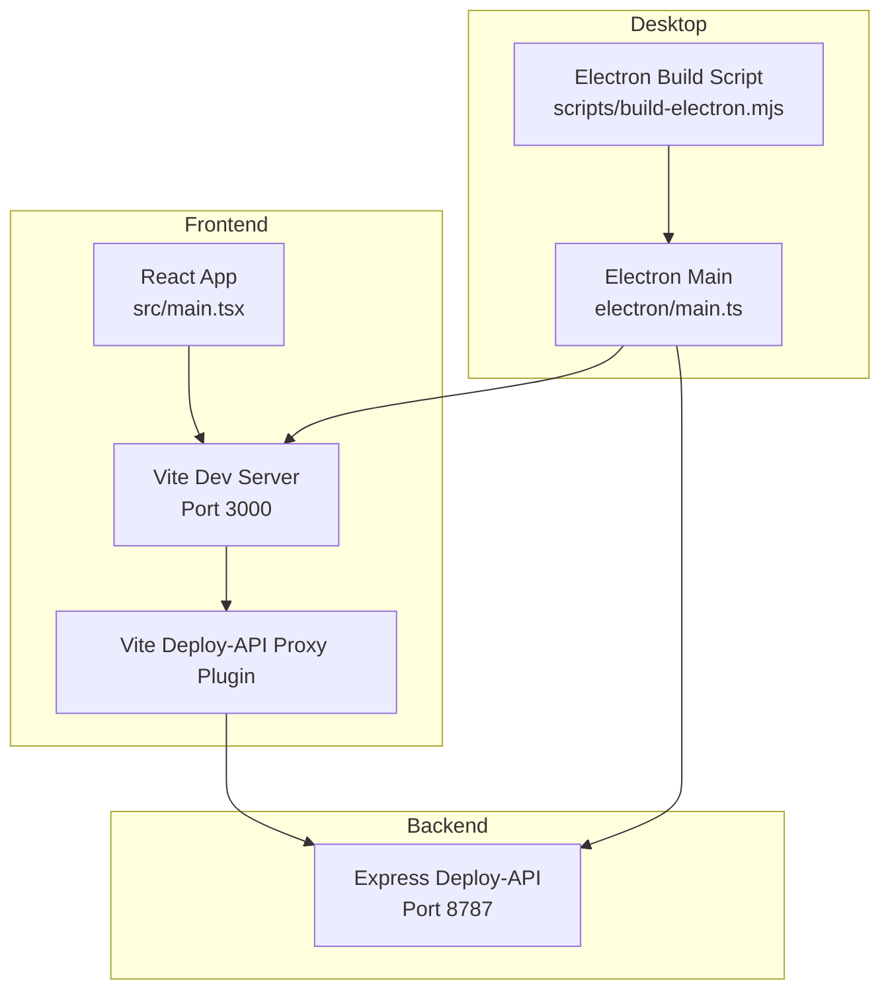
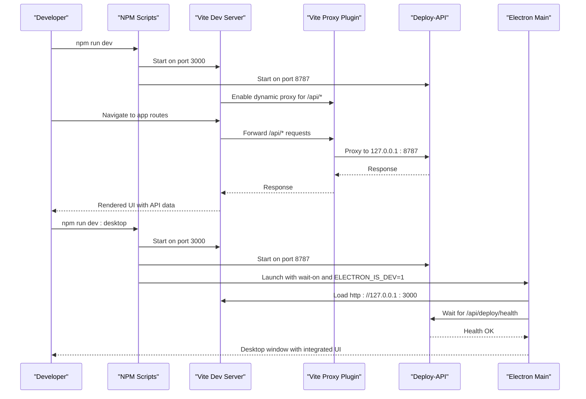
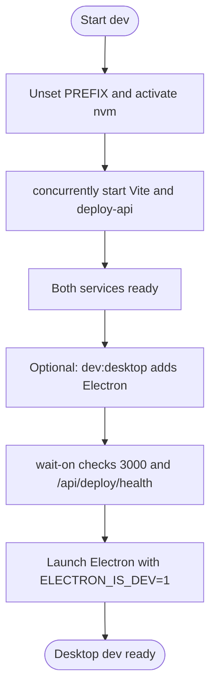
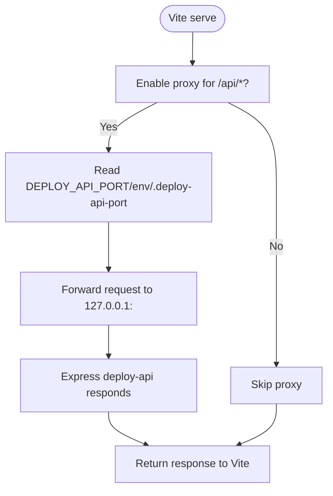
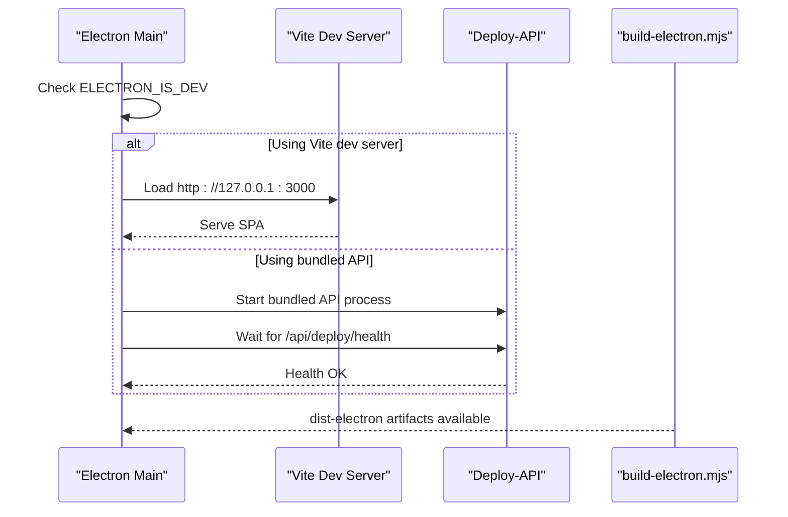
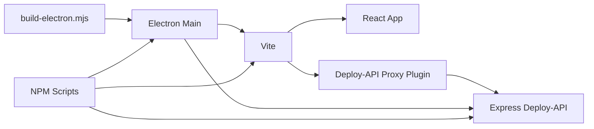

# Development Workflow

<cite>
**Referenced Files in This Document**
- [package.json](file://package.json)
- [vite.config.ts](file://vite.config.ts)
- [vite.deploy-api-proxy-plugin.ts](file://vite.deploy-api-proxy-plugin.ts)
- [electron/main.ts](file://electron/main.ts)
- [scripts/build-electron.mjs](file://scripts/build-electron.mjs)
- [server/deploy-api.ts](file://server/deploy-api.ts)
- [README.md](file://README.md)
- [tsconfig.json](file://tsconfig.json)
- [src/main.tsx](file://src/main.tsx)
- [test/frontend/app-shell.test.tsx](file://test/frontend/app-shell.test.tsx)
- [test/server/deploy-contract.test.ts](file://test/server/deploy-contract.test.ts)
</cite>

## Table of Contents
1. [Introduction](#introduction)
2. [Project Structure](#project-structure)
3. [Core Components](#core-components)
4. [Architecture Overview](#architecture-overview)
5. [Detailed Component Analysis](#detailed-component-analysis)
6. [Dependency Analysis](#dependency-analysis)
7. [Performance Considerations](#performance-considerations)
8. [Troubleshooting Guide](#troubleshooting-guide)
9. [Conclusion](#conclusion)
10. [Appendices](#appendices)

## Introduction
This document explains the development workflow and build automation for the project. It covers the development scripts, concurrent orchestration, predev hooks, development server setup with hot reload and proxy, environment requirements, cross-layer testing, debugging strategies, and best practices. The system comprises a React + Vite web UI, an Electron desktop wrapper, and an Express-based deploy API service that handles Jenkins and Jira integrations.

## Project Structure
The repository is organized into:
- Frontend: React + Vite under src/, with Vite configuration and a dynamic proxy plugin for API routing.
- Backend: Express-based deploy API under server/.
- Desktop: Electron main process and preload under electron/, with a build script to bundle artifacts into dist-electron/.
- Scripts and configs: Vite config, proxy plugin, Electron build script, TypeScript config, tests, and top-level scripts.

**Diagram sources**
- [vite.config.ts:1-111](file://vite.config.ts#L1-L111)
- [vite.deploy-api-proxy-plugin.ts:1-166](file://vite.deploy-api-proxy-plugin.ts#L1-L166)
- [electron/main.ts:1-434](file://electron/main.ts#L1-L434)
- [scripts/build-electron.mjs:1-76](file://scripts/build-electron.mjs#L1-L76)
- [server/deploy-api.ts:1-800](file://server/deploy-api.ts#L1-L800)

**Section sources**
- [README.md:1-91](file://README.md#L1-L91)
- [package.json:1-99](file://package.json#L1-L99)

## Core Components
- Development scripts:
  - dev: Starts Vite and deploy-api concurrently.
  - dev:api: Runs the Express deploy API.
  - dev:vite: Starts Vite with host binding and port.
  - dev:desktop: Desktop development with Electron, waiting for both frontend and backend readiness.
  - predev:desktop and prestart: Build Electron artifacts before launching.
- Vite configuration:
  - Conditional proxy activation, PWA plugin exclusion for Electron client, HMR toggle, and base path selection.
- Dynamic proxy plugin:
  - Routes /api/* to deploy-api with per-request port resolution.
- Electron main process:
  - Manages windows, connects to Vite dev server or bundled API, waits for health checks, and handles port conflicts.
- Electron build script:
  - Bundles main, preload, and deploy-api into dist-electron with esbuild.
- Deploy API:
  - Exposes endpoints for deployment orchestration, integrates with Jenkins and Jira, and streams logs to clients.

**Section sources**
- [package.json:9-29](file://package.json#L9-L29)
- [vite.config.ts:8-111](file://vite.config.ts#L8-L111)
- [vite.deploy-api-proxy-plugin.ts:10-166](file://vite.deploy-api-proxy-plugin.ts#L10-L166)
- [electron/main.ts:16-434](file://electron/main.ts#L16-L434)
- [scripts/build-electron.mjs:1-76](file://scripts/build-electron.mjs#L1-L76)
- [server/deploy-api.ts:75-800](file://server/deploy-api.ts#L75-L800)

## Architecture Overview
The development architecture supports three primary modes:
- Web-only: Vite dev server serves React; requests prefixed with /api/* are proxied to deploy-api.
- Desktop: Electron loads the Vite dev server or bundled SPA; Electron main starts or connects to deploy-api and waits for health checks.
- API-only: deploy-api runs standalone for backend-focused development.

**Diagram sources**
- [package.json:11-16](file://package.json#L11-L16)
- [vite.config.ts:103-108](file://vite.config.ts#L103-L108)
- [vite.deploy-api-proxy-plugin.ts:72-149](file://vite.deploy-api-proxy-plugin.ts#L72-L149)
- [electron/main.ts:16-406](file://electron/main.ts#L16-L406)
- [server/deploy-api.ts:75-800](file://server/deploy-api.ts#L75-L800)

## Detailed Component Analysis

### Development Scripts and Concurrent Execution
- dev: Uses concurrently to start Vite and deploy-api in parallel. It unsets a prefix variable and activates nvm before launching.
- dev:api: Starts the Express server using tsx with NODE_OPTIONS support.
- dev:vite: Starts Vite on port 3000 and binds to 0.0.0.0 for host access.
- dev:desktop: Starts Vite and deploy-api, then launches Electron after both are healthy. Uses wait-on to probe ports and cross-env to set ELECTRON_IS_DEV=1.
- predev:desktop and prestart: Run the Electron build script to produce dist-electron artifacts before starting desktop development or production.

**Diagram sources**
- [package.json:11-16](file://package.json#L11-L16)

**Section sources**
- [package.json:11-16](file://package.json#L11-L16)

### Development Server Setup: Hot Reload and Proxy
- HMR is controlled by an environment variable and disabled in specific environments to avoid flickering during agent edits.
- The proxy plugin dynamically reads the deploy API port from environment, process, or a port file and forwards /api/* routes to the backend.
- PWA plugin is excluded for Electron builds to reduce bundle size and improve packaging speed.

**Diagram sources**
- [vite.config.ts:15-17](file://vite.config.ts#L15-L17)
- [vite.config.ts:103-108](file://vite.config.ts#L103-L108)
- [vite.deploy-api-proxy-plugin.ts:43-55](file://vite.deploy-api-proxy-plugin.ts#L43-L55)
- [vite.deploy-api-proxy-plugin.ts:72-149](file://vite.deploy-api-proxy-plugin.ts#L72-L149)

**Section sources**
- [vite.config.ts:15-17](file://vite.config.ts#L15-L17)
- [vite.config.ts:103-108](file://vite.config.ts#L103-L108)
- [vite.deploy-api-proxy-plugin.ts:43-55](file://vite.deploy-api-proxy-plugin.ts#L43-L55)
- [vite.deploy-api-proxy-plugin.ts:72-149](file://vite.deploy-api-proxy-plugin.ts#L72-L149)

### Electron Desktop Development
- Electron main decides whether to connect to Vite dev server or bundled API based on an environment flag.
- It waits for the Vite dev server or the bundled API health endpoint before loading windows.
- The build script bundles main, preload, and deploy-api into dist-electron and optionally removes a large font to speed up packaging.

**Diagram sources**
- [electron/main.ts:16-406](file://electron/main.ts#L16-L406)
- [scripts/build-electron.mjs:1-76](file://scripts/build-electron.mjs#L1-L76)

**Section sources**
- [electron/main.ts:16-406](file://electron/main.ts#L16-L406)
- [scripts/build-electron.mjs:1-76](file://scripts/build-electron.mjs#L1-L76)

### Predev and Prestart Hooks
- predev:desktop and prestart both run the Electron build script to ensure dist-electron exists before launching desktop development or production.
- The build script verifies the presence of the Vite dist folder and warns if missing.

**Section sources**
- [package.json:15-17](file://package.json#L15-L17)
- [scripts/build-electron.mjs:49-55](file://scripts/build-electron.mjs#L49-L55)

### Development Environment Requirements
- Node.js: Version 22 is recommended; scripts switch to this version via nvm when available.
- OS: Current scripts are tuned for macOS (bash + nvm path).
- Dependencies: Managed via npm; dev dependencies include concurrently, wait-on, tsx, electron, electron-builder, and others.

**Section sources**
- [README.md:5-9](file://README.md#L5-L9)
- [package.json:44-59](file://package.json#L44-L59)

### Testing Across Layers
- Frontend tests: Use Node’s built-in test runner with tsx import to validate routing and rendering.
- Server tests: Validate contract parsing and credential handling for Jenkins integrations.
- Command: npm test executes both frontend and server tests.

**Section sources**
- [test/frontend/app-shell.test.tsx:1-55](file://test/frontend/app-shell.test.tsx#L1-L55)
- [test/server/deploy-contract.test.ts:1-66](file://test/server/deploy-contract.test.ts#L1-L66)
- [package.json:28](file://package.json#L28)

### Debugging Strategies and Best Practices
- HMR control: Disable HMR via environment variable when editing agents to prevent UI flicker.
- Electron debug flags: Use ELECTRON_FLOAT_DEBUG to open floating window with DevTools; use ELECTRON_IS_DEV to force Vite dev connection.
- Port conflict handling: Electron main ensures the API port is free by killing conflicting processes and waiting.
- Proxy diagnostics: The proxy plugin returns structured errors when the backend is unreachable or returns HTML on 404.
- Logging: The deploy API normalizes and filters terminal output for web consumption, emitting only meaningful lines.

**Section sources**
- [vite.config.ts:104-106](file://vite.config.ts#L104-L106)
- [electron/main.ts:126-148](file://electron/main.ts#L126-L148)
- [vite.deploy-api-proxy-plugin.ts:120-130](file://vite.deploy-api-proxy-plugin.ts#L120-L130)
- [server/deploy-api.ts:229-343](file://server/deploy-api.ts#L229-L343)

## Dependency Analysis
The development stack relies on:
- Vite for frontend bundling, HMR, and dev server.
- Express for the deploy API.
- Electron for desktop packaging and runtime.
- Concurrent execution and wait-on for coordinated startup.
- esbuild for bundling Electron artifacts.

**Diagram sources**
- [vite.config.ts:1-111](file://vite.config.ts#L1-L111)
- [vite.deploy-api-proxy-plugin.ts:1-166](file://vite.deploy-api-proxy-plugin.ts#L1-L166)
- [electron/main.ts:1-434](file://electron/main.ts#L1-L434)
- [scripts/build-electron.mjs:1-76](file://scripts/build-electron.mjs#L1-L76)
- [package.json:9-29](file://package.json#L9-L29)

**Section sources**
- [package.json:9-29](file://package.json#L9-L29)
- [vite.config.ts:1-111](file://vite.config.ts#L1-L111)
- [electron/main.ts:1-434](file://electron/main.ts#L1-L434)
- [scripts/build-electron.mjs:1-76](file://scripts/build-electron.mjs#L1-L76)

## Performance Considerations
- PWA caching is disabled for development and excludes /api/ to avoid caching HTML errors.
- Electron client disables PWA plugin to reduce bundle size and packaging time.
- Large bundled font is removed by default in Electron builds to accelerate asar/zip creation.

**Section sources**
- [vite.config.ts:55-77](file://vite.config.ts#L55-L77)
- [vite.config.ts:93](file://vite.config.ts#L93)
- [scripts/build-electron.mjs:57-73](file://scripts/build-electron.mjs#L57-L73)

## Troubleshooting Guide
Common issues and resolutions:
- Port conflicts:
  - If port 8787 is busy, Electron main kills conflicting processes and waits for the port to free.
  - Proxy plugin returns a structured error when the backend returns HTML on 404; confirm the API is listening on the expected port.
- Vite dev server not reachable:
  - Ensure Vite runs on port 3000 and is bound to 0.0.0.0; verify HMR is not disabled unintentionally.
- Desktop not launching:
  - Confirm predev:desktop or prestart ran to generate dist-electron.
  - Verify wait-on probes succeed for both Vite and the API health endpoint.
- Environment variables:
  - Ensure GEMINI_API_KEY and Jenkins credentials are present in .env; otherwise, related endpoints may return 503.

**Section sources**
- [electron/main.ts:126-148](file://electron/main.ts#L126-L148)
- [vite.deploy-api-proxy-plugin.ts:120-130](file://vite.deploy-api-proxy-plugin.ts#L120-L130)
- [vite.config.ts:104-106](file://vite.config.ts#L104-L106)
- [package.json:15-17](file://package.json#L15-L17)
- [README.md:18-22](file://README.md#L18-L22)

## Conclusion
The development workflow integrates Vite, Express, and Electron with robust orchestration and diagnostics. The scripts coordinate concurrent startup, the proxy enables seamless API access, and the Electron build pipeline prepares desktop-ready assets. Following the environment requirements, using the provided scripts, and leveraging the debugging flags ensures efficient iteration across web, desktop, and API layers.

## Appendices

### Development Commands Reference
- npm run dev: Start Vite and deploy-api concurrently.
- npm run dev:api: Start deploy-api with tsx.
- npm run dev:vite: Start Vite on port 3000 with host binding.
- npm run dev:desktop: Start Vite + deploy-api + Electron with readiness checks.
- npm run predev:desktop and npm run prestart: Build Electron artifacts.
- npm run build:client and npm run build:electron: Build client and Electron separately.
- npm run build:desktop: Build both client and Electron.
- npm run test: Run frontend and server tests.
- npm run lint: Type-check with tsc.

**Section sources**
- [package.json:9-29](file://package.json#L9-L29)

### Frontend Entry Point
- The React root mounts the App component into the DOM.

**Section sources**
- [src/main.tsx:1-11](file://src/main.tsx#L1-L11)

### TypeScript Configuration
- Target ES2022, JSX transform for React, path aliases, and noEmit.

**Section sources**
- [tsconfig.json:1-28](file://tsconfig.json#L1-L28)