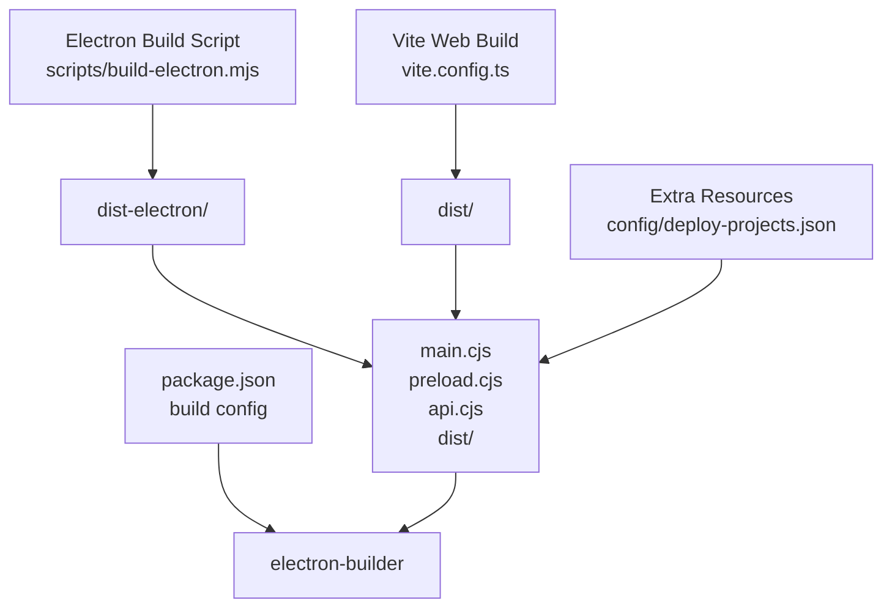
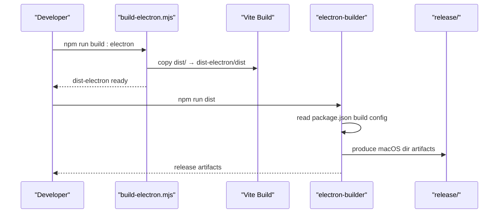
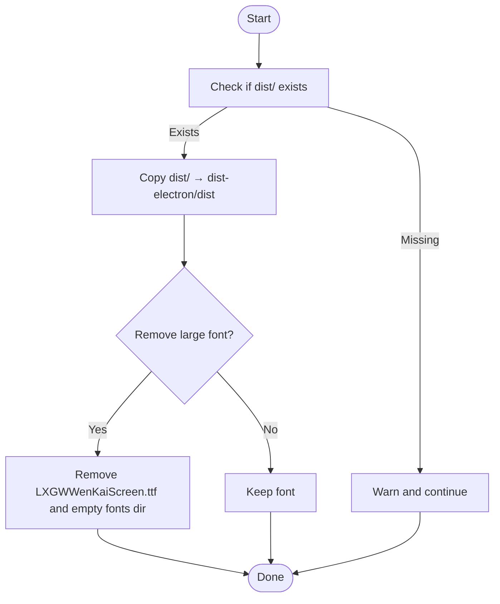
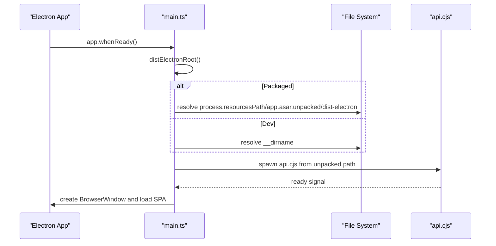
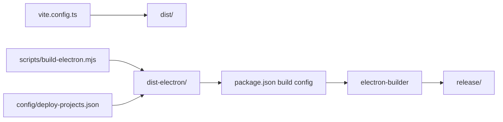

# Packaging and Distribution

<cite>
**Referenced Files in This Document**
- [package.json](file://package.json)
- [scripts/build-electron.mjs](file://scripts/build-electron.mjs)
- [vite.config.ts](file://vite.config.ts)
- [electron/main.ts](file://electron/main.ts)
- [metadata.json](file://metadata.json)
- [config/deploy-projects.json](file://config/deploy-projects.json)
</cite>

## Table of Contents
1. [Introduction](#introduction)
2. [Project Structure](#project-structure)
3. [Core Components](#core-components)
4. [Architecture Overview](#architecture-overview)
5. [Detailed Component Analysis](#detailed-component-analysis)
6. [Dependency Analysis](#dependency-analysis)
7. [Performance Considerations](#performance-considerations)
8. [Troubleshooting Guide](#troubleshooting-guide)
9. [Conclusion](#conclusion)
10. [Appendices](#appendices)

## Introduction
This document explains the packaging and distribution process for the desktop application. It covers the electron-builder configuration, app metadata, file inclusion and exclusion, platform-specific settings, distribution targets, code signing considerations, asar packaging strategy and unpacking configuration, handling of extra resources (including configuration files and assets), build artifacts structure, release preparation, platform-specific packaging requirements, distribution channels, update mechanisms, and troubleshooting guidance.

## Project Structure
The packaging pipeline integrates Vite web assets, Electron main/preload scripts, and a bundled backend service into a single distributable package. The build process is orchestrated by npm scripts and electron-builder, with a dedicated script preparing Electron assets prior to packaging.

**Diagram sources**
- [vite.config.ts:1-111](file://vite.config.ts#L1-L111)
- [scripts/build-electron.mjs:1-76](file://scripts/build-electron.mjs#L1-L76)
- [package.json:61-97](file://package.json#L61-L97)
- [config/deploy-projects.json:1-78](file://config/deploy-projects.json#L1-L78)

**Section sources**
- [package.json:61-97](file://package.json#L61-L97)
- [scripts/build-electron.mjs:1-76](file://scripts/build-electron.mjs#L1-L76)
- [vite.config.ts:1-111](file://vite.config.ts#L1-L111)

## Core Components
- Electron build script: Produces main, preload, and bundled API outputs under dist-electron and copies Vite’s built web assets into dist-electron/dist.
- electron-builder configuration: Defines app metadata, output directories, file inclusion, extra resources, asar packaging, asarUnpack, and macOS-specific options.
- Vite configuration: Controls PWA behavior and asset caching; desktop builds disable PWA to reduce artifact size.
- Runtime resource resolution: The main process resolves paths differently when packaged (asar vs. unpacked) and loads configuration from resources.

**Section sources**
- [scripts/build-electron.mjs:1-76](file://scripts/build-electron.mjs#L1-L76)
- [package.json:61-97](file://package.json#L61-L97)
- [vite.config.ts:21-78](file://vite.config.ts#L21-L78)
- [electron/main.ts:96-110](file://electron/main.ts#L96-L110)

## Architecture Overview
The packaging pipeline follows a deterministic order: Vite builds the web assets, the Electron build script bundles the main/preload/API and embeds the web assets, then electron-builder packages everything according to the build configuration.

**Diagram sources**
- [scripts/build-electron.mjs:49-55](file://scripts/build-electron.mjs#L49-L55)
- [package.json:26-27](file://package.json#L26-L27)
- [package.json:61-97](file://package.json#L61-L97)

## Detailed Component Analysis

### electron-builder Configuration
- App metadata and identity
  - appId: com.local.assistant
  - productName: Dottie-Assistant
  - icon: public/app-logo-square.png
  - extraMetadata.main: dist-electron/main.cjs
- Output and directories
  - output directory: release
  - electronDist: node_modules/electron/dist
- File inclusion and exclusions
  - files: dist-electron/**/*
  - extraResources: config → config (preserved at runtime)
- Packaging and unpacking
  - asar: true
  - asarUnpack: dist-electron/**/* (ensures native child processes can spawn from unpacked paths)
- Platform-specific settings
  - macOS target: dir (developer-focused)
  - category: developer-tools
  - hardenedRuntime: false
  - identity: null (signing not enforced by default)
- Additional metadata
  - extraMetadata.type: commonjs

Notes:
- The current macOS target is “dir” rather than installer or DMG. To produce ZIP or installer artifacts, adjust the mac.target accordingly.
- Code signing is not configured (identity is null). For production, configure signing identities and hardened runtime.

**Section sources**
- [package.json:61-97](file://package.json#L61-L97)

### Asar Packaging Strategy and Unpacking
- Asar is enabled globally, reducing filesystem footprint and improving load times.
- AsarUnpack is configured to unpack the entire dist-electron tree because the main process spawns a child process pointing to api.cjs. Native system calls require a real directory, not an asar archive.
- Runtime path resolution:
  - When packaged, the main process computes the unpacked path under process.resourcesPath/app.asar.unpacked/dist-electron.
  - When not packaged, it uses the local __dirname.

Implications:
- Child processes must use the unpacked path to avoid ENOTDIR errors.
- Keep asarUnpack minimal if only specific binaries require unpacking.

**Section sources**
- [package.json:81-84](file://package.json#L81-L84)
- [electron/main.ts:96-110](file://electron/main.ts#L96-L110)

### Extra Resources Handling
- Extra resources include the config directory, copied into the app bundle at runtime.
- At runtime, the main process reads deploy-projects.json from process.resourcesPath/config/deploy-projects.json.
- Metadata.json is present at the repo root but is not included in extraResources; if needed at runtime, add it to extraResources or ship it alongside the app.

**Section sources**
- [package.json:72-80](file://package.json#L72-L80)
- [electron/main.ts:184](file://electron/main.ts#L184)
- [config/deploy-projects.json:1-78](file://config/deploy-projects.json#L1-L78)
- [metadata.json:1-6](file://metadata.json#L1-L6)

### Build Artifacts and Release Preparation
- Build steps:
  - Build web: npm run build:client
  - Build Electron assets: npm run build:electron
  - Package: npm run dist
- Output:
  - release/ contains macOS “dir” artifacts by default.
- Clean up: npm run clean removes dist, dist-electron, and release.

Recommendations:
- For ZIP or installer outputs, pass appropriate targets to electron-builder (e.g., --mac zip or --win nsis).
- Use --dir to produce a directory layout for testing.

**Section sources**
- [package.json:18-29](file://package.json#L18-L29)
- [package.json:26-27](file://package.json#L26-L27)
- [package.json:66](file://package.json#L66)

### Distribution Targets and Platform-Specific Considerations
- Current macOS target: dir (developer-friendly)
- To support ZIP or installer outputs, adjust mac.target in the build configuration.
- Windows/Linux targets are not configured in the current build block; add win/linux sections with appropriate targets and settings.

Platform notes:
- macOS:
  - hardenedRuntime is disabled; enable it for distribution.
  - identity is null; configure a valid Apple Developer certificate for notarization.
- Windows:
  - No configuration present; add windows section with publisherName, exe, nsis settings, etc.
- Linux:
  - No configuration present; add linux section with maintainer, synopsis, description, categories, etc.

**Section sources**
- [package.json:85-92](file://package.json#L85-L92)

### Code Signing and Security
- Current configuration sets identity to null and hardenedRuntime to false.
- For production distribution:
  - Configure macOS signing identity and hardenedRuntime.
  - Consider notarization workflows.
  - For Windows, configure signing certificates and trusted timestamping.
  - For Linux, consider AppImage/Deb/RPM signing policies.

**Section sources**
- [package.json:89-91](file://package.json#L89-L91)

### Update Mechanisms
- The project uses Vite PWA with Workbox for web updates. Desktop builds disable PWA to reduce artifact size.
- There is no explicit auto-update mechanism configured for the Electron app in the provided files.
- Recommendation:
  - Integrate Squirrel-based updater for Windows or electron-updater with NSIS for native installers.
  - For macOS, integrate Sparkle or electron-updater with dmg/nsis targets.

**Section sources**
- [vite.config.ts:18-19](file://vite.config.ts#L18-L19)
- [vite.config.ts:93](file://vite.config.ts#L93)
- [vite.config.ts:21-78](file://vite.config.ts#L21-L78)

### Electron Build Script Details
- Bundles main.ts, preload.ts, and deploy-api.ts via esbuild into dist-electron.
- Copies Vite’s built web assets into dist-electron/dist.
- Removes a large bundled font file by default to speed up packaging; can be overridden via environment variable.

Operational flow:

**Diagram sources**
- [scripts/build-electron.mjs:49-73](file://scripts/build-electron.mjs#L49-L73)

**Section sources**
- [scripts/build-electron.mjs:1-76](file://scripts/build-electron.mjs#L1-L76)

### Runtime Resource Resolution
- The main process determines whether it is packaged and selects the correct path for dist-electron and config resources.
- It also ensures the bundled API port is free and waits for health checks before launching the UI.

**Diagram sources**
- [electron/main.ts:96-110](file://electron/main.ts#L96-L110)
- [electron/main.ts:180-200](file://electron/main.ts#L180-L200)

**Section sources**
- [electron/main.ts:96-110](file://electron/main.ts#L96-L110)
- [electron/main.ts:180-200](file://electron/main.ts#L180-L200)

## Dependency Analysis
The packaging pipeline depends on:
- Vite for web assets
- esbuild for bundling Electron main/preload/API
- electron-builder for packaging
- Optional PWA plugin for web builds

**Diagram sources**
- [vite.config.ts:1-111](file://vite.config.ts#L1-L111)
- [scripts/build-electron.mjs:1-76](file://scripts/build-electron.mjs#L1-L76)
- [package.json:61-97](file://package.json#L61-L97)
- [config/deploy-projects.json:1-78](file://config/deploy-projects.json#L1-L78)

**Section sources**
- [package.json:61-97](file://package.json#L61-L97)
- [scripts/build-electron.mjs:1-76](file://scripts/build-electron.mjs#L1-L76)
- [vite.config.ts:1-111](file://vite.config.ts#L1-L111)

## Performance Considerations
- Disabling PWA for desktop builds reduces artifact size and speeds up asar creation.
- Removing large bundled fonts from dist-electron improves packaging performance.
- Keeping asarUnpack minimal avoids unnecessary unpacking overhead.

Recommendations:
- Evaluate whether all of dist-electron needs to be unpacked or only specific binaries.
- Consider enabling asarUnpack only for files that must be executed as native processes.

**Section sources**
- [vite.config.ts:18-19](file://vite.config.ts#L18-L19)
- [scripts/build-electron.mjs:57-73](file://scripts/build-electron.mjs#L57-L73)
- [package.json:81-84](file://package.json#L81-L84)

## Troubleshooting Guide
Common packaging and distribution issues:

- ENOTDIR when spawning child process
  - Cause: Attempting to execute a file inside an asar archive.
  - Fix: Ensure the path resolves to the unpacked location under app.asar.unpacked when packaged.
  - Reference: [electron/main.ts:96-110](file://electron/main.ts#L96-L110)

- Large font slowing down packaging
  - Symptom: Slow asar/zip creation.
  - Fix: Remove the large font from dist-electron or set environment variable to keep it.
  - Reference: [scripts/build-electron.mjs:57-73](file://scripts/build-electron.mjs#L57-L73)

- Missing Vite dist folder
  - Symptom: Warning that dist/ does not exist.
  - Fix: Run web build first (npm run build:client) before building Electron assets.
  - Reference: [scripts/build-electron.mjs:51-55](file://scripts/build-electron.mjs#L51-L55)

- Port conflicts for bundled API
  - Symptom: EADDRINUSE errors.
  - Fix: The main process attempts to free the port; ensure no lingering processes remain.
  - Reference: [electron/main.ts:126-148](file://electron/main.ts#L126-L148)

- macOS notarization/signing failures
  - Symptom: Gatekeeper or notarization rejection.
  - Fix: Configure identity, hardenedRuntime, and notarization settings.
  - Reference: [package.json:89-91](file://package.json#L89-L91)

- Missing configuration at runtime
  - Symptom: Application fails to load deploy-projects.json.
  - Fix: Ensure config is included via extraResources and read from process.resourcesPath/config.
  - Reference: [package.json:72-80](file://package.json#L72-L80), [electron/main.ts:184](file://electron/main.ts#L184)

**Section sources**
- [electron/main.ts:96-110](file://electron/main.ts#L96-L110)
- [scripts/build-electron.mjs:51-73](file://scripts/build-electron.mjs#L51-L73)
- [package.json:72-80](file://package.json#L72-L80)
- [package.json:89-91](file://package.json#L89-L91)
- [electron/main.ts:126-148](file://electron/main.ts#L126-L148)

## Conclusion
The project’s packaging pipeline is centered around electron-builder with a clear separation of concerns: Vite handles web assets, esbuild produces Electron binaries, and electron-builder assembles the final artifacts. Asar is enabled with targeted unpacking for child processes. The current macOS target is a directory layout suitable for development and internal distribution. For production, configure code signing, hardened runtime, and platform-specific targets (ZIP/installers). Consider integrating an auto-update mechanism tailored to your distribution channels.

## Appendices

### Appendix A: Distribution Targets Checklist
- macOS
  - Target: dir | zip | dmg
  - Identity: configure signing certificate
  - Hardened runtime: enable for distribution
- Windows
  - Target: nsis | portable | squirrel
  - Publisher name and signing certificate
- Linux
  - Target: AppImage | deb | rpm
  - Maintainer, categories, and metadata

[No sources needed since this section provides general guidance]