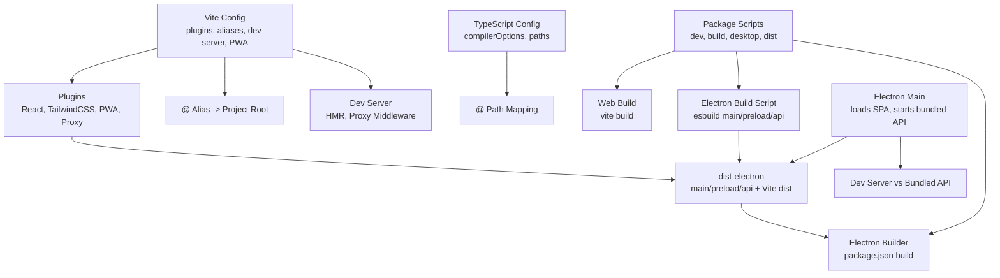
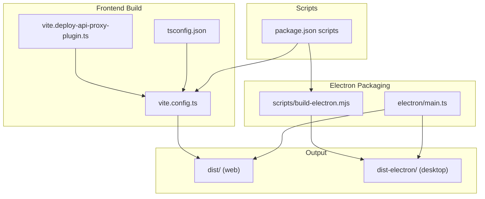
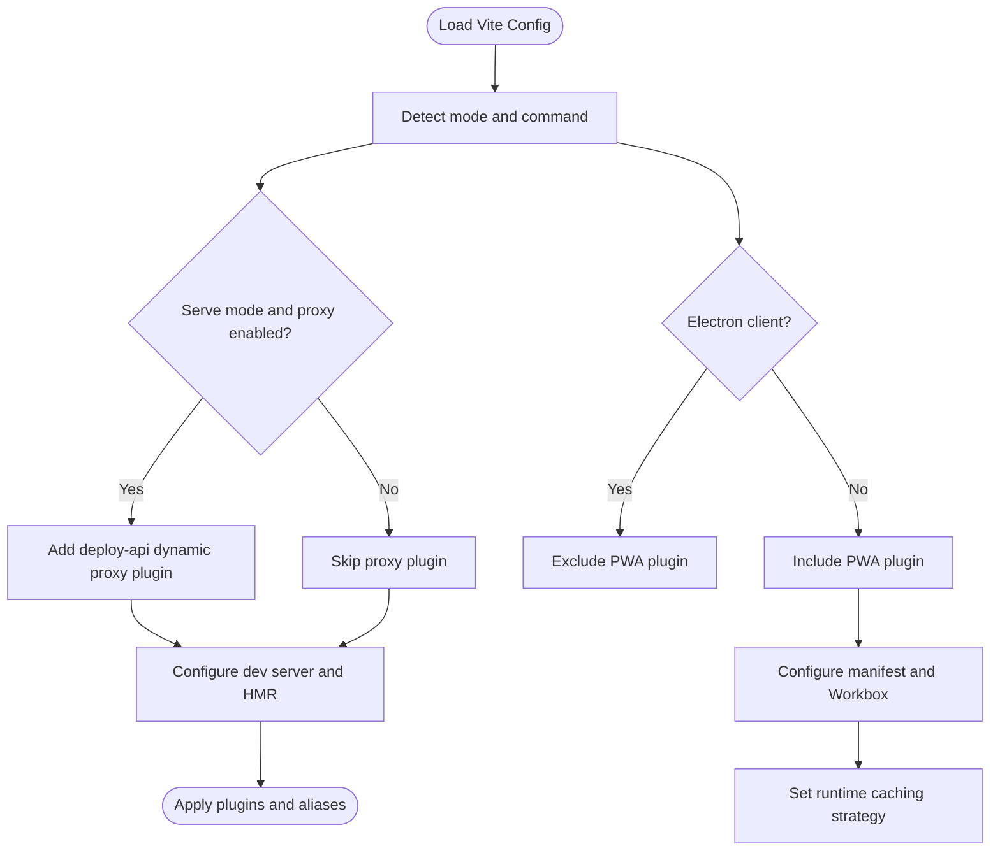
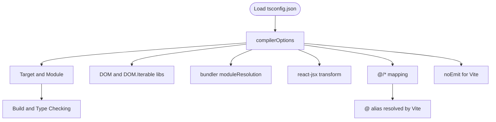
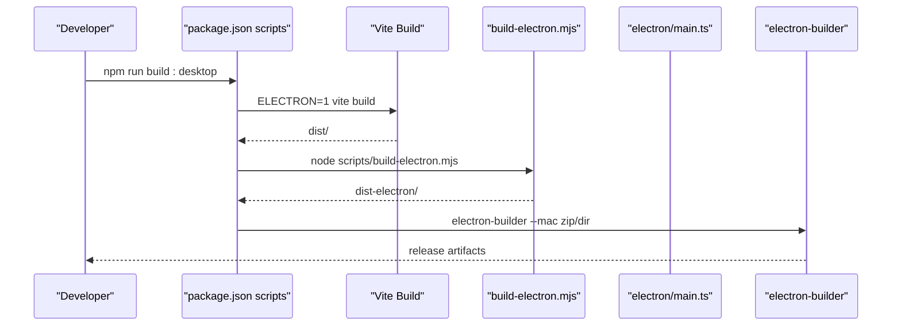
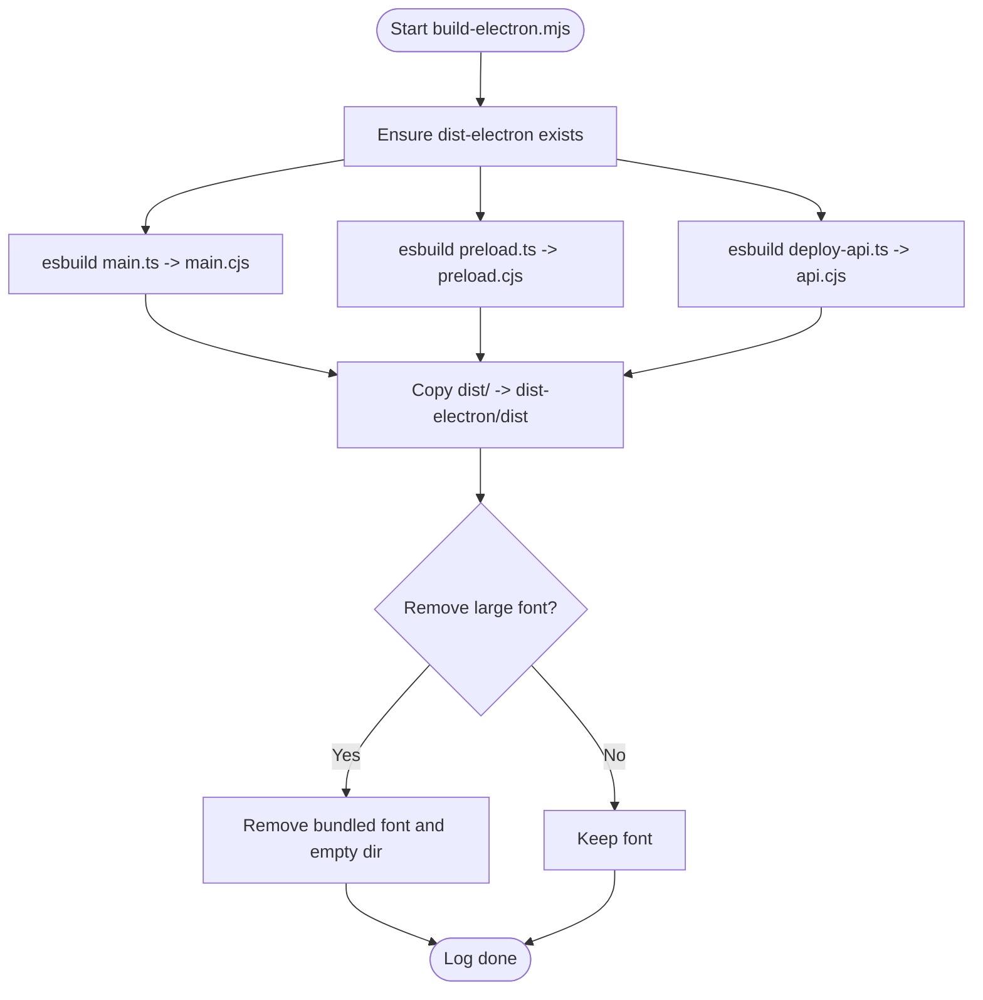
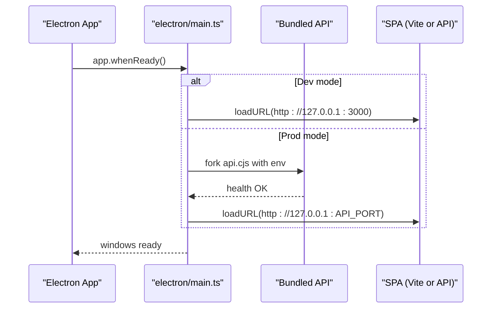
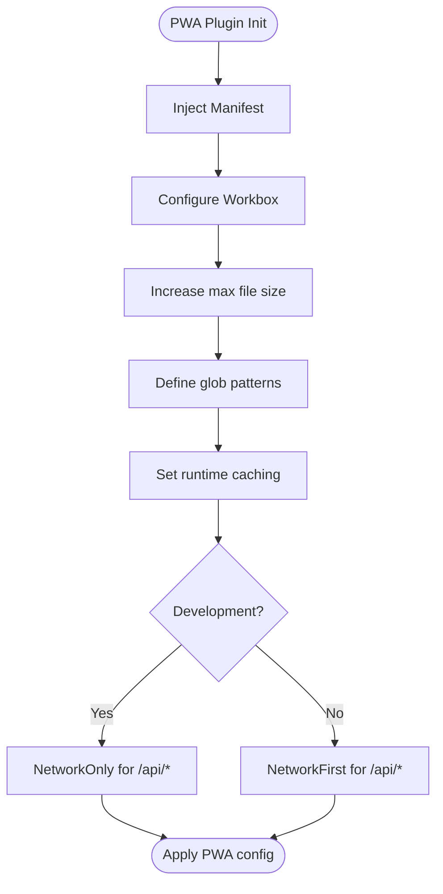
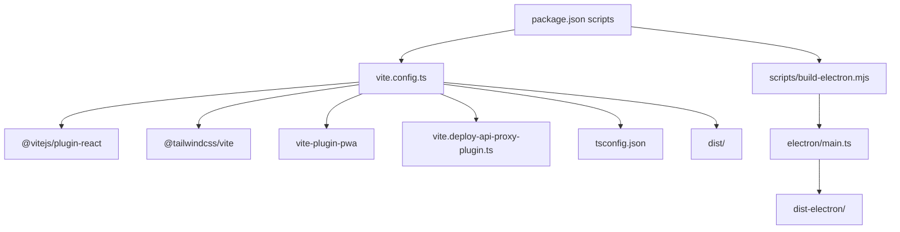

# Build Configuration

<cite>
**Referenced Files in This Document**
- [vite.config.ts](file://vite.config.ts)
- [tsconfig.json](file://tsconfig.json)
- [package.json](file://package.json)
- [vite.deploy-api-proxy-plugin.ts](file://vite.deploy-api-proxy-plugin.ts)
- [scripts/build-electron.mjs](file://scripts/build-electron.mjs)
- [electron/main.ts](file://electron/main.ts)
- [README.md](file://README.md)
</cite>

## Table of Contents
1. [Introduction](#introduction)
2. [Project Structure](#project-structure)
3. [Core Components](#core-components)
4. [Architecture Overview](#architecture-overview)
5. [Detailed Component Analysis](#detailed-component-analysis)
6. [Dependency Analysis](#dependency-analysis)
7. [Performance Considerations](#performance-considerations)
8. [Troubleshooting Guide](#troubleshooting-guide)
9. [Conclusion](#conclusion)
10. [Appendices](#appendices)

## Introduction
This document explains the build configuration management for the project, covering:
- Vite configuration: plugins, aliases, development server, and PWA setup
- TypeScript configuration: compiler options, path mapping, and type-checking behavior
- Scripts and build commands for web, desktop, and Electron packaging
- Build pipeline: asset processing, code splitting, and optimization strategies
- PWA configuration: service worker, caching, and offline behavior
- Integration with deployment and packaging workflows
- Performance optimization and bundle analysis guidance
- Customization examples and troubleshooting

## Project Structure
The build system spans several configuration and automation files:
- Vite configuration defines plugins, aliases, dev server, and PWA behavior
- TypeScript configuration controls compilation and path mapping
- Package scripts orchestrate development, builds, and packaging
- Electron build script compiles main/preload and embeds the Vite output
- Electron main process loads the SPA and manages the bundled backend

**Diagram sources**
- [vite.config.ts:1-111](file://vite.config.ts#L1-L111)
- [tsconfig.json:1-28](file://tsconfig.json#L1-L28)
- [package.json:1-99](file://package.json#L1-L99)
- [scripts/build-electron.mjs:1-76](file://scripts/build-electron.mjs#L1-L76)
- [electron/main.ts:1-434](file://electron/main.ts#L1-L434)

**Section sources**
- [vite.config.ts:1-111](file://vite.config.ts#L1-L111)
- [tsconfig.json:1-28](file://tsconfig.json#L1-L28)
- [package.json:1-99](file://package.json#L1-L99)
- [scripts/build-electron.mjs:1-76](file://scripts/build-electron.mjs#L1-L76)
- [electron/main.ts:1-434](file://electron/main.ts#L1-L434)

## Core Components
- Vite configuration
  - Plugins: React refresh, TailwindCSS, PWA (Workbox), and a dynamic proxy plugin for API routes
  - Aliases: @ resolves to project root for ergonomic imports
  - Dev server: HMR toggle, proxy middleware for /api/* routes
  - PWA: auto-update registration, manifest, assets inclusion, runtime caching, and file-size thresholds tuned for large fonts
  - Environment variable exposure for API keys
- TypeScript configuration
  - Modern target and module with DOM libs
  - bundler module resolution and isolatedModules for Vite compatibility
  - JSX transform and path mapping @/*
  - No emit for type checks in Vite; lint via tsc
- Package scripts
  - Development: parallel Vite and deploy-api servers, desktop dev stack
  - Builds: web client, Electron client, Electron main/preload/API, combined desktop build
  - Packaging: electron-builder targets and extra resources
- Electron build and runtime
  - esbuild compiles main, preload, and deploy-api into dist-electron
  - Removes large bundled font by default to speed up packaging
  - Electron main loads SPA from dev server or bundled API depending on mode

**Section sources**
- [vite.config.ts:1-111](file://vite.config.ts#L1-L111)
- [tsconfig.json:1-28](file://tsconfig.json#L1-L28)
- [package.json:1-99](file://package.json#L1-L99)
- [scripts/build-electron.mjs:1-76](file://scripts/build-electron.mjs#L1-L76)
- [electron/main.ts:1-434](file://electron/main.ts#L1-L434)

## Architecture Overview
The build pipeline integrates Vite, TypeScript, and Electron packaging. The diagram below maps the actual configuration files and their interactions.

**Diagram sources**
- [vite.config.ts:1-111](file://vite.config.ts#L1-L111)
- [vite.deploy-api-proxy-plugin.ts:1-166](file://vite.deploy-api-proxy-plugin.ts#L1-L166)
- [tsconfig.json:1-28](file://tsconfig.json#L1-L28)
- [package.json:1-99](file://package.json#L1-L99)
- [scripts/build-electron.mjs:1-76](file://scripts/build-electron.mjs#L1-L76)
- [electron/main.ts:1-434](file://electron/main.ts#L1-L434)

## Detailed Component Analysis

### Vite Configuration
Key aspects:
- Conditional plugins and base path
  - Dynamic proxy plugin enabled in serve mode unless explicitly disabled
  - PWA plugin excluded for Electron client builds
  - Base path set to relative (“./”) for Electron client to support asar/unpacked layout
- PWA configuration
  - Auto-update registration and development options
  - Manifest with name, short_name, description, theme/background colors, display, start_url, and icon entries
  - Workbox tuning:
    - Increased maximum file size to accommodate large font assets
    - Glob patterns for assets to cache
    - Runtime caching strategy:
      - Development: NetworkOnly for /api/* to avoid caching HTML error pages
      - Production: NetworkFirst with a named cache and network timeout
- Aliases and dev server
  - @ alias mapped to project root for concise imports
  - HMR controlled by environment variable
  - Proxy middleware handles /api/* routes dynamically

**Diagram sources**
- [vite.config.ts:8-111](file://vite.config.ts#L8-L111)

**Section sources**
- [vite.config.ts:1-111](file://vite.config.ts#L1-L111)

### TypeScript Configuration
Highlights:
- Targets modern JS with ESNext modules and DOM libs
- Uses bundler module resolution and isolatedModules for Vite compatibility
- JSX transform set to react-jsx
- Path mapping @/* to project root
- No emit; rely on tsc for linting

**Diagram sources**
- [tsconfig.json:1-28](file://tsconfig.json#L1-L28)

**Section sources**
- [tsconfig.json:1-28](file://tsconfig.json#L1-L28)

### Package Scripts and Build Commands
Overview of scripts and their roles:
- Development
  - dev: parallel Vite and deploy-api servers
  - dev:desktop: desktop dev stack with wait-on and Electron
  - dev:vite-only: frontend only
- Builds
  - build:web and build:client: Vite builds for web and Electron client respectively
  - build:electron and build:desktop: Electron packaging steps
  - build:desktop combines client and electron builds
- Preview and cleanup
  - preview: preview built assets
  - clean: remove dist and dist-electron artifacts
- Packaging
  - dist and dist:dir: electron-builder targets for zip and directory outputs
- Testing and linting
  - test: run server and frontend tests
  - lint: type check via tsc

**Diagram sources**
- [package.json:1-99](file://package.json#L1-L99)
- [scripts/build-electron.mjs:1-76](file://scripts/build-electron.mjs#L1-L76)
- [electron/main.ts:1-434](file://electron/main.ts#L1-L434)

**Section sources**
- [package.json:1-99](file://package.json#L1-L99)
- [README.md:74-86](file://README.md#L74-L86)

### Electron Build Script
Responsibilities:
- Compile main, preload, and deploy-api using esbuild into dist-electron
- Copy Vite’s dist into dist-electron/dist after verifying existence
- Optionally remove a large bundled font to reduce packaging time and size
- Log warnings and completion status

**Diagram sources**
- [scripts/build-electron.mjs:1-76](file://scripts/build-electron.mjs#L1-L76)

**Section sources**
- [scripts/build-electron.mjs:1-76](file://scripts/build-electron.mjs#L1-L76)

### Electron Main Process
Behavior:
- Chooses between dev server (Vite) and bundled API based on environment
- Loads SPA from http://127.0.0.1:3000 in dev or from bundled API port in production
- Starts bundled API as a utility process, waits for health endpoint, and handles errors
- Manages main and floating windows, IPC, and window positioning

**Diagram sources**
- [electron/main.ts:1-434](file://electron/main.ts#L1-L434)

**Section sources**
- [electron/main.ts:1-434](file://electron/main.ts#L1-L434)

### PWA Configuration and Offline Behavior
- Registration type set to auto-update
- Manifest includes name, short_name, description, theme/background colors, display, start_url, and icon entries
- Assets included for caching
- Workbox configuration:
  - Increased maximum file size to cache large font assets
  - Runtime caching:
    - Development: NetworkOnly for /api/* to avoid caching HTML error pages
    - Production: NetworkFirst with a named cache and network timeout
- Base path adjusted for Electron client to ensure correct asset resolution

**Diagram sources**
- [vite.config.ts:21-78](file://vite.config.ts#L21-L78)

**Section sources**
- [vite.config.ts:21-78](file://vite.config.ts#L21-L78)

### Build Pipeline: Asset Processing, Code Splitting, and Optimization
- Asset processing
  - React plugin enables JSX transforms and fast refresh
  - TailwindCSS plugin processes styles
  - PWA plugin generates service worker and precache manifests
- Code splitting
  - Vite performs automatic code splitting for route-based and dynamic imports
  - esbuild compiles main/preload/API with minimal configuration
- Optimization
  - esbuild minifies main and API bundles
  - Optional removal of large bundled font reduces packaging size and time
  - Base path set to “./” for Electron client to support asar/unpacked layout

**Section sources**
- [vite.config.ts:1-111](file://vite.config.ts#L1-L111)
- [scripts/build-electron.mjs:1-76](file://scripts/build-electron.mjs#L1-L76)

### Integration Between Build Configuration and Deployment Processes
- Desktop packaging
  - package.json build section configures appId, productName, icon, output directories, extraResources, asar, asarUnpack, and mac target
  - dist and dist:dir scripts invoke electron-builder with appropriate targets
- Electron runtime
  - electron/main.ts sets resource paths for packaged apps and ensures port availability
  - Bundled API is started as a utility process and serves SPA assets

**Section sources**
- [package.json:61-97](file://package.json#L61-L97)
- [electron/main.ts:95-257](file://electron/main.ts#L95-L257)

## Dependency Analysis
High-level dependencies among build configuration files:

**Diagram sources**
- [vite.config.ts:1-111](file://vite.config.ts#L1-L111)
- [vite.deploy-api-proxy-plugin.ts:1-166](file://vite.deploy-api-proxy-plugin.ts#L1-L166)
- [tsconfig.json:1-28](file://tsconfig.json#L1-L28)
- [package.json:1-99](file://package.json#L1-L99)
- [scripts/build-electron.mjs:1-76](file://scripts/build-electron.mjs#L1-L76)
- [electron/main.ts:1-434](file://electron/main.ts#L1-L434)

**Section sources**
- [vite.config.ts:1-111](file://vite.config.ts#L1-L111)
- [package.json:1-99](file://package.json#L1-L99)

## Performance Considerations
- PWA caching
  - Increase maximum file size to include large assets; adjust runtime caching to avoid caching HTML error pages in development
- Electron packaging
  - Remove large bundled fonts to reduce asar/zip time and size
  - Minify main and API bundles with esbuild
- Dev server
  - Toggle HMR via environment variable to reduce flickering during agent edits
- Build optimization
  - Prefer bundler module resolution and isolatedModules for Vite compatibility
  - Use path mapping @/* to simplify imports and improve DX

[No sources needed since this section provides general guidance]

## Troubleshooting Guide
Common issues and resolutions:
- Proxy middleware returns HTML 404
  - The dynamic proxy plugin detects HTML responses and returns structured JSON with guidance; verify deploy-api is running and port is correct
- Port conflicts for deploy-api
  - The Electron main process checks port availability and attempts to free it; ensure no lingering processes are occupying the port
- Large font slowing packaging
  - The Electron build script removes the large bundled font by default; set an environment variable to keep it if needed
- PWA caching in development
  - Development runtime caching excludes /api/* to avoid caching HTML error pages; confirm this behavior aligns with expectations

**Section sources**
- [vite.deploy-api-proxy-plugin.ts:110-148](file://vite.deploy-api-proxy-plugin.ts#L110-L148)
- [electron/main.ts:112-148](file://electron/main.ts#L112-L148)
- [scripts/build-electron.mjs:57-73](file://scripts/build-electron.mjs#L57-L73)

## Conclusion
The build configuration integrates Vite, TypeScript, and Electron packaging to deliver a robust development and distribution pipeline. PWA settings and caching strategies are tailored for both web and desktop contexts, while scripts orchestrate efficient builds and packaging. Performance optimizations and troubleshooting tips help maintain a smooth developer experience and reliable deployments.

[No sources needed since this section summarizes without analyzing specific files]

## Appendices

### Appendix A: Environment Variables and Their Roles
- GEMINI_API_KEY
  - Exposed to the app via Vite’s define to enable Gemini integration
- DEPLOY_API_PORT
  - Controls the port used by the deploy-api; the dynamic proxy plugin reads this value per request
- ELECTRON and related flags
  - Control whether the Electron client excludes PWA and uses relative base paths
  - Enable/disable dev server vs bundled API and control font bundling behavior
- DISABLE_HMR
  - Toggles HMR in the dev server

**Section sources**
- [vite.config.ts:95-107](file://vite.config.ts#L95-L107)
- [vite.deploy-api-proxy-plugin.ts:43-55](file://vite.deploy-api-proxy-plugin.ts#L43-L55)
- [electron/main.ts:16-17](file://electron/main.ts#L16-L17)
- [scripts/build-electron.mjs:57-73](file://scripts/build-electron.mjs#L57-L73)

### Appendix B: Customizing Build Configurations for Different Targets
- Web-only builds
  - Use the web build scripts; PWA plugin remains active
- Electron client
  - Set the Electron client flag to exclude PWA and adjust base path
- Desktop packaging
  - Configure electron-builder targets and extra resources in package.json build section
- Development modes
  - Toggle HMR and proxy behavior via environment variables
  - Use dev:desktop to coordinate Vite, deploy-api, and Electron

**Section sources**
- [package.json:1-99](file://package.json#L1-L99)
- [vite.config.ts:15-19](file://vite.config.ts#L15-L19)
- [electron/main.ts:16-21](file://electron/main.ts#L16-L21)