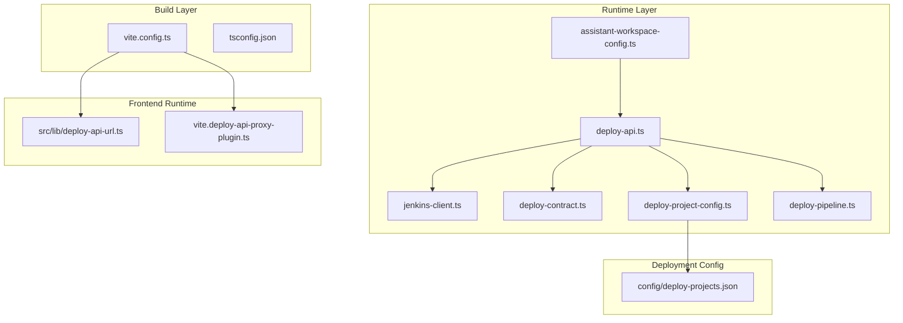
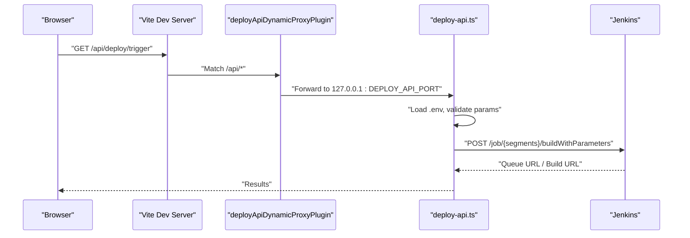
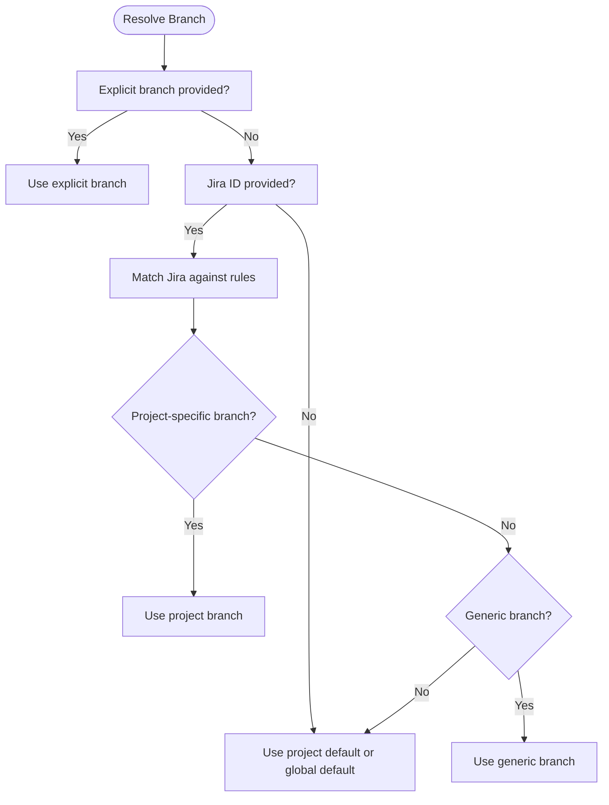
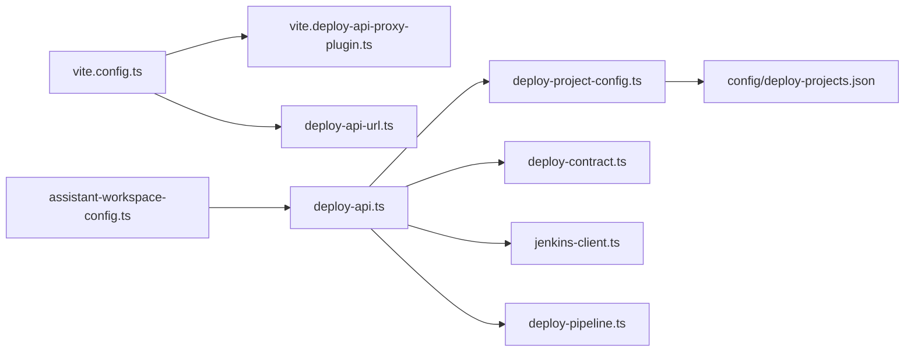

# Configuration Management

<cite>
**Referenced Files in This Document**
- [vite.config.ts](file://vite.config.ts)
- [tsconfig.json](file://tsconfig.json)
- [package.json](file://package.json)
- [vite.deploy-api-proxy-plugin.ts](file://vite.deploy-api-proxy-plugin.ts)
- [deploy-projects.json](file://config/deploy-projects.json)
- [deploy-project-config.ts](file://server/deploy-project-config.ts)
- [deploy-contract.ts](file://server/deploy-contract.ts)
- [jenkins-client.ts](file://server/jenkins-client.ts)
- [deploy-api.ts](file://server/deploy-api.ts)
- [assistant-workspace-config.ts](file://server/assistant-workspace-config.ts)
- [deploy-pipeline.ts](file://server/deploy-pipeline.ts)
- [deploy-api-url.ts](file://src/lib/deploy-api-url.ts)
- [deploy-project-config.test.ts](file://test/server/deploy-project-config.test.ts)
- [jenkins-client.test.ts](file://test/server/jenkins-client.test.ts)
</cite>

## Table of Contents
1. [Introduction](#introduction)
2. [Project Structure](#project-structure)
3. [Core Components](#core-components)
4. [Architecture Overview](#architecture-overview)
5. [Detailed Component Analysis](#detailed-component-analysis)
6. [Dependency Analysis](#dependency-analysis)
7. [Performance Considerations](#performance-considerations)
8. [Troubleshooting Guide](#troubleshooting-guide)
9. [Conclusion](#conclusion)
10. [Appendices](#appendices)

## Introduction
This document explains the configuration management system for the project, covering:
- Environment configuration across development, desktop, and web build modes
- Project settings for deployments, API endpoints, and feature toggles
- Build configuration for Vite, TypeScript, and assets
- Deployment project configuration using deploy-projects.json for Jenkins job templates and parameters
- Environment variable management and secret handling strategies
- Validation and default value management
- Configuration inheritance and override patterns
- CI/CD integration and automated deployment
- Backup and restore procedures
- Common scenarios and troubleshooting guidance

## Project Structure
The configuration system spans three layers:
- Frontend build-time configuration (Vite + TypeScript)
- Runtime configuration (Express server, environment variables, and JSON configs)
- Deployment orchestration (Jenkins integration and pipeline orchestration)

**Diagram sources**
- [vite.config.ts:1-111](file://vite.config.ts#L1-L111)
- [tsconfig.json:1-28](file://tsconfig.json#L1-L28)
- [deploy-api.ts:1-120](file://server/deploy-api.ts#L1-L120)
- [jenkins-client.ts:1-191](file://server/jenkins-client.ts#L1-L191)
- [deploy-contract.ts:1-169](file://server/deploy-contract.ts#L1-L169)
- [deploy-project-config.ts:1-237](file://server/deploy-project-config.ts#L1-L237)
- [assistant-workspace-config.ts:1-202](file://server/assistant-workspace-config.ts#L1-L202)
- [deploy-pipeline.ts:1-305](file://server/deploy-pipeline.ts#L1-L305)
- [deploy-projects.json:1-78](file://config/deploy-projects.json#L1-L78)
- [deploy-api-url.ts:1-28](file://src/lib/deploy-api-url.ts#L1-L28)
- [vite.deploy-api-proxy-plugin.ts:1-166](file://vite.deploy-api-proxy-plugin.ts#L1-L166)

**Section sources**
- [vite.config.ts:1-111](file://vite.config.ts#L1-L111)
- [tsconfig.json:1-28](file://tsconfig.json#L1-L28)
- [package.json:1-99](file://package.json#L1-L99)

## Core Components
- Vite configuration controls dev/prod behavior, plugin loading, PWA settings, and dynamic proxying to the deploy API.
- TypeScript configuration defines module resolution, JSX transform, and path aliases.
- Deploy project configuration validates and resolves Jenkins job templates and branch selection rules.
- Jenkins client handles authentication, crumb fetching, queue polling, and sanitized error reporting.
- Deploy contract enforces parameter names and validates Jira/branch inputs.
- Assistant workspace config manages .env discovery, parsing, merging, and secret handling.
- Deploy pipeline orchestrates multi-project triggers and persists run state.
- Frontend URL builder centralizes API base resolution and route construction.

**Section sources**
- [vite.config.ts:80-110](file://vite.config.ts#L80-L110)
- [tsconfig.json:1-28](file://tsconfig.json#L1-L28)
- [deploy-project-config.ts:96-174](file://server/deploy-project-config.ts#L96-L174)
- [jenkins-client.ts:21-191](file://server/jenkins-client.ts#L21-L191)
- [deploy-contract.ts:91-169](file://server/deploy-contract.ts#L91-L169)
- [assistant-workspace-config.ts:80-147](file://server/assistant-workspace-config.ts#L80-L147)
- [deploy-pipeline.ts:186-305](file://server/deploy-pipeline.ts#L186-L305)
- [deploy-api-url.ts:6-28](file://src/lib/deploy-api-url.ts#L6-L28)

## Architecture Overview
The configuration architecture integrates build-time and runtime concerns:
- Build-time: Vite reads environment variables per mode and conditionally enables plugins and PWA behavior. It dynamically proxies /api/* to the deploy API using a plugin that re-reads the port file on each request.
- Runtime: The deploy API loads .env from multiple locations, validates Jenkins credentials, and serves endpoints for deployment orchestration and automation runs. It uses the deploy-projects.json to resolve Jenkins job paths and branch parameters.

**Diagram sources**
- [vite.config.ts:80-110](file://vite.config.ts#L80-L110)
- [vite.deploy-api-proxy-plugin.ts:72-149](file://vite.deploy-api-proxy-plugin.ts#L72-L149)
- [deploy-api.ts:1357-1404](file://server/deploy-api.ts#L1357-L1404)
- [jenkins-client.ts:89-142](file://server/jenkins-client.ts#L89-L142)

## Detailed Component Analysis

### Vite Configuration and Environment Settings
- Mode-aware behavior:
  - Development mode for web builds enables HMR and dynamic proxying to the deploy API.
  - Electron client mode disables PWA and sets base to "./" for packaged apps.
- Dynamic proxy:
  - The plugin matches /api/* routes and forwards to the deploy API port, re-reading the port file on each request to avoid stale ports.
- PWA and caching:
  - PWA is enabled for web builds with custom manifest and runtime caching rules; excludes /api/ in development to avoid caching HTML error pages.
- Define globals:
  - Certain environment variables are injected at build time (e.g., Gemini API key).
- Aliasing:
  - Path alias "@" resolves to project root for consistent imports.

**Section sources**
- [vite.config.ts:8-110](file://vite.config.ts#L8-L110)
- [vite.deploy-api-proxy-plugin.ts:43-55](file://vite.deploy-api-proxy-plugin.ts#L43-L55)
- [vite.deploy-api-proxy-plugin.ts:72-149](file://vite.deploy-api-proxy-plugin.ts#L72-L149)

### TypeScript Configuration
- Module resolution and bundler support
- JSX transform for React
- Path alias "@/*" mapped to project root
- Strict checks and isolated modules for correctness

**Section sources**
- [tsconfig.json:1-28](file://tsconfig.json#L1-L28)

### Environment Variables and Secrets
- Discovery order for .env:
  - Explicit path via environment variable
  - Repository-style .env beside the API module
  - API module’s own .env
  - Assistant-specific path via environment variable
- Secret handling:
  - A curated set of keys is treated as secrets and not returned as plaintext in UI responses.
- Parsing and merging:
  - Simple parser supports quoted/unquoted values and preserves comments/lines.
  - Merge function updates or removes keys while preserving order.

**Section sources**
- [assistant-workspace-config.ts:8-31](file://server/assistant-workspace-config.ts#L8-L31)
- [assistant-workspace-config.ts:99-109](file://server/assistant-workspace-config.ts#L99-L109)
- [assistant-workspace-config.ts:114-147](file://server/assistant-workspace-config.ts#L114-L147)
- [assistant-workspace-config.ts:153-187](file://server/assistant-workspace-config.ts#L153-L187)

### Deploy Projects Configuration (deploy-projects.json)
- Defaults:
  - Global default branch, Jenkins base URL, and parameter names for Jira and branch.
- Projects:
  - Each project defines a label, Jenkins job path, and optional default branch.
- Jira branch rules:
  - Regex-based rules to map Jira issues to project-specific or generic branches.
- Validation and resolution:
  - Validates IDs, job paths, and parameter names.
  - Resolves final branch considering explicit overrides, Jira rules, project defaults, and global defaults.

**Diagram sources**
- [deploy-project-config.ts:191-210](file://server/deploy-project-config.ts#L191-L210)

**Section sources**
- [deploy-projects.json:1-78](file://config/deploy-projects.json#L1-L78)
- [deploy-project-config.ts:96-174](file://server/deploy-project-config.ts#L96-L174)
- [deploy-project-config.ts:191-210](file://server/deploy-project-config.ts#L191-L210)

### Jenkins Integration and Parameterization
- Authentication and crumb:
  - Basic auth header and crumb issuance are handled automatically.
- Queue polling:
  - After triggering a build, the system polls the queue URL to obtain the build URL and number.
- Parameterization:
  - Branch and Jira parameters are validated and sent to Jenkins using configurable parameter names.
- Error sanitization:
  - HTML-based login/permission errors are sanitized to avoid exposing internals.

**Section sources**
- [jenkins-client.ts:27-142](file://server/jenkins-client.ts#L27-L142)
- [jenkins-client.ts:148-191](file://server/jenkins-client.ts#L148-L191)
- [deploy-contract.ts:91-120](file://server/deploy-contract.ts#L91-L120)

### Deploy Pipeline Orchestration
- Multi-project orchestration:
  - Creates a run with nodes for each project and triggers Jenkins sequentially.
- Persistence and limits:
  - Maintains in-memory runs with bounded counts and writes stats to disk.
- Event streaming:
  - Exposes Server-Sent Events for live updates on automation runs.

**Section sources**
- [deploy-pipeline.ts:186-305](file://server/deploy-pipeline.ts#L186-L305)

### Frontend API Base Resolution
- Default base is "/api/deploy" with Vite proxy.
- Optional absolute URL support allows pointing to an external deploy API instance.
- Helper composes "/api/{prefix}/{path}" consistently.

**Section sources**
- [deploy-api-url.ts:6-28](file://src/lib/deploy-api-url.ts#L6-L28)

## Dependency Analysis
- Vite depends on:
  - Environment variables loaded per mode
  - Dynamic proxy plugin for /api/*
  - PWA plugin for web builds
- Deploy API depends on:
  - .env discovery and parsing
  - Deploy project configuration
  - Jenkins client for triggering builds
  - Deploy contract for parameter validation
- Tests validate:
  - Config validation and branch resolution
  - Jenkins client behavior for crumb, queue polling, and error sanitization

**Diagram sources**
- [vite.config.ts:1-111](file://vite.config.ts#L1-L111)
- [vite.deploy-api-proxy-plugin.ts:1-166](file://vite.deploy-api-proxy-plugin.ts#L1-L166)
- [deploy-api.ts:1-120](file://server/deploy-api.ts#L1-L120)
- [deploy-project-config.ts:1-237](file://server/deploy-project-config.ts#L1-L237)
- [deploy-contract.ts:1-169](file://server/deploy-contract.ts#L1-L169)
- [jenkins-client.ts:1-191](file://server/jenkins-client.ts#L1-L191)
- [deploy-pipeline.ts:1-305](file://server/deploy-pipeline.ts#L1-L305)
- [deploy-projects.json:1-78](file://config/deploy-projects.json#L1-L78)
- [assistant-workspace-config.ts:1-202](file://server/assistant-workspace-config.ts#L1-L202)

**Section sources**
- [deploy-project-config.test.ts:1-117](file://test/server/deploy-project-config.test.ts#L1-L117)
- [jenkins-client.test.ts:1-162](file://test/server/jenkins-client.test.ts#L1-L162)

## Performance Considerations
- Vite PWA caching:
  - Increased maximum file size and runtime caching tuned for web builds; disabled for development to avoid caching HTML error pages.
- Electron packaging:
  - Disables PWA to reduce bundle size and speed up asar/zipping.
- Dev proxy stability:
  - Re-reading the port file on each request avoids stale ports and reduces downtime during restarts.

**Section sources**
- [vite.config.ts:55-78](file://vite.config.ts#L55-L78)
- [vite.config.ts:18-19](file://vite.config.ts#L18-L19)
- [vite.deploy-api-proxy-plugin.ts:43-55](file://vite.deploy-api-proxy-plugin.ts#L43-L55)

## Troubleshooting Guide
Common configuration issues and resolutions:
- Vite dev proxy returns HTML 404:
  - Cause: deploy-api not running on the expected port or port file outdated.
  - Action: Ensure the deploy API is running and the port file reflects the current port; confirm the environment variable for port if overridden.
  - Reference: [vite.deploy-api-proxy-plugin.ts:120-130](file://vite.deploy-api-proxy-plugin.ts#L120-L130)
- Jenkins authentication or permission failure:
  - Cause: Missing or invalid credentials, missing crumb, or insufficient permissions.
  - Action: Verify Jenkins URL, user/token; check that crumb issuance is enabled and accessible.
  - Reference: [jenkins-client.ts:71-87](file://server/jenkins-client.ts#L71-L87)
- Invalid Jira or branch parameter:
  - Cause: Malformed Jira key or disallowed branch characters.
  - Action: Ensure Jira key format and branch names conform to validation rules.
  - Reference: [deploy-contract.ts:103-117](file://server/deploy-contract.ts#L103-L117)
- Unknown deploy project or missing Jenkins base URL:
  - Cause: Project not defined or missing jenkinsBaseUrl.
  - Action: Add project to deploy-projects.json with a valid base URL and job path.
  - Reference: [deploy-project-config.ts:126-132](file://server/deploy-project-config.ts#L126-L132)
- .env not loaded or secrets not visible:
  - Cause: .env not found in any discovered path or keys treated as secrets.
  - Action: Place .env in one of the supported locations or use the assistant UI to manage fields; secrets are intentionally masked.
  - Reference: [assistant-workspace-config.ts:8-31](file://server/assistant-workspace-config.ts#L8-L31), [assistant-workspace-config.ts:107-109](file://server/assistant-workspace-config.ts#L107-L109)

**Section sources**
- [vite.deploy-api-proxy-plugin.ts:120-130](file://vite.deploy-api-proxy-plugin.ts#L120-L130)
- [jenkins-client.ts:71-87](file://server/jenkins-client.ts#L71-L87)
- [deploy-contract.ts:103-117](file://server/deploy-contract.ts#L103-L117)
- [deploy-project-config.ts:126-132](file://server/deploy-project-config.ts#L126-L132)
- [assistant-workspace-config.ts:8-31](file://server/assistant-workspace-config.ts#L8-L31)
- [assistant-workspace-config.ts:107-109](file://server/assistant-workspace-config.ts#L107-L109)

## Conclusion
The configuration management system combines Vite’s build-time environment handling, robust runtime validation, and a structured deployment configuration model. It supports flexible Jenkins integration, secure secret handling, and reliable CI/CD orchestration. By leveraging defaults, inheritance, and explicit overrides, teams can maintain consistent and safe configuration across environments.

## Appendices

### Environment Configuration Across Modes
- Development (web):
  - HMR enabled; dynamic proxy to deploy API; PWA enabled with development options.
- Desktop/Electron:
  - PWA disabled; base set to "./"; environment variables sourced from process.
- Production builds:
  - PWA enabled; base set to "/"; assets optimized.

**Section sources**
- [vite.config.ts:17-19](file://vite.config.ts#L17-L19)
- [vite.config.ts:103-108](file://vite.config.ts#L103-L108)
- [vite.config.ts:21-78](file://vite.config.ts#L21-L78)

### Configuration Validation and Defaults
- Deploy projects:
  - Validates IDs, job paths, parameter names; fills defaults for branch and parameter names; throws on missing required fields.
- Jenkins parameters:
  - Enforces parameter name format and validates Jira key and branch values.
- Tests:
  - Validate branch resolution under explicit, Jira rule, and fallback conditions.

**Section sources**
- [deploy-project-config.ts:96-174](file://server/deploy-project-config.ts#L96-L174)
- [deploy-contract.ts:83-120](file://server/deploy-contract.ts#L83-L120)
- [deploy-project-config.test.ts:50-103](file://test/server/deploy-project-config.test.ts#L50-L103)

### CI/CD Integration and Automated Deployment
- The deploy API triggers Jenkins jobs with parameterized branches and Jira IDs, polls queues, and streams run events.
- Pipeline orchestrator coordinates multi-project deployments and persists run state.

**Section sources**
- [deploy-api.ts:1357-1404](file://server/deploy-api.ts#L1357-L1404)
- [deploy-pipeline.ts:225-305](file://server/deploy-pipeline.ts#L225-L305)

### Configuration Backup and Restore
- .env discovery and writing:
  - Discover readable .env or create one at repository root; merge updates while preserving comments and order.
- Project catalog persistence:
  - Reads/writes assistant-project-catalog.json for project metadata.

**Section sources**
- [assistant-workspace-config.ts:8-31](file://server/assistant-workspace-config.ts#L8-L31)
- [assistant-workspace-config.ts:153-187](file://server/assistant-workspace-config.ts#L153-L187)
- [assistant-workspace-config.ts:54-77](file://server/assistant-workspace-config.ts#L54-L77)