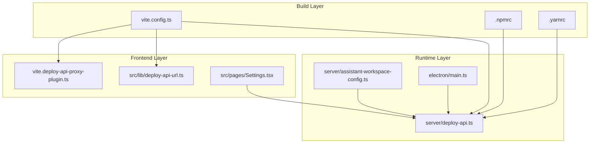
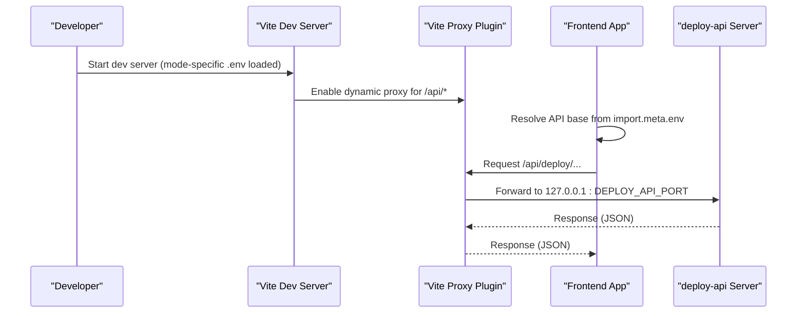
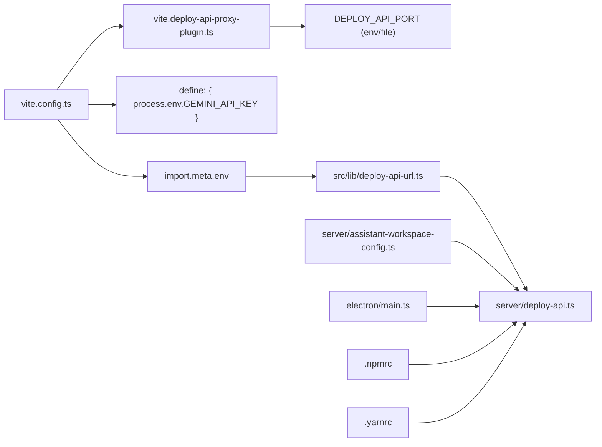

# Environment Configuration

<cite>
**Referenced Files in This Document**
- [.npmrc](file://.npmrc)
- [.yarnrc](file://.yarnrc)
- [vite.config.ts](file://vite.config.ts)
- [package.json](file://package.json)
- [src/lib/deploy-api-url.ts](file://src/lib/deploy-api-url.ts)
- [vite.deploy-api-proxy-plugin.ts](file://vite.deploy-api-proxy-plugin.ts)
- [server/deploy-api.ts](file://server/deploy-api.ts)
- [server/assistant-workspace-config.ts](file://server/assistant-workspace-config.ts)
- [electron/main.ts](file://electron/main.ts)
- [src/pages/Settings.tsx](file://src/pages/Settings.tsx)
</cite>

## Table of Contents
1. [Introduction](#introduction)
2. [Project Structure](#project-structure)
3. [Core Components](#core-components)
4. [Architecture Overview](#architecture-overview)
5. [Detailed Component Analysis](#detailed-component-analysis)
6. [Dependency Analysis](#dependency-analysis)
7. [Performance Considerations](#performance-considerations)
8. [Security Considerations](#security-considerations)
9. [Troubleshooting Guide](#troubleshooting-guide)
10. [Conclusion](#conclusion)
11. [Appendices](#appendices)

## Introduction
This document explains how environment configuration is managed across development, staging, and production contexts in this project. It covers:
- The Vite environment loading mechanism using loadEnv() and mode-based configuration
- The precedence and override patterns for environment variables
- How environment variables integrate with build-time constants
- Registry configuration via .npmrc and .yarnrc
- Practical examples for common deployment scenarios
- Security considerations for sensitive configuration data
- Troubleshooting techniques and validation approaches

## Project Structure
The environment configuration spans three layers:
- Build-time configuration (Vite) and package manager settings (.npmrc, .yarnrc)
- Runtime configuration (Express-based deploy-api) and Electron integration
- Frontend consumption of environment variables and dynamic API base resolution

**Diagram sources**
- [vite.config.ts](file://vite.config.ts)
- [.npmrc](file://.npmrc)
- [.yarnrc](file://.yarnrc)
- [server/deploy-api.ts](file://server/deploy-api.ts)
- [server/assistant-workspace-config.ts](file://server/assistant-workspace-config.ts)
- [electron/main.ts](file://electron/main.ts)
- [vite.deploy-api-proxy-plugin.ts](file://vite.deploy-api-proxy-plugin.ts)
- [src/lib/deploy-api-url.ts](file://src/lib/deploy-api-url.ts)
- [src/pages/Settings.tsx](file://src/pages/Settings.tsx)

**Section sources**
- [vite.config.ts](file://vite.config.ts)
- [.npmrc](file://.npmrc)
- [.yarnrc](file://.yarnrc)
- [server/deploy-api.ts](file://server/deploy-api.ts)
- [server/assistant-workspace-config.ts](file://server/assistant-workspace-config.ts)
- [electron/main.ts](file://electron/main.ts)
- [vite.deploy-api-proxy-plugin.ts](file://vite.deploy-api-proxy-plugin.ts)
- [src/lib/deploy-api-url.ts](file://src/lib/deploy-api-url.ts)
- [src/pages/Settings.tsx](file://src/pages/Settings.tsx)

## Core Components
- Vite environment loading and mode-based configuration
- Dynamic development proxy for API routes
- Frontend API base resolution and fallback behavior
- Server-side .env discovery and merging
- Electron integration and port selection
- Package manager registry configuration

**Section sources**
- [vite.config.ts](file://vite.config.ts)
- [vite.deploy-api-proxy-plugin.ts](file://vite.deploy-api-proxy-plugin.ts)
- [src/lib/deploy-api-url.ts](file://src/lib/deploy-api-url.ts)
- [server/assistant-workspace-config.ts](file://server/assistant-workspace-config.ts)
- [server/deploy-api.ts](file://server/deploy-api.ts)
- [electron/main.ts](file://electron/main.ts)
- [.npmrc](file://.npmrc)
- [.yarnrc](file://.yarnrc)

## Architecture Overview
The environment system orchestrates variables across build, runtime, and client layers. Vite loads environment files per mode and exposes selected variables to the frontend. The development server proxies API requests to a locally running backend service whose port is dynamically resolved. The backend reads .env files from multiple locations and merges updates safely.

**Diagram sources**
- [vite.config.ts](file://vite.config.ts)
- [vite.deploy-api-proxy-plugin.ts](file://vite.deploy-api-proxy-plugin.ts)
- [src/lib/deploy-api-url.ts](file://src/lib/deploy-api-url.ts)
- [server/deploy-api.ts](file://server/deploy-api.ts)

## Detailed Component Analysis

### Vite Environment Loading and Mode-Based Configuration
- Vite loads environment variables using loadEnv(mode, projectRoot, prefix='') and exposes them under import.meta.env in the browser.
- The mode influences plugin behavior and proxy activation.
- Build-time constants are injected via define: { 'process.env.<KEY>': JSON.stringify(env.<KEY>) }.

Key behaviors:
- loadEnv(mode, ...) reads files named according to the current mode (e.g., .env.development, .env.production).
- The Vite config enables a dynamic proxy for /api/* during serve when VITE_DISABLE_DEPLOY_PROXY is not set to "1".
- A build-time constant injects GEMINI_API_KEY for client-side use.

Practical implications:
- Keep mode-specific .env files to separate development, staging, and production values.
- Use VITE_DISABLE_DEPLOY_PROXY=1 to bypass the proxy in special cases.
- Treat injected build-time constants as static at build time; they do not reflect runtime changes.

**Section sources**
- [vite.config.ts](file://vite.config.ts)

### Dynamic Development Proxy for API Routes
- The proxy plugin intercepts requests under /api/* and forwards them to the deploy-api backend.
- Port resolution is dynamic: it prefers an environment-provided hint, falls back to process.env.DEPLOY_API_PORT, and finally reads a file-based port marker.
- On 404 with HTML content, it returns a structured JSON error indicating the backend is likely not listening on the expected port.

Operational notes:
- The port file (.deploy-api-port) is re-read per request to avoid stale ports when the backend restarts.
- The proxy strips hop-by-hop headers and preserves essential ones.

**Section sources**
- [vite.deploy-api-proxy-plugin.ts](file://vite.deploy-api-proxy-plugin.ts)

### Frontend API Base Resolution
- The frontend resolves the base URL for API calls from import.meta.env.VITE_DEPLOY_API_BASE with a default fallback to "/api/deploy".
- The helper function normalizes trailing slashes and supports absolute URLs for external deployments.

Usage pattern:
- When running in development with Vite, the base defaults to "/api/deploy", which aligns with the proxy route prefixes.
- For production builds or standalone desktop, set VITE_DEPLOY_API_BASE to an absolute origin to route API traffic externally.

**Section sources**
- [src/lib/deploy-api-url.ts](file://src/lib/deploy-api-url.ts)

### Server-Side .env Discovery and Merging
- The backend attempts to load a .env file from several locations in priority order and logs a warning if none is found.
- It exposes endpoints to read and write environment fields, merging updates while preserving comments and non-target keys.
- Secret keys are handled specially: they are not returned in plaintext but flagged as configured.

Security and UX:
- The UI allows editing plain and secret keys, with optional clearing of secret values.
- Changes are written atomically to the resolved writable path.

**Section sources**
- [server/deploy-api.ts](file://server/deploy-api.ts)
- [server/assistant-workspace-config.ts](file://server/assistant-workspace-config.ts)
- [src/pages/Settings.tsx](file://src/pages/Settings.tsx)

### Electron Integration and Desktop Runtime
- Electron determines whether to connect to the Vite dev server (port 3000) or the bundled backend (based on ELECTRON_IS_DEV).
- The desktop runtime sets DEPLOY_API_PORT and passes it to the backend process, ensuring consistent port usage.
- The backend writes a port file used by the Vite proxy to avoid stale ports.

**Section sources**
- [electron/main.ts](file://electron/main.ts)
- [server/deploy-api.ts](file://server/deploy-api.ts)

### Package Manager Registry Configuration
- .npmrc and .yarnrc explicitly set the registry to the public npm registry to avoid issues with optional platform-specific packages on enterprise mirrors.
- This ensures deterministic dependency resolution across environments.

**Section sources**
- [.npmrc](file://.npmrc)
- [.yarnrc](file://.yarnrc)

## Dependency Analysis
The environment system exhibits layered dependencies:
- Vite depends on mode and .env files to configure plugins and define build-time constants.
- The proxy plugin depends on the backend port source (environment, process, or file).
- The frontend depends on Vite’s define injection and import.meta.env for runtime values.
- The backend depends on .env discovery and merging utilities to manage configuration.

**Diagram sources**
- [vite.config.ts](file://vite.config.ts)
- [vite.deploy-api-proxy-plugin.ts](file://vite.deploy-api-proxy-plugin.ts)
- [src/lib/deploy-api-url.ts](file://src/lib/deploy-api-url.ts)
- [server/deploy-api.ts](file://server/deploy-api.ts)
- [server/assistant-workspace-config.ts](file://server/assistant-workspace-config.ts)
- [electron/main.ts](file://electron/main.ts)
- [.npmrc](file://.npmrc)
- [.yarnrc](file://.yarnrc)

**Section sources**
- [vite.config.ts](file://vite.config.ts)
- [vite.deploy-api-proxy-plugin.ts](file://vite.deploy-api-proxy-plugin.ts)
- [src/lib/deploy-api-url.ts](file://src/lib/deploy-api-url.ts)
- [server/deploy-api.ts](file://server/deploy-api.ts)
- [server/assistant-workspace-config.ts](file://server/assistant-workspace-config.ts)
- [electron/main.ts](file://electron/main.ts)
- [.npmrc](file://.npmrc)
- [.yarnrc](file://.yarnrc)

## Performance Considerations
- Dynamic proxy reads a port file per request to avoid stale ports; this is lightweight but ensure the file exists and is updated promptly.
- PWA caching excludes /api/ during development to prevent offline caching of proxy error pages.
- Avoid excessive environment file parsing by keeping .env concise and centralized.

## Security Considerations
- Build-time injected variables (e.g., API keys) become part of the client bundle. Limit exposure of sensitive keys to only what is necessary for client-side logic.
- Prefer server-side secrets and avoid shipping secrets to the frontend.
- The backend UI masks secret values and does not return plaintext for secret keys; still, treat them carefully and rotate credentials regularly.
- Use HTTPS in production and restrict access to internal APIs.

## Troubleshooting Guide
Common issues and validations:
- Proxy returns HTML 404 for /api/*
  - Cause: Backend not listening on the expected port or port file outdated.
  - Action: Verify DEPLOY_API_PORT and .deploy-api-port; ensure the backend is running; check for port conflicts.
  - Reference: [vite.deploy-api-proxy-plugin.ts](file://vite.deploy-api-proxy-plugin.ts)

- Frontend cannot reach backend
  - Verify VITE_DEPLOY_API_BASE and proxy configuration.
  - Confirm the backend responds to /api/deploy/health.
  - Reference: [src/lib/deploy-api-url.ts](file://src/lib/deploy-api-url.ts), [server/deploy-api.ts](file://server/deploy-api.ts)

- Environment variables not taking effect
  - Check mode-specific .env files and Vite’s loadEnv behavior.
  - For desktop builds, confirm Electron sets DEPLOY_API_PORT and the backend uses it.
  - Reference: [vite.config.ts](file://vite.config.ts), [electron/main.ts](file://electron/main.ts)

- Sensitive configuration not visible in UI
  - Secret keys are intentionally masked; check configured vs. empty state.
  - Reference: [src/pages/Settings.tsx](file://src/pages/Settings.tsx), [server/assistant-workspace-config.ts](file://server/assistant-workspace-config.ts)

- Registry resolution failures
  - Ensure .npmrc and .yarnrc point to the public registry.
  - Reference: [.npmrc](file://.npmrc), [.yarnrc](file://.yarnrc)

**Section sources**
- [vite.deploy-api-proxy-plugin.ts](file://vite.deploy-api-proxy-plugin.ts)
- [src/lib/deploy-api-url.ts](file://src/lib/deploy-api-url.ts)
- [server/deploy-api.ts](file://server/deploy-api.ts)
- [vite.config.ts](file://vite.config.ts)
- [electron/main.ts](file://electron/main.ts)
- [src/pages/Settings.tsx](file://src/pages/Settings.tsx)
- [server/assistant-workspace-config.ts](file://server/assistant-workspace-config.ts)
- [.npmrc](file://.npmrc)
- [.yarnrc](file://.yarnrc)

## Conclusion
This project’s environment configuration integrates Vite’s mode-aware loading, a dynamic development proxy, and robust server-side .env management. By understanding precedence, build-time injection, and runtime port resolution, teams can reliably operate across development, staging, and production with predictable behavior and strong security hygiene.

## Appendices

### Environment Variable Precedence and Override Patterns
- Vite loadEnv(mode, ...) sources:
  - .env.[mode].local
  - .env.[mode]
  - .env.local
  - .env
- Overrides:
  - Process environment variables take precedence over .env values.
  - Vite define injects build-time constants; they are static and not affected by runtime changes.
- Electron:
  - Uses process.env to select Vite dev server vs. bundled backend and to pass DEPLOY_API_PORT to the backend.

**Section sources**
- [vite.config.ts](file://vite.config.ts)
- [electron/main.ts](file://electron/main.ts)

### Example Scenarios
- Development (browser + Vite)
  - Set VITE_DEPLOY_API_BASE to "/api/deploy" (default) or leave unset.
  - Ensure the backend runs on the expected port and writes .deploy-api-port.
  - Reference: [vite.config.ts](file://vite.config.ts), [vite.deploy-api-proxy-plugin.ts](file://vite.deploy-api-proxy-plugin.ts)

- Desktop (Electron)
  - Electron sets DEPLOY_API_PORT and starts the backend; the proxy reads the port file.
  - Reference: [electron/main.ts](file://electron/main.ts), [server/deploy-api.ts](file://server/deploy-api.ts)

- Production (static site + external API)
  - Set VITE_DEPLOY_API_BASE to the production origin (e.g., https://api.example.com).
  - Reference: [src/lib/deploy-api-url.ts](file://src/lib/deploy-api-url.ts)

- Staging (shared backend)
  - Use a dedicated .env.staging with staging endpoints and credentials.
  - Reference: [vite.config.ts](file://vite.config.ts)

**Section sources**
- [vite.config.ts](file://vite.config.ts)
- [vite.deploy-api-proxy-plugin.ts](file://vite.deploy-api-proxy-plugin.ts)
- [electron/main.ts](file://electron/main.ts)
- [server/deploy-api.ts](file://server/deploy-api.ts)
- [src/lib/deploy-api-url.ts](file://src/lib/deploy-api-url.ts)