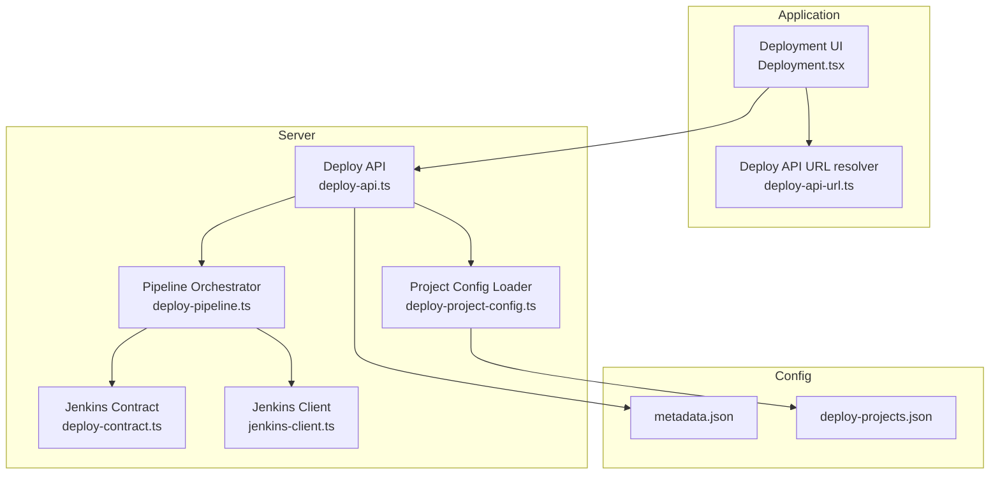
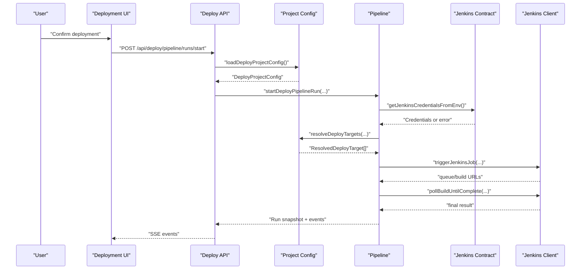
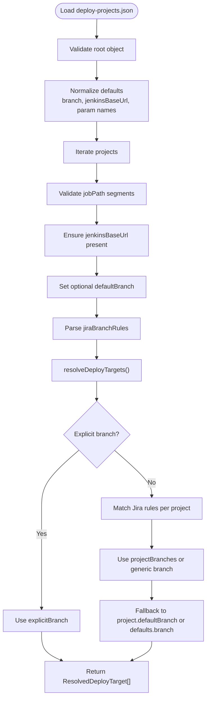
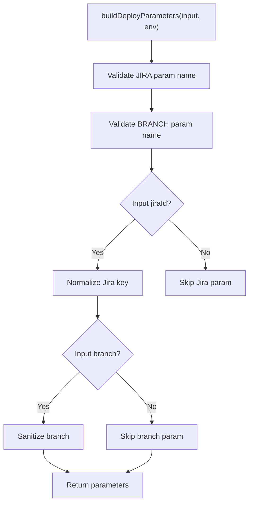
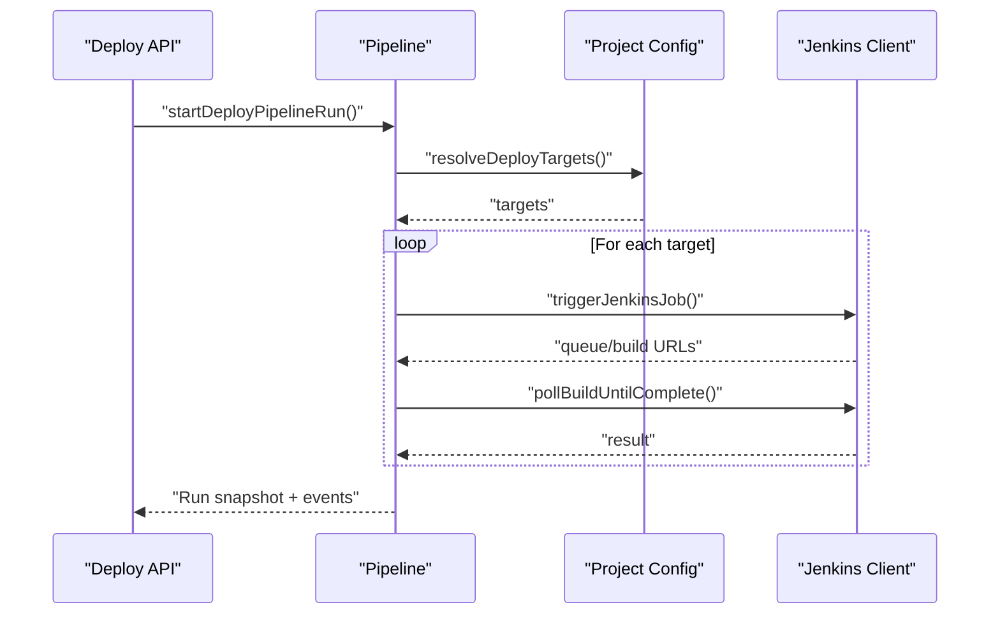
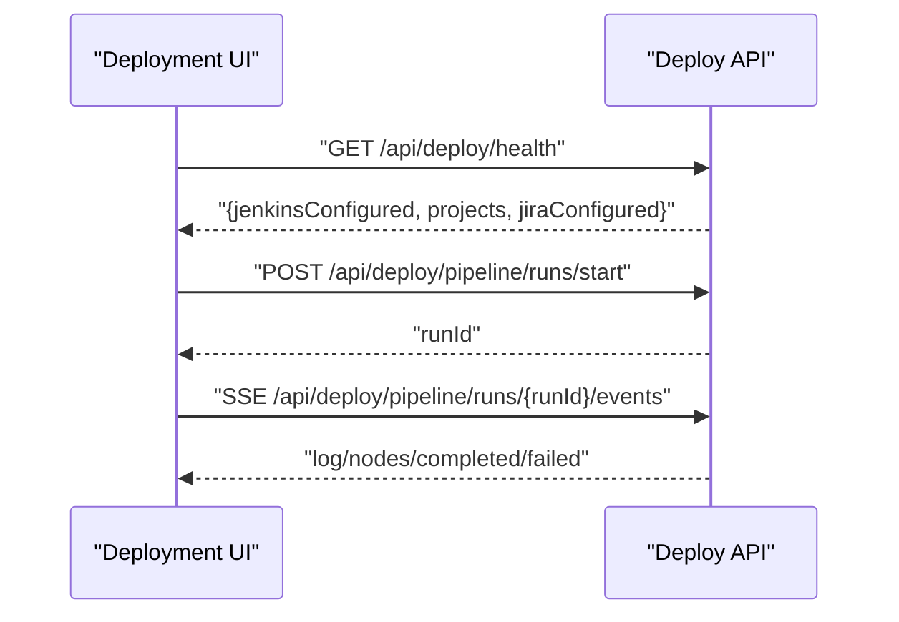
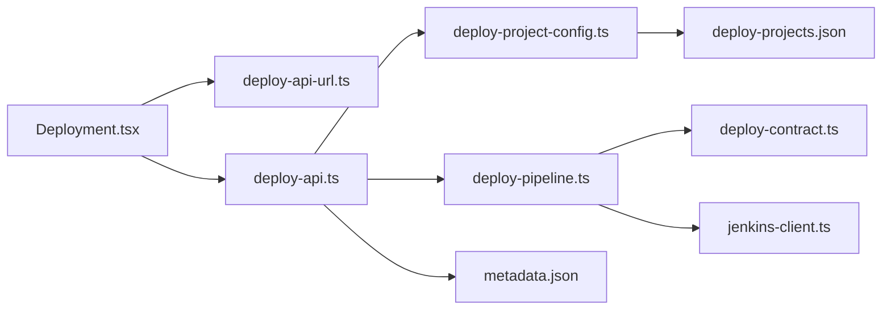

# Project Settings

<cite>
**Referenced Files in This Document**
- [metadata.json](file://metadata.json)
- [deploy-projects.json](file://config/deploy-projects.json)
- [deploy-project-config.ts](file://server/deploy-project-config.ts)
- [deploy-contract.ts](file://server/deploy-contract.ts)
- [deploy-pipeline.ts](file://server/deploy-pipeline.ts)
- [jenkins-client.ts](file://server/jenkins-client.ts)
- [deploy-api.ts](file://server/deploy-api.ts)
- [Deployment.tsx](file://src/pages/Deployment.tsx)
- [deploy-api-url.ts](file://src/lib/deploy-api-url.ts)
- [deploy-project-config.test.ts](file://test/server/deploy-project-config.test.ts)
- [package.json](file://package.json)
</cite>

## Table of Contents
1. [Introduction](#introduction)
2. [Project Structure](#project-structure)
3. [Core Components](#core-components)
4. [Architecture Overview](#architecture-overview)
5. [Detailed Component Analysis](#detailed-component-analysis)
6. [Dependency Analysis](#dependency-analysis)
7. [Performance Considerations](#performance-considerations)
8. [Troubleshooting Guide](#troubleshooting-guide)
9. [Conclusion](#conclusion)
10. [Appendices](#appendices)

## Introduction
This document explains how project settings are modeled and consumed to power deployment automation. It covers:
- The deploy-projects.json configuration for Jenkins job templates, parameters, and deployment pipelines
- The metadata.json application-wide settings (branding, permissions)
- The configuration schema, validation rules, and inheritance/override mechanisms
- How project settings relate to deployment automation and runtime behavior
- Practical configuration scenarios, migration guidance, and troubleshooting

## Project Structure
The project settings are primarily defined in two places:
- Application metadata: metadata.json
- Deployment project definitions: config/deploy-projects.json

These are loaded and validated by server-side modules that feed the deployment pipeline and UI.

**Diagram sources**
- [deploy-api.ts:887–908:887-908](file://server/deploy-api.ts#L887-L908)
- [deploy-project-config.ts:176–180:176-180](file://server/deploy-project-config.ts#L176-L180)
- [deploy-pipeline.ts:225–418:225-418](file://server/deploy-pipeline.ts#L225-L418)
- [deploy-contract.ts:33–81:33-81](file://server/deploy-contract.ts#L33-L81)
- [jenkins-client.ts:89–142:89-142](file://server/jenkins-client.ts#L89-L142)
- [metadata.json:1-6](file://metadata.json#L1-L6)
- [deploy-projects.json:1-78](file://config/deploy-projects.json#L1-L78)

**Section sources**
- [metadata.json:1-6](file://metadata.json#L1-L6)
- [deploy-projects.json:1-78](file://config/deploy-projects.json#L1-L78)
- [deploy-api.ts:887–908:887-908](file://server/deploy-api.ts#L887-L908)

## Core Components
- Project configuration loader and validator: reads and validates deploy-projects.json, normalizes defaults, and resolves deployment targets
- Jenkins contract: validates and builds Jenkins parameters and credentials
- Pipeline orchestrator: executes jobs in DAG order, polls builds, and streams progress via SSE
- Jenkins client: triggers jobs and polls build completion
- Frontend deployment page: renders health, templates, and real-time logs

Key responsibilities:
- Schema enforcement and normalization
- Parameter name validation and safety checks
- Branch resolution via Jira rules and overrides
- Jenkins credential and URL validation
- Real-time deployment feedback

**Section sources**
- [deploy-project-config.ts:96–174:96-174](file://server/deploy-project-config.ts#L96-L174)
- [deploy-contract.ts:83–120:83-120](file://server/deploy-contract.ts#L83-L120)
- [deploy-pipeline.ts:225–418:225-418](file://server/deploy-pipeline.ts#L225-L418)
- [jenkins-client.ts:89–142:89-142](file://server/jenkins-client.ts#L89-L142)

## Architecture Overview
The deployment pipeline is orchestrated server-side. The UI queries health and triggers runs, which the server resolves into Jenkins jobs using project settings.

**Diagram sources**
- [deploy-api.ts:887–908:887-908](file://server/deploy-api.ts#L887-L908)
- [deploy-project-config.ts:176–180:176-180](file://server/deploy-project-config.ts#L176-L180)
- [deploy-pipeline.ts:225–418:225-418](file://server/deploy-pipeline.ts#L225-L418)
- [deploy-contract.ts:33–81:33-81](file://server/deploy-contract.ts#L33-L81)
- [jenkins-client.ts:89–142:89-142](file://server/jenkins-client.ts#L89-L142)

## Detailed Component Analysis

### Project Configuration Schema and Validation
The deploy-projects.json defines:
- defaults: global defaults for branch, Jenkins base URL, and parameter names
- projects: per-project definitions with label, Jenkins job path, and optional defaultBranch
- jiraBranchRules: rules to map Jira keys to project-specific branches

Validation rules enforced by the loader:
- defaults.branch must be a non-empty trimmed string; defaults to a safe default if missing
- defaults.jenkinsBaseUrl is normalized (trailing slash removed)
- defaults.jiraParamName and defaults.branchParamName must match a strict identifier pattern
- projects must be an object; each project requires:
  - jobPath: non-empty, safe segments without parent traversal or control characters
  - jenkinsBaseUrl: must be present (inherited from defaults if not set per project)
  - label: defaults to id if omitted
  - defaultBranch: optional per-project override
- jiraBranchRules: each rule must define a pattern (regex string), optional branch, and optional projectBranches map of project id to branch

Resolution logic:
- Branch selection prioritizes explicitBranch, then Jira rule match per project, then project defaultBranch, then defaults.branch
- Job path segments are split and sanitized; absolute URLs are rejected

**Diagram sources**
- [deploy-project-config.ts:96–174:96-174](file://server/deploy-project-config.ts#L96-L174)
- [deploy-project-config.ts:212–236:212-236](file://server/deploy-project-config.ts#L212-L236)

**Section sources**
- [deploy-project-config.ts:96–174:96-174](file://server/deploy-project-config.ts#L96-L174)
- [deploy-project-config.ts:212–236:212-236](file://server/deploy-project-config.ts#L212-L236)
- [deploy-project-config.test.ts:9–117:9-117](file://test/server/deploy-project-config.test.ts#L9-L117)

### Jenkins Parameter and Credential Contracts
- Parameter names are validated against a strict identifier pattern and can be overridden via environment variables
- Jenkins credentials are loaded from environment variables; missing values produce a structured error response
- Job path segments are validated to prevent injection and absolute URL misuse

**Diagram sources**
- [deploy-contract.ts:91–120:91-120](file://server/deploy-contract.ts#L91-L120)

**Section sources**
- [deploy-contract.ts:33–81:33-81](file://server/deploy-contract.ts#L33-L81)
- [deploy-contract.ts:91–120:91-120](file://server/deploy-contract.ts#L91-L120)

### Pipeline Orchestration and Real-Time Feedback
- The server starts a pipeline run and iterates through nodes in DAG order
- For each node, it resolves a target, builds parameters, triggers Jenkins, and polls completion
- Events are streamed via Server-Sent Events for UI updates
- Statistics persist run counts and last run timestamps

**Diagram sources**
- [deploy-pipeline.ts:225–418:225-418](file://server/deploy-pipeline.ts#L225-L418)
- [jenkins-client.ts:89–142:89-142](file://server/jenkins-client.ts#L89-L142)

**Section sources**
- [deploy-pipeline.ts:225–418:225-418](file://server/deploy-pipeline.ts#L225-L418)
- [jenkins-client.ts:89–142:89-142](file://server/jenkins-client.ts#L89-L142)

### Frontend Integration and Health
- The UI fetches health to check Jenkins configuration, project availability, and Jira connectivity
- It supports templates, recent usage, favorites, and live SSE updates during execution
- The deploy API base URL can be overridden via environment variable

**Diagram sources**
- [Deployment.tsx:316–338:316-338](file://src/pages/Deployment.tsx#L316-L338)
- [Deployment.tsx:505–532:505-532](file://src/pages/Deployment.tsx#L505-L532)
- [deploy-api.ts:887–908:887-908](file://server/deploy-api.ts#L887-L908)
- [deploy-api-url.ts:6–9:6-9](file://src/lib/deploy-api-url.ts#L6-L9)

**Section sources**
- [Deployment.tsx:316–338:316-338](file://src/pages/Deployment.tsx#L316-L338)
- [Deployment.tsx:505–532:505-532](file://src/pages/Deployment.tsx#L505-L532)
- [deploy-api.ts:887–908:887-908](file://server/deploy-api.ts#L887-L908)
- [deploy-api-url.ts:6–9:6-9](file://src/lib/deploy-api-url.ts#L6-L9)

## Dependency Analysis
- Frontend depends on deploy-api-url for base URL resolution and on deploy-api endpoints for health and pipeline events
- The API depends on project config loader and pipeline orchestrator
- The pipeline orchestrator depends on Jenkins contract and Jenkins client
- Project config loader depends on the raw JSON file and validation utilities

**Diagram sources**
- [deploy-api.ts:887–908:887-908](file://server/deploy-api.ts#L887-L908)
- [deploy-project-config.ts:176–180:176-180](file://server/deploy-project-config.ts#L176-L180)
- [deploy-pipeline.ts:225–418:225-418](file://server/deploy-pipeline.ts#L225-L418)
- [deploy-contract.ts:33–81:33-81](file://server/deploy-contract.ts#L33-L81)
- [jenkins-client.ts:89–142:89-142](file://server/jenkins-client.ts#L89-L142)
- [metadata.json:1-6](file://metadata.json#L1-L6)
- [deploy-projects.json:1-78](file://config/deploy-projects.json#L1-L78)

**Section sources**
- [deploy-api.ts:887–908:887-908](file://server/deploy-api.ts#L887-L908)
- [deploy-project-config.ts:176–180:176-180](file://server/deploy-project-config.ts#L176-L180)
- [deploy-pipeline.ts:225–418:225-418](file://server/deploy-pipeline.ts#L225-L418)
- [deploy-contract.ts:33–81:33-81](file://server/deploy-contract.ts#L33-L81)
- [jenkins-client.ts:89–142:89-142](file://server/jenkins-client.ts#L89-L142)
- [metadata.json:1-6](file://metadata.json#L1-L6)
- [deploy-projects.json:1-78](file://config/deploy-projects.json#L1-L78)

## Performance Considerations
- Pipeline memory limits: in-memory runs capped to avoid unbounded growth; older runs are pruned
- Event buffering: only recent events retained per run to bound memory footprint
- Build polling intervals: configurable backoff and timeouts to balance responsiveness and load
- Parameter sanitization: early validation prevents expensive failures downstream

Recommendations:
- Keep the number of concurrent runs reasonable
- Monitor Jenkins queue and build durations to tune timeouts
- Prefer templates to reduce repeated configuration overhead

**Section sources**
- [deploy-pipeline.ts:12–15:12-15](file://server/deploy-pipeline.ts#L12-L15)
- [deploy-pipeline.ts:139–147:139-147](file://server/deploy-pipeline.ts#L139-L147)
- [deploy-pipeline.ts:344–355:344-355](file://server/deploy-pipeline.ts#L344-L355)

## Troubleshooting Guide

Common validation errors and resolutions:
- Missing or invalid jenkinsBaseUrl in project definition
  - Ensure each project defines a valid Jenkins base URL or inherit from defaults
  - See validation for project-level and default-level base URL handling
- Invalid parameter names (JIRA or branch)
  - Parameter names must match the identifier pattern; override via environment variables if needed
- Invalid jobPath or unsafe segments
  - Job path must be non-empty and contain only safe segments; absolute URLs are rejected
- Unknown project id
  - Verify the project id exists in the projects map
- Missing Jenkins credentials
  - Ensure JENKINS_URL, JENKINS_USER/JENKINS_USERNAME, and JENKINS_TOKEN are set
- Invalid Jira key or branch name
  - Jira keys must match the expected format; branch names must not contain control characters

Health indicators:
- Jenkins configured flag indicates whether credentials and project list are valid
- Missing fields list highlights what is missing
- Project list helps confirm configuration loading

Operational tips:
- Use explicit branch override to force a specific branch regardless of Jira rules
- Inspect SSE logs in the UI for detailed failure reasons
- Confirm Jenkins job path segments and parameter names align with Jenkins expectations

**Section sources**
- [deploy-project-config.ts:96–174:96-174](file://server/deploy-project-config.ts#L96-L174)
- [deploy-contract.ts:83–120:83-120](file://server/deploy-contract.ts#L83-L120)
- [deploy-contract.ts:122–151:122-151](file://server/deploy-contract.ts#L122-L151)
- [deploy-pipeline.ts:225–250:225-250](file://server/deploy-pipeline.ts#L225-L250)
- [deploy-api.ts:887–908:887-908](file://server/deploy-api.ts#L887-L908)

## Conclusion
Project settings are central to deployment automation. The deploy-projects.json schema enforces safety and consistency, while the pipeline orchestrator turns project definitions into reliable Jenkins executions. The UI surfaces health and progress, enabling efficient, auditable deployments.

## Appendices

### Configuration Inheritance and Override Mechanisms
- defaults.branch: fallback branch when project defaultBranch is absent
- defaults.jenkinsBaseUrl: inherited by projects if not set per project
- defaults.jiraParamName and defaults.branchParamName: global parameter names with environment override support
- jiraBranchRules: per-Jira-key branch mapping; per-project overrides take precedence over generic branch fallback

**Section sources**
- [deploy-project-config.ts:106–113:106-113](file://server/deploy-project-config.ts#L106-L113)
- [deploy-project-config.ts:126–129:126-129](file://server/deploy-project-config.ts#L126-L129)
- [deploy-contract.ts:95–99:95-99](file://server/deploy-contract.ts#L95-L99)

### Example Scenarios and Best Practices
- Define a minimal defaults block with safe branch and parameter names
- Use jiraBranchRules to map major feature tickets to dedicated branches
- Keep jobPath segments simple and free of special characters
- Prefer templates in the UI to standardize common chains
- Use explicit branch override for hotfixes or ad-hoc deployments
- Keep metadata.json focused on branding and permissions

**Section sources**
- [deploy-projects.json:1-78](file://config/deploy-projects.json#L1-L78)
- [Deployment.tsx:69–80:69-80](file://src/pages/Deployment.tsx#L69-L80)
- [deploy-project-config.test.ts:28–41:28-41](file://test/server/deploy-project-config.test.ts#L28-L41)

### Migration and Backward Compatibility
- defaults.jenkinsBaseUrl normalization removes trailing slashes
- defaults.branch falls back to a safe default if unspecified
- Parameter name validation ensures consistent Jenkins parameter naming
- Job path parsing rejects absolute URLs and unsafe segments
- Environment-based overrides allow gradual migration without changing JSON

**Section sources**
- [deploy-project-config.ts:108–113:108-113](file://server/deploy-project-config.ts#L108-L113)
- [deploy-contract.ts:95–99:95-99](file://server/deploy-contract.ts#L95-L99)
- [deploy-contract.ts:122–151:122-151](file://server/deploy-contract.ts#L122-L151)

### Application Metadata (metadata.json)
- Provides application-level branding and capability hints
- requestFramePermissions and majorCapabilities arrays enable permission modeling
- Not directly used by deployment logic but part of the broader application configuration

**Section sources**
- [metadata.json:1-6](file://metadata.json#L1-L6)