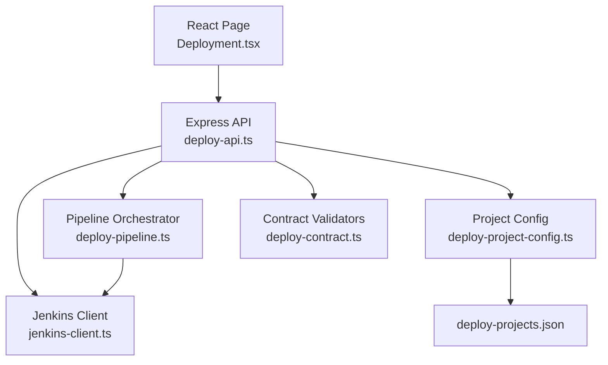
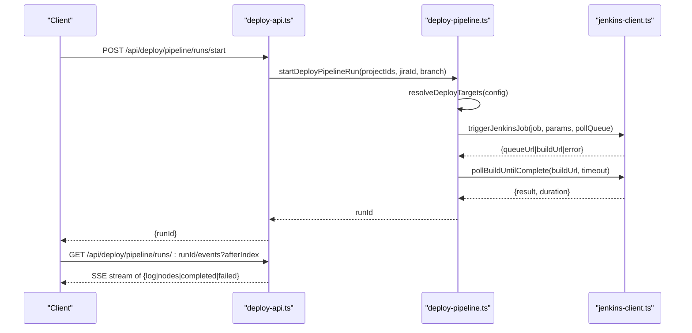
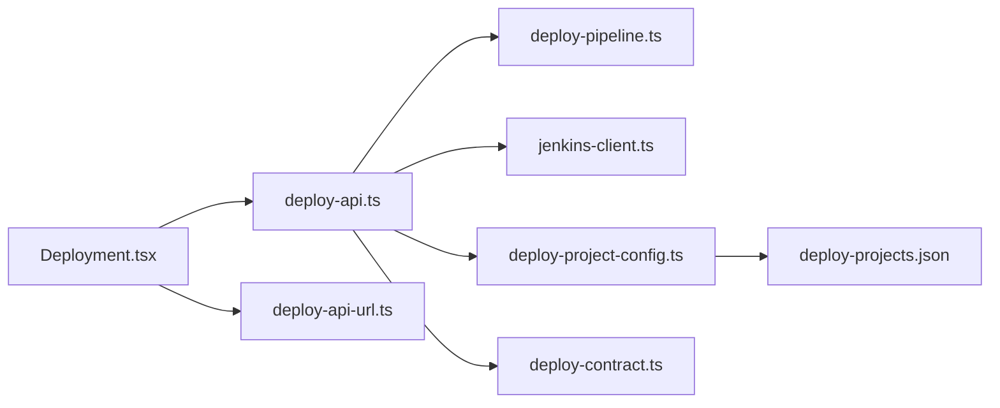

# Deployment API

<cite>
**Referenced Files in This Document**
- [deploy-api.ts](file://server/deploy-api.ts)
- [deploy-contract.ts](file://server/deploy-contract.ts)
- [deploy-pipeline.ts](file://server/deploy-pipeline.ts)
- [deploy-project-config.ts](file://server/deploy-project-config.ts)
- [jenkins-client.ts](file://server/jenkins-client.ts)
- [deploy-projects.json](file://config/deploy-projects.json)
- [deploy-api-url.ts](file://src/lib/deploy-api-url.ts)
- [Deployment.tsx](file://src/pages/Deployment.tsx)
- [2026-05-03-real-jenkins-deployment-design.md](file://docs/superpowers/specs/2026-05-03-real-jenkins-deployment-design.md)
</cite>

## Table of Contents
1. [Introduction](#introduction)
2. [Project Structure](#project-structure)
3. [Core Components](#core-components)
4. [Architecture Overview](#architecture-overview)
5. [Detailed Component Analysis](#detailed-component-analysis)
6. [Dependency Analysis](#dependency-analysis)
7. [Performance Considerations](#performance-considerations)
8. [Troubleshooting Guide](#troubleshooting-guide)
9. [Conclusion](#conclusion)
10. [Appendices](#appendices)

## Introduction
This document describes the Deployment API surface for triggering, monitoring, and managing deployment pipelines against Jenkins. It covers HTTP endpoints, request/response schemas, authentication, validation, error handling, concurrency, timeouts, and client integration patterns. The backend is implemented as an Express server with a React frontend that consumes these endpoints via server-sent events (SSE) and snapshot queries.

## Project Structure
The deployment domain spans a backend Express service and a frontend React page:
- Backend routes under /api/deploy expose health, Jenkins triggers, pipeline orchestration, and statistics.
- Jenkins integration is encapsulated in a dedicated client module.
- Project mapping and parameterization are governed by a configuration file and contract validators.
- The frontend constructs requests, streams logs via SSE, and persists run state locally.

**Diagram sources**
- [deploy-api.ts:887-1514](file://server/deploy-api.ts#L887-L1514)
- [deploy-pipeline.ts:1-419](file://server/deploy-pipeline.ts#L1-L419)
- [jenkins-client.ts:1-191](file://server/jenkins-client.ts#L1-L191)
- [deploy-project-config.ts:1-237](file://server/deploy-project-config.ts#L1-L237)
- [deploy-projects.json:1-78](file://config/deploy-projects.json#L1-L78)
- [deploy-contract.ts:1-169](file://server/deploy-contract.ts#L1-L169)

**Section sources**
- [deploy-api.ts:887-1514](file://server/deploy-api.ts#L887-L1514)
- [deploy-pipeline.ts:1-419](file://server/deploy-pipeline.ts#L1-L419)
- [jenkins-client.ts:1-191](file://server/jenkins-client.ts#L1-L191)
- [deploy-project-config.ts:1-237](file://server/deploy-project-config.ts#L1-L237)
- [deploy-projects.json:1-78](file://config/deploy-projects.json#L1-L78)
- [deploy-contract.ts:1-169](file://server/deploy-contract.ts#L1-L169)

## Core Components
- Express API router: Exposes health, Jenkins triggers, pipeline runs, and statistics.
- Pipeline orchestrator: Manages run lifecycle, node states, and Jenkins polling.
- Jenkins client: Encapsulates trigger and build polling with CSRF crumb support.
- Project configuration: Validates and resolves project mappings, branches, and parameter names.
- Contract validators: Enforce parameter names, job paths, and error semantics.
- Frontend integration: Builds requests, streams logs via SSE, and renders run snapshots.

**Section sources**
- [deploy-api.ts:887-1514](file://server/deploy-api.ts#L887-L1514)
- [deploy-pipeline.ts:1-419](file://server/deploy-pipeline.ts#L1-L419)
- [jenkins-client.ts:1-191](file://server/jenkins-client.ts#L1-L191)
- [deploy-project-config.ts:1-237](file://server/deploy-project-config.ts#L1-L237)
- [deploy-contract.ts:1-169](file://server/deploy-contract.ts#L1-L169)

## Architecture Overview
The Deployment API follows a server-side orchestration model:
- Clients POST to start a pipeline run with project IDs and optional Jira/branch hints.
- The server resolves targets from configuration, triggers Jenkins jobs, and streams progress via SSE.
- Clients can also poll snapshots for run status and node details.

**Diagram sources**
- [deploy-api.ts:1441-1503](file://server/deploy-api.ts#L1441-L1503)
- [deploy-pipeline.ts:186-418](file://server/deploy-pipeline.ts#L186-L418)
- [jenkins-client.ts:89-191](file://server/jenkins-client.ts#L89-L191)

## Detailed Component Analysis

### Health Endpoint
- Method: GET
- Path: /api/deploy/health
- Purpose: Reports Jenkins/Jira configuration status, available projects, and automation settings.
- Response fields:
  - jenkinsConfigured: boolean
  - jenkinsMissing: string[]
  - deployConfigError: string?
  - projects: array of { id, label, defaultBranch }
  - jiraConfigured: boolean
  - automation: { t1Enabled, t1Schedules, t1CommandConfigured }

**Section sources**
- [deploy-api.ts:887-908](file://server/deploy-api.ts#L887-L908)

### Jenkins Trigger Endpoint (Direct Job Trigger)
- Method: POST
- Path: /api/deploy/jenkins/trigger
- Purpose: Trigger one or more Jenkins jobs directly with optional queue polling.
- Request body:
  - projectIds: string[] (preferred) or projectId: string
  - jiraId: string? (optional)
  - branch: string? (optional)
  - jobPath/jobPaths: string|string[]? (backward compatibility)
  - pollQueue: boolean? (default false)
  - pollTimeoutMs: number? (min 0, max 600000)
- Response body:
  - On success: { simulated: false, results: [{ queueUrl?, buildUrl?, buildNumber?, projectId, projectLabel, branch }], projectIds }
  - On Jenkins credential error: { simulated: false, error, missing }
  - On validation errors: { error }

Notes:
- Uses configured Jenkins credentials; returns 503 if missing.
- Supports buildWithParameters when parameters are present.
- If pollQueue=true and queue polling times out, returns queued result without buildUrl.

**Section sources**
- [deploy-api.ts:1330-1404](file://server/deploy-api.ts#L1330-L1404)
- [jenkins-client.ts:89-142](file://server/jenkins-client.ts#L89-L142)
- [deploy-contract.ts:91-120](file://server/deploy-contract.ts#L91-L120)
- [deploy-project-config.ts:212-236](file://server/deploy-project-config.ts#L212-L236)

### Build Result Polling Endpoint
- Method: POST
- Path: /api/deploy/jenkins/build-result
- Purpose: Poll a Jenkins build URL until completion and return final result.
- Request body:
  - buildUrl: string (required)
  - timeoutMs: number? (min 0, max 3600000)
- Response body:
  - { building: false, result, duration }
  - On timeout: { building: true, result: null, duration: 0, error }

**Section sources**
- [deploy-api.ts:1412-1438](file://server/deploy-api.ts#L1412-L1438)
- [jenkins-client.ts:148-191](file://server/jenkins-client.ts#L148-L191)

### Pipeline Run Start Endpoint
- Method: POST
- Path: /api/deploy/pipeline/runs/start
- Purpose: Start a server-side orchestrated pipeline across multiple projects.
- Request body:
  - projectIds: string[] (required)
  - jiraId: string? (optional)
  - branch: string? (optional)
- Response body:
  - { runId: string }
  - On validation errors: { error }

Behavior:
- Validates projectIds and starts a run with status "running".
- Internally resolves targets, triggers Jenkins, and manages node states.

**Section sources**
- [deploy-api.ts:1441-1461](file://server/deploy-api.ts#L1441-L1461)
- [deploy-pipeline.ts:186-223](file://server/deploy-pipeline.ts#L186-L223)

### Pipeline Run Snapshot Endpoint
- Method: GET
- Path: /api/deploy/pipeline/runs/:runId
- Purpose: Retrieve a snapshot of run status, nodes, and recent events.
- Response body:
  - { id, status, taskKey, jiraId?, branch?, nodes, events, eventCount, activeNodeId, createdAt }

Notes:
- Returns a capped tail of events to avoid oversized payloads.

**Section sources**
- [deploy-api.ts:1463-1470](file://server/deploy-api.ts#L1463-L1470)
- [deploy-pipeline.ts:153-180](file://server/deploy-pipeline.ts#L153-L180)

### Pipeline Run Events Stream (SSE)
- Method: GET
- Path: /api/deploy/pipeline/runs/:runId/events
- Purpose: Stream run events as Server-Sent Events.
- Query parameters:
  - afterIndex: number? (cursor to resume streaming)
- Event types:
  - log: { type: "log", timestamp, payload: { message, level } }
  - nodes: { type: "nodes", timestamp, payload: { nodes } }
  - completed: { type: "completed", timestamp, payload?: { partial? } }
  - failed: { type: "failed", timestamp, payload?: { error? } }

Behavior:
- Streams continuously until run completes.
- Automatically closes when run reaches terminal state.

**Section sources**
- [deploy-api.ts:1472-1503](file://server/deploy-api.ts#L1472-L1503)
- [deploy-pipeline.ts:61-82](file://server/deploy-pipeline.ts#L61-L82)

### Task Statistics Endpoint
- Method: GET
- Path: /api/deploy/pipeline/task-stats
- Purpose: Get sorted list of task keys by execution count.
- Query parameters:
  - limit: number? (min 1, max 100)
- Response body:
  - { entries: [{ taskKey, count, lastRunAt }] }

**Section sources**
- [deploy-api.ts:1505-1514](file://server/deploy-api.ts#L1505-L1514)
- [deploy-pipeline.ts:123-137](file://server/deploy-pipeline.ts#L123-L137)

### Jira Resolution Helper
- Method: GET
- Path: /api/deploy/jira/resolution/:issueKey
- Purpose: Resolve Jira issue to potential deployment nodes (fallback behavior).
- Response body:
  - { nodes?: string[], source?, message?, error? }

**Section sources**
- [deploy-api.ts:1285-1303](file://server/deploy-api.ts#L1285-L1303)

### Authentication and Security
- Jenkins credentials:
  - Required environment variables: JENKINS_URL, JENKINS_USER, JENKINS_TOKEN
  - Returned errors never expose secrets; HTML responses are sanitized.
- Frontend base URL:
  - The frontend resolves the API base via deploy-api-url.ts and supports absolute origins.

**Section sources**
- [deploy-contract.ts:33-81](file://server/deploy-contract.ts#L33-L81)
- [jenkins-client.ts:71-87](file://server/jenkins-client.ts#L71-L87)
- [deploy-api-url.ts:6-27](file://src/lib/deploy-api-url.ts#L6-L27)

### Request Validation and Error Responses
- Parameter validation:
  - Parameter names must match /^[A-Za-z_][A-Za-z0-9_.-]*$/
  - Job path segments must be safe and non-empty
  - Jira IDs must match ^[A-Z][A-Z0-9]+-\d+$
- Error responses:
  - 400 for bad input (e.g., missing projectIds)
  - 503 when Jenkins credentials are missing
  - 502 when Jenkins returns an error during trigger
  - 500 for internal errors

**Section sources**
- [deploy-contract.ts:83-120](file://server/deploy-contract.ts#L83-L120)
- [deploy-contract.ts:122-169](file://server/deploy-contract.ts#L122-L169)
- [deploy-project-config.ts:65-94](file://server/deploy-project-config.ts#L65-L94)
- [deploy-project-config.ts:191-210](file://server/deploy-project-config.ts#L191-L210)
- [deploy-api.ts:1330-1404](file://server/deploy-api.ts#L1330-L1404)

### Cancellation Mechanisms
- The pipeline orchestrator does not expose a dedicated cancellation endpoint.
- The frontend can stop SSE listeners and clear local run state; however, Jenkins builds are not canceled by the API.

**Section sources**
- [deploy-api.ts:1472-1503](file://server/deploy-api.ts#L1472-L1503)
- [deploy-pipeline.ts:225-418](file://server/deploy-pipeline.ts#L225-L418)

### Rate Limiting and Concurrency
- No explicit rate limiting is implemented in the API.
- Concurrency control:
  - Pipeline runs are tracked in-memory; older terminal runs are pruned to cap memory usage.
  - Only one run per task key can be active at a time (enforced by activeRunsByTask).

**Section sources**
- [deploy-pipeline.ts:13-14](file://server/deploy-pipeline.ts#L13-L14)
- [deploy-pipeline.ts:139-147](file://server/deploy-pipeline.ts#L139-L147)
- [deploy-api.ts:808-829](file://server/deploy-api.ts#L808-L829)

### Timeouts and Retries
- Jenkins trigger queue polling:
  - pollTimeoutMs configurable per request (min 0, max 600000)
- Build completion polling:
  - Default 30 minutes; configurable via timeoutMs
  - Retries on transient network errors

**Section sources**
- [deploy-api.ts:1338-1339](file://server/deploy-api.ts#L1338-L1339)
- [deploy-api.ts:1419](file://server/deploy-api.ts#L1419)
- [jenkins-client.ts:43-69](file://server/jenkins-client.ts#L43-L69)
- [jenkins-client.ts:148-191](file://server/jenkins-client.ts#L148-L191)

### Client Implementation Guidelines
- Base URL resolution:
  - Use deploy-api-url.ts to compute the API base and route prefixes.
- Starting a pipeline:
  - POST /api/deploy/pipeline/runs/start with projectIds, optional jiraId/branch.
  - Persist runId in session storage for recovery.
- Streaming logs:
  - Open SSE at /api/deploy/pipeline/runs/:runId/events with optional afterIndex.
  - Handle log/nodes/completed/failed events.
- Polling snapshots:
  - GET /api/deploy/pipeline/runs/:runId for periodic updates.
- Health checks:
  - GET /api/deploy/health to gate UI controls.

**Section sources**
- [deploy-api-url.ts:6-27](file://src/lib/deploy-api-url.ts#L6-L27)
- [Deployment.tsx:511-532](file://src/pages/Deployment.tsx#L511-L532)
- [Deployment.tsx:155-202](file://src/pages/Deployment.tsx#L155-L202)
- [Deployment.tsx:230-267](file://src/pages/Deployment.tsx#L230-L267)

## Dependency Analysis
- deploy-api.ts depends on:
  - deploy-pipeline.ts for orchestration
  - jenkins-client.ts for Jenkins operations
  - deploy-project-config.ts and deploy-projects.json for mapping
  - deploy-contract.ts for validation and parameterization
- Frontend Deployment.tsx depends on:
  - deploy-api-url.ts for base URL computation
  - SSE and snapshot endpoints for UX

**Diagram sources**
- [deploy-api.ts:1-50](file://server/deploy-api.ts#L1-L50)
- [deploy-pipeline.ts:1-15](file://server/deploy-pipeline.ts#L1-L15)
- [jenkins-client.ts:1-15](file://server/jenkins-client.ts#L1-L15)
- [deploy-project-config.ts:1-10](file://server/deploy-project-config.ts#L1-L10)
- [deploy-projects.json:1-10](file://config/deploy-projects.json#L1-L10)
- [deploy-contract.ts:1-15](file://server/deploy-contract.ts#L1-L15)
- [deploy-api-url.ts:1-15](file://src/lib/deploy-api-url.ts#L1-L15)
- [Deployment.tsx:1-20](file://src/pages/Deployment.tsx#L1-L20)

**Section sources**
- [deploy-api.ts:1-50](file://server/deploy-api.ts#L1-L50)
- [deploy-pipeline.ts:1-15](file://server/deploy-pipeline.ts#L1-L15)
- [jenkins-client.ts:1-15](file://server/jenkins-client.ts#L1-L15)
- [deploy-project-config.ts:1-10](file://server/deploy-project-config.ts#L1-L10)
- [deploy-projects.json:1-10](file://config/deploy-projects.json#L1-L10)
- [deploy-contract.ts:1-15](file://server/deploy-contract.ts#L1-L15)
- [deploy-api-url.ts:1-15](file://src/lib/deploy-api-url.ts#L1-L15)
- [Deployment.tsx:1-20](file://src/pages/Deployment.tsx#L1-L20)

## Performance Considerations
- Memory management:
  - Maximum 500 events per run; older events are trimmed.
  - Prunes older terminal runs when exceeding in-memory cap.
- Streaming:
  - SSE intervals optimized for UI responsiveness.
- Jenkins polling:
  - Configurable timeouts to balance responsiveness and resource usage.

**Section sources**
- [deploy-pipeline.ts:13-15](file://server/deploy-pipeline.ts#L13-L15)
- [deploy-pipeline.ts:61-66](file://server/deploy-pipeline.ts#L61-L66)
- [deploy-pipeline.ts:139-147](file://server/deploy-pipeline.ts#L139-L147)
- [deploy-api.ts:1489-1498](file://server/deploy-api.ts#L1489-L1498)

## Troubleshooting Guide
Common issues and resolutions:
- Jenkins not configured:
  - Verify JENKINS_URL, JENKINS_USER, JENKINS_TOKEN.
  - Check /api/deploy/health for jenkinsMissing and deployConfigError.
- Jenkins authentication failures:
  - Sanitized HTML responses indicate permission or login issues.
  - Ensure crumb issuance and build permissions.
- Trigger errors:
  - 502 indicates Jenkins error during trigger; inspect results.failedAt and error.
- Timeout handling:
  - Increase pollTimeoutMs for trigger and timeoutMs for build polling.
- Frontend connectivity:
  - Confirm deploy-api-url.ts resolves to the correct origin and port.

**Section sources**
- [deploy-contract.ts:33-81](file://server/deploy-contract.ts#L33-L81)
- [jenkins-client.ts:71-87](file://server/jenkins-client.ts#L71-L87)
- [deploy-api.ts:1347-1355](file://server/deploy-api.ts#L1347-L1355)
- [deploy-api.ts:1419](file://server/deploy-api.ts#L1419)
- [deploy-api.ts:887-908](file://server/deploy-api.ts#L887-L908)

## Conclusion
The Deployment API provides a robust, server-side orchestration layer for Jenkins-triggered deployments. It offers deterministic project mapping, parameterization, and real-time progress via SSE, while maintaining strict separation of credentials and sensitive configuration. Clients should leverage health checks, snapshots, and SSE to deliver responsive deployment experiences.

## Appendices

### API Definitions Summary
- GET /api/deploy/health
  - Response: { jenkinsConfigured, jenkinsMissing?, deployConfigError?, projects, jiraConfigured, automation }
- POST /api/deploy/jenkins/trigger
  - Body: { projectIds?|projectId?, jiraId?, branch?, jobPath?|jobPaths?, pollQueue?, pollTimeoutMs? }
  - Response: { simulated: false, results, projectIds } or error
- POST /api/deploy/jenkins/build-result
  - Body: { buildUrl, timeoutMs? }
  - Response: { building, result, duration } or { building: true, result: null, duration: 0, error }
- POST /api/deploy/pipeline/runs/start
  - Body: { projectIds, jiraId?, branch? }
  - Response: { runId } or error
- GET /api/deploy/pipeline/runs/:runId
  - Response: { id, status, taskKey, jiraId?, branch?, nodes, events, eventCount, activeNodeId, createdAt }
- GET /api/deploy/pipeline/runs/:runId/events?afterIndex=
  - Response: SSE stream of {log|nodes|completed|failed}
- GET /api/deploy/pipeline/task-stats?limit=
  - Response: { entries }
- GET /api/deploy/jira/resolution/:issueKey
  - Response: { nodes?, source?, message?, error? }

**Section sources**
- [deploy-api.ts:887-1514](file://server/deploy-api.ts#L887-L1514)

### Example Workflows

#### Start a Pipeline and Stream Logs
- POST /api/deploy/pipeline/runs/start with projectIds=["saas-cc-web","biz-core"]
- Store runId from response
- Open SSE: GET /api/deploy/pipeline/runs/{runId}/events
- Render nodes and logs as they arrive

**Section sources**
- [deploy-api.ts:1441-1503](file://server/deploy-api.ts#L1441-L1503)
- [Deployment.tsx:511-532](file://src/pages/Deployment.tsx#L511-L532)
- [Deployment.tsx:155-202](file://src/pages/Deployment.tsx#L155-L202)

#### Trigger Jobs Directly with Queue Polling
- POST /api/deploy/jenkins/trigger with projectIds and pollQueue=true
- Use pollTimeoutMs to tune responsiveness
- Handle queued vs completed results

**Section sources**
- [deploy-api.ts:1330-1404](file://server/deploy-api.ts#L1330-L1404)
- [jenkins-client.ts:43-69](file://server/jenkins-client.ts#L43-L69)

### Configuration Reference
- Project mapping: config/deploy-projects.json
  - defaults: branch, jenkinsBaseUrl, jiraParamName, branchParamName
  - projects: id -> { label, jobPath, defaultBranch? }
  - jiraBranchRules: patterns to override branch per project

**Section sources**
- [deploy-projects.json:1-78](file://config/deploy-projects.json#L1-L78)
- [deploy-project-config.ts:96-174](file://server/deploy-project-config.ts#L96-L174)