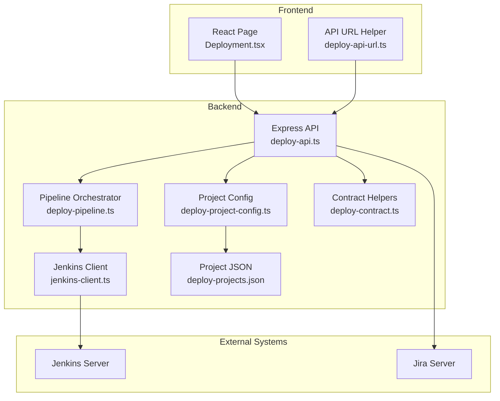
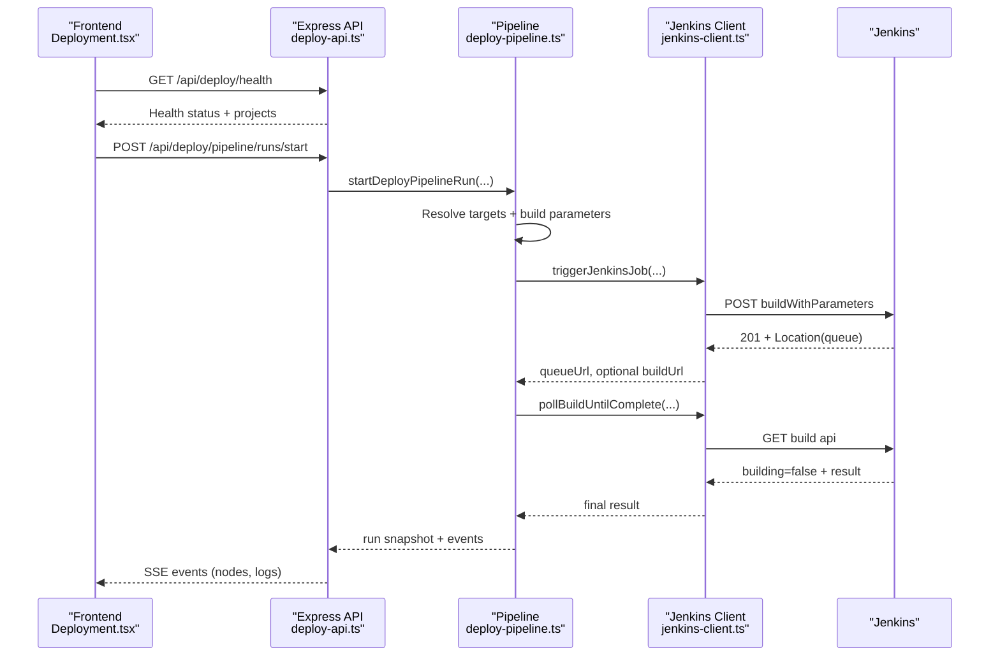
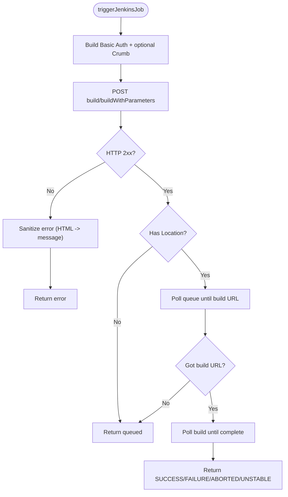
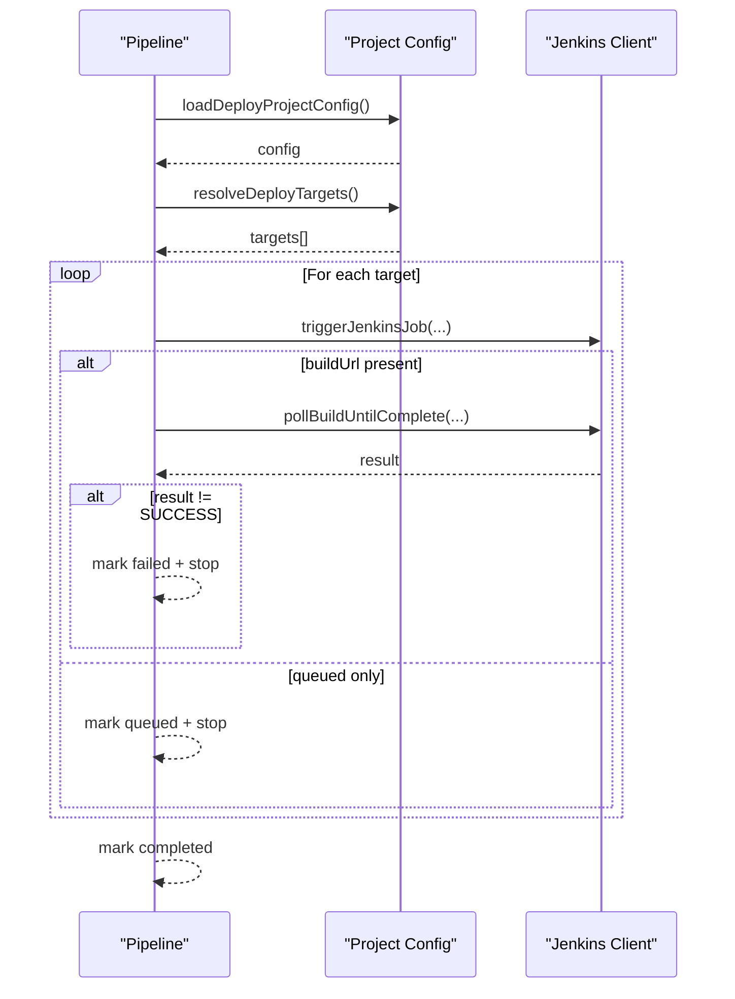
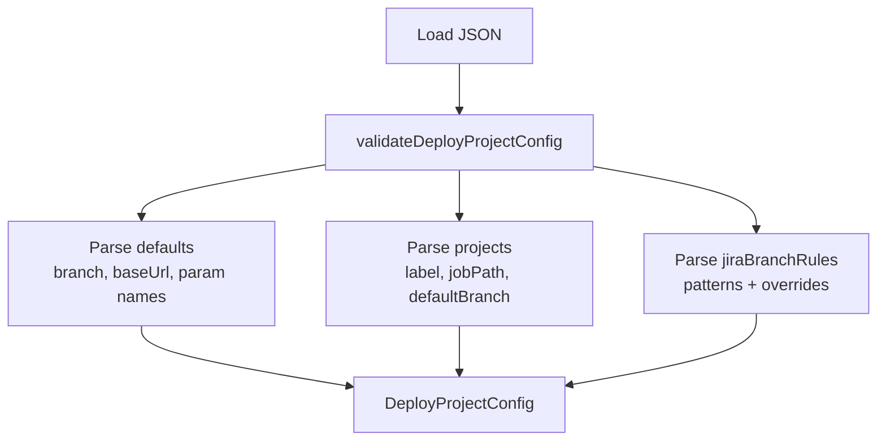
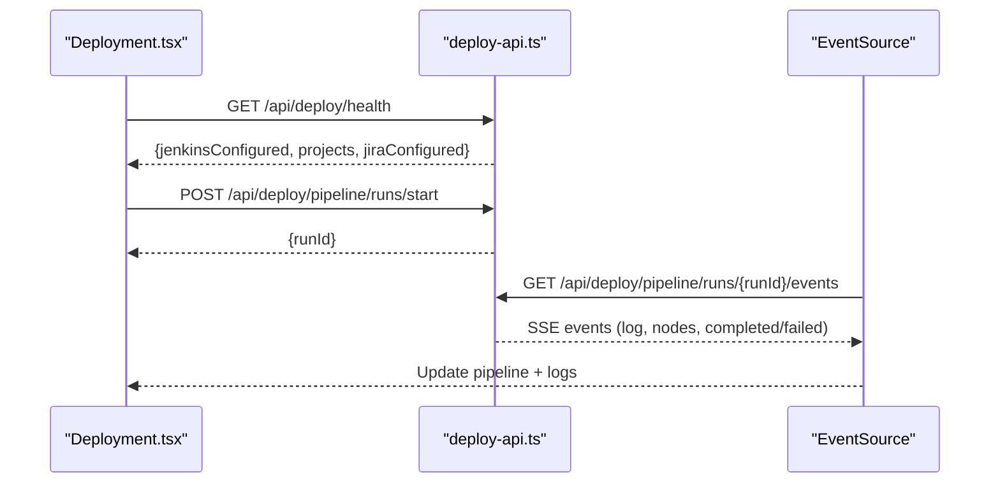
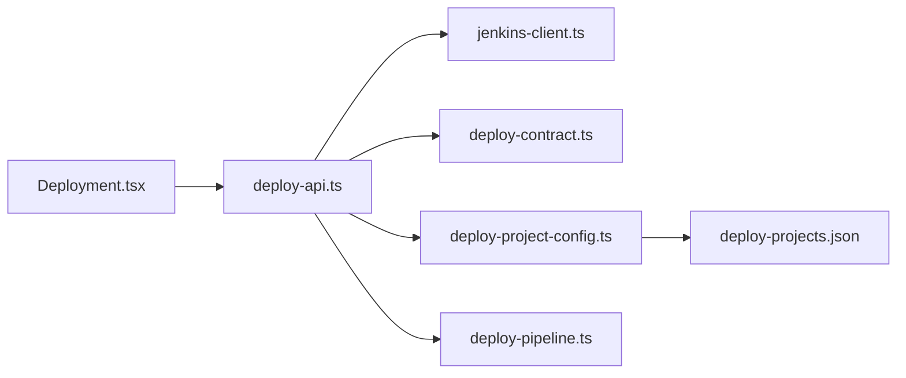
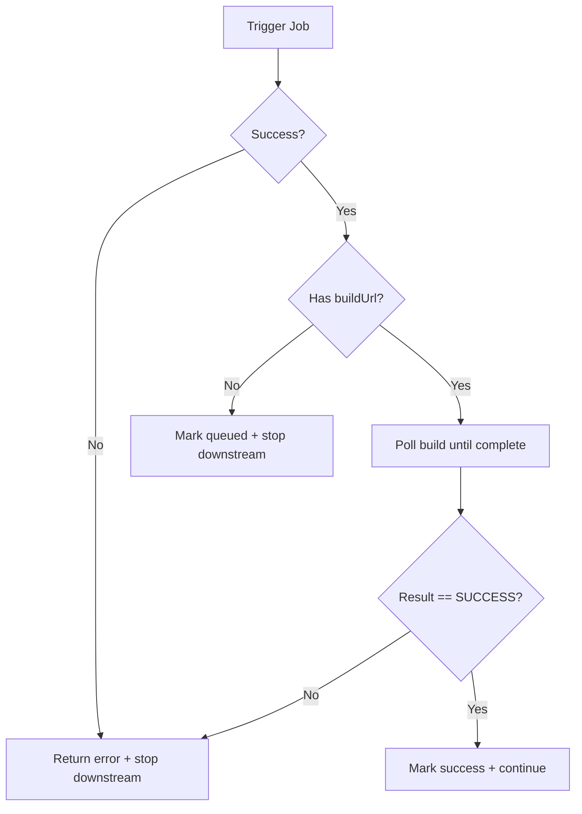

# Deployment Management System

<cite>
**Referenced Files in This Document**
- [deploy-projects.json](file://config/deploy-projects.json)
- [deploy-api.ts](file://server/deploy-api.ts)
- [deploy-pipeline.ts](file://server/deploy-pipeline.ts)
- [jenkins-client.ts](file://server/jenkins-client.ts)
- [deploy-project-config.ts](file://server/deploy-project-config.ts)
- [deploy-contract.ts](file://server/deploy-contract.ts)
- [Deployment.tsx](file://src/pages/Deployment.tsx)
- [deploy-api-url.ts](file://src/lib/deploy-api-url.ts)
- [2026-05-03-real-jenkins-deployment-design.md](file://docs/superpowers/specs/2026-05-03-real-jenkins-deployment-design.md)
- [2026-05-03-real-jenkins-deployment.md](file://docs/superpowers/plans/2026-05-03-real-jenkins-deployment.md)
- [deploy-contract.test.ts](file://test/server/deploy-contract.test.ts)
- [deploy-project-config.test.ts](file://test/server/deploy-project-config.test.ts)
- [jenkins-client.test.ts](file://test/server/jenkins-client.test.ts)
</cite>

## Table of Contents
1. [Introduction](#introduction)
2. [Project Structure](#project-structure)
3. [Core Components](#core-components)
4. [Architecture Overview](#architecture-overview)
5. [Detailed Component Analysis](#detailed-component-analysis)
6. [Dependency Analysis](#dependency-analysis)
7. [Performance Considerations](#performance-considerations)
8. [Security Considerations](#security-considerations)
9. [Error Handling and Retry Logic](#error-handling-and-retry-logic)
10. [Deployment API Endpoints](#deployment-api-endpoints)
11. [Project Configuration System](#project-configuration-system)
12. [Common Deployment Scenarios](#common-deployment-scenarios)
13. [Troubleshooting Guide](#troubleshooting-guide)
14. [Conclusion](#conclusion)

## Introduction
This document describes the deployment management system that orchestrates Jenkins job triggers, validates configurations, and provides real-time monitoring of deployment pipelines. The system consists of:
- A backend Express server exposing deployment APIs and orchestrating Jenkins jobs
- A frontend React page for configuring and monitoring deployments
- A configuration system for defining deployment projects and parameters
- Robust error handling, security controls, and testing practices

The system ensures Jenkins credentials never reach the client, enforces strict configuration validation, and provides real-time status via server-sent events.

## Project Structure
The deployment system is organized into backend services, frontend UI, configuration files, and tests:

**Diagram sources**
- [deploy-api.ts:1-1735](file://server/deploy-api.ts#L1-L1735)
- [deploy-pipeline.ts:1-419](file://server/deploy-pipeline.ts#L1-L419)
- [jenkins-client.ts:1-191](file://server/jenkins-client.ts#L1-L191)
- [deploy-project-config.ts:1-237](file://server/deploy-project-config.ts#L1-L237)
- [deploy-contract.ts:1-169](file://server/deploy-contract.ts#L1-L169)
- [deploy-projects.json:1-78](file://config/deploy-projects.json#L1-L78)
- [Deployment.tsx:1-1068](file://src/pages/Deployment.tsx#L1-L1068)
- [deploy-api-url.ts:1-28](file://src/lib/deploy-api-url.ts#L1-L28)

**Section sources**
- [deploy-api.ts:1-1735](file://server/deploy-api.ts#L1-L1735)
- [deploy-pipeline.ts:1-419](file://server/deploy-pipeline.ts#L1-L419)
- [jenkins-client.ts:1-191](file://server/jenkins-client.ts#L1-L191)
- [deploy-project-config.ts:1-237](file://server/deploy-project-config.ts#L1-L237)
- [deploy-contract.ts:1-169](file://server/deploy-contract.ts#L1-L169)
- [deploy-projects.json:1-78](file://config/deploy-projects.json#L1-L78)
- [Deployment.tsx:1-1068](file://src/pages/Deployment.tsx#L1-L1068)
- [deploy-api-url.ts:1-28](file://src/lib/deploy-api-url.ts#L1-L28)

## Core Components
- Jenkins Client: Handles Jenkins authentication, crumb acquisition, job triggering, and queue/build polling
- Project Configuration: Validates and resolves project-specific Jenkins settings and branch rules
- Contract Helpers: Provides strict environment-based configuration retrieval and parameter building
- Pipeline Orchestrator: Manages multi-project deployment runs, node states, and real-time status
- Deployment API: Exposes endpoints for triggering jobs, polling build results, and streaming pipeline events
- Frontend UI: Renders deployment health, templates, and real-time pipeline status

**Section sources**
- [jenkins-client.ts:1-191](file://server/jenkins-client.ts#L1-L191)
- [deploy-project-config.ts:1-237](file://server/deploy-project-config.ts#L1-L237)
- [deploy-contract.ts:1-169](file://server/deploy-contract.ts#L1-L169)
- [deploy-pipeline.ts:1-419](file://server/deploy-pipeline.ts#L1-L419)
- [deploy-api.ts:1-1735](file://server/deploy-api.ts#L1-L1735)
- [Deployment.tsx:1-1068](file://src/pages/Deployment.tsx#L1-L1068)

## Architecture Overview
The system follows a backend-for-frontend (BFF) pattern:
- The frontend requests deployment health and templates
- The backend validates configuration and triggers Jenkins jobs
- The backend streams pipeline events via server-sent events
- The frontend renders real-time status and queue/build URLs

**Diagram sources**
- [deploy-api.ts:1440-1514](file://server/deploy-api.ts#L1440-L1514)
- [deploy-pipeline.ts:225-418](file://server/deploy-pipeline.ts#L225-L418)
- [jenkins-client.ts:89-190](file://server/jenkins-client.ts#L89-L190)
- [Deployment.tsx:155-202](file://src/pages/Deployment.tsx#L155-L202)

**Section sources**
- [deploy-api.ts:1440-1514](file://server/deploy-api.ts#L1440-L1514)
- [deploy-pipeline.ts:225-418](file://server/deploy-pipeline.ts#L225-L418)
- [jenkins-client.ts:89-190](file://server/jenkins-client.ts#L89-L190)
- [Deployment.tsx:155-202](file://src/pages/Deployment.tsx#L155-L202)

## Detailed Component Analysis

### Jenkins Client Implementation
Responsibilities:
- Build Basic auth header and optional Jenkins crumb
- Trigger jobs via buildWithParameters when parameters exist
- Poll queue until build URL is exposed
- Poll build until completion and return result

Key behaviors:
- Sanitizes HTML login/permission errors into concise messages
- Accepts 200/201/202 queue responses
- Returns queued state when build URL unavailable within timeout

**Diagram sources**
- [jenkins-client.ts:89-190](file://server/jenkins-client.ts#L89-L190)

**Section sources**
- [jenkins-client.ts:1-191](file://server/jenkins-client.ts#L1-L191)
- [jenkins-client.test.ts:1-162](file://test/server/jenkins-client.test.ts#L1-L162)

### Deployment Pipeline Orchestration
Responsibilities:
- Manage per-run state, node statuses, and event snapshots
- Resolve project targets and build parameters
- Coordinate sequential triggering and polling
- Enforce early termination on failure

**Diagram sources**
- [deploy-pipeline.ts:225-418](file://server/deploy-pipeline.ts#L225-L418)
- [deploy-project-config.ts:212-236](file://server/deploy-project-config.ts#L212-L236)
- [jenkins-client.ts:89-190](file://server/jenkins-client.ts#L89-L190)

**Section sources**
- [deploy-pipeline.ts:1-419](file://server/deploy-pipeline.ts#L1-L419)
- [deploy-project-config.ts:1-237](file://server/deploy-project-config.ts#L1-L237)

### Project Configuration System (deploy-projects.json)
Defines:
- Defaults: global branch, Jenkins base URL, parameter names
- Projects: label, Jenkins job path, default branch
- Jira branch rules: project-specific overrides and generic fallbacks

Validation:
- Rejects invalid project IDs and unsafe job path segments
- Requires jenkinsBaseUrl for each project
- Validates parameter name formats

**Diagram sources**
- [deploy-project-config.ts:96-174](file://server/deploy-project-config.ts#L96-L174)
- [deploy-projects.json:1-78](file://config/deploy-projects.json#L1-L78)

**Section sources**
- [deploy-project-config.ts:1-237](file://server/deploy-project-config.ts#L1-L237)
- [deploy-projects.json:1-78](file://config/deploy-projects.json#L1-L78)
- [deploy-project-config.test.ts:1-117](file://test/server/deploy-project-config.test.ts#L1-L117)

### Frontend Deployment Page
Features:
- Health check integration
- Template and recent usage management
- Real-time pipeline monitoring via SSE
- Display of queue/build URLs and node statuses

**Diagram sources**
- [Deployment.tsx:155-202](file://src/pages/Deployment.tsx#L155-L202)
- [deploy-api.ts:1463-1503](file://server/deploy-api.ts#L1463-L1503)

**Section sources**
- [Deployment.tsx:1-1068](file://src/pages/Deployment.tsx#L1-L1068)
- [deploy-api.ts:1463-1503](file://server/deploy-api.ts#L1463-L1503)

## Dependency Analysis
Internal dependencies:
- deploy-api.ts depends on jenkins-client.ts, deploy-contract.ts, deploy-project-config.ts, and deploy-pipeline.ts
- deploy-pipeline.ts depends on jenkins-client.ts and deploy-contract.ts
- deploy-project-config.ts depends on deploy-contract.ts
- Deployment.tsx depends on deploy-api-url.ts and consumes deploy-api endpoints

**Diagram sources**
- [deploy-api.ts:1-1735](file://server/deploy-api.ts#L1-L1735)
- [deploy-pipeline.ts:1-419](file://server/deploy-pipeline.ts#L1-L419)
- [jenkins-client.ts:1-191](file://server/jenkins-client.ts#L1-L191)
- [deploy-project-config.ts:1-237](file://server/deploy-project-config.ts#L1-L237)
- [deploy-contract.ts:1-169](file://server/deploy-contract.ts#L1-L169)
- [deploy-projects.json:1-78](file://config/deploy-projects.json#L1-L78)
- [Deployment.tsx:1-1068](file://src/pages/Deployment.tsx#L1-L1068)

**Section sources**
- [deploy-api.ts:1-1735](file://server/deploy-api.ts#L1-L1735)
- [deploy-pipeline.ts:1-419](file://server/deploy-pipeline.ts#L1-L419)
- [jenkins-client.ts:1-191](file://server/jenkins-client.ts#L1-L191)
- [deploy-project-config.ts:1-237](file://server/deploy-project-config.ts#L1-L237)
- [deploy-contract.ts:1-169](file://server/deploy-contract.ts#L1-L169)
- [deploy-projects.json:1-78](file://config/deploy-projects.json#L1-L78)
- [Deployment.tsx:1-1068](file://src/pages/Deployment.tsx#L1-L1068)

## Performance Considerations
- Event streaming: SSE delivers incremental updates; the backend caps event counts per run and prunes old runs to control memory
- Polling intervals: Jenkins polling uses conservative intervals and timeouts to balance responsiveness and load
- Parameter building: Minimal allocations during parameter construction; environment-based defaults avoid repeated validation overhead
- Frontend rendering: Virtualized lists and selective re-rendering for large pipelines

[No sources needed since this section provides general guidance]

## Security Considerations
- Credentials isolation: Jenkins credentials are loaded from environment variables on the server; never sent to the client
- Authentication: Basic auth with optional Jenkins crumb; HTML/permission errors are sanitized before return
- Parameter validation: Strict validation of parameter names and branch names prevents injection
- Environment exposure: Only non-secret fields are returned via UI environment endpoints

**Section sources**
- [deploy-contract.ts:29-81](file://server/deploy-contract.ts#L29-L81)
- [jenkins-client.ts:31-87](file://server/jenkins-client.ts#L31-L87)
- [deploy-api.ts:887-908](file://server/deploy-api.ts#L887-L908)

## Error Handling and Retry Logic
- Jenkins client:
  - Sanitized HTML/permission errors
  - Queue polling with configurable timeout
  - Build polling with backoff-like behavior
- Pipeline orchestration:
  - Stops subsequent nodes upon failure
  - Marks nodes as queued when build URL unavailable within timeout
  - Emits structured events for UI feedback
- Frontend:
  - Health checks disable execution when Jenkins is unconfigured
  - SSE closes on errors; UI reconnects automatically

**Diagram sources**
- [deploy-pipeline.ts:320-396](file://server/deploy-pipeline.ts#L320-L396)
- [jenkins-client.ts:148-190](file://server/jenkins-client.ts#L148-L190)

**Section sources**
- [deploy-pipeline.ts:320-396](file://server/deploy-pipeline.ts#L320-L396)
- [jenkins-client.ts:148-190](file://server/jenkins-client.ts#L148-L190)

## Deployment API Endpoints
- GET /api/deploy/health: Returns Jenkins and Jira configuration status, project list
- POST /api/deploy/jenkins/trigger: Triggers Jenkins jobs for one or more projects
- POST /api/deploy/jenkins/build-result: Polls a build until completion
- POST /api/deploy/pipeline/runs/start: Starts a server-side orchestrated pipeline
- GET /api/deploy/pipeline/runs/:runId: Returns a snapshot of a run
- GET /api/deploy/pipeline/runs/:runId/events: Streams run events via SSE
- GET /api/deploy/pipeline/task-stats: Returns sorted pipeline task statistics

**Section sources**
- [deploy-api.ts:887-908](file://server/deploy-api.ts#L887-L908)
- [deploy-api.ts:1330-1404](file://server/deploy-api.ts#L1330-L1404)
- [deploy-api.ts:1412-1438](file://server/deploy-api.ts#L1412-L1438)
- [deploy-api.ts:1441-1461](file://server/deploy-api.ts#L1441-L1461)
- [deploy-api.ts:1463-1503](file://server/deploy-api.ts#L1463-L1503)
- [deploy-api.ts:1505-1514](file://server/deploy-api.ts#L1505-L1514)

## Project Configuration System
Configuration file (deploy-projects.json):
- defaults: branch, jenkinsBaseUrl, jiraParamName, branchParamName
- projects: label, jobPath, defaultBranch
- jiraBranchRules: patterns and branch overrides

Resolution logic:
- Explicit branch overrides all rules
- Jira-specific project overrides
- Generic Jira rule fallback
- Project default branch
- Global default branch

**Section sources**
- [deploy-projects.json:1-78](file://config/deploy-projects.json#L1-L78)
- [deploy-project-config.ts:191-236](file://server/deploy-project-config.ts#L191-L236)
- [deploy-project-config.test.ts:50-103](file://test/server/deploy-project-config.test.ts#L50-L103)

## Common Deployment Scenarios
- Single project deployment: Select project, optionally specify branch or Jira ID; trigger via pipeline endpoint
- Multi-project pipeline: Define ordered nodes; pipeline triggers sequentially and stops on failure
- Branch resolution: Explicit branch overrides Jira rules; Jira rules override project defaults
- Real-time monitoring: Use SSE to observe queue URLs, build URLs, and node statuses

**Section sources**
- [Deployment.tsx:485-532](file://src/pages/Deployment.tsx#L485-L532)
- [deploy-pipeline.ts:254-418](file://server/deploy-pipeline.ts#L254-L418)
- [deploy-project-config.ts:191-236](file://server/deploy-project-config.ts#L191-L236)

## Troubleshooting Guide
- Jenkins not configured: Health endpoint indicates missing credentials; configure JENKINS_URL, JENKINS_USER, JENKINS_TOKEN
- Permission denied: Jenkins client sanitizes HTML login/permission errors; verify Jenkins credentials and job permissions
- Queue timeout: If build URL not exposed within timeout, node is marked queued; adjust poll timeout or check Jenkins queue
- Parameter validation: Invalid Jira keys or branch names cause 400 errors; ensure correct formats
- Frontend not updating: Verify SSE connection and that run exists; check browser console for errors

**Section sources**
- [deploy-api.ts:887-908](file://server/deploy-api.ts#L887-L908)
- [jenkins-client.ts:71-87](file://server/jenkins-client.ts#L71-L87)
- [deploy-contract.test.ts:10-34](file://test/server/deploy-contract.test.ts#L10-L34)
- [jenkins-client.test.ts:138-161](file://test/server/jenkins-client.test.ts#L138-L161)

## Conclusion
The deployment management system provides a robust, secure, and observable way to orchestrate Jenkins deployments. By keeping credentials server-side, validating configurations rigorously, and streaming real-time status, it enables reliable automated deployments with strong operational visibility.