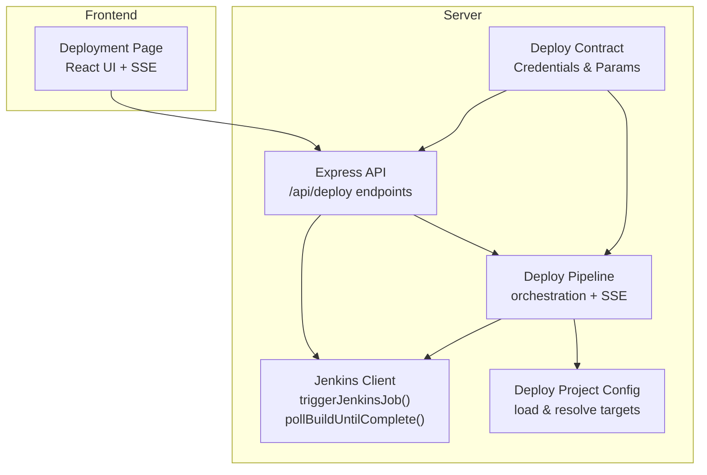
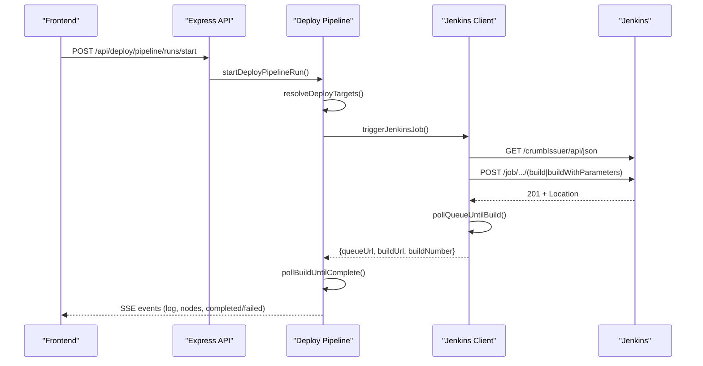
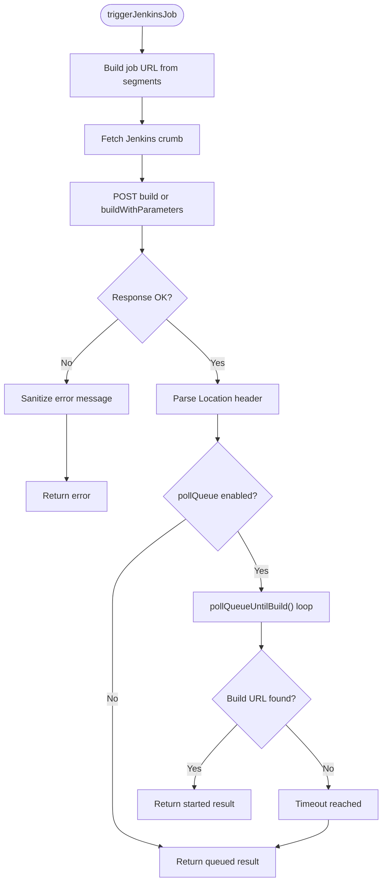
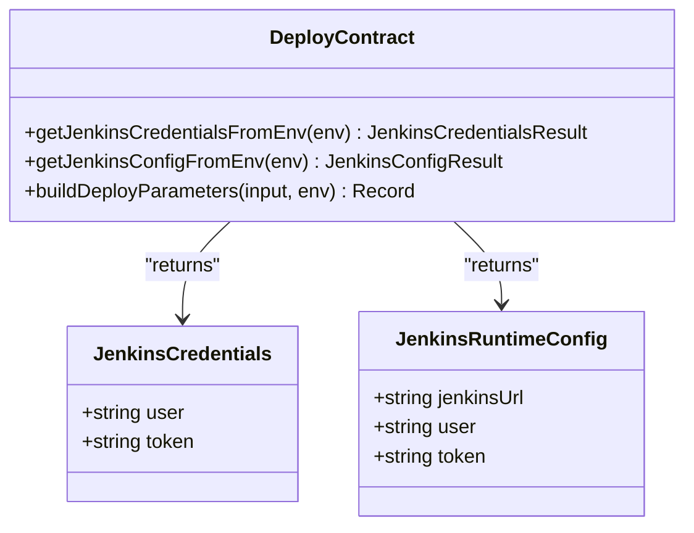
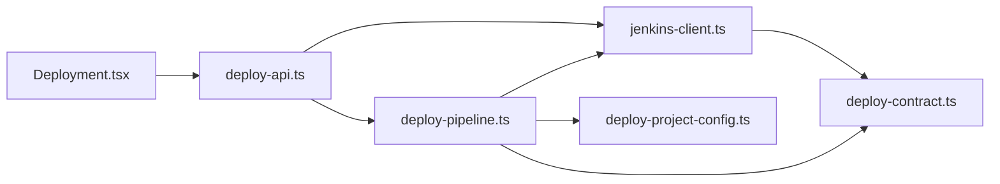

# Jenkins Integration

<cite>
**Referenced Files in This Document**
- [jenkins-client.ts](file://server/jenkins-client.ts)
- [deploy-contract.ts](file://server/deploy-contract.ts)
- [deploy-project-config.ts](file://server/deploy-project-config.ts)
- [deploy-pipeline.ts](file://server/deploy-pipeline.ts)
- [deploy-api.ts](file://server/deploy-api.ts)
- [deploy-projects.json](file://config/deploy-projects.json)
- [Deployment.tsx](file://src/pages/Deployment.tsx)
- [jenkins-client.test.ts](file://test/server/jenkins-client.test.ts)
</cite>

## Table of Contents
1. [Introduction](#introduction)
2. [Project Structure](#project-structure)
3. [Core Components](#core-components)
4. [Architecture Overview](#architecture-overview)
5. [Detailed Component Analysis](#detailed-component-analysis)
6. [Dependency Analysis](#dependency-analysis)
7. [Performance Considerations](#performance-considerations)
8. [Troubleshooting Guide](#troubleshooting-guide)
9. [Security Considerations](#security-considerations)
10. [Examples and Scenarios](#examples-and-scenarios)
11. [Conclusion](#conclusion)

## Introduction
This document explains the Jenkins integration system implemented in the backend and frontend. It covers the Jenkins client implementation, authentication mechanisms, job triggering, queue management, build polling, error handling, and security considerations. It also documents how the frontend orchestrates deployment pipelines and displays real-time progress.

## Project Structure
The Jenkins integration spans several server-side modules and a React frontend page:
- Server-side Jenkins client and orchestration
- Environment-driven configuration and parameterization
- Frontend deployment page with live updates via Server-Sent Events (SSE)

**Diagram sources**
- [jenkins-client.ts:89-191](file://server/jenkins-client.ts#L89-L191)
- [deploy-contract.ts:33-81](file://server/deploy-contract.ts#L33-L81)
- [deploy-project-config.ts:176-236](file://server/deploy-project-config.ts#L176-L236)
- [deploy-pipeline.ts:225-418](file://server/deploy-pipeline.ts#L225-L418)
- [deploy-api.ts:1330-1438](file://server/deploy-api.ts#L1330-L1438)
- [Deployment.tsx:155-202](file://src/pages/Deployment.tsx#L155-L202)

**Section sources**
- [jenkins-client.ts:1-191](file://server/jenkins-client.ts#L1-L191)
- [deploy-contract.ts:1-169](file://server/deploy-contract.ts#L1-L169)
- [deploy-project-config.ts:1-237](file://server/deploy-project-config.ts#L1-L237)
- [deploy-pipeline.ts:1-419](file://server/deploy-pipeline.ts#L1-L419)
- [deploy-api.ts:1320-1438](file://server/deploy-api.ts#L1320-L1438)
- [Deployment.tsx:1-1068](file://src/pages/Deployment.tsx#L1-L1068)

## Core Components
- Jenkins Client: Provides job triggering and build polling with robust error handling and timeout management.
- Deploy Contract: Loads Jenkins credentials from environment variables and builds parameter maps for jobs.
- Deploy Project Config: Loads and validates project configuration, resolves job segments and branches.
- Deploy Pipeline: Orchestrates multi-node deployments, manages run state, and streams progress via SSE.
- Express API: Exposes endpoints for triggering jobs, polling build results, and managing pipeline runs.
- Frontend Deployment Page: Renders the DAG, shows logs, and connects to SSE for live updates.

**Section sources**
- [jenkins-client.ts:89-191](file://server/jenkins-client.ts#L89-L191)
- [deploy-contract.ts:33-120](file://server/deploy-contract.ts#L33-L120)
- [deploy-project-config.ts:176-236](file://server/deploy-project-config.ts#L176-L236)
- [deploy-pipeline.ts:225-418](file://server/deploy-pipeline.ts#L225-L418)
- [deploy-api.ts:1330-1438](file://server/deploy-api.ts#L1330-L1438)
- [Deployment.tsx:155-202](file://src/pages/Deployment.tsx#L155-L202)

## Architecture Overview
The system separates concerns across modules:
- Authentication and credentials are loaded from environment variables and kept off the client.
- Job triggering constructs URLs from job segments and parameters, requests a crumb, and posts to Jenkins.
- Queue polling resolves a build URL when available; build polling waits until the build completes.
- The frontend subscribes to SSE events to visualize pipeline progress.

**Diagram sources**
- [deploy-api.ts:1441-1461](file://server/deploy-api.ts#L1441-L1461)
- [deploy-pipeline.ts:225-418](file://server/deploy-pipeline.ts#L225-L418)
- [jenkins-client.ts:43-142](file://server/jenkins-client.ts#L43-L142)

## Detailed Component Analysis

### Jenkins Client
Implements:
- Basic authentication header construction using base64 encoding.
- Crumb fetching for CSRF protection.
- Job URL construction from segments and parameter building.
- Queue polling to resolve a build URL.
- Build polling with timeouts and intervals.

**Diagram sources**
- [jenkins-client.ts:89-142](file://server/jenkins-client.ts#L89-L142)

**Section sources**
- [jenkins-client.ts:27-142](file://server/jenkins-client.ts#L27-L142)
- [jenkins-client.test.ts:38-136](file://test/server/jenkins-client.test.ts#L38-L136)

### Authentication Header Construction and Environment Credentials
- Basic auth header is constructed using UTF-8-encoded user:token and base64 encoding.
- Jenkins credentials are loaded from environment variables:
  - JENKINS_USER or JENKINS_USERNAME
  - JENKINS_TOKEN
  - JENKINS_URL
- Parameter names for Jira and branch are configurable via environment variables.

**Diagram sources**
- [deploy-contract.ts:10-81](file://server/deploy-contract.ts#L10-L81)

**Section sources**
- [deploy-contract.ts:33-120](file://server/deploy-contract.ts#L33-L120)

### Job Triggering and Parameter Building
- Job segments are URL-encoded and joined with “/job/”.
- If parameters exist, the endpoint uses buildWithParameters; otherwise build.
- Parameters are validated and sanitized before posting.
- The system supports overriding branch and Jira ID via environment-defined parameter names.

**Section sources**
- [jenkins-client.ts:21-104](file://server/jenkins-client.ts#L21-L104)
- [deploy-contract.ts:91-120](file://server/deploy-contract.ts#L91-L120)

### Queue Management and Build Polling
- Queue polling reads the Location header and periodically checks the queue item API until a build URL appears.
- Build polling checks the build API until building=false, returning the final result and duration.
- Both loops enforce timeouts and backoff using remaining time.

**Section sources**
- [jenkins-client.ts:43-69](file://server/jenkins-client.ts#L43-L69)
- [jenkins-client.ts:148-191](file://server/jenkins-client.ts#L148-L191)

### Deploy Pipeline Orchestration
- Loads project configuration and resolves targets per project ID.
- Builds parameters and triggers jobs sequentially or conditionally.
- Streams logs and node states via SSE; stops early on queue-only outcomes or failures.
- Uses a 30-minute default build polling timeout with 5-second intervals.

**Section sources**
- [deploy-pipeline.ts:225-418](file://server/deploy-pipeline.ts#L225-L418)
- [deploy-project-config.ts:212-236](file://server/deploy-project-config.ts#L212-L236)

### Express API Endpoints
- POST /api/deploy/jenkins/trigger: Triggers jobs for one or more projects, applies parameter overrides, and returns results.
- POST /api/deploy/jenkins/build-result: Polls a build URL until completion and returns the result.
- POST /api/deploy/pipeline/runs/start: Starts a server-side DAG run and returns a runId.
- GET /api/deploy/pipeline/runs/:runId: Returns a snapshot of the run.
- GET /api/deploy/pipeline/runs/:runId/events: SSE stream of run events.

**Section sources**
- [deploy-api.ts:1330-1438](file://server/deploy-api.ts#L1330-L1438)
- [deploy-api.ts:1441-1514](file://server/deploy-api.ts#L1441-L1514)

### Frontend Deployment Page
- Loads health and project options, renders a DAG editor, and executes pipeline runs.
- Subscribes to SSE events to update logs and node statuses in real time.
- Displays links to Jenkins queue/build URLs and build numbers.

**Section sources**
- [Deployment.tsx:155-202](file://src/pages/Deployment.tsx#L155-L202)
- [Deployment.tsx:485-532](file://src/pages/Deployment.tsx#L485-L532)
- [Deployment.tsx:824-902](file://src/pages/Deployment.tsx#L824-L902)

## Dependency Analysis
- Jenkins Client depends on Node’s fetch and Buffer for base64 encoding.
- Deploy Contract depends on environment variables and validates inputs.
- Deploy Pipeline depends on Deploy Contract and Deploy Project Config to resolve targets and parameters.
- Express API depends on Jenkins Client and Deploy Pipeline for orchestration.
- Frontend depends on Express API for triggering runs and subscribing to SSE.

**Diagram sources**
- [deploy-api.ts:1-27](file://server/deploy-api.ts#L1-L27)
- [deploy-pipeline.ts:8-10](file://server/deploy-pipeline.ts#L8-L10)
- [deploy-contract.ts:1-27](file://server/deploy-contract.ts#L1-L27)
- [deploy-project-config.ts:1-3](file://server/deploy-project-config.ts#L1-L3)
- [jenkins-client.ts:1-4](file://server/jenkins-client.ts#L1-L4)

**Section sources**
- [deploy-api.ts:1-63](file://server/deploy-api.ts#L1-L63)
- [deploy-pipeline.ts:1-15](file://server/deploy-pipeline.ts#L1-L15)
- [deploy-contract.ts:1-14](file://server/deploy-contract.ts#L1-L14)
- [deploy-project-config.ts:1-16](file://server/deploy-project-config.ts#L1-L16)
- [jenkins-client.ts:1-4](file://server/jenkins-client.ts#L1-L4)

## Performance Considerations
- Queue polling uses short sleeps between attempts and respects remaining timeout to avoid excessive load.
- Build polling uses a fixed interval (default 5 seconds) and caps the timeout (default 30 minutes).
- SSE streaming avoids long-polling overhead by keeping connections alive.
- Frontend limits event buffer sizes and prunes old events to keep memory usage bounded.

[No sources needed since this section provides general guidance]

## Troubleshooting Guide
Common issues and resolutions:
- Authentication failures: Verify JENKINS_USER/JENKINS_TOKEN/JENKINS_URL are present and correct. The system sanitizes HTML responses into concise messages indicating authentication or permission problems.
- Missing crumb: If Jenkins requires crumbs, ensure the crumb issuer endpoint is reachable and returns a crumb; otherwise, proceed without crumb if allowed by Jenkins configuration.
- Network timeouts: Increase pollTimeoutMs for queue polling and timeoutMs for build polling via request bodies.
- Parameter validation errors: Ensure JENKINS_PARAM_JIRA and JENKINS_PARAM_BRANCH conform to allowed naming rules and that Jira IDs and branch names pass validation.
- Project configuration errors: Confirm deploy-projects.json is valid and jobPath segments are safe and non-empty.

**Section sources**
- [jenkins-client.ts:71-87](file://server/jenkins-client.ts#L71-L87)
- [jenkins-client.test.ts:138-161](file://test/server/jenkins-client.test.ts#L138-L161)
- [deploy-contract.ts:83-120](file://server/deploy-contract.ts#L83-L120)
- [deploy-project-config.ts:96-174](file://server/deploy-project-config.ts#L96-L174)

## Security Considerations
- Credentials are loaded from environment variables and never exposed to the client.
- Basic authentication header is constructed using base64 encoding; ensure tokens are rotated regularly.
- Parameter names and values are validated to prevent injection and unsafe characters.
- Jenkins crumb is fetched automatically to mitigate CSRF attacks when enabled.

**Section sources**
- [deploy-contract.ts:33-81](file://server/deploy-contract.ts#L33-L81)
- [jenkins-client.ts:27-41](file://server/jenkins-client.ts#L27-L41)
- [deploy-contract.ts:83-120](file://server/deploy-contract.ts#L83-L120)

## Examples and Scenarios

### Successful Job Trigger
- Trigger a job with parameters:
  - Endpoint: POST /api/deploy/jenkins/trigger
  - Body: projectIds, optional jiraId, optional branch, optional pollQueue=true, optional pollTimeoutMs
  - Behavior: Builds parameters, triggers buildWithParameters, polls queue if enabled, returns queueUrl/buildUrl/buildNumber

**Section sources**
- [deploy-api.ts:1330-1404](file://server/deploy-api.ts#L1330-L1404)
- [jenkins-client.test.ts:38-65](file://test/server/jenkins-client.test.ts#L38-L65)

### Queue Management Scenario
- Trigger a job and wait for build URL resolution:
  - pollQueue=true, pollTimeoutMs=120000
  - The system polls the queue item API until executable.number and url are present

**Section sources**
- [deploy-api.ts:1338-1380](file://server/deploy-api.ts#L1338-L1380)
- [jenkins-client.test.ts:67-104](file://test/server/jenkins-client.test.ts#L67-L104)

### Failure Recovery Procedures
- If queue polling times out without a build URL, the system reports the job as queued and stops subsequent nodes.
- If build polling times out, the system marks the node as queued and halts further nodes.
- On build result not equal to SUCCESS, the system marks the node as failed and stops the pipeline.

**Section sources**
- [jenkins-client.test.ts:106-136](file://test/server/jenkins-client.test.ts#L106-L136)
- [deploy-pipeline.ts:331-396](file://server/deploy-pipeline.ts#L331-L396)

### Frontend Real-Time Updates
- After starting a pipeline run, the frontend subscribes to SSE events and updates logs and node statuses in real time.

**Section sources**
- [Deployment.tsx:155-202](file://src/pages/Deployment.tsx#L155-L202)
- [deploy-api.ts:1472-1503](file://server/deploy-api.ts#L1472-L1503)

## Conclusion
The Jenkins integration system provides a secure, robust, and observable way to trigger jobs, manage queues, and poll builds. It centralizes authentication and configuration in the server, exposes clear APIs for triggering and polling, and offers a rich frontend experience with live updates. Proper environment configuration and parameter validation are essential for reliable operation.