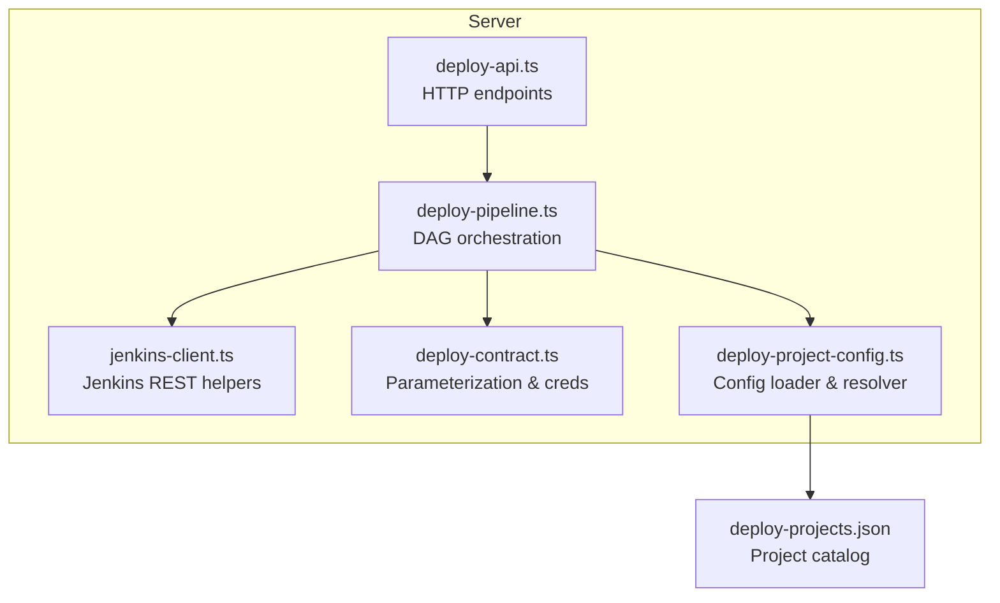
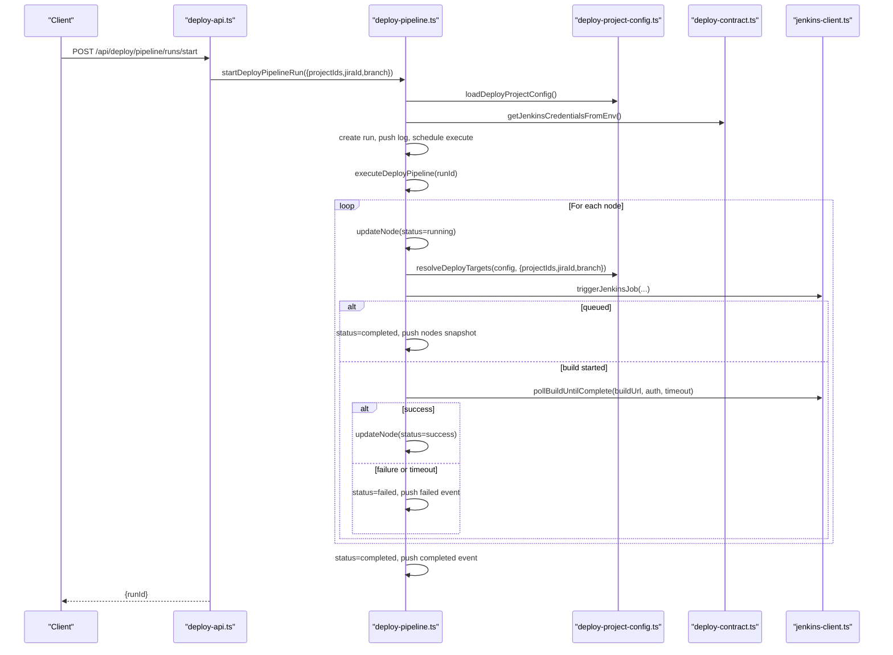
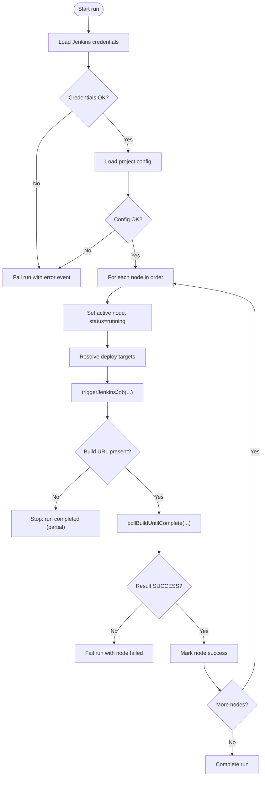
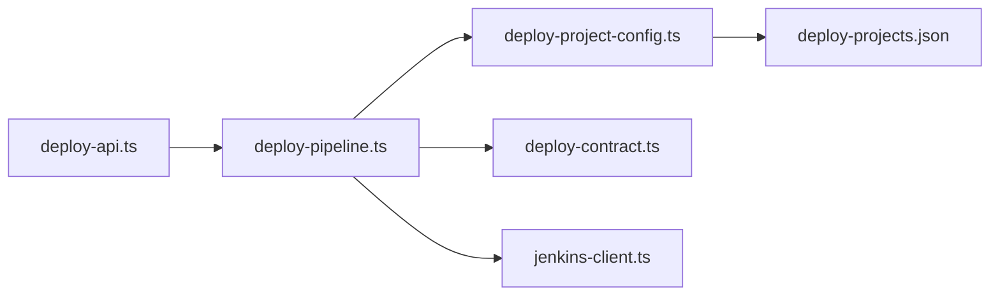

# Pipeline Orchestration

<cite>
**Referenced Files in This Document**
- [deploy-pipeline.ts](file://server/deploy-pipeline.ts)
- [deploy-contract.ts](file://server/deploy-contract.ts)
- [deploy-project-config.ts](file://server/deploy-project-config.ts)
- [deploy-projects.json](file://config/deploy-projects.json)
- [deploy-api.ts](file://server/deploy-api.ts)
- [jenkins-client.ts](file://server/jenkins-client.ts)
- [deploy-contract.test.ts](file://test/server/deploy-contract.test.ts)
- [deploy-project-config.test.ts](file://test/server/deploy-project-config.test.ts)
- [jenkins-client.test.ts](file://test/server/jenkins-client.test.ts)
</cite>

## Table of Contents
1. [Introduction](#introduction)
2. [Project Structure](#project-structure)
3. [Core Components](#core-components)
4. [Architecture Overview](#architecture-overview)
5. [Detailed Component Analysis](#detailed-component-analysis)
6. [Dependency Analysis](#dependency-analysis)
7. [Performance Considerations](#performance-considerations)
8. [Troubleshooting Guide](#troubleshooting-guide)
9. [Conclusion](#conclusion)
10. [Appendices](#appendices)

## Introduction
This document explains the deployment pipeline orchestration system that coordinates multiple deployment projects as a Directed Acyclic Graph (DAG). It covers the lifecycle of a pipeline run (creation, execution phases, completion), node state management (idle, running, success, failed, queued), event logging (levels, timestamps, payloads), statistics tracking (deployment frequency), memory management (in-memory run limits and event pruning), and the snapshot and SSE mechanisms for real-time monitoring. It also documents the run pruning logic and error propagation between nodes.

## Project Structure
The orchestration is implemented server-side with a small set of modules:
- Pipeline orchestration and runtime state: server/deploy-pipeline.ts
- Jenkins integration helpers: server/jenkins-client.ts
- Contract and parameterization: server/deploy-contract.ts
- Project configuration loader and resolver: server/deploy-project-config.ts
- Configuration file: config/deploy-projects.json
- HTTP API surface: server/deploy-api.ts
- Tests validating behavior: test/server/deploy-contract.test.ts, test/server/deploy-project-config.test.ts, test/server/jenkins-client.test.ts

**Diagram sources**
- [deploy-api.ts](file://server/deploy-api.ts)
- [deploy-pipeline.ts](file://server/deploy-pipeline.ts)
- [jenkins-client.ts](file://server/jenkins-client.ts)
- [deploy-contract.ts](file://server/deploy-contract.ts)
- [deploy-project-config.ts](file://server/deploy-project-config.ts)
- [deploy-projects.json](file://config/deploy-projects.json)

**Section sources**
- [deploy-api.ts](file://server/deploy-api.ts)
- [deploy-pipeline.ts](file://server/deploy-pipeline.ts)
- [jenkins-client.ts](file://server/jenkins-client.ts)
- [deploy-contract.ts](file://server/deploy-contract.ts)
- [deploy-project-config.ts](file://server/deploy-project-config.ts)
- [deploy-projects.json](file://config/deploy-projects.json)

## Core Components
- Pipeline run model: a run has a status, task key, optional Jira ID and branch, a list of nodes, an event stream, an active node pointer, and a creation timestamp.
- Node state model: each node has an id, name, status, optional duration, queue/build URLs, build number, and branch.
- Event model: events carry a type, timestamp, and payload. Types include logs, node snapshots, completion, and failure.
- Statistics: a persistent JSON file tracks task frequency and last run time for each task key (comma-separated project IDs).
- Memory management: in-memory run limit and event pruning to cap memory usage.

**Section sources**
- [deploy-pipeline.ts](file://server/deploy-pipeline.ts)

## Architecture Overview
The orchestration is a server-side DAG executor that triggers Jenkins jobs sequentially per node. It resolves project targets from configuration, builds parameters, triggers jobs, polls queue/builds, and updates node and run states accordingly. Events are emitted and streamed via Server-Sent Events (SSE) or served as snapshots.

**Diagram sources**
- [deploy-api.ts](file://server/deploy-api.ts)
- [deploy-pipeline.ts](file://server/deploy-pipeline.ts)
- [deploy-project-config.ts](file://server/deploy-project-config.ts)
- [deploy-contract.ts](file://server/deploy-contract.ts)
- [jenkins-client.ts](file://server/jenkins-client.ts)

## Detailed Component Analysis

### Pipeline Orchestration Engine
- Run lifecycle:
  - Creation: startDeployPipelineRun validates inputs, creates a run with nodes, sets status to running, bumps task stats, prunes old runs, logs initial message, and schedules asynchronous execution.
  - Execution: executeDeployPipeline loads Jenkins credentials and project config, iterates nodes in order, triggers jobs, polls queue/builds, updates node and run states, and pushes snapshot events.
  - Completion: run status becomes completed or failed; final snapshot is pushed; active node cleared.
- Node state transitions:
  - idle → running when active node switches.
  - running → success when build completes successfully.
  - running → failed if build fails or polling times out.
  - running → queued if job enters queue and does not resolve to a build URL within timeout.
- Error propagation:
  - Jenkins credential or config errors fail the run early.
  - Target resolution or trigger failures mark node as failed and fail the run.
  - Build polling timeouts mark node as queued and stop subsequent nodes.
- Snapshot and SSE:
  - pushNodesSnapshot emits a nodes snapshot event periodically.
  - getDeployPipelineRunSnapshot returns a tail of recent events for quick retrieval.
  - /api/deploy/pipeline/runs/:runId/events streams events via SSE until completion.

**Diagram sources**
- [deploy-pipeline.ts](file://server/deploy-pipeline.ts)
- [jenkins-client.ts](file://server/jenkins-client.ts)
- [deploy-project-config.ts](file://server/deploy-project-config.ts)
- [deploy-contract.ts](file://server/deploy-contract.ts)

**Section sources**
- [deploy-pipeline.ts](file://server/deploy-pipeline.ts)

### Jenkins Integration
- triggerJenkinsJob:
  - Builds job URL from segments, obtains crumb if available, posts build or buildWithParameters, optionally polls queue until build URL appears, returns queue/build URLs and metadata.
- pollBuildUntilComplete:
  - Polls build API until building=false, returning result and duration or an error if timeout occurs.

**Section sources**
- [jenkins-client.ts](file://server/jenkins-client.ts)
- [jenkins-client.test.ts](file://test/server/jenkins-client.test.ts)

### Parameterization and Contracts
- buildDeployParameters:
  - Validates and constructs Jenkins parameters for Jira ID and branch using configurable parameter names.
- getJenkinsCredentialsFromEnv:
  - Validates presence of user and token; returns error with missing keys if incomplete.
- parseJobPathGroups:
  - Parses and validates job path segments, rejecting unsafe or absolute URLs.

**Section sources**
- [deploy-contract.ts](file://server/deploy-contract.ts)
- [deploy-contract.test.ts](file://test/server/deploy-contract.test.ts)

### Project Configuration and Resolution
- loadDeployProjectConfig:
  - Reads and validates deploy-projects.json, ensuring each project defines jobPath and jenkinsBaseUrl.
- resolveDeployTargets:
  - For each project ID, resolves jenkinsBaseUrl, jobSegments, and branch using explicit branch, Jira rules, project defaults, or global defaults.
- listDeployProjects:
  - Returns minimal metadata for UI consumption.

**Section sources**
- [deploy-project-config.ts](file://server/deploy-project-config.ts)
- [deploy-projects.json](file://config/deploy-projects.json)
- [deploy-project-config.test.ts](file://test/server/deploy-project-config.test.ts)

### API Surface
- POST /api/deploy/pipeline/runs/start:
  - Starts a pipeline run for given project IDs, optionally with Jira ID and branch.
- GET /api/deploy/pipeline/runs/:runId:
  - Returns a snapshot of run metadata and recent events.
- GET /api/deploy/pipeline/runs/:runId/events:
  - Streams events via SSE until completion.
- GET /api/deploy/pipeline/task-stats:
  - Returns sorted task statistics by count and last run time.

**Section sources**
- [deploy-api.ts](file://server/deploy-api.ts)

### Node State Management
- Statuses: idle, running, success, failed, queued.
- Fields: id, name, status, duration, queueUrl, buildUrl, buildNumber, branch.
- Transitions occur during trigger and poll phases, with snapshots emitted after each update.

**Section sources**
- [deploy-pipeline.ts](file://server/deploy-pipeline.ts)

### Event Logging System
- Event types: log, nodes, completed, failed.
- Payloads:
  - log: message, level (info, warn, error, success, system).
  - nodes: deep copy of current nodes.
  - completed/failed: optional partial flag or error message.
- Timestamps: HH:MM:SS derived from current time.
- Pruning: events are pruned to a fixed window; older events are removed in batches to keep memory bounded.

**Section sources**
- [deploy-pipeline.ts](file://server/deploy-pipeline.ts)

### Statistics Tracking
- Persistent stats file: .deploy-pipeline-stats.json with version and tasks keyed by taskKey (comma-separated project IDs).
- Operations:
  - bumpPipelineTaskStats increments count and updates lastRunAt.
  - getPipelineTaskStatsSorted returns entries sorted by count descending, then by lastRunAt descending, with a configurable limit.

**Section sources**
- [deploy-pipeline.ts](file://server/deploy-pipeline.ts)

### Memory Management and Run Pruning
- In-memory limit: MAX_RUNS_IN_MEMORY caps concurrent runs.
- Pruning policy: when exceeding the limit, oldest terminal runs are evicted in batches until under threshold.
- Event pruning: MAX_EVENTS_PER_RUN bounds per-run event history; when exceeded, a fixed number of oldest events are spliced off.

**Section sources**
- [deploy-pipeline.ts](file://server/deploy-pipeline.ts)

### Snapshot Mechanism and Real-time Monitoring
- Nodes snapshot: pushNodesSnapshot emits a nodes snapshot event with a deep copy of nodes.
- Run snapshot: getDeployPipelineRunSnapshot returns a tail of recent events and run metadata for lightweight retrieval.
- SSE streaming: /api/deploy/pipeline/runs/:runId/events streams events continuously until completion.

**Section sources**
- [deploy-pipeline.ts](file://server/deploy-pipeline.ts)
- [deploy-api.ts](file://server/deploy-api.ts)

### Example Execution Flows
- Successful DAG:
  - Node 1 triggers, starts build, polls to success, marks success, proceeds to Node 2, and so on until completion.
- Partial completion (queue):
  - Node 1 triggers and enters queue without resolving build URL within timeout; run completes (partial) and stops further nodes.
- Failure:
  - Node 1 triggers and build fails or polling times out; run fails and stops further nodes.
- Error propagation:
  - Missing Jenkins credentials or invalid project config fail the run immediately.
  - Invalid Jira ID or branch name in parameters cause immediate failure.

**Section sources**
- [deploy-pipeline.ts](file://server/deploy-pipeline.ts)
- [jenkins-client.ts](file://server/jenkins-client.ts)
- [deploy-contract.ts](file://server/deploy-contract.ts)
- [deploy-project-config.ts](file://server/deploy-project-config.ts)

## Dependency Analysis
The orchestration engine depends on:
- Project configuration loader and resolver for target mapping.
- Contract utilities for parameterization and credential validation.
- Jenkins client for triggering and polling.
- HTTP API for external control and monitoring.

**Diagram sources**
- [deploy-api.ts](file://server/deploy-api.ts)
- [deploy-pipeline.ts](file://server/deploy-pipeline.ts)
- [deploy-project-config.ts](file://server/deploy-project-config.ts)
- [deploy-contract.ts](file://server/deploy-contract.ts)
- [jenkins-client.ts](file://server/jenkins-client.ts)
- [deploy-projects.json](file://config/deploy-projects.json)

**Section sources**
- [deploy-api.ts](file://server/deploy-api.ts)
- [deploy-pipeline.ts](file://server/deploy-pipeline.ts)
- [deploy-project-config.ts](file://server/deploy-project-config.ts)
- [deploy-contract.ts](file://server/deploy-contract.ts)
- [jenkins-client.ts](file://server/jenkins-client.ts)
- [deploy-projects.json](file://config/deploy-projects.json)

## Performance Considerations
- Event batching and pruning: frequent snapshots are emitted; event pruning prevents unbounded growth.
- Run eviction: oldest terminal runs are removed to keep memory usage within limits.
- Polling intervals: build polling uses a fixed interval and capped timeout to balance responsiveness and resource usage.
- Parameterization overhead: minimal; performed per target resolution.

[No sources needed since this section provides general guidance]

## Troubleshooting Guide
Common issues and diagnostics:
- Jenkins credentials missing or incomplete:
  - Symptoms: run fails early with credential-related error.
  - Action: configure JENKINS_USER and JENKINS_TOKEN; verify JENKINS_URL.
- Invalid project configuration:
  - Symptoms: run fails with configuration error.
  - Action: ensure each project defines jobPath and jenkinsBaseUrl; validate parameter names.
- Invalid Jira ID or branch:
  - Symptoms: parameter validation error.
  - Action: use uppercase Jira keys and safe branch names.
- Build timeout or failure:
  - Symptoms: node marked queued or failed; run may stop further nodes.
  - Action: inspect build logs in Jenkins; adjust timeouts or fix build issues.
- Memory pressure:
  - Symptoms: runs evicted; event history trimmed.
  - Action: reduce concurrency or increase pruning thresholds.

**Section sources**
- [deploy-contract.ts](file://server/deploy-contract.ts)
- [deploy-project-config.ts](file://server/deploy-project-config.ts)
- [jenkins-client.ts](file://server/jenkins-client.ts)
- [deploy-pipeline.ts](file://server/deploy-pipeline.ts)

## Conclusion
The pipeline orchestration system provides a robust, server-side DAG executor for multi-project deployments. It integrates tightly with Jenkins, enforces strong parameterization and configuration validation, and offers real-time visibility via snapshots and SSE. Memory and event pruning ensure sustainable operation under sustained load.

[No sources needed since this section summarizes without analyzing specific files]

## Appendices

### API Definitions
- POST /api/deploy/pipeline/runs/start
  - Body: projectIds (array or single), optional jiraId, optional branch.
  - Response: { runId } on success; error on validation or configuration failure.
- GET /api/deploy/pipeline/runs/:runId
  - Response: snapshot with id, status, taskKey, jiraId, branch, nodes, events tail, eventCount, activeNodeId, createdAt.
- GET /api/deploy/pipeline/runs/:runId/events
  - Response: SSE stream of events until completion.
- GET /api/deploy/pipeline/task-stats
  - Query: limit (optional).
  - Response: { entries: [{ taskKey, count, lastRunAt }] }.

**Section sources**
- [deploy-api.ts](file://server/deploy-api.ts)