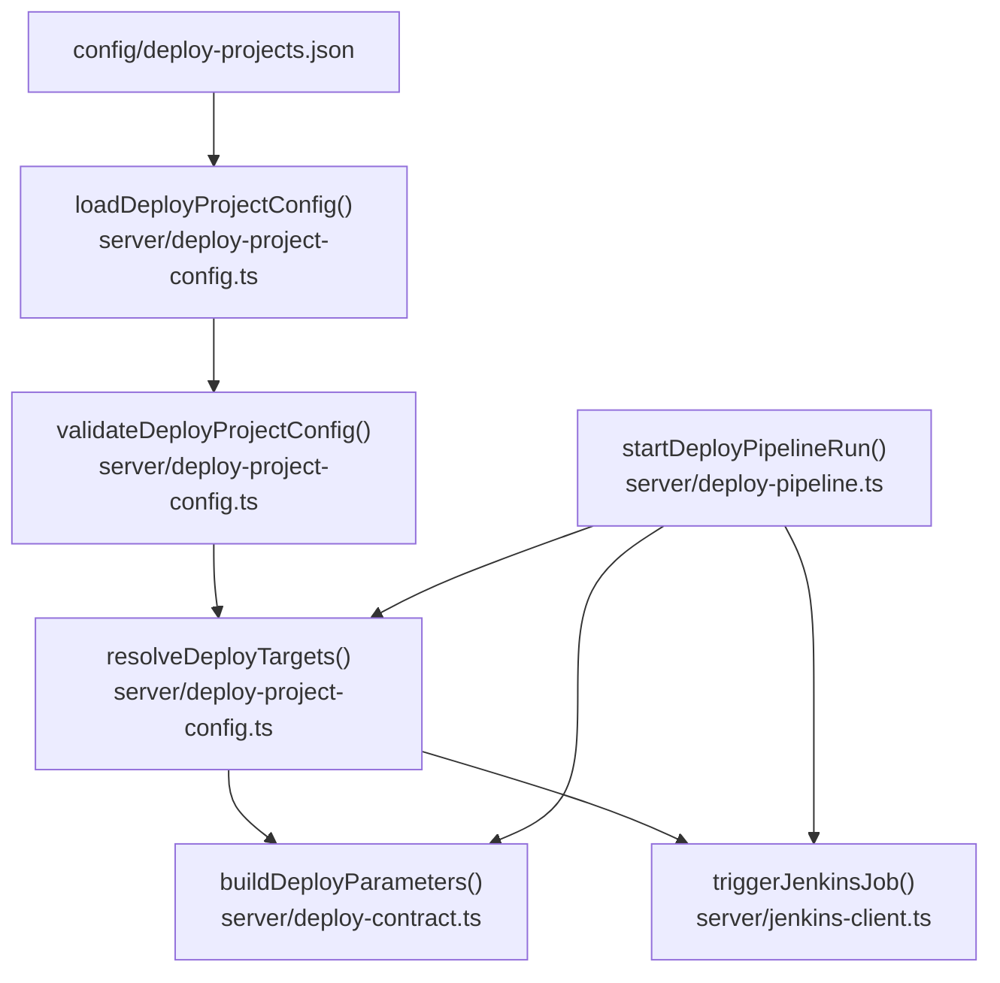
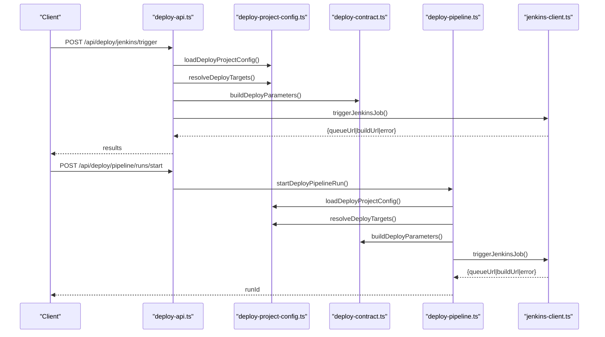
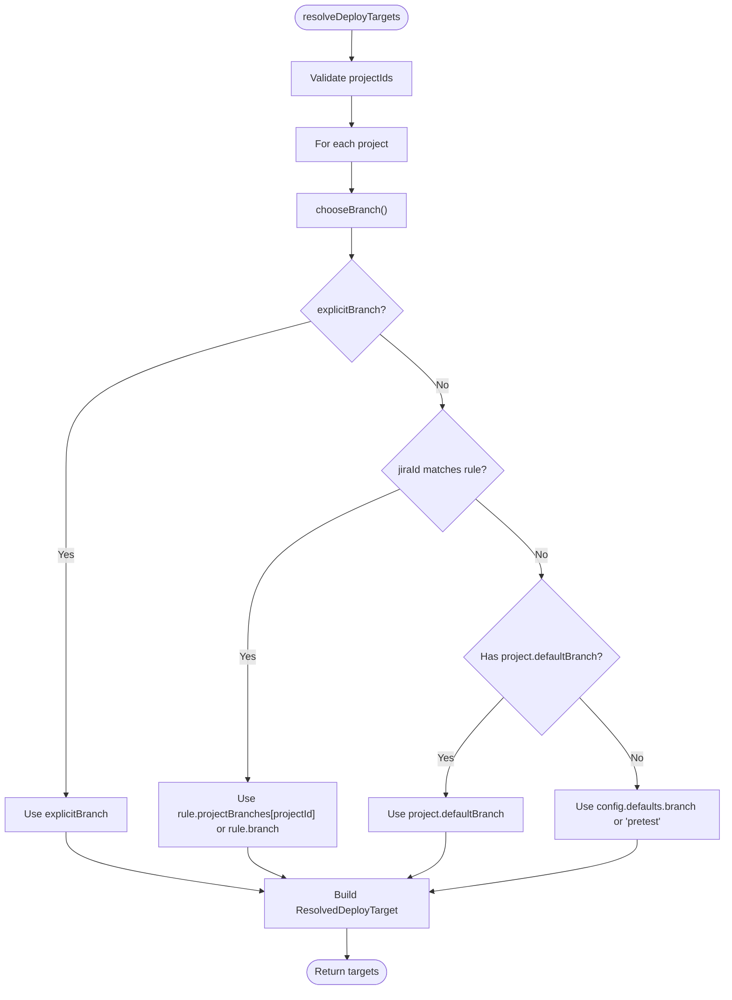
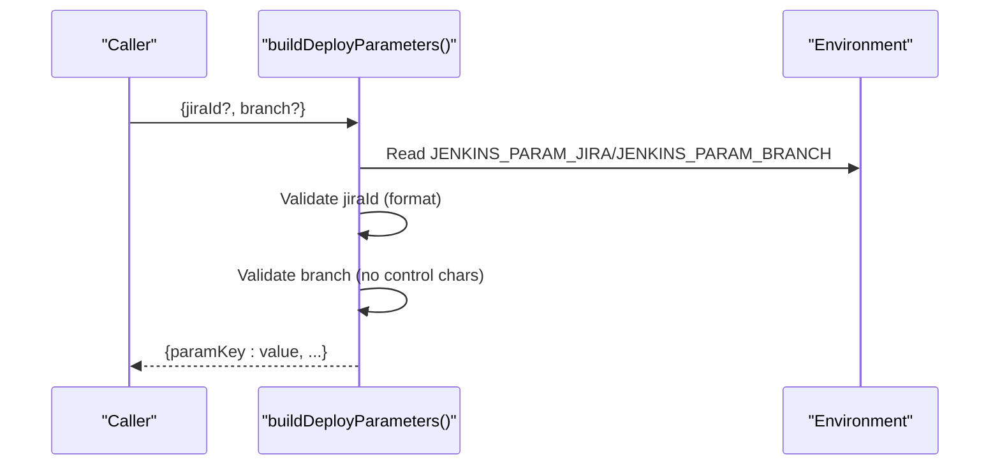
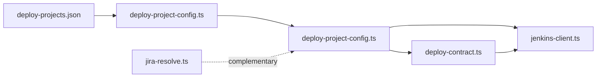

# Project Configuration

<cite>
**Referenced Files in This Document**
- [deploy-projects.json](file://config/deploy-projects.json)
- [deploy-project-config.ts](file://server/deploy-project-config.ts)
- [deploy-contract.ts](file://server/deploy-contract.ts)
- [deploy-pipeline.ts](file://server/deploy-pipeline.ts)
- [deploy-api.ts](file://server/deploy-api.ts)
- [jenkins-client.ts](file://server/jenkins-client.ts)
- [jira-resolve.ts](file://server/jira-resolve.ts)
- [jira-rest.ts](file://server/jira-rest.ts)
- [deploy-project-config.test.ts](file://test/server/deploy-project-config.test.ts)
</cite>

## Table of Contents
1. [Introduction](#introduction)
2. [Project Structure](#project-structure)
3. [Core Components](#core-components)
4. [Architecture Overview](#architecture-overview)
5. [Detailed Component Analysis](#detailed-component-analysis)
6. [Dependency Analysis](#dependency-analysis)
7. [Performance Considerations](#performance-considerations)
8. [Troubleshooting Guide](#troubleshooting-guide)
9. [Conclusion](#conclusion)
10. [Appendices](#appendices)

## Introduction
This document explains the deployment project configuration system used by the backend service to manage Jenkins job triggers and parameter binding. It covers:
- The deploy-projects.json structure and semantics
- How configuration is loaded and validated
- Target resolution mapping project IDs to Jenkins jobs and branches
- Parameter binding for JIRA ID and branch names
- Configuration file format, required fields, and optional settings
- Examples of common patterns, multi-environment setups, and parameter inheritance
- Validation errors, default value handling, and troubleshooting

## Project Structure
The configuration system centers around a JSON file and several TypeScript modules:
- config/deploy-projects.json: Central configuration file containing defaults, project definitions, and JIRA branch rules
- server/deploy-project-config.ts: Loads, validates, and resolves configuration into runtime targets
- server/deploy-contract.ts: Validates and builds Jenkins parameters and environment-based configuration
- server/deploy-pipeline.ts: Orchestrates multi-project deployments and triggers Jenkins jobs
- server/deploy-api.ts: Exposes HTTP endpoints to trigger jobs and start pipeline runs
- server/jenkins-client.ts: Triggers Jenkins jobs and polls build completion
- server/jira-resolve.ts: Resolves Jira issues to suggested job paths (complementary to branch rules)
- server/jira-rest.ts: Provides Jira authentication and search utilities
- test/server/deploy-project-config.test.ts: Unit tests validating configuration behavior

**Diagram sources**
- [deploy-projects.json:1-78](file://config/deploy-projects.json#L1-L78)
- [deploy-project-config.ts:96-174](file://server/deploy-project-config.ts#L96-L174)
- [deploy-contract.ts:91-120](file://server/deploy-contract.ts#L91-L120)
- [deploy-pipeline.ts:225-418](file://server/deploy-pipeline.ts#L225-L418)
- [jenkins-client.ts:89-142](file://server/jenkins-client.ts#L89-L142)

**Section sources**
- [deploy-projects.json:1-78](file://config/deploy-projects.json#L1-L78)
- [deploy-project-config.ts:1-237](file://server/deploy-project-config.ts#L1-L237)
- [deploy-contract.ts:1-169](file://server/deploy-contract.ts#L1-L169)
- [deploy-pipeline.ts:1-419](file://server/deploy-pipeline.ts#L1-L419)
- [deploy-api.ts:1330-1404](file://server/deploy-api.ts#L1330-L1404)

## Core Components
- Configuration model
  - defaults: global defaults for branch, Jenkins base URL, and parameter names
  - projects: keyed by project ID with label, Jenkins job path, and optional default branch
  - jiraBranchRules: rules to map JIRA IDs to project-specific or generic branches
- Runtime target model
  - ResolvedDeployTarget: includes project metadata, Jenkins base URL, job path segments, resolved branch, and parameter names

Key behaviors:
- Defaults are merged from config and environment
- Project IDs are validated and sanitized
- Job paths are split into segments and validated
- Branch selection follows explicit branch, JIRA rules, project default, or global default
- Parameter names are validated and can be overridden per project via defaults

**Section sources**
- [deploy-project-config.ts:32-57](file://server/deploy-project-config.ts#L32-L57)
- [deploy-project-config.ts:96-174](file://server/deploy-project-config.ts#L96-L174)
- [deploy-project-config.ts:212-236](file://server/deploy-project-config.ts#L212-L236)

## Architecture Overview
The configuration system integrates with the deployment API and pipeline orchestrator to trigger Jenkins jobs with computed parameters.

**Diagram sources**
- [deploy-api.ts:1330-1404](file://server/deploy-api.ts#L1330-L1404)
- [deploy-pipeline.ts:225-418](file://server/deploy-pipeline.ts#L225-L418)
- [deploy-project-config.ts:176-180](file://server/deploy-project-config.ts#L176-L180)
- [deploy-project-config.ts:212-236](file://server/deploy-project-config.ts#L212-L236)
- [deploy-contract.ts:91-120](file://server/deploy-contract.ts#L91-L120)
- [jenkins-client.ts:89-142](file://server/jenkins-client.ts#L89-L142)

## Detailed Component Analysis

### Configuration File Format: deploy-projects.json
- defaults
  - branch: default branch name used when no explicit branch is provided
  - jenkinsBaseUrl: default Jenkins base URL for projects that do not override it
  - jiraParamName: environment variable name for the JIRA parameter key
  - branchParamName: environment variable name for the branch parameter key
- projects
  - id: project identifier (validated against a strict pattern)
  - label: human-readable label for UI
  - jobPath: Jenkins job path segments separated by forward slashes
  - defaultBranch: optional project-specific default branch
- jiraBranchRules
  - pattern: regular expression to match JIRA IDs
  - branch: optional generic branch for matched JIRA IDs
  - projectBranches: mapping of project IDs to branch names for matched JIRA IDs

Validation rules:
- defaults must be an object; missing fields fall back to safe defaults
- projects must be an object; each project must define jobPath and jenkinsBaseUrl
- jobPath segments must be non-empty and free of unsafe characters
- parameter names must match a strict identifier-like pattern
- JIRA branch rules require a pattern; projectBranches must map valid project IDs to branch names

**Section sources**
- [deploy-projects.json:1-78](file://config/deploy-projects.json#L1-L78)
- [deploy-project-config.ts:96-174](file://server/deploy-project-config.ts#L96-L174)

### Configuration Loading and Validation
- loadDeployProjectConfig reads the JSON file and delegates to validateDeployProjectConfig
- validateDeployProjectConfig performs:
  - Type checks and defaulting for defaults
  - Project ID validation and sanitization
  - Job path parsing and safety checks
  - Parameter name validation
  - JIRA branch rule parsing and regex compilation
- Throws DeployContractError with appropriate messages for invalid inputs

**Section sources**
- [deploy-project-config.ts:176-180](file://server/deploy-project-config.ts#L176-L180)
- [deploy-project-config.ts:96-174](file://server/deploy-project-config.ts#L96-L174)

### Target Resolution System
- resolveDeployTargets takes a list of project IDs and optional JIRA ID and explicit branch
- For each project:
  - Validates the project ID
  - Retrieves project definition from config
  - Computes branch using the precedence:
    - explicitBranch (if provided)
    - JIRA rule match for project-specific branch, otherwise generic branch
    - project.defaultBranch
    - config.defaults.branch
  - Produces ResolvedDeployTarget with:
    - projectId, label, jenkinsBaseUrl, jobSegments, branch, jiraParamName, branchParamName

**Diagram sources**
- [deploy-project-config.ts:212-236](file://server/deploy-project-config.ts#L212-L236)
- [deploy-project-config.ts:191-210](file://server/deploy-project-config.ts#L191-L210)

**Section sources**
- [deploy-project-config.ts:212-236](file://server/deploy-project-config.ts#L212-L236)
- [deploy-project-config.test.ts:50-103](file://test/server/deploy-project-config.test.ts#L50-L103)

### Parameter Binding
- buildDeployParameters constructs Jenkins parameters from:
  - jiraId: validated as a JIRA issue key format
  - branch: validated for safety
  - Parameter keys are taken from environment variables JENKINS_PARAM_JIRA and JENKINS_PARAM_BRANCH (with defaults)
- The pipeline and API use these parameters to trigger jobs

**Diagram sources**
- [deploy-contract.ts:91-120](file://server/deploy-contract.ts#L91-L120)

**Section sources**
- [deploy-contract.ts:91-120](file://server/deploy-contract.ts#L91-L120)

### Multi-Environment and Parameter Inheritance
- Environment overrides:
  - Jenkins base URL can be overridden per project
  - Parameter names can be customized globally via environment variables
- Inheritance:
  - Projects inherit defaults for branch and parameter names
  - Projects can override jenkinsBaseUrl and defaultBranch independently

**Section sources**
- [deploy-project-config.ts:126-139](file://server/deploy-project-config.ts#L126-L139)
- [deploy-contract.ts:95-99](file://server/deploy-contract.ts#L95-L99)

### API and Pipeline Integration
- API endpoints:
  - POST /api/deploy/jenkins/trigger: resolves targets and triggers Jenkins jobs
  - POST /api/deploy/pipeline/runs/start: starts a server-side orchestrated pipeline
- Pipeline orchestrator:
  - Loads config, resolves targets, builds parameters, triggers jobs, polls completion, and updates run state

**Section sources**
- [deploy-api.ts:1330-1404](file://server/deploy-api.ts#L1330-L1404)
- [deploy-api.ts:1440-1461](file://server/deploy-api.ts#L1440-L1461)
- [deploy-pipeline.ts:225-418](file://server/deploy-pipeline.ts#L225-L418)

## Dependency Analysis
The configuration system depends on:
- deploy-project-config.ts for loading, validating, and resolving targets
- deploy-contract.ts for parameter validation and environment-driven defaults
- jenkins-client.ts for triggering jobs and polling build status
- jira-resolve.ts for resolving Jira issues to job paths (complementary to branch rules)

**Diagram sources**
- [deploy-projects.json:1-78](file://config/deploy-projects.json#L1-L78)
- [deploy-project-config.ts:176-180](file://server/deploy-project-config.ts#L176-L180)
- [deploy-contract.ts:91-120](file://server/deploy-contract.ts#L91-L120)
- [jenkins-client.ts:89-142](file://server/jenkins-client.ts#L89-L142)
- [jira-resolve.ts:47-129](file://server/jira-resolve.ts#L47-L129)

**Section sources**
- [deploy-project-config.ts:1-237](file://server/deploy-project-config.ts#L1-L237)
- [deploy-contract.ts:1-169](file://server/deploy-contract.ts#L1-L169)
- [jenkins-client.ts:1-191](file://server/jenkins-client.ts#L1-L191)
- [jira-resolve.ts:1-130](file://server/jira-resolve.ts#L1-L130)

## Performance Considerations
- Configuration is loaded once per operation in the API and pipeline; caching is not implemented at this layer
- Branch resolution is O(R) for number of JIRA rules; typical rule counts are small
- Parameter building is linear in the number of parameters
- Jenkins polling timeouts are configurable and bounded

[No sources needed since this section provides general guidance]

## Troubleshooting Guide
Common validation errors and remedies:
- Invalid project id
  - Cause: project ID does not match allowed pattern
  - Fix: Use only letters, digits, underscore, dot, hyphen; remove whitespace
  - Reference: [deploy-project-config.ts:65-71](file://server/deploy-project-config.ts#L65-L71)
- Missing jobPath
  - Cause: project definition lacks jobPath
  - Fix: Add a non-empty jobPath
  - Reference: [deploy-project-config.ts:122-125](file://server/deploy-project-config.ts#L122-L125)
- Unsafe jobPath
  - Cause: empty segments or control characters
  - Fix: Remove special characters and ensure segments are non-empty
  - Reference: [deploy-project-config.ts:73-87](file://server/deploy-project-config.ts#L73-L87)
- Missing jenkinsBaseUrl
  - Cause: project or global base URL not provided
  - Fix: Set jenkinsBaseUrl either globally or per project
  - Reference: [deploy-project-config.ts:126-132](file://server/deploy-project-config.ts#L126-L132)
- Invalid parameter names
  - Cause: parameter names do not match identifier pattern
  - Fix: Use names starting with letter or underscore, followed by letters/digits/underscore/dot/hyphen
  - Reference: [deploy-project-config.ts:89-94](file://server/deploy-project-config.ts#L89-L94)
- Invalid JIRA ID format
  - Cause: jiraId does not match expected pattern
  - Fix: Provide a valid JIRA issue key
  - Reference: [deploy-contract.ts:105-107](file://server/deploy-contract.ts#L105-L107)
- Invalid branch name
  - Cause: branch contains control characters
  - Fix: Remove control characters and use a valid branch name
  - Reference: [deploy-contract.ts:113-115](file://server/deploy-contract.ts#L113-L115)
- Jenkins credentials not configured
  - Cause: missing environment variables for Jenkins
  - Fix: Set JENKINS_URL, JENKINS_USER/JENKINS_USERNAME, JENKINS_TOKEN
  - Reference: [deploy-contract.ts:33-57](file://server/deploy-contract.ts#L33-L57)

Default value handling:
- defaults.branch defaults to "pretest"
- defaults.jenkinsBaseUrl is optional globally but required per project
- defaults.jiraParamName and defaults.branchParamName default to "JIRA_ID" and "BRANCH_NAME"
- Parameter names can be overridden via environment variables JENKINS_PARAM_JIRA and JENKINS_PARAM_BRANCH

**Section sources**
- [deploy-project-config.ts:96-174](file://server/deploy-project-config.ts#L96-L174)
- [deploy-contract.ts:91-120](file://server/deploy-contract.ts#L91-L120)
- [deploy-contract.ts:33-57](file://server/deploy-contract.ts#L33-L57)

## Conclusion
The deployment project configuration system provides a robust, validated mechanism to map project IDs to Jenkins jobs and branches, with flexible parameter binding and environment-driven customization. Its modular design separates concerns between configuration loading/validation, target resolution, parameter construction, and job triggering, enabling reliable multi-project deployments and pipeline orchestration.

[No sources needed since this section summarizes without analyzing specific files]

## Appendices

### Example Patterns and Scenarios
- Single project deployment with explicit branch
  - Provide projectIds with explicitBranch
  - Reference: [deploy-project-config.test.ts:50-79](file://test/server/deploy-project-config.test.ts#L50-L79)
- JIRA-driven branch selection
  - Provide jiraId; branch selected by matching rule for the project
  - Reference: [deploy-project-config.test.ts:81-94](file://test/server/deploy-project-config.test.ts#L81-L94)
- Fallback branch resolution
  - If no JIRA rule applies, fallback to project default or global default
  - Reference: [deploy-project-config.test.ts:96-103](file://test/server/deploy-project-config.test.ts#L96-L103)

### Configuration File Reference
- defaults
  - branch: string; default branch name
  - jenkinsBaseUrl: string; default Jenkins base URL
  - jiraParamName: string; parameter key for JIRA ID
  - branchParamName: string; parameter key for branch
- projects
  - id: string; project identifier
  - label: string; display label
  - jobPath: string; Jenkins job path segments
  - defaultBranch: string; optional project default branch
- jiraBranchRules
  - pattern: string; regex to match JIRA IDs
  - branch: string; optional generic branch for matched JIRAs
  - projectBranches: object mapping project IDs to branch names

**Section sources**
- [deploy-projects.json:1-78](file://config/deploy-projects.json#L1-L78)
- [deploy-project-config.ts:32-41](file://server/deploy-project-config.ts#L32-L41)