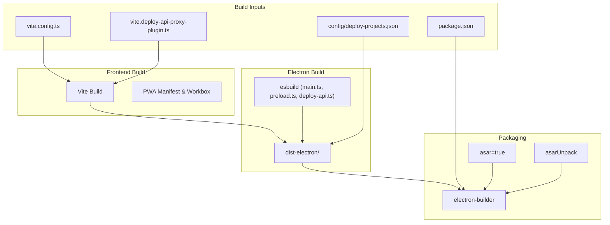
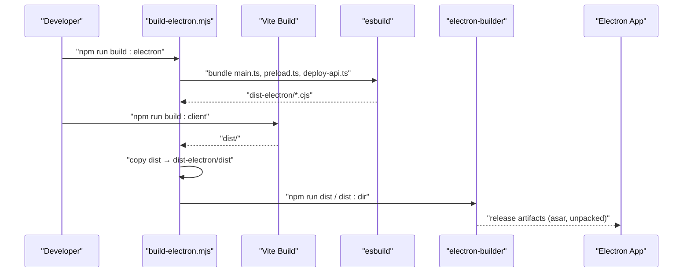
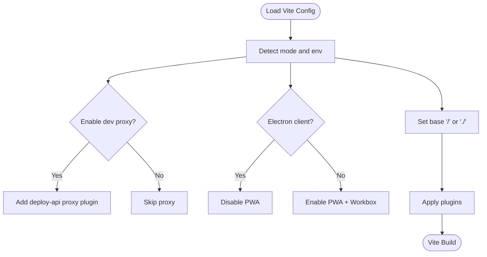
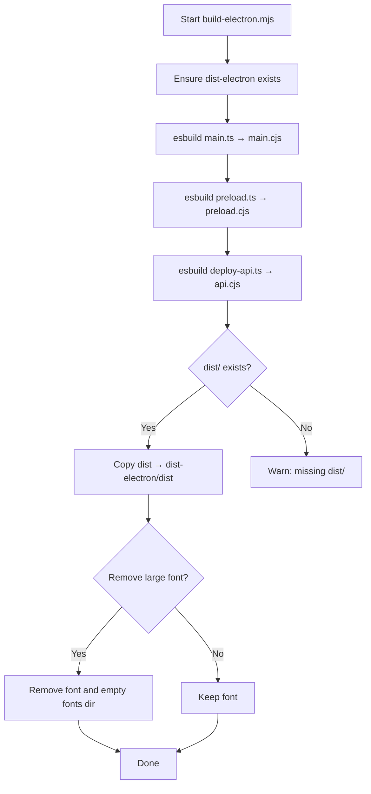
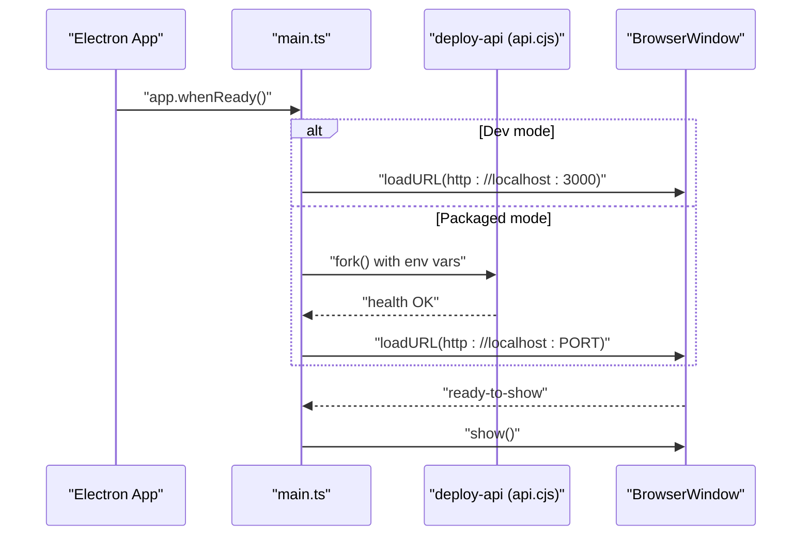
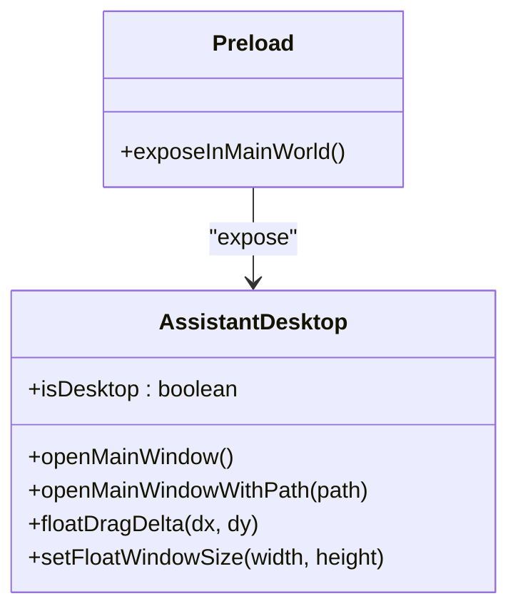
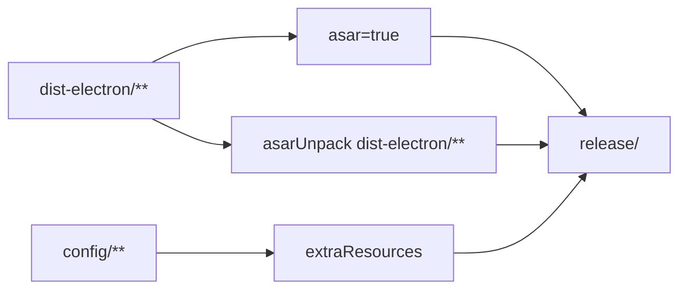
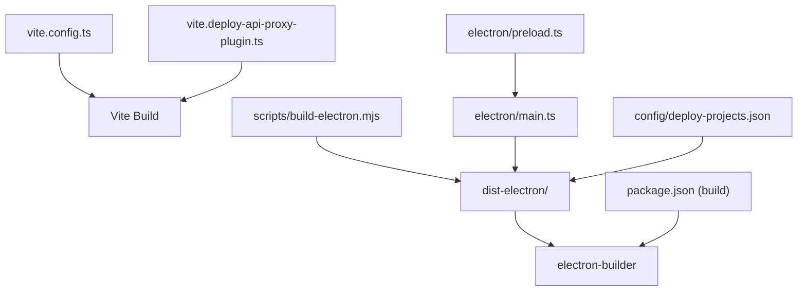
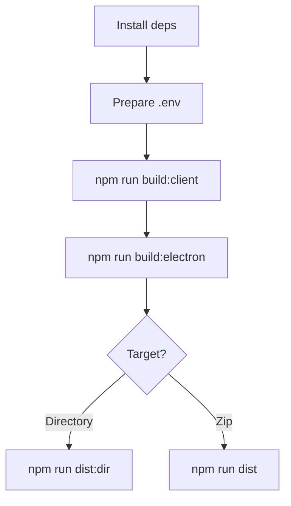

# Build and Packaging System

<cite>
**Referenced Files in This Document**
- [package.json](file://package.json)
- [vite.config.ts](file://vite.config.ts)
- [vite.deploy-api-proxy-plugin.ts](file://vite.deploy-api-proxy-plugin.ts)
- [scripts/build-electron.mjs](file://scripts/build-electron.mjs)
- [electron/main.ts](file://electron/main.ts)
- [electron/preload.ts](file://electron/preload.ts)
- [config/deploy-projects.json](file://config/deploy-projects.json)
- [metadata.json](file://metadata.json)
- [README.md](file://README.md)
</cite>

## Table of Contents
1. [Introduction](#introduction)
2. [Project Structure](#project-structure)
3. [Core Components](#core-components)
4. [Architecture Overview](#architecture-overview)
5. [Detailed Component Analysis](#detailed-component-analysis)
6. [Dependency Analysis](#dependency-analysis)
7. [Performance Considerations](#performance-considerations)
8. [Troubleshooting Guide](#troubleshooting-guide)
9. [Conclusion](#conclusion)
10. [Appendices](#appendices)

## Introduction
This document explains the Electron build and packaging system used to produce a desktop application that integrates a React + Vite frontend with an embedded Express-based backend. It covers the Vite configuration for frontend bundling, Electron-specific build targets, asset handling, packaging with asar archives and unpacked directories, resource path resolution, build scripts, environment variable handling, development versus production differences, hot reloading, debugging, distribution via electron-builder, and troubleshooting.

## Project Structure
The build system spans several areas:
- Frontend build via Vite with PWA support and a dynamic proxy plugin for the backend during development.
- Electron main process and preload script compiled with esbuild into dist-electron.
- A bundled Express server (deploy-api) packaged inside the app.
- Distribution configuration via electron-builder in package.json’s build section.

**Diagram sources**
- [vite.config.ts:1-111](file://vite.config.ts#L1-L111)
- [vite.deploy-api-proxy-plugin.ts:1-166](file://vite.deploy-api-proxy-plugin.ts#L1-L166)
- [scripts/build-electron.mjs:1-76](file://scripts/build-electron.mjs#L1-L76)
- [package.json:61-97](file://package.json#L61-L97)
- [config/deploy-projects.json:1-78](file://config/deploy-projects.json#L1-L78)

**Section sources**
- [package.json:1-99](file://package.json#L1-L99)
- [vite.config.ts:1-111](file://vite.config.ts#L1-L111)
- [scripts/build-electron.mjs:1-76](file://scripts/build-electron.mjs#L1-L76)
- [README.md:74-86](file://README.md#L74-L86)

## Core Components
- Vite configuration defines environment-aware behavior for development and Electron builds, including PWA, base path, and dynamic proxy for the backend.
- The Electron build script compiles main, preload, and the bundled Express server using esbuild into dist-electron.
- Electron main process manages windows, loads the frontend, starts the bundled backend, and resolves resources correctly in packaged mode.
- electron-builder configuration controls asar packaging, unpacked assets, extra resources, and platform targets.

Key responsibilities:
- Vite: frontend bundling, dev proxy, PWA caching, base path selection.
- esbuild: Electron main/preload/backend compilation to CJS.
- Electron main: window lifecycle, backend startup, resource path resolution, IPC.
- electron-builder: packaging, asar, extra resources, platform targets.

**Section sources**
- [vite.config.ts:8-111](file://vite.config.ts#L8-L111)
- [scripts/build-electron.mjs:17-76](file://scripts/build-electron.mjs#L17-L76)
- [electron/main.ts:16-434](file://electron/main.ts#L16-L434)
- [package.json:61-97](file://package.json#L61-L97)

## Architecture Overview
The build pipeline produces a desktop app with:
- A Vite-built frontend distributed under dist-electron/dist.
- Electron main and preload compiled to CJS.
- An Express server compiled to CJS and placed under dist-electron.
- Packaging controlled by electron-builder with asar and selective unpacking.

**Diagram sources**
- [scripts/build-electron.mjs:26-55](file://scripts/build-electron.mjs#L26-L55)
- [vite.config.ts:18-19](file://vite.config.ts#L18-L19)
- [package.json:20-28](file://package.json#L20-L28)
- [package.json:61-97](file://package.json#L61-L97)

## Detailed Component Analysis

### Vite Configuration and Frontend Bundling
- Environment awareness:
  - Development vs Electron client mode toggles PWA behavior and base path.
  - Dynamic proxy for /api routes during development.
- PWA and Workbox:
  - Auto-update registration and runtime caching strategies differ for development and production.
  - Large font file excluded from PWA caching to reduce bundle size.
- Base path:
  - Uses relative base for Electron client to support file:// and asar virtual paths.
- HMR:
  - Controlled by an environment variable to disable flickering during agent edits.

**Diagram sources**
- [vite.config.ts:8-111](file://vite.config.ts#L8-L111)
- [vite.deploy-api-proxy-plugin.ts:151-166](file://vite.deploy-api-proxy-plugin.ts#L151-L166)

**Section sources**
- [vite.config.ts:8-111](file://vite.config.ts#L8-L111)
- [vite.deploy-api-proxy-plugin.ts:1-166](file://vite.deploy-api-proxy-plugin.ts#L1-L166)

### Electron Build Script (build-electron.mjs)
- Compiles:
  - Electron main process to CJS.
  - Preload script to CJS.
  - Bundled Express server to CJS.
- Copies Vite dist into dist-electron/dist for packaging.
- Removes a large bundled font to speed up asar/zip packaging unless explicitly kept.
- Ensures dist-electron exists before copying.

**Diagram sources**
- [scripts/build-electron.mjs:17-76](file://scripts/build-electron.mjs#L17-L76)

**Section sources**
- [scripts/build-electron.mjs:1-76](file://scripts/build-electron.mjs#L1-L76)

### Electron Main Process (main.ts)
- Window management:
  - Creates main and floating windows with preload scripts.
  - Loads either Vite dev server or bundled backend endpoint.
- Backend startup:
  - Starts the bundled Express server via Electron’s utilityProcess.fork.
  - Waits for health endpoint before continuing.
- Resource path resolution:
  - Correctly resolves dist-electron path inside asar vs unpacked path.
- IPC bridge:
  - Exposes assistantDesktop APIs to renderer via preload.

**Diagram sources**
- [electron/main.ts:16-434](file://electron/main.ts#L16-L434)

**Section sources**
- [electron/main.ts:16-434](file://electron/main.ts#L16-L434)

### Preload Bridge (preload.ts)
- Exposes a typed assistantDesktop API to the renderer:
  - Open main window.
  - Open main window with a specific path.
  - Drag and resize floating window via IPC.

**Diagram sources**
- [electron/preload.ts:1-21](file://electron/preload.ts#L1-L21)

**Section sources**
- [electron/preload.ts:1-21](file://electron/preload.ts#L1-L21)

### Packaging Workflow (electron-builder)
- Asar packaging enabled with selective unpacking for dist-electron so native binaries can run.
- Extra resources include config directory.
- Output directory configured under release.
- Platform-specific settings include macOS category and hardened runtime toggle.

**Diagram sources**
- [package.json:61-97](file://package.json#L61-L97)

**Section sources**
- [package.json:61-97](file://package.json#L61-L97)

### Development vs Production Differences
- Development:
  - Vite dev server runs on localhost; Electron connects to it.
  - Dynamic proxy forwards /api/* to deploy-api.
  - PWA enabled for development convenience.
- Production:
  - Electron loads bundled backend via utilityProcess.fork.
  - PWA disabled; base path set to relative for asar.
  - Asar packaging and selective unpacking for native modules.

**Section sources**
- [vite.config.ts:15-19](file://vite.config.ts#L15-L19)
- [electron/main.ts:16-434](file://electron/main.ts#L16-L434)

### Hot Reloading and Debugging
- HMR controlled by an environment variable to avoid flickering during agent edits.
- Development mode opens DevTools for the main window automatically.
- Floating window debug mode can be enabled via an environment variable to open DevTools specifically for the floating window.

**Section sources**
- [vite.config.ts:103-108](file://vite.config.ts#L103-L108)
- [electron/main.ts:287-292](file://electron/main.ts#L287-L292)
- [electron/main.ts:363-371](file://electron/main.ts#L363-L371)

### Distribution and Update Mechanisms
- Distribution commands:
  - dist: generates a zip artifact for macOS.
  - dist:dir: outputs a directory suitable for local testing.
- Update mechanism:
  - PWA auto-update is configured; runtime caching differs between development and production.

**Section sources**
- [package.json:26-28](file://package.json#L26-L28)
- [vite.config.ts:21-78](file://vite.config.ts#L21-L78)
- [README.md:74-86](file://README.md#L74-L86)

## Dependency Analysis
- Vite depends on plugins and environment variables to conditionally enable the proxy and PWA.
- esbuild compiles TypeScript sources to CJS with node target and excludes electron from main/preload bundles.
- Electron main depends on dist-electron layout and environment variables to locate the backend and resources.
- electron-builder depends on package.json build configuration for asar, unpacking, and extra resources.

**Diagram sources**
- [vite.config.ts:1-111](file://vite.config.ts#L1-L111)
- [vite.deploy-api-proxy-plugin.ts:1-166](file://vite.deploy-api-proxy-plugin.ts#L1-L166)
- [scripts/build-electron.mjs:1-76](file://scripts/build-electron.mjs#L1-L76)
- [electron/main.ts:16-434](file://electron/main.ts#L16-L434)
- [electron/preload.ts:1-21](file://electron/preload.ts#L1-L21)
- [package.json:61-97](file://package.json#L61-L97)
- [config/deploy-projects.json:1-78](file://config/deploy-projects.json#L1-L78)

**Section sources**
- [vite.config.ts:1-111](file://vite.config.ts#L1-L111)
- [scripts/build-electron.mjs:1-76](file://scripts/build-electron.mjs#L1-L76)
- [electron/main.ts:16-434](file://electron/main.ts#L16-L434)
- [package.json:61-97](file://package.json#L61-L97)

## Performance Considerations
- Font removal:
  - Large bundled font removed by default to accelerate asar/zip creation.
- PWA caching:
  - Runtime caching tuned differently for development and production.
  - Maximum file size increased for large assets.
- Base path:
  - Relative base for Electron client avoids unnecessary asset resolution overhead.
- esbuild:
  - Minification enabled for main and backend; disabled for preload to aid debugging.

**Section sources**
- [scripts/build-electron.mjs:57-73](file://scripts/build-electron.mjs#L57-L73)
- [vite.config.ts:55-78](file://vite.config.ts#L55-L78)
- [vite.config.ts:80-82](file://vite.config.ts#L80-L82)
- [scripts/build-electron.mjs:26-47](file://scripts/build-electron.mjs#L26-L47)

## Troubleshooting Guide
Common issues and resolutions:
- Missing dist/ before packaging:
  - Ensure the client is built with the Electron flag before running the Electron build script.
- Port conflicts for deploy-api:
  - The main process checks port availability and attempts to free it; ensure no lingering processes are occupying the port.
- Asar path resolution:
  - When packaged, dist-electron must be unpacked; the main process resolves the correct path using resourcesPath and asar.unpacked.
- PWA caching interfering with /api:
  - Development disables offline caching for /api; confirm environment variables are set appropriately.
- HMR flickering:
  - Disable HMR via environment variable to prevent flickering during agent edits.

**Section sources**
- [scripts/build-electron.mjs:49-55](file://scripts/build-electron.mjs#L49-L55)
- [electron/main.ts:112-148](file://electron/main.ts#L112-L148)
- [electron/main.ts:96-110](file://electron/main.ts#L96-L110)
- [vite.config.ts:60-76](file://vite.config.ts#L60-L76)
- [vite.config.ts:103-108](file://vite.config.ts#L103-L108)

## Conclusion
The build and packaging system combines Vite for the frontend, esbuild for Electron assets, and electron-builder for distribution. It supports development with hot reloading and a dynamic proxy, and production with asar packaging and selective unpacking. The design emphasizes fast packaging, correct resource resolution, and robust backend startup.

## Appendices

### Step-by-Step Build Instructions
- Install dependencies.
- Prepare environment variables (see project README).
- Build the client with the Electron flag.
- Build Electron assets (main, preload, backend).
- Package for distribution (dir or zip).

**Diagram sources**
- [package.json:19-28](file://package.json#L19-L28)
- [README.md:74-86](file://README.md#L74-L86)

**Section sources**
- [README.md:10-37](file://README.md#L10-L37)
- [package.json:19-28](file://package.json#L19-L28)
- [README.md:74-86](file://README.md#L74-L86)

### Environment Variables Reference
- Development and packaging:
  - ELECTRON: marks Electron client build.
  - ELECTRON_IS_DEV: enables Vite dev server connection.
  - ELECTRON_FLOAT_DEBUG: enables floating window debug mode.
  - ELECTRON_KEEP_BUNDLED_FONT: retains large font in dist-electron.
  - DISABLE_HMR: disables HMR to prevent flickering.
  - VITE_DISABLE_DEPLOY_PROXY: disables dev proxy.
  - DEPLOY_API_PORT: backend port hint for dev proxy.
  - DEPLOY_PROJECT_CONFIG_PATH: alternate config path for projects.

**Section sources**
- [vite.config.ts:15-19](file://vite.config.ts#L15-L19)
- [vite.config.ts:103-108](file://vite.config.ts#L103-L108)
- [scripts/build-electron.mjs:57-58](file://scripts/build-electron.mjs#L57-L58)
- [electron/main.ts:17](file://electron/main.ts#L17)
- [electron/main.ts:363-371](file://electron/main.ts#L363-L371)
- [vite.deploy-api-proxy-plugin.ts:43-55](file://vite.deploy-api-proxy-plugin.ts#L43-L55)
- [config/deploy-projects.json:1-78](file://config/deploy-projects.json#L1-L78)

### Packaging Details
- Asar:
  - Enabled globally; improves security and performance.
- Unpack:
  - dist-electron/** is unpacked to allow native modules to execute.
- Extra Resources:
  - config directory included at runtime.
- Output:
  - release directory; macOS targets include “dir” by default; zip generated via explicit command.

**Section sources**
- [package.json:81-84](file://package.json#L81-L84)
- [package.json:61-97](file://package.json#L61-L97)

### Metadata and Project Info
- Application metadata and project configuration are included for distribution and runtime use.

**Section sources**
- [metadata.json:1-6](file://metadata.json#L1-L6)
- [config/deploy-projects.json:1-78](file://config/deploy-projects.json#L1-L78)