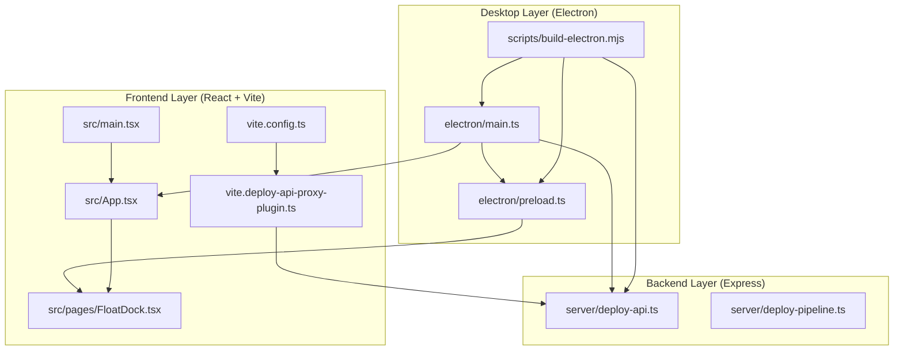
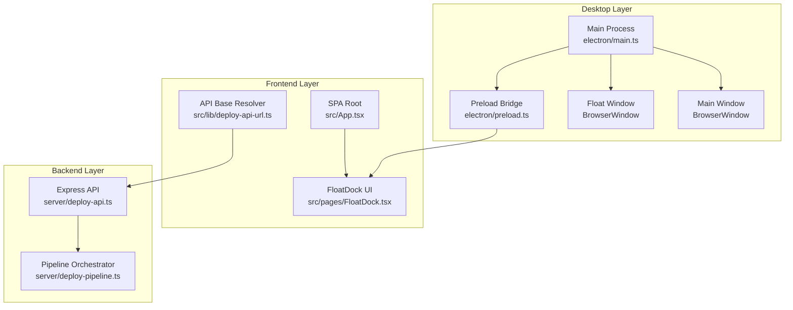
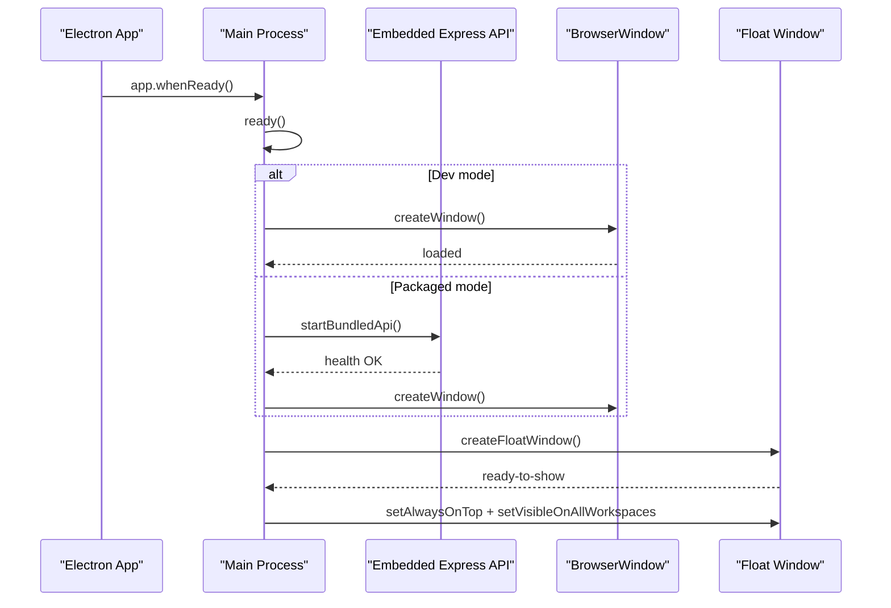
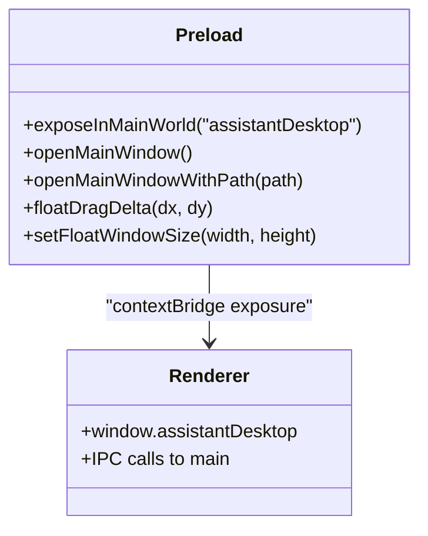
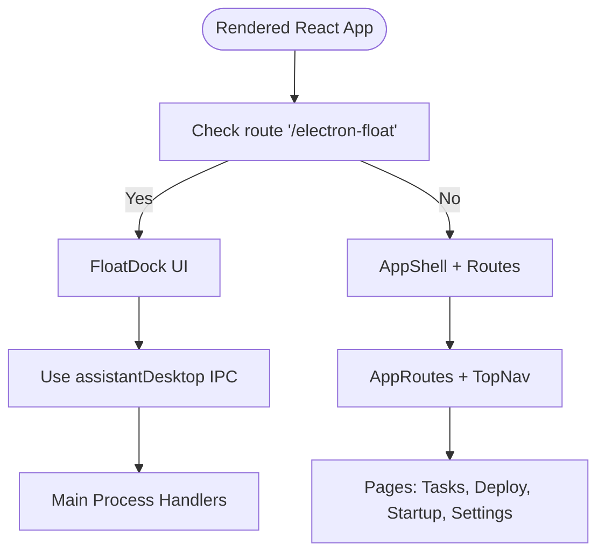
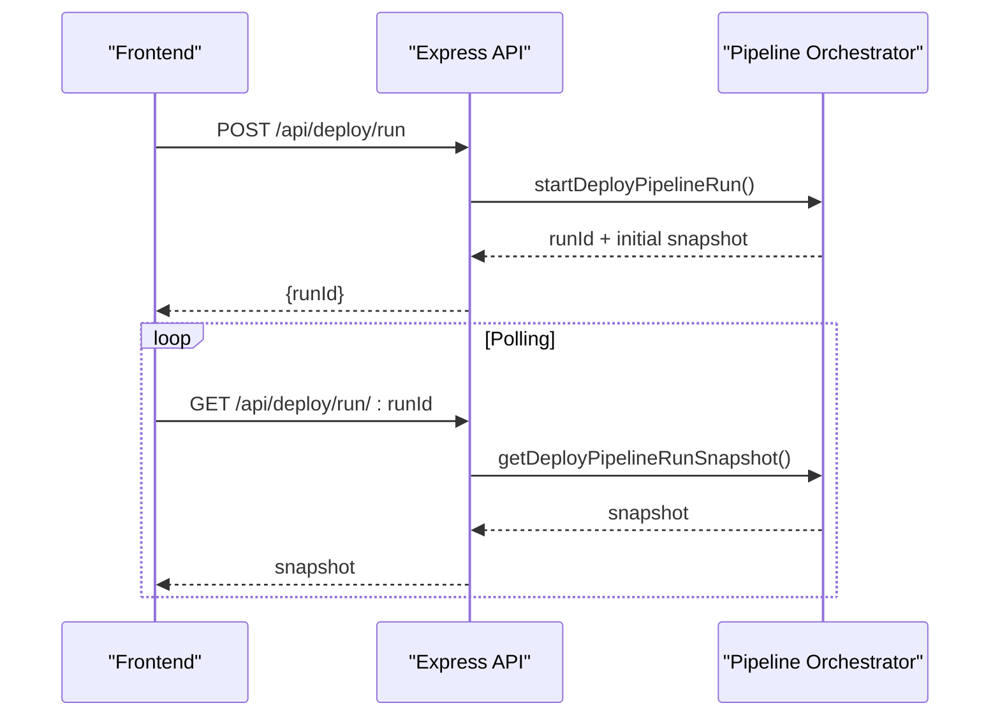
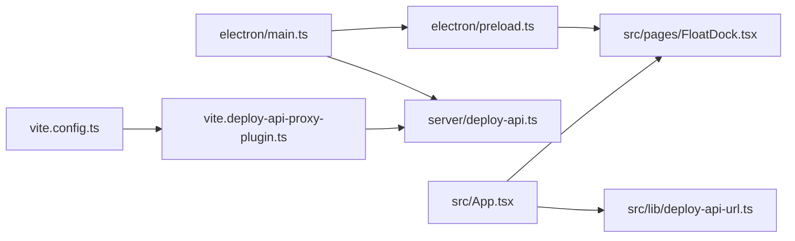
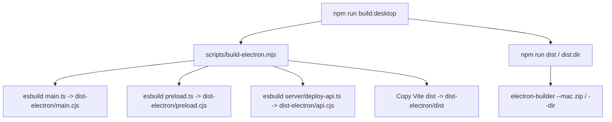

# Desktop Application Architecture

<cite>
**Referenced Files in This Document**
- [electron/main.ts](file://electron/main.ts)
- [electron/preload.ts](file://electron/preload.ts)
- [scripts/build-electron.mjs](file://scripts/build-electron.mjs)
- [package.json](file://package.json)
- [vite.config.ts](file://vite.config.ts)
- [vite.deploy-api-proxy-plugin.ts](file://vite.deploy-api-proxy-plugin.ts)
- [server/deploy-api.ts](file://server/deploy-api.ts)
- [server/deploy-pipeline.ts](file://server/deploy-pipeline.ts)
- [src/App.tsx](file://src/App.tsx)
- [src/main.tsx](file://src/main.tsx)
- [src/pages/FloatDock.tsx](file://src/pages/FloatDock.tsx)
- [src/lib/deploy-api-url.ts](file://src/lib/deploy-api-url.ts)
- [README.md](file://README.md)
</cite>

## Table of Contents
1. [Introduction](#introduction)
2. [Project Structure](#project-structure)
3. [Core Components](#core-components)
4. [Architecture Overview](#architecture-overview)
5. [Detailed Component Analysis](#detailed-component-analysis)
6. [Dependency Analysis](#dependency-analysis)
7. [Performance Considerations](#performance-considerations)
8. [Security Considerations](#security-considerations)
9. [Build and Distribution](#build-and-distribution)
10. [Troubleshooting Guide](#troubleshooting-guide)
11. [Conclusion](#conclusion)

## Introduction
This document describes the desktop application architecture built with Electron. It explains how the main process and renderer process are separated, how Electron enables cross-platform desktop functionality, and how the desktop layer coordinates the frontend React application with the backend Express service. It also covers window management, system tray integration, preload security, build and distribution, and performance and security considerations.

## Project Structure
The repository is organized into distinct layers:
- Electron desktop layer: main process, preload bridge, and build pipeline
- Frontend React application: SPA served by Vite
- Backend Express service: deployment orchestration and integrations
- Build and packaging: esbuild for Electron assets and electron-builder for distribution

**Diagram sources**
- [electron/main.ts:1-434](file://electron/main.ts#L1-L434)
- [electron/preload.ts:1-21](file://electron/preload.ts#L1-L21)
- [scripts/build-electron.mjs:1-76](file://scripts/build-electron.mjs#L1-L76)
- [src/main.tsx:1-11](file://src/main.tsx#L1-L11)
- [src/App.tsx:1-136](file://src/App.tsx#L1-L136)
- [src/pages/FloatDock.tsx:1-638](file://src/pages/FloatDock.tsx#L1-L638)
- [vite.config.ts:1-111](file://vite.config.ts#L1-L111)
- [vite.deploy-api-proxy-plugin.ts:1-166](file://vite.deploy-api-proxy-plugin.ts#L1-L166)
- [server/deploy-api.ts:1-200](file://server/deploy-api.ts#L1-L200)
- [server/deploy-pipeline.ts:1-200](file://server/deploy-pipeline.ts#L1-L200)

**Section sources**
- [README.md:1-91](file://README.md#L1-L91)
- [package.json:1-99](file://package.json#L1-L99)

## Core Components
- Electron main process orchestrates application lifecycle, creates BrowserWindows, manages IPC, and starts/stops the embedded Express API service.
- Preload script exposes a controlled API surface to the renderer via contextBridge and handles IPC calls from the frontend.
- Frontend React application renders the SPA and integrates with the desktop layer via the exposed assistantDesktop API.
- Backend Express service provides deployment orchestration, Jenkins/Jira integrations, and local model skills.
- Build pipeline compiles Electron assets and packages the desktop app.

**Section sources**
- [electron/main.ts:1-434](file://electron/main.ts#L1-L434)
- [electron/preload.ts:1-21](file://electron/preload.ts#L1-L21)
- [src/App.tsx:1-136](file://src/App.tsx#L1-L136)
- [server/deploy-api.ts:1-200](file://server/deploy-api.ts#L1-L200)

## Architecture Overview
The desktop architecture separates concerns across three layers:
- Desktop layer (Electron): main process controls windows, IPC, and the embedded API service; preload bridges secure calls to the renderer.
- Frontend layer (React + Vite): SPA routes, UI components, and API URL resolution; development uses a dynamic proxy to the backend.
- Backend layer (Express): deployment orchestration, Jenkins/Jira integrations, and local skills.

**Diagram sources**
- [electron/main.ts:259-434](file://electron/main.ts#L259-L434)
- [electron/preload.ts:1-21](file://electron/preload.ts#L1-L21)
- [src/App.tsx:110-136](file://src/App.tsx#L110-L136)
- [src/pages/FloatDock.tsx:111-638](file://src/pages/FloatDock.tsx#L111-L638)
- [src/lib/deploy-api-url.ts:1-28](file://src/lib/deploy-api-url.ts#L1-L28)
- [server/deploy-api.ts:1-200](file://server/deploy-api.ts#L1-L200)
- [server/deploy-pipeline.ts:1-200](file://server/deploy-pipeline.ts#L1-L200)

## Detailed Component Analysis

### Electron Main Process
Responsibilities:
- Application lifecycle: app.whenReady, window-all-closed, activate, before-quit
- Window management: main window and floating window creation, sizing, positioning, always-on-top behavior, and context menu
- IPC setup: handlers for opening main window, resizing float window, dragging float window
- Embedded API coordination: port detection, process cleanup, health checks, and graceful shutdown
- Cross-platform optimizations: always-on-top and visibility on fullscreen on macOS; transparent, frameless float window

**Diagram sources**
- [electron/main.ts:389-434](file://electron/main.ts#L389-L434)
- [electron/main.ts:180-257](file://electron/main.ts#L180-L257)
- [electron/main.ts:259-387](file://electron/main.ts#L259-L387)

Key behaviors:
- Port management: ensures port is free, kills conflicting processes, waits for health endpoint
- Window creation: sets preload path, contextIsolation, denies window.open, opens DevTools in dev
- Floating window: transparent, frameless, always-on-top, context menu, ready-to-show hooks
- IPC handlers: open main window, open main with path, resize float window, drag float window

**Section sources**
- [electron/main.ts:16-434](file://electron/main.ts#L16-L434)

### Preload Script and Security Model
Responsibilities:
- Exposes a minimal, typed API surface to the renderer via contextBridge
- Provides safe IPC wrappers for opening windows and moving/resizing the float window
- Maintains strict separation between main and renderer contexts

**Diagram sources**
- [electron/preload.ts:1-21](file://electron/preload.ts#L1-L21)

Security considerations:
- contextIsolation enabled
- nodeIntegration disabled
- sandbox behavior configured
- preload path resolved from dist-electron root

**Section sources**
- [electron/preload.ts:1-21](file://electron/preload.ts#L1-L21)
- [electron/main.ts:268-297](file://electron/main.ts#L268-L297)
- [electron/main.ts:322-387](file://electron/main.ts#L322-L387)

### Frontend React Integration
Responsibilities:
- SPA routing and navigation
- FloatDock page for the floating window
- API base URL resolution for backend endpoints
- Renderer-side IPC usage via assistantDesktop

**Diagram sources**
- [src/App.tsx:110-136](file://src/App.tsx#L110-L136)
- [src/pages/FloatDock.tsx:111-638](file://src/pages/FloatDock.tsx#L111-L638)
- [src/lib/deploy-api-url.ts:1-28](file://src/lib/deploy-api-url.ts#L1-L28)

**Section sources**
- [src/App.tsx:1-136](file://src/App.tsx#L1-L136)
- [src/pages/FloatDock.tsx:1-638](file://src/pages/FloatDock.tsx#L1-L638)
- [src/lib/deploy-api-url.ts:1-28](file://src/lib/deploy-api-url.ts#L1-L28)

### Backend Express Service
Responsibilities:
- Deployment orchestration, Jenkins/Jira integrations, local skills and models
- Pipeline run tracking, event logging, and statistics
- Environment loading and project configuration

**Diagram sources**
- [server/deploy-api.ts:1-200](file://server/deploy-api.ts#L1-L200)
- [server/deploy-pipeline.ts:149-200](file://server/deploy-pipeline.ts#L149-L200)

**Section sources**
- [server/deploy-api.ts:1-200](file://server/deploy-api.ts#L1-L200)
- [server/deploy-pipeline.ts:1-200](file://server/deploy-pipeline.ts#L1-L200)

## Dependency Analysis
High-level dependencies:
- Desktop depends on Electron APIs and the embedded Express service
- Frontend depends on Vite for dev/prod builds and a dynamic proxy plugin for development
- Backend depends on Jenkins/Jira integrations and local model skills

**Diagram sources**
- [electron/main.ts:1-434](file://electron/main.ts#L1-L434)
- [electron/preload.ts:1-21](file://electron/preload.ts#L1-L21)
- [vite.config.ts:1-111](file://vite.config.ts#L1-L111)
- [vite.deploy-api-proxy-plugin.ts:1-166](file://vite.deploy-api-proxy-plugin.ts#L1-L166)
- [src/App.tsx:1-136](file://src/App.tsx#L1-L136)
- [src/pages/FloatDock.tsx:1-638](file://src/pages/FloatDock.tsx#L1-L638)
- [src/lib/deploy-api-url.ts:1-28](file://src/lib/deploy-api-url.ts#L1-L28)
- [server/deploy-api.ts:1-200](file://server/deploy-api.ts#L1-L200)

**Section sources**
- [package.json:1-99](file://package.json#L1-L99)

## Performance Considerations
- Minimize main process workload: delegate rendering to the renderer and keep IPC lightweight
- Use contextIsolation and preload to reduce attack surface and improve stability
- Avoid heavy synchronous operations in main process; defer to utility processes or background threads
- Optimize window sizing and always-on-top behavior to reduce redraw overhead
- In development, disable HMR selectively to prevent flickering during agent edits
- For production, consider disabling PWA features for Electron clients to reduce bundle size

[No sources needed since this section provides general guidance]

## Security Considerations
- Strict context isolation and disabled nodeIntegration in BrowserWindow webPreferences
- Preload exposes only necessary IPC methods via contextBridge
- Main process validates and sanitizes IPC payloads before applying window operations
- Embedded Express service runs on localhost with health checks and port conflict handling
- Cross-platform always-on-top and visibility settings are platform-aware to avoid unintended elevation

**Section sources**
- [electron/main.ts:268-297](file://electron/main.ts#L268-L297)
- [electron/main.ts:322-387](file://electron/main.ts#L322-L387)
- [electron/preload.ts:1-21](file://electron/preload.ts#L1-L21)

## Build and Distribution
Build pipeline:
- esbuild compiles main.ts, preload.ts, and deploy-api.ts to CJS outputs under dist-electron
- Vite build is copied into dist-electron/dist for packaged serving
- Optional font removal reduces asar/zip size for Electron builds
- electron-builder produces macOS zip archives and directory artifacts

**Diagram sources**
- [scripts/build-electron.mjs:1-76](file://scripts/build-electron.mjs#L1-L76)
- [package.json:20-28](file://package.json#L20-L28)

Development workflow:
- dev:desktop waits for both frontend and backend health endpoints before launching Electron
- Vite dev server serves the SPA; development proxy forwards /api/* to deploy-api

**Section sources**
- [package.json:9-30](file://package.json#L9-L30)
- [vite.config.ts:8-111](file://vite.config.ts#L8-L111)
- [vite.deploy-api-proxy-plugin.ts:1-166](file://vite.deploy-api-proxy-plugin.ts#L1-L166)

## Troubleshooting Guide
Common issues and remedies:
- Backend not reachable in development: ensure deploy-api is running and port is written to .deploy-api-port; verify Vite proxy reads the port dynamically
- Port conflicts: main process automatically detects and kills conflicting processes; verify port availability
- Health check failures: main process waits for /api/deploy/health; inspect stderr/stdout logs captured during startup
- Floating window not responding: ensure preload is loaded and assistantDesktop APIs are available; verify floatDebug mode for diagnostics

**Section sources**
- [electron/main.ts:180-257](file://electron/main.ts#L180-L257)
- [vite.deploy-api-proxy-plugin.ts:43-55](file://vite.deploy-api-proxy-plugin.ts#L43-L55)
- [src/pages/FloatDock.tsx:173-196](file://src/pages/FloatDock.tsx#L173-L196)

## Conclusion
The desktop application cleanly separates the Electron main process, React renderer, and Express backend. The main process manages windows, IPC, and the embedded API service, while the preload script enforces a secure bridge to the renderer. The frontend integrates tightly with the desktop layer via a small, focused API surface. The build pipeline and distribution toolchain support cross-platform packaging with performance and security best practices.