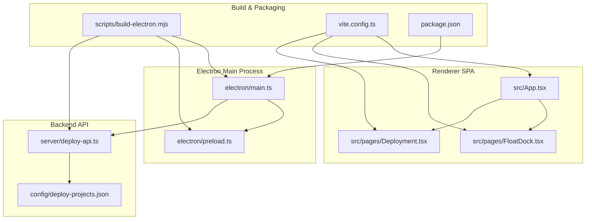
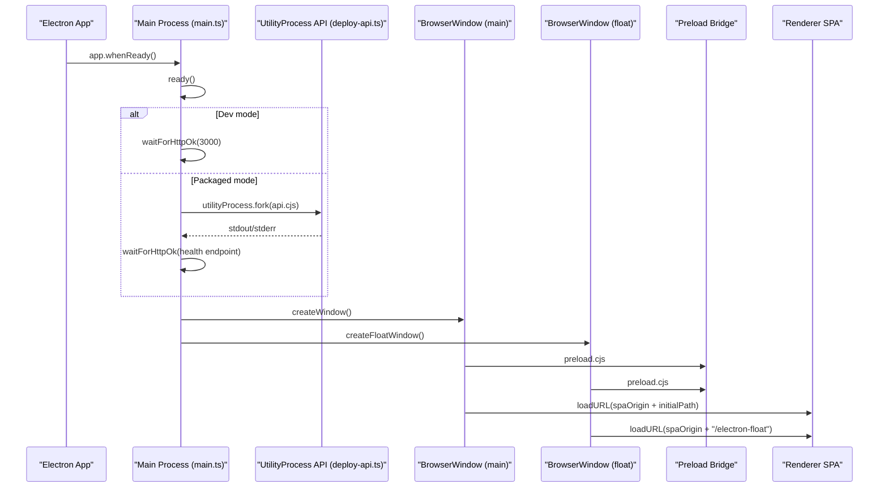
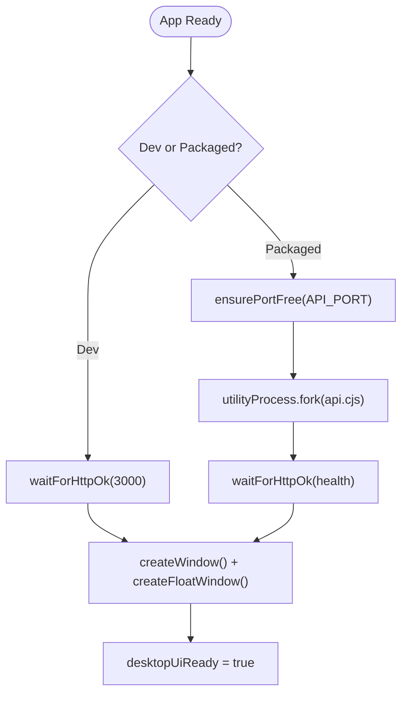
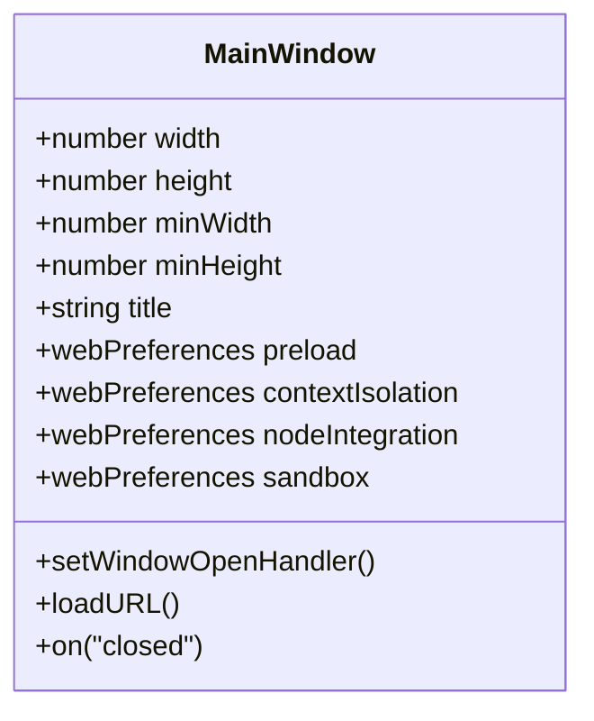
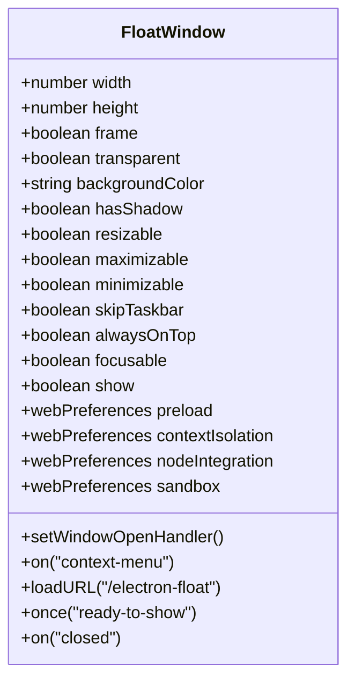
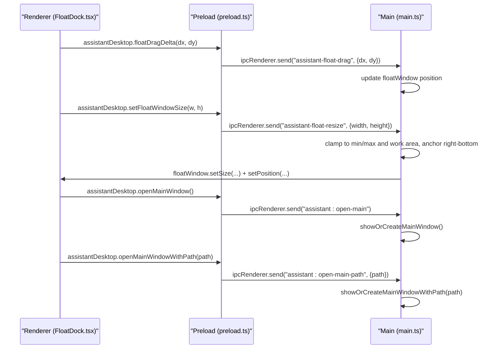
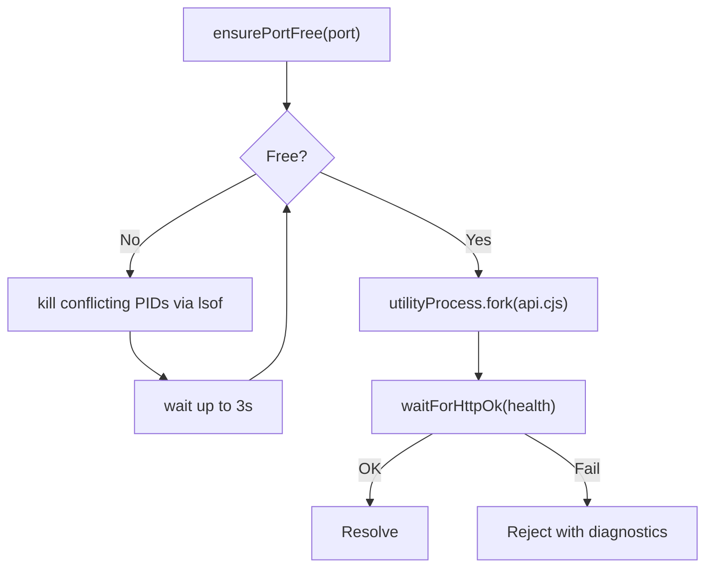
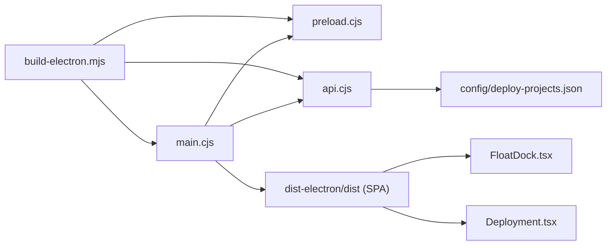

# Main Process Architecture

<cite>
**Referenced Files in This Document**
- [electron/main.ts](file://electron/main.ts)
- [electron/preload.ts](file://electron/preload.ts)
- [scripts/build-electron.mjs](file://scripts/build-electron.mjs)
- [vite.config.ts](file://vite.config.ts)
- [package.json](file://package.json)
- [server/deploy-api.ts](file://server/deploy-api.ts)
- [config/deploy-projects.json](file://config/deploy-projects.json)
- [src/App.tsx](file://src/App.tsx)
- [src/pages/FloatDock.tsx](file://src/pages/FloatDock.tsx)
- [src/pages/Deployment.tsx](file://src/pages/Deployment.tsx)
- [src/lib/float-command/float-deploy-payload.ts](file://src/lib/float-command/float-deploy-payload.ts)
</cite>

## Table of Contents
1. [Introduction](#introduction)
2. [Project Structure](#project-structure)
3. [Core Components](#core-components)
4. [Architecture Overview](#architecture-overview)
5. [Detailed Component Analysis](#detailed-component-analysis)
6. [Dependency Analysis](#dependency-analysis)
7. [Performance Considerations](#performance-considerations)
8. [Troubleshooting Guide](#troubleshooting-guide)
9. [Conclusion](#conclusion)
10. [Appendices](#appendices)

## Introduction
This document explains the Electron main process architecture for the Dottie-Assistant desktop application. It covers application lifecycle management, window creation and management, IPC communication for assistant interactions and window controls, automatic backend API service coordination, startup sequence, error handling, graceful shutdown, security posture, and cross-platform optimizations. Practical integration patterns and examples are included to help developers extend or debug the system.

## Project Structure
The desktop application is organized around Electron’s main process, a preload script, a renderer SPA, and a bundled Node.js API service. Build orchestration compiles and packages the main process, preload, and API into dist-electron for distribution.

**Diagram sources**
- [electron/main.ts:1-434](file://electron/main.ts#L1-L434)
- [electron/preload.ts:1-21](file://electron/preload.ts#L1-L21)
- [scripts/build-electron.mjs:1-76](file://scripts/build-electron.mjs#L1-L76)
- [vite.config.ts:1-111](file://vite.config.ts#L1-L111)
- [package.json:1-99](file://package.json#L1-L99)
- [server/deploy-api.ts:1-200](file://server/deploy-api.ts#L1-L200)
- [config/deploy-projects.json:1-78](file://config/deploy-projects.json#L1-L78)
- [src/App.tsx:1-136](file://src/App.tsx#L1-L136)
- [src/pages/FloatDock.tsx:1-638](file://src/pages/FloatDock.tsx#L1-L638)
- [src/pages/Deployment.tsx:1-200](file://src/pages/Deployment.tsx#L1-L200)

**Section sources**
- [electron/main.ts:1-434](file://electron/main.ts#L1-L434)
- [scripts/build-electron.mjs:1-76](file://scripts/build-electron.mjs#L1-L76)
- [vite.config.ts:1-111](file://vite.config.ts#L1-L111)
- [package.json:1-99](file://package.json#L1-L99)

## Core Components
- Electron main process orchestrates app lifecycle, creates BrowserWindows, manages IPC, coordinates the embedded API service, and handles graceful shutdown.
- Preload script exposes a controlled API surface to the renderer via contextBridge.
- Renderer SPA includes a floating dock page (/electron-float) and the main application routes.
- Backend API service is packaged and launched as a utility process, exposing health and deployment endpoints.

Key responsibilities:
- Application lifecycle: app.whenReady, window-all-closed, activate.
- Window management: main window and floating dock window creation, sizing, positioning, always-on-top, and platform-specific behaviors.
- IPC: assistant interactions, window management commands, and resize/drag operations.
- Automatic API coordination: port checking, process spawning with utilityProcess.fork, health monitoring, and diagnostics.
- Security: contextIsolation, preload exposure, and restricted Node.js integration.

**Section sources**
- [electron/main.ts:1-434](file://electron/main.ts#L1-L434)
- [electron/preload.ts:1-21](file://electron/preload.ts#L1-L21)
- [src/App.tsx:121-136](file://src/App.tsx#L121-L136)
- [src/pages/FloatDock.tsx:111-195](file://src/pages/FloatDock.tsx#L111-L195)

## Architecture Overview
The main process initializes the desktop UI, starts the backend API service, and exposes a minimal renderer API via preload. The floating dock window provides quick actions and communicates with the main process for drag and resize operations. The main window hosts the SPA and routes.

**Diagram sources**
- [electron/main.ts:389-406](file://electron/main.ts#L389-L406)
- [electron/main.ts:180-257](file://electron/main.ts#L180-L257)
- [electron/main.ts:259-297](file://electron/main.ts#L259-L297)
- [electron/main.ts:311-387](file://electron/main.ts#L311-L387)
- [server/deploy-api.ts:75-80](file://server/deploy-api.ts#L75-L80)

## Detailed Component Analysis

### Application Lifecycle and Startup Sequence
- Initialization: sets app name, declares window and API child references, and determines development vs packaged mode.
- Startup readiness: waits for Vite dev server or ensures/launches the bundled API service, then creates windows.
- Graceful shutdown: kills the API child process on before-quit.

**Diagram sources**
- [electron/main.ts:17-21](file://electron/main.ts#L17-L21)
- [electron/main.ts:389-406](file://electron/main.ts#L389-L406)
- [electron/main.ts:180-257](file://electron/main.ts#L180-L257)
- [electron/main.ts:259-297](file://electron/main.ts#L259-L297)
- [electron/main.ts:311-387](file://electron/main.ts#L311-L387)

**Section sources**
- [electron/main.ts:8-17](file://electron/main.ts#L8-L17)
- [electron/main.ts:389-406](file://electron/main.ts#L389-L406)
- [electron/main.ts:428-433](file://electron/main.ts#L428-L433)

### BrowserWindow Setup: Main Application Window
- Size and minimum constraints: fixed initial size with minimum bounds.
- Web preferences: preload path, contextIsolation enabled, Node.js integration disabled, sandbox disabled.
- External links: setWindowOpenHandler opens URLs externally and denies in-app popups.
- Dev mode: loads Vite dev server and optionally opens DevTools.

**Diagram sources**
- [electron/main.ts:259-297](file://electron/main.ts#L259-L297)

**Section sources**
- [electron/main.ts:259-297](file://electron/main.ts#L259-L297)

### BrowserWindow Setup: Floating Dock Window
- Transparent, no-frame, always-on-top, and hidden until ready-to-show.
- Positioned at bottom-right of primary display with a small fixed size.
- Platform-specific optimizations: macOS visibility on fullscreen and screen-saver layering; Windows uses screen-saver always-on-top.
- Context menu with open main window and quit actions.
- Loads /electron-float route and optionally opens DevTools in debug mode.

**Diagram sources**
- [electron/main.ts:311-387](file://electron/main.ts#L311-L387)

**Section sources**
- [electron/main.ts:299-309](file://electron/main.ts#L299-L309)
- [electron/main.ts:311-387](file://electron/main.ts#L311-L387)

### IPC Communication: Assistant Interactions and Window Controls
- Preload exposes a typed API surface to renderer:
  - Open main window and navigate to a path.
  - Drag and resize the floating dock window via IPC.
- Main process registers handlers for:
  - Opening main window or navigating to a path.
  - Resizing the floating dock window with bounds and anchoring logic.
  - Dragging the floating dock window with delta updates.

**Diagram sources**
- [electron/preload.ts:3-20](file://electron/preload.ts#L3-L20)
- [electron/main.ts:47-82](file://electron/main.ts#L47-L82)
- [electron/main.ts:23-45](file://electron/main.ts#L23-L45)

**Section sources**
- [electron/preload.ts:1-21](file://electron/preload.ts#L1-L21)
- [electron/main.ts:47-82](file://electron/main.ts#L47-L82)
- [src/pages/FloatDock.tsx:141-171](file://src/pages/FloatDock.tsx#L141-L171)

### Automatic API Service Coordination
- Port management: checks availability and kills conflicting processes using lsof, then waits up to a bounded time for port release.
- Process spawning: utilityProcess.fork launches the API with environment variables for serving SPA assets, project config, and port.
- Health monitoring: periodic HTTP polling against a health endpoint with a long timeout; resolves when healthy or rejects with diagnostics.
- Diagnostics: captures last 1200 characters of combined stdout/stderr on failure and shows a message box if the main window exists.

**Diagram sources**
- [electron/main.ts:126-148](file://electron/main.ts#L126-L148)
- [electron/main.ts:180-257](file://electron/main.ts#L180-L257)
- [electron/main.ts:150-178](file://electron/main.ts#L150-L178)

**Section sources**
- [electron/main.ts:96-110](file://electron/main.ts#L96-L110)
- [electron/main.ts:126-148](file://electron/main.ts#L126-L148)
- [electron/main.ts:180-257](file://electron/main.ts#L180-L257)
- [electron/main.ts:150-178](file://electron/main.ts#L150-L178)

### Cross-Platform Optimizations
- macOS:
  - Floating dock visibility on fullscreen and screen-saver layering for always-on-top behavior.
  - Visible on all workspaces combined with fullscreen visibility.
- Windows:
  - Uses screen-saver always-on-top level for floating dock.
- Linux:
  - Floating dock uses standard always-on-top without macOS-specific flags.

These behaviors are applied conditionally based on process.platform.

**Section sources**
- [electron/main.ts:339-381](file://electron/main.ts#L339-L381)

### Security Considerations
- Context isolation: enabled in both main and float windows.
- Node.js integration: disabled in both windows.
- Sandbox: disabled in both windows (explicitly configured).
- Preload exposure: contextBridge exposes a minimal, typed API surface to renderer.
- External link policy: setWindowOpenHandler opens URLs externally and denies in-app popups.

**Section sources**
- [electron/main.ts:274-279](file://electron/main.ts#L274-L279)
- [electron/main.ts:341-346](file://electron/main.ts#L341-L346)
- [electron/main.ts:282-285](file://electron/main.ts#L282-L285)
- [electron/main.ts:349-352](file://electron/main.ts#L349-L352)
- [electron/preload.ts:1-21](file://electron/preload.ts#L1-L21)

### Integration Patterns and Practical Examples
- Opening the main window from the floating dock:
  - Renderer calls assistantDesktop.openMainWindow().
  - Preload sends IPC "assistant:open-main".
  - Main process shows or creates the main window and navigates to the SPA root.
- Navigating to a specific SPA path from the floating dock:
  - Renderer calls assistantDesktop.openMainWindowWithPath(path).
  - Preload sends IPC "assistant:open-main-path" with {path}.
  - Main process normalizes and loads the URL.
- Resizing the floating dock:
  - Renderer calls assistantDesktop.setFloatWindowSize(width, height).
  - Preload sends IPC "assistant-float-resize".
  - Main process clamps to min/max and work area, anchors right-bottom, and updates position accordingly.
- Dragging the floating dock:
  - Renderer calculates pointer deltas and calls assistantDesktop.floatDragDelta(dx, dy).
  - Preload sends IPC "assistant-float-drag".
  - Main process updates the window position.

**Section sources**
- [electron/preload.ts:3-20](file://electron/preload.ts#L3-L20)
- [electron/main.ts:47-82](file://electron/main.ts#L47-L82)
- [electron/main.ts:23-45](file://electron/main.ts#L23-L45)
- [src/pages/FloatDock.tsx:141-171](file://src/pages/FloatDock.tsx#L141-L171)

## Dependency Analysis
- Build-time:
  - scripts/build-electron.mjs compiles main.ts, preload.ts, and deploy-api.ts to dist-electron with esbuild, then copies Vite dist into dist-electron/dist.
  - package.json defines main entry and build targets; electron-builder configuration references dist-electron.
- Runtime:
  - electron/main.ts depends on node:http, node:net, node:child_process, and Electron APIs.
  - server/deploy-api.ts depends on Express and various server-side modules for deployment automation.
  - Renderer SPA routes include FloatDock and Deployment pages; FloatDock integrates with main process via preload.

**Diagram sources**
- [scripts/build-electron.mjs:26-55](file://scripts/build-electron.mjs#L26-L55)
- [package.json:8,61-97](file://package.json#L8,L61-L97)
- [electron/main.ts:180-257](file://electron/main.ts#L180-L257)
- [server/deploy-api.ts:1-63](file://server/deploy-api.ts#L1-L63)
- [config/deploy-projects.json:1-78](file://config/deploy-projects.json#L1-L78)
- [src/pages/FloatDock.tsx:111-195](file://src/pages/FloatDock.tsx#L111-L195)
- [src/pages/Deployment.tsx:82-84](file://src/pages/Deployment.tsx#L82-L84)

**Section sources**
- [scripts/build-electron.mjs:1-76](file://scripts/build-electron.mjs#L1-L76)
- [package.json:1-99](file://package.json#L1-L99)
- [electron/main.ts:180-257](file://electron/main.ts#L180-L257)
- [server/deploy-api.ts:1-63](file://server/deploy-api.ts#L1-L63)
- [config/deploy-projects.json:1-78](file://config/deploy-projects.json#L1-L78)
- [src/pages/FloatDock.tsx:111-195](file://src/pages/FloatDock.tsx#L111-L195)
- [src/pages/Deployment.tsx:82-84](file://src/pages/Deployment.tsx#L82-L84)

## Performance Considerations
- Window sizing and anchoring: resizing clamps to work area and anchors right-bottom to avoid content overflow off-screen.
- API health polling: uses short connect timeouts and retries with bounded deadline to avoid blocking startup.
- Font optimization: build script removes large bundled font to reduce asar/zip size; can be toggled via environment variable.
- Dev vs prod: dev mode connects to Vite dev server; packaged mode bundles and serves SPA locally via the API.

[No sources needed since this section provides general guidance]

## Troubleshooting Guide
- API fails to start:
  - ensurePortFree attempts to kill conflicting PIDs and waits; if still failing, diagnostics capture last 1200 chars of combined stdout/stderr and show an error dialog if the main window exists.
- Health endpoint unreachable:
  - waitForHttpOk retries with backoff until deadline; on failure, the error message includes recent output for diagnosis.
- Floating dock not responding to drag/resize:
  - Verify preload is loaded and assistantDesktop exposes floatDragDelta and setFloatWindowSize; ensure main.ts handlers are registered.
- External links opening in-app:
  - Confirm setWindowOpenHandler is configured to deny and open externally.

**Section sources**
- [electron/main.ts:224-247](file://electron/main.ts#L224-L247)
- [electron/main.ts:150-178](file://electron/main.ts#L150-L178)
- [electron/main.ts:282-285](file://electron/main.ts#L282-L285)
- [electron/main.ts:349-352](file://electron/main.ts#L349-L352)
- [src/pages/FloatDock.tsx:190-195](file://src/pages/FloatDock.tsx#L190-L195)

## Conclusion
The main process architecture cleanly separates concerns: Electron manages windows and IPC, a preload script exposes a minimal secure API surface, and a bundled Node.js API service provides deployment automation and health checks. Cross-platform optimizations and strict security defaults ensure a robust desktop experience. The documented patterns enable predictable integration of assistant interactions, window management, and SPA navigation.

[No sources needed since this section summarizes without analyzing specific files]

## Appendices

### Appendix A: Renderer SPA Routing and Integration
- App routing includes a dedicated route for the floating dock page (/electron-float).
- Deployment page consumes the API base URL and subscribes to SSE events for pipeline progress.

**Section sources**
- [src/App.tsx:121-127](file://src/App.tsx#L121-L127)
- [src/pages/Deployment.tsx:82-84](file://src/pages/Deployment.tsx#L82-L84)
- [src/pages/Deployment.tsx:155-200](file://src/pages/Deployment.tsx#L155-L200)

### Appendix B: Floating Dock Payload Integration
- Deployment page reads a session key written by the floating dock to prefill a deployment draft.

**Section sources**
- [src/lib/float-command/float-deploy-payload.ts:1-12](file://src/lib/float-command/float-deploy-payload.ts#L1-L12)
- [src/pages/Deployment.tsx:8-11](file://src/pages/Deployment.tsx#L8-L11)