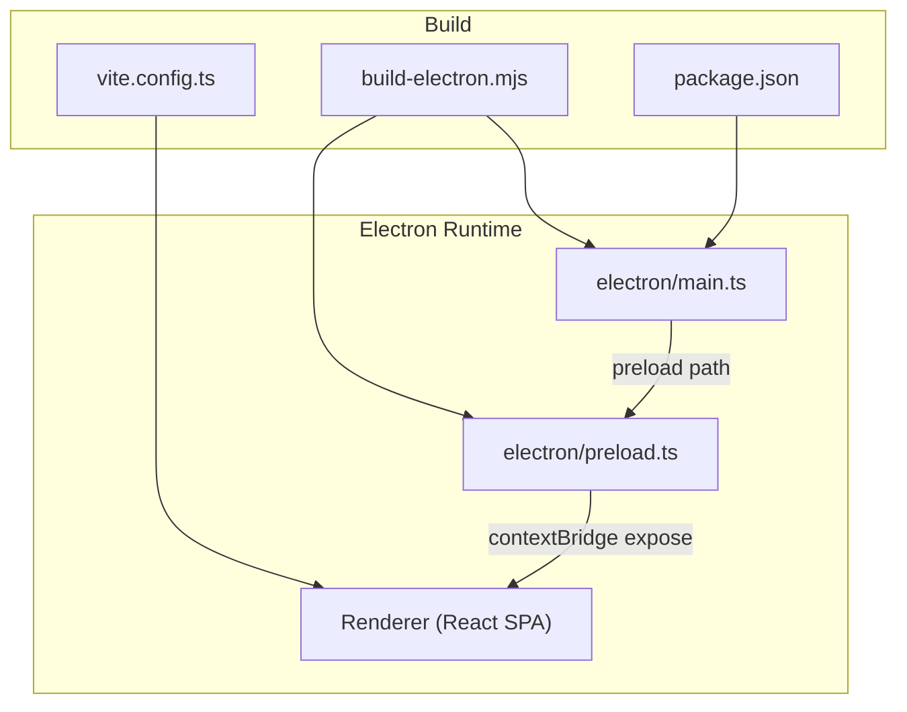
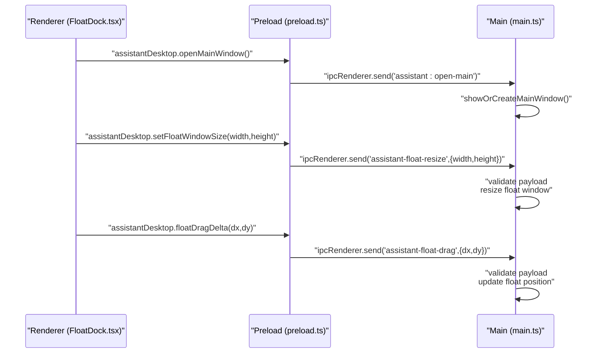
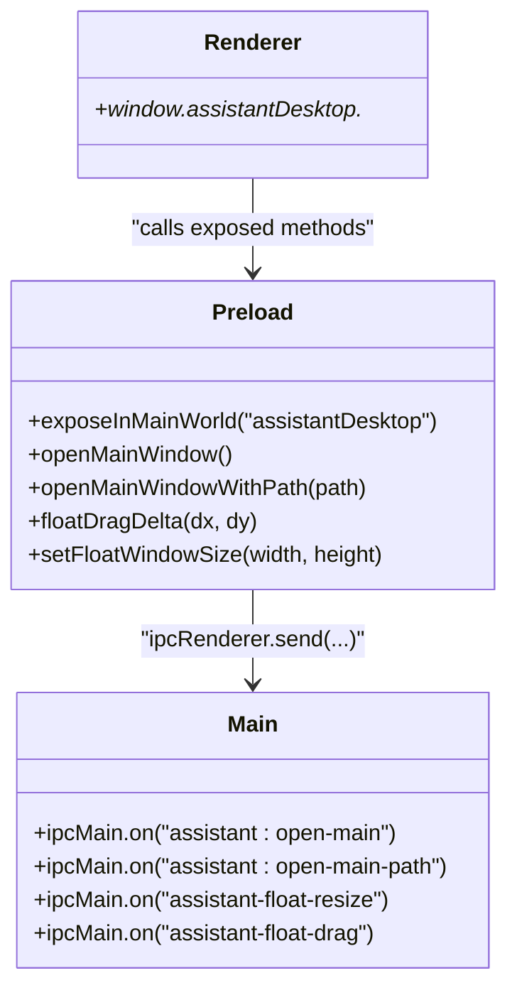
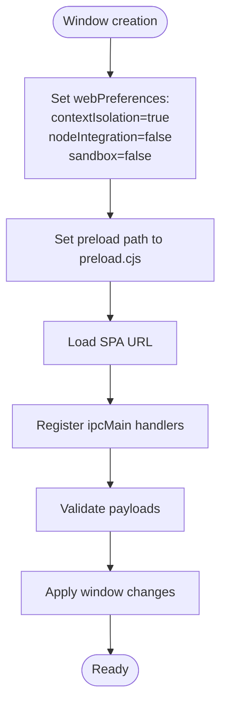
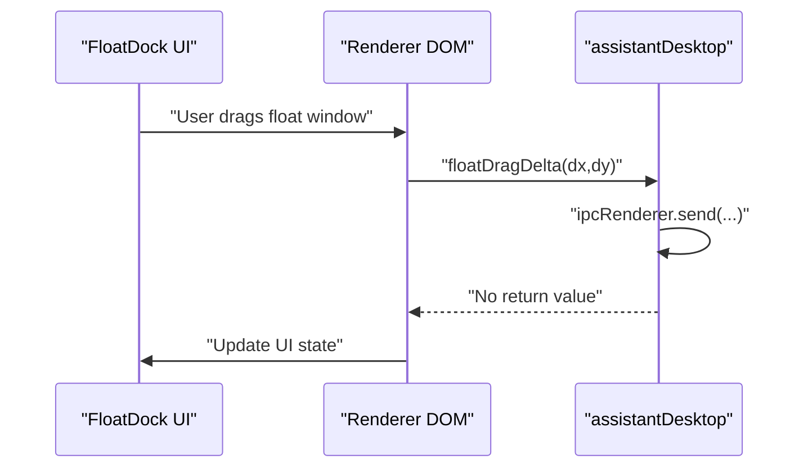
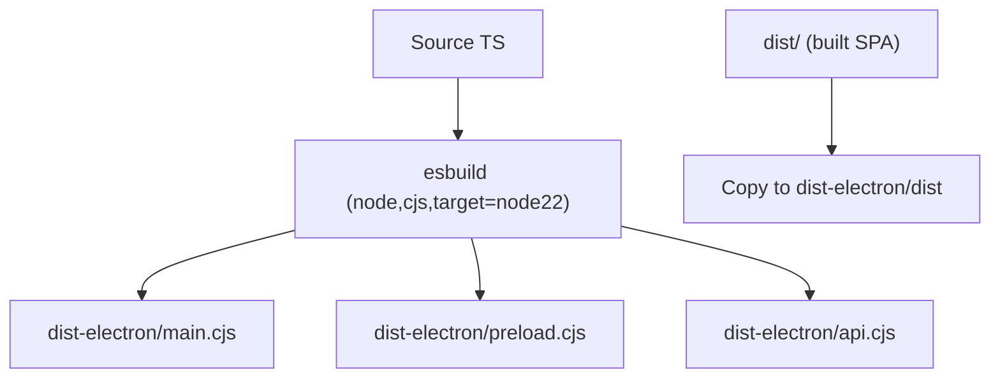
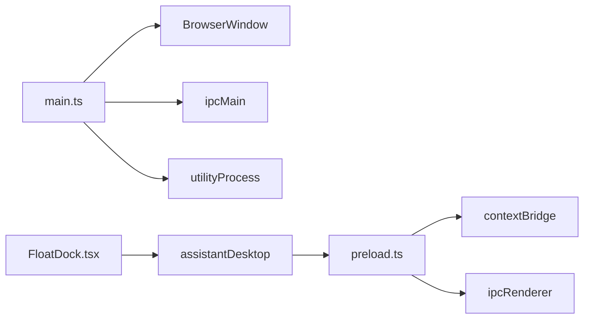

# Preload Scripts and Security

<cite>
**Referenced Files in This Document**
- [electron/main.ts](file://electron/main.ts)
- [electron/preload.ts](file://electron/preload.ts)
- [src/pages/FloatDock.tsx](file://src/pages/FloatDock.tsx)
- [scripts/build-electron.mjs](file://scripts/build-electron.mjs)
- [package.json](file://package.json)
- [vite.config.ts](file://vite.config.ts)
- [index.html](file://index.html)
</cite>

## Table of Contents
1. [Introduction](#introduction)
2. [Project Structure](#project-structure)
3. [Core Components](#core-components)
4. [Architecture Overview](#architecture-overview)
5. [Detailed Component Analysis](#detailed-component-analysis)
6. [Dependency Analysis](#dependency-analysis)
7. [Performance Considerations](#performance-considerations)
8. [Troubleshooting Guide](#troubleshooting-guide)
9. [Conclusion](#conclusion)

## Introduction
This document explains the Electron preload scripts and security architecture used in the project. It focuses on how the preload script bridges the renderer process and Node.js capabilities, the security model enforced by context isolation and sandbox configuration, and the IPC communication patterns between the renderer and main process. It also documents best practices for preload script development, common pitfalls, and debugging techniques for IPC.

## Project Structure
The Electron application consists of:
- Main process entry and window configuration
- Preload script exposing a controlled API surface to the renderer
- Renderer-side usage of the exposed API
- Build pipeline that compiles main, preload, and server code into the distribution

**Diagram sources**
- [scripts/build-electron.mjs:1-76](file://scripts/build-electron.mjs#L1-L76)
- [package.json:1-99](file://package.json#L1-L99)
- [vite.config.ts:1-111](file://vite.config.ts#L1-L111)
- [electron/main.ts:259-297](file://electron/main.ts#L259-L297)
- [electron/preload.ts:1-21](file://electron/preload.ts#L1-L21)

**Section sources**
- [scripts/build-electron.mjs:1-76](file://scripts/build-electron.mjs#L1-L76)
- [package.json:1-99](file://package.json#L1-L99)
- [vite.config.ts:1-111](file://vite.config.ts#L1-L111)
- [electron/main.ts:259-297](file://electron/main.ts#L259-L297)
- [electron/preload.ts:1-21](file://electron/preload.ts#L1-L21)

## Core Components
- Main process window configuration with preload and security flags
- Preload script exposing a typed, minimal API surface via contextBridge
- Renderer-side usage of the exposed API for window control and navigation
- Build pipeline compiling main, preload, and server code

Key responsibilities:
- Main process: creates windows, sets security flags, registers IPC handlers, and manages child processes
- Preload: exposes only necessary functions to the renderer, handles IPC send calls
- Renderer: invokes exposed functions to trigger actions in the main process

Security posture:
- Context isolation enabled
- Node.js integration disabled
- Sandbox disabled (not used for isolation)

**Section sources**
- [electron/main.ts:268-280](file://electron/main.ts#L268-L280)
- [electron/preload.ts:1-21](file://electron/preload.ts#L1-L21)
- [src/pages/FloatDock.tsx:110-350](file://src/pages/FloatDock.tsx#L110-L350)

## Architecture Overview
The preload script acts as a security boundary. It exposes a small, typed API surface to the renderer via contextBridge and forwards renderer requests to the main process over IPC. The main process validates and executes actions, returning results indirectly through IPC or by updating window state.

**Diagram sources**
- [electron/preload.ts:3-20](file://electron/preload.ts#L3-L20)
- [electron/main.ts:47-94](file://electron/main.ts#L47-L94)
- [src/pages/FloatDock.tsx:197-350](file://src/pages/FloatDock.tsx#L197-L350)

## Detailed Component Analysis

### Preload Script (Security Bridge)
The preload script defines a single exposed object that the renderer can access globally. It uses contextBridge to safely expose only the intended functions and avoids leaking Node.js or Electron internals.

Responsibilities:
- Expose a typed API surface to the renderer
- Forward renderer requests to the main process via ipcRenderer.send
- Keep the API minimal and explicit

Security implications:
- No Node.js or Electron APIs are directly exposed to the renderer
- All renderer-initiated actions go through IPC, enabling validation and sanitization in the main process

**Diagram sources**
- [electron/preload.ts:1-21](file://electron/preload.ts#L1-L21)
- [electron/main.ts:47-94](file://electron/main.ts#L47-L94)

**Section sources**
- [electron/preload.ts:1-21](file://electron/preload.ts#L1-L21)

### Main Process Window Configuration and IPC Handlers
The main process configures windows with security flags and registers IPC handlers for the preload-exposed actions. It validates payloads and performs operations like resizing and moving the floating window.

Security model:
- contextIsolation: true
- nodeIntegration: false
- sandbox: false

These flags ensure the renderer runs in a restricted environment without direct Node/Electron access.

**Diagram sources**
- [electron/main.ts:268-280](file://electron/main.ts#L268-L280)
- [electron/main.ts:47-94](file://electron/main.ts#L47-L94)

**Section sources**
- [electron/main.ts:268-280](file://electron/main.ts#L268-L280)
- [electron/main.ts:47-94](file://electron/main.ts#L47-L94)

### Renderer Usage Pattern (FloatDock)
The renderer checks for the presence of the exposed API and conditionally enables features. It calls the exposed methods to trigger actions in the main process.

**Diagram sources**
- [src/pages/FloatDock.tsx:110-350](file://src/pages/FloatDock.tsx#L110-L350)
- [electron/preload.ts:13-15](file://electron/preload.ts#L13-L15)

**Section sources**
- [src/pages/FloatDock.tsx:110-350](file://src/pages/FloatDock.tsx#L110-L350)

### Build Pipeline and Distribution
The build script compiles the main process, preload, and server code into CommonJS outputs placed under dist-electron. It also copies the built web assets into dist-electron/dist so the main process can serve them.

**Diagram sources**
- [scripts/build-electron.mjs:26-55](file://scripts/build-electron.mjs#L26-L55)

**Section sources**
- [scripts/build-electron.mjs:26-55](file://scripts/build-electron.mjs#L26-L55)

## Dependency Analysis
The preload script depends on Electron’s contextBridge and ipcRenderer. The main process depends on Electron’s BrowserWindow, ipcMain, and utilityProcess. The renderer depends on the preload-exposed API.

**Diagram sources**
- [electron/preload.ts:1-21](file://electron/preload.ts#L1-L21)
- [electron/main.ts:1-10](file://electron/main.ts#L1-L10)
- [src/pages/FloatDock.tsx:110-350](file://src/pages/FloatDock.tsx#L110-L350)

**Section sources**
- [electron/preload.ts:1-21](file://electron/preload.ts#L1-L21)
- [electron/main.ts:1-10](file://electron/main.ts#L1-L10)
- [src/pages/FloatDock.tsx:110-350](file://src/pages/FloatDock.tsx#L110-L350)

## Performance Considerations
- Keep the preload API minimal to reduce attack surface and IPC overhead
- Validate and sanitize payloads in the main process before applying changes
- Avoid heavy computations in the renderer; delegate to the main process when possible
- Use debouncing or throttling for frequent IPC events (e.g., drag deltas)

## Troubleshooting Guide
Common issues and resolutions:
- API not available in renderer
  - Ensure preload is compiled and loaded by the window
  - Verify the preload path in webPreferences points to the built preload.cjs
  - Confirm the preload script exposes the expected object

- IPC messages not received
  - Check that the main process registers handlers for the expected channels
  - Verify payload shapes match expectations

- Window resize/drag not working
  - Confirm the main process handlers validate numeric dimensions and positions
  - Ensure the renderer calls the exposed methods with correct arguments

- Debugging IPC
  - Use DevTools in the main window to inspect logs and errors
  - Add logging around handler registration and payload validation
  - For the floating window, use the debug query flag to enable DevTools and observe warnings

Best practices:
- Always validate and sanitize IPC payloads in the main process
- Prefer explicit, typed APIs in the preload script
- Avoid exposing Node.js or Electron APIs directly to the renderer
- Keep the preload script small and focused

**Section sources**
- [electron/main.ts:47-94](file://electron/main.ts#L47-L94)
- [electron/main.ts:363-382](file://electron/main.ts#L363-L382)
- [src/pages/FloatDock.tsx:189-195](file://src/pages/FloatDock.tsx#L189-L195)

## Conclusion
The preload script serves as a security boundary, exposing only necessary functionality to the renderer while keeping Node.js and Electron APIs isolated. Combined with context isolation and disabled Node integration, this architecture limits the renderer’s capabilities to safe, controlled operations. IPC remains the primary communication channel, enabling the main process to validate and enforce security policies before performing sensitive actions.