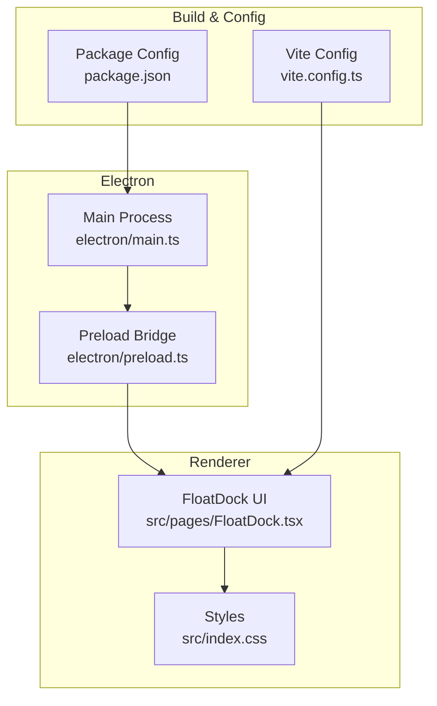
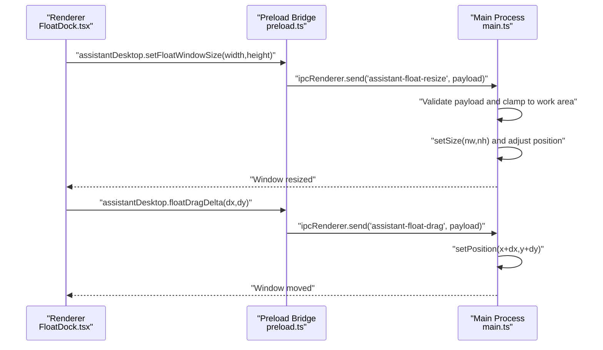
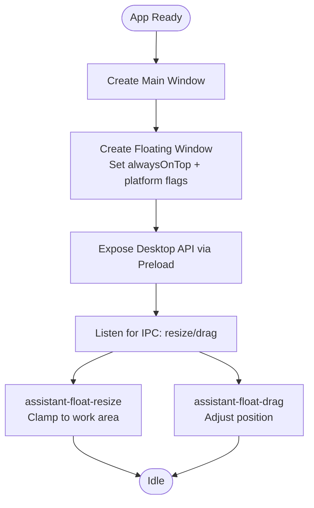
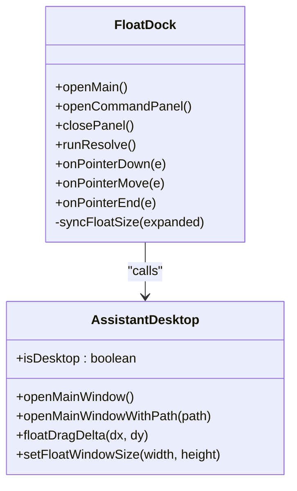
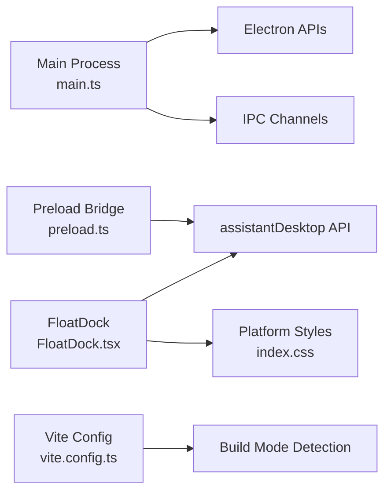

# Cross-Platform Optimizations

<cite>
**Referenced Files in This Document**
- [electron/main.ts](file://electron/main.ts)
- [electron/preload.ts](file://electron/preload.ts)
- [src/pages/FloatDock.tsx](file://src/pages/FloatDock.tsx)
- [src/index.css](file://src/index.css)
- [vite.config.ts](file://vite.config.ts)
- [package.json](file://package.json)
</cite>

## Table of Contents
1. [Introduction](#introduction)
2. [Project Structure](#project-structure)
3. [Core Components](#core-components)
4. [Architecture Overview](#architecture-overview)
5. [Detailed Component Analysis](#detailed-component-analysis)
6. [Dependency Analysis](#dependency-analysis)
7. [Performance Considerations](#performance-considerations)
8. [Troubleshooting Guide](#troubleshooting-guide)
9. [Conclusion](#conclusion)

## Introduction
This document explains the cross-platform optimizations and platform-specific implementations in the project. It focuses on:
- macOS-specific behaviors (floating window stacking, always-on-top, and full-screen visibility)
- Windows integration points (always-on-top behavior and taskbar integration)
- Linux compatibility considerations (window manager interactions and platform differences)
- Conditional logic for platform-specific behaviors, keyboard shortcuts, and UI adaptations
- Platform detection, feature availability checks, and troubleshooting guidance
- Accessibility features and platform compliance requirements

## Project Structure
The cross-platform logic is primarily implemented in the Electron main process and exposed to the renderer via a preload bridge. The floating dock UI is implemented in a dedicated page and styled with platform-aware CSS.

**Diagram sources**
- [electron/main.ts](file://electron/main.ts)
- [electron/preload.ts](file://electron/preload.ts)
- [src/pages/FloatDock.tsx](file://src/pages/FloatDock.tsx)
- [src/index.css](file://src/index.css)
- [vite.config.ts](file://vite.config.ts)
- [package.json](file://package.json)

**Section sources**
- [electron/main.ts](file://electron/main.ts)
- [electron/preload.ts](file://electron/preload.ts)
- [src/pages/FloatDock.tsx](file://src/pages/FloatDock.tsx)
- [src/index.css](file://src/index.css)
- [vite.config.ts](file://vite.config.ts)
- [package.json](file://package.json)

## Core Components
- Electron main process orchestrates windows, platform-specific behaviors, and IPC channels.
- Preload bridge exposes a typed API surface to the renderer for desktop features.
- Floating dock UI adapts to platform constraints and provides a unified UX across platforms.
- Build configuration toggles PWA behavior and proxy logic depending on the execution mode.

Key platform-specific behaviors:
- Floating window always-on-top and stacking order differ by OS.
- Taskbar integration and window lifecycle vary by OS.
- CSS and layout adapt to platform affordances.

**Section sources**
- [electron/main.ts](file://electron/main.ts)
- [electron/preload.ts](file://electron/preload.ts)
- [src/pages/FloatDock.tsx](file://src/pages/FloatDock.tsx)
- [vite.config.ts](file://vite.config.ts)

## Architecture Overview
The desktop app initializes the main and floating windows, sets platform-specific attributes, and exposes a controlled API to the renderer. The floating dock UI communicates with the main process to resize and drag the floating window.

**Diagram sources**
- [electron/preload.ts](file://electron/preload.ts)
- [electron/main.ts](file://electron/main.ts)
- [src/pages/FloatDock.tsx](file://src/pages/FloatDock.tsx)

## Detailed Component Analysis

### Electron Main Process (Platform-Specific Behaviors)
- Floating window creation:
  - Transparent, frameless, and always-on-top with OS-specific adjustments.
  - macOS: visible on all workspaces and full-screen overlay.
  - Other platforms: always-on-top with a screen-saver level.
  - Skip taskbar for floating window.
- Window lifecycle:
  - On macOS, keep the app alive when windows close; quit only on explicit action.
  - On other platforms, quit when the last window closes.
- IPC channels:
  - Resize floating window with bounds clamped to the primary display work area.
  - Drag floating window by delta, preserving corner anchoring.

**Diagram sources**
- [electron/main.ts](file://electron/main.ts)

**Section sources**
- [electron/main.ts](file://electron/main.ts)

### Preload Bridge (Renderer API Exposure)
- Exposes a typed object to the renderer with:
  - Open main window navigation helpers.
  - Floating window resize and drag APIs.
- Ensures renderer-side feature detection and graceful fallbacks.

**Section sources**
- [electron/preload.ts](file://electron/preload.ts)

### Floating Dock UI (Platform-Aware UX)
- Detects desktop capabilities and logs debug info when enabled.
- Uses a dedicated CSS class to apply platform-specific styles.
- Resizes the floating window via the exposed API and adjusts layout accordingly.
- Implements pointer-based drag with thresholds and debounces.
- Supports keyboard shortcuts (e.g., Escape to close the panel).

**Diagram sources**
- [src/pages/FloatDock.tsx](file://src/pages/FloatDock.tsx)
- [electron/preload.ts](file://electron/preload.ts)

**Section sources**
- [src/pages/FloatDock.tsx](file://src/pages/FloatDock.tsx)
- [src/index.css](file://src/index.css)

### Platform-Specific UI Adaptations
- Floating dock shell and panel:
  - Uses backdrop filters and glass-like effects for modern desktop integration.
  - Adapts spacing and shadows for platform comfort.
- Reduced motion support:
  - Media query reduces transitions for users who prefer reduced motion.

**Section sources**
- [src/index.css](file://src/index.css)

### Build-Time Cross-Platform Considerations
- PWA plugin is disabled for Electron builds to avoid unnecessary service worker overhead.
- Proxy logic for development is controlled by environment flags to avoid conflicts with desktop packaging.

**Section sources**
- [vite.config.ts](file://vite.config.ts)

## Dependency Analysis
The desktop app’s platform logic depends on:
- Electron APIs for windowing, IPC, and screen geometry.
- Renderer-side feature detection to conditionally enable desktop-only features.
- Build-time toggles to differentiate web vs. desktop behavior.

**Diagram sources**
- [electron/main.ts](file://electron/main.ts)
- [electron/preload.ts](file://electron/preload.ts)
- [src/pages/FloatDock.tsx](file://src/pages/FloatDock.tsx)
- [src/index.css](file://src/index.css)
- [vite.config.ts](file://vite.config.ts)

**Section sources**
- [electron/main.ts](file://electron/main.ts)
- [electron/preload.ts](file://electron/preload.ts)
- [src/pages/FloatDock.tsx](file://src/pages/FloatDock.tsx)
- [src/index.css](file://src/index.css)
- [vite.config.ts](file://vite.config.ts)

## Performance Considerations
- Floating window resizing clamps to the primary display work area to prevent off-screen rendering and excessive compositing.
- Always-on-top is set per platform to minimize z-order conflicts while maintaining visibility.
- CSS backdrop filters and transitions are scoped to platform-aware components to reduce unnecessary GPU work on lower-end systems.
- Build toggles disable PWA caching for desktop builds to reduce bundle size and simplify updates.

[No sources needed since this section provides general guidance]

## Troubleshooting Guide
Common issues and resolutions:
- Floating window not resizing:
  - Ensure the main process IPC handler is present and receiving valid numeric dimensions.
  - Verify the work area clamping does not constrain the window below minimum sizes.
- Dragging not working:
  - Confirm the preload bridge exposes the drag API and the renderer detects it.
  - Check pointer capture and event propagation in the floating dock shell.
- Window stays behind other apps:
  - On macOS, verify always-on-top and full-screen visibility flags are applied.
  - On other platforms, confirm the screen-saver level is set.
- Taskbar icon missing:
  - Floating window is intentionally skipped from the taskbar; check platform taskbar policies.
- Panel cutoff or overflow:
  - Expand the floating window before rendering the panel to avoid clipping in compact sizes.
- Accessibility concerns:
  - Use reduced motion media queries to reduce motion.
  - Ensure focus styles and keyboard navigation remain usable.

**Section sources**
- [electron/main.ts](file://electron/main.ts)
- [electron/preload.ts](file://electron/preload.ts)
- [src/pages/FloatDock.tsx](file://src/pages/FloatDock.tsx)
- [src/index.css](file://src/index.css)

## Conclusion
The project implements robust cross-platform desktop integration through:
- Clear platform-specific windowing and stacking behaviors
- Controlled IPC channels for resizing and dragging
- Renderer-side feature detection and graceful degradation
- Platform-aware UI styling and accessibility support
- Build-time toggles to optimize desktop delivery

These patterns provide a solid foundation for extending platform-specific features while maintaining a consistent user experience across macOS, Windows, and Linux environments.