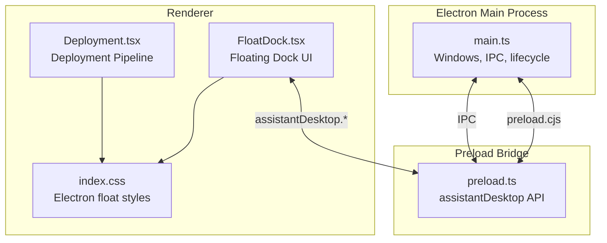
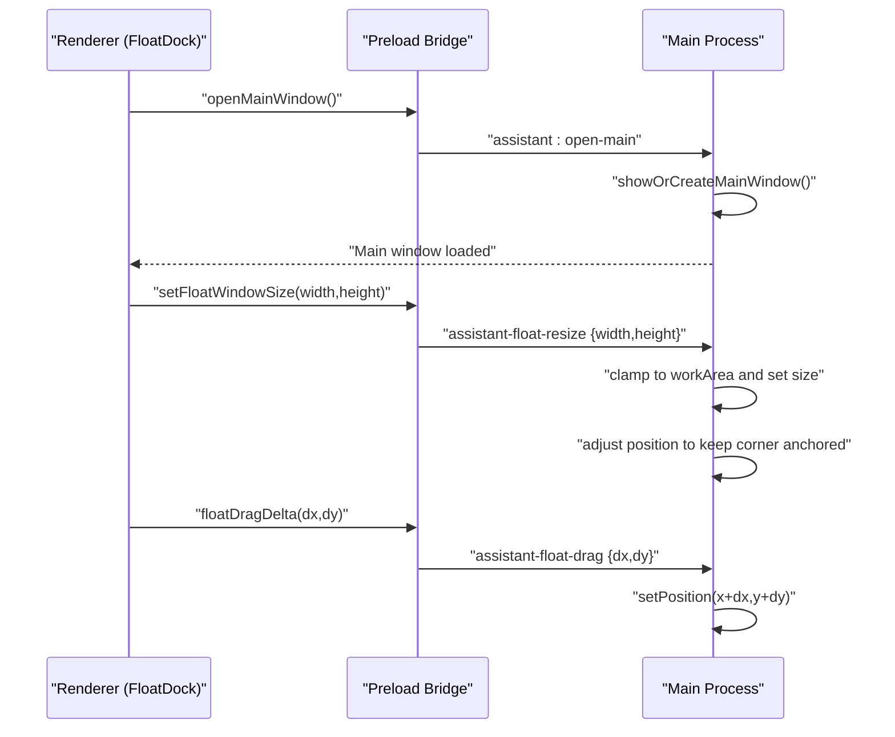
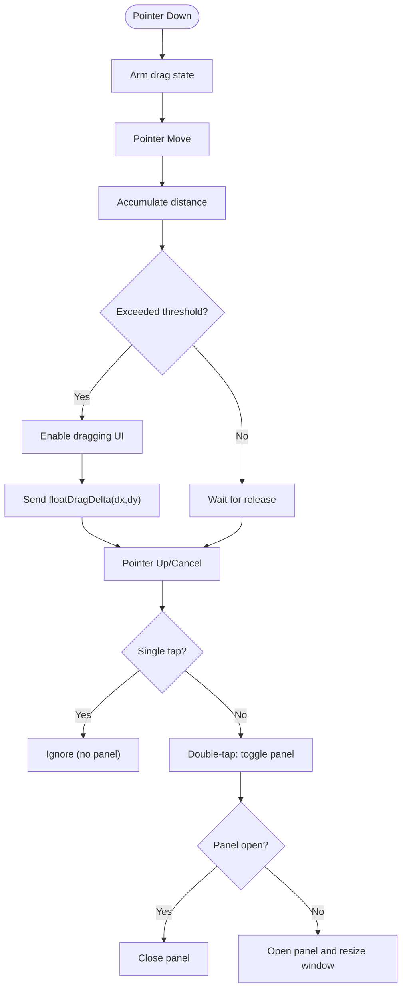
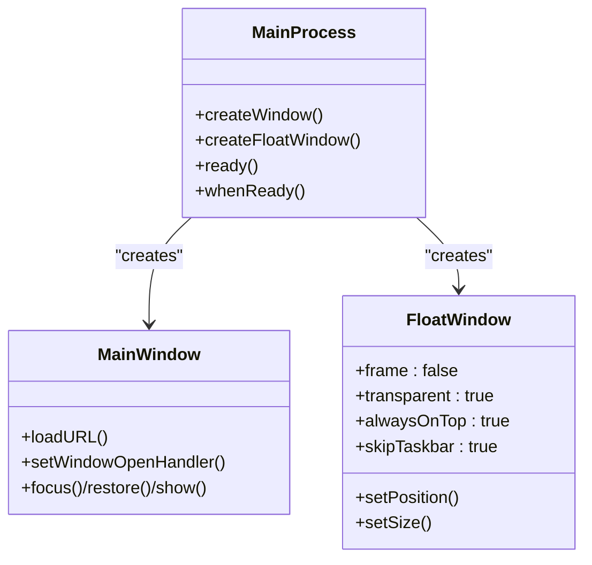
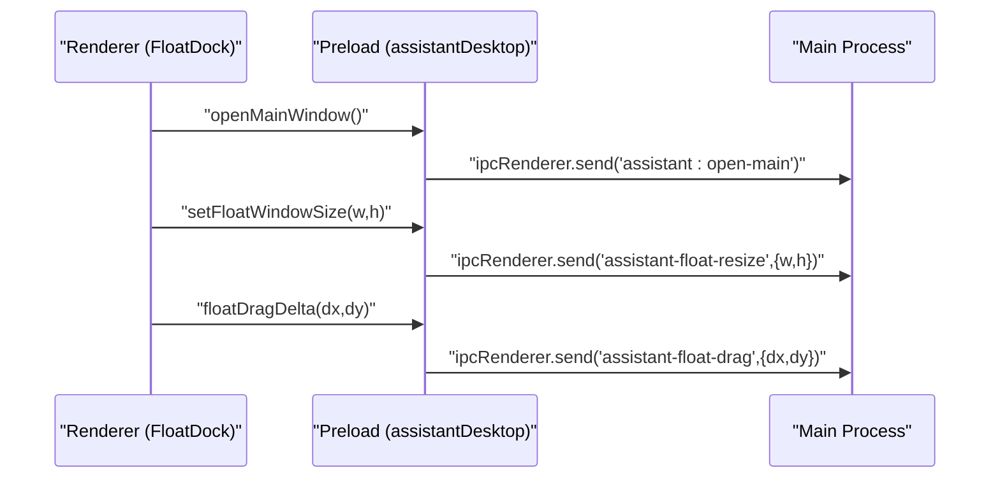
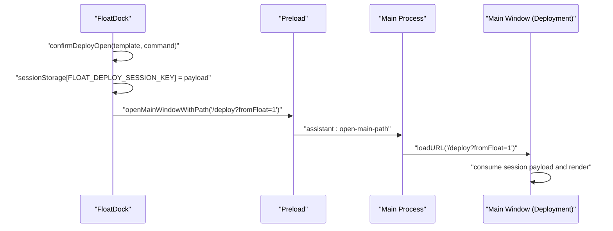
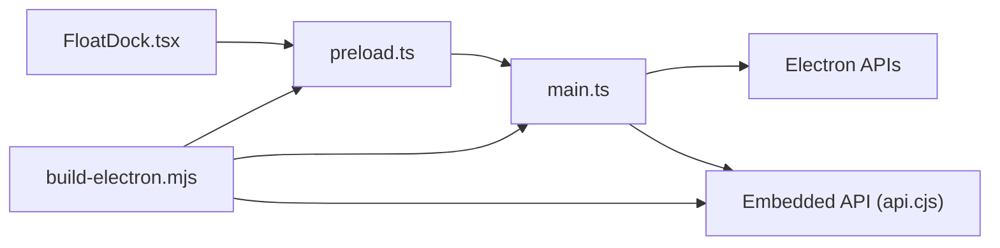

# Desktop Integration Features

<cite>
**Referenced Files in This Document**
- [FloatDock.tsx](file://src/pages/FloatDock.tsx)
- [main.ts](file://electron/main.ts)
- [preload.ts](file://electron/preload.ts)
- [index.css](file://src/index.css)
- [build-electron.mjs](file://scripts/build-electron.mjs)
- [package.json](file://package.json)
- [Deployment.tsx](file://src/pages/Deployment.tsx)
- [float-deploy-payload.ts](file://src/lib/float-command/float-deploy-payload.ts)
</cite>

## Table of Contents
1. [Introduction](#introduction)
2. [Project Structure](#project-structure)
3. [Core Components](#core-components)
4. [Architecture Overview](#architecture-overview)
5. [Detailed Component Analysis](#detailed-component-analysis)
6. [Dependency Analysis](#dependency-analysis)
7. [Performance Considerations](#performance-considerations)
8. [Troubleshooting Guide](#troubleshooting-guide)
9. [Conclusion](#conclusion)

## Introduction
This document explains the desktop integration features of the application, focusing on the floating dock, transparent always-on-top window, IPC-driven drag and resize, system tray-like context menu, and cross-platform optimizations. It also covers how the floating dock integrates with the main application, how deployment flows are triggered from the dock, and how the desktop environment is adapted for Electron via CSS and preload exposure.

## Project Structure
The desktop integration spans three layers:
- Electron main process orchestrates windows, IPC handlers, and lifecycle.
- Preload exposes a controlled API surface to the renderer.
- Renderer implements the floating dock UI and interaction logic.

**Diagram sources**
- [main.ts:1-434](file://electron/main.ts#L1-L434)
- [preload.ts:1-21](file://electron/preload.ts#L1-L21)
- [FloatDock.tsx:1-638](file://src/pages/FloatDock.tsx#L1-L638)
- [index.css:912-1005](file://src/index.css#L912-L1005)
- [Deployment.tsx:1-200](file://src/pages/Deployment.tsx#L1-L200)

**Section sources**
- [main.ts:1-434](file://electron/main.ts#L1-L434)
- [preload.ts:1-21](file://electron/preload.ts#L1-L21)
- [FloatDock.tsx:1-638](file://src/pages/FloatDock.tsx#L1-L638)
- [index.css:912-1005](file://src/index.css#L912-L1005)
- [build-electron.mjs:1-76](file://scripts/build-electron.mjs#L1-L76)
- [package.json:1-99](file://package.json#L1-L99)

## Core Components
- Floating Dock: A small always-on-top, transparent window that acts as a persistent launcher for quick actions (add todo, deploy, startup).
- Main Window: The primary SPA window, navigated programmatically from the floating dock.
- IPC Layer: Controlled communication between renderer and main process for drag deltas and resizing.
- Styles: Electron-specific CSS to remove base styles and adapt layout for the floating capsule.

Key responsibilities:
- Floating Dock: gesture handling (drag, double-tap), command resolution, and navigation to main window.
- Main Process: window creation, positioning, always-on-top behavior, and IPC handlers.
- Preload: safe exposure of APIs to renderer.

**Section sources**
- [FloatDock.tsx:111-382](file://src/pages/FloatDock.tsx#L111-L382)
- [main.ts:259-387](file://electron/main.ts#L259-L387)
- [preload.ts:3-20](file://electron/preload.ts#L3-L20)
- [index.css:912-1005](file://src/index.css#L912-L1005)

## Architecture Overview
The floating dock runs in a dedicated BrowserWindow with frameless, transparent settings. The renderer interacts with the main process via IPC for drag and resize operations. The main process enforces bounds and anchors the window to the bottom-right of the primary display.

**Diagram sources**
- [FloatDock.tsx:197-207](file://src/pages/FloatDock.tsx#L197-L207)
- [FloatDock.tsx:141-154](file://src/pages/FloatDock.tsx#L141-L154)
- [FloatDock.tsx:314-378](file://src/pages/FloatDock.tsx#L314-L378)
- [preload.ts:5-19](file://electron/preload.ts#L5-L19)
- [main.ts:61-94](file://electron/main.ts#L61-L94)

## Detailed Component Analysis

### Floating Dock Implementation
The floating dock is a compact always-on-top window with a single “capsule” shell and optional expanded command panel. It supports:
- Dragging via pointer events and IPC delta updates.
- Double-tap toggle to open/close the command panel.
- Three tabs: Add Todo, Quick Deploy, Launch Project.
- Responsive sizing synchronized with main process constraints.

**Diagram sources**
- [FloatDock.tsx:314-378](file://src/pages/FloatDock.tsx#L314-L378)
- [FloatDock.tsx:141-154](file://src/pages/FloatDock.tsx#L141-L154)
- [main.ts:84-94](file://electron/main.ts#L84-L94)

Key behaviors:
- Dragging uses a pointer capture and accumulates movement until a threshold is reached, then sends IPC deltas to the main process.
- Double-tap detection toggles the panel; single taps do nothing to avoid accidental activation.
- Panel open triggers a larger window size via IPC; panel closed reverts to a compact size.

**Section sources**
- [FloatDock.tsx:111-187](file://src/pages/FloatDock.tsx#L111-L187)
- [FloatDock.tsx:197-313](file://src/pages/FloatDock.tsx#L197-L313)
- [FloatDock.tsx:314-378](file://src/pages/FloatDock.tsx#L314-L378)

### Main Process Window Management
The main process creates two windows:
- Main window: standard SPA with minimum sizes and external link handling.
- Floating window: frameless, transparent, always-on-top, bottom-right anchored.

Cross-platform considerations:
- macOS: visible on all workspaces and uses a higher window level to stay above fullscreen apps.
- Windows: uses a supported always-on-top level.

**Diagram sources**
- [main.ts:259-297](file://electron/main.ts#L259-L297)
- [main.ts:311-387](file://electron/main.ts#L311-L387)

**Section sources**
- [main.ts:259-387](file://electron/main.ts#L259-L387)

### Preload Bridge and IPC Exposure
The preload bridge exposes a typed API surface to the renderer:
- Open main window and navigate to a path.
- Send drag deltas and resize requests to the main process.

**Diagram sources**
- [preload.ts:3-20](file://electron/preload.ts#L3-L20)
- [main.ts:47-59](file://electron/main.ts#L47-L59)
- [main.ts:61-94](file://electron/main.ts#L61-L94)

**Section sources**
- [preload.ts:1-21](file://electron/preload.ts#L1-L21)
- [main.ts:47-94](file://electron/main.ts#L47-L94)

### Electron Float Styles and Layout
Electron’s floating mode removes base styles and adapts layout for the transparent capsule:
- Removes margins/padding and disables overflow on the html/body/root.
- Ensures single-child routes fill the root container.
- Adds hover/grab cursors during drag and debug overlays when requested.

**Section sources**
- [index.css:912-1005](file://src/index.css#L912-L1005)
- [FloatDock.tsx:173-187](file://src/pages/FloatDock.tsx#L173-L187)

### Build and Packaging for Desktop
The build script compiles main, preload, and the embedded API into the Electron output directory and copies the Vite dist assets. It optionally removes bundled fonts to reduce package size.

**Section sources**
- [build-electron.mjs:1-76](file://scripts/build-electron.mjs#L1-L76)
- [package.json:15-26](file://package.json#L15-L26)

### Deployment Flow from Floating Dock
When the user selects a deployment template in the floating dock, the system:
- Stores a session payload with the original command and selected nodes.
- Navigates the main window to the deployment page with a flag indicating origin.
- The deployment page reads the session payload and proceeds with pipeline execution.

**Diagram sources**
- [FloatDock.tsx:295-312](file://src/pages/FloatDock.tsx#L295-L312)
- [float-deploy-payload.ts:1-12](file://src/lib/float-command/float-deploy-payload.ts#L1-L12)
- [Deployment.tsx:88-100](file://src/pages/Deployment.tsx#L88-L100)
- [main.ts:51-59](file://electron/main.ts#L51-L59)

**Section sources**
- [FloatDock.tsx:295-312](file://src/pages/FloatDock.tsx#L295-L312)
- [float-deploy-payload.ts:1-12](file://src/lib/float-command/float-deploy-payload.ts#L1-L12)
- [Deployment.tsx:88-100](file://src/pages/Deployment.tsx#L88-L100)

## Dependency Analysis
- Renderer depends on preload for safe IPC calls.
- Main process depends on Electron APIs for window management and utility processes for the backend.
- Build pipeline produces the main, preload, and API bundles consumed by the main process.

**Diagram sources**
- [FloatDock.tsx:1-638](file://src/pages/FloatDock.tsx#L1-L638)
- [preload.ts:1-21](file://electron/preload.ts#L1-L21)
- [main.ts:1-434](file://electron/main.ts#L1-L434)
- [build-electron.mjs:1-76](file://scripts/build-electron.mjs#L1-L76)

**Section sources**
- [main.ts:1-434](file://electron/main.ts#L1-L434)
- [build-electron.mjs:1-76](file://scripts/build-electron.mjs#L1-L76)

## Performance Considerations
- Window sizing and positioning are clamped to the primary display work area to prevent oversize rendering issues on macOS and to keep content within screen bounds.
- The floating window is frameless and transparent to minimize compositing overhead while maintaining a responsive drag experience.
- The build script minifies main and API bundles and conditionally removes large bundled fonts to reduce package size and improve startup time.

[No sources needed since this section provides general guidance]

## Troubleshooting Guide
Common issues and resolutions:
- Floating dock does not respond to drag:
  - Ensure the preload bridge is injected and the API is exposed. The renderer checks for the presence of the drag delta function and logs a warning if missing.
  - Verify the main process IPC handler for drag exists and is reachable.
- Panel does not open or closes immediately:
  - Confirm that the renderer is sending the resize IPC before opening the panel and that the main process applies the new size.
  - Check that the main window is reachable and that the path navigation succeeds.
- Window appears behind other apps or not visible on macOS:
  - The main process sets the floating window to always-on-top with a higher level on macOS and makes it visible on all workspaces. Verify platform-specific flags are applied.
- Build artifacts missing:
  - Run the Electron build script to compile main, preload, and API bundles and copy Vite dist assets into the Electron output directory.

**Section sources**
- [FloatDock.tsx:190-195](file://src/pages/FloatDock.tsx#L190-L195)
- [main.ts:61-94](file://electron/main.ts#L61-L94)
- [main.ts:376-382](file://electron/main.ts#L376-L382)
- [build-electron.mjs:49-55](file://scripts/build-electron.mjs#L49-L55)

## Conclusion
The desktop integration centers on a lightweight, always-on-top floating dock that communicates with the main process via a minimal IPC surface. The design emphasizes responsiveness, cross-platform stability, and clean separation of concerns between renderer, preload, and main process. The deployment flow demonstrates seamless handoff from the dock to the main application, enabling quick actions without sacrificing usability or performance.