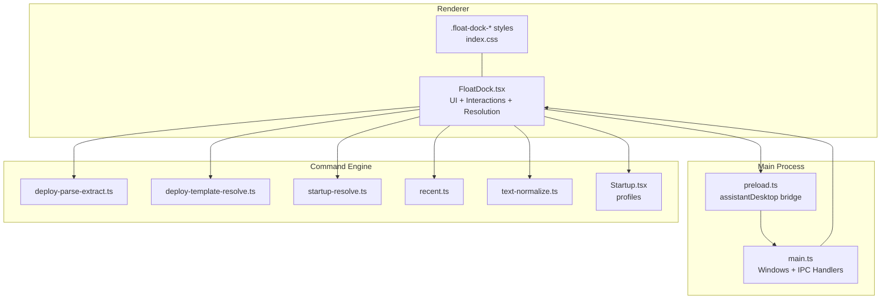
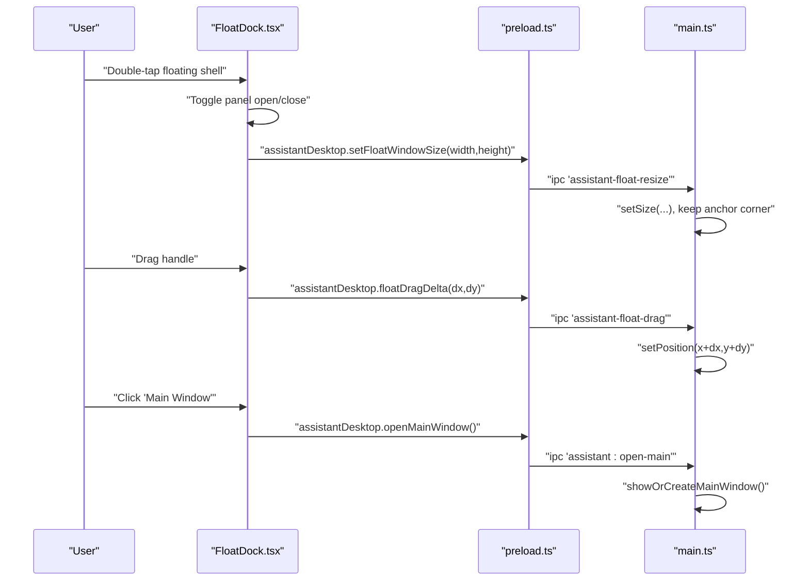
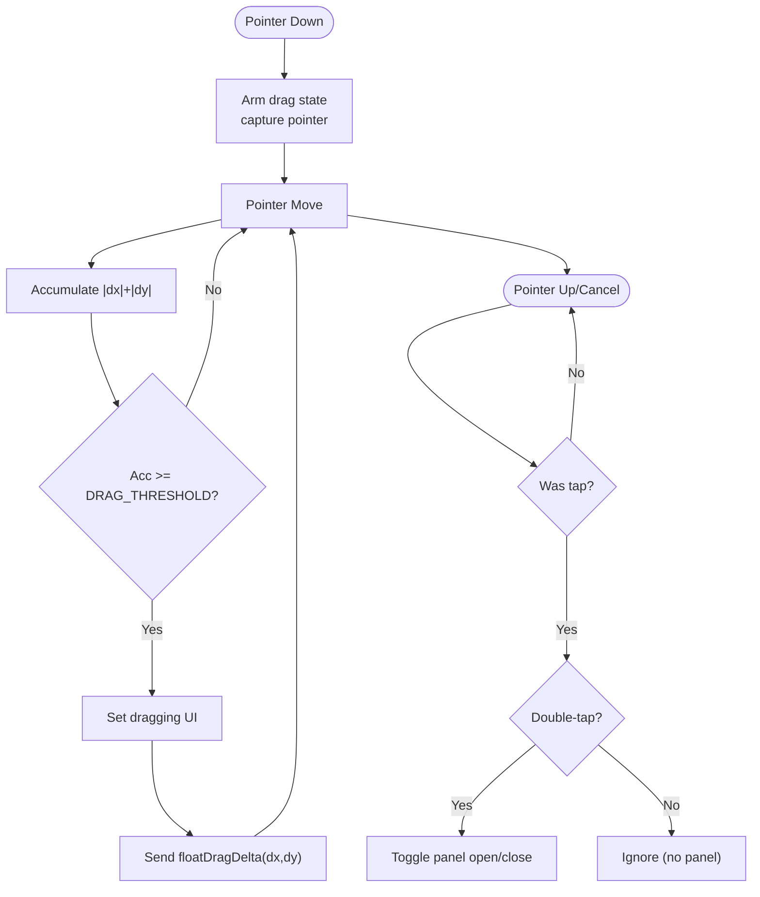
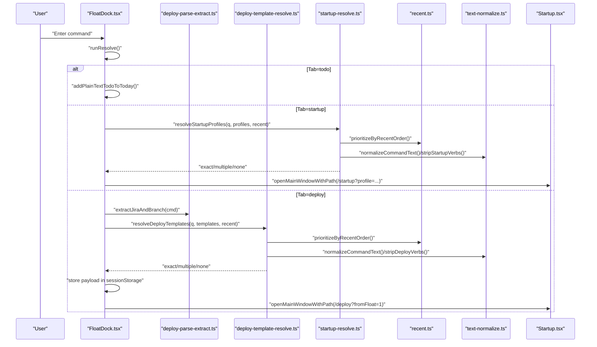
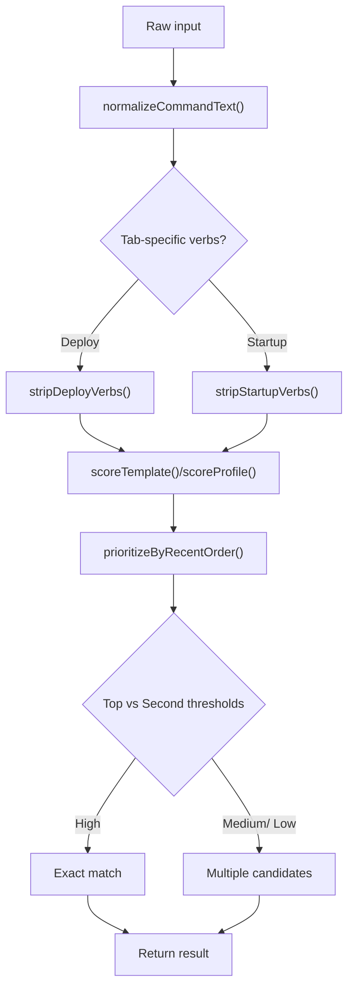
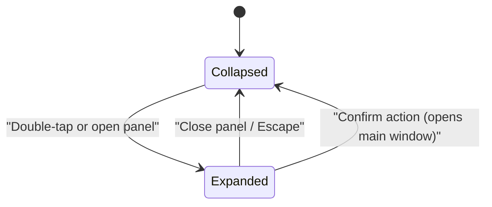
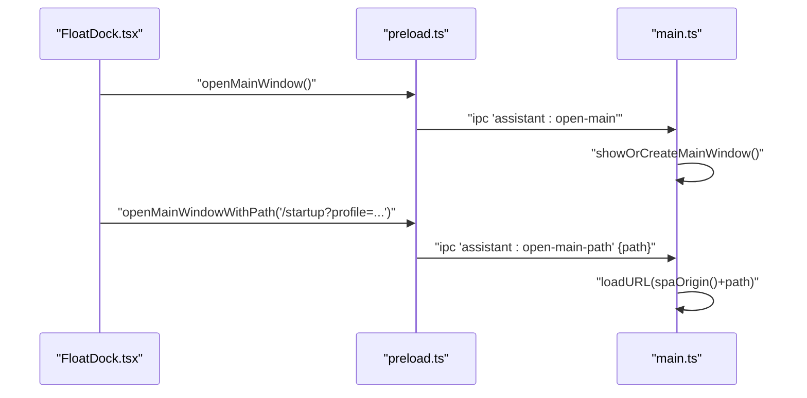
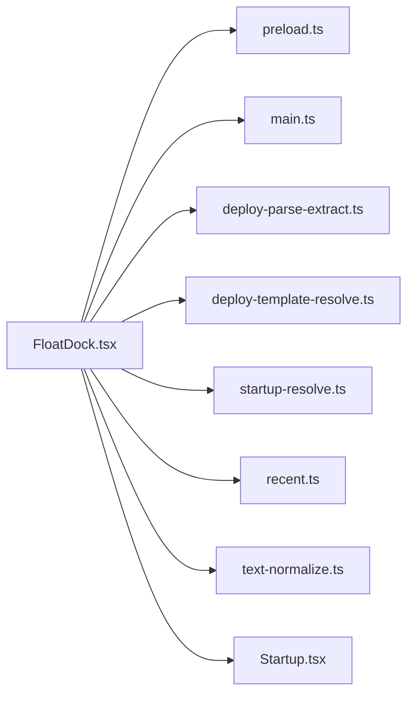

# Floating Dock Implementation

<cite>
**Referenced Files in This Document**
- [FloatDock.tsx](file://src/pages/FloatDock.tsx)
- [main.ts](file://electron/main.ts)
- [preload.ts](file://electron/preload.ts)
- [deploy-parse-extract.ts](file://src/lib/float-command/deploy-parse-extract.ts)
- [deploy-template-resolve.ts](file://src/lib/float-command/deploy-template-resolve.ts)
- [startup-resolve.ts](file://src/lib/float-command/startup-resolve.ts)
- [recent.ts](file://src/lib/float-command/recent.ts)
- [text-normalize.ts](file://src/lib/float-command/text-normalize.ts)
- [Startup.tsx](file://src/pages/Startup.tsx)
- [index.css](file://src/index.css)
</cite>

## Table of Contents
1. [Introduction](#introduction)
2. [Project Structure](#project-structure)
3. [Core Components](#core-components)
4. [Architecture Overview](#architecture-overview)
5. [Detailed Component Analysis](#detailed-component-analysis)
6. [Dependency Analysis](#dependency-analysis)
7. [Performance Considerations](#performance-considerations)
8. [Troubleshooting Guide](#troubleshooting-guide)
9. [Conclusion](#conclusion)
10. [Appendices](#appendices)

## Introduction
This document explains the floating dock implementation for the desktop assistant. It covers the draggable floating window with pointer/touch interactions, the three-tab command system (todo, deploy, startup), the intelligent command resolution engine, drag-and-drop mechanics via pointer events and IPC, responsive UI states, keyboard shortcuts, integration with main window navigation, debug mode, and development workflow. It also provides usage patterns, troubleshooting tips, and performance optimization guidance.

## Project Structure
The floating dock spans the renderer (React) and main (Electron) processes:
- Renderer-side React component manages UI, state, pointer interactions, and command resolution.
- Main process handles window creation, IPC handlers for dragging and resizing, and main window navigation.
- Shared command parsing and resolution logic resides in a dedicated library.

**Diagram sources**
- [FloatDock.tsx:111-637](file://src/pages/FloatDock.tsx#L111-L637)
- [main.ts:311-387](file://electron/main.ts#L311-L387)
- [preload.ts:3-20](file://electron/preload.ts#L3-L20)
- [deploy-parse-extract.ts:1-11](file://src/lib/float-command/deploy-parse-extract.ts#L1-L11)
- [deploy-template-resolve.ts:1-91](file://src/lib/float-command/deploy-template-resolve.ts#L1-L91)
- [startup-resolve.ts:1-91](file://src/lib/float-command/startup-resolve.ts#L1-L91)
- [recent.ts:1-84](file://src/lib/float-command/recent.ts#L1-L84)
- [text-normalize.ts:1-22](file://src/lib/float-command/text-normalize.ts#L1-L22)
- [Startup.tsx:50-124](file://src/pages/Startup.tsx#L50-L124)
- [index.css:944-1200](file://src/index.css#L944-L1200)

**Section sources**
- [FloatDock.tsx:111-637](file://src/pages/FloatDock.tsx#L111-L637)
- [main.ts:311-387](file://electron/main.ts#L311-L387)
- [preload.ts:3-20](file://electron/preload.ts#L3-L20)
- [index.css:944-1200](file://src/index.css#L944-L1200)

## Core Components
- Draggable floating window with pointer/touch interactions and double-tap activation.
- Three-tab command system:
  - Todo: add plain text tasks to today’s list.
  - Deploy: parse Jira and branch hints, match deployment templates, preview and confirm.
  - Startup: match startup profiles, preview, and open main window with selected profile.
- Intelligent resolution engine:
  - Text normalization and verb stripping.
  - Scoring and confidence thresholds.
  - Recent usage prioritization.
- IPC integration:
  - Drag delta movement via assistantDesktop.floatDragDelta.
  - Window resize via assistantDesktop.setFloatWindowSize.
  - Main window navigation via assistantDesktop.openMainWindow and assistantDesktop.openMainWindowWithPath.
- Responsive UI:
  - Collapsed vs expanded states.
  - Panel transitions and keyboard shortcuts.
- Debug mode:
  - Query flag toggles debug overlay and DevTools.

**Section sources**
- [FloatDock.tsx:314-378](file://src/pages/FloatDock.tsx#L314-L378)
- [FloatDock.tsx:217-274](file://src/pages/FloatDock.tsx#L217-L274)
- [FloatDock.tsx:285-312](file://src/pages/FloatDock.tsx#L285-L312)
- [main.ts:84-94](file://electron/main.ts#L84-L94)
- [main.ts:61-82](file://electron/main.ts#L61-L82)
- [preload.ts:13-19](file://electron/preload.ts#L13-L19)

## Architecture Overview
The floating dock orchestrates user interactions in the renderer and delegates window management to the main process via IPC. The command resolution pipeline is shared between the floating dock and the main window.

**Diagram sources**
- [FloatDock.tsx:141-154](file://src/pages/FloatDock.tsx#L141-L154)
- [FloatDock.tsx:314-378](file://src/pages/FloatDock.tsx#L314-L378)
- [preload.ts:13-19](file://electron/preload.ts#L13-L19)
- [main.ts:61-82](file://electron/main.ts#L61-L82)
- [main.ts:47-59](file://electron/main.ts#L47-L59)

## Detailed Component Analysis

### Draggable Floating Window and Touch/Cursor Interactions
- Pointer capture and drag detection:
  - Uses pointer events to arm, track movement, and detect drag threshold.
  - Accumulates total displacement to distinguish drag from tap.
  - Double-tap detection triggers panel toggle.
- Drag-and-drop via IPC:
  - On drag, sends relative deltas to main process to adjust window position.
  - Main process enforces finite numeric deltas and updates position.
- Visual feedback:
  - Adds dragging class to root for cursor change and shell highlighting.
  - Debug overlay shows live status when enabled.

**Diagram sources**
- [FloatDock.tsx:314-378](file://src/pages/FloatDock.tsx#L314-L378)
- [main.ts:84-94](file://electron/main.ts#L84-L94)

**Section sources**
- [FloatDock.tsx:314-378](file://src/pages/FloatDock.tsx#L314-L378)
- [main.ts:84-94](file://electron/main.ts#L84-L94)

### Three-Tab Command System
- Todo tab:
  - Single-line input submits plain text to today’s list.
  - Toast feedback for duplicates and success.
- Deploy tab:
  - Multi-line input supports mixed template name, Jira issue, and branch hints.
  - Parses Jira and branch via shared extractor.
  - Resolves templates with scoring and confidence thresholds.
  - Supports returning to input or previewing selection.
- Startup tab:
  - Matches startup profiles by id/title/aliases/keywords.
  - Resolves with confidence and recent usage prioritization.
  - Opens main window with selected profile via path query.

**Diagram sources**
- [FloatDock.tsx:217-274](file://src/pages/FloatDock.tsx#L217-L274)
- [deploy-parse-extract.ts:1-11](file://src/lib/float-command/deploy-parse-extract.ts#L1-L11)
- [deploy-template-resolve.ts:50-90](file://src/lib/float-command/deploy-template-resolve.ts#L50-L90)
- [startup-resolve.ts:50-90](file://src/lib/float-command/startup-resolve.ts#L50-L90)
- [recent.ts:55-83](file://src/lib/float-command/recent.ts#L55-L83)
- [text-normalize.ts:11-21](file://src/lib/float-command/text-normalize.ts#L11-L21)
- [Startup.tsx:158-168](file://src/pages/Startup.tsx#L158-L168)

**Section sources**
- [FloatDock.tsx:217-274](file://src/pages/FloatDock.tsx#L217-L274)
- [deploy-parse-extract.ts:1-11](file://src/lib/float-command/deploy-parse-extract.ts#L1-L11)
- [deploy-template-resolve.ts:50-90](file://src/lib/float-command/deploy-template-resolve.ts#L50-L90)
- [startup-resolve.ts:50-90](file://src/lib/float-command/startup-resolve.ts#L50-L90)
- [recent.ts:55-83](file://src/lib/float-command/recent.ts#L55-L83)
- [text-normalize.ts:11-21](file://src/lib/float-command/text-normalize.ts#L11-L21)
- [Startup.tsx:158-168](file://src/pages/Startup.tsx#L158-L168)

### Intelligent Command Resolution Engine
- Text normalization:
  - Lowercase, trim, collapse whitespace, normalize brackets.
- Verb stripping:
  - Removes common “deploy/open/run” prefixes for cleaner matching.
- Scoring:
  - Template/profile scores based on exact/full substring matches against normalized inputs.
- Confidence thresholds:
  - High/medium/low derived from top vs second-best score differentials.
- Recent prioritization:
  - Combines float and page recent lists to reorder candidates.

**Diagram sources**
- [text-normalize.ts:2-21](file://src/lib/float-command/text-normalize.ts#L2-L21)
- [deploy-template-resolve.ts:18-44](file://src/lib/float-command/deploy-template-resolve.ts#L18-L44)
- [startup-resolve.ts:19-48](file://src/lib/float-command/startup-resolve.ts#L19-L48)
- [recent.ts:55-65](file://src/lib/float-command/recent.ts#L55-L65)

**Section sources**
- [text-normalize.ts:2-21](file://src/lib/float-command/text-normalize.ts#L2-L21)
- [deploy-template-resolve.ts:18-44](file://src/lib/float-command/deploy-template-resolve.ts#L18-L44)
- [startup-resolve.ts:19-48](file://src/lib/float-command/startup-resolve.ts#L19-L48)
- [recent.ts:55-65](file://src/lib/float-command/recent.ts#L55-L65)

### Responsive UI States and Transitions
- Collapsed vs expanded:
  - Collapsed: small capsule with floating orb.
  - Expanded: panel appears below with action cards and input area.
- Panel transitions:
  - Smooth resize via IPC with bounds based on primary display work area.
  - Panel open triggers immediate and delayed resize to avoid clipping.
- Keyboard shortcuts:
  - Escape closes the panel when open.
- Accessibility:
  - Proper ARIA attributes and labels for panel and actions.

**Diagram sources**
- [FloatDock.tsx:141-171](file://src/pages/FloatDock.tsx#L141-L171)
- [FloatDock.tsx:276-283](file://src/pages/FloatDock.tsx#L276-L283)
- [main.ts:61-82](file://electron/main.ts#L61-L82)

**Section sources**
- [FloatDock.tsx:141-171](file://src/pages/FloatDock.tsx#L141-L171)
- [FloatDock.tsx:276-283](file://src/pages/FloatDock.tsx#L276-L283)
- [main.ts:61-82](file://electron/main.ts#L61-L82)

### Integration with Main Window Navigation
- Open main window:
  - Direct navigation to root path.
- Open main window with path:
  - Loads SPA route with query parameters (e.g., startup profile id, deploy from float flag).
- Context menu:
  - Floating window exposes a context menu to open main window or quit.

**Diagram sources**
- [FloatDock.tsx:197-207](file://src/pages/FloatDock.tsx#L197-L207)
- [FloatDock.tsx:285-293](file://src/pages/FloatDock.tsx#L285-L293)
- [preload.ts:5-11](file://electron/preload.ts#L5-L11)
- [main.ts:33-59](file://electron/main.ts#L33-L59)

**Section sources**
- [FloatDock.tsx:197-207](file://src/pages/FloatDock.tsx#L197-L207)
- [FloatDock.tsx:285-293](file://src/pages/FloatDock.tsx#L285-L293)
- [preload.ts:5-11](file://electron/preload.ts#L5-L11)
- [main.ts:33-59](file://electron/main.ts#L33-L59)

### Debug Mode and Development Workflow
- Enabling debug:
  - Set environment variable to enable debug query and DevTools for floating window.
- Renderer debug:
  - Live status overlay shows drag state and IPC availability.
- Main process debug:
  - Conditional DevTools opening and verbose logging.

**Section sources**
- [FloatDock.tsx:113-115](file://src/pages/FloatDock.tsx#L113-L115)
- [FloatDock.tsx:176-182](file://src/pages/FloatDock.tsx#L176-L182)
- [main.ts:363-371](file://electron/main.ts#L363-L371)

## Dependency Analysis
The floating dock depends on:
- Electron IPC bridge for window management and main window navigation.
- Shared command parsing/resolution libraries for deploy and startup tabs.
- Local storage for recent usage tracking.
- Startup profiles for initial candidate set.

**Diagram sources**
- [FloatDock.tsx:11-29](file://src/pages/FloatDock.tsx#L11-L29)
- [preload.ts:3-20](file://electron/preload.ts#L3-L20)
- [main.ts:311-387](file://electron/main.ts#L311-L387)
- [deploy-parse-extract.ts:1-11](file://src/lib/float-command/deploy-parse-extract.ts#L1-L11)
- [deploy-template-resolve.ts:1-91](file://src/lib/float-command/deploy-template-resolve.ts#L1-L91)
- [startup-resolve.ts:1-91](file://src/lib/float-command/startup-resolve.ts#L1-L91)
- [recent.ts:1-84](file://src/lib/float-command/recent.ts#L1-L84)
- [text-normalize.ts:1-22](file://src/lib/float-command/text-normalize.ts#L1-L22)
- [Startup.tsx:50-124](file://src/pages/Startup.tsx#L50-L124)

**Section sources**
- [FloatDock.tsx:11-29](file://src/pages/FloatDock.tsx#L11-L29)
- [preload.ts:3-20](file://electron/preload.ts#L3-L20)
- [main.ts:311-387](file://electron/main.ts#L311-L387)
- [deploy-parse-extract.ts:1-11](file://src/lib/float-command/deploy-parse-extract.ts#L1-L11)
- [deploy-template-resolve.ts:1-91](file://src/lib/float-command/deploy-template-resolve.ts#L1-L91)
- [startup-resolve.ts:1-91](file://src/lib/float-command/startup-resolve.ts#L1-L91)
- [recent.ts:1-84](file://src/lib/float-command/recent.ts#L1-L84)
- [text-normalize.ts:1-22](file://src/lib/float-command/text-normalize.ts#L1-L22)
- [Startup.tsx:50-124](file://src/pages/Startup.tsx#L50-L124)

## Performance Considerations
- Drag responsiveness:
  - Use pointer events with capture/release to minimize overhead.
  - Debounce or throttle IPC messages if needed; current implementation sends per-move delta.
- Resize stability:
  - Clamp sizes to work area minus edge margins; maintain anchor corner to prevent layout shifts.
- Rendering:
  - Prefer CSS transforms for animations (already used for idle glow).
  - Avoid forced synchronous layouts during drag; batch DOM reads/writes.
- Memory:
  - Limit recent lists to bounded size to keep lookups fast.
- Accessibility:
  - Keep ARIA attributes minimal and reactive to state changes.

[No sources needed since this section provides general guidance]

## Troubleshooting Guide
- Drag detection fails:
  - Verify assistantDesktop.floatDragDelta is available; debug overlay indicates missing IPC.
  - Ensure pointer capture succeeds and pointer moves exceed threshold.
- Panel does not open:
  - Confirm double-tap timing and that panel state toggles.
  - Check setFloatWindowSize availability; fallback warning is logged if missing.
- Main window navigation not working:
  - Ensure assistantDesktop.openMainWindow/openMainWindowWithPath are present.
  - Validate path normalization and SPA origin.
- Deploy/Startup resolution shows no candidates:
  - Check recent lists and ensure templates/profiles are populated.
  - Verify verb stripping and normalization are applied consistently.
- Low confidence warnings:
  - Encourage explicit identifiers or full names to improve matching.

**Section sources**
- [FloatDock.tsx:176-195](file://src/pages/FloatDock.tsx#L176-L195)
- [FloatDock.tsx:318-321](file://src/pages/FloatDock.tsx#L318-L321)
- [FloatDock.tsx:360-377](file://src/pages/FloatDock.tsx#L360-L377)
- [main.ts:47-59](file://electron/main.ts#L47-L59)

## Conclusion
The floating dock integrates a lightweight, responsive UI with robust command resolution and IPC-driven window management. Its modular design enables consistent behavior across the floating window and main application, while debug overlays and development-friendly IPC handlers streamline iteration and diagnostics.

[No sources needed since this section summarizes without analyzing specific files]

## Appendices

### Usage Patterns
- Quick todo: double-tap to open panel, switch to Todo tab, enter plain text, submit.
- Fast deploy: open panel, switch to Deploy tab, type template name, Jira issue, and branch hints, preview, then confirm to open deployment page.
- Startup project: open panel, switch to Startup tab, type project or alias, select from candidates, confirm to open startup page with preset profile.

[No sources needed since this section provides general guidance]