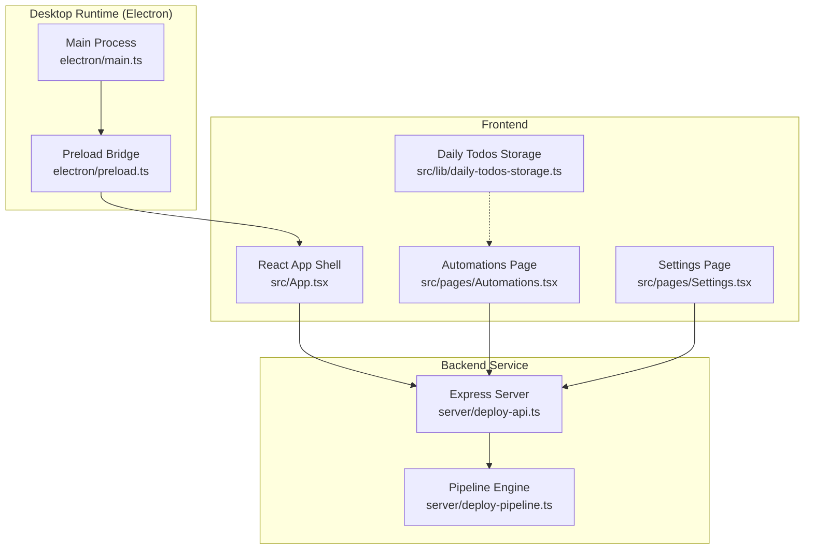
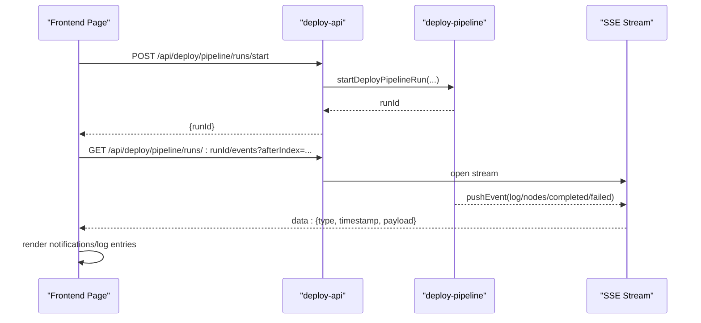
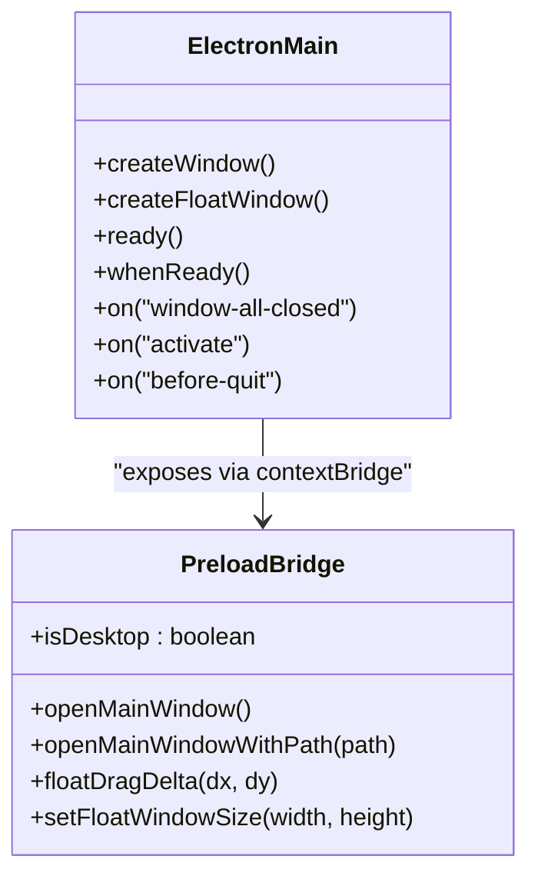
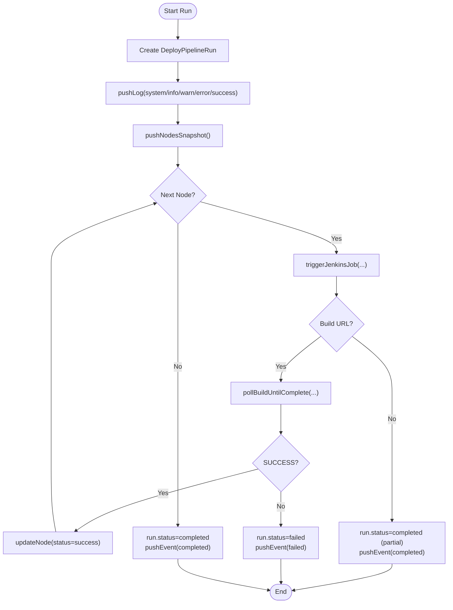
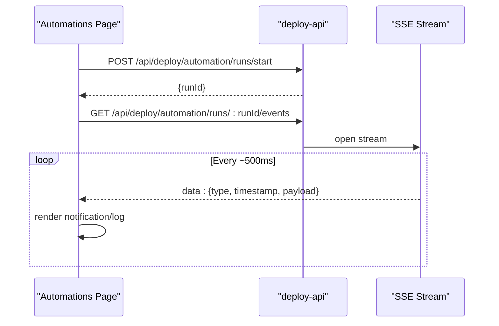
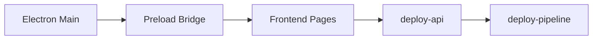

# Native Notification System

<cite>
**Referenced Files in This Document**
- [electron/main.ts](file://electron/main.ts)
- [electron/preload.ts](file://electron/preload.ts)
- [src/vite-env.d.ts](file://src/vite-env.d.ts)
- [src/App.tsx](file://src/App.tsx)
- [server/deploy-api.ts](file://server/deploy-api.ts)
- [server/deploy-pipeline.ts](file://server/deploy-pipeline.ts)
- [src/pages/Automations.tsx](file://src/pages/Automations.tsx)
- [src/pages/Settings.tsx](file://src/pages/Settings.tsx)
- [src/lib/daily-todos-storage.ts](file://src/lib/daily-todos-storage.ts)
</cite>

## Table of Contents
1. [Introduction](#introduction)
2. [Project Structure](#project-structure)
3. [Core Components](#core-components)
4. [Architecture Overview](#architecture-overview)
5. [Detailed Component Analysis](#detailed-component-analysis)
6. [Dependency Analysis](#dependency-analysis)
7. [Performance Considerations](#performance-considerations)
8. [Troubleshooting Guide](#troubleshooting-guide)
9. [Conclusion](#conclusion)

## Introduction
This document explains the native notification system of the desktop-assistant application. It covers how notifications are delivered, scheduled, and surfaced to users; how different notification types are modeled; and how the system integrates with the desktop environment and platform-specific behaviors. It also documents persistence, grouping, and user preference management, along with examples of triggers and troubleshooting steps across operating systems.

The system is composed of:
- A desktop runtime built with Electron that exposes a small native surface to the renderer.
- A backend service (deploy-api) that orchestrates deployments and automations, emitting structured events.
- A frontend that subscribes to event streams and renders notifications and logs.
- Local storage for user preferences and daily todos.

## Project Structure
The notification system spans three layers:
- Desktop layer: Electron main process and preload bridge expose native capabilities to the renderer.
- Backend layer: deploy-api and deploy-pipeline manage deployment orchestration and emit events.
- Frontend layer: React pages subscribe to SSE streams and render notifications and logs.

**Diagram sources**
- [electron/main.ts:1-434](file://electron/main.ts#L1-L434)
- [electron/preload.ts:1-21](file://electron/preload.ts#L1-L21)
- [src/App.tsx:1-136](file://src/App.tsx#L1-L136)
- [server/deploy-api.ts:1-1735](file://server/deploy-api.ts#L1-L1735)
- [server/deploy-pipeline.ts:1-419](file://server/deploy-pipeline.ts#L1-L419)
- [src/pages/Automations.tsx:1-513](file://src/pages/Automations.tsx#L1-L513)
- [src/pages/Settings.tsx:1-348](file://src/pages/Settings.tsx#L1-L348)
- [src/lib/daily-todos-storage.ts:1-133](file://src/lib/daily-todos-storage.ts#L1-L133)

**Section sources**
- [electron/main.ts:1-434](file://electron/main.ts#L1-L434)
- [electron/preload.ts:1-21](file://electron/preload.ts#L1-L21)
- [src/App.tsx:1-136](file://src/App.tsx#L1-L136)
- [server/deploy-api.ts:1-1735](file://server/deploy-api.ts#L1-L1735)
- [server/deploy-pipeline.ts:1-419](file://server/deploy-pipeline.ts#L1-L419)
- [src/pages/Automations.tsx:1-513](file://src/pages/Automations.tsx#L1-L513)
- [src/pages/Settings.tsx:1-348](file://src/pages/Settings.tsx#L1-L348)
- [src/lib/daily-todos-storage.ts:1-133](file://src/lib/daily-todos-storage.ts#L1-L133)

## Core Components
- Electron desktop surface: The main process creates windows and exposes a small API via preload to the renderer. The preload bridge defines a typed window object that the renderer can use to trigger native actions (e.g., opening the main window).
- Event-driven backend: deploy-api exposes endpoints for automation and deployment orchestration. It emits Server-Sent Events (SSE) for live updates during runs.
- Pipeline engine: deploy-pipeline manages DAG-like deployment runs, pushing structured events (logs, node snapshots, completion/failure) into memory and to clients via SSE.
- Frontend subscription: Pages subscribe to SSE streams and render notifications/logs. The Automations page demonstrates scheduled runs and event consumption.
- Persistence and preferences: Local storage persists daily todos and preferences; the Settings page manages environment variables and credentials that influence notification behavior.

**Section sources**
- [electron/preload.ts:1-21](file://electron/preload.ts#L1-L21)
- [src/vite-env.d.ts:1-23](file://src/vite-env.d.ts#L1-L23)
- [server/deploy-api.ts:1440-1503](file://server/deploy-api.ts#L1440-L1503)
- [server/deploy-pipeline.ts:29-82](file://server/deploy-pipeline.ts#L29-L82)
- [src/pages/Automations.tsx:79-513](file://src/pages/Automations.tsx#L79-L513)
- [src/pages/Settings.tsx:1-348](file://src/pages/Settings.tsx#L1-L348)
- [src/lib/daily-todos-storage.ts:1-133](file://src/lib/daily-todos-storage.ts#L1-L133)

## Architecture Overview
The notification delivery architecture is event-driven:
- Backend generates structured events during automation and deployment runs.
- Frontend subscribes to SSE endpoints and renders notifications/log entries.
- Desktop integration is minimal: Electron main process and preload provide a controlled bridge to native actions (e.g., opening the main window).

**Diagram sources**
- [server/deploy-api.ts:1440-1503](file://server/deploy-api.ts#L1440-L1503)
- [server/deploy-api.ts:1462-1503](file://server/deploy-api.ts#L1462-L1503)
- [server/deploy-pipeline.ts:61-82](file://server/deploy-pipeline.ts#L61-L82)
- [server/deploy-pipeline.ts:225-418](file://server/deploy-pipeline.ts#L225-L418)

## Detailed Component Analysis

### Electron Desktop Surface
- Main process: Creates and manages BrowserWindows, handles lifecycle events, and ensures the desktop UI is ready before exposing features.
- Preload bridge: Exposes a typed object to the renderer, enabling controlled interactions like opening the main window or adjusting the floating dock window.

**Diagram sources**
- [electron/main.ts:259-433](file://electron/main.ts#L259-L433)
- [electron/preload.ts:1-21](file://electron/preload.ts#L1-L21)

**Section sources**
- [electron/main.ts:259-433](file://electron/main.ts#L259-L433)
- [electron/preload.ts:1-21](file://electron/preload.ts#L1-L21)
- [src/vite-env.d.ts:3-14](file://src/vite-env.d.ts#L3-L14)

### Backend Orchestration and Event Emission
- Pipeline engine: Manages run state, pushes structured events (logs, node snapshots, completion/failure), and maintains in-memory run history with pruning.
- SSE endpoints: Serve incremental event streams for both deployment pipeline runs and automation runs.

**Diagram sources**
- [server/deploy-pipeline.ts:182-418](file://server/deploy-pipeline.ts#L182-L418)
- [server/deploy-api.ts:1440-1503](file://server/deploy-api.ts#L1440-L1503)

**Section sources**
- [server/deploy-pipeline.ts:18-47](file://server/deploy-pipeline.ts#L18-L47)
- [server/deploy-pipeline.ts:61-82](file://server/deploy-pipeline.ts#L61-L82)
- [server/deploy-pipeline.ts:139-180](file://server/deploy-pipeline.ts#L139-L180)
- [server/deploy-api.ts:1440-1503](file://server/deploy-api.ts#L1440-L1503)
- [server/deploy-api.ts:1537-1564](file://server/deploy-api.ts#L1537-L1564)

### Frontend Subscription and Rendering
- Automations page: Demonstrates scheduled automation runs and SSE consumption for live updates.
- Settings page: Manages environment variables that influence backend behavior (e.g., Jenkins/Jira credentials), indirectly affecting notification content and availability.
- Daily todos storage: Persists user preferences and daily tasks, supporting reminder-style notifications.

**Diagram sources**
- [server/deploy-api.ts:1516-1535](file://server/deploy-api.ts#L1516-L1535)
- [server/deploy-api.ts:1537-1564](file://server/deploy-api.ts#L1537-L1564)
- [src/pages/Automations.tsx:79-513](file://src/pages/Automations.tsx#L79-L513)

**Section sources**
- [src/pages/Automations.tsx:79-513](file://src/pages/Automations.tsx#L79-L513)
- [src/pages/Settings.tsx:1-348](file://src/pages/Settings.tsx#L1-L348)
- [src/lib/daily-todos-storage.ts:1-133](file://src/lib/daily-todos-storage.ts#L1-L133)

### Notification Types and Content
- Deployment status updates: Emitted as structured events (logs, node snapshots, completion/failure) during pipeline runs. These are surfaced as notifications/log entries in the frontend.
- Task reminders: Scheduled automation runs (daily or weekly) produce events consumed by the Automations page, which can be treated as reminders.
- System alerts: Health checks and configuration hints are exposed via backend endpoints and rendered as alerts in the UI.

Examples of notification triggers:
- Starting a deployment pipeline run via the backend endpoint.
- Starting a scheduled automation run via the backend endpoint.
- Health checks indicating configuration issues.

Custom notification content:
- The backend emits structured payloads with timestamps and levels; the frontend renders these as notifications/log entries.

**Section sources**
- [server/deploy-api.ts:1440-1503](file://server/deploy-api.ts#L1440-L1503)
- [server/deploy-api.ts:1516-1535](file://server/deploy-api.ts#L1516-L1535)
- [server/deploy-pipeline.ts:68-82](file://server/deploy-pipeline.ts#L68-L82)
- [src/pages/Automations.tsx:79-513](file://src/pages/Automations.tsx#L79-L513)

### Platform-Specific Behaviors and Desktop Integration
- Electron main process controls window creation and visibility, ensuring the desktop UI is ready before exposing features.
- Preload bridge exposes a typed API to the renderer for controlled interactions (e.g., opening the main window).
- The application does not rely on OS-native notification APIs; notifications are rendered within the Electron app UI.

**Section sources**
- [electron/main.ts:389-433](file://electron/main.ts#L389-L433)
- [electron/preload.ts:1-21](file://electron/preload.ts#L1-L21)
- [src/App.tsx:121-127](file://src/App.tsx#L121-L127)

### Persistence, Grouping, and User Preferences
- Persistence: Daily todos and preferences are stored in local storage, enabling reminders and grouping of related tasks.
- Grouping: Notifications are grouped by run ID and displayed as a timeline of events; node snapshots provide grouped views of pipeline stages.
- User preferences: Environment variables (e.g., Jenkins/Jira credentials) are managed via the Settings page, influencing backend behavior and notification content.

**Section sources**
- [src/lib/daily-todos-storage.ts:1-133](file://src/lib/daily-todos-storage.ts#L1-L133)
- [server/deploy-pipeline.ts:149-180](file://server/deploy-pipeline.ts#L149-L180)
- [src/pages/Settings.tsx:1-348](file://src/pages/Settings.tsx#L1-L348)

## Dependency Analysis
The notification system depends on:
- Electron main/preload for desktop integration.
- Express server for orchestration and SSE.
- React pages for rendering and consuming events.

**Diagram sources**
- [electron/main.ts:1-434](file://electron/main.ts#L1-L434)
- [electron/preload.ts:1-21](file://electron/preload.ts#L1-L21)
- [server/deploy-api.ts:1-1735](file://server/deploy-api.ts#L1-L1735)
- [server/deploy-pipeline.ts:1-419](file://server/deploy-pipeline.ts#L1-L419)

**Section sources**
- [electron/main.ts:1-434](file://electron/main.ts#L1-L434)
- [electron/preload.ts:1-21](file://electron/preload.ts#L1-L21)
- [server/deploy-api.ts:1-1735](file://server/deploy-api.ts#L1-L1735)
- [server/deploy-pipeline.ts:1-419](file://server/deploy-pipeline.ts#L1-L419)

## Performance Considerations
- SSE streaming: The backend streams events at fixed intervals; tune polling intervals to balance responsiveness and bandwidth.
- Memory management: The pipeline engine prunes old runs to keep memory bounded; ensure limits are appropriate for typical workloads.
- Frontend rendering: Batch updates and avoid unnecessary re-renders when handling frequent events.

[No sources needed since this section provides general guidance]

## Troubleshooting Guide
Common issues and resolutions:
- Backend not reachable: Verify the backend is running and listening on the expected port; check health endpoints for configuration status.
- SSE connection drops: Confirm network stability and CORS settings; ensure the client reconnects on close.
- Missing credentials: Ensure required environment variables (e.g., Jenkins/Jira) are configured via the Settings page; missing credentials can prevent triggering notifications.
- Permission handling: The application does not request OS-level notification permissions; ensure the Electron window remains focused so users see UI notifications.
- Opt-out mechanisms: There is no explicit opt-out for notifications; disable automation schedules or restrict backend access to reduce unwanted events.

**Section sources**
- [server/deploy-api.ts:887-908](file://server/deploy-api.ts#L887-L908)
- [src/pages/Settings.tsx:1-348](file://src/pages/Settings.tsx#L1-L348)
- [electron/main.ts:389-433](file://electron/main.ts#L389-L433)

## Conclusion
The native notification system is implemented as an in-app event-driven mechanism. The backend emits structured events during deployments and automations, and the frontend consumes these via SSE to render notifications and logs. Desktop integration is minimal and controlled via Electron’s preload bridge. Persistence and preferences are handled locally, enabling reminders and grouping. While OS-native notification APIs are not used, the current design provides a robust, cross-platform notification experience within the Electron app.