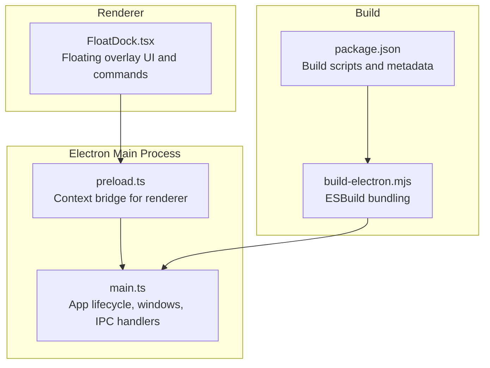
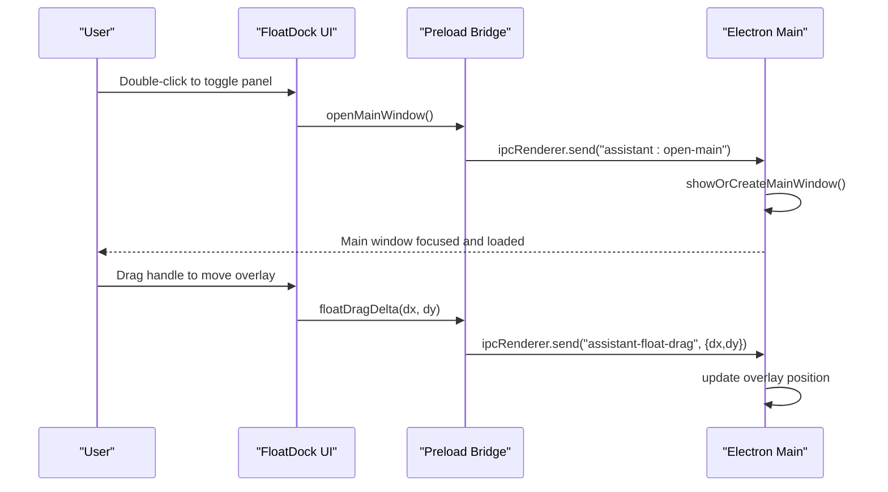
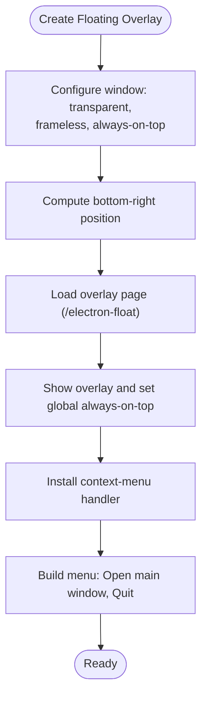
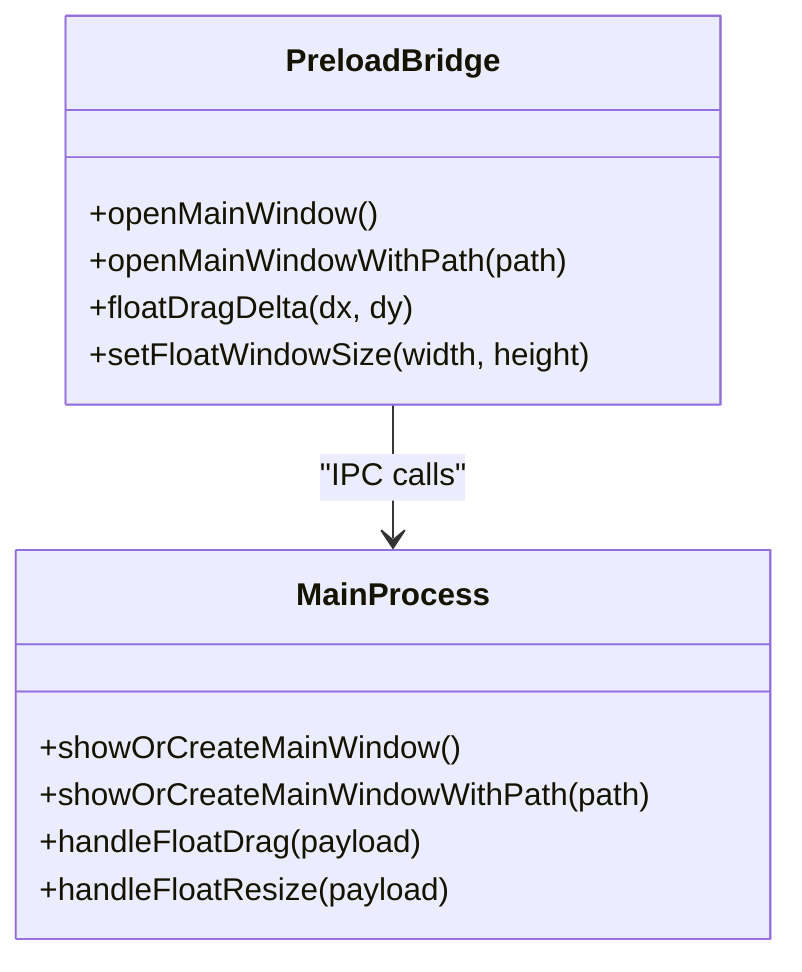
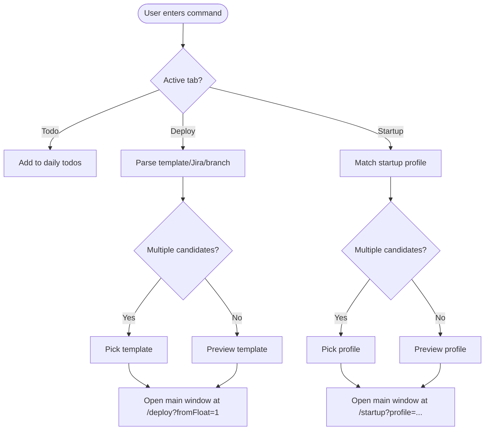
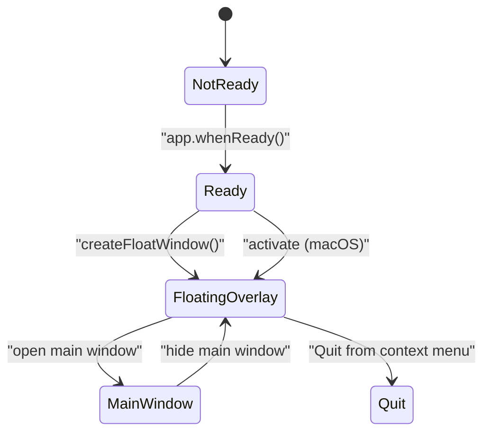
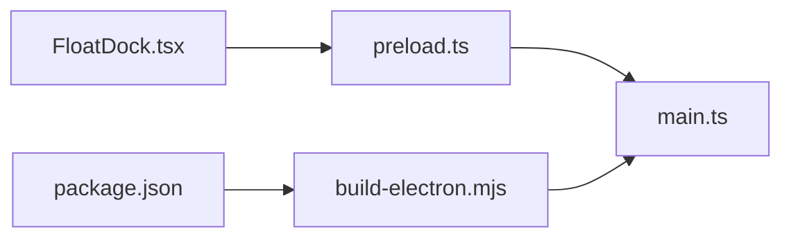

# System Tray Integration

<cite>
**Referenced Files in This Document**
- [electron/main.ts](file://electron/main.ts)
- [electron/preload.ts](file://electron/preload.ts)
- [src/pages/FloatDock.tsx](file://src/pages/FloatDock.tsx)
- [scripts/build-electron.mjs](file://scripts/build-electron.mjs)
- [package.json](file://package.json)
</cite>

## Table of Contents
1. [Introduction](#introduction)
2. [Project Structure](#project-structure)
3. [Core Components](#core-components)
4. [Architecture Overview](#architecture-overview)
5. [Detailed Component Analysis](#detailed-component-analysis)
6. [Dependency Analysis](#dependency-analysis)
7. [Performance Considerations](#performance-considerations)
8. [Troubleshooting Guide](#troubleshooting-guide)
9. [Conclusion](#conclusion)

## Introduction
This document explains the system tray integration and background operation model implemented in the desktop application. The project provides a floating dock overlay and a main application window. While the current implementation does not expose a traditional system tray icon, it achieves tray-like functionality via a floating overlay window with a context menu and keyboard-driven controls. The document covers:
- Floating overlay behavior and platform-specific positioning and visibility
- Tray-like context menu and quick actions
- Background operation and lifecycle management
- IPC bridge enabling the renderer to control the main window and overlay
- Platform-specific behaviors across Windows, macOS, and Linux
- Troubleshooting and customization tips

## Project Structure
The tray integration is implemented in the Electron main process and exposed to the renderer via a preload bridge. The floating overlay is a dedicated page rendered inside a special BrowserWindow.

**Diagram sources**
- [electron/main.ts:1-434](file://electron/main.ts#L1-L434)
- [electron/preload.ts:1-21](file://electron/preload.ts#L1-L21)
- [src/pages/FloatDock.tsx:1-638](file://src/pages/FloatDock.tsx#L1-L638)
- [scripts/build-electron.mjs:1-76](file://scripts/build-electron.mjs#L1-L76)
- [package.json:1-99](file://package.json#L1-L99)

**Section sources**
- [electron/main.ts:1-434](file://electron/main.ts#L1-L434)
- [electron/preload.ts:1-21](file://electron/preload.ts#L1-L21)
- [src/pages/FloatDock.tsx:1-638](file://src/pages/FloatDock.tsx#L1-L638)
- [scripts/build-electron.mjs:1-76](file://scripts/build-electron.mjs#L1-L76)
- [package.json:1-99](file://package.json#L1-L99)

## Core Components
- Floating overlay window: A small always-on-top, transparent, borderless window positioned at the bottom-right corner. It hosts the floating dock UI and exposes a context menu.
- Preload bridge: Exposes a typed API to the renderer for opening the main window, moving the overlay, and resizing it.
- Renderer floating dock: Implements quick actions (add todo, deploy, startup), drag-and-drop movement, and keyboard shortcuts.

Key responsibilities:
- Floating overlay creation, positioning, and context menu
- IPC handlers for window control and overlay manipulation
- Renderer-side UI and command resolution logic

**Section sources**
- [electron/main.ts:311-387](file://electron/main.ts#L311-L387)
- [electron/preload.ts:3-20](file://electron/preload.ts#L3-L20)
- [src/pages/FloatDock.tsx:111-638](file://src/pages/FloatDock.tsx#L111-L638)

## Architecture Overview
The system integrates a floating overlay with the main application window. The overlay acts as a “tray-like” control surface, while the main window handles deep navigation and complex workflows.

**Diagram sources**
- [electron/main.ts:47-59](file://electron/main.ts#L47-L59)
- [electron/main.ts:61-94](file://electron/main.ts#L61-L94)
- [electron/preload.ts:5-19](file://electron/preload.ts#L5-L19)
- [src/pages/FloatDock.tsx:314-378](file://src/pages/FloatDock.tsx#L314-L378)

## Detailed Component Analysis

### Floating Overlay Window
The floating overlay is a dedicated BrowserWindow configured for transparency and always-on-top behavior. It is positioned at the bottom-right of the primary display and shows a context menu with quick actions.

**Diagram sources**
- [electron/main.ts:311-387](file://electron/main.ts#L311-L387)

Platform-specific behaviors:
- macOS: Uses visibility options to appear above fullscreen apps and sets a specific always-on-top level.
- Windows/Linux: Uses a generic always-on-top flag.

**Section sources**
- [electron/main.ts:311-387](file://electron/main.ts#L311-L387)

### Preload Bridge and IPC
The preload script exposes a typed API to the renderer, enabling:
- Opening the main window
- Opening the main window at a specific path
- Moving the overlay (delta-based)
- Resizing the overlay

**Diagram sources**
- [electron/preload.ts:3-20](file://electron/preload.ts#L3-L20)
- [electron/main.ts:47-59](file://electron/main.ts#L47-L59)
- [electron/main.ts:61-82](file://electron/main.ts#L61-L82)

**Section sources**
- [electron/preload.ts:1-21](file://electron/preload.ts#L1-L21)
- [electron/main.ts:47-82](file://electron/main.ts#L47-L82)

### Floating Dock UI and Quick Commands
The floating dock UI provides three quick action tabs:
- Add Todo: Records a plain-text item to today’s list
- Quick Deploy: Parses templates and Jira/branch info to draft a deployment
- Startup Projects: Matches startup profiles and opens the startup page

It also supports:
- Drag-and-drop movement via pointer events and delta IPC
- Panel expansion/collapse with dynamic sizing
- Keyboard shortcuts (Escape to close panel)
- Accessibility attributes for screen readers

**Diagram sources**
- [src/pages/FloatDock.tsx:217-312](file://src/pages/FloatDock.tsx#L217-L312)

**Section sources**
- [src/pages/FloatDock.tsx:111-638](file://src/pages/FloatDock.tsx#L111-L638)

### Application Lifecycle and Background Operation
Lifecycle management:
- App readiness initializes backend health checks and creates windows
- On macOS, the app remains active even when all windows are closed
- The floating overlay is recreated on activation if missing or hidden
- Before quit, the internal API child process is terminated gracefully

Background operation:
- The floating overlay stays visible and interactive while the main window is hidden
- The overlay can be toggled by double-clicking the core orb
- The overlay’s context menu provides quick access to the main window and quit

**Diagram sources**
- [electron/main.ts:389-426](file://electron/main.ts#L389-L426)

**Section sources**
- [electron/main.ts:389-433](file://electron/main.ts#L389-L433)

## Dependency Analysis
The tray-like integration relies on a small set of coordinated modules:
- Electron main process orchestrates windows and IPC
- Preload bridge mediates renderer-to-main communication
- Renderer floating dock implements UI and command logic
- Build pipeline packages main, preload, and API into the desktop app

**Diagram sources**
- [electron/main.ts:1-434](file://electron/main.ts#L1-L434)
- [electron/preload.ts:1-21](file://electron/preload.ts#L1-L21)
- [src/pages/FloatDock.tsx:1-638](file://src/pages/FloatDock.tsx#L1-L638)
- [scripts/build-electron.mjs:1-76](file://scripts/build-electron.mjs#L1-L76)
- [package.json:1-99](file://package.json#L1-L99)

**Section sources**
- [electron/main.ts:1-434](file://electron/main.ts#L1-L434)
- [electron/preload.ts:1-21](file://electron/preload.ts#L1-L21)
- [src/pages/FloatDock.tsx:1-638](file://src/pages/FloatDock.tsx#L1-L638)
- [scripts/build-electron.mjs:1-76](file://scripts/build-electron.mjs#L1-L76)
- [package.json:1-99](file://package.json#L1-L99)

## Performance Considerations
- Always-on-top and transparency: Keep overlay size minimal when idle to reduce GPU overhead.
- IPC batching: Group overlay resize/move operations to avoid excessive main-process updates.
- Font assets: The build pipeline removes large bundled fonts by default to speed up packaging and runtime loading.
- Dev vs prod: Use development scripts that auto-build Electron assets before launching.

[No sources needed since this section provides general guidance]

## Troubleshooting Guide
Common issues and resolutions:
- Overlay not visible or stuck behind other windows
  - Ensure always-on-top is enabled and platform-specific flags are applied.
  - Verify the overlay is shown on activate and re-created if missing.
  - Reference: [electron/main.ts:338-381](file://electron/main.ts#L338-L381), [electron/main.ts:418-426](file://electron/main.ts#L418-L426)

- Dragging does not move the overlay
  - Confirm the preload bridge exposes floatDragDelta and the renderer calls it.
  - Check that the overlay window exists and is not destroyed.
  - Reference: [electron/preload.ts:13-15](file://electron/preload.ts#L13-L15), [src/pages/FloatDock.tsx:314-378](file://src/pages/FloatDock.tsx#L314-L378)

- Panel resize not taking effect
  - Ensure setFloatWindowSize is available and main process handles assistant-float-resize.
  - Reference: [electron/main.ts:61-82](file://electron/main.ts#L61-L82), [src/pages/FloatDock.tsx:141-154](file://src/pages/FloatDock.tsx#L141-L154)

- Context menu not appearing
  - Verify the overlay’s context-menu handler is installed and the window is not destroyed.
  - Reference: [electron/main.ts:354-361](file://electron/main.ts#L354-L361)

- Platform-specific behaviors
  - macOS: Fullscreen overlay and specific always-on-top level.
  - Windows/Linux: Standard always-on-top behavior.
  - Reference: [electron/main.ts:338-381](file://electron/main.ts#L338-L381)

- Build and asset packaging
  - Ensure Electron assets are built before starting the desktop app.
  - Reference: [scripts/build-electron.mjs:26-47](file://scripts/build-electron.mjs#L26-L47), [package.json:15-23](file://package.json#L15-L23)

**Section sources**
- [electron/main.ts:338-381](file://electron/main.ts#L338-L381)
- [electron/main.ts:354-361](file://electron/main.ts#L354-L361)
- [electron/main.ts:418-426](file://electron/main.ts#L418-L426)
- [electron/preload.ts:13-15](file://electron/preload.ts#L13-L15)
- [src/pages/FloatDock.tsx:141-154](file://src/pages/FloatDock.tsx#L141-L154)
- [scripts/build-electron.mjs:26-47](file://scripts/build-electron.mjs#L26-L47)
- [package.json:15-23](file://package.json#L15-L23)

## Conclusion
The project implements a tray-like experience through a floating overlay window and a preload bridge. While a traditional system tray icon is not present, the overlay provides:
- Persistent access to quick commands
- Context menu actions
- Cross-platform always-on-top behavior
- Seamless integration with the main application window

Future enhancements could include a native system tray icon with status indicators and menus, but the current design offers a robust, cross-platform alternative with rich interactivity.