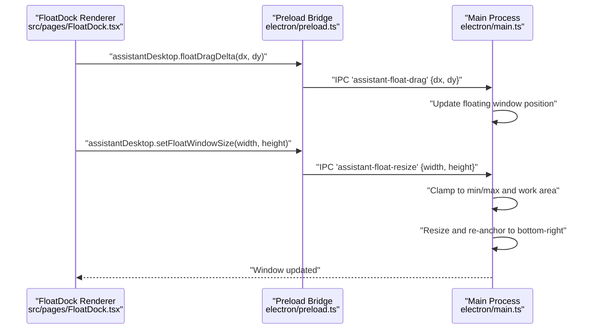
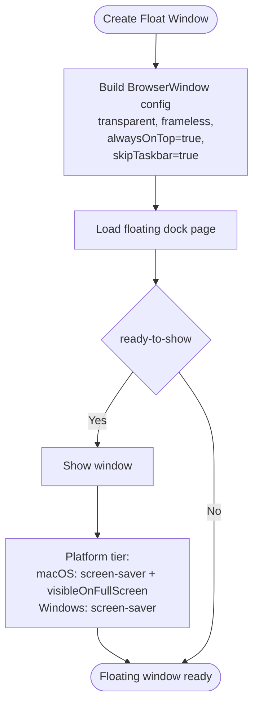
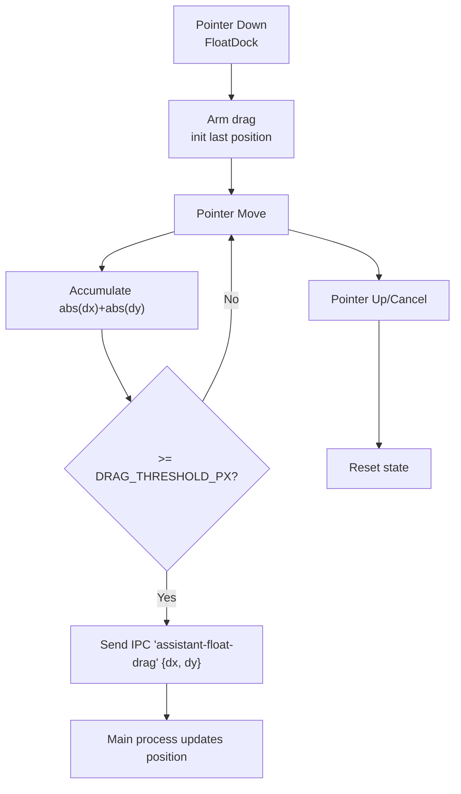
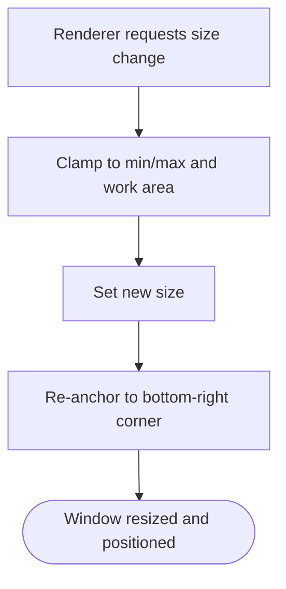
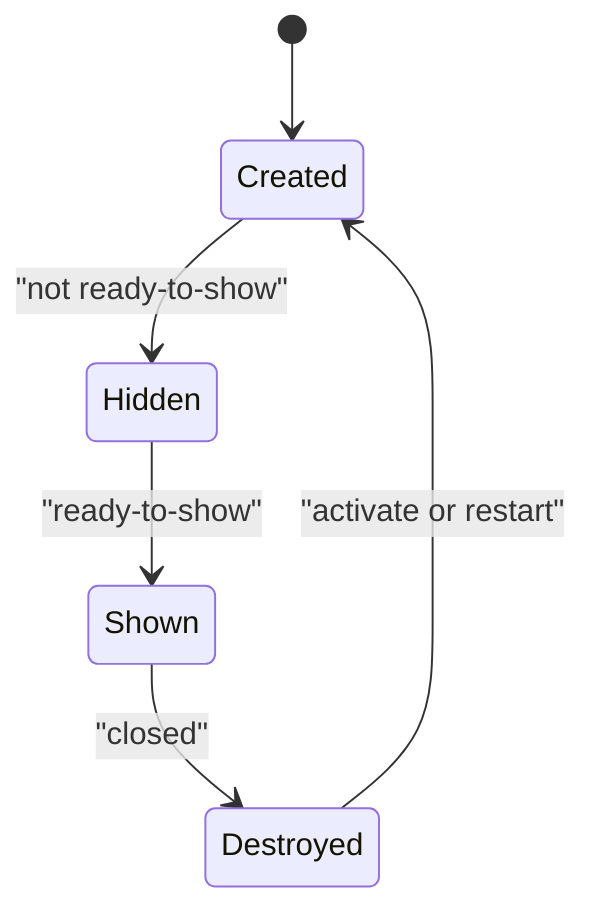
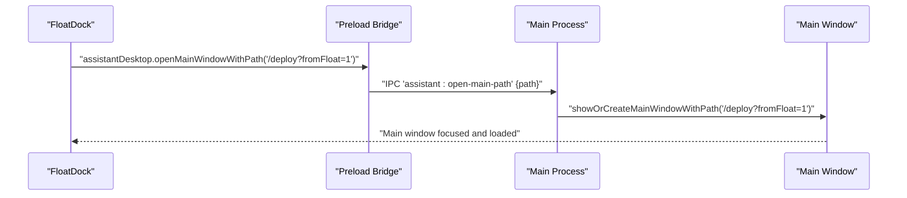
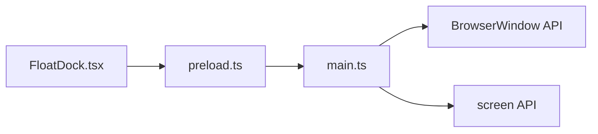

# Window Management Features

<cite>
**Referenced Files in This Document**
- [electron/main.ts](file://electron/main.ts)
- [electron/preload.ts](file://electron/preload.ts)
- [src/pages/FloatDock.tsx](file://src/pages/FloatDock.tsx)
- [src/lib/float-command/float-deploy-payload.ts](file://src/lib/float-command/float-deploy-payload.ts)
- [src/lib/daily-todos-storage.ts](file://src/lib/daily-todos-storage.ts)
- [src/lib/float-command/recent.ts](file://src/lib/float-command/recent.ts)
</cite>

## Table of Contents
1. [Introduction](#introduction)
2. [Project Structure](#project-structure)
3. [Core Components](#core-components)
4. [Architecture Overview](#architecture-overview)
5. [Detailed Component Analysis](#detailed-component-analysis)
6. [Dependency Analysis](#dependency-analysis)
7. [Performance Considerations](#performance-considerations)
8. [Troubleshooting Guide](#troubleshooting-guide)
9. [Conclusion](#conclusion)
10. [Appendices](#appendices)

## Introduction
This document explains the window management features implemented in the desktop application, focusing on floating windows, always-on-top behavior, multi-monitor awareness, window positioning and resizing, transparency effects, and the integration between the main application window and the floating dock. It also covers IPC communication for synchronized window state, lifecycle management, focus handling, z-index positioning, and practical guidance for persistence, restoration after system changes, and troubleshooting.

## Project Structure
The window management spans three layers:
- Electron main process: creates and controls BrowserWindows, handles IPC, and manages platform-specific window attributes.
- Preload bridge: exposes a controlled API surface to the renderer via contextBridge.
- Renderer (React): implements the floating dock UI, user interactions, and IPC-driven window operations.

```mermaid
graph TB
subgraph "Electron Main Process"
M["electron/main.ts<br/>Creates main and float windows<br/>Handles IPC handlers"]
end
subgraph "Preload Bridge"
P["electron/preload.ts<br/>Exposes assistantDesktop API"]
end
subgraph "Renderer (React)"
F["src/pages/FloatDock.tsx<br/>Floating dock UI and interactions"]
end
M <- --> P
P <- --> F
```

**Diagram sources**
- [electron/main.ts:259-433](file://electron/main.ts#L259-L433)
- [electron/preload.ts:1-21](file://electron/preload.ts#L1-L21)
- [src/pages/FloatDock.tsx:111-638](file://src/pages/FloatDock.tsx#L111-L638)

**Section sources**
- [electron/main.ts:259-433](file://electron/main.ts#L259-L433)
- [electron/preload.ts:1-21](file://electron/preload.ts#L1-L21)
- [src/pages/FloatDock.tsx:111-638](file://src/pages/FloatDock.tsx#L111-L638)

## Core Components
- Floating Dock (renderer): Provides a compact always-on-top overlay that expands into a command panel. It communicates with the main process to drag and resize the floating window.
- Main Window (main process): The primary SPA window, navigated programmatically by the floating dock.
- Preload Bridge (main process): Exposes safe IPC functions to the renderer, including window manipulation commands.

Key responsibilities:
- Floating Dock: pointer events, drag threshold, double-tap toggle, panel expansion/collapse, IPC calls to resize and drag.
- Main Process: window creation, always-on-top, transparency, drag/resize IPC handlers, bounds anchoring, platform-specific behaviors.
- Preload Bridge: minimal API exposure, routing IPC messages to handlers.

**Section sources**
- [src/pages/FloatDock.tsx:141-171](file://src/pages/FloatDock.tsx#L141-L171)
- [electron/main.ts:311-387](file://electron/main.ts#L311-L387)
- [electron/preload.ts:3-20](file://electron/preload.ts#L3-L20)

## Architecture Overview
The floating dock integrates with the main window through IPC. The renderer triggers actions (drag delta, resize) via the preload bridge, and the main process applies the changes to the floating window’s geometry while preserving anchor constraints.



**Diagram sources**
- [src/pages/FloatDock.tsx:314-346](file://src/pages/FloatDock.tsx#L314-L346)
- [electron/preload.ts:13-19](file://electron/preload.ts#L13-L19)
- [electron/main.ts:61-94](file://electron/main.ts#L61-L94)

## Detailed Component Analysis

### Floating Window Creation and Always-On-Top Behavior
- The floating window is created with:
  - Transparent, frameless, no shadow, non-resizable, non-minimizable, non-maximizable.
  - Skipped from the taskbar, focusable, hidden initially.
  - Always-on-top with platform-specific tiers.
  - macOS-visible-on-fullscreen enabled for visibility over fullscreen apps.
- Initial placement anchors to the bottom-right of the primary display work area with a fixed margin.



**Diagram sources**
- [electron/main.ts:311-387](file://electron/main.ts#L311-L387)

**Section sources**
- [electron/main.ts:311-387](file://electron/main.ts#L311-L387)

### Dragging and Positioning System
- The renderer calculates pointer deltas and sends them to the main process via IPC.
- The main process updates the floating window position by adding the delta to the current coordinates.
- A drag threshold prevents accidental drags from small pointer jitter.



**Diagram sources**
- [src/pages/FloatDock.tsx:314-378](file://src/pages/FloatDock.tsx#L314-L378)
- [electron/preload.ts:13-15](file://electron/preload.ts#L13-L15)
- [electron/main.ts:84-94](file://electron/main.ts#L84-L94)

**Section sources**
- [src/pages/FloatDock.tsx:314-378](file://src/pages/FloatDock.tsx#L314-L378)
- [electron/preload.ts:13-15](file://electron/preload.ts#L13-L15)
- [electron/main.ts:84-94](file://electron/main.ts#L84-L94)

### Resizing and Transparency Effects
- The renderer requests size changes when expanding/collapsing the command panel.
- The main process clamps requested sizes to minimum/maximum bounds and the primary display work area, then resizes the window while anchoring the bottom-right corner to keep content visible.



**Diagram sources**
- [src/pages/FloatDock.tsx:141-154](file://src/pages/FloatDock.tsx#L141-L154)
- [electron/main.ts:61-82](file://electron/main.ts#L61-L82)

**Section sources**
- [src/pages/FloatDock.tsx:141-154](file://src/pages/FloatDock.tsx#L141-L154)
- [electron/main.ts:61-82](file://electron/main.ts#L61-L82)

### Multi-Monitor Support and Display Detection
- Current implementation uses the primary display for initial placement and size constraints.
- There is no explicit multi-monitor detection or cross-display movement logic in the referenced code paths.

Recommendations:
- To support multi-monitor setups, detect all displays and choose the one containing the cursor or the main window, then compute work areas accordingly.
- Respect per-display DPI scaling and handle display change events to recompute positions.

**Section sources**
- [electron/main.ts:71](file://electron/main.ts#L71)
- [electron/main.ts:302](file://electron/main.ts#L302)

### Window Lifecycle Management, Focus, and Z-Index
- Lifecycle:
  - Created on app ready; shown on first ready-to-show; hidden until then.
  - Restored on activation if destroyed or hidden.
  - Closed handler clears the reference.
- Focus:
  - Floating window is focusable; main window focuses on navigation.
- Z-Index:
  - Floating window set to always-on-top with platform-specific tiers to ensure visibility above normal windows.



**Diagram sources**
- [electron/main.ts:366-387](file://electron/main.ts#L366-L387)
- [electron/main.ts:418-426](file://electron/main.ts#L418-L426)
- [electron/main.ts:428-433](file://electron/main.ts#L428-L433)

**Section sources**
- [electron/main.ts:366-387](file://electron/main.ts#L366-L387)
- [electron/main.ts:418-426](file://electron/main.ts#L418-L426)
- [electron/main.ts:428-433](file://electron/main.ts#L428-L433)

### Integration Between Main Window and Floating Dock
- The floating dock can open the main window and navigate to a specific SPA route.
- A session key carries deployment draft data from the floating dock to the main window.



**Diagram sources**
- [src/pages/FloatDock.tsx:295-312](file://src/pages/FloatDock.tsx#L295-L312)
- [electron/preload.ts:9-11](file://electron/preload.ts#L9-L11)
- [electron/main.ts:51-59](file://electron/main.ts#L51-L59)

**Section sources**
- [src/pages/FloatDock.tsx:295-312](file://src/pages/FloatDock.tsx#L295-L312)
- [electron/preload.ts:9-11](file://electron/preload.ts#L9-L11)
- [electron/main.ts:51-59](file://electron/main.ts#L51-L59)

### Window State Persistence and Restoration
- Local storage is used for:
  - Daily todos persistence and deduplication.
  - Recent selections for startup profiles and deployment templates.
- Session storage is used to pass a deployment draft payload from the floating dock to the main window.

Practical guidance:
- Persist floating window geometry (size and position) in user preferences or app data to restore after restarts.
- On display change events, recompute positions relative to the new primary or target display and re-anchor to avoid off-screen placement.

**Section sources**
- [src/lib/daily-todos-storage.ts:44-77](file://src/lib/daily-todos-storage.ts#L44-L77)
- [src/lib/float-command/recent.ts:6-53](file://src/lib/float-command/recent.ts#L6-L53)
- [src/lib/float-command/float-deploy-payload.ts:1-12](file://src/lib/float-command/float-deploy-payload.ts#L1-L12)

## Dependency Analysis
- Renderer depends on preload bridge for IPC.
- Preload bridge depends on Electron’s IPC primitives.
- Main process depends on Electron APIs for BrowserWindow and screen utilities.



**Diagram sources**
- [src/pages/FloatDock.tsx:111-638](file://src/pages/FloatDock.tsx#L111-L638)
- [electron/preload.ts:1-21](file://electron/preload.ts#L1-L21)
- [electron/main.ts:259-433](file://electron/main.ts#L259-L433)

**Section sources**
- [src/pages/FloatDock.tsx:111-638](file://src/pages/FloatDock.tsx#L111-L638)
- [electron/preload.ts:1-21](file://electron/preload.ts#L1-L21)
- [electron/main.ts:259-433](file://electron/main.ts#L259-L433)

## Performance Considerations
- Avoid excessive reflows by batching drag updates and limiting resize frequency.
- Clamp sizes and positions early to prevent layout thrashing.
- Use requestAnimationFrame timing in the renderer to align with resize operations.

## Troubleshooting Guide
Common issues and remedies:
- Floating window does not move:
  - Ensure preload is loaded and assistantDesktop.floatDragDelta exists.
  - Verify IPC channel 'assistant-float-drag' is handled and the window is not destroyed.
- Floating window resizes unexpectedly:
  - Confirm clamp logic and work area boundaries match expectations.
  - Check that the bottom-right anchor preserves content visibility.
- Window appears behind others:
  - Confirm always-on-top tier and platform-specific settings.
  - On macOS, ensure visible-on-fullscreen is enabled when needed.
- Panel does not expand:
  - Verify setFloatWindowSize is exposed and called with correct dimensions.
  - Confirm main process handler is present and not overridden by external constraints.

**Section sources**
- [src/pages/FloatDock.tsx:190-196](file://src/pages/FloatDock.tsx#L190-L196)
- [electron/main.ts:61-82](file://electron/main.ts#L61-L82)
- [electron/main.ts:335](file://electron/main.ts#L335)

## Conclusion
The floating dock provides a lightweight, always-on-top overlay integrated with the main application window through a minimal IPC surface. The main process enforces platform-appropriate window behavior, constrains geometry to the primary display, and maintains anchor stability during resize. Extending support to multi-monitor environments and persistent geometry would further improve robustness and user experience.

## Appendices

### Security Considerations for Floating Windows
- Keep the floating window non-resizable and non-focusable if unnecessary to reduce attack surface.
- Restrict navigation and context menu actions; deny external links except trusted domains.
- Avoid exposing internal APIs beyond the preload bridge.

**Section sources**
- [electron/main.ts:327-352](file://electron/main.ts#L327-L352)
- [electron/preload.ts:3-20](file://electron/preload.ts#L3-L20)

### User Experience Optimization Techniques
- Use a drag threshold to prevent accidental drags.
- Provide visual feedback during drag and panel transitions.
- Anchor to the bottom-right consistently to avoid occluding content.
- Offer quick toggles (double-tap) to open/close the command panel.

**Section sources**
- [src/pages/FloatDock.tsx:314-378](file://src/pages/FloatDock.tsx#L314-L378)
- [electron/main.ts:77-82](file://electron/main.ts#L77-L82)