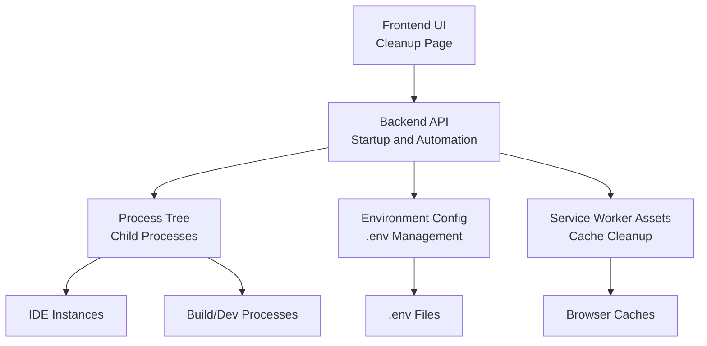
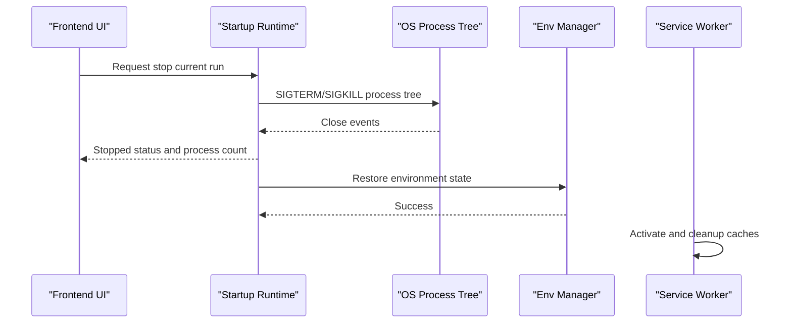
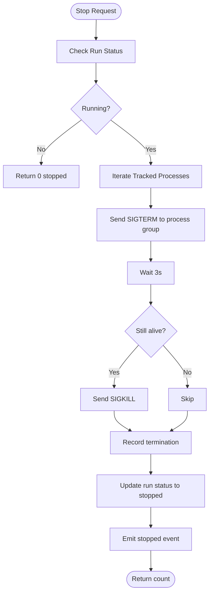
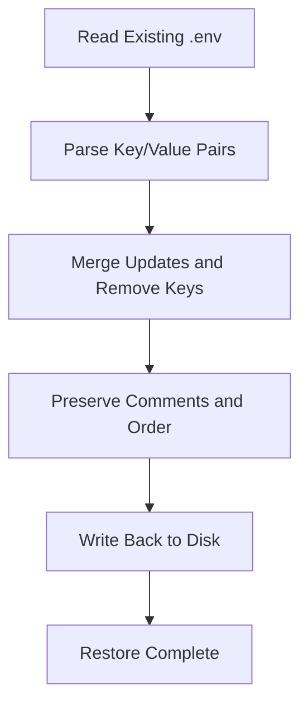
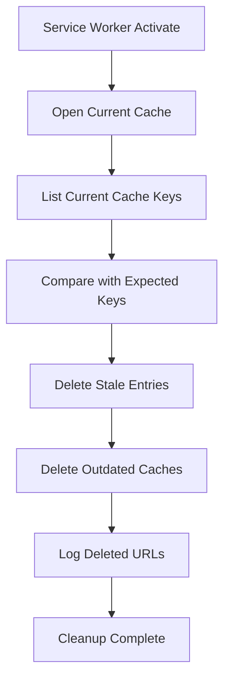
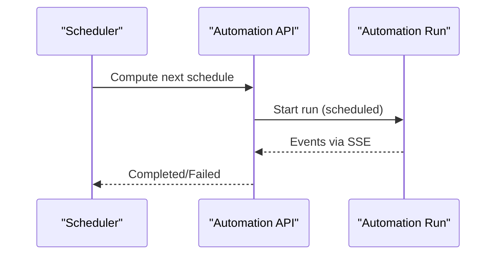
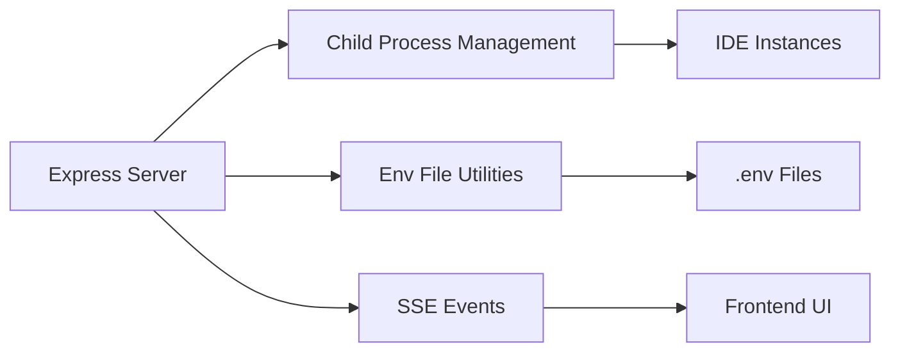

# Cleanup Automation

<cite>
**Referenced Files in This Document**
- [Cleanup.tsx](file://src/pages/Cleanup.tsx)
- [Startup.tsx](file://src/pages/Startup.tsx)
- [deploy-api.ts](file://server/deploy-api.ts)
- [assistant-workspace-config.ts](file://server/assistant-workspace-config.ts)
- [workbox-a24bf94b.js](file://dev-dist/workbox-a24bf94b.js)
- [workbox-aeb6ecaf.js](file://dev-dist/workbox-aeb6ecaf.js)
- [package.json](file://package.json)
</cite>

## Table of Contents
1. [Introduction](#introduction)
2. [Project Structure](#project-structure)
3. [Core Components](#core-components)
4. [Architecture Overview](#architecture-overview)
5. [Detailed Component Analysis](#detailed-component-analysis)
6. [Dependency Analysis](#dependency-analysis)
7. [Performance Considerations](#performance-considerations)
8. [Troubleshooting Guide](#troubleshooting-guide)
9. [Conclusion](#conclusion)
10. [Appendices](#appendices)

## Introduction
This document describes the cleanup automation system in the workbench. It explains how the system orchestrates environment cleanup during and after development workflows, including stopping running processes, closing IDE instances, removing temporary files, clearing caches, and restoring environment states. It also documents the cleanup workflow’s coordination with the startup system, process termination strategies, graceful shutdown procedures, temporary file and cache management, environment variable restoration, scheduling and triggers, verification and confirmation mechanisms, troubleshooting, and integration with deployment pipelines.

## Project Structure
The cleanup automation spans both the frontend UI and backend runtime:
- Frontend page for cleanup is present but currently marked as “under development.”
- Backend runtime supports process lifecycle control for startup runs and integrates with environment configuration management.
- Service worker assets include cache cleanup logic for web delivery.

**Diagram sources**
- [Cleanup.tsx:1-26](file://src/pages/Cleanup.tsx#L1-L26)
- [Startup.tsx:126-661](file://src/pages/Startup.tsx#L126-L661)
- [deploy-api.ts:126-201](file://server/deploy-api.ts#L126-L201)
- [assistant-workspace-config.ts:145-201](file://server/assistant-workspace-config.ts#L145-L201)
- [workbox-a24bf94b.js:2533-3471](file://dev-dist/workbox-a24bf94b.js#L2533-L3471)

**Section sources**
- [Cleanup.tsx:1-26](file://src/pages/Cleanup.tsx#L1-L26)
- [Startup.tsx:126-661](file://src/pages/Startup.tsx#L126-L661)
- [deploy-api.ts:126-201](file://server/deploy-api.ts#L126-L201)
- [assistant-workspace-config.ts:145-201](file://server/assistant-workspace-config.ts#L145-L201)
- [workbox-a24bf94b.js:2533-3471](file://dev-dist/workbox-a24bf94b.js#L2533-L3471)

## Core Components
- Cleanup UI page: Placeholder page indicating cleanup functionality is under development.
- Startup runtime: Manages IDE launches and child processes, with stop and termination logic.
- Environment configuration manager: Reads, merges, and writes environment files safely.
- Service worker cache cleanup: Removes outdated caches and stale entries during activation.

**Section sources**
- [Cleanup.tsx:1-26](file://src/pages/Cleanup.tsx#L1-L26)
- [deploy-api.ts:126-201](file://server/deploy-api.ts#L126-L201)
- [assistant-workspace-config.ts:145-201](file://server/assistant-workspace-config.ts#L145-L201)
- [workbox-a24bf94b.js:2533-3471](file://dev-dist/workbox-a24bf94b.js#L2533-L3471)

## Architecture Overview
The cleanup workflow is orchestrated by the backend runtime and coordinated with the frontend UI. The runtime tracks child processes spawned during startup and provides controlled termination. Environment restoration leverages .env merging and writing utilities. Service worker assets implement cache cleanup routines.

**Diagram sources**
- [Startup.tsx:271-283](file://src/pages/Startup.tsx#L271-L283)
- [deploy-api.ts:160-189](file://server/deploy-api.ts#L160-L189)
- [assistant-workspace-config.ts:145-201](file://server/assistant-workspace-config.ts#L145-L201)
- [workbox-a24bf94b.js:2945-3108](file://dev-dist/workbox-a24bf94b.js#L2945-L3108)

## Detailed Component Analysis

### Cleanup UI Page
- Purpose: Provides a dedicated UI surface for cleanup actions.
- Status: Placeholder page indicates development is ongoing.
- Next steps: Integrate with backend cleanup endpoints and process termination APIs.

**Section sources**
- [Cleanup.tsx:1-26](file://src/pages/Cleanup.tsx#L1-L26)

### Startup Runtime and Process Termination
- Process tracking: The runtime maintains a map of child processes per run and cleans up on close.
- Termination strategy:
  - Sends SIGTERM to the process group, followed by SIGKILL after a delay if needed.
  - Prevents redundant kills and ensures cleanup of run state.
- Stop endpoint: Returns the number of terminated processes and emits a stopped event.

**Diagram sources**
- [deploy-api.ts:160-189](file://server/deploy-api.ts#L160-L189)

**Section sources**
- [deploy-api.ts:126-201](file://server/deploy-api.ts#L126-L201)
- [Startup.tsx:271-283](file://src/pages/Startup.tsx#L271-L283)

### Environment Variable Restoration and Configuration Cleanup
- Parsing and escaping: Supports KEY=value parsing, quoting, and escaping for robust .env handling.
- Merge and write: Merges updates and deletions into existing content while preserving comments and order; writes atomically.
- Safe operations: Uses safe file write and directory creation to avoid partial writes.

**Diagram sources**
- [assistant-workspace-config.ts:114-143](file://server/assistant-workspace-config.ts#L114-L143)
- [assistant-workspace-config.ts:153-201](file://server/assistant-workspace-config.ts#L153-L201)

**Section sources**
- [assistant-workspace-config.ts:114-201](file://server/assistant-workspace-config.ts#L114-L201)

### Temporary File Management and Cache Clearing
- Temporary file utilities: The project includes temporary file and directory helpers suitable for ephemeral cleanup.
- Service worker cache cleanup:
  - During activation, compares current cached URLs with expected ones and deletes stale entries.
  - Removes outdated caches containing a specific substring pattern.
  - Logs details of deleted cache entries for visibility.

**Diagram sources**
- [workbox-a24bf94b.js:2945-3108](file://dev-dist/workbox-a24bf94b.js#L2945-L3108)
- [workbox-a24bf94b.js:3464-3471](file://dev-dist/workbox-a24bf94b.js#L3464-L3471)

**Section sources**
- [workbox-a24bf94b.js:2533-3471](file://dev-dist/workbox-a24bf94b.js#L2533-L3471)
- [workbox-aeb6ecaf.js:2945-3329](file://dev-dist/workbox-aeb6ecaf.js#L2945-L3329)

### Cleanup Scheduling and Automated Triggers
- Automation tasks: The backend supports scheduled automation runs with configurable schedules and environment variables.
- Scheduling logic: Parses daily schedules, computes next occurrence, and starts runs accordingly.
- Manual triggers: Frontend can start automation runs via SSE-backed endpoints.

**Diagram sources**
- [deploy-api.ts:831-884](file://server/deploy-api.ts#L831-L884)
- [deploy-api.ts:1516-1564](file://server/deploy-api.ts#L1516-L1564)

**Section sources**
- [deploy-api.ts:831-884](file://server/deploy-api.ts#L831-L884)
- [deploy-api.ts:1516-1564](file://server/deploy-api.ts#L1516-L1564)

### Cleanup Scenarios and Team Environments
- Single-project development: Stop a single IDE instance and associated dev processes.
- Multi-project workspace: Terminate multiple child processes across projects and restore environment variables.
- CI/CD integration: Use automation task scheduling to periodically clean stale caches and temporary artifacts.

[No sources needed since this section provides general guidance]

### Cleanup Verification and Confirmation
- Process termination verification: The stop endpoint returns the number of terminated processes and emits a stopped event.
- Environment restoration verification: Merge and write operations preserve existing content; verify by re-reading the .env file.
- Cache verification: Inspect browser developer tools for cache deletions and logs emitted by the service worker.

**Section sources**
- [deploy-api.ts:177-189](file://server/deploy-api.ts#L177-L189)
- [assistant-workspace-config.ts:153-201](file://server/assistant-workspace-config.ts#L153-L201)
- [workbox-a24bf94b.js:2560-2566](file://dev-dist/workbox-a24bf94b.js#L2560-L2566)

### Troubleshooting Guide
- Processes not terminating:
  - Confirm the process group receives SIGTERM; check for child process spawning patterns.
  - Verify the stop endpoint is invoked and returns a positive count.
- Environment not restored:
  - Ensure merge keys are correct and .env file path is writable.
  - Validate parsing rules for quotes and special characters.
- Cache not cleared:
  - Confirm the service worker activation occurred and expected cache keys differ from current ones.
  - Review logs for deleted cache URLs.

**Section sources**
- [deploy-api.ts:160-189](file://server/deploy-api.ts#L160-L189)
- [assistant-workspace-config.ts:114-143](file://server/assistant-workspace-config.ts#L114-L143)
- [workbox-a24bf94b.js:2560-2566](file://dev-dist/workbox-a24bf94b.js#L2560-L2566)

### Integration with Deployment Pipelines
- Automation tasks can be scheduled to run at off-peak hours to minimize impact on active development.
- Cache cleanup reduces storage overhead and improves cache hit rates.
- Environment restoration ensures consistent pipeline behavior across runs.

[No sources needed since this section provides general guidance]

## Dependency Analysis
The cleanup automation relies on:
- Express-based backend for process lifecycle and SSE.
- Child process management for IDE and build processes.
- Environment configuration utilities for .env manipulation.
- Service worker assets for client-side cache cleanup.

**Diagram sources**
- [deploy-api.ts:126-201](file://server/deploy-api.ts#L126-L201)
- [assistant-workspace-config.ts:145-201](file://server/assistant-workspace-config.ts#L145-L201)
- [Startup.tsx:206-269](file://src/pages/Startup.tsx#L206-L269)

**Section sources**
- [deploy-api.ts:126-201](file://server/deploy-api.ts#L126-L201)
- [assistant-workspace-config.ts:145-201](file://server/assistant-workspace-config.ts#L145-L201)
- [Startup.tsx:206-269](file://src/pages/Startup.tsx#L206-L269)

## Performance Considerations
- Process termination: Prefer SIGTERM to allow graceful shutdown; fallback to SIGKILL only after a timeout.
- Cache cleanup: Batch deletions and log summaries to reduce overhead and improve observability.
- Environment writes: Atomic writes and minimal file I/O to avoid blocking.

[No sources needed since this section provides general guidance]

## Troubleshooting Guide
- Process termination issues:
  - Use the stop endpoint and inspect returned process counts.
  - Verify process groups and child process spawning.
- Environment restoration:
  - Validate .env path and permissions.
  - Re-parse and re-merge to confirm correctness.
- Cache cleanup:
  - Confirm activation and expected cache key differences.
  - Review logs for deleted entries.

**Section sources**
- [deploy-api.ts:177-189](file://server/deploy-api.ts#L177-L189)
- [assistant-workspace-config.ts:153-201](file://server/assistant-workspace-config.ts#L153-L201)
- [workbox-a24bf94b.js:2560-2566](file://dev-dist/workbox-a24bf94b.js#L2560-L2566)

## Conclusion
The cleanup automation system centers on controlled process termination, environment restoration, and cache cleanup. While the UI page is under development, the backend provides robust primitives for stopping processes, managing environment state, and cleaning caches. Scheduling and SSE enable automated and observable cleanup workflows that integrate with both development and deployment contexts.

[No sources needed since this section summarizes without analyzing specific files]

## Appendices
- Build and dev scripts: Useful for local testing and verifying cleanup behavior in development mode.
- Temporary file utilities: Available for ephemeral cleanup tasks.

**Section sources**
- [package.json:9-30](file://package.json#L9-L30)