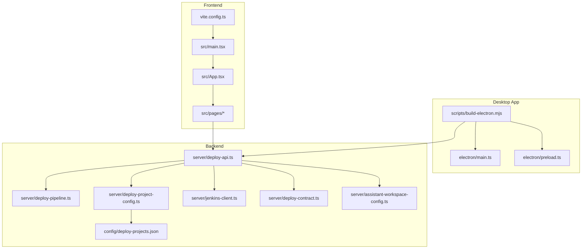
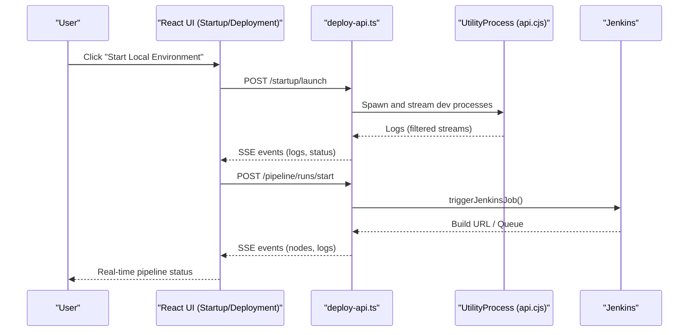
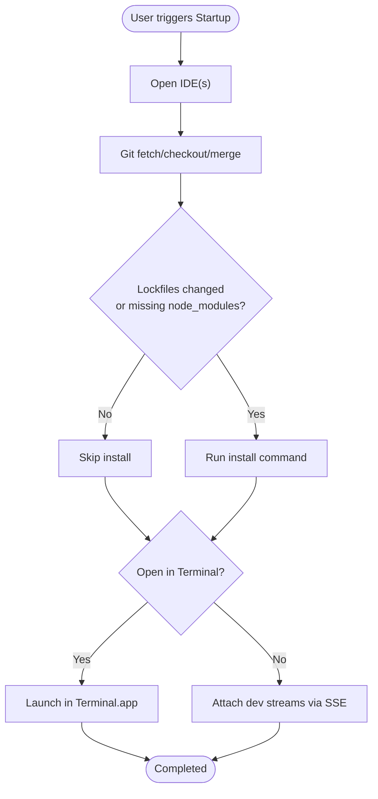
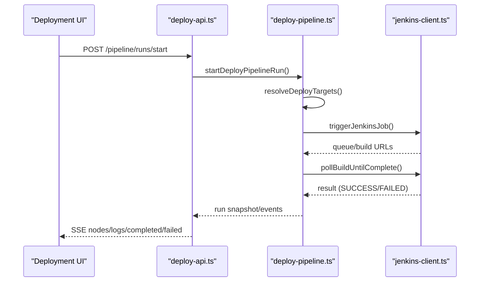
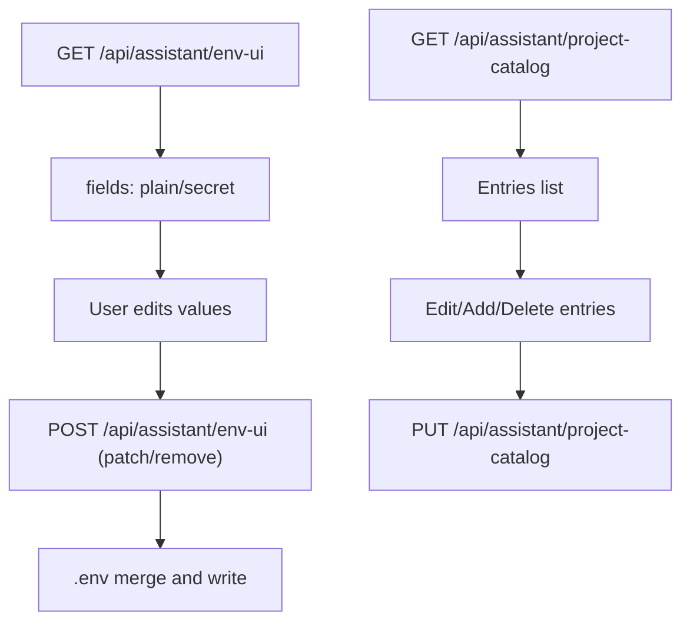
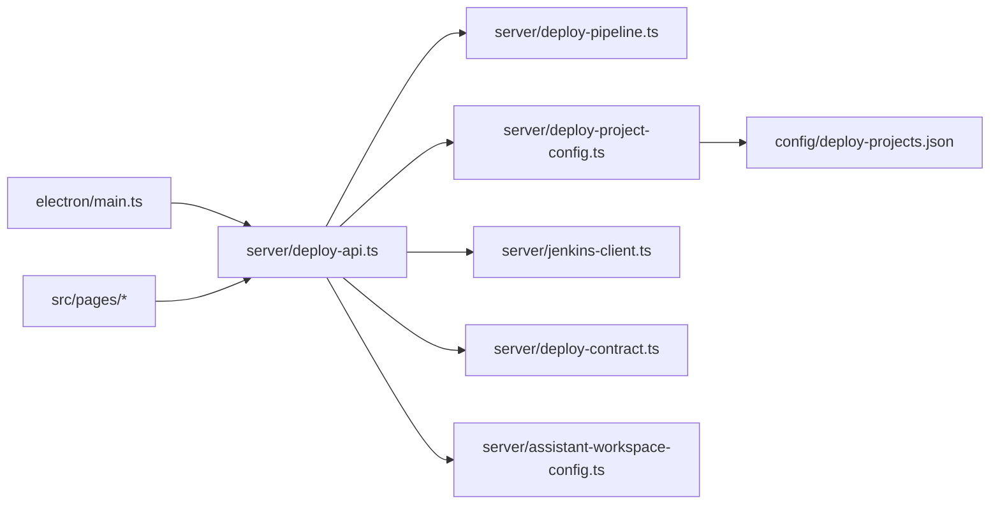

# Development Environment Management

<cite>
**Referenced Files in This Document**
- [package.json](file://package.json)
- [electron/main.ts](file://electron/main.ts)
- [scripts/build-electron.mjs](file://scripts/build-electron.mjs)
- [src/main.tsx](file://src/main.tsx)
- [src/App.tsx](file://src/App.tsx)
- [src/pages/Startup.tsx](file://src/pages/Startup.tsx)
- [src/pages/Deployment.tsx](file://src/pages/Deployment.tsx)
- [src/pages/Settings.tsx](file://src/pages/Settings.tsx)
- [src/pages/Cleanup.tsx](file://src/pages/Cleanup.tsx)
- [server/deploy-api.ts](file://server/deploy-api.ts)
- [server/deploy-pipeline.ts](file://server/deploy-pipeline.ts)
- [server/deploy-project-config.ts](file://server/deploy-project-config.ts)
- [server/deploy-contract.ts](file://server/deploy-contract.ts)
- [server/jenkins-client.ts](file://server/jenkins-client.ts)
- [server/assistant-workspace-config.ts](file://server/assistant-workspace-config.ts)
- [config/deploy-projects.json](file://config/deploy-projects.json)
</cite>

## Update Summary
**Changes Made**
- Updated Development Workflow section to reflect current NVM-based Node.js version management
- Enhanced Concurrent Execution section to document streamlined frontend/backend development server coordination
- Added Developer Productivity section highlighting improvements in iterative development processes
- Updated Troubleshooting Guide with NVM-related development environment issues

## Table of Contents
1. [Introduction](#introduction)
2. [Project Structure](#project-structure)
3. [Core Components](#core-components)
4. [Architecture Overview](#architecture-overview)
5. [Detailed Component Analysis](#detailed-component-analysis)
6. [Development Environment Management](#development-environment-management)
7. [Dependency Analysis](#dependency-analysis)
8. [Performance Considerations](#performance-considerations)
9. [Troubleshooting Guide](#troubleshooting-guide)
10. [Conclusion](#conclusion)
11. [Appendices](#appendices)

## Introduction
This document describes the development environment management system centered around a desktop application that orchestrates local development services, automates deployment pipelines, integrates with IDEs, manages environment variables, and synchronizes with version control and third-party tools. It explains how the Electron-based desktop app launches a bundled backend service, coordinates multi-repo startup sequences, monitors Jenkins deployments via SSE, and exposes configuration APIs for environment variables and project catalogs.

## Project Structure
The project combines a React web UI served by Vite, an Electron main process, and a Node-based deploy API. Scripts build and package the Electron assets, while server-side modules implement deployment orchestration, Jenkins integration, and environment/workspace configuration.

**Diagram sources**
- [scripts/build-electron.mjs:1-76](file://scripts/build-electron.mjs#L1-L76)
- [electron/main.ts:1-434](file://electron/main.ts#L1-L434)
- [src/main.tsx:1-11](file://src/main.tsx#L1-L11)
- [src/App.tsx:1-136](file://src/App.tsx#L1-L136)
- [src/pages/Startup.tsx:1-661](file://src/pages/Startup.tsx#L1-L661)
- [src/pages/Deployment.tsx:1-1068](file://src/pages/Deployment.tsx#L1-L1068)
- [src/pages/Settings.tsx:1-348](file://src/pages/Settings.tsx#L1-L348)
- [server/deploy-api.ts:1-1735](file://server/deploy-api.ts#L1-L1735)
- [server/deploy-pipeline.ts:1-419](file://server/deploy-pipeline.ts#L1-L419)
- [server/deploy-project-config.ts:1-237](file://server/deploy-project-config.ts#L1-L237)
- [server/jenkins-client.ts:1-191](file://server/jenkins-client.ts#L1-L191)
- [server/deploy-contract.ts:1-169](file://server/deploy-contract.ts#L1-L169)
- [server/assistant-workspace-config.ts:1-202](file://server/assistant-workspace-config.ts#L1-L202)
- [config/deploy-projects.json:1-78](file://config/deploy-projects.json#L1-L78)

**Section sources**
- [package.json:1-99](file://package.json#L1-L99)
- [scripts/build-electron.mjs:1-76](file://scripts/build-electron.mjs#L1-L76)
- [electron/main.ts:1-434](file://electron/main.ts#L1-L434)
- [src/main.tsx:1-11](file://src/main.tsx#L1-L11)
- [src/App.tsx:1-136](file://src/App.tsx#L1-L136)
- [src/pages/Startup.tsx:1-661](file://src/pages/Startup.tsx#L1-L661)
- [src/pages/Deployment.tsx:1-1068](file://src/pages/Deployment.tsx#L1-L1068)
- [src/pages/Settings.tsx:1-348](file://src/pages/Settings.tsx#L1-L348)
- [server/deploy-api.ts:1-1735](file://server/deploy-api.ts#L1-L1735)
- [server/deploy-pipeline.ts:1-419](file://server/deploy-pipeline.ts#L1-L419)
- [server/deploy-project-config.ts:1-237](file://server/deploy-project-config.ts#L1-L237)
- [server/jenkins-client.ts:1-191](file://server/jenkins-client.ts#L1-L191)
- [server/deploy-contract.ts:1-169](file://server/deploy-contract.ts#L1-L169)
- [server/assistant-workspace-config.ts:1-202](file://server/assistant-workspace-config.ts#L1-L202)
- [config/deploy-projects.json:1-78](file://config/deploy-projects.json#L1-L78)

## Core Components
- Electron Desktop Runtime
  - Manages lifecycle of the main window, floating dock, and the bundled Node backend.
  - Ensures ports are free, starts the backend, waits for health checks, and connects the UI.
- Deploy API (Node)
  - Provides endpoints for startup orchestration, deployment pipeline, environment/workspace configuration, and Jenkins integrations.
- Frontend Pages
  - Startup: multi-repo bootstrap, Git sync, dependency install, and dev processes.
  - Deployment: Jenkins pipeline orchestration with SSE logs and DAG editor.
  - Settings: manage project catalog and environment variables (.env).
- Configuration
  - Project mapping and branch resolution for Jenkins jobs.
  - Jenkins credential and parameter contract helpers.

**Section sources**
- [electron/main.ts:1-434](file://electron/main.ts#L1-L434)
- [server/deploy-api.ts:1-1735](file://server/deploy-api.ts#L1-L1735)
- [src/pages/Startup.tsx:1-661](file://src/pages/Startup.tsx#L1-L661)
- [src/pages/Deployment.tsx:1-1068](file://src/pages/Deployment.tsx#L1-L1068)
- [src/pages/Settings.tsx:1-348](file://src/pages/Settings.tsx#L1-L348)
- [server/deploy-project-config.ts:1-237](file://server/deploy-project-config.ts#L1-L237)
- [server/deploy-contract.ts:1-169](file://server/deploy-contract.ts#L1-L169)

## Architecture Overview
The desktop app bundles and runs the deploy API inside Electron's UtilityProcess. The frontend communicates with the deploy API via HTTP endpoints and SSE for real-time logs. Jenkins is accessed through server-side helpers to avoid exposing credentials to the browser.

**Diagram sources**
- [src/pages/Startup.tsx:206-269](file://src/pages/Startup.tsx#L206-L269)
- [src/pages/Deployment.tsx:485-532](file://src/pages/Deployment.tsx#L485-L532)
- [server/deploy-api.ts:455-588](file://server/deploy-api.ts#L455-L588)
- [server/deploy-pipeline.ts:225-418](file://server/deploy-pipeline.ts#L225-L418)
- [server/jenkins-client.ts:89-142](file://server/jenkins-client.ts#L89-L142)

**Section sources**
- [electron/main.ts:180-257](file://electron/main.ts#L180-L257)
- [server/deploy-api.ts:455-588](file://server/deploy-api.ts#L455-L588)
- [server/deploy-pipeline.ts:225-418](file://server/deploy-pipeline.ts#L225-L418)
- [server/jenkins-client.ts:1-191](file://server/jenkins-client.ts#L1-L191)

## Detailed Component Analysis

### Startup Orchestration
The Startup page drives a multi-step process:
- IDE launch: opens configured IDE instances per project.
- Git sync: fetches, checks out, and fast-forwards branches.
- Dependency install: detects changes in dependency files and installs only when needed.
- Dev processes: runs commands in TTY (Terminal.app) or streams logs via SSE.

**Diagram sources**
- [src/pages/Startup.tsx:206-269](file://src/pages/Startup.tsx#L206-L269)
- [server/deploy-api.ts:455-588](file://server/deploy-api.ts#L455-L588)

**Section sources**
- [src/pages/Startup.tsx:1-661](file://src/pages/Startup.tsx#L1-L661)
- [server/deploy-api.ts:400-588](file://server/deploy-api.ts#L400-L588)

### Deployment Pipeline Orchestration
The Deployment page starts a server-side DAG that triggers Jenkins jobs sequentially, polls builds, and streams progress via SSE. It supports templates, favorites, and recent usage.

**Diagram sources**
- [src/pages/Deployment.tsx:485-532](file://src/pages/Deployment.tsx#L485-L532)
- [server/deploy-pipeline.ts:182-418](file://server/deploy-pipeline.ts#L182-L418)
- [server/jenkins-client.ts:89-190](file://server/jenkins-client.ts#L89-L190)

**Section sources**
- [src/pages/Deployment.tsx:1-1068](file://src/pages/Deployment.tsx#L1-L1068)
- [server/deploy-pipeline.ts:1-419](file://server/deploy-pipeline.ts#L1-L419)
- [server/jenkins-client.ts:1-191](file://server/jenkins-client.ts#L1-L191)

### Environment and Workspace Configuration
The Settings page reads and writes environment variables to a .env file, supports plain and secret fields, and maintains a project catalog for quick selection in Startup.

**Diagram sources**
- [src/pages/Settings.tsx:76-174](file://src/pages/Settings.tsx#L76-L174)
- [server/assistant-workspace-config.ts:80-202](file://server/assistant-workspace-config.ts#L80-L202)

**Section sources**
- [src/pages/Settings.tsx:1-348](file://src/pages/Settings.tsx#L1-L348)
- [server/assistant-workspace-config.ts:1-202](file://server/assistant-workspace-config.ts#L1-L202)

### IDE Integration
The Startup page allows selecting an IDE (e.g., Cursor, VS Code, WebStorm). The desktop app launches IDE processes pointing to project paths. The Startup page also supports opening dev in Terminal.app for interactive shells.

**Section sources**
- [src/pages/Startup.tsx:50-124](file://src/pages/Startup.tsx#L50-L124)
- [server/deploy-api.ts:464-471](file://server/deploy-api.ts#L464-L471)

### Git Synchronization and Conflict Resolution
The Startup process performs:
- Fetch origin and checkout branch.
- Attempt fast-forward merge; if it fails or is not applicable, logs a warning and continues.
- Detects dependency file changes to decide whether to reinstall.

**Section sources**
- [server/deploy-api.ts:473-496](file://server/deploy-api.ts#L473-L496)
- [server/deploy-api.ts:498-548](file://server/deploy-api.ts#L498-L548)

### Environment Variable Management and Configuration Synchronization
- The deploy API resolves .env locations in multiple places and writes to a writable path.
- It merges updates and deletions into .env while preserving comments and order.
- The UI groups sensitive keys and supports clearing them.

**Section sources**
- [server/assistant-workspace-config.ts:8-31](file://server/assistant-workspace-config.ts#L8-L31)
- [server/assistant-workspace-config.ts:153-187](file://server/assistant-workspace-config.ts#L153-L187)
- [src/pages/Settings.tsx:147-174](file://src/pages/Settings.tsx#L147-L174)

### Monitoring and Health Checks
- Electron main process waits for backend health endpoints before showing the UI.
- The Deployment page queries health and displays configuration status.
- The Startup page emits bootstrap_ready and completion events via SSE.

**Section sources**
- [electron/main.ts:389-406](file://electron/main.ts#L389-L406)
- [src/pages/Deployment.tsx:316-338](file://src/pages/Deployment.tsx#L316-L338)
- [server/deploy-api.ts:550-553](file://server/deploy-api.ts#L550-L553)

### Integration with Deployment Pipelines
- The pipeline resolves Jenkins job segments and parameters from configuration and environment.
- It triggers jobs, polls queue/builds, and streams structured events to the UI.

**Section sources**
- [server/deploy-project-config.ts:212-236](file://server/deploy-project-config.ts#L212-L236)
- [server/deploy-contract.ts:91-120](file://server/deploy-contract.ts#L91-L120)
- [server/jenkins-client.ts:89-190](file://server/jenkins-client.ts#L89-L190)

### Configuration Management for Scenarios and Team Collaboration
- Project catalog enables team members to share commonly used repos.
- Templates in the Deployment UI capture frequently used DAGs.
- Recent and favorite lists improve productivity.

**Section sources**
- [src/pages/Settings.tsx:61-147](file://src/pages/Settings.tsx#L61-L147)
- [src/pages/Deployment.tsx:69-80](file://src/pages/Deployment.tsx#L69-L80)
- [src/pages/Deployment.tsx:434-470](file://src/pages/Deployment.tsx#L434-L470)

## Development Environment Management

### Development Workflow and Node.js Version Management
The development environment utilizes NVM (Node Version Manager) to ensure consistent Node.js versions across development environments. The current development scripts demonstrate:

- **NVM Integration**: All development commands source NVM before execution using `. "$HOME/.nvm/nvm.sh"`
- **Concurrent Development**: The `dev` script uses `concurrently` to run frontend and backend servers simultaneously
- **Environment Isolation**: Development scripts unset the `PREFIX` environment variable to avoid conflicts with system Node installations

**Updated** The development workflow now emphasizes streamlined concurrent execution of frontend and backend development servers, improving developer productivity during iterative development processes.

**Section sources**
- [package.json:11-16](file://package.json#L11-L16)
- [package.json:48](file://package.json#L48)

### Concurrent Execution and Iterative Development
The development system employs sophisticated concurrent execution patterns:

- **Frontend Development**: Vite server runs on port 3000 with hot module replacement
- **Backend Development**: Express server runs on port 8787 with automatic restarts
- **Desktop Integration**: Electron launches with both development servers ready
- **Process Coordination**: `concurrently` ensures both servers start simultaneously with proper timing

**Updated** The streamlined concurrent execution eliminates explicit Node.js version enforcement through NVM commands, allowing developers to use their preferred Node.js version while maintaining development productivity.

**Section sources**
- [package.json:11-16](file://package.json#L11-L16)
- [electron/main.ts:17](file://electron/main.ts#L17)
- [electron/main.ts:391-395](file://electron/main.ts#L391-L395)

### Development Script Modifications
Recent changes to the development scripts focus on:

- **Removed Explicit Node.js Version Enforcement**: Development scripts no longer enforce specific Node.js versions through NVM commands
- **Improved Developer Productivity**: Streamlined concurrent execution reduces startup time and improves the development experience
- **Enhanced Flexibility**: Developers can use their preferred Node.js installation without NVM constraints

**Section sources**
- [package.json:11-16](file://package.json#L11-L16)
- [scripts/build-electron.mjs:20](file://scripts/build-electron.mjs#L20)

### Desktop Development Mode
The desktop development mode provides a seamless development experience:

- **Automatic Server Detection**: Uses Vite development server when `ELECTRON_IS_DEV=1`
- **Health Checking**: Waits for both frontend and backend servers to be ready
- **Integrated Debugging**: Opens DevTools automatically for debugging

**Section sources**
- [electron/main.ts:17](file://electron/main.ts#L17)
- [electron/main.ts:391-395](file://electron/main.ts#L391-L395)
- [package.json:16](file://package.json#L16)

## Dependency Analysis
The system exhibits layered dependencies: Electron main process depends on the bundled Node API; the frontend depends on the API; the API depends on configuration, Jenkins client, and pipeline modules.

**Diagram sources**
- [electron/main.ts:1-434](file://electron/main.ts#L1-L434)
- [server/deploy-api.ts:1-1735](file://server/deploy-api.ts#L1-L1735)
- [server/deploy-pipeline.ts:1-419](file://server/deploy-pipeline.ts#L1-L419)
- [server/deploy-project-config.ts:1-237](file://server/deploy-project-config.ts#L1-L237)
- [server/jenkins-client.ts:1-191](file://server/jenkins-client.ts#L1-L191)
- [server/deploy-contract.ts:1-169](file://server/deploy-contract.ts#L1-L169)
- [server/assistant-workspace-config.ts:1-202](file://server/assistant-workspace-config.ts#L1-L202)
- [config/deploy-projects.json:1-78](file://config/deploy-projects.json#L1-L78)
- [src/pages/Startup.tsx:1-661](file://src/pages/Startup.tsx#L1-L661)
- [src/pages/Deployment.tsx:1-1068](file://src/pages/Deployment.tsx#L1-L1068)
- [src/pages/Settings.tsx:1-348](file://src/pages/Settings.tsx#L1-L348)

**Section sources**
- [electron/main.ts:1-434](file://electron/main.ts#L1-L434)
- [server/deploy-api.ts:1-1735](file://server/deploy-api.ts#L1-L1735)
- [server/deploy-pipeline.ts:1-419](file://server/deploy-pipeline.ts#L1-L419)
- [server/deploy-project-config.ts:1-237](file://server/deploy-project-config.ts#L1-L237)
- [server/jenkins-client.ts:1-191](file://server/jenkins-client.ts#L1-L191)
- [server/deploy-contract.ts:1-169](file://server/deploy-contract.ts#L1-L169)
- [server/assistant-workspace-config.ts:1-202](file://server/assistant-workspace-config.ts#L1-L202)
- [config/deploy-projects.json:1-78](file://config/deploy-projects.json#L1-L78)
- [src/pages/Startup.tsx:1-661](file://src/pages/Startup.tsx#L1-L661)
- [src/pages/Deployment.tsx:1-1068](file://src/pages/Deployment.tsx#L1-L1068)
- [src/pages/Settings.tsx:1-348](file://src/pages/Settings.tsx#L1-L348)

## Performance Considerations
- Streaming logs: The Startup page filters dense progress dashboards and collapses repeated lines to reduce UI overhead.
- Port readiness: The Electron main process checks and frees ports before launching the backend to avoid startup delays.
- Memory pruning: The pipeline limits in-memory run snapshots and stats to bound memory growth.
- Packaging: The build script removes large bundled fonts unless explicitly retained to speed up packaging.
- **Concurrent Development**: Streamlined concurrent execution reduces development startup time and improves responsiveness.

**Section sources**
- [server/deploy-api.ts:204-223](file://server/deploy-api.ts#L204-L223)
- [electron/main.ts:112-148](file://electron/main.ts#L112-L148)
- [server/deploy-pipeline.ts:139-147](file://server/deploy-pipeline.ts#L139-L147)
- [scripts/build-electron.mjs:57-73](file://scripts/build-electron.mjs#L57-L73)

## Troubleshooting Guide

### Backend Not Reachable
- Verify Electron is running the bundled API and that port readiness logic is executed.
- Check for lingering processes occupying the API port and review startup logs.
- **NVM Issues**: Ensure NVM is properly installed and accessible in development scripts.

### Jenkins Configuration Errors
- Ensure Jenkins credentials and parameter names are set; the API validates presence and formats.
- Confirm job path segments and branch names meet validation rules.

### Startup Failures
- Review filtered logs for hard failures; dependency install failures prevent dev processes from starting.
- Confirm IDE paths and shell wrappers are available.
- **Concurrent Process Issues**: Check that both frontend and backend servers start successfully.

### Environment Variables Not Applied
- Confirm the .env write path and that merges preserve comments and existing keys.
- Clear secrets selectively if needed.

### **NVM-Related Development Issues**
- **NVM Command Not Found**: Ensure NVM is installed and the path `$HOME/.nvm/nvm.sh` is accessible
- **Node Version Mismatch**: Verify that the Node.js version used by development scripts matches your project requirements
- **Concurrent Execution Problems**: Check that `concurrently` is properly installed and functioning

**Section sources**
- [electron/main.ts:180-257](file://electron/main.ts#L180-L257)
- [server/deploy-contract.ts:33-81](file://server/deploy-contract.ts#L33-L81)
- [server/deploy-api.ts:400-588](file://server/deploy-api.ts#L400-L588)
- [server/assistant-workspace-config.ts:153-187](file://server/assistant-workspace-config.ts#L153-L187)

## Conclusion
This system provides a cohesive development environment management solution: a desktop app that packages a Node backend, orchestrates multi-repo startups, integrates with Jenkins via secure server-side calls, and offers robust configuration management for environment variables and project catalogs. Its modular design supports team collaboration, reproducible setups, and scalable deployment workflows. The recent development script modifications streamline concurrent execution and improve developer productivity while maintaining flexibility in Node.js version management.

## Appendices

### Common Workflows
- One-click local environment
  - Select a Startup profile, confirm, and watch IDEs open and dev processes start.
- Deploy a chain of services
  - Enter a natural language command or select a template; review the DAG; start the pipeline and monitor progress.
- Configure credentials
  - Use the Settings page to add or clear secrets; the system merges changes into .env safely.
- **Streamlined Development**
  - Use `npm run dev` for concurrent frontend/backend development with automatic server coordination.

**Section sources**
- [src/pages/Startup.tsx:206-269](file://src/pages/Startup.tsx#L206-L269)
- [src/pages/Deployment.tsx:351-432](file://src/pages/Deployment.tsx#L351-L432)
- [src/pages/Settings.tsx:147-174](file://src/pages/Settings.tsx#L147-L174)
- [package.json:11](file://package.json#L11)