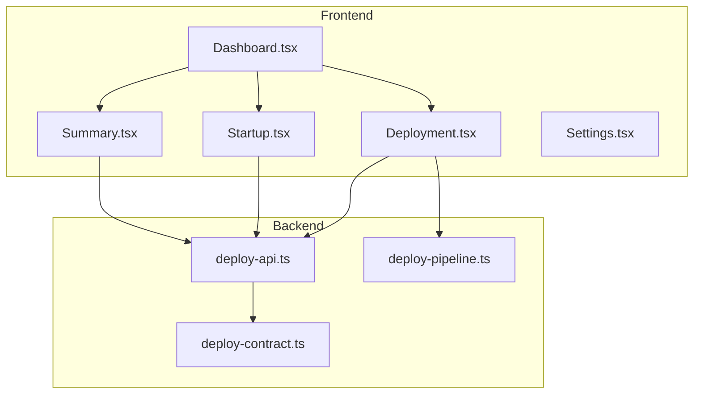
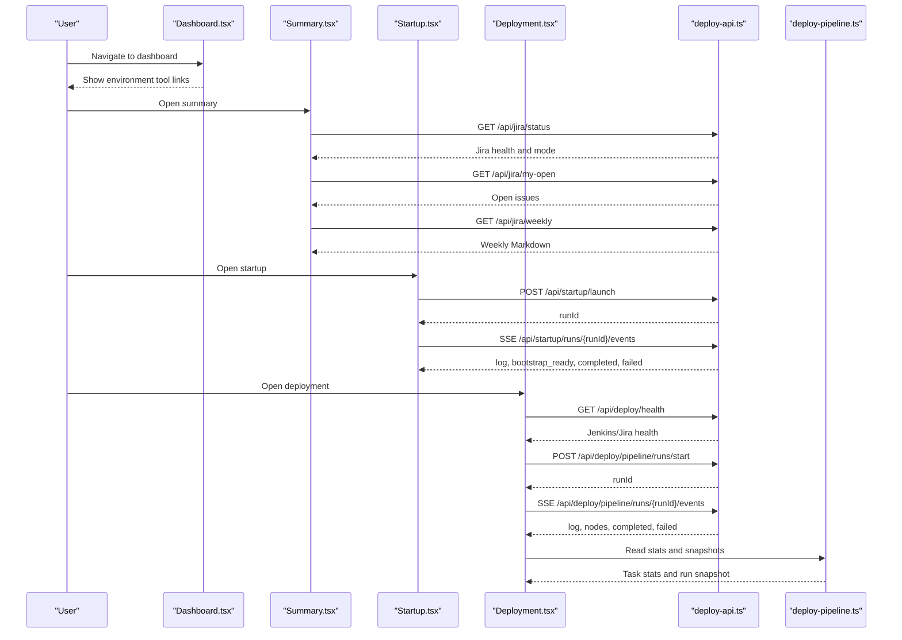
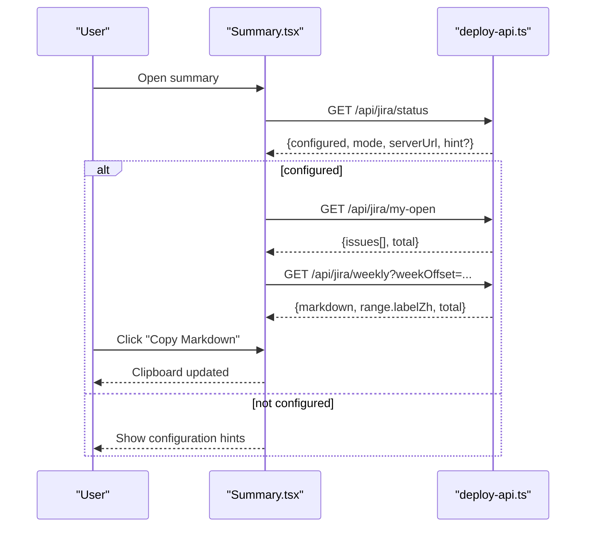
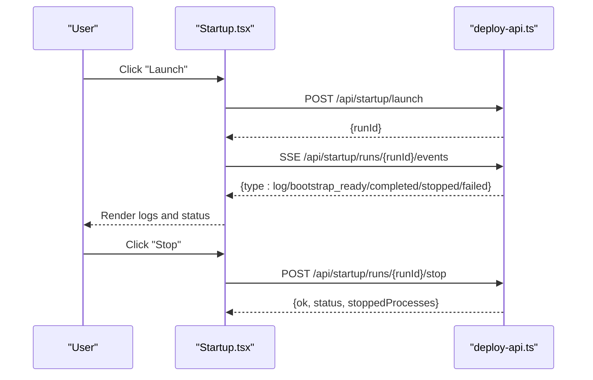
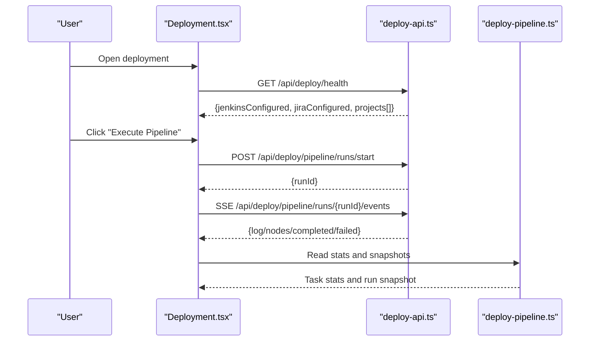
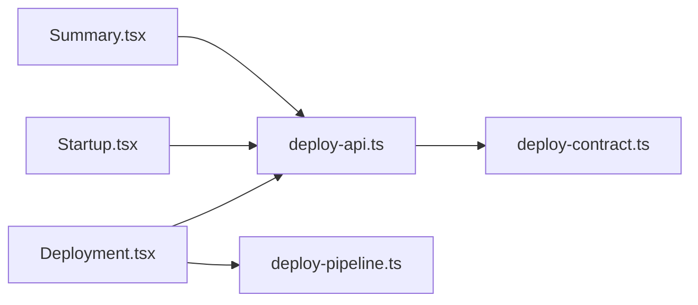

# Environment Summary

<cite>
**Referenced Files in This Document**
- [Summary.tsx](file://src/pages/Summary.tsx)
- [Startup.tsx](file://src/pages/Startup.tsx)
- [Dashboard.tsx](file://src/pages/Dashboard.tsx)
- [Deployment.tsx](file://src/pages/Deployment.tsx)
- [Settings.tsx](file://src/pages/Settings.tsx)
- [deploy-api.ts](file://server/deploy-api.ts)
- [deploy-pipeline.ts](file://server/deploy-pipeline.ts)
- [deploy-contract.ts](file://server/deploy-contract.ts)
</cite>

## Table of Contents
1. [Introduction](#introduction)
2. [Project Structure](#project-structure)
3. [Core Components](#core-components)
4. [Architecture Overview](#architecture-overview)
5. [Detailed Component Analysis](#detailed-component-analysis)
6. [Dependency Analysis](#dependency-analysis)
7. [Performance Considerations](#performance-considerations)
8. [Troubleshooting Guide](#troubleshooting-guide)
9. [Conclusion](#conclusion)
10. [Appendices](#appendices)

## Introduction
This document describes the environment summary system that consolidates the current development environment status across running services, active projects, and resource-related signals. It explains how the system monitors environment health, presents status indicators, integrates with startup and cleanup systems for real-time updates, supports environment comparison and change tracking, and provides reporting and analytics for development metrics. It also covers layout examples, customization options, monitoring integrations, alerting mechanisms, interpretation guidelines, and export/sharing capabilities.

## Project Structure
The environment summary spans frontend pages and backend APIs:
- Frontend pages:
  - Summary: pulls Jira status and generates weekly reports.
  - Startup: orchestrates environment bootstrapping and streams logs via Server-Sent Events.
  - Deployment: shows health and pipeline execution with real-time logs.
  - Dashboard: entry hub linking to environment tools.
  - Settings: manages environment variables and project catalog.
- Backend APIs:
  - deploy-api: exposes environment health, Jira endpoints, startup run streaming, and pipeline stats.
  - deploy-pipeline: persists and queries pipeline run snapshots and statistics.
  - deploy-contract: validates Jenkins configuration and parameters.

**Diagram sources**
- [Dashboard.tsx:1-114](file://src/pages/Dashboard.tsx#L1-L114)
- [Summary.tsx:1-653](file://src/pages/Summary.tsx#L1-L653)
- [Startup.tsx:1-661](file://src/pages/Startup.tsx#L1-L661)
- [Deployment.tsx:1-1068](file://src/pages/Deployment.tsx#L1-L1068)
- [Settings.tsx:1-347](file://src/pages/Settings.tsx#L1-L347)
- [deploy-api.ts:1-800](file://server/deploy-api.ts#L1-L800)
- [deploy-pipeline.ts:1-419](file://server/deploy-pipeline.ts#L1-L419)
- [deploy-contract.ts:1-169](file://server/deploy-contract.ts#L1-L169)

**Section sources**
- [Dashboard.tsx:1-114](file://src/pages/Dashboard.tsx#L1-L114)
- [Summary.tsx:1-653](file://src/pages/Summary.tsx#L1-L653)
- [Startup.tsx:1-661](file://src/pages/Startup.tsx#L1-L661)
- [Deployment.tsx:1-1068](file://src/pages/Deployment.tsx#L1-L1068)
- [Settings.tsx:1-347](file://src/pages/Settings.tsx#L1-L347)
- [deploy-api.ts:1-800](file://server/deploy-api.ts#L1-L800)
- [deploy-pipeline.ts:1-419](file://server/deploy-pipeline.ts#L1-L419)
- [deploy-contract.ts:1-169](file://server/deploy-contract.ts#L1-L169)

## Core Components
- Environment Health Monitoring
  - Jenkins and Jira configuration health is surfaced on the deployment page and summarized in the dashboard’s action cards.
  - The summary page surfaces Jira connectivity and credentials mode.
- Status Indicators
  - Dashboard action cards show environment tool availability and status.
  - Deployment page displays Jenkins and Jira health badges and project counts.
  - Startup page shows run status, logs, and live progress via SSE.
- Consolidated Views
  - Summary page aggregates Jira open issues and weekly report generation.
  - Deployment page shows pipeline DAG, node statuses, and real-time logs.
- Real-Time Updates
  - Startup and deployment use Server-Sent Events to stream logs and status transitions.
- Reporting and Analytics
  - Deployment pipeline statistics track frequent task chains and last-run timestamps.
- Export and Sharing
  - Summary page allows copying weekly Markdown to clipboard.

**Section sources**
- [Dashboard.tsx:5-46](file://src/pages/Dashboard.tsx#L5-L46)
- [Deployment.tsx:316-338](file://src/pages/Deployment.tsx#L316-L338)
- [Summary.tsx:37-47](file://src/pages/Summary.tsx#L37-L47)
- [Startup.tsx:232-264](file://src/pages/Startup.tsx#L232-L264)
- [Deployment.tsx:143-153](file://src/pages/Deployment.tsx#L143-L153)
- [deploy-pipeline.ts:114-137](file://server/deploy-pipeline.ts#L114-L137)
- [Summary.tsx:318-327](file://src/pages/Summary.tsx#L318-L327)

## Architecture Overview
The environment summary system integrates frontend pages with backend services:
- Frontend pages call backend endpoints for health, Jira status, startup runs, and pipeline snapshots.
- Backend services expose SSE endpoints for real-time updates and persist pipeline run data.
- Configuration and environment variables are managed via the settings page and backend helpers.

**Diagram sources**
- [Summary.tsx:135-265](file://src/pages/Summary.tsx#L135-L265)
- [Startup.tsx:206-269](file://src/pages/Startup.tsx#L206-L269)
- [Deployment.tsx:316-338](file://src/pages/Deployment.tsx#L316-L338)
- [Deployment.tsx:510-532](file://src/pages/Deployment.tsx#L510-L532)
- [deploy-api.ts:1637-1662](file://server/deploy-api.ts#L1637-L1662)
- [deploy-pipeline.ts:149-180](file://server/deploy-pipeline.ts#L149-L180)

## Detailed Component Analysis

### Summary Page: Jira Status and Weekly Reports
- Purpose: Consolidates Jira-related environment status and generates weekly Markdown reports.
- Key behaviors:
  - Loads Jira status and credentials mode.
  - Fetches open issues and weekly report with pagination-like offset.
  - Provides a “copy Markdown” action for exporting the weekly draft.
  - Handles connectivity hints and parsing errors with user-friendly messages.
- Real-time integration: None; relies on periodic reloads and manual refresh.
- Customization: Minimal UI controls for refreshing and copying.

**Diagram sources**
- [Summary.tsx:135-265](file://src/pages/Summary.tsx#L135-L265)
- [Summary.tsx:318-327](file://src/pages/Summary.tsx#L318-L327)

**Section sources**
- [Summary.tsx:37-47](file://src/pages/Summary.tsx#L37-L47)
- [Summary.tsx:135-265](file://src/pages/Summary.tsx#L135-L265)
- [Summary.tsx:318-327](file://src/pages/Summary.tsx#L318-L327)

### Startup Page: Environment Boot and Live Logs
- Purpose: Orchestrates environment startup, streams logs via SSE, and shows run status.
- Key behaviors:
  - Launches startup run and opens an SSE endpoint to receive logs and lifecycle events.
  - Supports stopping a running run and cleans up resources.
  - Renders a simulated terminal with categorized log levels.
- Real-time integration: Strong; uses SSE for continuous updates.
- Customization: Profiles, IDE selection, project lists, and run options.

**Diagram sources**
- [Startup.tsx:206-269](file://src/pages/Startup.tsx#L206-L269)
- [deploy-api.ts:1637-1662](file://server/deploy-api.ts#L1637-L1662)

**Section sources**
- [Startup.tsx:206-269](file://src/pages/Startup.tsx#L206-L269)
- [Startup.tsx:352-660](file://src/pages/Startup.tsx#L352-L660)
- [deploy-api.ts:1637-1662](file://server/deploy-api.ts#L1637-L1662)

### Deployment Page: Pipeline Health and Logs
- Purpose: Shows environment health (Jenkins/Jira), DAG editor, and real-time pipeline logs.
- Key behaviors:
  - Loads health status and project list.
  - Starts a pipeline run and attaches to SSE events for logs and node snapshots.
  - Displays node status, durations, and links to Jenkins builds.
- Real-time integration: Strong; uses SSE for live updates and persists run snapshots.
- Reporting/analytics: Reads task stats from backend to surface frequent chains.

**Diagram sources**
- [Deployment.tsx:316-338](file://src/pages/Deployment.tsx#L316-L338)
- [Deployment.tsx:510-532](file://src/pages/Deployment.tsx#L510-L532)
- [deploy-pipeline.ts:149-180](file://server/deploy-pipeline.ts#L149-L180)

**Section sources**
- [Deployment.tsx:316-338](file://src/pages/Deployment.tsx#L316-L338)
- [Deployment.tsx:510-532](file://src/pages/Deployment.tsx#L510-L532)
- [Deployment.tsx:800-1068](file://src/pages/Deployment.tsx#L800-L1068)
- [deploy-pipeline.ts:114-137](file://server/deploy-pipeline.ts#L114-L137)

### Dashboard: Environment Tool Hub
- Purpose: Centralized entry to environment tools including deployment, startup, cleanup, summary, and tasks.
- Key behaviors:
  - Presents action cards with icons, subtitles, and descriptions.
  - Links to respective pages for environment operations.

**Section sources**
- [Dashboard.tsx:5-46](file://src/pages/Dashboard.tsx#L5-L46)

### Settings: Environment Variables and Catalog
- Purpose: Manages environment variables (.env) and project catalog used across tools.
- Key behaviors:
  - Loads environment UI metadata and fields.
  - Allows editing and saving environment values.
  - Manages project catalog entries.

**Section sources**
- [Settings.tsx:76-115](file://src/pages/Settings.tsx#L76-L115)
- [Settings.tsx:250-342](file://src/pages/Settings.tsx#L250-L342)

## Dependency Analysis
- Frontend-to-backend dependencies:
  - Summary depends on Jira endpoints for status, open issues, and weekly reports.
  - Startup depends on launch and SSE endpoints for run lifecycle.
  - Deployment depends on health, pipeline start, and SSE endpoints; reads stats via pipeline service.
- Backend dependencies:
  - deploy-api orchestrates startup runs, exposes Jira endpoints, and serves SSE.
  - deploy-pipeline persists and queries run snapshots and task statistics.
  - deploy-contract validates Jenkins configuration and parameters.

**Diagram sources**
- [Summary.tsx:135-265](file://src/pages/Summary.tsx#L135-L265)
- [Startup.tsx:206-269](file://src/pages/Startup.tsx#L206-L269)
- [Deployment.tsx:316-338](file://src/pages/Deployment.tsx#L316-L338)
- [Deployment.tsx:510-532](file://src/pages/Deployment.tsx#L510-L532)
- [deploy-api.ts:1-800](file://server/deploy-api.ts#L1-L800)
- [deploy-pipeline.ts:1-419](file://server/deploy-pipeline.ts#L1-L419)
- [deploy-contract.ts:1-169](file://server/deploy-contract.ts#L1-L169)

**Section sources**
- [Summary.tsx:135-265](file://src/pages/Summary.tsx#L135-L265)
- [Startup.tsx:206-269](file://src/pages/Startup.tsx#L206-L269)
- [Deployment.tsx:316-338](file://src/pages/Deployment.tsx#L316-L338)
- [Deployment.tsx:510-532](file://src/pages/Deployment.tsx#L510-L532)
- [deploy-api.ts:1-800](file://server/deploy-api.ts#L1-L800)
- [deploy-pipeline.ts:1-419](file://server/deploy-pipeline.ts#L1-L419)
- [deploy-contract.ts:1-169](file://server/deploy-contract.ts#L1-L169)

## Performance Considerations
- SSE streaming
  - Startup and deployment use SSE to avoid polling and reduce latency for real-time updates.
  - Backend trims event history per run to limit memory usage.
- Request batching
  - Summary loads status, open issues, and weekly report on demand; consider debouncing rapid refreshes.
- Rendering
  - Large weekly Markdown can be expensive to render; consider virtualization or lazy loading for long outputs.
- Backend persistence
  - Pipeline stats and snapshots are persisted to disk; ensure appropriate limits and pruning to maintain performance.

[No sources needed since this section provides general guidance]

## Troubleshooting Guide
- Jira connectivity issues
  - The summary page distinguishes between generic connectivity failures and HTML proxy errors. It provides actionable hints for configuring VITE_DEPLOY_API_BASE and verifying .env credentials.
- Startup run failures
  - Startup SSE emits structured events; check for “failed” or “stopped” types and review logs for hard errors during Git sync, dependency installation, or dev process spawning.
- Deployment pipeline stalls
  - If Jenkins queue does not resolve to a build URL within timeout, the pipeline marks the node as queued and stops subsequent nodes. Verify Jenkins configuration and network access.
- Environment variables
  - Use the settings page to load and save environment values; ensure required keys for Jenkins and Jira are present.

**Section sources**
- [Summary.tsx:37-47](file://src/pages/Summary.tsx#L37-L47)
- [Startup.tsx:232-264](file://src/pages/Startup.tsx#L232-L264)
- [Deployment.tsx:316-338](file://src/pages/Deployment.tsx#L316-L338)
- [Settings.tsx:76-115](file://src/pages/Settings.tsx#L76-L115)

## Conclusion
The environment summary system provides a unified view of development environment status by integrating Jira health, startup run visibility, and deployment pipeline insights. It leverages real-time SSE for responsive updates, offers reporting and analytics for deployment patterns, and supports export of weekly summaries. The system’s modular design enables targeted troubleshooting and clear status interpretation.

[No sources needed since this section summarizes without analyzing specific files]

## Appendices

### Environment Summary Layouts and Customization
- Summary page layout
  - Jira status header with mode indicator and refresh button.
  - Open issues list with optional “in today’s todos” badge.
  - Weekly report section with navigation and copy-to-clipboard.
- Startup page layout
  - Profile list with run indicators.
  - Execution plan preview with project details.
  - Simulated terminal for live logs.
- Deployment page layout
  - Health badges for Jenkins and Jira.
  - DAG editor with node status and links.
  - Terminal-style log output with categorized levels.
- Customization options
  - Summary: manual refresh, weekly offset navigation, copy Markdown.
  - Startup: profile creation/editing, IDE selection, project commands.
  - Deployment: template management, node addition/removal, pipeline execution.

**Section sources**
- [Summary.tsx:394-648](file://src/pages/Summary.tsx#L394-L648)
- [Startup.tsx:352-660](file://src/pages/Startup.tsx#L352-L660)
- [Deployment.tsx:537-1068](file://src/pages/Deployment.tsx#L537-L1068)

### Integration with Monitoring and Alerting
- Monitoring
  - Jenkins and Jira health badges indicate configuration status and availability.
  - Pipeline task stats reflect operational frequency and recency.
- Alerting
  - SSE events signal lifecycle transitions (bootstrap ready, completed, failed, stopped).
  - Frontend surfaces errors and warnings in logs and status indicators.

**Section sources**
- [Deployment.tsx:547-568](file://src/pages/Deployment.tsx#L547-L568)
- [Deployment.tsx:143-153](file://src/pages/Deployment.tsx#L143-L153)
- [Startup.tsx:232-264](file://src/pages/Startup.tsx#L232-L264)

### Interpreting Environment Status Information
- Jenkins/Jira health
  - Green badges mean configured and reachable; amber indicates fallback or partial configuration.
- Startup run status
  - Running indicates dev processes are active; completed/failed/stopped reflect outcomes.
- Deployment pipeline
  - Node status (idle, running, success, failed, queued) reflects stage progression and outcomes.
- Logs
  - Categorized levels help distinguish system events, successes, warnings, and errors.

**Section sources**
- [Deployment.tsx:547-568](file://src/pages/Deployment.tsx#L547-L568)
- [Startup.tsx:232-264](file://src/pages/Startup.tsx#L232-L264)
- [Deployment.tsx:1004-1060](file://src/pages/Deployment.tsx#L1004-L1060)

### Export and Sharing Capabilities
- Summary
  - Copy weekly Markdown to clipboard for sharing or inclusion in team reports.
- Deployment
  - Logs and run snapshots can be captured and shared; templates enable reuse of deployment chains.

**Section sources**
- [Summary.tsx:318-327](file://src/pages/Summary.tsx#L318-L327)
- [Deployment.tsx:756-992](file://src/pages/Deployment.tsx#L756-L992)