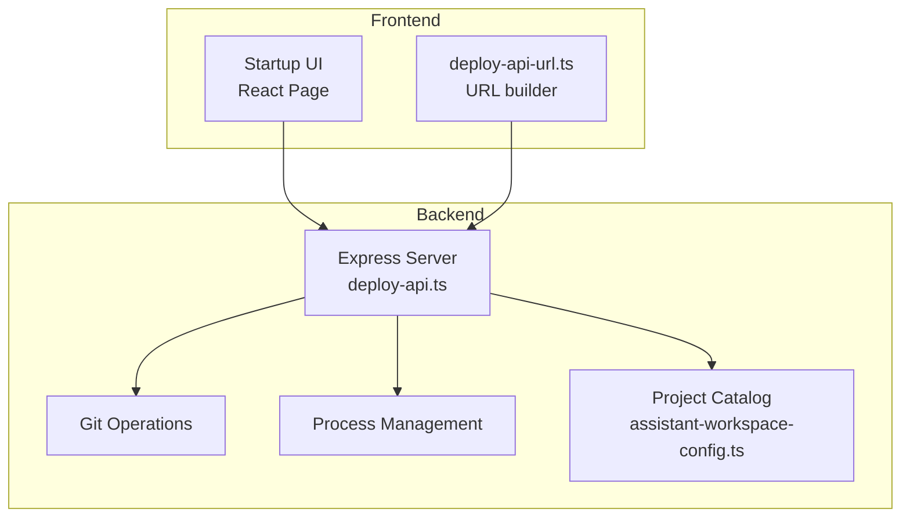
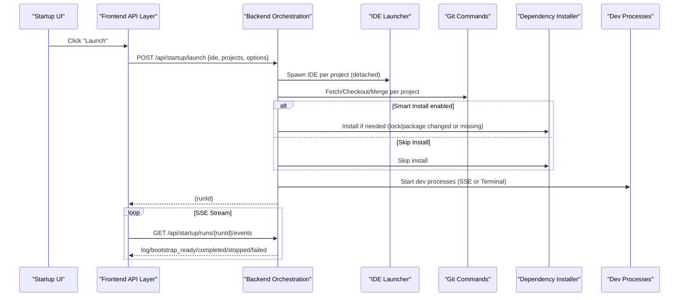
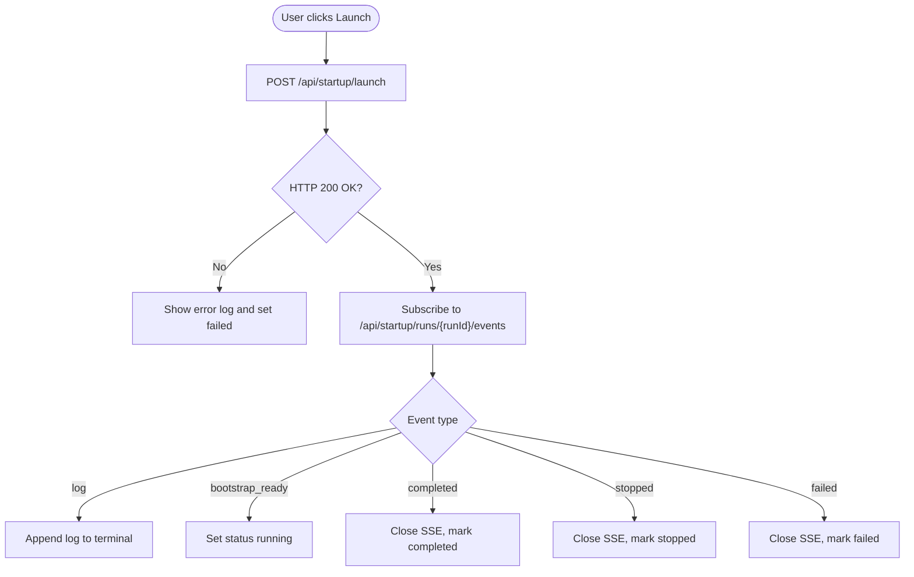
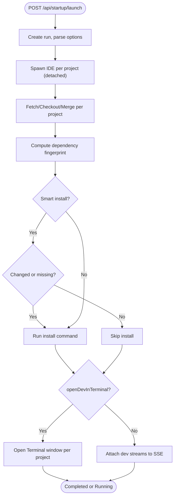
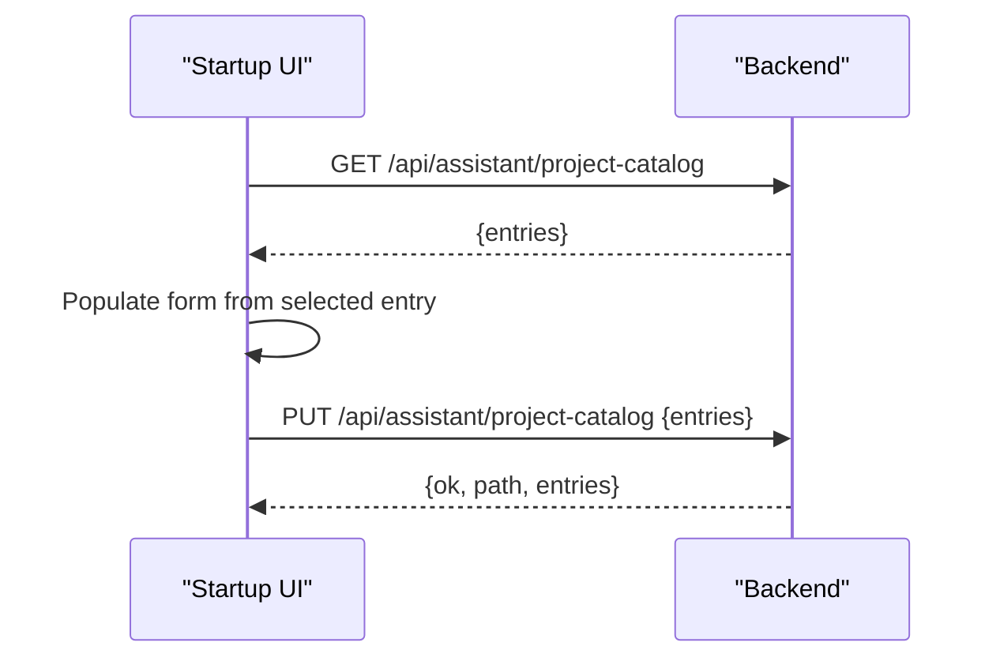
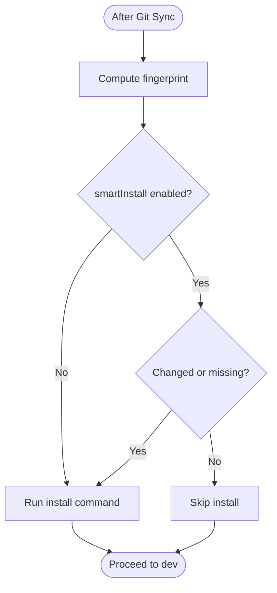
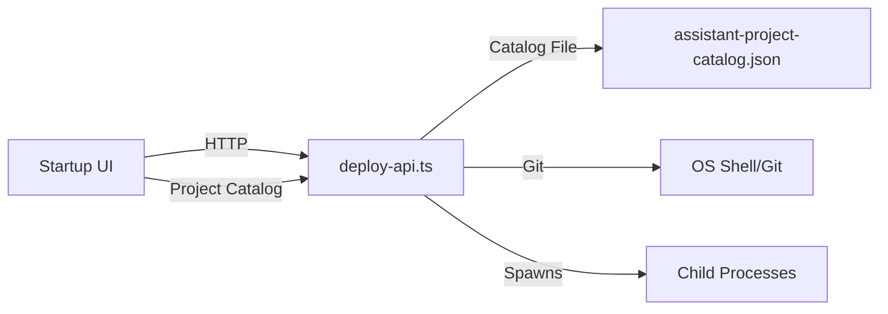

# Startup Coordination

<cite>
**Referenced Files in This Document**
- [Startup.tsx](file://src/pages/Startup.tsx)
- [deploy-api.ts](file://server/deploy-api.ts)
- [assistant-workspace-config.ts](file://server/assistant-workspace-config.ts)
- [deploy-api-url.ts](file://src/lib/deploy-api-url.ts)
- [package.json](file://package.json)
- [deploy-projects.json](file://config/deploy-projects.json)
- [metadata.json](file://metadata.json)
</cite>

## Table of Contents
1. [Introduction](#introduction)
2. [Project Structure](#project-structure)
3. [Core Components](#core-components)
4. [Architecture Overview](#architecture-overview)
5. [Detailed Component Analysis](#detailed-component-analysis)
6. [Dependency Analysis](#dependency-analysis)
7. [Performance Considerations](#performance-considerations)
8. [Troubleshooting Guide](#troubleshooting-guide)
9. [Conclusion](#conclusion)
10. [Appendices](#appendices)

## Introduction
This document explains the startup coordination system that orchestrates multiple development services during application launch. It covers how the frontend UI defines and triggers startup profiles, how the backend coordinates IDE launching, Git branch synchronization, dependency installation, and service startup, and how real-time execution monitoring is achieved via Server-Sent Events (SSE). It also documents the profile-based configuration system, project catalog integration, workspace versus single-project configurations, smart installation strategies, and practical guidance for creating custom profiles and optimizing startup performance.

## Project Structure
The startup system spans both the frontend React page and the backend Express server:
- Frontend: A dedicated page renders profiles, allows editing, and streams logs via SSE.
- Backend: Implements the startup orchestration pipeline and exposes REST/SSE endpoints.

**Diagram sources**
- [Startup.tsx:126-283](file://src/pages/Startup.tsx#L126-L283)
- [deploy-api.ts:1591-1662](file://server/deploy-api.ts#L1591-L1662)
- [assistant-workspace-config.ts:50-77](file://server/assistant-workspace-config.ts#L50-L77)
- [deploy-api-url.ts:6-27](file://src/lib/deploy-api-url.ts#L6-L27)

**Section sources**
- [Startup.tsx:126-283](file://src/pages/Startup.tsx#L126-L283)
- [deploy-api.ts:1591-1662](file://server/deploy-api.ts#L1591-L1662)
- [assistant-workspace-config.ts:50-77](file://server/assistant-workspace-config.ts#L50-L77)
- [deploy-api-url.ts:6-27](file://src/lib/deploy-api-url.ts#L6-L27)

## Core Components
- Startup Profiles: Define IDE selection, workspace/single-project mode, and per-project commands and branches.
- Project Catalog: Stores human-readable project entries with id/name/path for quick population in profiles.
- Orchestration Engine: Executes IDE launch, Git sync, optional smart dependency installation, and dev process streaming.
- Real-time Monitoring: SSE endpoints stream structured log events to the UI.

Key frontend types and initial profiles are defined in the Startup UI page. The backend implements the startup pipeline and exposes endpoints for launching, stopping, and streaming logs.

**Section sources**
- [Startup.tsx:9-28](file://src/pages/Startup.tsx#L9-L28)
- [Startup.tsx:50-124](file://src/pages/Startup.tsx#L50-L124)
- [deploy-api.ts:128-143](file://server/deploy-api.ts#L128-L143)
- [assistant-workspace-config.ts:33-77](file://server/assistant-workspace-config.ts#L33-L77)

## Architecture Overview
The startup flow is initiated by the frontend, which posts a launch request with profile data and options. The backend spawns IDE processes, synchronizes Git branches, optionally installs dependencies, and starts dev processes. Logs are streamed via SSE to the UI terminal.

**Diagram sources**
- [Startup.tsx:206-269](file://src/pages/Startup.tsx#L206-L269)
- [deploy-api.ts:1591-1662](file://server/deploy-api.ts#L1591-L1662)
- [deploy-api.ts:455-588](file://server/deploy-api.ts#L455-L588)

## Detailed Component Analysis

### Frontend: Startup UI and Profile Management
- Defines profile types (single/workspace), project entries, and run state.
- Provides forms to create/edit profiles and populate from the project catalog.
- Initiates startup via POST to the backend and subscribes to SSE events.
- Supports stopping active runs and editing lifecycle.

**Diagram sources**
- [Startup.tsx:206-269](file://src/pages/Startup.tsx#L206-L269)

**Section sources**
- [Startup.tsx:126-283](file://src/pages/Startup.tsx#L126-L283)
- [Startup.tsx:285-350](file://src/pages/Startup.tsx#L285-L350)

### Backend: Startup Orchestration Pipeline
- Accepts launch requests with ide, projects, and options.
- Opens IDEs (detached), synchronizes Git branches, computes dependency fingerprints, and conditionally installs dependencies.
- Streams dev process output via SSE or opens Terminal windows on macOS for true TTY support.
- Supports stopping runs and cleaning up child processes.

**Diagram sources**
- [deploy-api.ts:455-588](file://server/deploy-api.ts#L455-L588)
- [deploy-api.ts:1591-1662](file://server/deploy-api.ts#L1591-L1662)

**Section sources**
- [deploy-api.ts:128-143](file://server/deploy-api.ts#L128-L143)
- [deploy-api.ts:400-453](file://server/deploy-api.ts#L400-L453)
- [deploy-api.ts:455-588](file://server/deploy-api.ts#L455-L588)
- [deploy-api.ts:1591-1662](file://server/deploy-api.ts#L1591-L1662)

### Project Catalog Integration
- The backend loads a JSON catalog of projects with id/name/path.
- The frontend fetches the catalog and allows selecting entries to populate profile projects.
- Catalog persistence supports saving and updating entries.

**Diagram sources**
- [Startup.tsx:170-181](file://src/pages/Startup.tsx#L170-L181)
- [assistant-workspace-config.ts:54-77](file://server/assistant-workspace-config.ts#L54-L77)
- [deploy-api.ts:987-1021](file://server/deploy-api.ts#L987-L1021)

**Section sources**
- [Startup.tsx:170-181](file://src/pages/Startup.tsx#L170-L181)
- [assistant-workspace-config.ts:33-77](file://server/assistant-workspace-config.ts#L33-L77)
- [deploy-api.ts:987-1021](file://server/deploy-api.ts#L987-L1021)

### Workspace vs Single Project Configurations
- Workspace profiles launch multiple projects in a single run, enabling coordinated startup across related services.
- Single-project profiles focus on one repository and are useful for isolated development.
- Both share the same orchestration steps; differences lie in the number and grouping of projects.

Examples present in the initial profiles demonstrate:
- Workspace: MDF multi-repo setup with watch/dev commands across several services.
- Single: Independent frontends/backends launched in isolation.

**Section sources**
- [Startup.tsx:50-124](file://src/pages/Startup.tsx#L50-L124)

### Real-time Execution Monitoring via SSE
- The backend maintains a run with an event log and child process map.
- Clients subscribe to /api/startup/runs/{runId}/events to receive structured events (log/bootstrap_ready/completed/stopped/failed).
- The frontend appends logs, updates status, and closes the connection upon completion.

**Section sources**
- [deploy-api.ts:136-143](file://server/deploy-api.ts#L136-L143)
- [deploy-api.ts:1637-1662](file://server/deploy-api.ts#L1637-L1662)
- [Startup.tsx:232-269](file://src/pages/Startup.tsx#L232-L269)

### Smart Installation and Dependency Management
- The system computes a fingerprint of dependency-related Git revisions before and after Git sync.
- It decides whether to install based on:
  - Smart install enabled
  - Missing node_modules
  - Changes in dependency descriptors (e.g., package.json, yarn.lock)
  - Fingerprint resolution failure
- If installation fails, the run stops dev processes and reports an error.

**Diagram sources**
- [deploy-api.ts:498-548](file://server/deploy-api.ts#L498-L548)

**Section sources**
- [deploy-api.ts:384-398](file://server/deploy-api.ts#L384-L398)
- [deploy-api.ts:498-548](file://server/deploy-api.ts#L498-L548)

### IDE Launching and Terminal Modes
- IDE processes are spawned detached and fire-and-forget.
- For macOS, dev processes can be launched in Terminal.app windows for true TTY support, bypassing SSE streaming.
- Otherwise, dev output is streamed via SSE with filtering for readability.

**Section sources**
- [deploy-api.ts:464-471](file://server/deploy-api.ts#L464-L471)
- [deploy-api.ts:554-571](file://server/deploy-api.ts#L554-L571)
- [deploy-api.ts:369-382](file://server/deploy-api.ts#L369-L382)

### Example Startup Profiles
- MDF workspace: Multiple related repos with watch/dev commands and shared branch.
- Full-stack microservices: API and web services under a single workspace profile.
- Individual project setups: Single-project profiles for isolated services.

These are defined in the frontend’s initial profiles and can be edited or extended.

**Section sources**
- [Startup.tsx:50-124](file://src/pages/Startup.tsx#L50-L124)

## Dependency Analysis
- Frontend depends on the backend endpoints for startup orchestration and project catalog.
- Backend depends on OS-level spawning, Git, and filesystem operations.
- The project catalog is stored as a JSON file and loaded by the backend.

**Diagram sources**
- [Startup.tsx:170-181](file://src/pages/Startup.tsx#L170-L181)
- [deploy-api.ts:987-1021](file://server/deploy-api.ts#L987-L1021)
- [assistant-workspace-config.ts:50-52](file://server/assistant-workspace-config.ts#L50-L52)

**Section sources**
- [Startup.tsx:170-181](file://src/pages/Startup.tsx#L170-L181)
- [deploy-api.ts:987-1021](file://server/deploy-api.ts#L987-L1021)
- [assistant-workspace-config.ts:50-52](file://server/assistant-workspace-config.ts#L50-L52)

## Performance Considerations
- Parallelization: The orchestration runs IDE launches and dev processes concurrently per project; ensure adequate CPU/memory headroom.
- Streaming overhead: SSE streaming is lightweight but can be reduced by disabling it in favor of Terminal mode on macOS when interactive TTY is required.
- Smart install: Reduces unnecessary installs by fingerprint comparison; keep it enabled for faster startups.
- Logging filtering: The backend filters dense progress dashboards and important lines to reduce noise in the UI terminal.

[No sources needed since this section provides general guidance]

## Troubleshooting Guide
Common issues and remedies:
- Network/API errors: Verify the backend is running and reachable; check the deployed base URL configuration.
- Git sync failures: Confirm branch names and remote availability; review logs for fetch/checkout errors.
- Installation failures: Private registries or credentials may be missing; the system logs a specific hint when install fails.
- SSE disconnections: The frontend retries by re-subscribing; ensure the runId is still valid.
- Stopping runs: Use the stop endpoint to terminate all child processes cleanly.

Operational endpoints and statuses:
- Launch: POST /api/startup/launch
- Stop: POST /api/startup/runs/{runId}/stop
- Stream: GET /api/startup/runs/{runId}/events

**Section sources**
- [Startup.tsx:271-283](file://src/pages/Startup.tsx#L271-L283)
- [deploy-api.ts:1591-1662](file://server/deploy-api.ts#L1591-L1662)

## Conclusion
The startup coordination system provides a robust, profile-driven mechanism to orchestrate IDE launching, Git synchronization, dependency management, and service startup. Its real-time SSE logging and flexible workspace/single-project modes make it suitable for diverse development scenarios. By leveraging smart installation and optional Terminal mode, teams can optimize both speed and developer ergonomics.

[No sources needed since this section summarizes without analyzing specific files]

## Appendices

### Appendix A: Creating Custom Startup Profiles
- Workspace profiles: Group multiple related projects with appropriate branch and command settings.
- Single-project profiles: Isolate a single repository for focused development.
- Use the project catalog to pre-fill paths and names, then adjust commands and branches as needed.

**Section sources**
- [Startup.tsx:285-350](file://src/pages/Startup.tsx#L285-L350)
- [Startup.tsx:50-124](file://src/pages/Startup.tsx#L50-L124)

### Appendix B: Backend Environment and Ports
- The backend writes a port indicator file for Vite proxy alignment and listens on a free port.
- Development scripts run both frontend and backend concurrently.

**Section sources**
- [deploy-api.ts:1688-1735](file://server/deploy-api.ts#L1688-L1735)
- [package.json:11-16](file://package.json#L11-L16)

### Appendix C: Project Catalog Schema
- Catalog entries include id, name, and path; persisted in assistant-project-catalog.json.

**Section sources**
- [assistant-workspace-config.ts:33-44](file://server/assistant-workspace-config.ts#L33-L44)
- [assistant-workspace-config.ts:50-77](file://server/assistant-workspace-config.ts#L50-L77)

### Appendix D: Related Configuration
- Deployment project definitions and defaults are stored in deploy-projects.json.
- Metadata describes the assistant’s capabilities and permissions.

**Section sources**
- [deploy-projects.json:1-78](file://config/deploy-projects.json#L1-L78)
- [metadata.json:1-6](file://metadata.json#L1-L6)