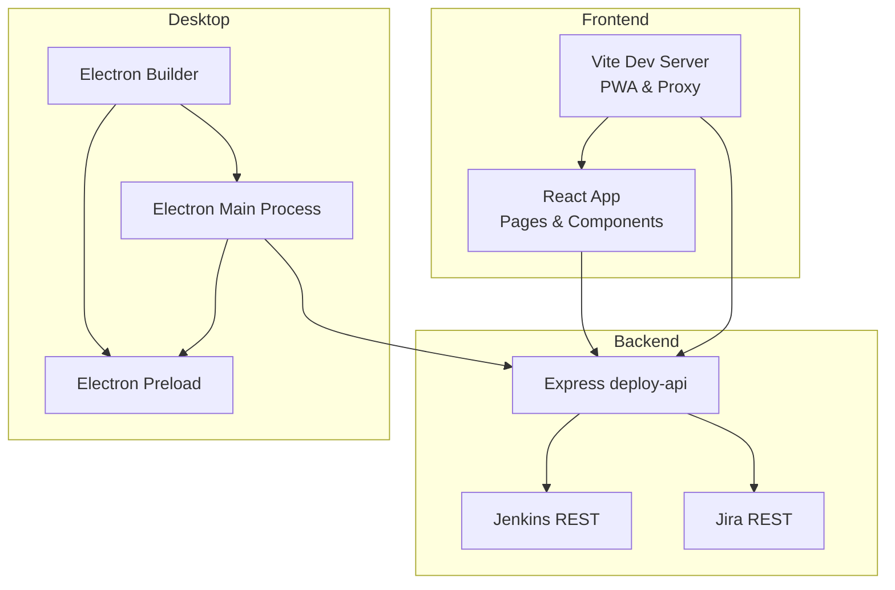
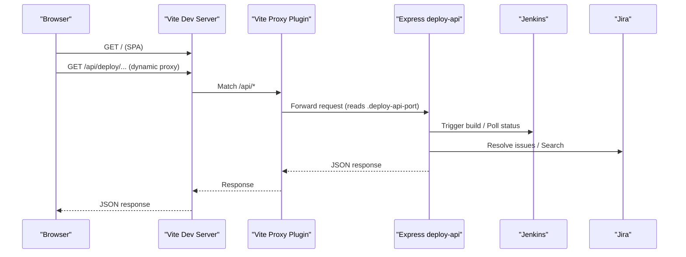
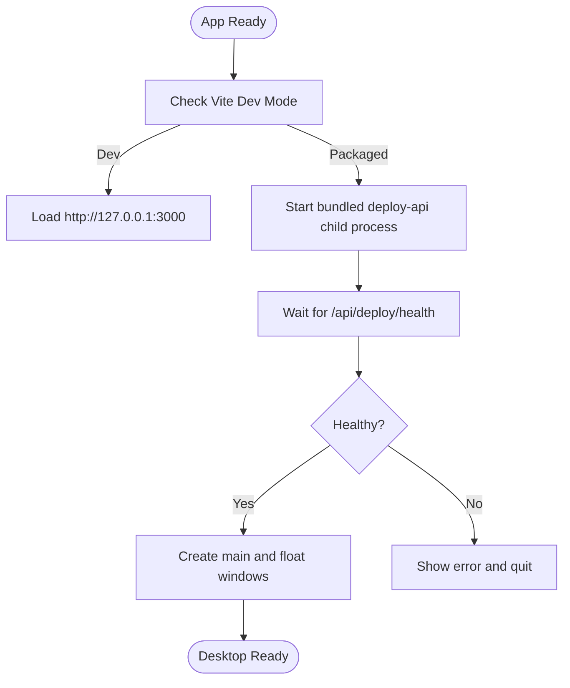
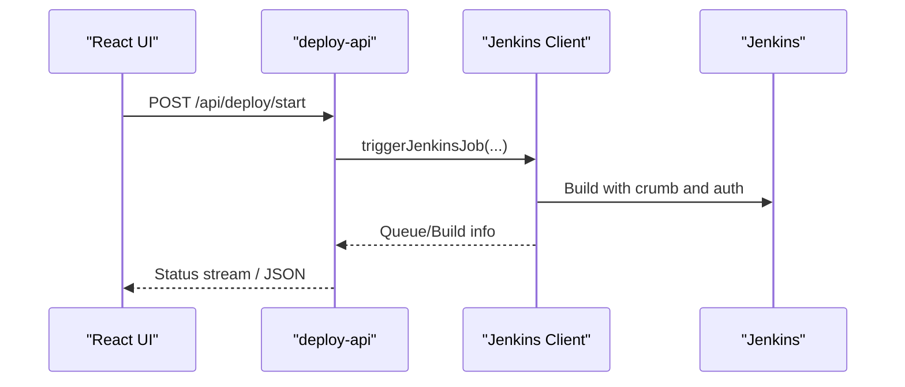
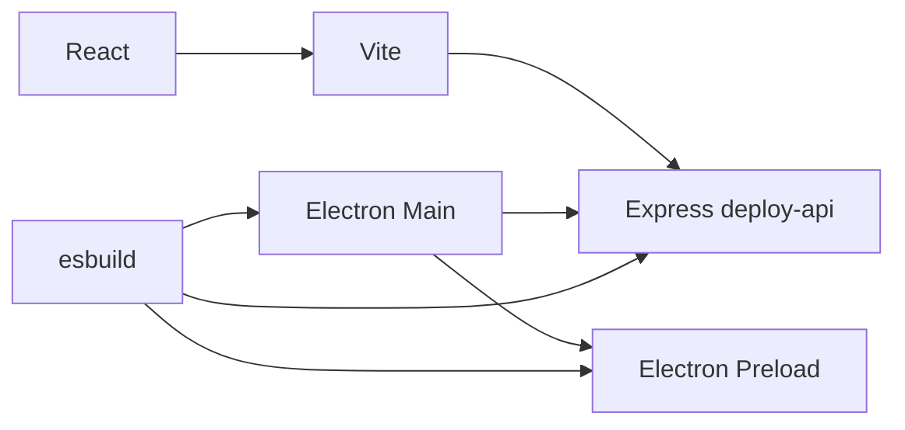

# Development Guidelines

<cite>
**Referenced Files in This Document**
- [package.json](file://package.json)
- [vite.config.ts](file://vite.config.ts)
- [tsconfig.json](file://tsconfig.json)
- [src/main.tsx](file://src/main.tsx)
- [src/App.tsx](file://src/App.tsx)
- [src/pages/Dashboard.tsx](file://src/pages/Dashboard.tsx)
- [src/pages/Tasks.tsx](file://src/pages/Tasks.tsx)
- [src/lib/deploy-api-url.ts](file://src/lib/deploy-api-url.ts)
- [electron/main.ts](file://electron/main.ts)
- [scripts/build-electron.mjs](file://scripts/build-electron.mjs)
- [vite.deploy-api-proxy-plugin.ts](file://vite.deploy-api-proxy-plugin.ts)
- [server/deploy-api.ts](file://server/deploy-api.ts)
- [server/jenkins-client.ts](file://server/jenkins-client.ts)
- [config/deploy-projects.json](file://config/deploy-projects.json)
- [test/frontend/app-shell.test.tsx](file://test/frontend/app-shell.test.tsx)
- [test/server/deploy-contract.test.ts](file://test/server/deploy-contract.test.ts)
</cite>

## Table of Contents
1. [Introduction](#introduction)
2. [Project Structure](#project-structure)
3. [Core Components](#core-components)
4. [Architecture Overview](#architecture-overview)
5. [Detailed Component Analysis](#detailed-component-analysis)
6. [Dependency Analysis](#dependency-analysis)
7. [Performance Considerations](#performance-considerations)
8. [Security Considerations](#security-considerations)
9. [Testing Best Practices](#testing-best-practices)
10. [Contribution Guidelines](#contribution-guidelines)
11. [Debugging Techniques](#debugging-techniques)
12. [Deployment and Release Procedures](#deployment-and-release-procedures)
13. [Common Scenarios and Troubleshooting](#common-scenarios-and-troubleshooting)
14. [Conclusion](#conclusion)

## Introduction
This document defines comprehensive development guidelines and best practices for the project. It covers code style standards, component architecture, testing, contribution workflow, debugging, performance, security, and deployment/release procedures. The project is a React web application with an Electron desktop wrapper and a Node.js backend service (deploy-api) integrated via Vite’s development proxy and PWA configuration.

## Project Structure
The repository follows a hybrid frontend-first structure with Electron packaging and a Node.js backend service:
- Frontend: React + Vite, with Tailwind CSS and PWA support
- Backend: Express-based deploy-api with Jenkins/Jira integrations
- Desktop: Electron main/preload processes and build pipeline
- Tests: Node test runner for both frontend and server

**Diagram sources**
- [vite.config.ts:1-111](file://vite.config.ts#L1-L111)
- [src/App.tsx:1-136](file://src/App.tsx#L1-L136)
- [server/deploy-api.ts:1-120](file://server/deploy-api.ts#L1-L120)
- [electron/main.ts:1-120](file://electron/main.ts#L1-L120)
- [scripts/build-electron.mjs:1-76](file://scripts/build-electron.mjs#L1-L76)

**Section sources**
- [package.json:1-99](file://package.json#L1-L99)
- [vite.config.ts:1-111](file://vite.config.ts#L1-L111)
- [tsconfig.json:1-28](file://tsconfig.json#L1-L28)
- [src/main.tsx:1-11](file://src/main.tsx#L1-L11)
- [src/App.tsx:1-136](file://src/App.tsx#L1-L136)
- [electron/main.ts:1-120](file://electron/main.ts#L1-L120)
- [scripts/build-electron.mjs:1-76](file://scripts/build-electron.mjs#L1-L76)

## Core Components
- Frontend entry and routing: React root, router, and top navigation
- Pages: Dashboard and Tasks with local state and persistence
- Backend API: Express routes for deployment, startup, Jira, and automation orchestration
- Electron: Main process manages windows, lifecycle, and child process for deploy-api
- Build pipeline: esbuild bundling for Electron assets and packaging

Key implementation references:
- App shell and routes: [src/App.tsx:1-136](file://src/App.tsx#L1-L136)
- Tasks page state and persistence: [src/pages/Tasks.tsx:1-542](file://src/pages/Tasks.tsx#L1-L542)
- Dashboard cards: [src/pages/Dashboard.tsx:1-114](file://src/pages/Dashboard.tsx#L1-L114)
- API base URL helper: [src/lib/deploy-api-url.ts:1-28](file://src/lib/deploy-api-url.ts#L1-L28)
- Electron main process: [electron/main.ts:1-120](file://electron/main.ts#L1-L120)
- Backend entrypoint: [server/deploy-api.ts:1-120](file://server/deploy-api.ts#L1-L120)
- Build script: [scripts/build-electron.mjs:1-76](file://scripts/build-electron.mjs#L1-L76)

**Section sources**
- [src/App.tsx:1-136](file://src/App.tsx#L1-L136)
- [src/pages/Tasks.tsx:1-542](file://src/pages/Tasks.tsx#L1-L542)
- [src/pages/Dashboard.tsx:1-114](file://src/pages/Dashboard.tsx#L1-L114)
- [src/lib/deploy-api-url.ts:1-28](file://src/lib/deploy-api-url.ts#L1-L28)
- [electron/main.ts:1-120](file://electron/main.ts#L1-L120)
- [server/deploy-api.ts:1-120](file://server/deploy-api.ts#L1-L120)
- [scripts/build-electron.mjs:1-76](file://scripts/build-electron.mjs#L1-L76)

## Architecture Overview
The system integrates three layers:
- Web UI: React SPA served by Vite, with PWA caching and dynamic proxy to backend
- Backend service: Express server exposing APIs for deployment, startup, Jira, and automation
- Desktop wrapper: Electron loads the SPA and embeds the backend as a child process

**Diagram sources**
- [vite.config.ts:1-111](file://vite.config.ts#L1-L111)
- [vite.deploy-api-proxy-plugin.ts:1-166](file://vite.deploy-api-proxy-plugin.ts#L1-L166)
- [server/deploy-api.ts:1-120](file://server/deploy-api.ts#L1-L120)
- [server/jenkins-client.ts:1-191](file://server/jenkins-client.ts#L1-L191)

**Section sources**
- [vite.config.ts:1-111](file://vite.config.ts#L1-L111)
- [vite.deploy-api-proxy-plugin.ts:1-166](file://vite.deploy-api-proxy-plugin.ts#L1-L166)
- [server/deploy-api.ts:1-120](file://server/deploy-api.ts#L1-L120)
- [server/jenkins-client.ts:1-191](file://server/jenkins-client.ts#L1-L191)

## Detailed Component Analysis

### React Component Architecture Guidelines
- Prefer functional components with hooks for state and effects
- Keep presentational components pure; delegate side effects to hooks
- Use strict typing for props and state
- Centralize shared logic in custom hooks or libraries
- Favor composition and reusable components

Examples in code:
- App shell and navigation: [src/App.tsx:1-136](file://src/App.tsx#L1-L136)
- Dashboard cards: [src/pages/Dashboard.tsx:1-114](file://src/pages/Dashboard.tsx#L1-L114)
- Tasks page with local state and persistence: [src/pages/Tasks.tsx:1-542](file://src/pages/Tasks.tsx#L1-L542)
- API base URL helper: [src/lib/deploy-api-url.ts:1-28](file://src/lib/deploy-api-url.ts#L1-L28)

**Section sources**
- [src/App.tsx:1-136](file://src/App.tsx#L1-L136)
- [src/pages/Dashboard.tsx:1-114](file://src/pages/Dashboard.tsx#L1-L114)
- [src/pages/Tasks.tsx:1-542](file://src/pages/Tasks.tsx#L1-L542)
- [src/lib/deploy-api-url.ts:1-28](file://src/lib/deploy-api-url.ts#L1-L28)

### Electron Desktop Wrapper
- Main process manages BrowserWindows, IPC handlers, and lifecycle
- Child process spawns the backend service and monitors health
- Build script bundles main/preload/api into dist-electron for packaging

**Diagram sources**
- [electron/main.ts:389-406](file://electron/main.ts#L389-L406)

**Section sources**
- [electron/main.ts:1-120](file://electron/main.ts#L1-L120)
- [electron/main.ts:389-406](file://electron/main.ts#L389-L406)
- [scripts/build-electron.mjs:1-76](file://scripts/build-electron.mjs#L1-L76)

### Backend Orchestration and Integrations
- Express server exposes routes for deployment, startup, Jira, and automation
- Jenkins client handles triggers and polling with CSRF crumb and sanitized errors
- Project configurations loaded from JSON for job mapping and defaults

**Diagram sources**
- [server/deploy-api.ts:1-120](file://server/deploy-api.ts#L1-L120)
- [server/jenkins-client.ts:1-191](file://server/jenkins-client.ts#L1-L191)

**Section sources**
- [server/deploy-api.ts:1-120](file://server/deploy-api.ts#L1-L120)
- [server/jenkins-client.ts:1-191](file://server/jenkins-client.ts#L1-L191)
- [config/deploy-projects.json:1-78](file://config/deploy-projects.json#L1-L78)

## Dependency Analysis
- Frontend depends on React, React Router, Tailwind CSS, and Vite
- Backend depends on Express, dotenv, and child process utilities
- Electron depends on Node.js APIs and packages for process management
- Build pipeline uses esbuild to bundle main/preload/api

**Diagram sources**
- [package.json:31-60](file://package.json#L31-L60)
- [scripts/build-electron.mjs:1-76](file://scripts/build-electron.mjs#L1-L76)

**Section sources**
- [package.json:1-99](file://package.json#L1-L99)
- [scripts/build-electron.mjs:1-76](file://scripts/build-electron.mjs#L1-L76)

## Performance Considerations
- Frontend
  - PWA caching tuned for development vs production; avoid caching /api in development
  - Path aliases and minimal transitive dependencies reduce bundle size
  - Prefer lazy loading for heavy pages
- Backend
  - Stream logs and avoid buffering large outputs
  - Sanitize and truncate error messages for network responses
- Desktop
  - Remove large bundled fonts to speed up packaging
  - Minimize preload/main bundle size and avoid unnecessary native modules

Practical references:
- PWA and caching configuration: [vite.config.ts:55-78](file://vite.config.ts#L55-L78)
- Font removal in build: [scripts/build-electron.mjs:57-73](file://scripts/build-electron.mjs#L57-L73)
- Log filtering and truncation: [server/deploy-api.ts:191-224](file://server/deploy-api.ts#L191-L224)

**Section sources**
- [vite.config.ts:55-78](file://vite.config.ts#L55-L78)
- [scripts/build-electron.mjs:57-73](file://scripts/build-electron.mjs#L57-L73)
- [server/deploy-api.ts:191-224](file://server/deploy-api.ts#L191-L224)

## Security Considerations
- Backend-first integrations
  - Jenkins credentials and CSRF crumbs handled server-side to avoid exposing secrets in the browser
  - Jenkins errors sanitized to avoid leaking HTML bodies
- Environment configuration
  - .env loading controlled by backend; desktop can also use user data .env
- API base URL resolution
  - Supports absolute URLs; validates and normalizes prefixes to avoid path traversal

References:
- Jenkins client with crumb and sanitized errors: [server/jenkins-client.ts:1-191](file://server/jenkins-client.ts#L1-L191)
- API base URL normalization: [src/lib/deploy-api-url.ts:1-28](file://src/lib/deploy-api-url.ts#L1-L28)
- Backend .env loading: [server/deploy-api.ts:65-73](file://server/deploy-api.ts#L65-L73)

**Section sources**
- [server/jenkins-client.ts:1-191](file://server/jenkins-client.ts#L1-L191)
- [src/lib/deploy-api-url.ts:1-28](file://src/lib/deploy-api-url.ts#L1-L28)
- [server/deploy-api.ts:65-73](file://server/deploy-api.ts#L65-L73)

## Testing Best Practices
- Unit and integration tests use Node’s test runner
- Frontend tests render components in memory and assert DOM attributes and content
- Server tests validate contract parsing, credential checks, and parameter building

Recommended patterns:
- Isolate side effects behind mocks or fixtures
- Test both happy paths and error conditions
- Use deterministic inputs and assert on rendered output or state transitions

References:
- Frontend test suite: [test/frontend/app-shell.test.tsx:1-55](file://test/frontend/app-shell.test.tsx#L1-L55)
- Server contract tests: [test/server/deploy-contract.test.ts:1-66](file://test/server/deploy-contract.test.ts#L1-L66)

**Section sources**
- [test/frontend/app-shell.test.tsx:1-55](file://test/frontend/app-shell.test.tsx#L1-L55)
- [test/server/deploy-contract.test.ts:1-66](file://test/server/deploy-contract.test.ts#L1-L66)

## Contribution Guidelines
- Development workflow
  - Use scripts to run frontend, backend, and desktop concurrently
  - Desktop builds are prepared via a dedicated build script before packaging
- Pull requests
  - Keep changes focused and add tests where applicable
  - Update documentation and tests alongside code changes
- Versioning and releases
  - Version is managed in package metadata; release artifacts produced by Electron Builder

References:
- Scripts and commands: [package.json:9-29](file://package.json#L9-L29)
- Electron build preparation: [scripts/build-electron.mjs:1-76](file://scripts/build-electron.mjs#L1-L76)
- Electron builder configuration: [package.json:61-97](file://package.json#L61-L97)

**Section sources**
- [package.json:9-29](file://package.json#L9-L29)
- [scripts/build-electron.mjs:1-76](file://scripts/build-electron.mjs#L1-L76)
- [package.json:61-97](file://package.json#L61-L97)

## Debugging Techniques
- Development tools
  - Electron DevTools can be opened conditionally for main and float windows
  - Vite DevTools available in development; HMR can be toggled via environment
- Logging strategies
  - Backend strips ANSI and collapses dense progress dashboards for readability
  - Logs are emitted with timestamps and levels; SSE-like streaming for long-running tasks
- Troubleshooting
  - Proxy plugin surfaces explicit errors when backend is unreachable or returns HTML
  - Desktop waits for backend health; errors are shown with actionable hints

References:
- Electron DevTools and window creation: [electron/main.ts:287-292](file://electron/main.ts#L287-L292)
- Proxy error messaging: [vite.deploy-api-proxy-plugin.ts:120-130](file://vite.deploy-api-proxy-plugin.ts#L120-L130)
- Backend log filtering: [server/deploy-api.ts:191-224](file://server/deploy-api.ts#L191-L224)

**Section sources**
- [electron/main.ts:287-292](file://electron/main.ts#L287-L292)
- [vite.deploy-api-proxy-plugin.ts:120-130](file://vite.deploy-api-proxy-plugin.ts#L120-L130)
- [server/deploy-api.ts:191-224](file://server/deploy-api.ts#L191-L224)

## Deployment and Release Procedures
- Build and packaging
  - Build client and Electron assets, then package with Electron Builder
  - Desktop build script bundles main/preload/api into dist-electron
- Versioning and changelog
  - Version is defined in package metadata; maintain a changelog outside this repository
- Rollback strategies
  - Revert to previous packaged release; ensure backend port availability and health checks

References:
- Packaging scripts and builder config: [package.json:18-29](file://package.json#L18-L29)
- Electron build pipeline: [scripts/build-electron.mjs:1-76](file://scripts/build-electron.mjs#L1-L76)

**Section sources**
- [package.json:18-29](file://package.json#L18-L29)
- [scripts/build-electron.mjs:1-76](file://scripts/build-electron.mjs#L1-L76)

## Common Scenarios and Troubleshooting
- Development proxy returns HTML instead of JSON
  - Cause: backend port mismatch or occupied port
  - Action: confirm backend is running on the expected port and .deploy-api-port matches
  - Reference: [vite.deploy-api-proxy-plugin.ts:120-130](file://vite.deploy-api-proxy-plugin.ts#L120-L130)
- Jenkins authentication or permission failure
  - Cause: missing token, invalid crumb, or insufficient permissions
  - Action: verify credentials and crumb; check Jenkins job permissions
  - Reference: [server/jenkins-client.ts:71-87](file://server/jenkins-client.ts#L71-L87)
- Desktop fails to start backend
  - Cause: port conflicts or backend crash
  - Action: ensure port is free; inspect last backend output; verify .env presence
  - Reference: [electron/main.ts:180-256](file://electron/main.ts#L180-L256)
- Large font slows down packaging
  - Action: remove bundled font during build or keep it via environment variable
  - Reference: [scripts/build-electron.mjs:57-73](file://scripts/build-electron.mjs#L57-L73)

**Section sources**
- [vite.deploy-api-proxy-plugin.ts:120-130](file://vite.deploy-api-proxy-plugin.ts#L120-L130)
- [server/jenkins-client.ts:71-87](file://server/jenkins-client.ts#L71-L87)
- [electron/main.ts:180-256](file://electron/main.ts#L180-L256)
- [scripts/build-electron.mjs:57-73](file://scripts/build-electron.mjs#L57-L73)

## Conclusion
These guidelines consolidate the project’s architecture, coding standards, testing, and operational practices. Following them ensures consistent development, robust integrations, and reliable deployments across web, backend, and desktop environments.