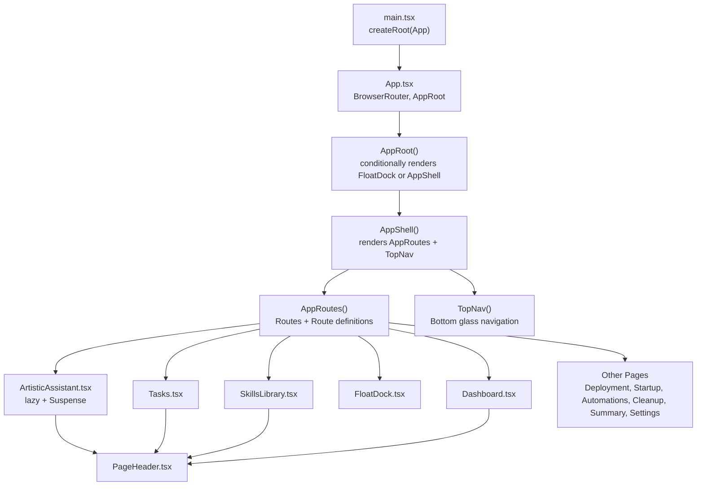
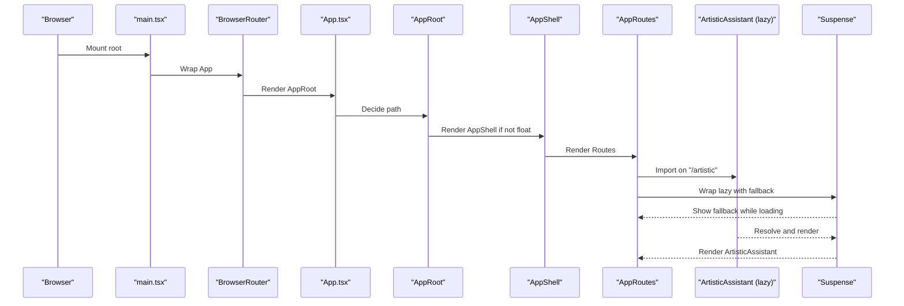
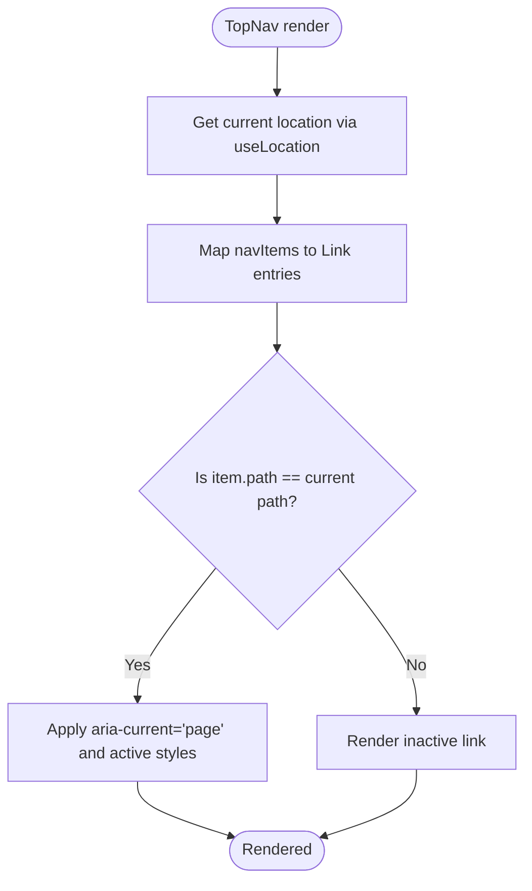
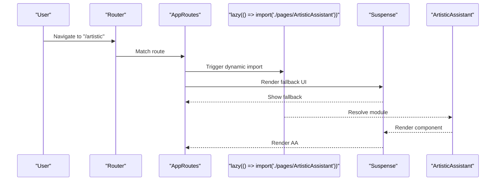
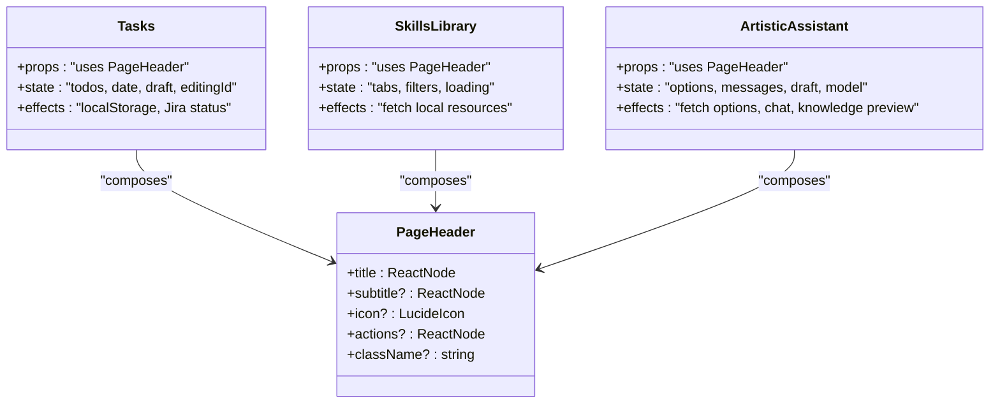
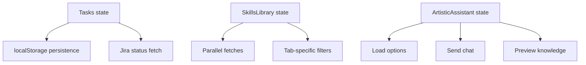
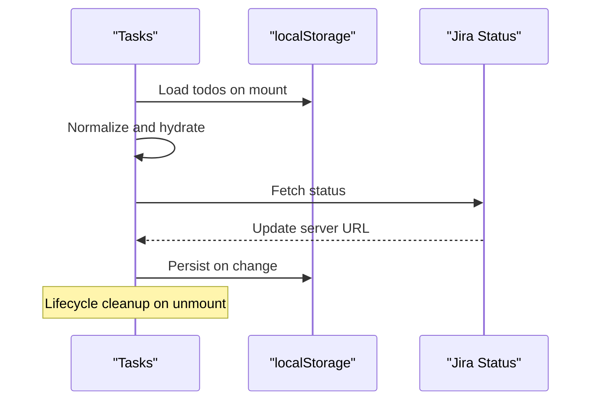
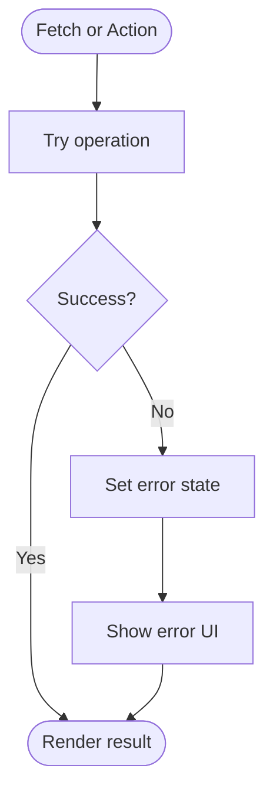
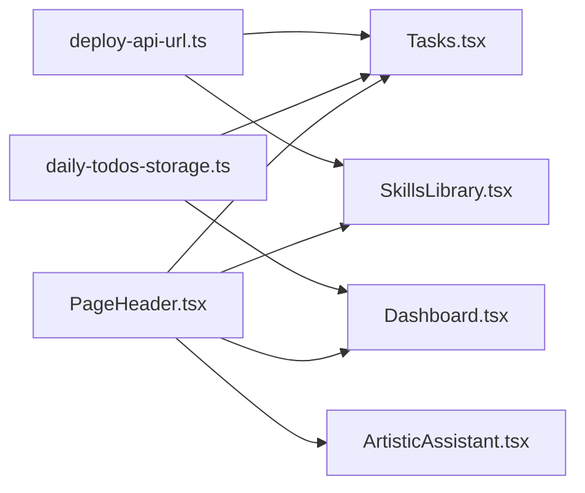
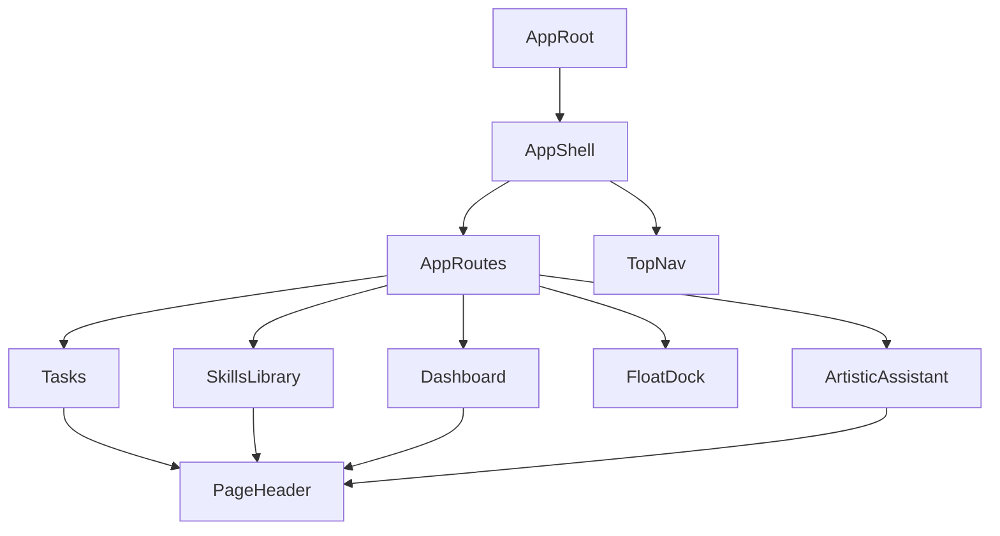

# Component Architecture

<cite>
**Referenced Files in This Document**
- [App.tsx](file://src/App.tsx)
- [main.tsx](file://src/main.tsx)
- [ArtisticAssistant.tsx](file://src/pages/ArtisticAssistant.tsx)
- [PageHeader.tsx](file://src/components/PageHeader.tsx)
- [Dashboard.tsx](file://src/pages/Dashboard.tsx)
- [Tasks.tsx](file://src/pages/Tasks.tsx)
- [SkillsLibrary.tsx](file://src/pages/SkillsLibrary.tsx)
- [FloatDock.tsx](file://src/pages/FloatDock.tsx)
- [daily-todos-storage.ts](file://src/lib/daily-todos-storage.ts)
- [deploy-api-url.ts](file://src/lib/deploy-api-url.ts)
- [index.css](file://src/index.css)
- [ArtisticAssistant.css](file://src/pages/ArtisticAssistant.css)
</cite>

## Table of Contents
1. [Introduction](#introduction)
2. [Project Structure](#project-structure)
3. [Core Components](#core-components)
4. [Architecture Overview](#architecture-overview)
5. [Detailed Component Analysis](#detailed-component-analysis)
6. [Dependency Analysis](#dependency-analysis)
7. [Performance Considerations](#performance-considerations)
8. [Troubleshooting Guide](#troubleshooting-guide)
9. [Conclusion](#conclusion)

## Introduction
This document explains the React component architecture of the application, focusing on the component hierarchy starting from AppRoot and AppShell, the navigation system driven by TopNav, route-based rendering, and the lazy loading pattern for the ArtisticAssistant page. It also covers component composition patterns, prop passing strategies, modular page structure, routing and state management interactions, lifecycle management, error handling, performance optimizations, and reusability patterns with shared components.

## Project Structure
The application follows a feature-based organization under src with a small set of top-level pages and a shared PageHeader component. Routing is handled via react-router-dom, and the UI framework leverages Tailwind and a custom design token system defined in index.css.

**Diagram sources**
- [main.tsx:1-11](file://src/main.tsx#L1-L11)
- [App.tsx:129-136](file://src/App.tsx#L129-L136)
- [App.tsx:121-127](file://src/App.tsx#L121-L127)
- [App.tsx:110-119](file://src/App.tsx#L110-L119)
- [App.tsx:78-108](file://src/App.tsx#L78-L108)
- [App.tsx:49-76](file://src/App.tsx#L49-L76)
- [ArtisticAssistant.tsx:1-349](file://src/pages/ArtisticAssistant.tsx#L1-L349)
- [Tasks.tsx:1-542](file://src/pages/Tasks.tsx#L1-L542)
- [Dashboard.tsx:1-114](file://src/pages/Dashboard.tsx#L1-L114)
- [SkillsLibrary.tsx:1-599](file://src/pages/SkillsLibrary.tsx#L1-L599)
- [FloatDock.tsx:1-638](file://src/pages/FloatDock.tsx#L1-L638)
- [PageHeader.tsx:1-63](file://src/components/PageHeader.tsx#L1-L63)

**Section sources**
- [main.tsx:1-11](file://src/main.tsx#L1-L11)
- [App.tsx:129-136](file://src/App.tsx#L129-L136)
- [App.tsx:110-119](file://src/App.tsx#L110-L119)
- [App.tsx:78-108](file://src/App.tsx#L78-L108)
- [App.tsx:49-76](file://src/App.tsx#L49-L76)

## Core Components
- AppRoot: Decides whether to render the Electron float dock or the main shell. Uses react-router-dom’s useLocation to branch.
- AppShell: Hosts the main app layout with AppRoutes and TopNav.
- AppRoutes: Central route registry mapping paths to page components, including a lazy-loaded route for ArtisticAssistant.
- TopNav: Bottom glass navigation bar built from a shared navItems array and react-router Link.
- PageHeader: Reusable page header component accepting title, subtitle, icon, actions, and className props.
- ArtisticAssistant: A complex page implementing chat UX, knowledge retrieval preview, and model selection with internal state and lifecycle hooks.
- Tasks: A feature-rich page managing daily todos with persistence, keyboard interactions, drag-and-drop ordering, and Jira integration.
- SkillsLibrary: A library browser for local skills, MCP servers, and models with filtering, animations, and clipboard operations.
- FloatDock: Electron float panel with drag gestures, command resolution, and IPC integration.

**Section sources**
- [App.tsx:121-127](file://src/App.tsx#L121-L127)
- [App.tsx:110-119](file://src/App.tsx#L110-L119)
- [App.tsx:78-108](file://src/App.tsx#L78-L108)
- [App.tsx:49-76](file://src/App.tsx#L49-L76)
- [PageHeader.tsx:4-20](file://src/components/PageHeader.tsx#L4-L20)
- [ArtisticAssistant.tsx:57-348](file://src/pages/ArtisticAssistant.tsx#L57-L348)
- [Tasks.tsx:136-541](file://src/pages/Tasks.tsx#L136-L541)
- [SkillsLibrary.tsx:202-598](file://src/pages/SkillsLibrary.tsx#L202-L598)
- [FloatDock.tsx:111-637](file://src/pages/FloatDock.tsx#L111-L637)

## Architecture Overview
The runtime architecture centers on a single-page app with client-side routing. AppRoot conditionally switches between the Electron float dock and the main shell. AppShell composes AppRoutes and TopNav. AppRoutes defines routes and mounts page components. ArtisticAssistant is lazily loaded behind a Suspense boundary to optimize initial bundle size.

**Diagram sources**
- [main.tsx:6-10](file://src/main.tsx#L6-L10)
- [App.tsx:129-136](file://src/App.tsx#L129-L136)
- [App.tsx:121-127](file://src/App.tsx#L121-L127)
- [App.tsx:110-119](file://src/App.tsx#L110-L119)
- [App.tsx:78-108](file://src/App.tsx#L78-L108)
- [App.tsx:24-24](file://src/App.tsx#L24-L24)

## Detailed Component Analysis

### Navigation and Routing System
- TopNav builds links from a centralized navItems array and highlights the active route using react-router’s useLocation and Link.
- AppRoutes centralizes route definitions, including a catch-all redirect to the default route and a dedicated lazy route for ArtisticAssistant guarded by Suspense.

**Diagram sources**
- [App.tsx:49-76](file://src/App.tsx#L49-L76)

**Section sources**
- [App.tsx:49-76](file://src/App.tsx#L49-L76)
- [App.tsx:78-108](file://src/App.tsx#L78-L108)

### Lazy Loading: ArtisticAssistant
ArtisticAssistant is imported lazily and rendered inside a Suspense boundary with a fallback UI. This defers loading until the route is visited, reducing initial bundle size.

**Diagram sources**
- [App.tsx:24-24](file://src/App.tsx#L24-L24)
- [App.tsx:91-104](file://src/App.tsx#L91-L104)

**Section sources**
- [App.tsx:24-24](file://src/App.tsx#L24-L24)
- [App.tsx:91-104](file://src/App.tsx#L91-L104)

### Component Composition and Prop Passing
- PageHeader is composed by multiple pages (Tasks, SkillsLibrary, Dashboard, ArtisticAssistant) and accepts props for title, subtitle, icon, actions, and className. This promotes reuse and consistent typography and spacing.
- Tasks composes a rich set of subcomponents and helpers (date utilities, Jira integration helpers, drag-and-drop handlers) and passes computed props to child components.
- SkillsLibrary composes cards and lists with motion animations and passes callbacks for clipboard operations and layout transitions.

**Diagram sources**
- [PageHeader.tsx:4-20](file://src/components/PageHeader.tsx#L4-L20)
- [Tasks.tsx:136-541](file://src/pages/Tasks.tsx#L136-L541)
- [SkillsLibrary.tsx:202-598](file://src/pages/SkillsLibrary.tsx#L202-L598)
- [ArtisticAssistant.tsx:57-348](file://src/pages/ArtisticAssistant.tsx#L57-L348)

**Section sources**
- [PageHeader.tsx:4-20](file://src/components/PageHeader.tsx#L4-L20)
- [Tasks.tsx:136-541](file://src/pages/Tasks.tsx#L136-L541)
- [SkillsLibrary.tsx:202-598](file://src/pages/SkillsLibrary.tsx#L202-L598)
- [ArtisticAssistant.tsx:57-348](file://src/pages/ArtisticAssistant.tsx#L57-L348)

### Modular Page Structure and State Management
- Tasks manages a complex local state with daily todos persisted to localStorage and integrates with external systems (Jira) via API calls. It uses memoization and normalization to keep state efficient.
- SkillsLibrary orchestrates three tabs (skills, MCP, models) with independent filters and loaders, performing parallel fetches and maintaining separate UI states per tab.
- ArtisticAssistant encapsulates chat state, model selection, and knowledge preview, with lifecycle hooks to load configuration and handle user interactions.

**Diagram sources**
- [Tasks.tsx:147-210](file://src/pages/Tasks.tsx#L147-L210)
- [SkillsLibrary.tsx:216-250](file://src/pages/SkillsLibrary.tsx#L216-L250)
- [ArtisticAssistant.tsx:70-95](file://src/pages/ArtisticAssistant.tsx#L70-L95)
- [ArtisticAssistant.tsx:115-174](file://src/pages/ArtisticAssistant.tsx#L115-L174)
- [ArtisticAssistant.tsx:176-199](file://src/pages/ArtisticAssistant.tsx#L176-L199)

**Section sources**
- [Tasks.tsx:147-210](file://src/pages/Tasks.tsx#L147-L210)
- [SkillsLibrary.tsx:216-250](file://src/pages/SkillsLibrary.tsx#L216-L250)
- [ArtisticAssistant.tsx:70-95](file://src/pages/ArtisticAssistant.tsx#L70-L95)
- [ArtisticAssistant.tsx:115-174](file://src/pages/ArtisticAssistant.tsx#L115-L174)
- [ArtisticAssistant.tsx:176-199](file://src/pages/ArtisticAssistant.tsx#L176-L199)

### Component Lifecycle Management
- Tasks initializes from localStorage, hydrates state, and persists updates. It fetches Jira status once and cleans up with an abortable effect.
- SkillsLibrary loads data on mount and exposes a refresh action. It computes filtered lists via memoization.
- ArtisticAssistant loads configuration on mount, parses model choices, and performs network requests for chat and knowledge preview.

**Diagram sources**
- [Tasks.tsx:147-210](file://src/pages/Tasks.tsx#L147-L210)
- [Tasks.tsx:186-201](file://src/pages/Tasks.tsx#L186-L201)

**Section sources**
- [Tasks.tsx:147-210](file://src/pages/Tasks.tsx#L147-L210)
- [Tasks.tsx:186-201](file://src/pages/Tasks.tsx#L186-L201)

### Error Boundaries and Error Handling
- ArtisticAssistant surfaces errors for both configuration loading and chat interactions, displaying user-friendly messages and preventing crashes.
- SkillsLibrary displays fetch errors and hints for troubleshooting missing services.

**Diagram sources**
- [ArtisticAssistant.tsx:70-91](file://src/pages/ArtisticAssistant.tsx#L70-L91)
- [ArtisticAssistant.tsx:115-174](file://src/pages/ArtisticAssistant.tsx#L115-L174)
- [SkillsLibrary.tsx:216-250](file://src/pages/SkillsLibrary.tsx#L216-L250)

**Section sources**
- [ArtisticAssistant.tsx:70-91](file://src/pages/ArtisticAssistant.tsx#L70-L91)
- [ArtisticAssistant.tsx:115-174](file://src/pages/ArtisticAssistant.tsx#L115-L174)
- [SkillsLibrary.tsx:216-250](file://src/pages/SkillsLibrary.tsx#L216-L250)

### Performance Optimizations
- Lazy loading of ArtisticAssistant reduces initial bundle size.
- Memoization of derived values (e.g., filtered lists, model choice) avoids unnecessary re-renders.
- Efficient state updates (e.g., immutable updates for arrays) minimize re-render costs.
- CSS-in-JS tokens and Tailwind utilities enable consistent, maintainable styling with minimal overhead.

**Section sources**
- [App.tsx:24-24](file://src/App.tsx#L24-L24)
- [SkillsLibrary.tsx:256-288](file://src/pages/SkillsLibrary.tsx#L256-L288)
- [ArtisticAssistant.tsx:97-102](file://src/pages/ArtisticAssistant.tsx#L97-L102)

### Reusability Patterns and Shared Libraries
- PageHeader is a reusable component consumed across multiple pages, ensuring consistent typography and layout.
- daily-todos-storage provides shared utilities for tasks persistence and cross-page integration (e.g., adding Jira items to today’s list).
- deploy-api-url centralizes API base URL construction and path building for various backend services.

**Diagram sources**
- [PageHeader.tsx:14-62](file://src/components/PageHeader.tsx#L14-L62)
- [Tasks.tsx:136-541](file://src/pages/Tasks.tsx#L136-L541)
- [SkillsLibrary.tsx:202-598](file://src/pages/SkillsLibrary.tsx#L202-L598)
- [Dashboard.tsx:48-113](file://src/pages/Dashboard.tsx#L48-L113)
- [ArtisticAssistant.tsx:57-348](file://src/pages/ArtisticAssistant.tsx#L57-L348)
- [daily-todos-storage.ts:44-77](file://src/lib/daily-todos-storage.ts#L44-L77)
- [deploy-api-url.ts:6-27](file://src/lib/deploy-api-url.ts#L6-L27)

**Section sources**
- [PageHeader.tsx:14-62](file://src/components/PageHeader.tsx#L14-L62)
- [daily-todos-storage.ts:44-77](file://src/lib/daily-todos-storage.ts#L44-L77)
- [deploy-api-url.ts:6-27](file://src/lib/deploy-api-url.ts#L6-L27)

## Dependency Analysis
The component graph emphasizes low coupling and clear separation of concerns:
- AppRoot depends on react-router for path detection.
- AppShell composes AppRoutes and TopNav.
- AppRoutes depends on page components and lazy imports.
- PageHeader is a leaf component reused across pages.
- Tasks, SkillsLibrary, and ArtisticAssistant encapsulate their own state and effects.

**Diagram sources**
- [App.tsx:121-127](file://src/App.tsx#L121-L127)
- [App.tsx:110-119](file://src/App.tsx#L110-L119)
- [App.tsx:78-108](file://src/App.tsx#L78-L108)
- [App.tsx:49-76](file://src/App.tsx#L49-L76)
- [Tasks.tsx:136-541](file://src/pages/Tasks.tsx#L136-L541)
- [SkillsLibrary.tsx:202-598](file://src/pages/SkillsLibrary.tsx#L202-L598)
- [Dashboard.tsx:48-113](file://src/pages/Dashboard.tsx#L48-L113)
- [ArtisticAssistant.tsx:57-348](file://src/pages/ArtisticAssistant.tsx#L57-L348)
- [PageHeader.tsx:14-62](file://src/components/PageHeader.tsx#L14-L62)

**Section sources**
- [App.tsx:121-127](file://src/App.tsx#L121-L127)
- [App.tsx:110-119](file://src/App.tsx#L110-L119)
- [App.tsx:78-108](file://src/App.tsx#L78-L108)
- [App.tsx:49-76](file://src/App.tsx#L49-L76)

## Performance Considerations
- Prefer lazy loading for heavy pages like ArtisticAssistant to improve initial load performance.
- Use memoization for derived data and expensive computations to avoid unnecessary renders.
- Keep state updates localized and immutable to reduce re-render cascades.
- Utilize CSS variables and Tailwind utilities for consistent styling without bloating component logic.

## Troubleshooting Guide
- ArtisticAssistant configuration failures: Check the options loading path and error messages surfaced to the UI.
- SkillsLibrary data loading: Verify backend endpoints and proxy configuration; the UI provides actionable hints.
- Tasks persistence: Confirm localStorage availability and that the storage key matches expectations.
- Electron float dock: Ensure the float panel is opened at the correct path and that IPC APIs are available.

**Section sources**
- [ArtisticAssistant.tsx:70-91](file://src/pages/ArtisticAssistant.tsx#L70-L91)
- [SkillsLibrary.tsx:438-448](file://src/pages/SkillsLibrary.tsx#L438-L448)
- [daily-todos-storage.ts:44-56](file://src/lib/daily-todos-storage.ts#L44-L56)
- [FloatDock.tsx:190-195](file://src/pages/FloatDock.tsx#L190-L195)

## Conclusion
The component architecture demonstrates a clean separation of concerns, strong composability via PageHeader, robust routing with lazy loading, and thoughtful state management. The design supports scalability, maintainability, and performance through modular pages, memoization, and shared utilities.