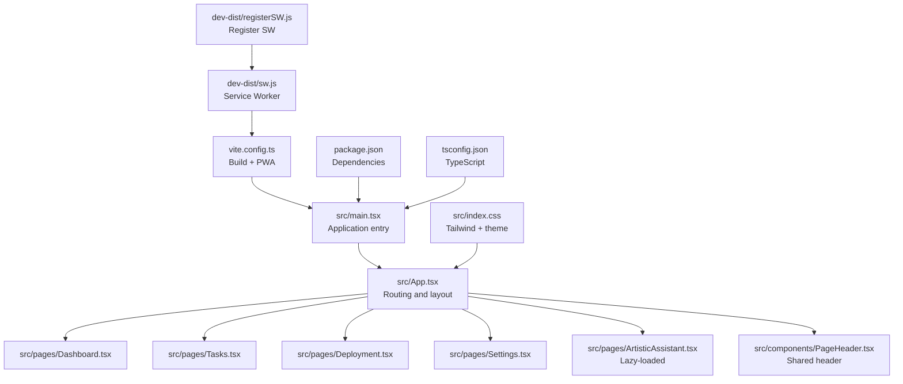
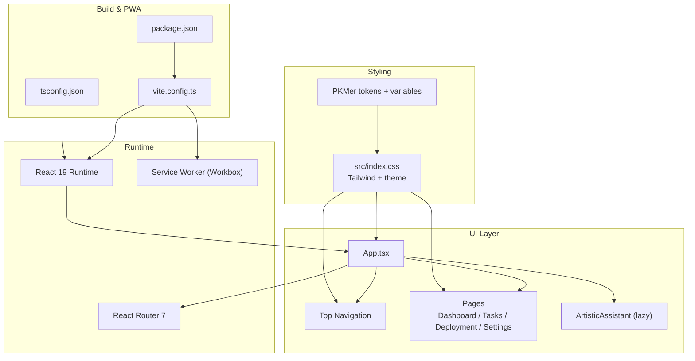
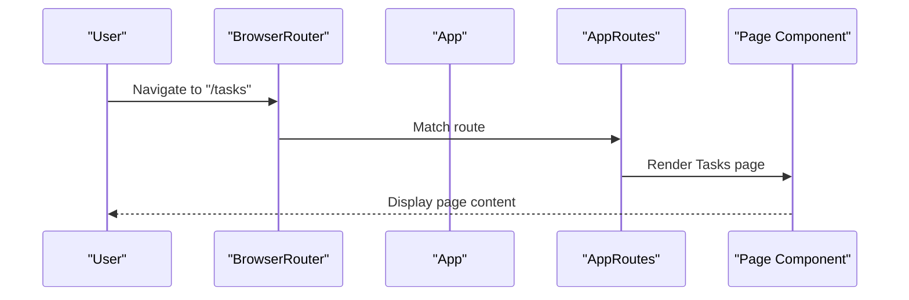
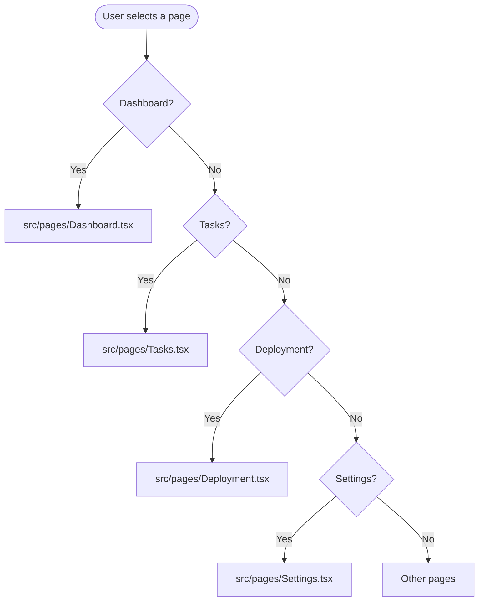
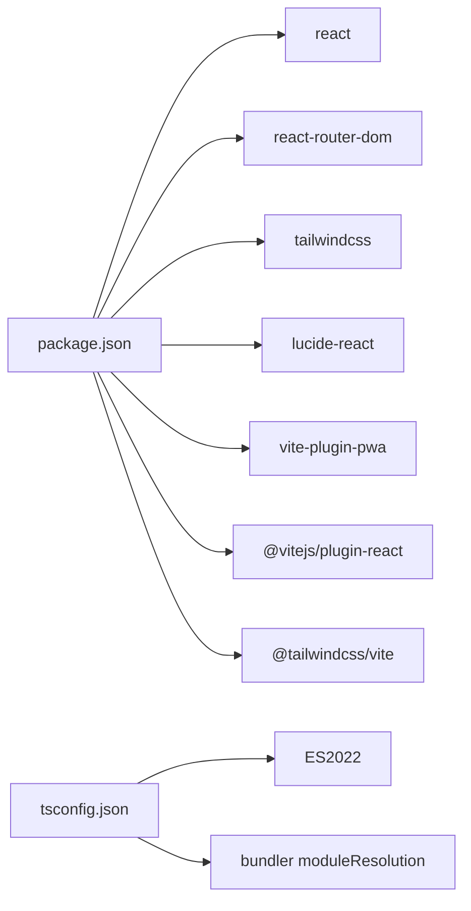

# Frontend Application Architecture

<cite>
**Referenced Files in This Document**
- [src/main.tsx](file://src/main.tsx)
- [src/App.tsx](file://src/App.tsx)
- [src/index.css](file://src/index.css)
- [src/components/PageHeader.tsx](file://src/components/PageHeader.tsx)
- [src/lib/daily-todos-storage.ts](file://src/lib/daily-todos-storage.ts)
- [src/lib/deploy-api-url.ts](file://src/lib/deploy-api-url.ts)
- [src/pages/Dashboard.tsx](file://src/pages/Dashboard.tsx)
- [src/pages/Tasks.tsx](file://src/pages/Tasks.tsx)
- [src/pages/Deployment.tsx](file://src/pages/Deployment.tsx)
- [src/pages/Settings.tsx](file://src/pages/Settings.tsx)
- [vite.config.ts](file://vite.config.ts)
- [package.json](file://package.json)
- [tsconfig.json](file://tsconfig.json)
- [dev-dist/sw.js](file://dev-dist/sw.js)
- [dev-dist/registerSW.js](file://dev-dist/registerSW.js)
</cite>

## Table of Contents
1. [Introduction](#introduction)
2. [Project Structure](#project-structure)
3. [Core Components](#core-components)
4. [Architecture Overview](#architecture-overview)
5. [Detailed Component Analysis](#detailed-component-analysis)
6. [Dependency Analysis](#dependency-analysis)
7. [Performance Considerations](#performance-considerations)
8. [Troubleshooting Guide](#troubleshooting-guide)
9. [Conclusion](#conclusion)

## Introduction
This document describes the frontend architecture of a React-based application built with TypeScript, Vite, and TailwindCSS 4.14. It covers the component-based structure, routing with React Router, state management patterns, styling approach, page-based architecture, Progressive Web App (PWA) capabilities, build configuration, and responsive design principles. The application exposes a bottom navigation shell and routes to dashboard, tasks, deployment, AI assistant, and settings pages.

## Project Structure
The frontend is organized around a small set of entry points, shared components, and page-specific modules. Routing is centralized in the App component, while styling leverages TailwindCSS 4.14 with a custom theme and PKMer design tokens. Build and PWA configuration are handled by Vite and the PWA plugin.

**Diagram sources**
- [src/main.tsx:1-11](file://src/main.tsx#L1-L11)
- [src/App.tsx:1-136](file://src/App.tsx#L1-L136)
- [src/index.css:1-1597](file://src/index.css#L1-L1597)
- [src/components/PageHeader.tsx:1-63](file://src/components/PageHeader.tsx#L1-L63)
- [src/pages/Dashboard.tsx:1-114](file://src/pages/Dashboard.tsx#L1-L114)
- [src/pages/Tasks.tsx:1-542](file://src/pages/Tasks.tsx#L1-L542)
- [src/pages/Deployment.tsx:1-1068](file://src/pages/Deployment.tsx#L1-L1068)
- [src/pages/Settings.tsx:1-348](file://src/pages/Settings.tsx#L1-L348)
- [vite.config.ts:1-111](file://vite.config.ts#L1-L111)
- [package.json:1-99](file://package.json#L1-L99)
- [tsconfig.json:1-28](file://tsconfig.json#L1-L28)
- [dev-dist/sw.js:1-93](file://dev-dist/sw.js#L1-L93)
- [dev-dist/registerSW.js:1-1](file://dev-dist/registerSW.js#L1-L1)

**Section sources**
- [src/main.tsx:1-11](file://src/main.tsx#L1-L11)
- [src/App.tsx:1-136](file://src/App.tsx#L1-L136)
- [vite.config.ts:1-111](file://vite.config.ts#L1-L111)
- [package.json:1-99](file://package.json#L1-L99)
- [tsconfig.json:1-28](file://tsconfig.json#L1-L28)

## Core Components
- Application entry point initializes React and renders the root App component.
- App composes routing, a top navigation bar, and page shells. It lazily loads the AI Assistant page and defines navigation items.
- Shared PageHeader component standardizes page titles, subtitles, icons, and optional actions.
- Local storage utilities encapsulate daily todo persistence and Jira integration helpers.

Key implementation references:
- Entry and root render: [src/main.tsx:1-11](file://src/main.tsx#L1-L11)
- App routing and navigation: [src/App.tsx:1-136](file://src/App.tsx#L1-L136)
- PageHeader props and rendering: [src/components/PageHeader.tsx:1-63](file://src/components/PageHeader.tsx#L1-L63)
- Daily todos storage helpers: [src/lib/daily-todos-storage.ts:1-133](file://src/lib/daily-todos-storage.ts#L1-L133)

**Section sources**
- [src/main.tsx:1-11](file://src/main.tsx#L1-L11)
- [src/App.tsx:1-136](file://src/App.tsx#L1-L136)
- [src/components/PageHeader.tsx:1-63](file://src/components/PageHeader.tsx#L1-L63)
- [src/lib/daily-todos-storage.ts:1-133](file://src/lib/daily-todos-storage.ts#L1-L133)

## Architecture Overview
The application follows a component-based architecture with:
- StrictMode root and React 19
- React Router v7 for client-side routing
- Lazy loading for heavy pages (AI Assistant)
- TailwindCSS 4.14 with a custom theme and PKMer color tokens
- Vite build with PWA support and dynamic proxy for deploy API

**Diagram sources**
- [src/App.tsx:1-136](file://src/App.tsx#L1-L136)
- [src/index.css:1-1597](file://src/index.css#L1-L1597)
- [vite.config.ts:1-111](file://vite.config.ts#L1-L111)
- [package.json:1-99](file://package.json#L1-L99)
- [tsconfig.json:1-28](file://tsconfig.json#L1-L28)
- [dev-dist/sw.js:1-93](file://dev-dist/sw.js#L1-L93)

## Detailed Component Analysis

### Application Shell and Routing
- App wraps the entire UI in a router and conditionally renders either the main app shell or a floating dock for Electron.
- AppRoutes defines all routes and redirects missing paths to the default route.
- TopNav renders a glass-like bottom navigation with Lucide icons and active state detection.

**Diagram sources**
- [src/App.tsx:78-108](file://src/App.tsx#L78-L108)
- [src/App.tsx:121-127](file://src/App.tsx#L121-L127)

**Section sources**
- [src/App.tsx:1-136](file://src/App.tsx#L1-L136)

### Page-Based Architecture
- Dashboard: Grid of quick-action cards linking to related pages.
- Tasks: Local-first todo list with date navigation, drag-and-drop reordering, editing, and Jira integration.
- Deployment: Pipeline editor with SSE-driven live logs, templates, favorites, and recent usage.
- Settings: Environment and project catalog management with .env write-back.

**Diagram sources**
- [src/pages/Dashboard.tsx:1-114](file://src/pages/Dashboard.tsx#L1-L114)
- [src/pages/Tasks.tsx:1-542](file://src/pages/Tasks.tsx#L1-L542)
- [src/pages/Deployment.tsx:1-1068](file://src/pages/Deployment.tsx#L1-L1068)
- [src/pages/Settings.tsx:1-348](file://src/pages/Settings.tsx#L1-L348)

**Section sources**
- [src/pages/Dashboard.tsx:1-114](file://src/pages/Dashboard.tsx#L1-L114)
- [src/pages/Tasks.tsx:1-542](file://src/pages/Tasks.tsx#L1-L542)
- [src/pages/Deployment.tsx:1-1068](file://src/pages/Deployment.tsx#L1-L1068)
- [src/pages/Settings.tsx:1-348](file://src/pages/Settings.tsx#L1-L348)

### State Management Patterns
- Local state with React hooks inside pages (useState, useEffect, useMemo, useCallback).
- Browser storage for persistence (localStorage for tasks and deployment templates).
- URL search params and session storage for transient state (e.g., deployment run snapshot).
- No external state library is used; patterns rely on component-local and persisted state.

Representative references:
- Tasks page state and effects: [src/pages/Tasks.tsx:136-210](file://src/pages/Tasks.tsx#L136-L210)
- Deployment state and SSE: [src/pages/Deployment.tsx:88-267](file://src/pages/Deployment.tsx#L88-L267)
- Storage helpers: [src/lib/daily-todos-storage.ts:44-56](file://src/lib/daily-todos-storage.ts#L44-L56)

**Section sources**
- [src/pages/Tasks.tsx:136-210](file://src/pages/Tasks.tsx#L136-L210)
- [src/pages/Deployment.tsx:88-267](file://src/pages/Deployment.tsx#L88-L267)
- [src/lib/daily-todos-storage.ts:44-56](file://src/lib/daily-todos-storage.ts#L44-L56)

### Styling Approach with TailwindCSS 4.14
- Global CSS imports Tailwind directives and PKMer theme variables.
- Semantic tokens map to PKMer color variables for consistent theming.
- Utilities are applied via className attributes across components and pages.
- Responsive breakpoints and spacing tokens are used throughout.

References:
- Tailwind and theme imports: [src/index.css:1-22](file://src/index.css#L1-L22)
- Semantic tokens and color mappings: [src/index.css:25-91](file://src/index.css#L25-L91)
- Bottom navigation styles: [src/index.css:186-304](file://src/index.css#L186-L304)
- Page utilities and components: [src/index.css:306-800](file://src/index.css#L306-L800)

**Section sources**
- [src/index.css:1-22](file://src/index.css#L1-L22)
- [src/index.css:25-91](file://src/index.css#L25-L91)
- [src/index.css:186-304](file://src/index.css#L186-L304)
- [src/index.css:306-800](file://src/index.css#L306-L800)

### PWA Capabilities and Offline Functionality
- Vite PWA plugin configures manifest, assets, and Workbox strategies.
- Runtime caching excludes /api in development to avoid caching HTML errors; in production, API traffic uses NetworkFirst with a named cache.
- Maximum file size cache is increased to accommodate large fonts.
- Service worker registration is included in development via a dedicated script.

References:
- PWA plugin and Workbox config: [vite.config.ts:21-78](file://vite.config.ts#L21-L78)
- Dev SW registration: [dev-dist/registerSW.js:1-1](file://dev-dist/registerSW.js#L1-L1)
- SW behavior and routes: [dev-dist/sw.js:70-92](file://dev-dist/sw.js#L70-L92)

**Section sources**
- [vite.config.ts:21-78](file://vite.config.ts#L21-L78)
- [dev-dist/registerSW.js:1-1](file://dev-dist/registerSW.js#L1-L1)
- [dev-dist/sw.js:70-92](file://dev-dist/sw.js#L70-L92)

### Build Configuration with Vite
- Plugins: React, TailwindCSS, PWA (excluded for Electron builds), and a dynamic deploy API proxy.
- Define constants for API keys and environment variables.
- Aliases (e.g., @/*) simplify imports.
- HMR controlled by environment variable to reduce flicker during agent edits.
- Base path differs for Electron vs web builds.

References:
- Plugin stack and aliases: [vite.config.ts:80-102](file://vite.config.ts#L80-L102)
- Dev server and HMR: [vite.config.ts:103-109](file://vite.config.ts#L103-L109)
- Electron client exclusion: [vite.config.ts:18-19](file://vite.config.ts#L18-L19)

**Section sources**
- [vite.config.ts:80-109](file://vite.config.ts#L80-L109)

### Component Composition and Prop Drilling
- App composes routes and navigation; pages receive minimal props via routing.
- PageHeader accepts icon, title, subtitle, and actions, reducing duplication across pages.
- No context providers are present; props are passed down explicitly to avoid deep drilling.

References:
- App composition: [src/App.tsx:110-127](file://src/App.tsx#L110-L127)
- PageHeader interface and usage: [src/components/PageHeader.tsx:4-10](file://src/components/PageHeader.tsx#L4-L10)

**Section sources**
- [src/App.tsx:110-127](file://src/App.tsx#L110-L127)
- [src/components/PageHeader.tsx:4-10](file://src/components/PageHeader.tsx#L4-L10)

## Dependency Analysis
The frontend depends on React 19, React Router 7, TailwindCSS 4.14, and Lucide icons. Build-time dependencies include Vite, PWA plugin, and the deploy API proxy plugin. TypeScript configuration targets ES2022 with bundler module resolution.

**Diagram sources**
- [package.json:31-60](file://package.json#L31-L60)
- [tsconfig.json:3-26](file://tsconfig.json#L3-L26)

**Section sources**
- [package.json:31-60](file://package.json#L31-L60)
- [tsconfig.json:3-26](file://tsconfig.json#L3-L26)

## Performance Considerations
- Lazy loading reduces initial bundle size for heavy pages.
- Workbox runtime caching avoids caching API responses in development to prevent stale HTML errors; production uses NetworkFirst with a dedicated cache name.
- HMR can be disabled via environment variable to reduce flicker during agent edits.
- Large font files are allowed by increasing maximum cache size to accommodate assets.

[No sources needed since this section provides general guidance]

## Troubleshooting Guide
Common issues and checks:
- API connectivity: Verify deploy API base URL and port; ensure Vite proxy is enabled in development.
- PWA installation: Confirm service worker registration and manifest configuration.
- Local storage persistence: Validate keys and cleanup logic for empty dates.
- Navigation: Ensure route paths match nav items and default route redirection.

References:
- Deploy API URL helper: [src/lib/deploy-api-url.ts:6-27](file://src/lib/deploy-api-url.ts#L6-L27)
- PWA config and runtime caching: [vite.config.ts:55-77](file://vite.config.ts#L55-L77)
- Daily todos cleanup: [src/lib/daily-todos-storage.ts:27-33](file://src/lib/daily-todos-storage.ts#L27-L33)
- Default route and redirects: [src/App.tsx:81-105](file://src/App.tsx#L81-L105)

**Section sources**
- [src/lib/deploy-api-url.ts:6-27](file://src/lib/deploy-api-url.ts#L6-L27)
- [vite.config.ts:55-77](file://vite.config.ts#L55-L77)
- [src/lib/daily-todos-storage.ts:27-33](file://src/lib/daily-todos-storage.ts#L27-L33)
- [src/App.tsx:81-105](file://src/App.tsx#L81-L105)

## Conclusion
The frontend employs a clean, component-based architecture with React 19 and React Router 7, styled with TailwindCSS 4.14 and a custom theme. Routing is centralized, pages are modular, and state is managed locally with persistence where appropriate. The build system integrates Vite, PWA, and a dynamic deploy API proxy, enabling both web and desktop deployments. The design emphasizes responsiveness, accessibility, and maintainability through shared components and consistent styling tokens.